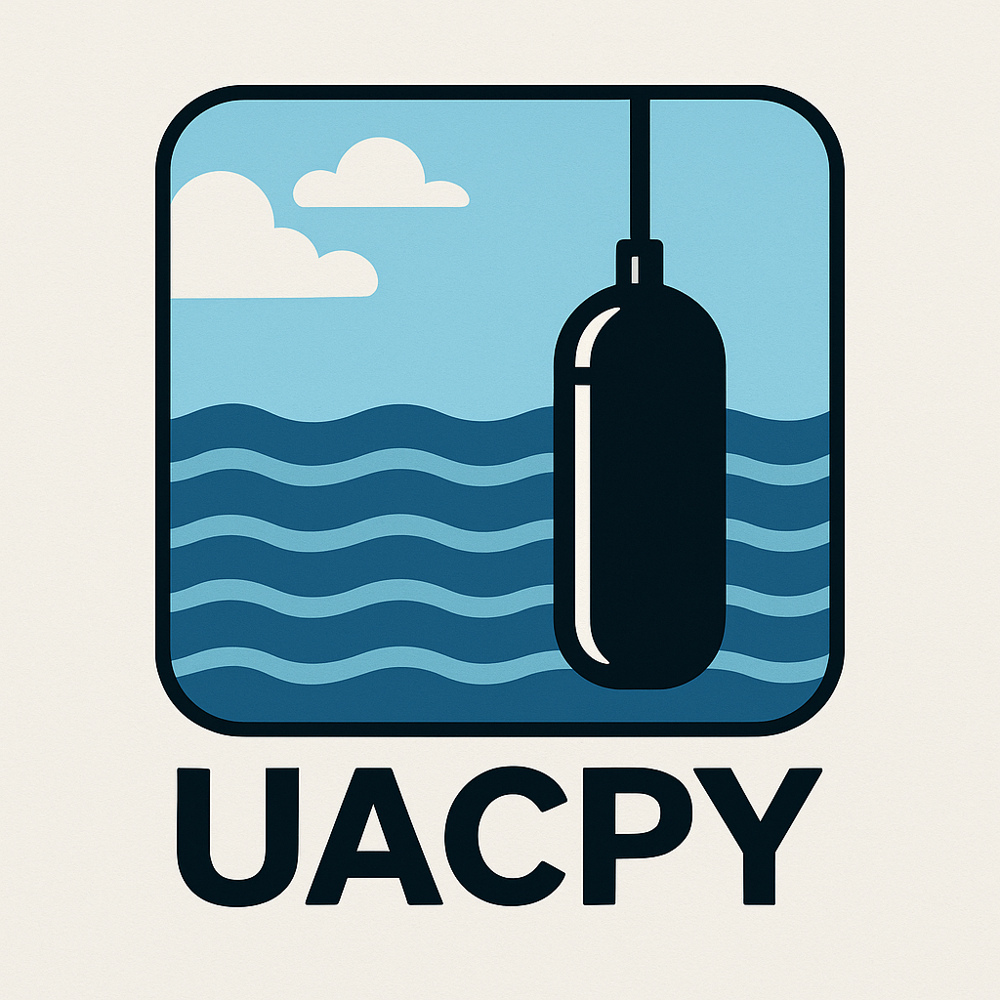

<p align="center">
  
</p>

# 🌊 Underwater Acoustic Propagation for Python 🌊

<p align="center">
  <a href="#"></a>
  <a href="#"></a>
  <a href="#"></a>
</p>

## 🚀 Vision & Motivation

For decades, underwater acoustic propagation models have been
implemented in highly optimized Fortran/C code. For many years, wrapping 
these models in MATLAB was the natural solution adopted by the scientific 
community. As Python has become a dominant language in scientific computing, 
a noticeable gap has emerged. Despite multiple efforts to wrap or re-implement 
these models, Python users still lack a unified, comprehensive, and up-to-date 
solution.

**UACPY is an attempt to close that gap.**\
It was created for researchers, engineers, oceanographers, and acousticians 
who need underwater acoustic modeling to be more open, consistent, 
transparent, and reproducible. It builds on decades of pioneering work in 
the field and aims to provide a shared foundation for comparing models, 
validating results, running experiments, and developing new ideas.

This project began as an AI-assisted (Claude Code with Sonnet 4.5, Opus 4.6 
and 4.7) initiative to reduce early development time, but going forward it 
will be maintained manually by its author—without autonomous AI-driven 
modifications.

Community feedback, verification, and contributions are warmly 
encouraged. The project’s success depends on collective effort; the 
codebase is far too large and complex for one person to maintain alone 
in their spare time. The goal is for this module to be truly 
community-driven.


> **⚠️ Note:** UACPY is *not* production‑ready. Expect missing features,
> inconsistencies, and the need for validation.


## 🔍 What Is UACPY?

UACPY provides:

-   A unified Python API for major underwater acoustic propagation
    models
-   High‑level tools for configuring environments, sources, receivers,
    media, bathymetry, and boundaries
-   Propagation modeling outputs (TL grids, eigenrays, mode fields, PE
    fields, arrivals, reflection coefficients)
-   Signal processing toolbox (waveform generation, matched filtering,
    beamforming, spectral analysis, correlation)
-   Ambient noise modeling (Wenz curves, wind, shipping, thermal noise)
-   Visualization helpers for rays, TL maps, modes, fields, and
    comparisons
-   Modular architecture that allows adding new models or backends

### Current Goals

-   Provide clean, high‑level Python access to classical models
-   Standardize I/O, parameter structures, and environmental
    descriptions
-   Lower the barrier for experimentation, benchmarking & teaching
-   Promote transparent, repeatable acoustic modeling workflows


## 🧭 Supported Propagation Models

### ✔️ Implemented or In Progress

-   **Bellhop** --- Ray/beam tracing
-   **Kraken** --- Normal modes
-   **Scooter** --- Fast‑field / normal modes
-   **SPARC** --- PE fast field
-   **RAM** (mpiramS) --- Parabolic equation (broadband + TL)
-   **OASES** --- Full suite: OAST (TL), OASN (modes), OASR (reflection), OASP (PE)
-   **Bounce** --- Reflection coefficients


## 🛠️ Hardening Roadmap

Because the initial codebase was bootstrapped with an LLM, the highest‑value
next steps are *auditing* rather than new features. The items below are
meant as a checklist for contributors who want to help make UACPY
trustworthy for research use. Each one is a legitimate open question —
please open an issue or PR for anything you investigate.

### 🧱 Architecture & API audit

-   Review the `PropagationModel` base class and the per‑model overrides
    for consistency (method signatures, return types, `_UNSET` sentinel
    usage, `run()` vs `compute_tl()` contracts).
-   Confirm that every model actually honors the shared `Environment`
    contract (bathymetry, altimetry, layered bottoms, range‑dependent
    SSP). The capability matrix in `DOCUMENTATION.md` is a claim, not a
    proof — it needs spot‑checking.
-   Sanity‑check naming across `core/`, `models/`, `io/`,
    `visualization/` for duplicated concepts, inconsistent units
    (km vs. m), and drifted conventions.
-   Identify over‑engineered abstractions (class hierarchies that exist
    “just in case”) and under‑engineered gaps (real edge cases left
    unhandled).

### 🔬 Native model re‑validation

Several vendored models were modified in‑tree. Every modification is a
potential source of silent numerical drift and needs an independent
check.

-   **mpiramS (RAM):** OpenMP race‑condition fix, NaN‑safe complex init,
    double‑precision promotion, range‑dependent sediment, I/O rewrite.
    See `uacpy/third_party/MODIFICATIONS.md`. Rerun the original
    published test cases against an unmodified mpiramS build and diff
    the outputs.
-   **KrakenField:** out‑of‑bounds sentinel fix in `field.f90` — confirm
    it doesn’t alter mode amplitudes in regimes that previously worked.
-   **UACPY RAM TL formula**
    (`TL = -20·log10(|psif|·4π) + 10·log10(r)`): validate against
    reference TL curves for at least one shallow‑water and one
    deep‑water benchmark (e.g. ASA 1990 benchmark problems).
-   Cross‑model regression: the same environment driven through Bellhop,
    Kraken (field), Scooter, RAM, and OASES should agree within expected
    tolerances. Build a small benchmark suite that enforces this and
    fails loudly when a model drifts.

### 🐍 Python‑side code review

-   **Dead code / hallucinated features.** LLMs frequently generate
    plausible‑looking code paths that are never reached or keywords that
    the native binary silently ignores. Grep for unused functions,
    unreachable branches, and parameters that never make it into the
    generated `.env` / `.flp` / OASES input files.
-   **Doc ↔ code drift.** `DOCUMENTATION.md` was written partly from
    source inspection, but parameter defaults and behavior may have
    drifted. Every signature and default in the doc should match the
    code.
-   **Error handling.** Check that failures (missing executable, failed
    subprocess, malformed output file, NaN TL) raise clean, documented
    exceptions rather than bare `RuntimeError` with unhelpful messages.
-   **Security of file I/O and `subprocess` calls.** The model wrappers
    launch native binaries with user‑provided paths and parameters —
    audit for command injection, path traversal, unbounded memory reads
    on large output files, and unchecked temp‑file cleanup.
-   **Magic numbers.** Defaults for `cmin`, `cmax`, `n_mesh`, absorbing
    layer widths, etc. were often chosen by heuristic. Trace each one to
    a reference (paper, manual) or mark it as a tunable heuristic.

### 📊 Visualization / plot utility review

The `uacpy/visualization/` module (`plots.py`, `quickplot.py`, `style.py`)
was largely LLM‑generated and is one of the most error‑prone surfaces:
plotting code is easy to write plausibly but hard to get *correct*.

-   **Axes, units, and orientation.** Verify every plot uses the right
    axis units (m vs km, Hz vs kHz, degrees vs radians), that depth
    increases downward on TL/ray plots, and that colorbars label TL in
    dB with a meaningful range.
-   **Colormaps and dynamic range.** Confirm `jet_r` / chosen defaults
    don’t hide low‑TL structure; check that `tl_min`/`tl_max` clipping
    matches the physical regime (shallow water vs long‑range deep
    water).
-   **Overlays.** Bathymetry, SSP, source/receiver markers, layered
    bottoms, and altimetry must be drawn in the same coordinate frame as
    the field they overlay — off‑by‑one conversions between range arrays
    and grid centers are a common LLM bug.
-   **Ray coloring.** The `color_by_bounces` logic classifies direct /
    surface‑only / bottom‑only / both‑bounced paths — spot‑check against
    the underlying arrivals data for a scenario where each class is
    expected.
-   **Mode plots.** Normalization, sign convention, and mode‑number
    ordering should match what `Kraken`/`OASN` actually return; plot
    labels should match the wavenumber in metadata.
-   **Comparison helpers.** `compare_models`, `compare_range_cuts`, and
    the statistics plots interpolate across potentially different
    grids — confirm the interpolation is honest and that disagreements
    aren’t hidden by resampling.
-   **Dead / unreachable plot functions.** The visualization API surface
    is large; some functions may never be called by any example or test.
    Prune or document them.
-   **Style / reproducibility.** `style.py` mutates global matplotlib
    state on import. Verify this doesn’t silently break downstream users
    who want their own rcParams.

### 🧪 Test suite audit

-   Distinguish *smoke tests* (does it run?) from *validation tests*
    (does it give the right answer?). Many current tests are closer to
    the former.
-   Add reference‑case regression tests with fixed seeds and tolerances:
    ASA 1990 benchmarks, Pekeris waveguide, Munk deep‑channel,
    Jensen & Kuperman textbook problems.
-   Confirm the `slow`, `requires_binary`, `requires_oases`,
    `integration` markers are applied correctly; a test that silently
    skips when a binary is missing is worse than a test that fails.
-   Check that every example script in `uacpy/examples/` runs to
    completion and produces a sensible plot — LLM‑generated examples
    often drift out of sync with the API.

### 📦 Build, install, and packaging

-   Reproduce the install on a clean Linux VM, macOS, and WSL. Fortran
    toolchain differences (gfortran versions, flag incompatibilities)
    are a common cause of silent miscompilation.
-   Verify that `install.sh` and `install.bat` agree on output binary
    names and locations.
-   Make sure OASES download URLs still work and the downloaded archive
    hash matches what the install script expects.
-   Pin a known‑good Python dependency set (numpy / scipy / matplotlib
    version combinations that have been exercised together).


### 🔁 CI / CD

UACPY currently has no automated pipeline — every check is manual. Before
tagging a release this has to change:

-   **Lint + type check on every push**: `flake8`, optionally `mypy`,
    on the Python source. Cheap, catches drift fast.
-   **Non‑binary test suite on every push**: `pytest -m "not requires_binary"`
    across Python 3.8 → 3.13. Runs in seconds and validates the pure‑Python
    layer (I/O, units, signal, noise).
-   **Full test suite on a nightly / release schedule**: builds the Fortran
    and C/C++ binaries via `install.sh` on a clean runner, runs the full
    `pytest` including `requires_binary` and `requires_oases` markers.
    Fortran toolchain drift (gfortran versions, MPI, CUDA) is where
    silent miscompilation usually hides.
-   **Matrix build check**: Ubuntu, macOS, Windows (WSL at minimum).
    `install.sh` vs `install.bat` must not diverge.
-   **Release automation**: on tag push, run the full suite, build an
    sdist (binaries not included — users still run `install.sh` or the
    future per‑platform wheel job), and publish to PyPI.
-   **Benchmark regression job**: a small set of canonical scenarios
    whose expected TL / arrival times are checked against tolerances.
    Any PR that moves a TL value by more than the tolerance must fail
    loudly. Without this, any silent numerical regression in a native
    model or wrapper goes unnoticed.

### 🌍 Community & process

-   Start an issue template for benchmark deviations (model, scenario,
    expected vs observed, reproducer).
-   Solicit targeted reviews from domain experts on specific models
    (ray tracing, modes, PE) rather than a single full‑project review —
    underwater acoustics expertise is rarely breadth‑first.

**If you are evaluating UACPY for a project: do not trust any specific
number produced by it until at least the re‑validation bullets above have
been independently verified for the model and regime you care about.**

## 🔮 Ideas for Future Work

### ➕ Model‑Level Improvements

-   Support for *all* features of each native model
-   GPU acceleration for more models
-   Full 3D propagation support (multiple approaches)

### ➕ Environmental Data Integration

-   Global bathymetry (GEBCO, SRTM)
-   NOAA/IOOS/CMEMS oceanographic fields (temperature, salinity, sound
    speed)
-   On‑the‑fly extraction, caching, and mesh generation

### ➕ Framework & Tools

-   Scenario‑based batch simulations
-   Reproducible experiment containers
-   Interactive dashboards for TL/modes visualization


## 📦 Installation

Linux is currently the primary supported platform.\
Windows and macOS should work with similar steps, though compilation
requires toolchain adjustments.

### 1. Install dependencies

-   Fortran compiler
-   C/C++ compiler
-   (Optional) CUDA toolkit
-   (Windows) MSYS2 or WSL

### 2. Create a virtual environment

``` bash
python -m venv uacpy_venv
source uacpy_venv/bin/activate
```

### 3. Clone and install

``` bash
git clone https://github.com/ErVuL/uacpy.git
cd uacpy
pip install -e .
./install.sh        # Linux / macOS
# or
install.bat         # Windows
```

The installer compiles OALIB, OASES, BellhopCUDA, and other required
binaries, then places them inside UACPY's internal directory for API
access.

### Uninstall

``` bash
pip uninstall uacpy
rm -rf uacpy
```

## 📚 Documentation & Examples

The full API reference lives in a single file:
[`DOCUMENTATION.md`](./DOCUMENTATION.md) — quick start, environment setup,
per-model signatures, visualization, signal processing, noise, units, and
troubleshooting.

Inside `uacpy/examples/` you will find 25+ example scripts covering:

-   Transmission loss (TL) computations
-   Ray tracing & eigenray extraction
-   Normal‑mode fields
-   Parabolic‑equation comparisons
-   BellhopCUDA demos
-   Reflection coefficients (Bounce)
-   OASES suite examples
-   Time-domain propagation (SPARC)
-   Signal processing (waveform generation, chirps, filtering)
-   Ambient noise modeling (Wenz curves, wind, shipping)
-   Visualization tools

More examples and tutorials are planned.


## 🧪 Testing

UACPY uses **pytest** with custom markers for categorizing tests.

### Run all tests

``` bash
cd uacpy
pytest uacpy/tests/
```

### Run a specific test file

``` bash
pytest uacpy/tests/test_models.py
```

### Run a single test

``` bash
pytest uacpy/tests/test_models.py::TestClassName::test_method -v
```

### Test markers

Tests use custom markers to allow selective execution:

- `slow` -- Long-running tests (broadband, large grids)
- `requires_binary` -- Tests that need compiled native binaries (Fortran/C)
- `requires_oases` -- Tests that need compiled OASES binaries
- `integration` -- End-to-end integration tests

``` bash
# Skip slow tests
pytest uacpy/tests/ -m "not slow"

# Run only integration tests
pytest uacpy/tests/ -m "integration"

# Run only tests that don't need compiled binaries
pytest uacpy/tests/ -m "not requires_binary"

# Skip OASES tests (if OASES is not installed)
pytest uacpy/tests/ -m "not requires_oases"
```

### Run examples as a smoke test

All example scripts can be run directly:

``` bash
python uacpy/examples/example_01_basic_shallow_water.py
```


## 🙏 Acknowledgments

UACPY would not exist without decades of prior work by the underwater
acoustics community. Every propagation model shipped here was designed,
implemented, and validated elsewhere --- UACPY only provides a unified
Python interface around them. Each vendored or adapted codebase is
credited below with its origin, what UACPY uses from it, and whether
the source has been modified. When modifications were made, full diffs
are available in [MODIFICATIONS.md](./uacpy/third_party/MODIFICATIONS.md).

### Acoustics Toolbox --- Bellhop, Kraken, KrakenField, Scooter, SPARC, Bounce

Michael B. Porter --- http://oalib.hlsresearch.com/AcousticsToolbox/
- Porter, *The BELLHOP Manual and User's Guide*, 2011
- Porter, *The KRAKEN Normal Mode Program*, 1992

Porter's Acoustics Toolbox provides Bellhop (ray/beam tracing), Kraken
and KrakenField (normal modes and range-dependent mode fields), Scooter
(fast field), SPARC (time-domain PE), and Bounce (reflection
coefficients). UACPY ships the Fortran sources and compiles them
in-tree via `install.sh`.

**Modifications:** one out-of-bounds sentinel fix in
`KrakenField/field.f90`. See MODIFICATIONS.md.

### BellhopCUDA

C. S. Schmid, D. F. Schmidt, A. E. Hodgson --- https://github.com/A-New-BellHope/bellhopcuda
- *BellhopCUDA: High-Performance Acoustical Ray Tracing on GPUs*, 2020

A C++/CUDA port of BELLHOP. UACPY ships the sources and compiles them
in-tree for GPU-accelerated ray tracing.

**Modifications:** none --- used as-is.

### RAM

Michael D. Collins (Naval Research Laboratory)
- Collins, "A split-step Padé solution for the parabolic equation
  method," *JASA*, 1993

Collins' RAM is the original split-step Padé parabolic-equation
algorithm that underpins UACPY's PE model. UACPY does not ship Collins'
original Fortran; the implementation actually built is Dushaw's
mpiramS (below), which implements the same algorithm.

### mpiramS

Brian D. Dushaw --- https://zenodo.org/records/10818570

mpiramS is Dushaw's MPI-parallel, broadband Fortran implementation of
Collins' RAM algorithm. UACPY ships the Fortran sources and compiles
them in-tree.

**Modifications:** extensive --- OpenMP race-condition fix, NaN-safe
complex initialization, double-precision promotion, configurable
sediment depth points, range-dependent sediment support, multi-range
output, and an I/O rewrite. Full diffs in MODIFICATIONS.md.

### OASES --- OAST, OASN, OASR, OASP

Henrik Schmidt (Massachusetts Institute of Technology) --- https://acoustics.mit.edu/faculty/henrik/oases.html

OASES provides OAST (transmission loss), OASN (modes), OASR
(reflection), and OASP (PE). Because OASES is not redistributable,
UACPY does **not** bundle the sources; `install.sh` downloads them
directly from MIT at install time.

**Modifications:** none --- used as-is.

### arlpy

Mandar Chitre (Acoustic Research Lab, National University of Singapore) --- https://github.com/org-arl/arlpy

A small number of domain-utility functions from `arlpy.uwa`
(sound speed, absorption, density --- Mackenzie and Francois-Garrison
formulas) and `arlpy.signal` (signal-processing helpers) have been
adapted into `uacpy/core/acoustics.py` and
`uacpy/acoustic_signal/advanced.py`. Each adapted file preserves
Mandar Chitre's 2016 copyright header and cites arlpy as the source.
The scientific formulas are unchanged; only Python-level formatting
(type hints, docstrings) differs from upstream.


## 📄 Licensing

UACPY aggregates code from multiple projects, each under its own
license. Downstream users are responsible for respecting each license
when redistributing or modifying UACPY or its outputs.

| Component                  | Location                           | How it ships                                     | License                                          |
|----------------------------|------------------------------------|--------------------------------------------------|--------------------------------------------------|
| UACPY wrapper              | this repository                    | source + Python package                          | GPL-3.0                                          |
| Acoustics Toolbox (Porter) | `third_party/Acoustics-Toolbox/`   | vendored Fortran sources, **modified**           | GPL-3.0                                          |
| bellhopcuda (Schmid et al.)| `third_party/bellhopcuda/`         | vendored C++/CUDA sources, unmodified            | GPL-3.0                                          |
| mpiramS (Dushaw)           | `third_party/mpiramS/`             | vendored Fortran sources, **modified**           | Creative Commons Attribution 4.0 International   |
| arlpy utilities (Chitre)   | `uacpy/core/`, `uacpy/acoustic_signal/` | adapted (ported into UACPY sources, unmodified scientifically) | BSD-3-Clause                    |
| OASES (Schmidt, MIT)       | `third_party/oases/` (gitignored)  | downloaded at install time, **not redistributed**| Academic license --- see Henrik Schmidt's terms  |


## 📬 Contact

Questions, bug reports, and contributions are welcome. For matters not
suited to a GitHub issue (collaboration proposals, private questions,
etc.), the maintainer can be reached at:

**ervul.github@gmail.com**


## 📖 Citation

``` bibtex
@software{uacpy2026,
  title   = {UACPY: Underwater ACoustics for PYthon},
  author  = {ErVuL and UACPY Contributors},
  year    = {2026},
  url     = {https://github.com/ErVuL/uacpy}
}
```


## Other interesting projects

- https://github.com/hunterakins/pykrak
- https://github.com/signetlabdei/WOSS?tab=readme-ov-file
- https://github.com/nposdalj/PropaMod
- https://github.com/marcuskd/pyram
- https://github.com/org-arl/UnderwaterAcoustics.jl


