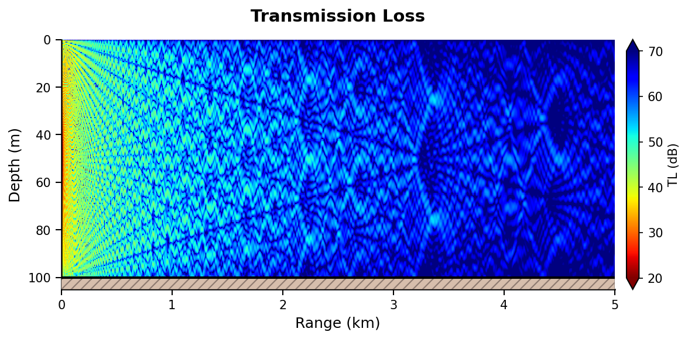

<p align="center">
  
</p>

# 🌊 Underwater Acoustic Propagation for Python 🌊

<p align="center">
  <a href="https://github.com/ErVuL/uacpy/actions/workflows/ci.yml"></a>
  <a href="#"></a>
  <a href="https://www.gnu.org/licenses/gpl-3.0"></a>
  <a href="#"></a>
  <a href="#"></a>
</p>

## 🚀 Vision & Motivation

For decades, underwater acoustic propagation models have been
implemented in highly optimized Fortran/C code. For many years, wrapping 
these models in MATLAB was the natural solution adopted by the scientific 
community. As Python has become a dominant language in scientific computing, 
a noticeable gap has emerged. Despite multiple efforts to wrap or re-implement 
these models, Python users still lack a unified, comprehensive, and up-to-date 
solution.

**UACPY is an attempt to close that gap.**\
It was created for researchers, engineers, oceanographers, and acousticians 
who need underwater acoustic modeling to be more open, consistent, 
transparent, and reproducible. It builds on decades of pioneering work in 
the field and aims to provide a shared foundation for comparing models, 
validating results, running experiments, and developing new ideas.

This project began as an AI-assisted (Claude Code with Sonnet 4.5, Opus 4.6 
and 4.7) initiative to reduce early development time, but starting with the 
first release, it will be maintained manually by its author—without autonomous 
AI-driven modifications.

Community feedback, verification, and contributions are warmly 
encouraged. The project’s success depends on collective effort; the 
codebase is far too large and complex for one person to maintain alone 
in their spare time. The goal is for this module to be truly 
community-driven.


> **⚠️ Note:** UACPY is *not* production‑ready. Expect missing features,
> inconsistencies, and the need for validation.


## 🔍 What's in UACPY?

A unified Python API over classical underwater‑acoustic propagation
models, plus the supporting pieces needed to actually use them:
high‑level `Environment` / `Source` / `Receiver` construction, signal
processing, ambient noise, and visualization.

**Propagation models**

| Model             | Kind                                                               |
|-------------------|--------------------------------------------------------------------|
| **Bellhop**       | Ray / beam tracing                                                 |
| **Kraken**        | Normal modes                                                       |
| **Scooter**       | Finite elements for range independant env                          |
| **SPARC**         | Experimental time-marched FFP for pulses in range independant env  |
| **RAM**           | Parabolic equation — auto-dispatches to mpiramS (broadband fluid), rams0.5 (elastic bottoms, broadband via Python freq loop), or ramsurf1.5 (rough surface, broadband via Python freq loop) based on the environment. All three backends support `COHERENT_TL`, `BROADBAND`, and `TIME_SERIES`. |
| **OASES**         | OAST (TL) · OASN (covariance / MFP replicas) · OASR (reflection) · OASP (broadband TRF) |
| **Bounce**        | Reflection coefficients                                            |

**Beyond propagation** — signal processing (waveforms, matched filtering,
beamforming, spectra), ambient noise (Wenz curves, wind, shipping,
thermal), and visualization helpers for TL maps, rays, modes, fields,
and cross‑model comparisons.

## 📦 Installation

**Linux is the primary supported platform.** macOS works with Homebrew.
Windows is supported **via WSL2** (Windows Subsystem for Linux) — see the
[Windows section](#-windows-via-wsl2) below for why and how.

What `install.sh` builds:

| Tool                     | Required for                                      |
|--------------------------|---------------------------------------------------|
| `python3`                | Driving `install.sh` and importing uacpy (always) |
| `gfortran`, `make`       | OALIB, mpiramS, ramsurf (`rams0.5` elastic + `ramsurf1.5` rough surface), OASES (Fortran models — always) |
| `git`                    | Cloning uacpy + submodules (always)               |
| `tar`                    | Submodule unpacking + OASES archive (always)      |
| `cmake`, `g++`/`clang++` | C++ Bellhop variant (`--bellhop cxx`)             |
| CUDA toolkit (`nvcc`)    | GPU Bellhop variant (`--bellhop cuda`) — **required** when `--bellhop cuda` is passed; the installer hard-errors if `nvcc` is absent (no silent downgrade to cxx) |
| `curl`                   | OASES archive download (`--oases yes`)            |

`install.sh` **verifies** these are present and aborts with a clear
message if anything is missing — it does *not* install system packages
itself. Provision the toolchain once for your platform, then run the
build.

**Continuous integration** runs on **Linux (`ubuntu-latest`), Python 3.12,
`--bellhop cxx`, `--oases yes`** — see
[`.github/workflows/ci.yml`](.github/workflows/ci.yml). macOS, Windows/WSL,
Python 3.10/3.11/3.13, the CUDA Bellhop build, the Fortran-only Bellhop
fallback, and the no-OASES partial install are all **supported
configurations exercised by users in practice but not validated by CI**.
Patches that touch any of those paths should be tested locally before
submission.

> **OASES supply-chain note.** `install.sh` downloads OASES over HTTPS from
> MIT and supports an optional sha256 pin via the `OASES_EXPECTED_SHA256`
> variable in the script (currently empty). Once you have a verified-good
> install on your platform, pin that hash locally for reproducibility and
> tamper-detection on subsequent rebuilds.

---

### 🐧 Linux

**1. Install dependencies**

```bash
# Debian / Ubuntu
sudo apt-get update
sudo apt-get install -y gfortran make git \
                        cmake g++ curl tar python3-venv python3-pip

# Fedora / RHEL
sudo dnf install -y gcc-gfortran make git \
                    cmake gcc-c++ curl tar python3-virtualenv python3-pip

# Arch / Manjaro
sudo pacman -S --needed gcc-fortran make git \
                        cmake gcc curl tar python python-pip
```

For GPU Bellhop, additionally install the CUDA toolkit from your
distribution or NVIDIA's site.

**2. Clone, create venv, install**

```bash
git clone --recurse-submodules https://github.com/ErVuL/uacpy.git
cd uacpy
python3 -m venv uacpy_venv
source uacpy_venv/bin/activate
pip install -e .
./install.sh
```

`./install.sh` runs interactively by default. Useful flags:

| Flag                      | Effect                                                      |
|---------------------------|-------------------------------------------------------------|
| `-y` / `--yes`            | Non-interactive — auto-detect everything                    |
| `--bellhop fortran`       | Skip the C++ build (Fortran Bellhop is always built)        |
| `--bellhop cxx`           | Also build C++ Bellhop (CPU)                                |
| `--bellhop cuda`          | Also build CUDA Bellhop (GPU, requires `nvcc`)              |
| `--oases yes` / `no`      | Download + build OASES (or skip the prompt)                 |
| `--force`                 | Skip incremental builds; do a full clean rebuild of every selected component |

---

### 🍎 macOS (NOT TESTED)

**1. Install dependencies**

```bash
# Install Homebrew (skip if 'brew' is already on PATH). See https://brew.sh
/bin/bash -c "$(curl -fsSL https://raw.githubusercontent.com/Homebrew/install/HEAD/install.sh)"

# Xcode Command Line Tools (provides make, clang, git, tar)
xcode-select --install

# Build dependencies. The 'gcc' formula provides gfortran on macOS.
brew install gcc cmake curl python
```

CUDA Bellhop is **not** available on macOS (no NVIDIA toolkit). The C++
Bellhop variant (`--bellhop cxx`) builds fine with Apple's clang.

**2. Clone, create venv, install**

```bash
git clone --recurse-submodules https://github.com/ErVuL/uacpy.git
cd uacpy
python3 -m venv uacpy_venv
source uacpy_venv/bin/activate
pip install -e .
./install.sh
```

(See the Linux section above for `install.sh` flags — they're identical
on macOS.)

---

### 🪟 Windows (via WSL2)

**uacpy on Windows runs inside WSL2 (Windows Subsystem for Linux),
following the Linux instructions above.** Smart App Control can 
block unsigned MSYS2 binaries (gfortran's `f951.exe`,`git.exe`, etc.), 
and bellhopcuda's headers conflict with MinGW's `math.h`..

You'll work like a Linux developer, but with a Windows desktop, Windows
file explorer, and Windows IDE. Plots open in normal Windows windows
(WSLg). It feels native.

#### Step 1 — Enable hardware virtualization in BIOS/UEFI

WSL2 needs CPU virtualization extensions. Some computer ship with this
**disabled by default**.

1. Reboot, press `F2` (Dell / Lenovo) or `F10` / `Esc` (HP) at the
   vendor logo to enter BIOS/UEFI.
2. Find and enable, depending on your CPU:
   - Intel: **Intel Virtualization Technology** (or **VT-x**), and
     **VT-d** if listed
   - AMD: **SVM Mode** (or **AMD-V**)
3. Save & exit (usually `F10`).

#### Step 2 — Install WSL2 + Ubuntu

In an **elevated PowerShell** (Run as Administrator):

```powershell
wsl --install -d Ubuntu
```

Reboot when prompted. After reboot an Ubuntu window should open 
automatically and asks you to set a username + password. (You can 
skip the user creation by closing it — the default user becomes 
`root`)

#### Step 3 — Install uacpy inside Ubuntu

Open Ubuntu (Start menu → "Ubuntu") and follow the **Linux / Debian**
recipe from above:

```bash
sudo apt-get update
sudo apt-get install -y gfortran make git \
                        cmake g++ curl tar python3-venv python3-pip

cd ~
git clone --recurse-submodules https://github.com/ErVuL/uacpy.git
cd uacpy
python3 -m venv uacpy_venv
source uacpy_venv/bin/activate
pip install -e .
./install.sh -y
```

> **Tip:** clone into the WSL filesystem (`~/uacpy`), **not** into
> `/mnt/c/...`. Cross-filesystem I/O is 10–20× slower and the
> Acoustics-Toolbox build does a lot of small file writes.

#### Step 4 — Pick a development workflow (NOT TESTED !)

You have three options for using uacpy from Windows:

**Option A — VS Code with the WSL extension (recommended).**
Edit and run from a Windows-native IDE; Python and uacpy execute
inside WSL transparently.

1. Install [VS Code](https://code.visualstudio.com/) for Windows.
2. Install the **WSL** extension (`ms-vscode-remote.remote-wsl`).
3. From Ubuntu: `cd ~/uacpy && code .`
   VS Code opens on Windows, auto-installs a small server in WSL.
4. In VS Code: `Ctrl+Shift+P` → *Python: Select Interpreter* →
   pick `~/uacpy/uacpy_venv/bin/python`.

Run scripts, debug, open Jupyter notebooks — everything works as if
you were on Linux. Plots open in real Windows windows via WSLg.

**Option B — Jupyter Lab in WSL, browser on Windows.**
From Ubuntu:

```bash
source ~/uacpy/uacpy_venv/bin/activate
pip install jupyterlab
jupyter lab --no-browser --ip=127.0.0.1
```

Open the `http://127.0.0.1:8888/...` URL it prints in any Windows
browser.

**Option C — Plain Ubuntu terminal.**
Run scripts directly:

```bash
cd ~/uacpy
source uacpy_venv/bin/activate
python uacpy/uacpy/examples/example_01_basic_shallow_water.py
```

Plot windows still appear on the Windows desktop (WSLg).

---

### Uninstall

```bash
pip uninstall uacpy
rm -rf uacpy
```

## ▶ Simplest example

A Pekeris waveguide — isovelocity water over a fluid half-space — at
1 kHz, plotted as a transmission-loss field.

``` python
import numpy as np
import matplotlib.pyplot as plt

import uacpy
from uacpy.models import Bellhop, RunMode
from uacpy.core.environment import BoundaryProperties
from uacpy.visualization.plots import plot_transmission_loss

# 1. Environment — isovelocity water over a fluid half-space bottom
env = uacpy.Environment(
    name="Pekeris Waveguide",
    bathymetry=100.0,
    ssp=1500.0,
    bottom=BoundaryProperties(
        acoustic_type='half-space',
        sound_speed=1600.0,
        density=1.5,
        attenuation=0.5,
    ),
)

# 2. Source — 1000 Hz, mid water column
source = uacpy.Source(depths=50.0, frequencies=1000.0)

# 3. Receiver grid — 200 depths × 500 ranges out to 5 km
#    Start ranges at the step size; r=0 has no ray data (Bellhop sentinel).
receiver = uacpy.Receiver(
    depths=np.linspace(0, 100, 200),
    ranges=np.linspace(10, 5000, 500),
)

# 4. Run Bellhop in coherent-TL mode
result = Bellhop(beam_type='B', n_beams=300, alpha=(-80, 80)).run(
    env, source, receiver, run_mode=RunMode.COHERENT_TL,
)

# 5. Plot the TL field
fig, ax = plt.subplots(figsize=(8, 4))
plot_transmission_loss(result, env, ax=ax, show_colorbar=True)
plt.tight_layout()
plt.show()
```

<p align="center">
  
</p>

## 📚 Documentation & Examples

The full API reference lives in a single file:
[`DOCUMENTATION.md`](./DOCUMENTATION.md) — quick start, environment setup,
per-model signatures, visualization, signal processing, noise, units, and
troubleshooting.

Inside `uacpy/uacpy/examples/` you will find 25 example scripts numbered
sequentially (`example_01_*.py` through `example_25_*.py`); the full
suite runs in a few minutes on a laptop. See the
[examples index](./DOCUMENTATION.md#12-examples-index) for a description
of each one.

## 🧪 Testing

UACPY uses **pytest** with custom markers for categorizing tests.

`pytest` and `pytest-xdist` are no longer pulled in by the runtime
dependency set — install the `test` extra to get them, or the `dev` extra
for the additional formatting / linting / coverage tooling:

``` bash
# For running the test suite
pip install -e ".[test]"

# For development (test deps + black, flake8, pytest-cov)
pip install -e ".[dev]"
```

### Run all tests

``` bash

cd uacpy
pytest uacpy/tests/

```

### Run a specific test file

``` bash

pytest uacpy/tests/test_models.py

```

### Run a single test

``` bash
pytest uacpy/tests/test_models.py::TestClassName::test_method -v

```

### Test markers

Tests use custom markers to allow selective execution:

- `slow` -- Long-running tests (broadband, large grids, slow examples)
- `requires_binary` -- Tests that need compiled native binaries (Fortran/C)
- `requires_oases` -- Tests that need compiled OASES binaries

``` bash

# Skip slow tests
pytest uacpy/tests/ -m "not slow"

# Run only tests that don't need compiled binaries
pytest uacpy/tests/ -m "not requires_binary"

# Skip OASES tests (if OASES is not installed)
pytest uacpy/tests/ -m "not requires_oases"

```

## 🗺️ Roadmap

Because the initial codebase was LLM‑bootstrapped, *auditing* comes before
new features. Both lists are contributor checklists — open an issue or PR
for anything you investigate. Full diffs of in‑tree native‑model changes
live in [MODIFICATIONS.md](./uacpy/third_party/MODIFICATIONS.md).

### 🛠️ Hardening & validation (priority)

- **🧱 API audit** — consistency of `PropagationModel` and per‑model overrides; spot‑check the `DOCUMENTATION.md` capability matrix; hunt drifted conventions and inconsistent units.
- **🔬 Native model re‑validation** — every in‑tree modification is potential silent numerical drift. Diff mpiramS against unmodified upstream; confirm the KrakenField OOB fix; validate the UACPY RAM TL formula; run cross‑model regressions (Bellhop / Kraken / Scooter / RAM / OASES agree within tolerance).
- **🐍 Python‑side review** — dead / hallucinated code paths, doc ↔ code drift, clean error handling, `subprocess` + file‑I/O security, magic numbers traced to references.
- **📊 Visualization review** — axes / units / orientation, colormap and dynamic‑range defaults, overlay coordinate frames, ray & mode ordering conventions, honest interpolation in comparison helpers, rcParams leakage.
- **🧪 Test suite audit** — separate smoke from validation; add reference‑case regressions (Pekeris, Munk, canonical waveguides); audit marker application; verify every `uacpy/examples/` script runs.
- **📦 Build, install, packaging** — reproduce installs on clean Linux VM / macOS / WSL; keep `install.sh` ↔ `install.bat` in sync; confirm the OASES URL + archive hash; pin a known‑good numpy / scipy / matplotlib set.
- **🔁 CI / CD** — a minimal GitHub Actions workflow runs on every push to `main` and every PR: builds the native binaries (`oalib`, `bellhop-cxx`, `mpiramS`, `ramsurf`, downloads + builds OASES), runs `flake8` (real bugs only) and the full `pytest` suite on Python 3.12 / Ubuntu (see [`.github/workflows/ci.yml`](.github/workflows/ci.yml)). Still wanted before a tagged release: nightly full suite with binaries, macOS / WSL matrix, release automation, benchmark regression job with TL / arrival tolerances.
- **🌍 Community & process** — issue template for benchmark deviations; targeted per‑model reviews by domain experts.

> **If you are evaluating UACPY for a project: do not trust any specific
> number it produces until the re‑validation items above have been
> verified for the model and regime you care about.**

### 🔮 Future scope

- **Model features** — coverage of every native model option, GPU acceleration for more models, full 3‑D propagation.
- **Environmental data** — global bathymetry (GEBCO, SRTM), NOAA / IOOS / CMEMS oceanographic fields, on‑the‑fly extraction / caching / mesh generation.
- **Framework** — scenario‑based batch simulations, reproducible experiment containers, interactive TL / mode dashboards.


## 🙏 Acknowledgments

UACPY would not exist without decades of prior work by the underwater
acoustics community. Every propagation model shipped here was designed,
implemented, and validated elsewhere --- UACPY only provides a unified
Python interface around them. Which codebases are vendored vs modified
is summarised in the [licensing table](#-licensing); full diffs for
modified sources live in
[MODIFICATIONS.md](./uacpy/third_party/MODIFICATIONS.md).

### Acoustics Toolbox --- Bellhop, Kraken, KrakenField, Scooter, SPARC, Bounce

Michael B. Porter --- http://oalib.hlsresearch.com/AcousticsToolbox/
- Porter, *The BELLHOP Manual and User's Guide*, 2011
- Porter, *The KRAKEN Normal Mode Program*, 1992

### BellhopCUDA

C. S. Schmid, D. F. Schmidt, A. E. Hodgson --- https://github.com/A-New-BellHope/bellhopcuda
- *BellhopCUDA: High-Performance Acoustical Ray Tracing on GPUs*, 2020

### RAM

Michael D. Collins (Naval Research Laboratory)
- Collins, "A split-step Padé solution for the parabolic equation
  method," *JASA*, 1993

### mpiramS

Brian D. Dushaw --- https://zenodo.org/records/10818570

### ramsurf --- Collins RAM family (rams0.5 elastic, ramsurf1.5 rough surface)

Vendored from the Quiet Oceans repackaging of David C. Calvo's NRL
distribution --- https://github.com/quiet-oceans/ramsurf

- Collins, *A split-step Padé solution for the parabolic equation method*, JASA, 1993
- Collins, *Higher-order parabolic approximations for accurate and stable elastic parabolic equations with application to interface wave propagation*, JASA, 1991 (RAMS / elastic)
- Collins, *Generalization of the split-step Padé solution* (variable surface / ramsurf), JASA 97, 2767–2770, 1995

### OASES --- OAST, OASN, OASR, OASP

Henrik Schmidt (Massachusetts Institute of Technology) --- https://acoustics.mit.edu/faculty/henrik/oases.html

### arlpy

Mandar Chitre (Acoustic Research Lab, National University of Singapore) --- https://github.com/org-arl/arlpy

Utility functions adapted into `uacpy/core/acoustics.py` preserve Mandar
Chitre's 2016 copyright header and cite arlpy as the source.


## 📄 Licensing

UACPY aggregates code from multiple projects, each under its own
license. Downstream users are responsible for respecting each license
when redistributing or modifying UACPY or its outputs.

| Component                  | Location                           | How it ships                                     | License                                          |
|----------------------------|------------------------------------|--------------------------------------------------|--------------------------------------------------|
| UACPY wrapper              | this repository                    | source + Python package                          | GPL-3.0                                          |
| Acoustics Toolbox (Porter) | `third_party/Acoustics-Toolbox/`   | vendored Fortran sources, **modified**           | GPL-3.0                                          |
| bellhopcuda (Schmid et al.)| `third_party/bellhopcuda/`         | git submodule pinned to upstream `v1.5`, unmodified | GPL-3.0                                       |
| mpiramS (Dushaw)           | `third_party/mpiramS/`             | vendored Fortran sources, **modified**           | Creative Commons Attribution 4.0 International   |
| ramsurf (Calvo / Quiet Oceans) | `third_party/ramsurf/`         | vendored Fortran sources, **modified**           | BSD-3-Clause |
| arlpy utilities (Chitre)   | `uacpy/core/`                      | adapted (ported into UACPY sources, unmodified scientifically) | BSD-3-Clause                    |
| OASES (Schmidt, MIT)       | `third_party/oases/` (gitignored)  | **optional** download at install time, **not redistributed**| Academic license --- see Henrik Schmidt's terms  |


## 📬 Contact

Questions, bug reports, and contributions are welcome. For matters not
suited to a GitHub issue (collaboration proposals, private questions,
etc.), the maintainer can be reached at:

**ervul.github@gmail.com**


## 📖 Citation

``` bibtex
@software{uacpy2026,
  title   = {UACPY: Underwater ACoustics for PYthon},
  author  = {ErVuL and UACPY Contributors},
  year    = {2026},
  url     = {https://github.com/ErVuL/uacpy}
}
```


## Other interesting projects

- https://github.com/hunterakins/pykrak
- https://github.com/signetlabdei/WOSS?tab=readme-ov-file
- https://github.com/nposdalj/PropaMod
- https://github.com/marcuskd/pyram
- https://github.com/org-arl/UnderwaterAcoustics.jl
- https://github.com/SPECFEM


