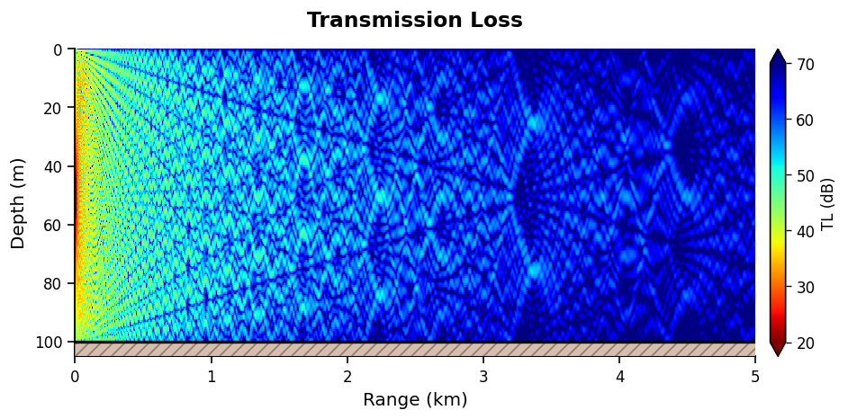

<p align="center">
  
</p>

# 🌊 Underwater Acoustic Propagation for Python 🌊

<p align="center">
  <a href="#"></a>
  <a href="https://www.gnu.org/licenses/gpl-3.0">  </a>
  <a href="#"></a>
</p>

## 🚀 Vision & Motivation

For decades, underwater acoustic propagation models have been
implemented in highly optimized Fortran/C code. For many years, wrapping 
these models in MATLAB was the natural solution adopted by the scientific 
community. As Python has become a dominant language in scientific computing, 
a noticeable gap has emerged. Despite multiple efforts to wrap or re-implement 
these models, Python users still lack a unified, comprehensive, and up-to-date 
solution.

**UACPY is an attempt to close that gap.**\
It was created for researchers, engineers, oceanographers, and acousticians 
who need underwater acoustic modeling to be more open, consistent, 
transparent, and reproducible. It builds on decades of pioneering work in 
the field and aims to provide a shared foundation for comparing models, 
validating results, running experiments, and developing new ideas.

This project began as an AI-assisted (Claude Code with Sonnet 4.5, Opus 4.6 
and 4.7) initiative to reduce early development time, but starting with the 
first release, it will be maintained manually by its author—without autonomous 
AI-driven modifications.

Community feedback, verification, and contributions are warmly 
encouraged. The project’s success depends on collective effort; the 
codebase is far too large and complex for one person to maintain alone 
in their spare time. The goal is for this module to be truly 
community-driven.


> **⚠️ Note:** UACPY is *not* production‑ready. Expect missing features,
> inconsistencies, and the need for validation.


## 🔍 What's in UACPY?

A unified Python API over classical underwater‑acoustic propagation
models, plus the supporting pieces needed to actually use them:
high‑level `Environment` / `Source` / `Receiver` construction, signal
processing, ambient noise, and visualization.

**Propagation models**

| Model             | Kind                                                               |
|-------------------|--------------------------------------------------------------------|
| **Bellhop**       | Ray / beam tracing                                                 |
| **Kraken**        | Normal modes                                                       |
| **Scooter**       | Finite elements for range independant env                          |
| **SPARC**         | Experimental time-marched FFP for pulses in range independant env  |
| **RAM** (mpiramS) | Parabolic equation                                                 |
| **OASES**         | OAST (TL) · OASN (noise) · OASR (reflection) · OASP (PE)           |
| **Bounce**        | Reflection coefficients                                            |

**Beyond propagation** — signal processing (waveforms, matched filtering,
beamforming, spectra), ambient noise (Wenz curves, wind, shipping,
thermal), and visualization helpers for TL maps, rays, modes, fields,
and cross‑model comparisons.

## 📦 Installation

Linux is currently the primary supported platform.\
Windows and macOS should work with similar steps, though compilation
requires toolchain adjustments.

### 1. Install dependencies

The build scripts (`install.sh` / `install.bat`) verify these are present and
abort with a clear message if anything is missing — they do **not** install
system packages themselves. Provision the toolchain once with the relevant
command below, then run the build script.

**Always required**

| Tool        | Purpose                                              |
|-------------|------------------------------------------------------|
| `gfortran`  | OALIB, mpiramS, OASES (all Fortran)                  |
| `make`      | Driving the upstream Makefiles                       |
| LAPACK dev  | Kraken/Scooter link with `-llapack`                  |
| `git`       | Cloning GLM (only for bellhopcxx/cuda) and uacpy itself |

**Optional**

| Tool                  | When you need it                                  |
|-----------------------|---------------------------------------------------|
| `cmake`, `g++`/`clang++` | Building the C++ Bellhop variant (`--bellhop cxx`) |
| CUDA toolkit (`nvcc`) | Building the GPU Bellhop variant (`--bellhop cuda`) |
| `curl`, `tar`         | Only when installing OASES (`--oases yes`)        |

**Per-OS install commands**

```bash
# Debian / Ubuntu
#################

sudo apt-get update
sudo apt-get install -y gfortran make liblapack-dev git \
                        cmake g++ curl tar

# Fedora / RHEL
###############

sudo dnf install -y gcc-gfortran make lapack-devel git \
                    cmake gcc-c++ curl tar

# Arch / Manjaro
################

sudo pacman -S --needed gcc-fortran make lapack git \
                        cmake gcc curl tar

# macOS
#######

# Install Homebrew (skip if 'brew' is already on PATH). See https://brew.sh
/bin/bash -c "$(curl -fsSL https://raw.githubusercontent.com/Homebrew/install/HEAD/install.sh)"

# Install Xcode Command Line Tools (provides make, clang, git, tar)
xcode-select --install

# Install build dependencies via Homebrew.
#    Note: the 'gcc' formula is what provides gfortran on macOS.
brew install gcc lapack cmake curl

# Windows / MSYS2 — run from the MSYS2 MINGW64 shell
####################################################

pacman -S --needed mingw-w64-x86_64-gcc-fortran \
                   mingw-w64-x86_64-make \
                   mingw-w64-x86_64-lapack \
                   mingw-w64-x86_64-cmake \
                   mingw-w64-x86_64-gcc \
                   git curl tar
```

For GPU Bellhop, additionally install the CUDA toolkit.

### 2. Create a virtual environment

Create the venv:

``` bash
python -m venv uacpy_venv
```

Then activate it:

``` bash
# Linux / macOS
source uacpy_venv/bin/activate

# Windows — MSYS2 MINGW64 (recommended for the install scripts)
source uacpy_venv/Scripts/activate

# Windows — cmd.exe
uacpy_venv\Scripts\activate.bat
```


### 3. Clone and install

Clone the project and its submodules, install the module and run the installation script.

``` bash
git clone --recurse-submodules https://github.com/ErVuL/uacpy.git
cd uacpy
pip install -e .
./install.sh        # Linux / macOS
# or
install.bat         # Windows
```

The installer compiles OALIB, OASES, BellhopCUDA, and other required
binaries, then places them inside UACPY's internal directory for API
access.

### Uninstall

``` bash
pip uninstall uacpy
rm -rf uacpy
```

## ▶ Simplest example

A minimal "hello world": transmission loss in a 100 m Pekeris waveguide with
Bellhop, at 1000 Hz, out to 5 km.

``` python
import numpy as np
import matplotlib.pyplot as plt

import uacpy
from uacpy.models import Bellhop, RunMode
from uacpy.core.environment import BoundaryProperties
from uacpy.visualization.plots import plot_transmission_loss

# 1. Environment — isovelocity water over a fluid half-space bottom
env = uacpy.Environment(
    name="Pekeris Waveguide",
    depth=100.0,
    sound_speed=1500.0,
    ssp_type='isovelocity',
    bottom=BoundaryProperties(
        acoustic_type='half-space',
        sound_speed=1600.0,
        density=1.5,
        attenuation=0.5,
    ),
)

# 2. Source — 1000 Hz, mid water column
source = uacpy.Source(depth=50.0, frequency=1000.0)

# 3. Receiver grid — 200 depths × 5000 ranges out to 5 km
receiver = uacpy.Receiver(
    depths=np.linspace(0, 100, 200),
    ranges=np.linspace(0, 5000, 5000),
)

# 4. Run Bellhop in coherent-TL mode
result = Bellhop(beam_type='B', n_beams=300, alpha=(-80, 80)).run(
    env, source, receiver, run_mode=RunMode.COHERENT_TL,
)

# 5. Plot the TL field
fig, ax = plt.subplots(figsize=(8, 4))
plot_transmission_loss(result, env, ax=ax, show_colorbar=True)
plt.tight_layout()
plt.show()
```

<p align="center">
  
</p>

## 📚 Documentation & Examples

The full API reference lives in a single file:
[`DOCUMENTATION.md`](./DOCUMENTATION.md) — quick start, environment setup,
per-model signatures, visualization, signal processing, noise, units, and
troubleshooting.

Inside `uacpy/examples/` you will find 25+ example scripts.

## 🧪 Testing

UACPY uses **pytest** with custom markers for categorizing tests.

### Run all tests

``` bash

cd uacpy
pytest uacpy/tests/

```

### Run a specific test file

``` bash

pytest uacpy/tests/test_models.py

```

### Run a single test

``` bash
pytest uacpy/tests/test_models.py::TestClassName::test_method -v

```

### Test markers

Tests use custom markers to allow selective execution:

- `slow` -- Long-running tests (broadband, large grids)
- `requires_binary` -- Tests that need compiled native binaries (Fortran/C)
- `requires_oases` -- Tests that need compiled OASES binaries
- `integration` -- End-to-end integration tests

``` bash

# Skip slow tests
pytest uacpy/tests/ -m "not slow"

# Run only integration tests
pytest uacpy/tests/ -m "integration"

# Run only tests that don't need compiled binaries
pytest uacpy/tests/ -m "not requires_binary"

# Skip OASES tests (if OASES is not installed)
pytest uacpy/tests/ -m "not requires_oases"

```

## 🗺️ Roadmap

Because the initial codebase was LLM‑bootstrapped, *auditing* comes before
new features. Both lists are contributor checklists — open an issue or PR
for anything you investigate. Full diffs of in‑tree native‑model changes
live in [MODIFICATIONS.md](./uacpy/third_party/MODIFICATIONS.md).

### 🛠️ Hardening & validation (priority)

- **🧱 API audit** — consistency of `PropagationModel` and per‑model overrides; spot‑check the `DOCUMENTATION.md` capability matrix; hunt drifted conventions and inconsistent units.
- **🔬 Native model re‑validation** — every in‑tree modification is potential silent numerical drift. Diff mpiramS against unmodified upstream; confirm the KrakenField OOB fix; validate the UACPY RAM TL formula; run cross‑model regressions (Bellhop / Kraken / Scooter / RAM / OASES agree within tolerance).
- **🐍 Python‑side review** — dead / hallucinated code paths, doc ↔ code drift, clean error handling, `subprocess` + file‑I/O security, magic numbers traced to references.
- **📊 Visualization review** — axes / units / orientation, colormap and dynamic‑range defaults, overlay coordinate frames, ray & mode ordering conventions, honest interpolation in comparison helpers, rcParams leakage.
- **🧪 Test suite audit** — separate smoke from validation; add reference‑case regressions (ASA 1990, Pekeris, Munk, Jensen–Kuperman); audit marker application; verify every `uacpy/examples/` script runs.
- **📦 Build, install, packaging** — reproduce installs on clean Linux VM / macOS / WSL; keep `install.sh` ↔ `install.bat` in sync; confirm the OASES URL + archive hash; pin a known‑good numpy / scipy / matplotlib set.
- **🔁 CI / CD** *(currently none; required before tagging a release)* — lint on push; non‑binary tests across Python 3.8 → 3.13; nightly full suite with binaries; Ubuntu / macOS / WSL matrix; release automation; benchmark regression job with TL / arrival tolerances.
- **🌍 Community & process** — issue template for benchmark deviations; targeted per‑model reviews by domain experts.

> **If you are evaluating UACPY for a project: do not trust any specific
> number it produces until the re‑validation items above have been
> verified for the model and regime you care about.**

### 🔮 Future scope

- **Model features** — coverage of every native model option, GPU acceleration for more models, full 3‑D propagation.
- **Environmental data** — global bathymetry (GEBCO, SRTM), NOAA / IOOS / CMEMS oceanographic fields, on‑the‑fly extraction / caching / mesh generation.
- **Framework** — scenario‑based batch simulations, reproducible experiment containers, interactive TL / mode dashboards.


## 🙏 Acknowledgments

UACPY would not exist without decades of prior work by the underwater
acoustics community. Every propagation model shipped here was designed,
implemented, and validated elsewhere --- UACPY only provides a unified
Python interface around them. Which codebases are vendored vs modified
is summarised in the [licensing table](#-licensing); full diffs for
modified sources live in
[MODIFICATIONS.md](./uacpy/third_party/MODIFICATIONS.md).

### Acoustics Toolbox --- Bellhop, Kraken, KrakenField, Scooter, SPARC, Bounce

Michael B. Porter --- http://oalib.hlsresearch.com/AcousticsToolbox/
- Porter, *The BELLHOP Manual and User's Guide*, 2011
- Porter, *The KRAKEN Normal Mode Program*, 1992

### BellhopCUDA

C. S. Schmid, D. F. Schmidt, A. E. Hodgson --- https://github.com/A-New-BellHope/bellhopcuda
- *BellhopCUDA: High-Performance Acoustical Ray Tracing on GPUs*, 2020

### RAM

Michael D. Collins (Naval Research Laboratory)
- Collins, "A split-step Padé solution for the parabolic equation
  method," *JASA*, 1993

### mpiramS

Brian D. Dushaw --- https://zenodo.org/records/10818570

### OASES --- OAST, OASN, OASR, OASP

Henrik Schmidt (Massachusetts Institute of Technology) --- https://acoustics.mit.edu/faculty/henrik/oases.html

### arlpy

Mandar Chitre (Acoustic Research Lab, National University of Singapore) --- https://github.com/org-arl/arlpy

Utility functions adapted into `uacpy/core/acoustics.py` and
`uacpy/acoustic_signal/advanced.py` preserve Mandar Chitre's 2016
copyright header and cite arlpy as the source.


## 📄 Licensing

UACPY aggregates code from multiple projects, each under its own
license. Downstream users are responsible for respecting each license
when redistributing or modifying UACPY or its outputs.

| Component                  | Location                           | How it ships                                     | License                                          |
|----------------------------|------------------------------------|--------------------------------------------------|--------------------------------------------------|
| UACPY wrapper              | this repository                    | source + Python package                          | GPL-3.0                                          |
| Acoustics Toolbox (Porter) | `third_party/Acoustics-Toolbox/`   | vendored Fortran sources, **modified**           | GPL-3.0                                          |
| bellhopcuda (Schmid et al.)| `third_party/bellhopcuda/`         | git submodule pinned to upstream `v1.5`, unmodified | GPL-3.0                                       |
| mpiramS (Dushaw)           | `third_party/mpiramS/`             | vendored Fortran sources, **modified**           | Creative Commons Attribution 4.0 International   |
| arlpy utilities (Chitre)   | `uacpy/core/`, `uacpy/acoustic_signal/` | adapted (ported into UACPY sources, unmodified scientifically) | BSD-3-Clause                    |
| OASES (Schmidt, MIT)       | `third_party/oases/` (gitignored)  | downloaded at install time, **not redistributed**| Academic license --- see Henrik Schmidt's terms  |


## 📬 Contact

Questions, bug reports, and contributions are welcome. For matters not
suited to a GitHub issue (collaboration proposals, private questions,
etc.), the maintainer can be reached at:

**ervul.github@gmail.com**


## 📖 Citation

``` bibtex
@software{uacpy2026,
  title   = {UACPY: Underwater ACoustics for PYthon},
  author  = {ErVuL and UACPY Contributors},
  year    = {2026},
  url     = {https://github.com/ErVuL/uacpy}
}
```


## Other interesting projects

- https://github.com/hunterakins/pykrak
- https://github.com/signetlabdei/WOSS?tab=readme-ov-file
- https://github.com/nposdalj/PropaMod
- https://github.com/marcuskd/pyram
- https://github.com/org-arl/UnderwaterAcoustics.jl


