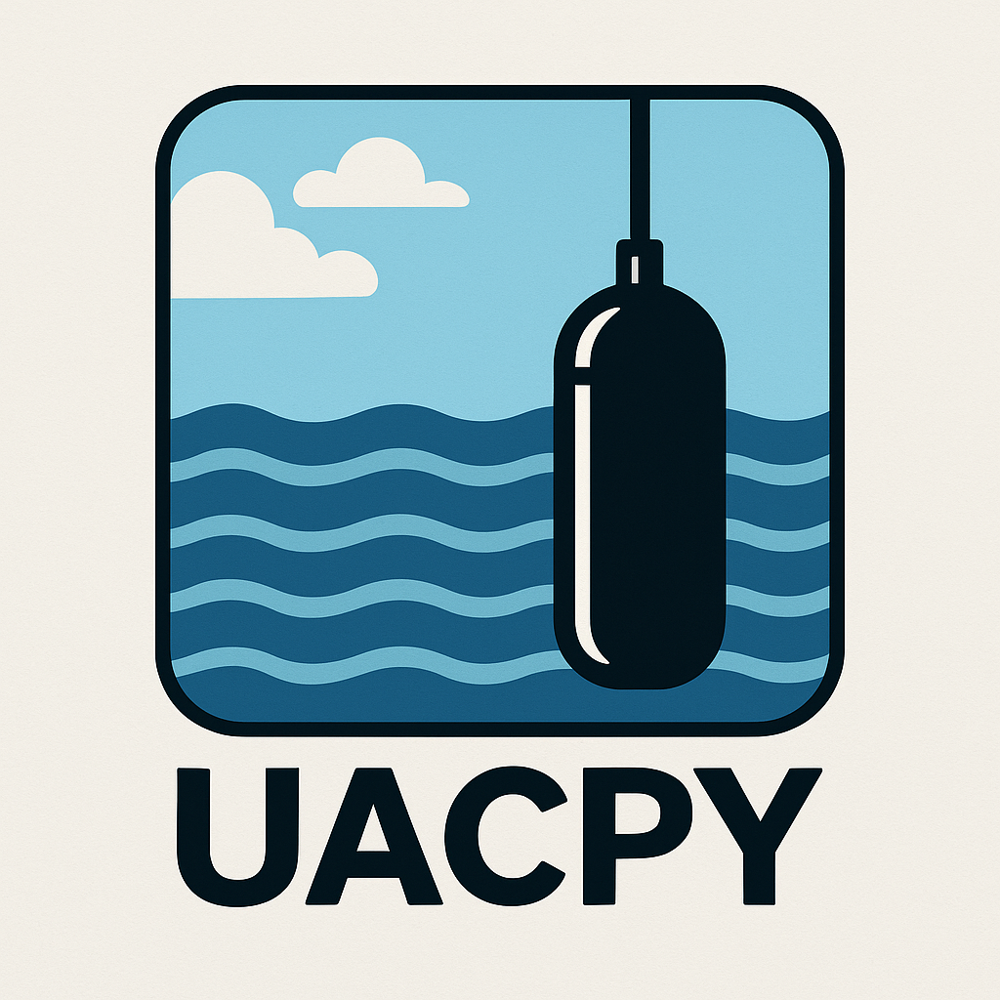
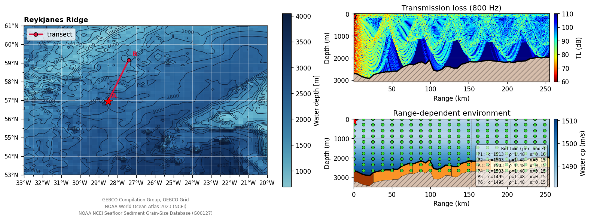

<p align="center">
  
</p>

# 🌊 Underwater Acoustics for Python 🌊

<p align="center">
  <a href="https://github.com/ErVuL/uacpy/actions/workflows/ci.yml"></a>
  <a href="#"></a>
  <a href="https://www.gnu.org/licenses/gpl-3.0"></a>
  <a href="#"></a>
  <a href="#"></a>
</p>

## 🚀 Vision & Motivation

For decades, underwater acoustic propagation models have been
implemented in highly optimized Fortran/C code. For many years, wrapping 
these models in MATLAB was the natural solution adopted by the scientific 
community. As Python has become a dominant language in scientific computing, 
a noticeable gap has emerged. Despite multiple efforts to wrap or re-implement 
these models, Python users still lack a unified, comprehensive, and up-to-date 
solution.

**UACPY is an attempt to close that gap.**\
It was created for researchers, engineers, oceanographers, and acousticians 
who need underwater acoustic modeling to be more open, consistent, 
transparent, and reproducible. It builds on decades of pioneering work in 
the field and aims to provide a shared foundation for comparing models, 
validating results, running experiments, and developing new ideas.

This project began as an AI-assisted (Claude Code with Sonnet 4.5, Opus 4.6 
and 4.7) initiative to reduce early development time, but starting with the 
first release, it will be maintained manually by its author—without autonomous 
AI-driven modifications.

Community feedback, verification, and contributions are warmly 
encouraged. The project’s success depends on collective effort; the 
codebase is far too large and complex for one person to maintain alone 
in their spare time. The goal is for this module to be truly 
community-driven.


> ### **⚠️ Notes**
> 
> UACPY is *not* production‑ready. Expect missing features,
> inconsistencies, and the need for validation.
>
> #### Use of LLM and definitive API
> 
> Project development will now focus on stabilization, bug fixes, and human review.
> The development of new features and the automated use of LLMs will be scaled back,
> API changes will be limited but may still occur in beta.
> The code base is quite big, and covers a wide range of scientific fields. To review such a
> technical work, it needs some community usage and feedback. 

## 🔍 What's in UACPY?

A unified Python API over the classical underwater‑acoustic propagation
models — consistent `Environment` / `Source` / `Receiver` construction and
`Result` objects — plus first‑class toolkits for everything around them.

**Propagation models**

| Model             | Kind                                                               |
|-------------------|--------------------------------------------------------------------|
| **Bellhop**       | Ray / beam tracing                                                 |
| **Kraken**        | Normal modes                                                       |
| **Scooter**       | Finite elements for range independent env                          |
| **SPARC**         | Experimental time-marched FFP for pulses in range independent env  |
| **RAM**           | Parabolic equation                                                 |
| **OASES**         | OAST (TL) · OASN (covariance / MFP replicas) · OASR (reflection) · OASP (broadband TRF) |
| **Bounce**        | Reflection coefficients                                            |

**Toolkits** — first‑class modules, not just glue around the models:

- **Real‑world environments** (`uacpy.data`) — build an `Environment` from GPS coordinates and a date, fetching bathymetry, sound‑speed, seafloor, sea‑ice and sea‑state data from public ocean databases (GEBCO, GMRT multibeam, EMODnet DTM, World Ocean Atlas, Copernicus, EMODnet, AusSeabed MARS, NCEI/GlobSed/CRUST1/Graw seabed, NSIDC sea ice, GLODAP + Copernicus‑BGC pH, NBS wind, WaveWatch III / WAVERYS waves).
- **Signal processing** (`uacpy.acoustic_signal`) — waveforms, matched filtering, beamforming, time‑frequency transforms, channel simulation.
- **Sonar performance** (`uacpy.sonar`) — sonar equation, scattering, reverberation, detection & range, and matched-field source localization (KRAKEN replicas, Bartlett/MVDR).
- **Communications** (`uacpy.comms`) — digital modems (PSK/QAM/OFDM…), equalization, FEC, and the **NATO JANUS** standard.
- **Ambient noise** (`uacpy.noise`) — Wenz spectra (wind / shipping / rain / thermal).
- **Standards & metrics** — sound speed, decidecade bands, ship source level, marine‑mammal weighting.
- **Visualization** — TL maps, rays, modes, fields, cross‑model comparisons.

<div align="center">
  
</div>

**Simplest example — from GPS to a modelled field, the code that produces the figure above:**

``` python
import numpy as np, matplotlib.pyplot as plt
import uacpy
from uacpy import data
from uacpy.models import Bellhop, RunMode

# 1. Fetch a real range-dependent environment from GPS + date — GEBCO bathymetry,
#    WOA23 sound speed and NCEI seabed — across the North Sea shelf down into the
#    Norwegian Trench.
A, B = (61.0, 2.0), (58.0, 5.0)           # (lat, lon): North Sea shelf → Norwegian Trench
env  = data.fetch_environment(A, transect_to=B, date='2026-01-15', bottom_sources='auto')
grid = data.fetch_bathy_grid((56.5, 62.0), (-2.0, 9.0))      # (lats, lons, depth)

# 2. Model transmission loss with Bellhop at 800 Hz, out to the transect length.
src = uacpy.Source(depths=100, frequencies=800)
rcv = uacpy.Receiver(depths=np.linspace(1, env.depth, 150),
                     ranges=np.linspace(100, env.max_range, 350))  # env range extent
tl  = Bellhop().run(env, src, rcv, run_mode=RunMode.COHERENT_TL)

# 3. One call → the figure above: map · transmission loss · environment.
#    The left map is pluggable (map_fn=); the default is the bathymetry map.
uacpy.plot.plot_overview(env, grid, transect=(A, B), tl=tl, source=src, receiver=rcv,
                         map_title="North Sea — Norwegian Trench (GEBCO)",
                         tl_title="Transmission loss (Bellhop, 800 Hz)",
                         env_title="Range-dependent environment A→B",
                         map_kwargs=dict(contours=True, aspect=1))
plt.show()
```

## 📦 Installation

**Linux is the primary supported platform.** macOS works with Homebrew.
Windows is supported **via WSL2** (Windows Subsystem for Linux) — see the
[Windows section](#-windows-via-wsl2) below for why and how.

What `install.sh` builds:

| Tool                     | Required for                                      |
|--------------------------|---------------------------------------------------|
| `python3`                | Driving `install.sh` and importing uacpy (always) |
| `gfortran`, `make`       | OALIB, mpiramS, ramsurf (`rams0.5` elastic + `ramsurf1.5` rough surface), ramgeo (`ramgeo1.5` layered fluid), OASES (Fortran models — always) |
| `git`                    | Cloning uacpy + submodules (always)               |
| `tar`                    | Submodule unpacking + OASES archive (always)      |
| `cmake`, `g++`/`clang++` | C++ Bellhop variant (`--bellhop cxx`)             |
| CUDA toolkit (`nvcc`)    | GPU Bellhop variant (`--bellhop cuda`) — **required** when `--bellhop cuda` is passed; the installer hard-errors if `nvcc` is absent (no silent downgrade to cxx) |
| `curl`                   | OASES archive download (`--oases yes`)            |

`install.sh` **verifies** these are present and aborts with a clear
message if anything is missing — it does *not* install system packages
itself. Provision the toolchain once for your platform, then run the
build.

---

### 🐧 Linux

**1. Install dependencies**

```bash
# Debian / Ubuntu
sudo apt-get update
sudo apt-get install -y gfortran make git \
                        cmake g++ curl tar python3-venv python3-pip

# Fedora / RHEL
sudo dnf install -y gcc-gfortran make git \
                    cmake gcc-c++ curl tar python3-virtualenv python3-pip

# Arch / Manjaro
sudo pacman -S --needed gcc-fortran make git \
                        cmake gcc curl tar python python-pip
```

For GPU Bellhop, additionally install the CUDA toolkit from your
distribution or NVIDIA's site.

**2. Clone, create venv, install**

```bash
git clone --recurse-submodules https://github.com/ErVuL/uacpy.git
cd uacpy
python3 -m venv uacpy_venv
source uacpy_venv/bin/activate
pip install -e .
./install.sh
```

`./install.sh` runs interactively by default. Useful flags:

| Flag                      | Effect                                                      |
|---------------------------|-------------------------------------------------------------|
| `-y` / `--yes`            | Non-interactive — auto-detect everything                    |
| `--bellhop fortran`       | Skip the C++ build (Fortran Bellhop is always built)        |
| `--bellhop cxx`           | Also build C++ Bellhop (CPU)                                |
| `--bellhop cuda`          | Also build CUDA Bellhop (GPU, requires `nvcc`)              |
| `--oases yes` / `no`      | Download + build OASES (or skip the prompt)                 |
| `--data LIST`             | Download public datasets for the `uacpy.data` offline backend into `./data_cache` (gitignored). `LIST` is a comma list (`gebco`, `woa23`, `sediment`, `emodnet`, `coastline`, `globsed`, `crust1`, `diesing`, `seaice`, `glodap`, `wind`, `graw`) or `all`. See `./install.sh --help` for sizes/licences. |
| `--no-models` / `--data-only` | Skip **all** native model builds (no compilers needed) — pure-Python install; pair with `--data` for an offline data-only setup |
| `--force`                 | Skip incremental builds; do a full clean rebuild of every selected component |

---

### 🍎 macOS

**1. Install dependencies**

```bash
# Install Homebrew (skip if 'brew' is already on PATH). See https://brew.sh
/bin/bash -c "$(curl -fsSL https://raw.githubusercontent.com/Homebrew/install/HEAD/install.sh)"

# Xcode Command Line Tools (provides make, clang, git, tar)
xcode-select --install

# Build dependencies. The 'gcc' formula provides gfortran on macOS.
brew install gcc cmake curl python
```

CUDA Bellhop is **not** available on macOS (no NVIDIA toolkit). The C++
Bellhop variant (`--bellhop cxx`) builds fine with Apple's clang.

**2. Clone, create venv, install**

```bash
git clone --recurse-submodules https://github.com/ErVuL/uacpy.git
cd uacpy
python3 -m venv uacpy_venv
source uacpy_venv/bin/activate
pip install -e .
./install.sh
```

(See the Linux section above for `install.sh` flags — they're identical
on macOS.)

---

### 🪟 Windows (via WSL2)

**uacpy on Windows runs inside WSL2 (Windows Subsystem for Linux),
following the Linux instructions above.**

WSL2 needs CPU virtualization extensions. Some computer ship with this
**disabled by default**, so first of all enable hardware virtualization 
in your BIOS/UEFI.

In an **elevated PowerShell** (Run as Administrator):

```powershell
wsl --install -d Ubuntu
```

Reboot when prompted. Open Ubuntu (Start menu → "Ubuntu") and follow the 
**Linux / Debian** recipe from above:

```bash
sudo apt-get update
sudo apt-get install -y gfortran make git \
                        cmake g++ curl tar python3-venv python3-pip

cd ~
git clone --recurse-submodules https://github.com/ErVuL/uacpy.git
cd uacpy
python3 -m venv uacpy_venv
source uacpy_venv/bin/activate
pip install -e .
./install.sh
```

> **Tip:** clone into the WSL filesystem (`~/uacpy`), **not** into
> `/mnt/c/...`. Cross-filesystem I/O is 10–20× slower and the
> Acoustics-Toolbox build does a lot of small file writes.

### Update

```bash
cd uacpy
git pull
source uacpy_venv/bin/activate
pip install -e .
rm -rf uacpy/bin   # Optional (Required for v0.3.x -> v0.4.x)
rm -rf data_cache  # Optional
./install.sh       # Optional (Required for v0.3.x -> v0.4.x) 
```

### Uninstall

```bash
pip uninstall uacpy
rm -rf uacpy
```

## 📚 Documentation & Examples

The full API reference lives in a single file:
[`DOCUMENTATION.md`](./DOCUMENTATION.md) — quick start, environment setup,
per-model signatures, visualization, signal processing, noise, units, and
troubleshooting.

Inside `uacpy/uacpy/examples/` you will find 38 example scripts numbered
sequentially (`example_01_*.py` through `example_38_*.py`) — from a first TL
field to communications modems, a standards-based noise-impact assessment, a
GPS-to-modelled-field real-world pipeline, and matched-field source
localization. See the
[examples index](./DOCUMENTATION.md#12-examples-index) for a description
of each one.

## 🧪 Testing

UACPY uses **pytest** with custom markers for categorizing tests.

`pytest` and `pytest-xdist` are no longer pulled in by the runtime
dependency set — install the `test` extra to get them, or the `dev` extra
for the additional formatting / linting / coverage tooling:

``` bash
# For running the test suite
pip install -e ".[test]"

# For development (test deps + black, flake8, pytest-cov)
pip install -e ".[dev]"
```

> Note: With macOS you may need to use **pip install -e .\\[xxx\\]**.

### Run all tests

``` bash

cd uacpy
pytest uacpy/tests/

```

### Test markers

Tests use custom markers to allow selective execution:

- `slow` -- Long-running tests (broadband, large grids, slow examples)
- `requires_binary` -- Tests that need compiled native binaries (Fortran/C)
- `requires_oases` -- Tests that need compiled OASES binaries
- `requires_network` -- Tests that hit a live external service (the `uacpy.data`
  fetchers); **auto-skipped when offline**

``` bash

# Skip slow tests
pytest uacpy/tests/ -m "not slow"

# Run only tests that don't need compiled binaries
pytest uacpy/tests/ -m "not requires_binary"

# Skip OASES tests (if OASES is not installed)
pytest uacpy/tests/ -m "not requires_oases"

# Skip all internet-dependent tests (also auto-skipped offline)
pytest uacpy/tests/ -m "not requires_network"

```

## 🗺️ Roadmap

Because the initial codebase was LLM‑bootstrapped, *auditing* comes before
new features. Both lists are contributor checklists — open an issue or PR
for anything you investigate. Full diffs of in‑tree native‑model changes
live in [MODIFICATIONS.md](./uacpy/third_party/MODIFICATIONS.md).

### 🛠️ Hardening & validation (priority)

- **🧱 API audit** 
- **🔬 Native model re‑validation** 
- **🐍 Python‑side review** 
- **📊 Visualization review** 
- **🧪 Test suite audit** 
- **📦 Build, install, packaging** 
- **🔁 CI / CD** 

> **If you are evaluating UACPY for a project: do not trust any specific
> number it produces until the re‑validation items above have been
> verified for the model and regime you care about.**

### 🔮 Future scope

- **Model features** — coverage of every native model option, GPU acceleration for more models, full 3‑D propagation.
- **GUI** — scenario‑based simulations, interactive TL / mode / noise level / ...,  dashboards.


## 🙏 Acknowledgments

UACPY would not exist without decades of prior work by the underwater
acoustics community. Every propagation model shipped here was designed,
implemented, and validated elsewhere --- UACPY only provides a unified
Python interface around them. Which codebases are vendored vs modified
is summarised in the [licensing table](#-licensing); full diffs for
modified sources live in
[MODIFICATIONS.md](./uacpy/third_party/MODIFICATIONS.md).

### Acoustics Toolbox --- Bellhop, Kraken, Scooter, SPARC, Bounce

Michael B. Porter --- http://oalib.hlsresearch.com/AcousticsToolbox/
- Porter, *The BELLHOP Manual and User's Guide*, 2011
- Porter, *The KRAKEN Normal Mode Program*, 1992

### BellhopCUDA

C. S. Schmid, D. F. Schmidt, A. E. Hodgson --- https://github.com/A-New-BellHope/bellhopcuda
- *BellhopCUDA: High-Performance Acoustical Ray Tracing on GPUs*, 2020

### RAM

Michael D. Collins (Naval Research Laboratory)
- Collins, "A split-step Padé solution for the parabolic equation
  method," *JASA*, 1993

### mpiramS

Brian D. Dushaw --- https://zenodo.org/records/10818570

### ramsurf --- Collins RAM family (rams0.5 elastic, ramsurf1.5 rough surface)

Vendored from the Quiet Oceans repackaging of David C. Calvo's NRL
distribution --- https://github.com/quiet-oceans/ramsurf

- Collins, *A split-step Padé solution for the parabolic equation method*, JASA, 1993
- Collins, *Higher-order parabolic approximations for accurate and stable elastic parabolic equations with application to interface wave propagation*, JASA, 1991 (RAMS / elastic)
- Collins, *Generalization of the split-step Padé solution* (variable surface / ramsurf), JASA 97, 2767–2770, 1995

### ramgeo --- Collins RAM family (RAMGEO 1.5g, range-dependent layered fluid PE)

Range-dependent layered-fluid parabolic-equation model by Michael D. Collins
(Naval Research Laboratory). **Public domain** — a U.S. Government work; the
source carries no copyright or licence notice. uacpy vendors it from the
Acoustics Toolbox `RAM/` bundle (Porter's AT, mirroring
http://oalib.hlsresearch.com/Modes/AcousticsToolbox/), which merely
redistributes Collins' original.

- Collins, *A split-step Padé solution for the parabolic equation method*, JASA 93, 1736–1742, 1993
- Collins, *Users Guide for RAM versions 1.0 and 1.0p / RAMGeo*, NRL, 1999

### OASES --- OAST, OASN, OASR, OASP

Henrik Schmidt (Massachusetts Institute of Technology) --- https://acoustics.mit.edu/faculty/henrik/oases.html

### arlpy

Mandar Chitre (Acoustic Research Lab, National University of Singapore) --- https://github.com/org-arl/arlpy

Utility functions adapted into `uacpy/core/acoustics.py` preserve Mandar
Chitre's 2016 copyright header and cite arlpy as the source.


## 📄 Licensing

### Third party code

UACPY aggregates code from multiple projects, each under its own
license. Downstream users are responsible for respecting each license
when redistributing or modifying UACPY or its outputs.

| Component                  | Location                           | How it ships                                     | License                                          |
|----------------------------|------------------------------------|--------------------------------------------------|--------------------------------------------------|
| UACPY wrapper              | this repository                    | source + Python package                          | GPL-3.0                                          |
| Acoustics Toolbox (Porter) | `third_party/Acoustics-Toolbox/`   | vendored Fortran sources, **modified**           | GPL-3.0                                          |
| bellhopcuda (Schmid et al.)| `third_party/bellhopcuda/`         | git submodule pinned to upstream `v1.5`, unmodified | GPL-3.0                                       |
| mpiramS (Dushaw)           | `third_party/mpiramS/`             | vendored Fortran sources, **modified**           | Creative Commons Attribution 4.0 International   |
| ramsurf (Calvo / Quiet Oceans) | `third_party/ramsurf/`         | vendored Fortran sources, **modified**           | BSD-3-Clause |
| ramgeo (Collins, NRL)      | `third_party/ramgeo/`              | vendored Fortran source, **modified**            | Public domain (U.S. Government work, no explicit licence) |
| arlpy utilities (Chitre)   | `uacpy/core/`                      | adapted (ported into UACPY sources, unmodified scientifically) | BSD-3-Clause                    |
| OASES (Schmidt, MIT)       | `third_party/oases/` (gitignored)  | **optional** download at install time, **not redistributed**| Academic license --- see Henrik Schmidt's terms  |


### Python dependencies

UACPY's runtime dependencies are installed from PyPI (not bundled or
redistributed by UACPY); all are permissive and GPL-3.0-compatible.

| Package | Used for | License |
|---------|----------|---------|
| **numpy** | arrays / numerics (core) | BSD-3-Clause |
| **scipy** | interpolation, FFT, nearest-neighbour search | BSD-3-Clause |
| **matplotlib** | visualization | Matplotlib License (PSF-based, BSD-style) |
| **netCDF4** | reading WOA23 / GEBCO / GlobSed grids | MIT |
| **shapely** | EMODnet seabed-substrate polygon lookups | BSD-3-Clause |
| **pyproj** | map projections (sea-ice / Diesing reprojection) | MIT |
| **tifffile** | NSIDC sea-ice / lithology raster reads | BSD-3-Clause |
| **copernicusmarine** | Copernicus operational sound speed | EUPL-1.2 (lists GPL-3.0 as compatible) |

Test/development tooling (`pytest`, `pytest-xdist`, `pytest-cov`, `black`,
`flake8` — the `[test]` / `[dev]` extras) is MIT-licensed and not required at
runtime.


### External data sources

The `uacpy.data` layer builds an `Environment` (and, for
`uacpy.plot.plot_bathymetry_map`, a coastline map) from public databases.
These datasets are **fetched on demand - not redistributed** with UACPY.
Their licences (CC-BY, CC-BY-NC, public domain, …) impose: whoever fetches 
the data is its licensee and is responsible for honouring the licence and 
citing the source. UACPY exposes a `base_url=` on each fetcher so heavy 
users can point at their own mirror.

| Source | Used for | License | Required attribution / citation |
|--------|----------|---------|---------------------------------|
| **GEBCO** grid (served via [OpenTopoData](https://www.opentopodata.org/), MIT) | bathymetry | Public domain (attribution requested) | "GEBCO Compilation Group, *GEBCO Grid*" (see [GEBCO terms](https://www.gebco.net/data-products/gridded-bathymetry/terms-of-use) for the grid DOI). OpenTopoData public API is fair-use: **≤1000 req/day, ≤1 req/s** --- self-host for heavy use |
| **GMRT** Global Multi-Resolution Topography (`bathymetry_sources='gmrt'`) | bathymetry (multibeam, higher-res) | **CC-BY 4.0** | Ryan, W.B.F., *et al.* (2009). *Global Multi-Resolution Topography synthesis.* Geochem. Geophys. Geosyst. 10, Q03014. doi:[10.1029/2008GC002332](https://doi.org/10.1029/2008GC002332) |
| **EMODnet Bathymetry DTM** (`bathymetry_sources='emodnet_dtm'`) | bathymetry (European seas + Caribbean, ~115 m) | **CC-BY 4.0** | "EMODnet Bathymetry (emodnet.ec.europa.eu), CC-BY 4.0"; EMODnet Bathymetry Consortium (2024), *EMODnet Digital Bathymetry (DTM 2024)* |
| **World Ocean Atlas 2023** (NOAA NCEI) | sound speed (climatology), absorption | U.S. Government work --- public domain | Reagan, J.R., *et al.* (2024). *World Ocean Atlas 2023.* NOAA National Centers for Environmental Information |
| **Copernicus Marine Service** (free account required) | sound speed (operational) | [Copernicus Marine License](https://marine.copernicus.eu/user-corner/service-commitments-and-licence) (free; **commercial use allowed**; free account required) | "Generated using E.U. Copernicus Marine Service Information; *&lt;product DOI&gt;*" |
| **Argo** float profiles (`ssp_sources='argo'`, via Ifremer ERDDAP) | sound speed (real in-situ profiles) | **Free and unrestricted** (Argo data policy) | "These data were collected and made freely available by the International Argo Program (argo.ucsd.edu)"; Argo (2024), Argo GDAC, SEANOE, doi:[10.17882/42182](https://doi.org/10.17882/42182) |
| **GLODAPv2.2016b** Mapped Climatology (`--data glodap`, feeds `with_absorption`) | seawater pH (Francois-Garrison absorption) | **CC-BY 4.0** | Lauvset, S.K., *et al.* (2016). *A new global interior ocean mapped climatology: the 1×1 GLODAP version 2.* Earth Syst. Sci. Data 8, 325--340. doi:[10.5194/essd-8-325-2016](https://doi.org/10.5194/essd-8-325-2016) |
| **Copernicus BGC** global biogeochemistry reanalysis (`ssp_sources='copernicus'` + `with_absorption`) | seawater pH (operational, date-specific) | [Copernicus Marine License](https://marine.copernicus.eu/user-corner/service-commitments-and-licence) (free; **commercial use allowed**) | "E.U. Copernicus Marine Service Information; *&lt;product DOI&gt;*"; GLOBAL_MULTIYEAR_BGC_001_029 |
| **EMODnet Geology** --- seabed substrate (`bottom_sources='emodnet'`) | sediment (European seas) | **CC-BY 4.0** | "EMODnet Geology seabed substrate (emodnet.ec.europa.eu), CC-BY 4.0" |
| **AusSeabed MARS** database (`bottom_sources='mars'`) | sediment (Australian margin, point samples) | **CC-BY 4.0** | Geoscience Australia (2020). *Marine Sediments (MARS) Database.* AusSeabed data portal |
| **NCEI Seafloor Sediment Grain-Size Database** (NOAA, G00127; `bottom_sources='grainsize'`) | sediment (global, public-domain samples) | U.S. Government work --- public domain | National Geophysical Data Center (1976), *The NGDC Seafloor Sediment Grain Size Database*, NOAA NCEI, doi:[10.7289/V5G44N6W](https://doi.org/10.7289/V5G44N6W). (The DECK41 G02094 lithology file is also accepted if supplied.) |
| **Diesing 2020** global deep-sea seafloor lithology (`bottom_sources='diesing'`) | sediment (global deep-sea, >500 m) | **CC-BY 4.0** | Diesing, M. (2020). *Deep-sea sediments of the global ocean.* Earth Syst. Sci. Data 12, 3367--3381. doi:[10.5194/essd-12-3367-2020](https://doi.org/10.5194/essd-12-3367-2020); data: PANGAEA doi:[10.1594/PANGAEA.911692](https://doi.org/10.1594/PANGAEA.911692) |
| **Pelagic model** (`bottom_sources='pelagic'`, depth/latitude classifier) | sediment (global open-ocean fallback, modelled) | **Public domain** (first-principles model) | after Diesing (2020) & Berger, W.H. (1974), *Deep-sea sedimentation* |
| **GlobSed** total sediment thickness (NOAA NCEI) | sediment thickness (low-frequency seabed) | U.S. Government work --- public domain | Straume, E.O., *et al.* (2019). *GlobSed: Updated total sediment thickness in the world's oceans.* Geochem. Geophys. Geosyst. 20, 1756--1772. doi:[10.1029/2018GC008115](https://doi.org/10.1029/2018GC008115) |
| **CRUST1.0** global crustal model (`bottom_sources='crust1'`) | layered seabed Vp/Vs/density (low-frequency) | **No formal licence** --- verify before commercial use | Laske, G., Masters, G., Ma, Z. & Pasyanos, M. (2013). *Update on CRUST1.0 --- a 1-degree global model of Earth's crust.* Geophys. Res. Abstr. 15, EGU2013-2658 |
| **Graw 2021** predicted seabed bulk density (`bottom_sources='graw'`, `--data graw`) | seabed density (measured-density half-space) | **CC-BY 4.0** | Graw, J.H., Wood, W.T. & Phrampus, B.J. (2021). *Predicting global marine sediment density using the random forest regressor machine learning algorithm.* J. Geophys. Res. Solid Earth 126; data: Zenodo doi:[10.5281/zenodo.3762390](https://doi.org/10.5281/zenodo.3762390) |
| **NSIDC Sea Ice Index** (`surface_sources='seaice'`) | sea-ice concentration → elastic ice surface (monthly climatology) | U.S. Government work --- public domain | Fetterer, F., *et al.* (2017, updated). *Sea Ice Index* (G02135), NSIDC, doi:[10.7265/N5K072F8](https://doi.org/10.7265/N5K072F8) |
| **NOAA/NCEI Blended Seawinds** (`data.fetch_wind`; `--data wind` climatology) | 10 m wind → ambient noise + sea surface | U.S. Government work --- public domain | Zhang, H.-M., *et al.* (2006). *Assessment of composite global sampling: Sea surface wind speed.* Geophys. Res. Lett. 33, L17714 |
| **NOAA WaveWatch III** (`data.fetch_waves`, `altimetry_sources='waves'`) | significant wave height → sea surface (recent) | U.S. Government work --- public domain | Tolman, H.L. (2009). *User manual and system documentation of WAVEWATCH III.* NOAA/NWS/NCEP Tech. Note 276 |
| **Copernicus WAVERYS** (`data.fetch_waves`, needs login) | significant wave height → sea surface (reanalysis, 1980→) | [Copernicus Marine License](https://marine.copernicus.eu/user-corner/service-commitments-and-licence) (free; **commercial use allowed**) | "E.U. Copernicus Marine Service Information (WAVERYS); *&lt;product DOI&gt;*"; GLOBAL_MULTIYEAR_WAV_001_032 |
| **Natural Earth** land polygons (`uacpy.plot.plot_bathymetry_map` coastline) | map backdrop | **Public domain** | none required |

> A fetched environment carries its provenance per layer: `env.data_sources` is
> a tuple of `DataProvenance` records, each pairing the dataset (`.source`) with
> the **actual date and coordinates** that fetch returned. `uacpy.data.citations(env)`
> prints the required attribution/citation — plus the fetched date/location — for
> exactly those sources (`uacpy.data.citations()` prints the full catalogue below).

## 📬 Contact

Questions, bug reports, and contributions are welcome. For matters not
suited to a GitHub issue (collaboration proposals, private questions,
etc.), the maintainer can be reached at:

**ervul.github@gmail.com**


## 📖 Citation

``` bibtex
@software{uacpy2026,
  title   = {UACPY: Underwater ACoustics for PYthon},
  author  = {ErVuL and UACPY Contributors},
  year    = {2026},
  url     = {https://github.com/ErVuL/uacpy}
}
```


## Other interesting projects

- https://github.com/hunterakins/pykrak
- https://github.com/signetlabdei/WOSS?tab=readme-ov-file
- https://github.com/nposdalj/PropaMod
- https://github.com/marcuskd/pyram
- https://github.com/org-arl/UnderwaterAcoustics.jl
- https://github.com/SPECFEM

