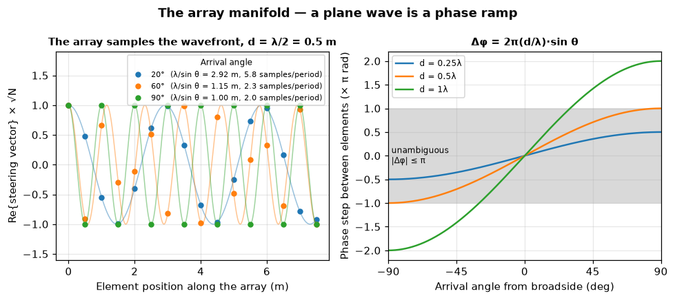
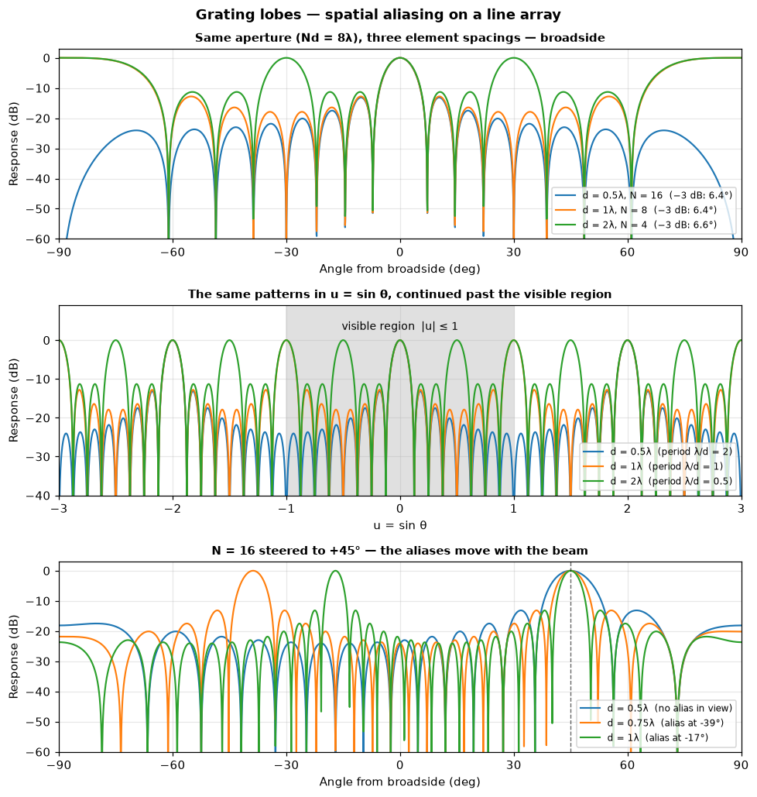
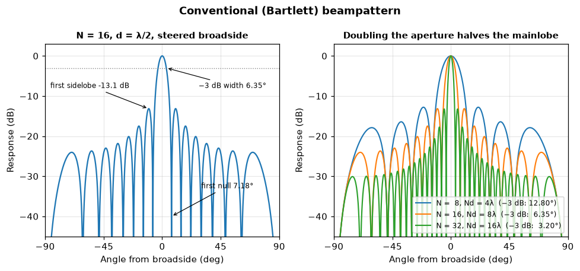
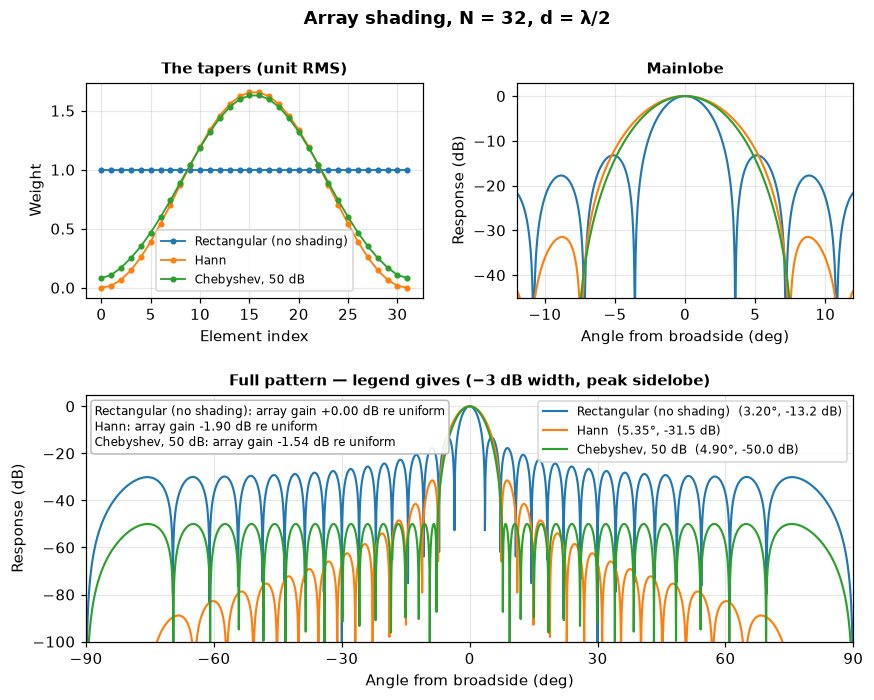
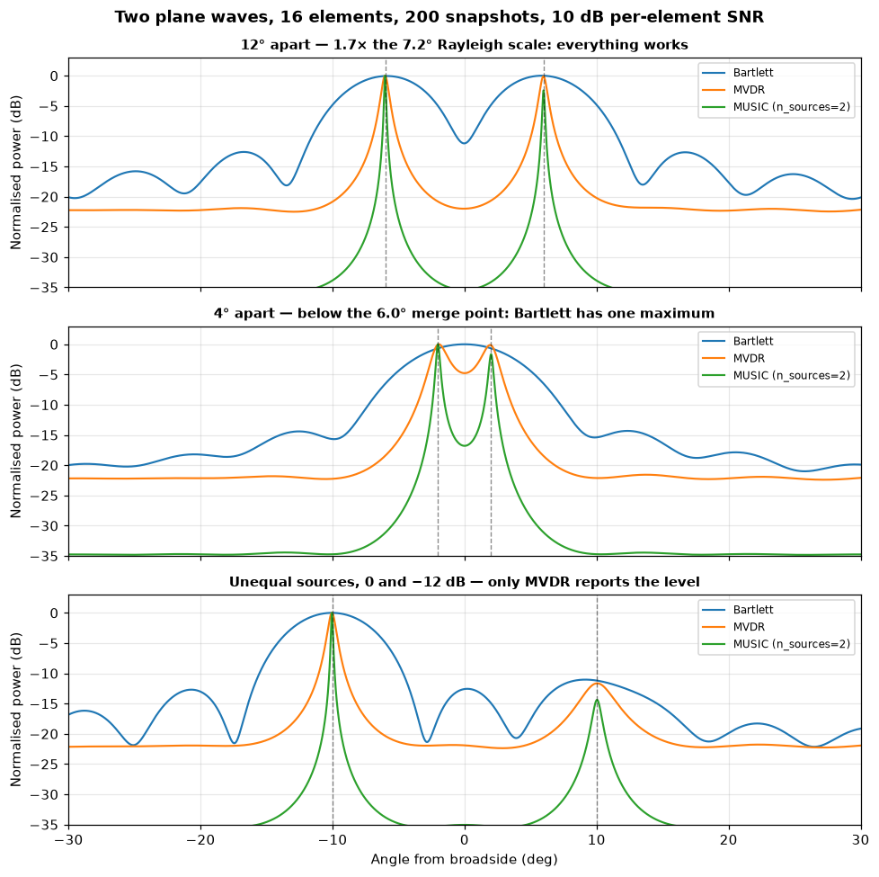
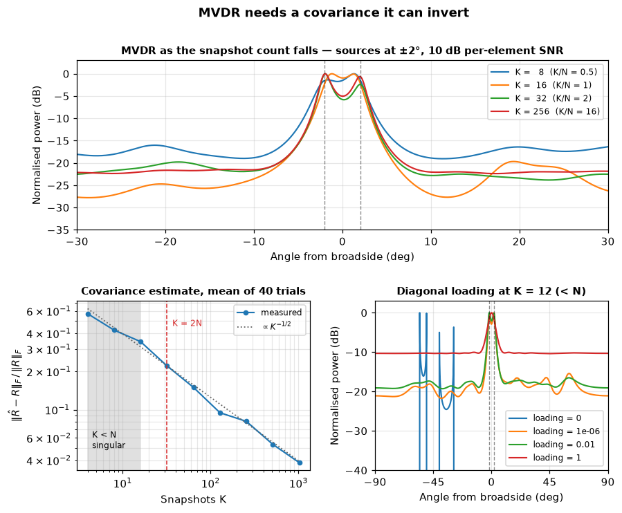
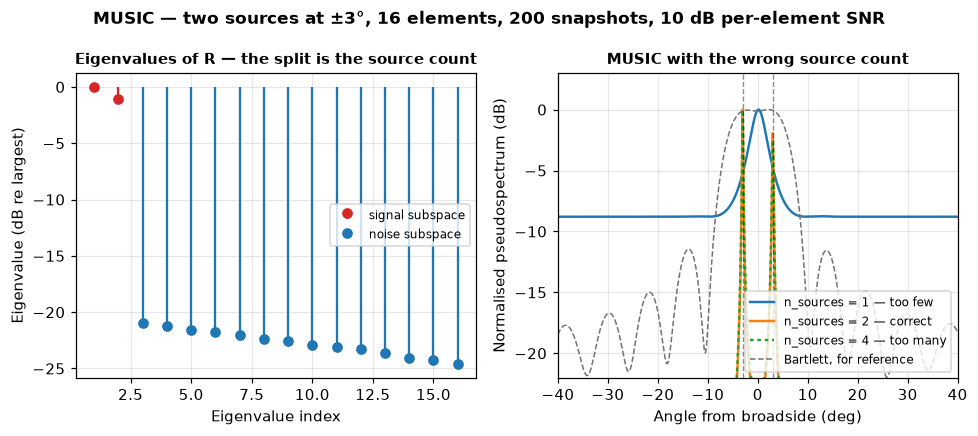
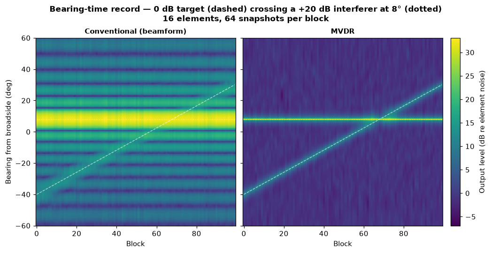

# Array processing — steering, beamforming and bearing estimation

> `uacpy.acoustic_signal.arrays` · `steering_vectors` · `beamform` ·
> `sample_covariance` · `bartlett_spectrum` · `mvdr_spectrum` ·
> `music_spectrum` · `shading_taper`

A single hydrophone measures pressure. An array of them measures pressure
*and* the direction it came from, because a plane wave arriving off broadside
reaches one element before the next. This page is about turning that delay
into a bearing: what the geometry can resolve, what the processor can add on
top, and what each processor charges you for it.

Everything here is a **uniform line array** and every angle θ is measured
**from broadside**, so 0° is perpendicular to the array axis and ±90° is
endfire. The array is a set of coordinates along one axis — depths for a
vertical array, along-track distances for a towed one; nothing in the code
cares which.

```python
from uacpy.acoustic_signal import (
    bartlett_spectrum, beamform, music_spectrum, mvdr_spectrum,
    sample_covariance, shading_taper, steering_vectors,
)
```

These live on `uacpy.acoustic_signal`, not on the top-level `uacpy`
namespace.

| Call | Takes | Returns |
|---|---|---|
| `steering_vectors(positions_m, angles_deg, frequency, c=1500.0)` | element coordinates (m), scan angles (deg) | `(n_angles, n_elements)` complex, unit-norm rows |
| `beamform(pressure, phone_coords, frequency, angles=None, SL=150.0, NL=0.0, c=1500.0)` | `(n_phones, n_cols)` pressure | `BeamformResult(snr, angles, peak_snr)` |
| `sample_covariance(snapshots, *, diagonal_loading=0.0)` | `(n_elements, n_snapshots)` | Hermitian `R`, `(N, N)` |
| `bartlett_spectrum(R, steering)` | covariance + manifold | conventional power per angle |
| `mvdr_spectrum(R, steering, *, diagonal_loading=1e-6)` | covariance + manifold | Capon power per angle |
| `music_spectrum(R, steering, n_sources)` | covariance + manifold + model order | pseudospectrum per angle |
| `shading_taper(n_elements, window='hann')` | element count, any `scipy.signal.get_window` spec | RMS-normalised amplitude weights |

Every figure on this page comes from
[`docs/figure_scripts/arrays.py`](../figure_scripts/arrays.py) — the code
below is that code, so it cannot drift from what you see. The figures are set
at **1500 Hz in 1500 m/s water**, which makes λ exactly 1 m, so every spacing
reads directly as a fraction of a wavelength.

---

## 1. The array manifold

A steering vector is the array's *prediction* of what a plane wave from one
direction would look like across the elements. For an element at coordinate
`z_n` and a wave arriving at θ from broadside:

```
e_n(θ) = exp(−j·k·z_n·sin θ) / √N          k = 2πf/c
```

`steering_vectors` returns one such vector per scan angle, stacked into an
`(n_angles, n_elements)` matrix:

```python
positions = np.arange(16) * 0.5            # 16 elements, 0.5 m apart
angles = np.linspace(-90.0, 90.0, 361)
e = steering_vectors(positions, angles, frequency=1500.0, c=1500.0)
e.shape                                    # (361, 16)
```

Two conventions are worth knowing because everything downstream depends on
them. The sign is **−j** — deliberately the *conjugate* of the
Acoustics-Toolbox `planewave_rep.m` reference, because every processor here
applies the vector in Hermitian form (`e.conj()` against the data), and under
AT's `exp(+iωt)` convention that is the sign that puts the peak at +θ; using
`e` unconjugated resolves the mirror bearing −θ. And each row is
**unit-norm**, so the array gain `10·log10(N)` is folded consistently into
every output rather than being something you carry separately.



*No data and no noise in this figure — it is the geometry alone.* **Left:**
the faint curves are the spatial sinusoid a plane wave paints along the array
axis; the dots are `Re{e}·√N` sampled at the 16 element positions of a
`d = λ/2 = 0.5 m` array. The period along the array is `λ/sin θ`, so it
shortens as the wave swings off broadside: 2.92 m at 20° (5.8 elements per
period), 1.15 m at 60° (2.3), and 1.00 m at 90° endfire — exactly **2 elements
per period**, which is the spatial Nyquist rate. **Right:** the same fact as
the phase step between neighbouring elements, `Δφ = 2π(d/λ)·sin θ`. The shaded
band is `|Δφ| ≤ π`. At `d = λ/2` the curve touches ±π precisely at endfire and
never leaves the band; at `d = λ` it leaves it beyond ±30°.

That right-hand panel is the whole argument for `d = λ/2`. Phase is only known
modulo 2π, so the array can only tell bearings apart while the inter-element
phase step is still inside one turn. Requiring `|Δφ| ≤ π` across the entire
visible range `|sin θ| ≤ 1` gives

```
d ≤ λ/2
```

which is the spatial twin of the temporal sampling theorem — with the array
sampling a wavefront in space where a digitiser samples a waveform in time.
[`signal.md`](signal.md) covers the temporal side.

---

## 2. Element spacing — λ/2, and the two ways to miss it



*Deterministic beampatterns — no noise, no snapshots.* **Top:** three arrays
holding the same **aperture** `L = Nd = 8λ`, so the mainlobe is nearly the same
for all three (−3 dB widths 6.4°, 6.4°, 6.6° — `0.886·λ/L` is a large-`N`
approximation and loosens as the array gets sparser) and the only difference is
the extra full-height lobes. **Middle:** the same patterns plotted against `u = sin θ`
and continued past the visible region, where the periodicity is obvious — the
pattern repeats with period `λ/d`, and the shaded band `|u| ≤ 1` is the part of
it that corresponds to a real bearing. **Bottom:** a 16-element array steered
to +45°; the aliases translate with the beam, so a spacing that looks clean at
broadside is not.

### Grating lobes — spatial aliasing

Because the pattern is periodic in `u = sin θ` with period `λ/d`, every lobe
has copies at `u₀ ± m·λ/d`. Those copies are **identical in height** to the
mainlobe: an arrival at a grating-lobe bearing produces exactly the response of
an arrival at the true bearing, and no amount of processing on that one
frequency can tell them apart.

| Spacing | Period in `u` | Full-height lobes when steered broadside |
|---|---|---|
| `d = λ/2` | 2 | 0° only — the copies land at `u = ±2`, outside the visible region |
| `d = λ` | 1 | 0° and ±90° |
| `d = 2λ` | 0.5 | 0°, ±30° and ±90° |

The `d = λ` case is why the rule is λ/2 and not λ: at broadside the aliases sit
exactly at endfire and are easy to dismiss, but the bottom panel shows what
happens the moment you steer. Steered to +45°, `d = 0.75λ` puts a full-height
alias at −39° and `d = λ` puts one at −17°, both squarely inside the sector you
care about. `d = λ/2` keeps the alias out of view at every steer angle — it
only reaches the −90° edge when the beam is steered fully to +90° — and that
guarantee is what the half-wavelength rule buys you.

λ/2 is the worst case, though, not the only one. The alias of a beam steered to
`u₀ = sin θ_scan` sits at `u₀ − λ/d`, so it stays outside the visible region
whenever

```
d < λ / (1 + |sin θ_scan|)
```

— `λ` at broadside, `λ/2` at endfire. An array that never looks further than
±30° off broadside is grating-lobe-free out to `d = 0.67λ`, and limiting the
scan sector is the standard alternative to shrinking `d` when the physics fixes
your spacing.

The escape hatch, if you are stuck with a sparse array, is that the alias
positions depend on frequency while the true bearing does not. Processing a
band rather than a tone lets you vote the aliases down; a single-frequency
covariance cannot.

That is a loop you write yourself. `steering_vectors` and `beamform` both take
a **scalar** `frequency`, and uacpy has no cross-frequency combiner: build one
manifold per FFT bin, scan each bin on its own, normalise each spectrum to its
own peak and average the powers. That incoherent average is what makes the
aliases fall away — the true bearing lands at the same angle in every bin and
reinforces, while the aliases sit at `u₀ − λ/d` and move as the frequency does.

### Undersampling the other way — wasted aperture

`d < λ/2` costs you nothing in ambiguity and everything in aperture. Resolution
is set by `L = Nd`, not by `N` (§3), so for a fixed element count, halving `d`
halves the aperture and **doubles** the mainlobe width. The extra elements are
measuring a wavefront that has already been resolved: neighbouring channels
become strongly correlated and add little independent information. Whether
that also costs you array gain depends on which noise you are fighting.
Against **white element noise** — hydrophone self-noise — you still collect
the full `10·log10(N)`. Against **isotropic ambient noise** you do not: the
element-to-element noise correlation is `sinc(2·Δz/λ)`, which is exactly zero
for every pair at `d = λ/2` and nonzero the moment the elements are closer. A
16-element array holds 12.0 dB of gain against an isotropic field at λ/2, 9.1
dB at λ/4 and 6.2 dB at λ/8, against a flat `10·log10(16)` = 12.0 dB for white
element noise. Sub-λ/2 spacing is what you do when you need robustness at a
fixed physical length, or when the array must work at a top frequency well
above the one you are currently processing — not when you want gain.

---

## 3. Conventional (Bartlett) beamforming

Delay-and-sum, in the frequency domain, is phase-shift-and-sum: correlate the
data against the steering vector for each candidate bearing and take the power.
In covariance form that is

```
P_bartlett(θ) = eᴴ(θ) · R · e(θ)
```

which is what `bartlett_spectrum(R, steering)` computes, one value per row of
`steering`. It is the baseline every other processor is measured against: no
free parameters, no matrix inverse, no assumption about how many sources there
are, and it never fails — it just may not resolve.

A single plane wave from θ₀ has the rank-one covariance `R = a·aᴴ`, so scanning
Bartlett across a rank-one `R` traces the **beampattern itself**. That is how
the deterministic figures on this page are made.



*Rank-one covariance — one plane wave, no noise, no snapshots.* **Left:** the
anatomy of a 16-element, `d = λ/2` pattern steered broadside: a 6.35° −3 dB
mainlobe, a first null at 7.18°, and a first sidelobe at −13.1 dB.
**Right:** doubling the element count at fixed spacing doubles the aperture
and halves the mainlobe, while the sidelobe level barely moves.

| N (at `d = λ/2`) | Aperture `L` | −3 dB width | First null `arcsin(λ/L)` | Peak sidelobe |
|---|---|---|---|---|
| 8 | 4λ | 12.80° | 14.48° | −12.80 dB |
| 16 | 8λ | 6.35° | 7.18° | −13.15 dB |
| 32 | 16λ | 3.20° | 3.58° | −13.23 dB |

Three rules come straight out of that table:

- **Mainlobe width scales as `λ/L`**, where `L = Nd` throughout this page —
  one element spacing longer than the end-to-end span `(N−1)d`, and the
  convention these formulas are written in. The −3 dB width is `0.886·λ/L`
  radians, or about `50.8°/(L/λ)` — 6.35° for `L = 8λ`, matching the measured
  value to two decimals. Resolution is bought with **metres of array**, not with
  channels: 16 elements at λ/2 and 8 elements at λ resolve identically — both
  are `L = 8λ`, both measure 6.4° (§2, top panel) — and differ only in whether
  they alias.
- **The first sidelobe converges to −13.2 dB** and stays there whatever `N` is.
  You cannot fix sidelobes by adding elements — only by shading (§4).
- **The Rayleigh limit** is the first null, `arcsin(λ/L)` ≈ 7.2° for the
  16-element array used throughout this page — the standard resolution
  criterion, and exactly half the null-to-null beamwidth. It is a *scale*, not
  a threshold. Two equal uncorrelated sources exactly that far apart leave a
  dip of only **0.9 dB** between their Bartlett peaks, and the two peaks
  survive well inside it, down to `0.83·arcsin(λ/L)` — **5.96°** here — where
  the dip reaches zero and the maxima merge. Below that there is a single
  local maximum, and no amount of averaging recovers two sources. Between
  5.96° and 7.2° the dip is under 1 dB, so noise decides whether you see it:
  at the 200 snapshots and 10 dB per-element SNR used in §6, a 5.96° pair
  splits in 9% of draws and a 6.5° pair in 84%. Separating anything near or
  below the Rayleigh scale reliably requires a processor that uses the data,
  not just the geometry (§6).

### `beamform` — the model-facing entry point

`bartlett_spectrum` wants a covariance. `beamform` wants the raw pressure, and
is the call to reach for when your data is a column-per-column set of complex
measurements — a modelled field along a receiver array, or a block of measured
snapshots:

```python
res = beamform(pressure, phone_coords, frequency,
               angles=None, SL=150.0, NL=0.0, c=1500.0)
res.snr        # (n_angles, n_cols) dB
res.angles     # the scan angles used; default -90:1:90
res.peak_snr   # scalar max over the whole thing
```

It computes `20·log10|eᴴ·p| + SL − NL` per column, so with `SL=0, NL=0` you get
the receive level alone. Because the steering vectors are unit-norm, the array
gain `10·log10(N)` is already inside `|eᴴ·p|` — do **not** pre-correct `NL` for
the element count. `NL` is a per-element, wideband level; for a noise PSD in
dB re 1 µPa²/Hz, multiply by the integration bandwidth first. See
[`noise.md`](noise.md) for where that number comes from.

The shape contract `(n_phones, n_cols) → (n_angles, n_cols)` is what lets a
propagation result drop straight in. A [`Field`](results.md) computed on a
vertical receiver array is already `(n_depths, n_ranges)`:

```python
array_depths = np.arange(40.0, 48.0, 0.5)          # 16 elements, λ/2 at 1500 Hz
receiver = uacpy.Receiver(depths=array_depths,
                          ranges=np.linspace(500.0, 3000.0, 6))
p = Bellhop(n_beams=3000).run(env, source, receiver)

res = beamform(p.p, array_depths, 1500.0,
               angles=np.arange(-90.0, 90.1, 1.0), SL=0.0, NL=0.0)
res.snr.shape                                       # (181, 6) — one beam fan per range
```

`p.p` is a read-only view onto the result's own buffer, which matmul is
perfectly happy with. [OASN](../models/oases.md) goes further and hands you an
array **covariance** computed from a full seismo-acoustic model, as a
`Covariance` result with its own `.bartlett()` / `.mvdr()` against a replica
bank — that is matched-field processing, and [`sonar.md`](sonar.md) owns it.
Bearing estimation, this page's subject, asks a strictly smaller question: one
angle, no range, no depth, no environment model.

---

## 4. Shading — trading mainlobe width for sidelobes

`shading_taper(n_elements, window)` returns real amplitude weights
RMS-normalised to `mean(w²) = 1` — so a `'boxcar'` taper is all-ones — from
any `scipy.signal.get_window` specification. Multiply them
into the manifold before the scan:

```python
weights = shading_taper(32, 'hann')                # or ('chebwin', 50)
e = steering_vectors(positions, angles, FREQ, C) * weights
power = bartlett_spectrum(R, e)
```



*Deterministic beampatterns, 32 elements at `d = λ/2` (`L = 16λ`) — no noise,
no snapshots.* **Top left:** the tapers themselves, at unit RMS. **Top
right:** the mainlobes, where the cost shows. **Bottom:** the full patterns
over a 105 dB scale, where the benefit shows; the inset box gives the array
gain each taper gives up relative to uniform weighting.

| Taper | −3 dB width | Peak sidelobe | Array gain re uniform |
|---|---|---|---|
| Rectangular (no shading) | 3.20° | −13.2 dB | 0.00 dB |
| Hann | 5.35° | −31.5 dB | −1.90 dB |
| Chebyshev, 50 dB | 4.90° | −50.0 dB | −1.54 dB |

The trade is priced in that table. Hann buys 18 dB of sidelobe suppression for
a 67% wider mainlobe and 1.9 dB of array gain. Chebyshev at a 50 dB design
buys 37 dB for a 53% wider mainlobe and 1.5 dB — **better than Hann on all
three axes at once**. The Dolph–Chebyshev optimality theorem is narrower than
that result: for a given equiripple sidelobe level, no taper has a smaller
**first-null** beamwidth. The row above is not that comparison — the two
tapers sit at different sidelobe levels, and on first-null width the 50 dB
Chebyshev is the wider of the pair, 15.6° against Hann's 14.8°. Matched to
Hann's own −31.5 dB instead — `shading_taper(32, ('chebwin', 31.5))` — a
Chebyshev taper is 3.97° wide against Hann's 5.35°, 10.8° against 14.8°
between the first nulls, and gives up 0.66 dB of array gain instead of 1.90.
The flat −50 dB sidelobe floor in the bottom
panel is the equiripple signature; Hann's decaying skirt is lower far off
broadside but higher nearby.

The array gain loss has a simple form and a simple cause:

```
ΔG = 10·log10( (Σwₙ)² / (N·Σwₙ²) )
```

Weighting the elements unequally means the white noise on the down-weighted
channels is no longer being averaged as effectively. Hann is the extreme case
in this figure: its end weights are **exactly zero**, so a 32-element Hann
array is spending two elements on nothing.

Two things shading cannot do. It cannot make the mainlobe narrower — every
taper widens it, because tapering effectively shortens the aperture. And it
cannot help against a source hiding under a **grating** lobe, which is
full-height by construction and is not a sidelobe at all.

---

## 5. Snapshots and the sample covariance

Everything past conventional beamforming operates on a covariance matrix
rather than on a single measurement, because that is where the information
about *interference structure* lives. A **snapshot** is one complex sample of
the whole array at the processing frequency — one FFT bin from one time block,
across all N channels. `K` of them stack into an `(N, K)` array:

```python
R = sample_covariance(snapshots)                    # (N, N), R = <x xᴴ>
R = sample_covariance(snapshots, diagonal_loading=0.05)
```

`sample_covariance` computes `R̂ = x·xᴴ / K` and, optionally, adds
`diagonal_loading · trace(R̂)/N` to the diagonal. Note the default here is
**0.0** — no loading — whereas `mvdr_spectrum` loads by `1e-6` by default. Load
in one place, not both.

The rule of thumb is **`K ≳ 2N`**, and it pays to know what it buys. `K = 2N`
is the point at which an adaptive beamformer built from `R̂` averages about
**3 dB** below the output SNR the true `R` would give — 2.6 dB at `N = 16`,
falling to 1.6 dB at `3N` and 1.1 dB at `4N`. It is where the *spectrum shape*
has converged, which is what §7 measures, not where the loss has gone away;
sonar practice commonly asks for three to four times `N` for that reason. Two
hard facts sit underneath it:

- `R̂` has rank at most `K`, so with `K < N` it is **exactly singular**. Any
  processor that inverts it is inverting noise.
- The number of snapshots you can gather is bounded by stationarity, not by
  patience. Every snapshot must see the same scene: the same bearings, the same
  levels. A moving target sets the ceiling long before your disk does.

Snapshots also have to be *independent* to count. Overlapping FFT windows on
the same time series give you more matrices but not more information.

---

## 6. Bartlett, MVDR and MUSIC, side by side

Three processors, one covariance, one scan:

```python
R = sample_covariance(x)
steering = steering_vectors(positions, angles, FREQ, C)

bartlett_spectrum(R, steering)         # eᴴ R e
mvdr_spectrum(R, steering)             # 1 / (eᴴ R⁻¹ e)
music_spectrum(R, steering, 2)         # 1 / (eᴴ Eₙ Eₙᴴ e)
```

**MVDR** (Capon, minimum-variance distortionless response) asks a different
question from Bartlett. Instead of "how much power does the beam pointed at θ
collect", it asks "what is the *least* power a beam could collect while still
passing θ undistorted" — and to answer it, it places nulls on every other
arrival in the scene. That is why it resolves what Bartlett cannot: its
effective beam is shaped by the data, not by the aperture.

**MUSIC** (Schmidt) abandons power altogether. It eigendecomposes `R`, splits
the eigenvectors into a `n_sources`-dimensional signal subspace and an
`(N − n_sources)`-dimensional noise subspace `Eₙ`, and plots the reciprocal of
how much a steering vector leaks into `Eₙ`. At a true bearing that leakage goes
to zero and the pseudospectrum spikes — arbitrarily high, limited only by
estimation error.



**16 elements at `d = λ/2`, 200 snapshots, 10 dB per-element SNR** (the SNR of
a 0 dB source at one element, before any array gain), seeded so the figure is
reproducible. **Top:** two equal sources 12° apart, 1.7× the 7.2° Rayleigh
scale — all three find both, with the Bartlett trough between them at
−11.2 dB and MVDR's at −22.0 dB. **Middle:** the same pair 4° apart, well
below the 6.0° merge point. **Bottom:** sources at ±10° with the second one
12 dB weaker.

The middle panel is the money shot, and it is worth quoting numerically:

| Processor | Peaks found (truth ±2°) | Trough between them |
|---|---|---|
| Bartlett | **one** merged peak at 0° | — |
| MVDR | two, at −2.0° and +1.75° | −4.6 dB |
| MUSIC (`n_sources=2`) | two, at −2.0° and +2.0° | −17.4 dB |

Bartlett does not produce a shallow dip — it produces a **single local
maximum**. There is no threshold you could set that recovers two sources from
it. MVDR splits them; MUSIC splits them with a deep null between.

The bottom panel prices the other failure mode, dynamic range. The weak source
is 12 dB down:

| Processor | Bearing reported | Level reported |
|---|---|---|
| Bartlett | +9.0° — pulled 1° toward the loud source | −11.1 dB, 0.9 dB high |
| MVDR | +10.00° | −11.8 dB |
| MUSIC | +10.00° | −13.4 dB, **and not a power estimate** |

Bartlett's mainlobe skirt from the loud source is leaking into the weak one's
beam, which both inflates its level and drags its apparent bearing. MVDR nulls
the loud source and reports both correctly. MUSIC gets the bearing exactly
right and tells you nothing at all about level: the height of a MUSIC peak is
a measure of subspace orthogonality, not of received power, and reading it as
dB re anything is a mistake. It landed near −12 dB here by coincidence.

### Choosing between them

| | Bartlett | MVDR | MUSIC |
|---|---|---|---|
| Needs a covariance | no (`beamform` takes raw data) | yes | yes |
| Needs the source count | no | no | **yes** |
| Snapshots needed | 1 | `≳ 2N` | `≳ 2N` |
| Resolution | Rayleigh, `λ/L` | better, SNR-dependent | best |
| Peak height means | power | power | nothing |
| Fails by | merging sources | spurious spikes on a bad `R` | merging, when the order is too low |
| Cost | one matrix product | one `N×N` inverse | one `N×N` eigendecomposition |

Bartlett is not the loser in that table — it is the one that cannot surprise
you. Start there, and reach for MVDR or MUSIC when you have measured that you
have the snapshots to support them.

---

## 7. What MVDR costs — snapshots and diagonal loading



**16 elements at `d = λ/2`, two equal sources at ±2°, 10 dB per-element SNR
throughout; the snapshot count `K` is the variable.** **Top:** MVDR at
`K = 8, 16, 32, 256`. **Bottom left:** the relative Frobenius error of the
covariance estimate against the true `R`, averaged over 40 independent trials.
**Bottom right:** the effect of `diagonal_loading` at `K = 12`, which is below
the element count.

### The snapshot count

| `K` | `K/N` | `cond(R̂)` | Trough between the sources | Background beyond ±20° |
|---|---|---|---|---|
| 8 | 0.5 | 2.9 × 10¹⁷ | −0.6 dB — barely split | −15.8 dB |
| 16 | 1 | 2.6 × 10⁴ | −3.1 dB | −23.1 dB |
| 32 | 2 | 1.5 × 10³ | −5.0 dB | −22.3 dB |
| 256 | 16 | 3.5 × 10² | −4.9 dB | −22.1 dB |

That is the `K ≳ 2N` rule, measured. At `K = 2N = 32` the notch between the two
sources is within 0.1 dB of what 16× more snapshots delivers, and the
background has fully settled. Below `N` the pattern is visibly degraded — a
0.6 dB trough is not a resolved pair — and the background has risen 7 dB,
which is output SNR you have simply lost.

The bottom-left panel makes the mechanism explicit, and contains one detail
worth internalising: **the error curve is perfectly smooth through `K = N`.**
The estimate `R̂` degrades gracefully as snapshots get scarce, tracking `K^−1/2`
(0.34 at `K = N`, 0.216 at `K = 2N`, 0.037 at `K = 64N`). Nothing dramatic
happens to `R̂` at `K = N`. What breaks is the **inverse**: below `N` snapshots
`R̂` has rank `K < N` and is exactly singular, and MVDR's whole premise is
`R̂⁻¹`.

### Diagonal loading

`mvdr_spectrum(..., diagonal_loading=α)` adds `α·trace(R)/N` to the diagonal
before inverting — a small amount of artificial white noise that lifts the
zero eigenvalues off the floor. The default is `1e-6`, which is enough to make
the inverse well-defined without meaningfully changing the answer. The
bottom-right panel is `K = 12` against `N = 16`, so `rank(R̂) = 12` and
`cond(R̂) ≈ 2 × 10¹⁷`:

| `diagonal_loading` | Sources at ±2° | Loudest spurious peak | Background |
|---|---|---|---|
| `0` | found, at −0.6° and +1.5° | **−2.9 dB at −35.5°** | −42 dB |
| `1e-6` (default) | found, at −1.9° and +2.0° | −15.6 dB | −19 dB |
| `1e-2` | found, at −1.8° and +2.0° | −16.6 dB | −18 dB |
| `1` | **merged** into one peak at +1.0° | −9.0 dB | −9.5 dB |

With no loading the spectrum shatters into tall narrow spikes standing on a
very deep floor, and the loudest of them is within 3 dB of the real sources at
a bearing where nothing exists. Those spikes are scan directions that happen to
sit near the range space of a rank-deficient estimate; they are an artefact of
the inverse, and they look exactly like detections.

At the other end, `loading = 1` adds as much white noise power as the average
element already carries. It swamps the structure MVDR was exploiting, the
nulls stop being placed, and the processor degenerates toward Bartlett —
which duly merges the two sources, just as it does in §6. Loading is a genuine
dial between resolution and robustness, and both ends of it are bad.

The other reason to load is **steering-vector mismatch**. MVDR's nulls are
placed on the assumption that the manifold is exactly right. When element
positions, sound speed or the plane-wave assumption itself are slightly off,
the true signal no longer matches `e(θ₀)` and MVDR happily nulls the thing you
are looking for. Loading is the standard cheap defence, at the usual price of
resolution.

---

## 8. MUSIC and the source count

MUSIC's power comes from a null, not a peak: it needs to know how many
eigenvectors of `R` belong to sources so that everything left over can be
declared noise. That number is `n_sources`, and it is not optional.

```python
music_spectrum(R, steering, n_sources)      # n_sources ∈ [1, N-1]
```

Out of range raises `ConfigurationError` rather than returning something
plausible:

```
ConfigurationError: music_spectrum: n_sources must be in [1, 15], got 16
```



**Two sources at ±3°, 16 elements at `d = λ/2`, 200 snapshots, 10 dB
per-element SNR.** **Left:** the eigenvalues of `R` in dB relative to the
largest. **Right:** the pseudospectrum for three model orders, with the
conventional beampattern for the same `R` drawn in grey.

The left panel is how you *pick* `n_sources` in practice. The two signal
eigenvalues sit at 0 and −1.05 dB; the fourteen noise eigenvalues sit between
−20.9 and −24.6 dB. The **19.8 dB cliff** between eigenvalue 2 and eigenvalue 3
is the source count, read directly off the data. Note that the noise
eigenvalues are not identical — they spread over 3.7 dB — because `K` is finite;
in theory they would all equal the noise power. Watching that spread shrink as
you add snapshots is a useful sanity check on whether you have enough.

The right panel shows the two directions of error are not symmetric:

| `n_sources` | dim(`Eₙ`) | Peaks found | Contrast (peak to floor) |
|---|---|---|---|
| 1 — too few | 15 | **one** blob at +0.1°, 3.9° wide | 8.8 dB |
| 2 — correct | 14 | −2.95° and +3.00° | 35.7 dB |
| 4 — too many | 12 | −2.97° and +2.98° | 36.1 dB |

**Too few is catastrophic.** With `n_sources = 1`, one genuine signal
eigenvector is misclassified as noise. The noise subspace now contains a
direction the true steering vectors are *not* orthogonal to, the null stops
being a null, and both sources collapse into a single blob — and the contrast
falls from 36 dB to 8.8 dB, so the whole pseudospectrum flattens along with it.
The grey Bartlett curve on the same axes has a 12.85° mainlobe here; MUSIC with
the wrong order has narrowed it to 3.9° but is still reporting **one** source
where there are two, which is a more dangerous kind of wrong.

**Too many is benign here.** With `n_sources = 4`, two noise eigenvectors are
promoted into the signal subspace. The true steering vectors remain orthogonal
to the twelve that are left, so both peaks survive at full contrast — the
green trace lies on top of the orange one in the figure. In this scenario that
holds all the way to `n_sources = 15`, a one-dimensional noise subspace, and it
still holds at 24 snapshots and 0 dB SNR. The reason is that with only two
strong sources, every noise eigenvector is nearly orthogonal to the signal
manifold, so discarding some of them costs little.

The practical reading: **when in doubt, overestimate.** But do not treat that
as a licence to skip the eigenvalue plot. Both these results are for two
well-separated sources well above the noise, where the split is a 20 dB cliff.
When the cliff is a slope — sources near the noise, correlated arrivals,
multipath from a single source that fills more eigenvalues than there are
physical sources — the order is genuinely ambiguous and MUSIC is genuinely
fragile. Plot the eigenvalues first, every time.

One case breaks that diagnostic rather than blurring it. **Fully coherent
arrivals** — what surface- and bottom-reflected multipath from a single source
produces when the paths do not decorrelate — make the signal covariance
rank-*deficient*: two coherent paths raise **one** eigenvalue, not two. The
plot then reports one source where there are two, its second eigenvalue
sitting down in the noise floor, and MUSIC given the correct `n_sources = 2`
mislocates both arrivals and grows spurious peaks besides. The standard
defence is spatial smoothing of `R` across overlapping subarrays, which uacpy
does not provide; short of that use Bartlett or MVDR, which degrade rather
than lie.

---

## 9. A bearing-time record

Everything above is one covariance. Sonar practice is a sequence of them: form
a block, form its covariance, scan it, plot the scan as a column, repeat.



**16 elements at `d = λ/2`, 64 snapshots per block (`K/N = 4`), 100 blocks, 0 dB
per-element SNR.** A 0 dB target tracks from −40° to +30° (dashed) across a
fixed **+20 dB** interferer at 8° (dotted). **Left:** conventional, via
`beamform` with the block power-averaged. **Right:** MVDR on the same blocks.
Both share the colour scale, which spans 40 dB down from the global maximum.

Both processors get the interferer's level right — 32.6 dB conventional, 31.8
dB MVDR, against the 32 dB expected from a +20 dB source plus `10·log10(16)` of
array gain. What differs is everything else.

**The conventional map is dominated by the interferer's pattern, not by the
interferer.** Its mainlobe smears over the full 6° beamwidth (−3 dB span +5.0°
to +11.0°), and its sidelobes band the entire scan: 40° away from it the map
still reads 9.6 dB. Those bands sit at 13–15 dB, and the target's own track sits
at 12–17 dB. The loudest sidelobe is as bright as the target. You can see the
diagonal in the left panel because you already know where to look; by level
alone it is not separable from the horizontal banding.

**The MVDR map is the scene.** The interferer occupies a single 0.25° scan
cell, the sidelobe banding is gone, the clear-water background sits at about
−1 dB, and the target track reads 10–11 dB — about **11 dB of contrast at every
block in the record**. The track is lost only where it physically crosses the
interferer, around block 68, which is a genuine ambiguity rather than a
processing failure.

One honest caveat visible in those numbers: MVDR reports the 0 dB target at
10–11 dB where 12 dB is correct. That 1–2 dB shortfall is the finite-snapshot
signal-cancellation bias — with `K/N = 4`, the target leaks into its own
estimated covariance and MVDR partially nulls it. More snapshots reduce it;
diagonal loading trades it against stability.

The conventional panel is built with `beamform` and power-averaged over the
block:

```python
snr = beamform(block, positions, FREQ, angles=scan, SL=0.0, NL=0.0).snr
column = 10.0 * np.log10(np.mean(10.0 ** (snr / 10.0), axis=1))
```

That average is not an approximation of the conventional spectrum — it **is**
`bartlett_spectrum(sample_covariance(block), steering)`, to within 3 × 10⁻¹³ dB.
Averaging beam power over snapshots and beamforming the sample covariance are
the same arithmetic in a different order, which is a useful thing to know when
you have a processor written one way and a theory written the other.

---

## 10. Gotchas

**`d = λ/2` is a statement about the *highest* frequency you process.** A fixed
array is only λ/2-sampled at one frequency. Process it an octave higher and
`d = λ`, with grating lobes at endfire; process it an octave lower and you have
thrown away half your aperture in resolution terms. Check the spacing at the
band edge, not at the centre.

**Grating lobes are not sidelobes.** They are full-height replicas of the
mainlobe. Shading suppresses sidelobes and does nothing to them, and neither
does a better processor at a single frequency — MVDR and MUSIC inherit the
ambiguity from the manifold itself, because `e(θ_alias)` and `e(θ_true)` are
literally the same vector.

**MUSIC peak heights are not levels.** The pseudospectrum measures orthogonality
to the noise subspace. Normalise it, plot it, read bearings off it — never read
a source level or a level ratio off it. Use MVDR, or Bartlett, when you need
power.

**`K < N` makes `R̂` singular, and `mvdr_spectrum`'s default loading hides it.**
The default `diagonal_loading=1e-6` means you get a finite, plausible-looking
spectrum from a rank-deficient covariance rather than an error. Check `K` and
`N` yourself; nothing downstream will.

**Load in one place.** Both `sample_covariance` and `mvdr_spectrum` take
`diagonal_loading`, with defaults `0.0` and `1e-6` respectively. Setting both
compounds them.

**Unconjugated steering resolves the mirror bearing.** The convention is
`−j` applied in Hermitian form, so the correlation is `e.conj() @ x`.
Writing `e @ x` puts a source at
+θ at −θ, silently and symmetrically — and on a line array that ambiguity is
real anyway, since a line array cannot tell port from starboard without
motion or a second line.

**Angles are from broadside, and `arcsin` compresses near endfire.** Equal
steps in θ are not equal steps in `u = sin θ`, so a uniform angle scan
oversamples near broadside and undersamples near ±90°. Scan in `u` if you care
about resolution at endfire — where, in any case, the mainlobe is much wider,
because the projected aperture has shrunk by `cos θ`. Do not push that `1/cos θ`
broadening all the way to the end: it is a small-offset law, good to about 2%
out to 60°, and past that it over-predicts, running to infinity at exact endfire
where the true width is finite. For `L = 8λ` the null-to-null width is 14.4° at
broadside and 57.9° at endfire — four times wider, not infinitely.

**Resolution is not accuracy.** The Rayleigh scale says when two sources stop
being separable; it says nothing about how precisely you can place *one*. A
single well-detected arrival can be bearing-estimated to a small fraction of a
beamwidth, which is why §6 quotes bearings to hundredths of a degree on a 6.35°
beam — though those particular figures are scan-grid points, and that grid is
0.025°. The trap is at low SNR: below a threshold the peak stops wandering near
the true bearing and jumps to a sidelobe instead, so the estimate goes grossly
wrong rather than slightly imprecise.

**Snapshots must be independent and stationary.** Overlapping windows inflate
`K` without adding information, and a source that moves through a beamwidth
during your averaging time is contributing to the covariance of a scene that no
longer exists.

---

## 11. Where this connects

- **[Signal processing](signal.md)** — how a time series becomes the complex
  snapshot this page starts from: windowing, FFT, matched filtering,
  time-frequency analysis. Temporal sampling there, spatial sampling here.
- **[Sonar](sonar.md)** — matched-field processing, which replaces the
  plane-wave manifold with a **modelled** field and localises in range and
  depth rather than in bearing. Also the sonar equation, detection theory and
  where array gain enters it.
- **[Noise](noise.md)** — where `NL` comes from: Wenz curves, wind and shipping
  noise, and what "per-element noise level" means in a real ocean.
- **[OASES](../models/oases.md)** — OASN computes an array covariance and a
  replica bank from a full seismo-acoustic model, as `Covariance` and
  `Replicas` results with `.bartlett()` and `.mvdr()` built in.
- **[Bellhop](../models/bellhop.md)** · **[Results](results.md)** — where the
  `(n_phones, n_ranges)` pressure that feeds `beamform` comes from, and how to
  slice a `Field` down to a receiver array.
- **[Source and receiver](source-receiver.md)** — laying out the array
  geometry in the first place.
- **[Plotting](plotting.md)** — the `.plot()` convention on every uacpy object.
- **Runnable example** —
  [`uacpy/examples/example_29_array_processing.py`](../../uacpy/examples/example_29_array_processing.py).

---

**See also:** [guide index](../README.md) · [signal processing](signal.md) ·
[sonar](sonar.md) · [noise](noise.md) · [results](results.md) ·
[reference](../../DOCUMENTATION.md)
