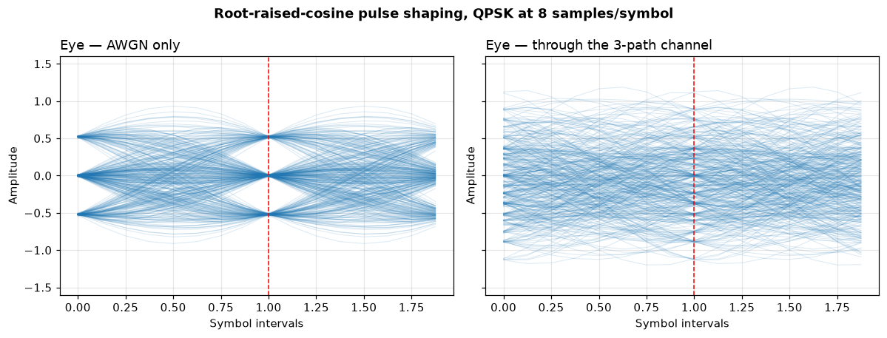
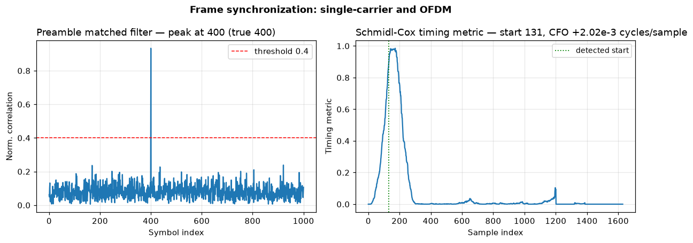
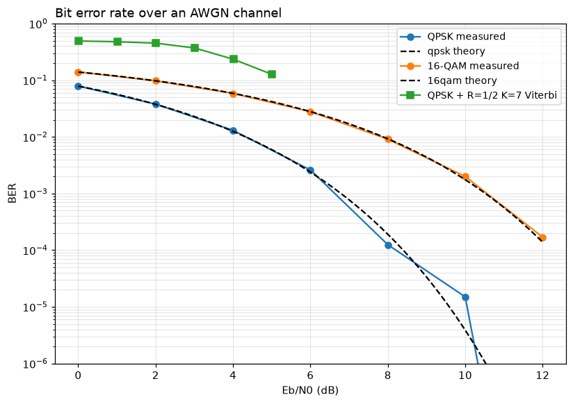
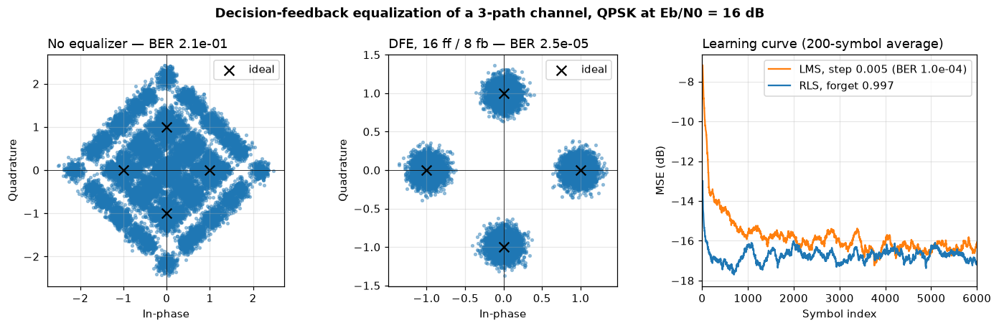
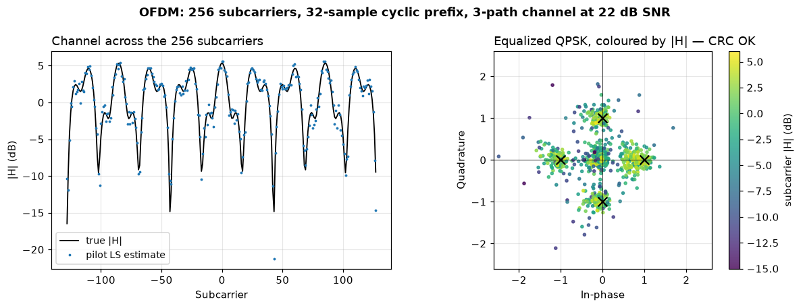
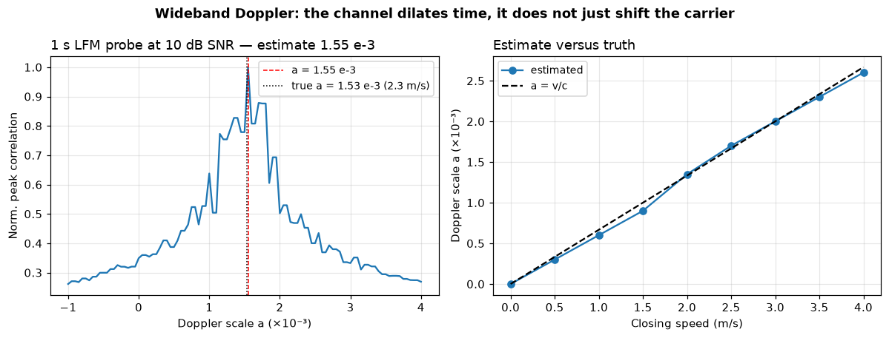
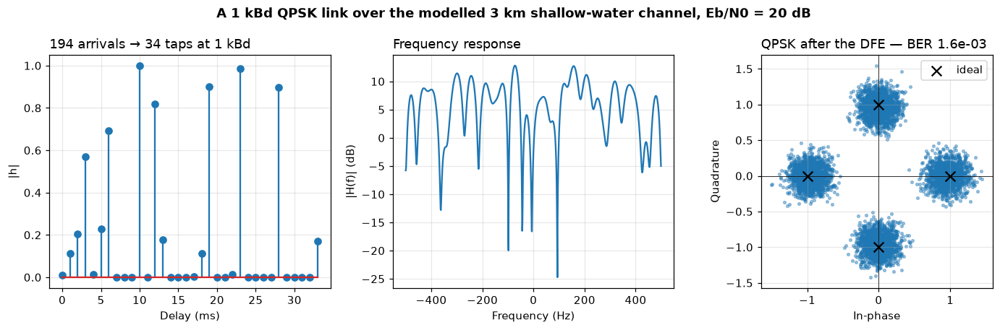
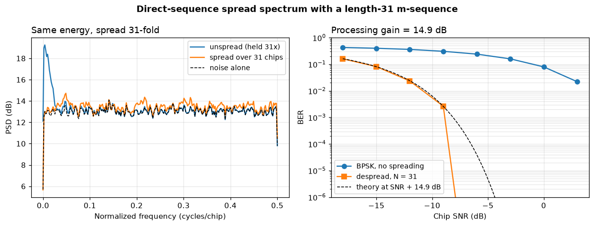
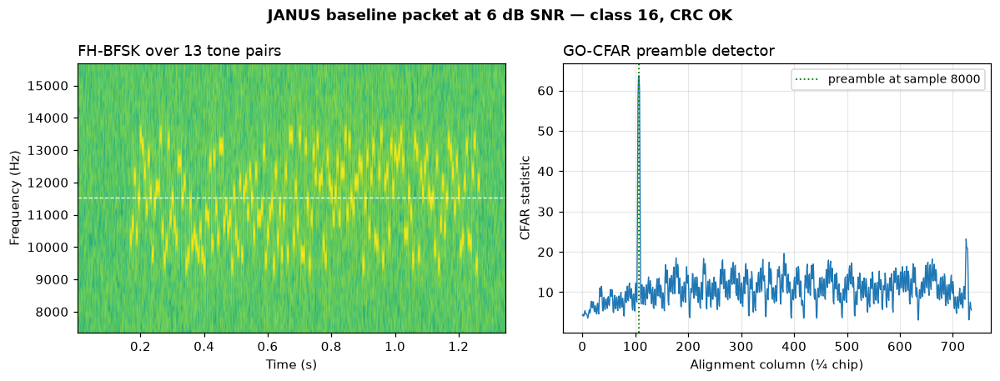

# Communications — digital modems for the underwater channel

> `uacpy.comms` · 82 public names · modulation, coding, equalisation,
> synchronisation, OFDM, DSSS, Doppler, and the NATO JANUS standard

`uacpy.comms` is a digital-communications toolbox built for the one channel
that breaks most of the assumptions a radio modem is designed around. Every
piece composes with every other, and — this is the part no other comms package
can do — the channel you push bits through can be a **modelled** one, taken
straight from a [Bellhop](../models/bellhop.md) arrivals run.

---

## 1. Why the underwater channel is its own problem

Sound travels at 1500 m/s. Radio travels at 3×10⁸ m/s. Almost everything that
makes underwater comms hard follows from that one factor of 200 000.

| | Terrestrial radio | Underwater acoustic |
|---|---|---|
| Propagation speed | 3×10⁸ m/s | ~1500 m/s |
| Usable bandwidth | MHz–GHz | kHz — often less than an octave |
| Delay spread | ~1 µs (a few symbols) | 10–100 ms (**tens to hundreds** of symbols) |
| Doppler at 3 m/s | `a = v/c ≈ 10⁻⁸` | `a = v/c ≈ 2×10⁻³` |
| Doppler shows up as | a carrier shift | a **time dilation of the whole band** |
| Coherence time at 3 m/s | ~50 ms (2 GHz carrier) | ~40 ms (12 kHz carrier), less under a moving surface |

Three consequences drive the design of every function here:

1. **Intersymbol interference is the dominant impairment**, not noise. A
   channel that smears one symbol over thirty needs an equaliser with tens of
   taps, or a multicarrier scheme that side-steps it.
2. **Doppler is wideband.** The Doppler *rate* is unremarkable — a few tens of
   Hz at walking pace, much as in radio, which is why the coherence times sit
   in the same decade. What differs is its effect: because the fractional
   bandwidth is large, motion *resamples* the signal rather than shifting it.
   You compensate by resampling, not by rotating a carrier — see
   [§13](#13-doppler).
3. **Carrier phase is the fastest-changing parameter in the channel**
   (Stojanovic), so the equaliser and the phase-locked loop have to be solved
   jointly, which is exactly what [`DFE`](#10-equalisation) does.

---

## 2. The signal chain

The package is organised as the chain a bit travels, and so is this page:

```
bits ──▶ coding ──▶ modulation ──▶ pulse shaping ──▶ upconvert ──▶ ~~~ channel ~~~
                                                                          │
bits ◀── decoding ◀── demodulation ◀── equalisation ◀── channel est. ◀────┤
                                                          ▲               │
                                                      synchronisation ◀───┘
```

Every stage is a function you can call on its own, and the whole chain is also
available as one call:

```python
import numpy as np

from uacpy import comms

rng = np.random.default_rng(0xACED)
link = comms.simulate_link('qpsk', ebn0_db=12.0, n_bits=20000, rng=rng)
print(f'BER {link.ber:.2e}, EVM {link.evm:.1%}')
```

`simulate_link` returns a [`LinkResult`](#11-the-whole-link-in-one-object) —
BER, EVM, the transmitted and received symbols, and the equaliser's learning
curve. It is the fastest way to sanity-check an idea before wiring up the
passband chain.

That `rng` is not decoration, and every snippet on this page carries it. Every
call in `uacpy.comms` that draws — `simulate_link`, `ber_sweep`, `awgn`,
`fading_taps` — takes an `rng` and falls back to `np.random.default_rng()`,
an *unseeded* generator, when you leave it out. Omit it and the BER you print
moves from run to run, which is the right default for a Monte-Carlo sweep and
the wrong one for a number you are about to quote, commit, or compare against
a previous run. Pass a seeded generator whenever the answer needs to
reproduce.

The alternative chain — **OFDM** — is in [§12](#12-ofdm-the-multicarrier-route),
and the standards-compliant **JANUS** beacon is in [§17](#17-janus-nato-stanag-4748).

---

## 3. Coding

Fading produces *bursts* of errors, so the classical underwater FEC layer is a
convolutional code plus an interleaver that scatters the burst across the
codeword.

| Call | What it does |
|---|---|
| `ConvCode(polys, K, interleave_depth)` | codec bundling encode/decode with matched settings |
| `conv_encode(bits, polys, K)` | rate-`1/len(polys)` encoder with zero tail-flush |
| `viterbi_decode(coded, polys, K)` | hard-decision Viterbi |
| `interleave(bits, depth)` / `deinterleave` | block-local `depth × depth` transpose |

```python
code = comms.ConvCode(interleave_depth=16)   # R=1/2, K=7, polys (0o171, 0o133)
coded = code.encode(bits)                    # 2N + tail, padded to whole blocks
rx = code.decode(coded)                      # back to exactly N information bits
```

The defaults are the standard rate-1/2, constraint-length-7 generators
`(0o171, 0o133)`. `ConvCode` remembers how many information bits it last
encoded so `decode` can strip the interleaver's block padding exactly; when
transmitter and receiver hold *different* codec objects, pass
`decode(coded, info_len=n)` yourself.

Decoding is **hard-decision**: the demodulator slices to bits before the
Viterbi runs, so the ~2 dB that soft decisions would buy you is left on the
table. That is the price of a decoder that composes with any demodulator in
the package.

---

## 4. Modulation

```python
mod = comms.Modulator('qpsk')
symbols = mod.modulate(bits)        # 0/1 array -> complex, unit average energy
bits_out = mod.demodulate(symbols)  # hard minimum-distance decision
```

| Family | Schemes | Notes |
|---|---|---|
| M-PSK | `bpsk`, `qpsk`, `8psk`, `16psk` | constant modulus — survives a power amp |
| Square M-QAM | `16qam`, `64qam`, `256qam` | more bits/symbol, needs a cleaner channel |
| Differential | `dpsk_modulate` / `dpsk_demodulate` | no carrier-phase reference needed |
| M-FSK | `fsk_modulate` / `fsk_demodulate` | non-coherent, works in the waveform domain |

All constellations are **Gray-mapped and unit-average-energy**, so a symbol
index is its bit label and the Eb/N0 bookkeeping in
[`ber_theory`](#9-metrics) is exact. `constellation(scheme)` returns the
lookup table directly if you want to plot or slice against it.

Coherent PSK/QAM work in the *symbol* domain, which is what lets them compose
with the equalisers, OFDM and channel estimators. DPSK and FSK are the
non-coherent fallbacks: they cost a few dB but do not need the receiver to
track carrier phase, which on a bad day underwater is the whole game.

---

## 5. Pulse shaping and the passband

Symbols are not a waveform. `uacpy.comms.phy` bridges the symbol domain and
the real samples a transducer emits:

```
symbols ──pulse_shape(sps, rolloff)──▶ baseband ──upconvert(fc)──▶ real samples
real samples ──downconvert(fc)──▶ ──rrc_matched_filter──▶ ──symbol_sync──▶ symbols
```

| Call | Purpose |
|---|---|
| `rrc_filter(sps, rolloff, span)` | root-raised-cosine taps, unit energy |
| `pulse_shape(symbols, sps, rolloff, span)` | upsample + RRC filter |
| `rrc_matched_filter(samples, sps, ...)` | the receiver half of the RRC pair |
| `upconvert` / `downconvert(x, sample_rate, fc)` | complex baseband ↔ real passband |
| `symbol_sync(samples, sps, loop_bw, ..., start)` | Gardner timing recovery |

The transmit RRC and the receive matched RRC together make a raised cosine —
a Nyquist pulse, zero ISI at the sampling instants. That is what the left eye
below shows. Put a three-path channel in between and the eye closes:

```python
sps, BAUD = 8, 1000.0
symbols = comms.Modulator('qpsk').modulate(rng.integers(0, 2, 8000))
tx = comms.pulse_shape(symbols, sps, rolloff=0.25, span=8)

channel = comms.multipath_channel([1.0, 0.7, 0.45],          # the same three
                                  [0.0, 2 / BAUD, 5 / BAUD], # paths, sampled
                                  BAUD * sps)                # at the waveform rate
clean = comms.rrc_matched_filter(comms.awgn(tx, 25.0, rng=rng), sps)
faded = comms.rrc_matched_filter(
    comms.awgn(comms.apply_channel(tx, channel), 25.0, rng=rng), sps)
```



Each trace is two symbol periods of the waveform, overlaid. The red line marks
the decision instant: on the left the eye is wide open and a timing error of a
quarter symbol still decides correctly; on the right there is no instant at
which the symbol is unambiguous, and no amount of SNR will fix it. Only an
equaliser will.

`symbol_sync` recovers the sampling clock from the data itself with a Gardner
timing-error detector. Pass `start=span*sps` — the group delay of the transmit
and receive RRC pair together, `span*sps/2` samples each — so the loop starts
on the symbol grid. It is not instantaneous: from a quarter-symbol timing
offset the loop locks within ~50 symbols, from half a symbol within ~300, so a
preamble at least that long absorbs the pull-in before the payload.

---

## 6. Channel models

A propagation model gives you the *deterministic* channel. This module adds
the stochastic and time-varying parts, and the noise.

| Call | Channel |
|---|---|
| `multipath_channel(gains, delays_s, sample_rate)` | static FIR taps from sparse arrivals |
| `apply_channel(signal, h)` | convolve with a static channel |
| `fading_taps(n_taps, n_samples, doppler_hz, sample_rate, rician_k=..., rng=...)` | time-varying tap gains, Rayleigh or Rician |
| `apply_fading_channel(signal, taps, delays_samples)` | apply the time-varying tap-delay line |
| `awgn(signal, snr_db, rng=...)` | additive noise at a target in-band SNR |
| `apply_cfo(signal, cfo)` | de-rotate by a normalised carrier offset |

```python
channel = comms.multipath_channel([1.0, 0.7, 0.45],
                                  [0.0, 2 / BAUD, 5 / BAUD], BAUD)
rx = comms.awgn(comms.apply_channel(tx, channel), 16.0, rng=rng)
```

`multipath_channel` takes arrival **gains and delays** — precisely the pair a
Bellhop `ARRIVALS` run produces, which is what [§14](#14-driving-the-modem-with-a-modelled-channel)
exploits. The gains may be complex, carrying each path's phase. Delays are
seconds; the sample rate you pass decides the tap spacing, so passing the
symbol rate gives you a symbol-spaced channel and passing `sps × baud` gives
you the waveform-rate one.

For a doubly-spread channel — multipath *and* motion — `fading_taps` gives
each tap an independent band-limited complex-Gaussian gain process with the
Doppler bandwidth you specify, and `rician_k > 0` adds a line-of-sight
component.

---

## 7. Synchronisation

Before anything can be equalised, the frame has to be found.

| Call | Returns |
|---|---|
| `matched_filter_metric(rx, preamble)` | energy-normalised correlation in `[0, 1]` |
| `detect_preamble(rx, preamble, threshold)` | `(start_index_or_None, metric)` |
| `detect_frames(rx, preamble, threshold, min_gap)` | `(list_of_starts, metric)` |
| `schmidl_cox_preamble(n_subcarriers, cp_len)` | an OFDM training symbol, two identical halves |
| `schmidl_cox_sync(rx, n_subcarriers)` | `(start_or_None, cfo)` |

```python
start, metric = comms.detect_preamble(rx, preamble, threshold=0.4)
sc_start, cfo = comms.schmidl_cox_sync(baseband, 256)
```



Two detectors, two shapes. The **matched filter** against a known preamble
gives a single sharp spike — the metric is normalised by the running energy,
so the threshold means the same thing whatever the receive level. The
**Schmidl-Cox** metric is broad where that one is sharp: it correlates the
preamble's two identical halves against each other, so it decays over the
`n_subcarriers/2` samples of that window rather than over one — a hump 118
samples wide at half maximum against a one-sample spike. Its top is flat right
across the cyclic prefix on a clean channel — 33 samples for the 32-sample
prefix here — and this channel's 22 taps eat most of that. Either way the
detector is robust to timing error and imprecise about the exact start, 140
against a true 137; a residual offset inside the cyclic prefix is absorbed by
the pilot channel estimate downstream.

Schmidl-Cox pays for that with a free carrier-frequency estimate: the phase of
the half-symbol correlation is the fractional CFO, here recovered as
`+2.02×10⁻³` cycles/sample against a true `2.0×10⁻³`. `schmidl_cox_sync`
returns `(start, cfo)` only — the metric plotted above is recomputed by
`_sc_metric` in the figure module with the same cumulative-sum formula.

The general theory of matched filtering, and the chirps and m-sequences that
make good preambles, live in [signal processing](signal.md).

---

## 8. Channel estimation

| Call | Model |
|---|---|
| `ls_estimate(rx, tx_pilots, n_taps)` | dense least squares over `n_taps` delays |
| `omp_estimate(rx, tx_pilots, n_taps, sparsity)` | orthogonal matching pursuit — at most `sparsity` taps |
| `estimate_channel(rx_pilot_symbol, pilot_freq, n_subcarriers, cp_len)` | per-subcarrier LS from one OFDM pilot block |

```python
h_ls = comms.ls_estimate(rx[:n], pilots, n_taps=64)
h_omp = comms.omp_estimate(rx[:n], pilots, n_taps=64, sparsity=6)
```

The underwater impulse response is **sparse** — a handful of strong arrivals
separated by long quiet stretches, exactly the structure the figure in
[§14](#14-driving-the-modem-with-a-modelled-channel) shows. Dense LS spends
its pilots estimating the zeros; OMP looks for the support first and needs far
fewer pilots for the same accuracy (Berger, Zhou, Preisig & Willett 2010). On a
64-tap channel carrying six arrivals at 20 dB SNR, OMP with 80 pilots matches
dense LS with about 700 — same estimate error, a ninth of the pilot overhead
(mean of eight seeds). Take `sparsity` from the number of arrivals you actually
expect, not from the tap count.

---

## 9. Metrics

| Call | Measures |
|---|---|
| `bit_error_rate(tx_bits, rx_bits)` | fraction of differing bits over the overlap |
| `symbol_error_rate(tx, rx)` | same, on labels or exact symbols |
| `evm(rx_symbols, ref_symbols)` | RMS error-vector magnitude (a fraction) |
| `ber_theory(scheme, ebn0_db)` | closed-form AWGN BER |
| `ber_sweep(scheme, ebn0_db_list, n_bits, ...)` | measured BER over a list of Eb/N0 |

```python
ebn0 = np.arange(0.0, 13.0, 2.0)
ber_qpsk = comms.ber_sweep('qpsk', ebn0, 200000, rng=rng)
ber_qam = comms.ber_sweep('16qam', ebn0, 200000, rng=rng)

code = comms.ConvCode(interleave_depth=16)
ec_n0 = np.arange(-3.0, 2.1, 1.0)
ber_coded = comms.ber_sweep('qpsk', ec_n0, 20000, code=code, rng=rng)
```



The measured points sit on the theory curves, which is the whole point of the
figure: it is the end-to-end check that modulation, noise scaling and
demodulation agree with the textbook. QPSK and BPSK share a curve (`ber_theory`
is exact for both); 16-QAM pays about 4 dB for its extra two bits per symbol.
The last QPSK marker, at 10 dB, is three bit errors in 200 000 — four times
theory, but the expected count there is 0.8, so that is small-number scatter
rather than a floor. The 12 dB point produced *zero* errors and cannot be drawn
on a log axis at all, which is why the QPSK line leaves the bottom of the plot:
200 000 bits cannot measure a BER of 9×10⁻⁹.

The coded curve needs one correction, and the figure applies it. `ber_sweep`
sets the noise from the energy of the bits it puts **on the channel**, so with
a rate-1/2 code the sweep's x value is Ec/N0. Re-plotting per *information*
bit means shifting right by `-10·log₁₀(rate)` = 3 dB:

```python
ax.semilogy(ec_n0 - 10 * np.log10(code.rate), ber_coded, ...)
```

After that correction the code is honest — and it is *worse* than uncoded QPSK
below about 3.3 dB. A rate-1/2 code halves the energy per channel bit, and
below its threshold the decoder makes more errors than it fixes. Past the
crossover it pulls away fast: 1.8× better at 4 dB, more than an order of
magnitude by 5 dB, and steeper still beyond the swept range.

---

## 10. Equalisation

Intersymbol interference is the dominant impairment, so this is the module
that matters most.

| Equaliser | Knowledge needed | Returns |
|---|---|---|
| `DFE(n_ff, n_fb, step=, forget=, pll_bandwidth=)` | training symbols | `(eq_symbols, mse)` from `.equalize` |
| `lms_equalizer(rx, constellation, n_taps, step, train)` | training symbols | `(eq_symbols, mse)` |
| `rls_equalizer(rx, constellation, n_taps, forget, train)` | training symbols | `(eq_symbols, mse)` |
| `mmse_equalizer(rx, h, snr_linear)` | the channel `h` | equalised signal only |

`snr_linear` is the linear SNR **at the equaliser input** — received signal
power over noise power, not a ratio in dB. It means the same thing for
`mmse_equalizer`, `ofdm_demodulate` and `OFDMReceiver`, so one calibrated
number can be passed to any of them: each damps by `mean(|H|²)/snr_linear`,
which is the Wiener regulariser in the units of `|H|²` and so does not move
when you rescale the channel.

The **decision-feedback equaliser** is the workhorse. Its `n_ff` feedforward
taps act on the received samples; its `n_fb` feedback taps subtract the ISI
that *already-decided* symbols contribute, which is why a DFE handles a long
sparse channel that a linear equaliser of the same length cannot. The price of
feeding decisions back is that a wrong one is subtracted as though it were
right, so errors arrive in clusters: on the channel below, a bit that follows an
error is 37 times more likely to be wrong than the average bit (Eb/N0 = 10 dB,
mean of six seeds), against 1× with no equaliser in the loop. Train on a real
preamble rather than starting blind, and keep the interleaver of
[§3](#3-coding) — the bursts it scatters are not only the channel's. Pass `step`
for LMS adaptation or `forget` for RLS, and `pll_bandwidth > 0` to track
carrier phase jointly with the taps — the Stojanovic–Catipovic–Proakis
phase-coherent receiver.

```python
channel = comms.multipath_channel([1.0, 0.7, 0.45],
                                  [0.0, 2 / BAUD, 5 / BAUD], BAUD)
raw = comms.simulate_link('qpsk', 16.0, 40000, channel=channel, rng=rng)
rls = comms.simulate_link('qpsk', 16.0, 40000, channel=channel, rng=rng,
                          equalizer=comms.DFE(n_ff=16, n_fb=8, forget=0.997))
lms = comms.simulate_link('qpsk', 16.0, 40000, channel=channel, rng=rng,
                          equalizer=comms.DFE(n_ff=16, n_fb=8, step=0.005))
```



Three paths — one at full strength, one two symbols late at 0.7, one five
symbols late at 0.45 — are enough to close a QPSK constellation completely
(left, BER 2×10⁻¹: one bit in five wrong). The same symbols through a
16-tap/8-tap DFE (centre) land in four clean clusters at BER 2.5×10⁻⁵.
Nothing about the channel changed; only the receiver.

The learning curve on the right is why you would choose one adaptation rule
over the other. RLS is within 1 dB of its own MSE floor after about 150
symbols; LMS at `step=0.005` needs about 800 (median of eight seeds, on a
200-symbol running average), and costs a fraction of the arithmetic per symbol
to get there. They then settle a third of a dB apart —
RLS 0.34 dB lower on the same channel and the same noise — so what RLS buys is
convergence *rate*, not steady-state accuracy. That last third of a dB is LMS
misadjustment, and the step size sets it: `step=0.002` closes the gap to
0.22 dB and converges in ~1500 symbols, `step=0.02` opens it to 1.7 dB and
converges in ~330. On a channel that stays put, both are fine; on one that
changes inside a packet, the convergence rate *is* the performance.

`mmse_equalizer` is the one-shot alternative when you already know `h`: a
Wiener solution in the frequency domain,
`W(f) = H*(f)/(|H(f)|² + mean(|H|²)/snr)`.
Because it is an FFT, the equalisation is **circular** — feed it a
cyclic-prefixed block, or discard the first `len(h)-1` outputs.

---

## 11. The whole link in one object

Two levels of packaging sit above the chain.

**`simulate_link` / `ber_sweep`** work in the symbol domain and answer "what
BER does this configuration give?":

```python
link = comms.simulate_link('qpsk', 16.0, 40000, channel=channel,
                           equalizer=comms.DFE(n_ff=16, n_fb=8, forget=0.997),
                           code=comms.ConvCode(interleave_depth=16),
                           n_train=400, rng=rng)
```

`LinkResult` carries `ber`, `evm`, `scheme`, `ebn0_db`, `tx_symbols`,
`rx_symbols` and the equaliser's `mse`.

**`Transmitter` / `CommsReceiver`** go all the way to real passband samples —
what you would write to a `.wav` and play through a projector:

```python
code = comms.ConvCode(interleave_depth=16)
dfe = comms.DFE(n_ff=16, n_fb=6, forget=0.997, pll_bandwidth=0.04)

tx = comms.Transmitter('qpsk', code=code, preamble=256)
rx = comms.CommsReceiver('qpsk', code=code, equalizer=dfe, preamble=256)

passband = tx.transmit_passband(comms.pack_frame(message), fs, fc, sps=8)
bits = rx.receive_passband(received, fs, fc, sps=8)
payload, crc_ok = comms.unpack_frame(bits)
```

The preamble does double duty, as it does in every real underwater frame: it
is the sync probe *and* the equaliser's training sequence. Both ends must
agree on it — passing the same integer to both constructors generates the same
pseudo-random sequence. [`example_32_realdata_modem.py`](../../uacpy/examples/example_32_realdata_modem.py)
runs this end to end, text in and text out, through a `.wav` file.

---

## 12. OFDM: the multicarrier route

A cyclic prefix turns one frequency-selective channel into 256 flat ones, each
fixed by a single complex tap. That trade — a long guard interval instead of a
long equaliser — is why most modern underwater modems are multicarrier.

The one condition is that the prefix outlast the channel, `cp_len ≥ len(h)-1`,
and it is exact: on the 22-tap channel below, a 21-sample prefix still gives a
noise-free EVM of 0.0%, and a 20-sample one gives 4.3%. Shorter still and it
degrades steadily — 8.1% at `cp_len=16`, 12.1% at 12 — with the *same* figures
at 40 dB SNR as with no noise at all. That is inter-block interference, an
error floor no amount of transmit power will lower. It is also OFDM's bill
underwater: a delay spread of tens of milliseconds needs a guard interval of
tens of milliseconds, and every sample of it is throughput you do not send.

| Call | Purpose |
|---|---|
| `ofdm_modulate(symbols, n_subcarriers, cp_len)` | map + IFFT + prepend CP |
| `ofdm_demodulate(rx, n_subcarriers, cp_len, channel=, snr_linear=)` | strip CP + FFT + optional ZF/MMSE |
| `OFDMTransmitter(modulation, n_subcarriers, cp_len, code=)` | full frame: preamble, pilot, data, guard |
| `OFDMReceiver(..., snr_linear=).from_passband(samples, fs, fc)` | resample away the common Doppler scale, down-convert, decimate |
| `OFDMReceiver(...).receive(baseband)` | Schmidl-Cox → residual CFO → FFT → pilot estimate → equalise → per-block phase |

```python
tx = comms.OFDMTransmitter('qpsk', 256, 32, code=comms.ConvCode(interleave_depth=16))
frame = tx.transmit(comms.pack_frame(message))       # [SC preamble | pilot | data...]

channel = comms.multipath_channel([1.0, 0.55, 0.3], [0.0, 9.0, 21.0],
                                  sample_rate=1.0)   # delays in samples
rx = comms.awgn(comms.apply_channel(frame, channel), 22.0, rng=rng)
rx = np.concatenate([np.zeros(137, dtype=complex), rx])  # propagation delay
rx *= np.exp(2j * np.pi * 2.0e-3 * np.arange(rx.size))   # residual CFO

start, cfo = comms.schmidl_cox_sync(rx, 256)
x = comms.apply_cfo(rx[start:], cfo)
h_est = comms.estimate_channel(x[288:576], tx.pilot_freq, 256, 32)
```



The left panel is the whole argument for OFDM and its whole weakness at once.
The three-path channel puts a deep null every 26 to 33 subcarriers — the
`256/9` period of its strongest echo, nine samples late — and the one-pilot
least-squares estimate (dots) follows the true response (line) right down into
them.

The right panel colours every equalised symbol by the `|H|` of the subcarrier
it rode in on. The scatter is not random: the bright points — carriers near a
peak — land tightly on the constellation, and the dark ones — carriers in a
null — are smeared, because dividing by a small `H` amplifies that
subcarrier's noise along with its signal. **This is why the FEC and the
interleaver are not optional in OFDM**: the interleaver spreads each codeword
across good and bad carriers, and the Viterbi decoder spends the good ones'
margin on the bad ones. The frame above decodes to a valid CRC despite a
constellation that looks like a failure.

`OFDMReceiver` runs the practical underwater sequence, split over two entry
points. `from_passband` is the one that estimates and resamples away the common
Doppler scale before down-converting; `receive` takes it from there —
Schmidl-Cox for timing and fractional CFO, FFT, pilot channel estimate,
one-tap equalisation, then a decision-directed common-phase correction per
block. `receive_passband` chains the two. The bit stream `receive` returns
runs past the payload — every block after the pilot is decoded as data, the
transmitter's trailing zero guard included — so slice it to the known payload
length. Handing `receive` a baseband frame
yourself skips the resampling, which is right only when the platform is
stationary. `snr_linear` — the same input-referred linear SNR defined for
`mmse_equalizer` above — switches the per-subcarrier weight from zero-forcing
to MMSE. With the hard-decision slicer this receiver uses that is a positive
real rescale of the zero-forcing output: PSK decisions are unchanged and QAM
decisions are slightly worse (biased inward). It only pays off with soft
decisions or bias removal; measured, 16-QAM at 10 dB went from BER 0.106 (ZF)
to 0.112 (MMSE).

**Why the resampling has to come first.** A Doppler scale `a` shifts subcarrier
`k` by `a·f_k`, so the shift grows across the band and no single frequency
correction can take it out. Take a 256-carrier frame with 24 kHz of band on a
93.75 Hz carrier grid, through a three-path channel at 24 dB SNR. At
`a = 10⁻³`, 1.5 m/s, the two band edges differ by 24 Hz in Doppler, a quarter of
a subcarrier, and that is enough: Schmidl-Cox still recovers the *common* offset
to within 7%, and the frame decodes with 29% bit errors and a failed CRC anyway.
Resample first and the same frame comes back without a single bit error, at
1.5 m/s and at 3 m/s. What a scalar cannot absorb is not a phase error to be
tracked — it breaks the orthogonality the FFT depends on, leaking each
subcarrier into its neighbours (Li, Zhou & Stojanovic 2008).
[Example 33](../../uacpy/examples/example_33_ofdm_modem.py) runs that geometry
with the resampling in place, which is why it decodes.

---

## 13. Doppler

Underwater, motion **dilates** the signal. A closing speed `v` compresses the
received waveform by `a = v/c`, and because `c` is 1500 m/s that scale factor
is around `10⁻³` — five orders of magnitude larger than the radio case, and
far too large to treat as a carrier shift across a signal whose bandwidth is a
significant fraction of its centre frequency.

| Call | Purpose |
|---|---|
| `doppler_from_speed(speed_mps, sound_speed_mps=1500)` | `a = v/c` (scalar) |
| `estimate_doppler_scale(rx, template, scales=None)` | `(best_scale, scales, peak_metric)` |
| `compensate_doppler(signal, scale)` | resample back to the transmit time base |

```python
from uacpy.acoustic_signal import lfm_chirp

_, probe = lfm_chirp(1000.0, 5000.0, 1.0, 12000.0)     # 1 s wideband probe
# what a receiver closing at 2.3 m/s hears: the probe compressed, in a record
heard = comms.compensate_doppler(probe, -comms.doppler_from_speed(2.3))
record = comms.awgn(np.concatenate([np.zeros(500), heard.real, np.zeros(500)]),
                    10.0, rng=rng)

a_hat, scales, peak = comms.estimate_doppler_scale(
    record, probe, np.linspace(-1e-3, 4e-3, 101))
clean = comms.compensate_doppler(record, a_hat)        # back on the transmit clock
```



The estimator compensates the *received* record by each candidate scale and
scores it against the template with the same energy-normalised matched-filter
metric the preamble detector uses, so the scores are comparable across
candidates. The peak is the estimate; the curve around it is the ambiguity
function, and its width tells you how confidently you can call it.

Two practical limits are visible. First, **resolution is set by the probe's
duration times its bandwidth**, not by its sample count: the main lobe is
`Δa ≈ 3/(B·T)` wide at half power, which for the 1 s, 4 kHz-wide probe here is
`7×10⁻⁴`. Sampling that same probe at 24 or 48 kHz moves the width by under 6%;
doubling `T` or `B` halves it. The lobe is that broad because the estimator
maximises over lag as well as over scale, so it rides the delay–Doppler ridge
of the chirp's ambiguity function — the case Abraham (§8.5.1) puts at
`Δa₃dB ≈ 3.48/(T·B)`.

Second, resolution is not accuracy. The estimate above lands `1.7×10⁻⁵` from
truth, forty times inside that main lobe, because a smooth peak can be located
far more finely than its width — as long as the `scales` grid is fine enough to
sample it. The default grid is: `linspace(-5e-3, 5e-3, 601)` — about
±7.5 m/s, in steps of `1.67×10⁻⁵`, or 0.025 m/s at `c = 1500` — searched in
two stages, every 15th candidate and then the 29 grid steps around the coarse
peak (~70 metric evaluations in all), and the same record handed to that
default comes back the same one grid step from truth as the 101-point grid
above. Pass your own `scales` when the platform can be faster than ±7.5 m/s,
or to zoom below the 0.025 m/s step.

The right panel confirms the convention across the whole speed range: the
estimate that comes out is `a = v/c`, positive for a closing geometry, and it
is the value to feed straight back into `compensate_doppler`.

---

## 14. Driving the modem with a modelled channel

Everything above ran through a channel someone made up. This is the part that
makes `uacpy.comms` different: take a [Bellhop](../models/bellhop.md)
`ARRIVALS` result and let the ocean specify the taps.

```python
from uacpy.models import Bellhop, RunMode

env, source, _ = shallow_water()        # the shared 100 m channel of the model pages
point = uacpy.Receiver(depths=60.0, ranges=3000.0)
arrivals = Bellhop(n_beams=4000, alpha=(-10.0, 10.0)).run(
    env, source, point, run_mode=RunMode.ARRIVALS)

gains = arrivals.received_amplitudes
delays = arrivals.delays - arrivals.delays.min()
channel = comms.multipath_channel(gains, delays, BAUD)
channel /= np.abs(channel).max()

link = comms.simulate_link('qpsk', 20.0, 20000, channel=channel, n_train=2000,
                           equalizer=comms.DFE(n_ff=24, n_fb=32, forget=0.999),
                           rng=rng)
```



Three lines convert a propagation result into a modem channel:
`arrivals.received_amplitudes` are the complex path gains, `arrivals.delays`
are absolute travel times, so subtracting the earliest re-references the
impulse response to the first arrival. Use `received_amplitudes` rather than
building the gains yourself from `amplitudes * exp(1j * phases)`: those two
agree here only because this 200 Hz channel carries no volume absorption, and
BELLHOP keeps absorption in the imaginary travel time rather than in the
amplitude column. At a modem's frequency the difference is not subtle — 13 dB
per kilometre of path at 40 kHz — and because it grows with path length it
reweights the taps against each other, which normalising the channel does not
undo. `multipath_channel` then bins the arrivals onto a tap grid at
whatever rate you pass — 1 kBd here, giving a symbol-spaced channel.

The result is not a textbook three-tap channel. It is 33 ms of structure — 33
symbols at this rate — with strong late arrivals at 10, 19, 23 and 28 ms and a
frequency response spanning 37 dB, whose deepest fades sit 26 to 37 dB below
its peaks. A DFE with 24 feedforward and 32 feedback taps reopens it at BER
1.5×10⁻³.

Some deliberate choices in that snippet are worth copying:

- **The launch fan is narrow** (`alpha=(-10, 10)`). A vertically directive
  projector is what a real modem uses, and it is also what keeps the delay
  spread finite: over ±45° the same geometry spreads arrivals across 300 ms,
  which no symbol-spaced equaliser of a sane length will touch.
- **Many arrivals, few taps.** Each beam that reaches the receiver writes its
  own arrival record — 4000 of them here — and `multipath_channel` sums the
  ones that fall in the same tap *coherently*, using their phases. That is the
  same summation Bellhop's coherent TL does.
- **The channel is normalised.** `simulate_link` sets noise from the symbol
  energy, so absolute path loss would just move the operating point; scale the
  taps and set Eb/N0 explicitly.

For a *broadband* channel rather than a set of arrivals, `RunMode.BROADBAND`
gives `H(d, r, f)` and `Field.plot_impulse_response` inverts it — see
[results](results.md). The general "waveform through a modelled channel" tools
(`impulse_response`, `simulate_reception`) live in
[signal processing](signal.md).

---

## 15. DSSS

Spreading each symbol over `N` chips trades bandwidth for **processing gain**
`10·log₁₀(N)`: the signal drops below the noise floor while the despread SNR
climbs by that much.

| Call | Purpose |
|---|---|
| `m_sequence(n_register, taps)` | maximal-length ±1 PN sequence, length `2ⁿ−1` |
| `spread(symbols, code)` | one symbol → `len(code)` chips |
| `despread(chips, code)` | correlate per symbol period |
| `processing_gain_db(code)` | `10·log₁₀(N)` |

```python
code = comms.m_sequence(5, [5, 2])              # length 31, 14.9 dB of gain
chips = comms.awgn(comms.spread(symbols, code), -9.0, rng=rng)
estimates = comms.despread(chips, code)
```



Left: the same symbols, the same energy, the same duration, sent two ways
against the same noise. Held over 31 chip periods, the signal occupies a
thirty-first of the band and stands 6 dB above the noise floor — visible to
anyone with a spectrum analyser. Spread over 31 chips it is flat, 10 dB below
the noise, and barely lifts the floor at all.

Right: what that costs and buys. Un-spread BPSK at −9 dB chip SNR is useless;
despread, the same chip SNR gives a BER on the theoretical curve evaluated
`14.9 dB` higher — the processing gain, recovered exactly. The same
correlation gain is what rejects a narrowband interferer.

The module is `uacpy.comms.dsss`; the spreading function is `comms.spread`.
`uacpy.acoustic_signal.sequences.mseq` is the sibling generator keyed by
preset polynomials rather than explicit taps, with the same chip polarity
(bit 0 → +1, bit 1 → −1) — see [signal processing](signal.md).

---

## 16. Framing

Bits are not a message. `uacpy.comms.framing` is the data-plane glue:

| Call | Purpose |
|---|---|
| `bytes_to_bits` / `bits_to_bytes` | MSB-first byte ↔ bit conversion |
| `pack_frame(payload)` | `[len:4][payload][crc32:4]` as a bit array |
| `unpack_frame(bits)` | `(payload_bytes, crc_ok)` |

```python
bits = comms.pack_frame(b'a real message')
payload, crc_ok = comms.unpack_frame(received_bits)
```

The 4-byte length header lets the receiver find the payload's end even when
the FEC and interleaver have padded the stream out to a block boundary, and
the CRC-32 tells you whether to believe it. Every passband example in the
package frames its payload this way.

---

## 17. JANUS: NATO STANAG 4748

JANUS is the first internationally standardised **digital** underwater acoustic
communications protocol: a deliberately simple frequency-hopped BFSK beacon
meant as the common language between modems that otherwise cannot talk to each
other. uacpy implements the **baseline 64-bit packet** and its physical layer.

| Call | Purpose |
|---|---|
| `JanusPacket(class_id, app_type, app_data, mobility, ...)` | the 64-bit packet, `.to_bits()` / `.from_bits()` |
| `janus_encode` / `janus_decode` | 64 bits ↔ 144 coded, interleaved channel symbols |
| `janus_modulate` / `janus_demodulate` | FH-BFSK waveform ↔ `(bits, crc_ok)` |
| `janus_detect(waveform, sample_rate)` | `(start, statistic)` from the CMRE GO-CFAR detector |
| `janus_transmit(packet, ...)` / `janus_receive(waveform, ...)` | packet ↔ waveform, one call |

```python
app_data = np.zeros(34, dtype=int)
app_data[:16] = comms.bytes_to_bits(b'SOS')[:16]
packet = comms.JanusPacket(class_id=16, app_type=0, app_data=app_data, mobility=1)

waveform = comms.janus_transmit(packet, 48000.0)      # 1.10 s of real samples
start, statistic = comms.janus_detect(rx, 48000.0)
decoded, crc_ok = comms.janus_receive(rx, 48000.0)
```



The whole standard is in that picture. 64 packet bits (56 of payload plus a
CCITT CRC-8) become 144 channel symbols through a rate-1/2, K=9 convolutional
code and a depth-13 interleaver. Each symbol is one 6.25 ms tone chip, and
the hop sequence moves it around 13 tone pairs spanning the initial band —
11 520 Hz centre, 4160 Hz wide — so no narrowband fade can take out a run of
symbols. A fixed 32-chip preamble leads the packet, and the Greatest-Of CFAR
detector finds it: one spike in the right panel, landing on the sample where
the packet was inserted, at 6 dB SNR.

The implementation is **cross-verified bit-exact against the official CMRE
`janus-c` 3.0.5 reference** — the packet layout, CRC-8, generators, hop
sequence and 32-chip preamble all match, and uacpy decodes waveforms the
reference implementation emitted. It is a worked interoperability case, not a
lookalike.

---

## 18. Plotting

Every figure on this page comes from
[`docs/figure_scripts/comms.py`](../figure_scripts/comms.py) using the
plotters in `uacpy.visualization`. The comms family:

| Plotter | Shows |
|---|---|
| `plot_scatter(symbols, ax, ideal=)` | a received constellation |
| `plot_constellation(constellation, ax)` | an ideal Gray-labelled constellation |
| `plot_eye_diagram(signal, sps, ax)` | the eye |
| `plot_ber_curve(ebn0, ber, ax, scheme=)` | measured BER with the theory overlay |
| `plot_convergence(mse, ax)` | an equaliser learning curve |
| `plot_sync_metric(metric, ax, threshold=)` | a synchronisation metric |
| `plot_channel(h, sample_rate, (ax_h, ax_f))` | `\|h\|` and `\|H(f)\|` side by side |
| `plot_subcarriers(channel, n_subcarriers, ax)` | the OFDM channel response |
| `plot_doppler_ambiguity(scales, peak, ax)` | the Doppler ambiguity curve |

All of them take plain arrays, accept `ax` as the last positional argument —
directly after the data, so it sits second in the one-array signatures and
third in the two-array ones, as the table shows — and return `(fig, ax)`, the
convention described in [plotting](plotting.md). The `uacpy.comms` modules themselves never import
matplotlib.

---

## 19. Gotchas

**`simulate_link`'s Eb/N0 is per channel bit.** With `code=`, that is Ec/N0:
shift by `-10·log₁₀(rate)` before comparing a coded curve to an uncoded one,
or the code gets a free 3 dB it did not earn.

**Decoding is hard-decision throughout.** The demodulator slices before the
Viterbi decoder runs. Expect roughly 2 dB less coding gain than a soft-decision
decoder would deliver.

**`ConvCode` remembers its own last payload length.** `decode` uses it to strip
the interleaver's padding. That is right for loopback and for a codec object
shared by both ends; a receiver holding its own codec must pass `info_len`.

**`mmse_equalizer` is circular.** It is an FFT solution, so give it a
cyclic-prefixed block or discard the first `len(h)-1` outputs.

**A DFE cannot cancel what it cannot reach.** `n_fb` must span the channel's
post-cursor spread in symbols. On the modelled channel of
[§14](#14-driving-the-modem-with-a-modelled-channel) that means 32 feedback
taps for 33 ms at 1 kBd — halve the symbol rate and you halve the taps.

**`doppler_from_speed` is scalar-only.** Map it over an array of speeds.

**Doppler-scale resolution is `≈3/(B·T)`, set by the probe's bandwidth and
duration, not by its sample rate.** The 1 s, 4 kHz probe of
[§13](#13-doppler) resolves `7×10⁻⁴`; oversampling it changes nothing,
lengthening or widening it is what helps. The *estimate* is far finer than the
resolution — `1.7×10⁻⁵` here — so a fine `scales` grid does earn its keep, but
`compensate_doppler` resamples to `round(N·(1+a))` samples, so candidates
closer together than `1/N` of the record — `7.7×10⁻⁵` for the ~13 000-sample
record above — resample identically, and refining past that buys nothing.

**`CommsReceiver.receive` without an equaliser assumes the payload starts
exactly `len(preamble)` symbols after the detected start.** With real delay
spread, preamble ISI leaks into the first payload symbols. Give it an
equaliser.

**Preambles must match at both ends.** `Transmitter('qpsk', preamble=256)` and
`CommsReceiver('qpsk', preamble=256)` generate the same sequence from the same
seed; different lengths mean no detection at all.

---

## 20. References

- Istepanian, R. S. H. & Stojanovic, M. (eds.), *Underwater Acoustic Digital
  Signal Processing and Communication Systems*, Kluwer, 2002 — the source for
  the frame structure, the DFE/PLL receiver and the resampling Doppler
  treatment.
- Stojanovic, M., Catipovic, J. & Proakis, J. G., "Phase-coherent digital
  communications for underwater acoustic channels", *IEEE J. Oceanic Eng.*
  19(1), 1994 — the joint DFE + PLL receiver.
- Proakis, J. G. & Salehi, M., *Digital Communications*, 5th ed., McGraw-Hill,
  2008 — constellations, Viterbi, equalisers, spread spectrum, error
  probabilities.
- Abraham, D. A., *Underwater Acoustic Signal Processing*, Springer — §8.5.1 for
  waveform resolution versus estimation accuracy, and the Doppler-scale
  resolution of an LFM probe when the arrival time is unknown too.
- Schmidl, T. M. & Cox, D. C., "Robust frequency and timing synchronization for
  OFDM", *IEEE Trans. Comms* 45(12), 1997.
- Li, B., Zhou, S., Stojanovic, M. et al., "Multicarrier communication over
  underwater acoustic channels with nonuniform Doppler shifts", *IEEE J.
  Oceanic Eng.* 33(2), 2008.
- Berger, C. R., Zhou, S., Preisig, J. C. & Willett, P., "Sparse channel
  estimation for multicarrier underwater acoustic communication", *IEEE Trans.
  Signal Processing* 58(3), 2010.
- Sharif, B. S., Neasham, J., Hinton, O. R. & Adams, A. E., "A computationally
  efficient Doppler compensation system for underwater acoustic
  communications", *IEEE J. Oceanic Eng.* 25(1), 2000.
- Potter, J., Alves, J., Green, D., Zappa, G., Nissen, I. & McCoy, K., "The
  JANUS underwater communications standard", *IEEE UComms*, 2014; NATO STANAG
  4748.

**Runnable examples:**
[31 — comms tour](../../uacpy/examples/example_31_underwater_comms.py) ·
[32 — real-data modem](../../uacpy/examples/example_32_realdata_modem.py) ·
[33 — OFDM modem](../../uacpy/examples/example_33_ofdm_modem.py) ·
[34 — JANUS beacon](../../uacpy/examples/example_34_janus_beacon.py)

---

**See also:** [signal processing](signal.md) · [array processing](arrays.md) ·
[noise](noise.md) · [sonar](sonar.md) · [results](results.md) ·
[plotting](plotting.md) · [Bellhop](../models/bellhop.md) ·
[documentation index](../README.md)
