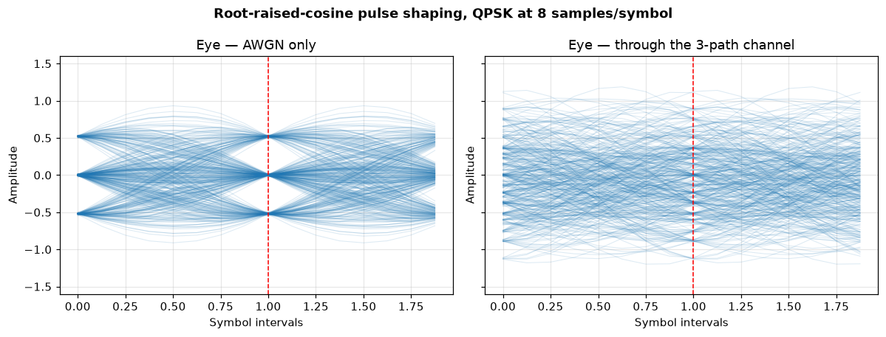
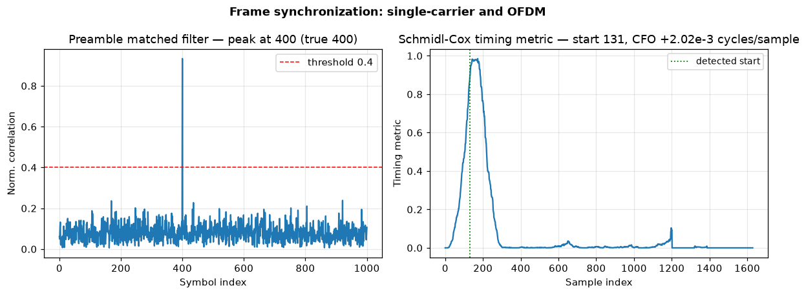
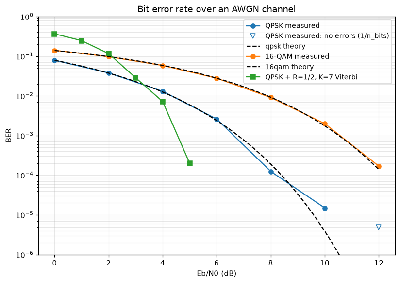
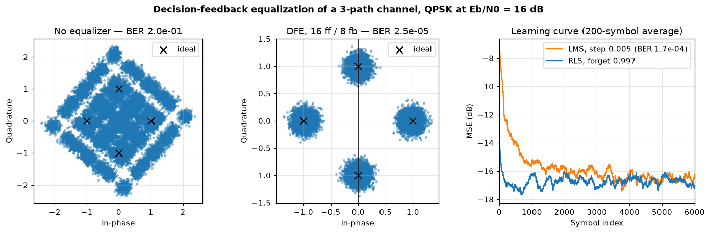
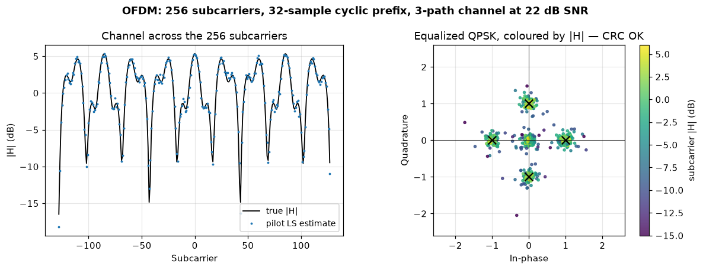
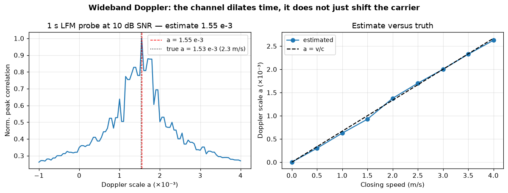
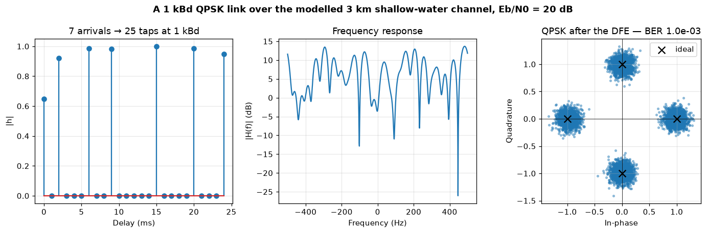
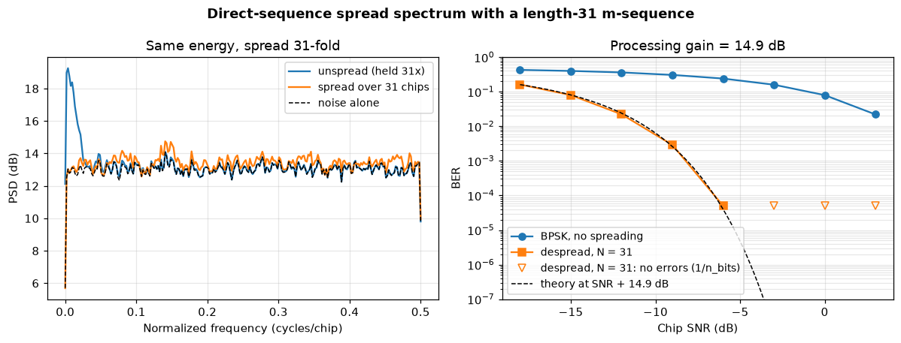
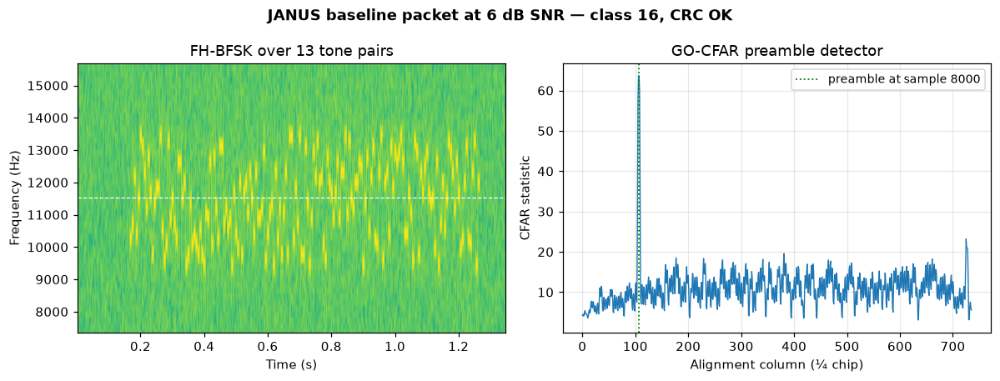

# Communications — digital modems for the underwater channel

> `uacpy.comms` · 84 public names · modulation, coding, equalisation,
> synchronisation, OFDM, DSSS, Doppler, and the NATO JANUS standard

`uacpy.comms` is a digital-communications toolbox built for the one channel
that breaks most of the assumptions a radio modem is designed around. Every
piece composes with every other, and — this is the part no other comms package
can do — the channel you push bits through can be a **modelled** one, taken
straight from a [Bellhop](../models/bellhop.md) arrivals run.

---

## 1. Why the underwater channel is its own problem

Sound travels at 1500 m/s. Radio travels at 3×10⁸ m/s. Almost everything that
makes underwater comms hard follows from that one factor of 200 000.

| | Terrestrial radio | Underwater acoustic |
|---|---|---|
| Propagation speed | 3×10⁸ m/s | ~1500 m/s |
| Usable bandwidth | MHz–GHz | kHz — often less than an octave |
| Delay spread | ~1 µs (a few symbols) | 10–100 ms (**tens to hundreds** of symbols) |
| Doppler at 3 m/s | `a = v/c ≈ 10⁻⁸` | `a = v/c ≈ 2×10⁻³` |
| Doppler shows up as | a carrier shift | a **time dilation of the whole band** |
| Coherence time at 3 m/s | ~50 ms (2 GHz carrier) | ~40 ms (12 kHz carrier), less under a moving surface |

Three consequences drive the design of every function here:

1. **Intersymbol interference is the dominant impairment**, not noise. A
   channel that smears one symbol over thirty needs an equaliser with tens of
   taps, or a multicarrier scheme that side-steps it.
2. **Doppler is wideband.** The Doppler *rate* is unremarkable — a few tens of
   Hz at walking pace, much as in radio, which is why the coherence times sit
   in the same decade. What differs is its effect: because the fractional
   bandwidth is large, motion *resamples* the signal rather than shifting it.
   You compensate by resampling, not by rotating a carrier — see
   [§13](#13-doppler).
3. **Carrier phase is the fastest-changing parameter in the channel**
   (Stojanovic), so the equaliser and the phase-locked loop have to be solved
   jointly, which is exactly what [`DFE`](#10-equalisation) does.

---

## 2. The signal chain

The package is organised as the chain a bit travels, and so is this page:

```
bits ──▶ coding ──▶ modulation ──▶ pulse shaping ──▶ upconvert ──▶ ~~~ channel ~~~
                                                                          │
bits ◀── decoding ◀── demodulation ◀── equalisation ◀── channel est. ◀────┤
                                                          ▲               │
                                                      synchronisation ◀───┘
```

Four sub-modules carry it, split by where a stage sits in that chain:

| Sub-module | The question it answers | What it holds |
|---|---|---|
| `modulate` | what goes on the wire | symbol mapping (PSK/QAM/DPSK/FSK), payload framing, OFDM symbol construction, convolutional coding and interleaving, DSSS spreading |
| `link` | what the wire does to it | channel models (AWGN, multipath, fading), pulse shaping and the passband conversion, the `Transmitter`/`CommsReceiver` pair, and the end-to-end `simulate_link`/`ber_sweep` harness |
| `receive` | what do I get back out | synchronisation, Doppler estimation and compensation, channel estimation, equalisation (`DFE`, LMS, RLS, MMSE), and the link-quality metrics |
| `janus` | the standard beacon | NATO STANAG 4748 encode/decode, FH-BFSK modulation, detection, and the one-call transmit/receive pair |

You will not type those names: every public name is re-exported from
`uacpy.comms`, so it is `uacpy.comms.simulate_link`, never
`...link.simulate_link`. The boundaries are for whoever maintains the package.

Every stage is a function you can call on its own, and the whole chain is also
available as one call:

```python
import numpy as np

from uacpy import comms

rng = np.random.default_rng(0xACED)
link = comms.simulate_link('qpsk', ebn0_dB=12.0, n_bits=20000, rng=rng)
print(f'BER {link.ber:.2e}, EVM {link.evm:.1%}')
```

`simulate_link` returns a [`LinkResult`](#11-the-whole-link-in-one-object) —
BER, EVM, the transmitted and received symbols, and the equaliser's learning
curve. It is the fastest way to sanity-check an idea before wiring up the
passband chain.

That `rng` is not decoration, and every snippet on this page carries it. Every
call in `uacpy.comms` that draws — `simulate_link`, `ber_sweep`, `awgn`,
`fading_taps` — takes an `rng` and falls back to `np.random.default_rng()`,
an *unseeded* generator, when you leave it out. Omit it and the BER you print
moves from run to run, which is the right default for a Monte-Carlo sweep and
the wrong one for a number you are about to quote, commit, or compare against
a previous run. Pass a seeded generator whenever the answer needs to
reproduce.

The alternative chain — **OFDM** — is in [§12](#12-ofdm-the-multicarrier-route),
and the standards-compliant **JANUS** beacon is in [§17](#17-janus-nato-stanag-4748).

---

## 3. Coding

Fading produces *bursts* of errors, so the classical underwater FEC layer is a
convolutional code plus an interleaver that scatters the burst across the
codeword.

| Call | What it does |
|---|---|
| `ConvCode(polys, constraint_length, interleave_depth)` | codec bundling encode/decode with matched settings |
| `conv_encode(bits, polys, constraint_length)` | rate-`1/len(polys)` encoder with zero tail-flush |
| `viterbi_decode(coded, polys, constraint_length)` | hard-decision Viterbi |
| `viterbi_hard(bm0, bm1, prev0, prev1, n_states, bit_of_state)` | the survivor selection on its own, for a caller holding its own branch metrics |
| `interleave(bits, depth)` / `deinterleave` | block-local `depth × depth` transpose |

```python
code = comms.ConvCode(interleave_depth=16)   # R=1/2, K=7, polys (0o171, 0o133)
coded = code.encode(bits)                    # 2N + tail, padded to whole blocks
rx = code.decode(coded, info_len=N)          # back to exactly N information bits
```

The defaults are the standard rate-1/2, constraint-length-7 generators
`(0o171, 0o133)`. `ConvCode` holds no per-message state: `decode(coded,
info_len=n)` strips the interleaver's block padding to exactly `n` bits, and
`decode(coded)` returns the full Viterbi output, payload then padding. A
framed payload (`pack_frame`) carries its own length, so the receivers decode
the full stream and `unpack_frame` reads the payload out of it.

Decoding is **hard-decision**: the demodulator slices to bits before the
Viterbi runs, so the ~2 dB that soft decisions would buy you is left on the
table. That is the price of a decoder that composes with any demodulator in
the package.

---

## 4. Modulation

```python
mod = comms.Modulator('qpsk')
symbols = mod.modulate(bits)        # 0/1 array -> complex, unit average energy
bits_out = mod.demodulate(symbols)  # hard minimum-distance decision
```

| Family | Schemes | Notes |
|---|---|---|
| M-PSK | `bpsk`, `qpsk`, `8psk`, `16psk` | constant modulus — survives a power amp |
| Square M-QAM | `16qam`, `64qam`, `256qam` | more bits/symbol, needs a cleaner channel |
| Differential | `dpsk_modulate` / `dpsk_demodulate` | no carrier-phase reference needed |
| M-FSK | `fsk_modulate` / `fsk_demodulate` | non-coherent, works in the waveform domain |

The table is the package's own: `SCHEMES` maps each scheme name to its
`(family, order)` — `SCHEMES['16qam'] == ('qam', 16)` — and
`constellation`, `Modulator` and `ber_theory` all read it.

All constellations are **Gray-mapped and unit-average-energy**, so a symbol
index is its bit label and the Eb/N0 bookkeeping in
[`ber_theory`](#9-metrics) is exact. `constellation(scheme)` returns the
lookup table directly if you want to plot or slice against it, and
`slicer(x, constellation)` makes that decision for you — the nearest point of
the table to each element of `x`, which is what every hard-decision receiver in
this module is doing internally.

Coherent PSK/QAM work in the *symbol* domain, which is what lets them compose
with the equalisers, OFDM and channel estimators. DPSK and FSK are the
non-coherent fallbacks: they cost a few dB but do not need the receiver to
track carrier phase, which on a bad day underwater is the whole game.

---

## 5. Pulse shaping and the passband

Symbols are not a waveform. `uacpy.comms.phy` bridges the symbol domain and
the real samples a transducer emits:

```
symbols ──pulse_shape(sps, rolloff)──▶ baseband ──upconvert(fc)──▶ real samples
real samples ──downconvert(fc)──▶ ──rrc_matched_filter──▶ ──symbol_sync──▶ symbols
```

| Call | Purpose |
|---|---|
| `rrc_filter(sps, rolloff, span)` | root-raised-cosine taps, unit energy |
| `rrc_pulse(t_symbols, rolloff)` | the same pulse at arbitrary times in symbol periods, unnormalised — what `Arrivals.channel_taps` places at a delay between samples when `sps > 1` |
| `rc_pulse(t_symbols, rolloff)` | the raised cosine (transmit RRC ⊗ matched RRC), unit peak, Nyquist on the symbol grid — what `Arrivals.channel_taps` places at `sps = 1` |
| `pulse_shape(symbols, sps, rolloff, span)` | upsample + RRC filter |
| `rrc_matched_filter(samples, sps, ...)` | the receiver half of the RRC pair |
| `upconvert` / `downconvert(x, sample_rate, fc)` | complex baseband ↔ real passband |
| `symbol_sync(samples, sps, loop_bw, ..., start)` | Gardner timing recovery |

The transmit RRC and the receive matched RRC together make a raised cosine —
a Nyquist pulse, zero ISI at the sampling instants. That is what the left eye
below shows. Put a three-path channel in between and the eye closes:

```python
sps, BAUD = 8, 1000.0
symbols = comms.Modulator('qpsk').modulate(rng.integers(0, 2, 8000))
tx = comms.pulse_shape(symbols, sps, rolloff=0.25, span=8)

channel = comms.multipath_channel([1.0, 0.7, 0.45],          # the same three
                                  [0.0, 2 / BAUD, 5 / BAUD], sample_rate=# paths, sampled
                                  BAUD * sps)                # at the waveform rate
clean = comms.rrc_matched_filter(comms.awgn(tx, 25.0, rng=rng), sps)
faded = comms.rrc_matched_filter(
    comms.awgn(comms.apply_channel(tx, channel), 25.0, rng=rng), sps)
```



Each trace is two symbol periods of the waveform, overlaid. The red line marks
the decision instant: on the left the eye is wide open and a timing error of a
quarter symbol still decides correctly; on the right there is no instant at
which the symbol is unambiguous, and no amount of SNR will fix it. Only an
equaliser will.

`symbol_sync` recovers the sampling clock from the data itself with a Gardner
timing-error detector. Pass `start=span*sps` — the group delay of the transmit
and receive RRC pair together, `span*sps/2` samples each — so the loop starts
on the symbol grid. It is not instantaneous. Measured noise-free on 16-QAM at
`sps=8`, `rolloff=0.25`, `span=8`, `loop_bw=0.005`, with lock taken as a timing
residual under 5 % of a symbol: from a quarter-symbol offset the residual
first drops under that at 91–160 symbols and stays under from 420–560; from
half a symbol, 267–509 and 695–978. Size the preamble to the *settled* figure —
about 560 symbols for a quarter-symbol offset, 980 for half a symbol — so the
pull-in is over before the payload.

---

## 6. Channel models

A propagation model gives you the *deterministic* channel. This module adds
the stochastic and time-varying parts, and the noise.

| Call | Channel |
|---|---|
| `multipath_channel(amplitudes, delays_s, *, sample_rate)` | static FIR taps from sparse arrivals |
| `pulse_shaped_taps(amplitudes, delays_s, symbol_rate, *, pulse='rc', rolloff, sps, span)` | the same arrivals laid down through the modem's **own pulse** (raised cosine or root raised cosine) rather than on the nearest sample — what a symbol-rate equalizer actually sees; a `ChannelTaps`, the type `Arrivals.channel_taps` returns, so `simulate_link(channel=...)` and `plot_channel` take it whole |
| `Arrivals.channel_taps(symbol_rate, fc=…)` | the same taps straight from a propagation result, carrier rotation and pulse included ([§14](#14-driving-the-modem-with-a-modelled-channel)) |
| `apply_channel(signal, h)` | convolve with a static channel |
| `fading_taps(n_taps, n_samples, doppler_hz, *, sample_rate, rician_k=..., rng=...)` | time-varying tap gains, Rayleigh or Rician |
| `apply_fading_channel(signal, taps, delays_samples)` | apply the time-varying tap-delay line |
| `awgn(signal, snr_dB, rng=...)` | additive white noise at a target SNR over the whole sampled band (an oversampled signal's in-band SNR is higher by `10·log10(fs/B)`, 8.06 dB for a complex RRC baseband at `sps=8`, `rolloff=0.25`) |
| `ebn0_to_snr_dB(ebn0_dB, *, bits_per_symbol, symbol_rate, sample_rate, code_rate=1.0, real=False)` / `snr_to_ebn0_dB` | the `awgn` `snr_dB` that realises an information-bit Eb/N0, `SNR = Eb/N0·k·R·Rs/B` with `B = fs` (complex) or `fs/2` (real) — the conversion `simulate_link` makes at one sample per symbol, and the one a passband, FSK or JANUS waveform needs to be plotted against `ber_theory` |
| `remove_cfo(signal, cfo)` | remove a normalised carrier offset (cycles/sample); `remove_cfo(x, -cfo)` puts one on |

```python
channel = comms.multipath_channel([1.0, 0.7, 0.45],
                                  [0.0, 2 / BAUD, 5 / BAUD], sample_rate=BAUD)
rx = comms.awgn(comms.apply_channel(tx, channel), 16.0, rng=rng)
```

`multipath_channel` takes arrival **gains and delays** — precisely the pair a
Bellhop `ARRIVALS` run produces, which is what [§14](#14-driving-the-modem-with-a-modelled-channel)
exploits. The gains may be complex, carrying each path's phase. Delays are
seconds; the sample rate you pass decides the tap spacing, so passing the
symbol rate gives you a symbol-spaced channel and passing `sps × baud` gives
you the waveform-rate one.

For a doubly-spread channel — multipath *and* motion — `fading_taps` gives
each tap an independent band-limited complex-Gaussian gain process with the
Doppler bandwidth you specify, and `rician_k > 0` adds a line-of-sight
component.

---

## 7. Synchronisation

Before anything can be equalised, the frame has to be found.

| Call | Returns |
|---|---|
| `matched_filter_metric(received, preamble)` | energy-normalised correlation in `[0, 1]` |
| `detect_preamble(received, preamble, threshold)` | `(start_index_or_None, metric)` |
| `detect_frames(received, preamble, threshold, min_gap)` | `(list_of_starts, metric)` |
| `schmidl_cox_preamble(n_subcarriers, cp_len)` | an OFDM training symbol, two identical halves |
| `schmidl_cox_metric(received, n_subcarriers)` | the timing metric `M(d) = \|P(d)\|²/R(d)²` over the record; windows under a quarter of the peak energy read 0 |
| `schmidl_cox_sync(received, n_subcarriers)` | `(start_or_None, cfo)` — the plateau start of `schmidl_cox_metric` |

```python
start, metric = comms.detect_preamble(received, preamble, threshold=0.4)
sc_start, cfo = comms.schmidl_cox_sync(baseband, 256)
```



Two detectors, two shapes. The **matched filter** against a known preamble
gives a single sharp spike — the metric is normalised by the running energy,
so the threshold means the same thing whatever the receive level. The
**Schmidl-Cox** metric is broad where that one is sharp: it correlates the
preamble's two identical halves against each other, so it decays over the
`n_subcarriers/2` samples of that window rather than over one — a hump 118
samples wide at half maximum against a one-sample spike. Its top is flat right
across the cyclic prefix on a clean channel — 33 samples for the 32-sample
prefix here — and this channel's 22 taps eat most of that. Either way the
detector is robust to timing error and imprecise about the exact start, 140
against a true 137; a residual offset inside the cyclic prefix is absorbed by
the pilot channel estimate downstream.

Schmidl-Cox pays for that with a free carrier-frequency estimate: the phase of
the half-symbol correlation is the fractional CFO, here recovered as
`+2.02×10⁻³` cycles/sample against a true `2.0×10⁻³`. `schmidl_cox_sync`
returns `(start, cfo)` only — the metric plotted above is recomputed by
`_sc_metric` in the figure module with the same cumulative-sum formula.

The general theory of matched filtering, and the chirps and m-sequences that
make good preambles, live in [signal processing](signal.md).

---

## 8. Channel estimation

| Call | Model |
|---|---|
| `ls_estimate(received, tx_pilots, n_taps)` | dense least squares over `n_taps` delays |
| `omp_estimate(received, tx_pilots, n_taps, sparsity)` | orthogonal matching pursuit — at most `sparsity` taps |
| `estimate_channel(rx_pilot_symbol, pilot_values, n_subcarriers, cp_len)` | per-subcarrier LS from one OFDM pilot block |

```python
h_ls = comms.ls_estimate(received[:n], pilots, n_taps=64)
h_omp = comms.omp_estimate(received[:n], pilots, n_taps=64, sparsity=6)
```

The underwater impulse response is **sparse** — a handful of strong arrivals
separated by long quiet stretches, exactly the structure the figure in
[§14](#14-driving-the-modem-with-a-modelled-channel) shows. Dense LS spends
its pilots estimating the zeros; OMP looks for the support first and needs far
fewer pilots for the same accuracy (Berger, Zhou, Preisig & Willett 2010). On a
64-tap channel carrying six arrivals at 20 dB SNR, OMP with 80 pilots matches
dense LS with about 700 — same estimate error, a ninth of the pilot overhead
(mean of eight seeds). Take `sparsity` from the number of arrivals you actually
expect, not from the tap count.

---

## 9. Metrics

| Call | Measures |
|---|---|
| `bit_error_rate(*, reference, received)` | fraction of differing bits over the overlap |
| `symbol_error_rate(*, reference, received)` | same, on labels or exact symbols |
| `evm(*, reference, received)` | RMS error-vector magnitude (a fraction) |
| `ber_theory(scheme, ebn0_dB)` | closed-form AWGN BER; also `'dbpsk'` (`exp(-Eb/N0)/2`) and non-coherent `'bfsk'` (`exp(-Eb/2N0)/2`) for the `dpsk_*`/`fsk_*` modems |
| `ber_sweep(scheme, ebn0_dB, n_bits, ...)` | measured BER over a list of Eb/N0, as a `BerCurve` |

```python
ebn0 = np.arange(0.0, 13.0, 2.0)
qpsk = comms.ber_sweep('qpsk', ebn0, 200000, rng=rng)
qam = comms.ber_sweep('16qam', ebn0, 200000, rng=rng)

code = comms.ConvCode(interleave_depth=16)
ebn0_coded = np.arange(0.0, 5.1, 1.0)
coded = comms.ber_sweep('qpsk', ebn0_coded, 20000, code=code, rng=rng)
```

A `BerCurve` unpacks as `ebn0_dB, ber = ...`, and carries the sweep's
`scheme`, `n_bits`, `channel`, `equalizer`, `code` and `n_train` as
attributes. Its `.plot()` hands `n_bits` to `plot_ber_curve`, so a point with
no errors is drawn as the `1/n_bits` bound it is, and overlays the closed-form
AWGN curve of `scheme` only for an uncoded link with no channel, the one link
that curve describes.



The measured points sit on the theory curves, which is the whole point of the
figure: it is the end-to-end check that modulation, noise scaling and
demodulation agree with the textbook. QPSK and BPSK share a curve (`ber_theory`
is exact for both); 16-QAM pays about 4 dB for its extra two bits per symbol.
The last QPSK marker, at 10 dB, is three bit errors in 200 000 — four times
theory, but the expected count there is 0.8, so that is small-number scatter
rather than a floor. The 12 dB point produced *zero* errors: 200 000 bits
cannot measure a BER of 9×10⁻⁹. It is drawn as a hollow ▽ at `1/n_bits` =
5×10⁻⁶, the smallest rate that run could resolve — an upper bound, not a
measurement — which is what `plot_ber_curve(..., n_bits=)` does with a
zero-error point.

The coded curve needs no correction: `ebn0_dB` is per **information** bit on
every call, coded or not — `simulate_link` and `ber_sweep` apply the code rate
themselves when they set the noise (the channel bits carry `rate × Eb` each) —
so a coded and an uncoded curve share one x axis as they come:

```python
plot_ber_curve(ebn0_coded, ber_coded, ax,
               label='QPSK + R=1/2, K=7 Viterbi', n_bits=20000,
               marker='s', color='C2')
```

Shifting the coded curve by `-10·log₁₀(rate)` on top would count the rate twice
and hand the uncoded curve a 3 dB head start. Plotted honestly, the code is
*worse* than uncoded QPSK below about 3.3 dB. A rate-1/2 code halves the energy per channel bit, and
below its threshold the decoder makes more errors than it fixes. Past the
crossover it pulls away fast: about 1.8× better at 4 dB (7.2×10⁻³ over
20 000 bits, against 1.3×10⁻² uncoded), and 30× at 5 dB (2×10⁻⁴, four
errors, against 6×10⁻³ uncoded theory).

---

## 10. Equalisation

Intersymbol interference is the dominant impairment, so this is the module
that matters most.

| Equaliser | Knowledge needed | Returns |
|---|---|---|
| `DFE(n_ff, n_fb, step=, forget=, pll_gain=)` | training symbols | `(eq_symbols, mse)` from `.equalize` |
| `lms_equalizer(received, constellation, n_taps, step, train)` | training symbols | `(eq_symbols, mse)` |
| `rls_equalizer(received, constellation, n_taps, forget, train)` | training symbols | `(eq_symbols, mse)` |
| `mmse_equalizer(received, h, snr_linear)` | the channel `h` | equalised signal only |
| `complex_gain(reference, received)` | a known sequence | the one least-squares complex gain `g` of `received ≈ g · reference` — the one-tap equaliser; NaN for a reference with no energy |

`snr_linear` is the linear SNR **at the equaliser input** — received signal
power over noise power, not a ratio in dB. It means the same thing for
`mmse_equalizer`, `ofdm_demodulate` and `OFDMReceiver`, so one calibrated
number can be passed to any of them: each damps by `mean(|H|²)/snr_linear`,
which is the Wiener regulariser in the units of `|H|²` and so does not move
when you rescale the channel.

The **decision-feedback equaliser** is the workhorse. Its `n_ff` feedforward
taps act on the received samples; its `n_fb` feedback taps subtract the ISI
that *already-decided* symbols contribute, which is why a DFE handles a long
sparse channel that a linear equaliser of the same length cannot. The price of
feeding decisions back is that a wrong one is subtracted as though it were
right, so errors arrive in clusters: on the channel below, a bit that follows an
error is 37 times more likely to be wrong than the average bit (Eb/N0 = 10 dB,
mean of six seeds), against 1× with no equaliser in the loop. Train on a real
preamble rather than starting blind, and keep the interleaver of
[§3](#3-coding) — the bursts it scatters are not only the channel's. Pass `step`
for LMS adaptation or `forget` for RLS, and `pll_gain > 0` to track
carrier phase jointly with the taps — the Stojanovic–Catipovic–Proakis
phase-coherent receiver.

```python
channel = comms.multipath_channel([1.0, 0.7, 0.45],
                                  [0.0, 2 / BAUD, 5 / BAUD], sample_rate=BAUD)
raw = comms.simulate_link('qpsk', 16.0, 40000, channel=channel, rng=rng)
rls = comms.simulate_link('qpsk', 16.0, 40000, channel=channel, rng=rng,
                          equalizer=comms.DFE(n_ff=16, n_fb=8, forget=0.997))
lms = comms.simulate_link('qpsk', 16.0, 40000, channel=channel, rng=rng,
                          equalizer=comms.DFE(n_ff=16, n_fb=8, step=0.005))
```



Three paths — one at full strength, one two symbols late at 0.7, one five
symbols late at 0.45 — are enough to close a QPSK constellation completely
(left, BER 2×10⁻¹: one bit in five wrong). The same symbols through a
16-tap/8-tap DFE (centre) land in four clean clusters at BER 2.5×10⁻⁵.
Nothing about the channel changed; only the receiver.

The learning curve on the right is why you would choose one adaptation rule
over the other. RLS is within 1 dB of its own MSE floor after about 150
symbols; LMS at `step=0.005` needs about 800 (median of eight seeds, on a
200-symbol running average), and costs a fraction of the arithmetic per symbol
to get there. They then settle a third of a dB apart —
RLS 0.34 dB lower on the same channel and the same noise — so what RLS buys is
convergence *rate*, not steady-state accuracy. That last third of a dB is LMS
misadjustment, and the step size sets it: `step=0.002` closes the gap to
0.22 dB and converges in ~1500 symbols, `step=0.02` opens it to 1.7 dB and
converges in ~330. On a channel that stays put, both are fine; on one that
changes inside a packet, the convergence rate *is* the performance.

`mmse_equalizer` is the one-shot alternative when you already know `h`: a
Wiener solution in the frequency domain,
`W(f) = H*(f)/(|H(f)|² + mean(|H|²)/snr)`.
Because it is an FFT, the equalisation is **circular** — feed it a
cyclic-prefixed block, or discard the first `len(h)-1` outputs.

---

## 11. The whole link in one object

Two levels of packaging sit above the chain.

**`simulate_link` / `ber_sweep`** work in the symbol domain and answer "what
BER does this configuration give?":

```python
link = comms.simulate_link('qpsk', 16.0, 40000, channel=channel,
                           equalizer=comms.DFE(n_ff=16, n_fb=8, forget=0.997),
                           code=comms.ConvCode(interleave_depth=16),
                           n_train=400, rng=rng)
```

`LinkResult` carries `ber`, `evm`, `scheme`, `ebn0_dB`, `tx_symbols`,
`rx_symbols` and the equaliser's `mse`.

**`Transmitter` / `CommsReceiver`** go all the way to real passband samples —
what you write to a `.wav` with `uacpy.io.write_wav` and play through a
projector:

```python
code = comms.ConvCode(interleave_depth=16)
dfe = comms.DFE(n_ff=16, n_fb=6, forget=0.997, pll_gain=0.04)

tx = comms.Transmitter('qpsk', code=code, preamble=256)
rx = comms.CommsReceiver('qpsk', code=code, equalizer=dfe, preamble=256)

passband = tx.transmit_passband(comms.pack_frame(message), fs, fc, sps=8)
bits = rx.receive_passband(received, fs, fc, sps=8)
payload, crc_ok = comms.unpack_frame(bits)
```

For a figure, pass `return_diagnostics=True` to `receive` or
`receive_passband` (on both `CommsReceiver` and `OFDMReceiver`): the return is
then a `ReceiverDiagnostics` with `bits`, the equalised payload `symbols`, the
per-symbol squared error `mse` (the DFE's convergence curve; for OFDM the
decision error of each data symbol), the `sync_metric` the frame search ran
over and the detected `start` — everything a constellation, sync or
convergence plot needs, without re-running the receiver by hand. An OFDM
receiver cannot tell where the payload ends, so its `symbols` otherwise run
through the zero padding of the last block and the guard block; pass
`n_symbols=rx.payload_symbol_count(n_bits)` (the information-bit count the
transmitter was given) to keep only the data symbols:

```python
diag = rx.receive_passband(received, fs, fc, sps=8, return_diagnostics=True)
payload, crc_ok = comms.unpack_frame(diag.bits)
uacpy.plot.plot_sync_metric(diag.sync_metric, threshold=0.4)
uacpy.plot.plot_convergence(diag.mse)
```

The preamble does double duty, as it does in every real underwater frame: it
is the sync probe *and* the equaliser's training sequence. Both ends must
agree on it — passing the same integer to both constructors generates the same
pseudo-random sequence. [`example_32_realdata_modem.py`](../../uacpy/examples/example_32_realdata_modem.py)
runs this end to end, text in and text out, through a `.wav` file written with
[`uacpy.io.write_wav`](io.md#9-reference--the-whole-public-surface) — which
defaults to 16-bit PCM normalised to full scale, the shape a player expects.
Pass `encoding='float32'` instead when the samples are calibrated and the
absolute level has to survive the file.

---

## 12. OFDM: the multicarrier route

A cyclic prefix turns one frequency-selective channel into 256 flat ones, each
fixed by a single complex tap. That trade — a long guard interval instead of a
long equaliser — is why most modern underwater modems are multicarrier.

The one condition is that the prefix outlast the channel, `cp_len ≥ len(h)-1`,
and it is exact: on the 22-tap channel below, a 21-sample prefix still gives a
noise-free EVM of 0.0%, and a 20-sample one gives 4.3%. Shorter still and it
degrades steadily — 8.1% at `cp_len=16`, 12.1% at 12 — with the *same* figures
at 40 dB SNR as with no noise at all. That is inter-block interference, an
error floor no amount of transmit power will lower. It is also OFDM's bill
underwater: a delay spread of tens of milliseconds needs a guard interval of
tens of milliseconds, and every sample of it is throughput you do not send.

| Call | Purpose |
|---|---|
| `ofdm_modulate(symbols, n_subcarriers, cp_len)` | map + IFFT + prepend CP |
| `ofdm_demodulate(received, n_subcarriers, cp_len, channel=, snr_linear=, channel_response=)` | strip CP + FFT + optional ZF/MMSE; `channel=` takes the impulse-response **taps**, `channel_response=` a per-subcarrier `H` such as `estimate_channel`'s output |
| `ofdm_symbol(subcarrier_values, n_subcarriers, cp_len)` | one CP-prefixed symbol from one length-`n_subcarriers` spectrum |
| `subcarrier_response(channel, n_subcarriers)` | `H[k]` on the subcarrier grid — the equalizer's input, unshifted so `k` is the subcarrier index |
| `equalize_subcarriers(spectra, H, snr_linear=None)` | the one-tap-per-subcarrier division on its own |
| `OFDMTransmitter(modulation, n_subcarriers, cp_len, code=)` | full frame: preamble, pilot, data, guard |
| `OFDMReceiver(..., snr_linear=).from_passband(samples, fs, fc)` | resample away the common Doppler scale, down-convert, decimate |
| `OFDMReceiver(...).receive(baseband)` | Schmidl-Cox → residual CFO → FFT → pilot estimate → equalise → per-block phase |

```python
tx = comms.OFDMTransmitter('qpsk', 256, 32, code=comms.ConvCode(interleave_depth=16))
frame = tx.transmit(comms.pack_frame(message))       # [SC preamble | pilot | data...]

channel = comms.multipath_channel([1.0, 0.55, 0.3], [0.0, 9.0, 21.0],
                                  sample_rate=1.0)   # delays in samples
rx = comms.awgn(comms.apply_channel(frame, channel), 22.0, rng=rng)
rx = np.concatenate([np.zeros(137, dtype=complex), rx])  # propagation delay
rx *= np.exp(2j * np.pi * 2.0e-3 * np.arange(rx.size))   # residual CFO

start, cfo = comms.schmidl_cox_sync(rx, 256)
x = comms.remove_cfo(rx[start:], cfo)
h_est = comms.estimate_channel(x[288:576], tx.pilot_values, 256, 32)
```



The left panel is the whole argument for OFDM and its whole weakness at once.
The three-path channel puts a deep null every 26 to 33 subcarriers — the
`256/9` period of its strongest echo, nine samples late — and the one-pilot
least-squares estimate (dots) follows the true response (line) right down into
them.

The right panel colours every equalised symbol by the `|H|` of the subcarrier
it rode in on. The scatter is not random: the bright points — carriers near a
peak — land tightly on the constellation, and the dark ones — carriers in a
null — are smeared, because dividing by a small `H` amplifies that
subcarrier's noise along with its signal. **This is why the FEC and the
interleaver are not optional in OFDM**: the interleaver spreads each codeword
across good and bad carriers, and the Viterbi decoder spends the good ones'
margin on the bad ones. The frame above decodes to a valid CRC despite a
constellation that looks like a failure.

`OFDMReceiver` runs the practical underwater sequence, split over two entry
points. `from_passband` is the one that estimates and resamples away the common
Doppler scale before down-converting; `receive` takes it from there —
Schmidl-Cox for timing and fractional CFO, FFT, pilot channel estimate,
one-tap equalisation, then a decision-directed common-phase correction per
block. `receive_passband` chains the two. The bit stream `receive` returns
runs past the payload — every block after the pilot is decoded as data, the
transmitter's trailing zero guard included — so slice it to the known payload
length. Handing `receive` a baseband frame
yourself skips the resampling, which is right only when the platform is
stationary. `snr_linear` — the same input-referred linear SNR defined for
`mmse_equalizer` above — switches the per-subcarrier weight from zero-forcing
to MMSE. With the hard-decision slicer this receiver uses that is a positive
real rescale of the zero-forcing output: PSK decisions are unchanged and QAM
decisions are slightly worse (biased inward). It only pays off with soft
decisions or bias removal; measured, 16-QAM at 10 dB went from BER 0.106 (ZF)
to 0.112 (MMSE).

**Why the resampling has to come first.** A Doppler scale `a` shifts subcarrier
`k` by `a·f_k`, so the shift grows across the band and no single frequency
correction can take it out. Take a 256-carrier frame with 24 kHz of band on a
93.75 Hz carrier grid, through a three-path channel at 24 dB SNR. At
`a = 10⁻³`, 1.5 m/s, the two band edges differ by 24 Hz in Doppler, a quarter of
a subcarrier, and that is enough: Schmidl-Cox still recovers the *common* offset
to within 7%, and the frame decodes with 29% bit errors and a failed CRC anyway.
Resample first and the same frame comes back without a single bit error, at
1.5 m/s and at 3 m/s. What a scalar cannot absorb is not a phase error to be
tracked — it breaks the orthogonality the FFT depends on, leaking each
subcarrier into its neighbours (Li, Zhou & Stojanovic 2008).
[Example 33](../../uacpy/examples/example_33_ofdm_modem.py) runs that geometry
with the resampling in place, which is why it decodes.

---

## 13. Doppler

Underwater, motion **dilates** the signal. A closing speed `v` compresses the
received waveform by `a = v/c`, and because `c` is 1500 m/s that scale factor
is around `10⁻³` — five orders of magnitude larger than the radio case, and
far too large to treat as a carrier shift across a signal whose bandwidth is a
significant fraction of its centre frequency.

| Call | Purpose |
|---|---|
| `doppler_from_speed(speed_mps, sound_speed=1500)` | `a = v/c` (a float for a scalar speed, an array for an array of speeds) |
| `estimate_doppler_scale(received, template, scales=None)` | `(best_scale, scales, peak_metric)` |
| `compensate_doppler(signal, scale)` | resample back to the transmit time base |

```python
from uacpy.acoustic_signal import lfm_chirp

_, probe = lfm_chirp(1000.0, 5000.0, 1.0, sample_rate=12000.0)     # 1 s wideband probe
# what a receiver closing at 2.3 m/s hears: the probe compressed, in a record
heard = comms.compensate_doppler(probe, -comms.doppler_from_speed(2.3))
record = comms.awgn(np.concatenate([np.zeros(500), heard.real, np.zeros(500)]),
                    10.0, rng=rng)

a_hat, scales, peak = comms.estimate_doppler_scale(
    record, probe, np.linspace(-1e-3, 4e-3, 101))
clean = comms.compensate_doppler(record, a_hat)        # back on the transmit clock
```



The estimator compensates the *received* record by each candidate scale and
scores it against the template with the same energy-normalised matched-filter
metric the preamble detector uses, so the scores are comparable across
candidates. The peak is the estimate; the curve around it is the ambiguity
function, and its width tells you how confidently you can call it.

Two practical limits are visible. First, **resolution is set by the probe's
duration times its bandwidth**, not by its sample count: the main lobe is
`Δa ≈ 3/(B·T)` wide at half power, which for the 1 s, 4 kHz-wide probe here is
`7×10⁻⁴`. Sampling that same probe at 24 or 48 kHz moves the width by under 6%;
doubling `T` or `B` halves it. The lobe is that broad because the estimator
maximises over lag as well as over scale, so it rides the delay–Doppler ridge
of the chirp's ambiguity function — the case Abraham (§8.5.1) puts at
`Δa₃dB ≈ 3.48/(T·B)`.

Second, resolution is not accuracy. The estimate above lands `1.7×10⁻⁵` from
truth, forty times inside that main lobe, because a smooth peak can be located
far more finely than its width — as long as the `scales` grid is fine enough to
sample it. The default grid is: `linspace(-5e-3, 5e-3, 601)` — about
±7.5 m/s, in steps of `1.67×10⁻⁵`, or 0.025 m/s at `c = 1500` — searched in
two stages: every `stride`-th candidate, then the `2·stride − 1` grid steps
around the coarse peak. The stride depends on the record length `N`,
`stride = min(15, floor(1/(N·1.67×10⁻⁵)))`, because the metric is a staircase
in `a` with one step per `1/N`: 15 below 4000 samples (~70 metric evaluations
in all), 4 at 13 000 samples (~158), and 1 — a full 601-candidate scan — past
60 000 samples. The same record handed to that default comes back the same
one grid step from truth as the 101-point grid above. Pass your own `scales` when the platform can be faster than ±7.5 m/s,
or to zoom below the 0.025 m/s step.

The right panel confirms the convention across the whole speed range: the
estimate that comes out is `a = v/c`, positive for a closing geometry, and it
is the value to feed straight back into `compensate_doppler`.

---

## 14. Driving the modem with a modelled channel

Everything above ran through a channel someone made up. This is the part that
makes `uacpy.comms` different: take a [Bellhop](../models/bellhop.md)
`ARRIVALS` result and let the ocean specify the taps.

```python
from uacpy.models import Bellhop, RunMode

env, source, _ = shallow_water()        # the shared 100 m channel of the model pages
point = uacpy.Receiver(depths=60.0, ranges=3000.0)
arrivals = Bellhop(n_beams=4000, launch_angles=(-10.0, 10.0)).run(
    env, source, point, run_mode=RunMode.ARRIVALS)

gains = arrivals.received_amplitudes
delays = arrivals.delays - arrivals.delays.min()
channel = comms.multipath_channel(gains, delays, sample_rate=BAUD)
channel /= np.abs(channel).max()

link = comms.simulate_link('qpsk', 20.0, 20000, channel=channel, n_train=2000,
                           equalizer=comms.DFE(n_ff=24, n_fb=32, forget=0.999),
                           rng=rng)
```



Three lines convert a propagation result into a modem channel:
`arrivals.received_amplitudes` are the complex path gains, `arrivals.delays`
are absolute travel times, so subtracting the earliest re-references the
impulse response to the first arrival. Use `received_amplitudes` rather than
building the gains yourself from `amplitudes * exp(1j * phases)`: those two
agree here only because this 200 Hz channel carries no volume absorption, and
BELLHOP keeps absorption in the imaginary travel time rather than in the
amplitude column. At a modem's frequency the difference is not subtle — 13 dB
per kilometre of path at 40 kHz — and because it grows with path length it
reweights the taps against each other, which normalising the channel does not
undo. `multipath_channel` then bins the arrivals onto a tap grid at
whatever rate you pass — 1 kBd here, giving a symbol-spaced channel.

The result is not a textbook three-tap channel. It is 25 ms of structure — 25
symbols at this rate — with seven arrivals, at 0, 2, 6, 9, 15, 20 and 24 ms,
every one after the first within 1 dB of the strongest, and a frequency
response spanning 40 dB, whose four deepest fades sit 22 to 40 dB below its
peak. A DFE with 24 feedforward and 32 feedback taps reopens it at BER
1.0×10⁻³.

`Arrivals.channel_taps` does those three lines, and two things they leave
out, in one call:

```python
taps = arrivals.channel_taps(BAUD, fc=source.frequencies[0], normalize=True)
print(arrivals.channel_regime(BAUD))
link = comms.simulate_link('qpsk', 20.0, 20000, channel=taps, n_train=2000,
                           equalizer=comms.DFE(n_ff=24, n_fb=32, forget=0.999),
                           rng=rng)
```

The first thing it adds is the carrier: a path delayed by `τ` reaches a
receiver mixing at `f_c` rotated by `e^{−i2πf_cτ}`, so the taps are
`Σ aᵢ·e^{iφᵢ}·e^{−i2πf_cτᵢ}·g(kT − τᵢ)` and not the bare gains — at 12 kHz a
microsecond of extra path is 4° of tap phase, and it is the relative rotation
of the paths that sets where the fades sit. (The sign follows from the
package's `e^{+iωt}` convention, the one `delayandsum` synthesises with; the
comms test suite mixes a passband burst through that synthesis and back down
to check it.) The second is the pulse, and which pulse depends on where in
the receiver the taps are meant to sit. At `sps=1` the default is the
**raised cosine**: transmit root-raised-cosine times the receiver's matched
filter, sampled at `kT − τᵢ`, which is the channel at the decision instants.
`simulate_link` applies no matched filter of its own, so this is the
`ChannelTaps` it takes. On the symbol grid the raised cosine is Nyquist and the taps are the
nearest-sample ones; off it, a path 3.37 symbols late leaves the
inter-symbol interference the pulse tails carry — measured against the
`sps=16` route (RRC taps, matched filter, decimate) the raised-cosine taps
agree to an NMSE of 1e-4, the root-raised-cosine half alone is 2e-2 off. At
`sps > 1` the default is the transmit **root-raised-cosine** alone, for a
receiver that will matched-filter the waveform itself:
`apply_channel(upsampled_symbols, taps.taps)` is then the pulse-shaped burst
after the ocean. `pulse='nearest'` is the nearest-sample binning of
`multipath_channel`, tap for tap. `channel_regime` says in
one line whether the rate you chose sees the channel flat or
frequency-selective: it compares the symbol band with the coherence
bandwidth `1/τ_rms` — the inverse of the delay spread, the convention APL-UW
TR 9407 (§II.7.b) and Abraham (§8.8.1) state — and reports the delay spread in
symbols, which is the length the equaliser has to span. Rappaport's stricter
0.5- and 0.9-correlation rules, `1/(5·τ_rms)` and `1/(50·τ_rms)`, are the
named options `convention='rappaport_0.5'` and `'rappaport_0.9'`, and
`factor=k` sets any other divisor.

Some deliberate choices in that snippet are worth copying:

- **The launch fan is narrow** (`launch_angles=(-10, 10)`). A vertically directive
  projector is what a real modem uses, and it is also what keeps the delay
  spread finite: over ±45° the same geometry spreads arrivals across 290 ms,
  which no symbol-spaced equaliser of a sane length will touch.
- **Arrivals, then taps.** With the default geometric hat beams
  (`beam_type='G'`) Bellhop merges the beams that reach the receiver along one
  path into one arrival record — 7 here, from 4000 launched beams — and
  `multipath_channel` sums the ones that fall in the same tap *coherently*,
  using their phases. That is the same summation Bellhop's coherent TL does.
- **The channel is normalised.** `simulate_link` sets the noise from the
  *received* power, so Eb/N0 is referred to the receiver and path loss does not
  move the operating point. What path loss and the carrier phase do move is
  where the received symbols sit against the unit-energy constellation.
  Without an equaliser, `simulate_link` divides the symbols by the channel's
  least-squares complex gain (`complex_gain`), fitted on the first `n_train` symbols, so a
  single path decodes on the right rings whatever its scale and phase. On
  multipath that restores only the main path, which is the no-equaliser
  baseline. Normalising keeps the taps at the constellation's scale.

For a *broadband* channel rather than a set of arrivals, `RunMode.BROADBAND`
gives `H(d, r, f)` and `Field.plot_impulse_response` inverts it — see
[results](results.md). The general "waveform through a modelled channel" tools
(`impulse_response`, `simulate_reception`) live in
[signal processing](signal.md).

---

## 15. DSSS

Spreading each symbol over `N` chips trades bandwidth for **spreading gain**
`10·log₁₀(N)`, the chip-code form of the matched filter's processing gain
`10·log₁₀(B·T)` (`uacpy.acoustic_signal.processing_gain_dB`): the signal drops
below the noise floor while the despread SNR climbs by that much.

| Call | Purpose |
|---|---|
| `m_sequence(n_register, taps=None)` | maximal-length ±1 PN sequence, length `2ⁿ−1`; `taps=None` takes the preset primitive polynomial (`n ≤ 15`) |
| `spread(symbols, code)` | one symbol → `len(code)` chips |
| `despread(chips, code)` | correlate per symbol period |
| `spreading_gain_dB(code)` | `10·log₁₀(N)` |

```python
code = comms.m_sequence(5, [5, 2])              # length 31, 14.9 dB of gain
chips = comms.awgn(comms.spread(symbols, code), -9.0, rng=rng)
estimates = comms.despread(chips, code)
```



Left: the same symbols, the same energy, the same duration, sent two ways
against the same noise. Held over 31 chip periods, the signal occupies a
thirty-first of the band and stands 6 dB above the noise floor — visible to
anyone with a spectrum analyser. Spread over 31 chips it is flat, 10 dB below
the noise, and barely lifts the floor at all.

Right: what that costs and buys. Un-spread BPSK at −9 dB chip SNR is useless;
despread, the same chip SNR gives a BER on the theoretical curve evaluated
`14.9 dB` higher — the spreading gain, recovered exactly. The same
correlation gain is what rejects a narrowband interferer.

The module is `uacpy.comms.coding`; the spreading function is `comms.spread`.
`comms.m_sequence` is `uacpy.acoustic_signal.m_sequence`, the one m-sequence
generator the package has: the sonar probes of
[signal processing](signal.md) use it too. Every call starts the register
from the same seed, so a spread and a despread built from the same
`(n_register, taps)` always line up; `m_sequence(5, [5, 2])` and
`m_sequence(5)` are the same sequence, the preset polynomial written out.

---

## 16. Framing

Bits are not a message. `uacpy.comms.coding` is the data-plane glue:

| Call | Purpose |
|---|---|
| `bytes_to_bits` / `bits_to_bytes` | MSB-first byte ↔ bit conversion |
| `pack_frame(payload)` | `[len:4][payload][crc32:4]` as a bit array |
| `unpack_frame(bits)` | `(payload_bytes, crc_ok)` |

```python
bits = comms.pack_frame(b'a real message')
payload, crc_ok = comms.unpack_frame(received_bits)
```

The 4-byte length header lets the receiver find the payload's end even when
the FEC and interleaver have padded the stream out to a block boundary, and
the CRC-32 tells you whether to believe it. Every passband example in the
package frames its payload this way.

---

## 17. JANUS: NATO STANAG 4748

JANUS is the first internationally standardised **digital** underwater acoustic
communications protocol: a deliberately simple frequency-hopped BFSK beacon
meant as the common language between modems that otherwise cannot talk to each
other. uacpy implements the **baseline 64-bit packet** and its physical layer.

| Call | Purpose |
|---|---|
| `JanusPacket(class_id, app_type, app_data, mobility, ...)` | the 64-bit packet, `.to_bits()` / `.from_bits()` |
| `janus_encode` / `janus_decode` | 64 bits ↔ 144 coded, interleaved channel symbols |
| `janus_modulate` / `janus_demodulate` | FH-BFSK waveform ↔ a `JanusReception`, which unpacks as `(bits, crc_ok)` |
| `janus_detect(waveform, sample_rate)` | `(start, statistic)` from the CMRE GO-CFAR detector |
| `janus_transmit(packet, *, ...)` / `janus_receive(waveform, ...)` | packet ↔ waveform, one call |

```python
app_data = np.zeros(34, dtype=int)
app_data[:16] = comms.bytes_to_bits(b'SOS')[:16]
packet = comms.JanusPacket(class_id=16, app_type=0, app_data=app_data, mobility=1)

waveform = comms.janus_transmit(packet, sample_rate=48000.0)      # 1.10 s of real samples
rx = np.concatenate([np.zeros(8000), waveform, np.zeros(4000)])   # the packet 8000 samples in
rx = comms.awgn(rx, 6.0, rng=np.random.default_rng(0)).real       # at 6 dB SNR
start, statistic = comms.janus_detect(rx, 48000.0)
decoded, crc_ok = comms.janus_receive(rx, 48000.0)
```



The whole standard is in that picture. 64 packet bits (56 of payload plus a
CCITT CRC-8) become 144 channel symbols through a rate-1/2, K=9 convolutional
code and a depth-13 interleaver. Each symbol is one 6.25 ms tone chip, and
the hop sequence moves it around 13 tone pairs spanning the initial band —
11 520 Hz centre, 4160 Hz wide — so no narrowband fade can take out a run of
symbols. A fixed 32-chip preamble leads the packet, and the Greatest-Of CFAR
detector finds it: one spike in the right panel, landing on the sample where
the packet was inserted, at 6 dB SNR.

The implementation is **cross-verified bit-exact against the official CMRE
`janus-c` 3.0.5 reference** — the packet layout, CRC-8, generators, hop
sequence and 32-chip preamble all match, and uacpy decodes waveforms the
reference implementation emitted. It is a worked interoperability case, not a
lookalike.

The receiver is ours to choose, and one choice departs from the reference on
purpose. When nothing crosses the GO-CFAR threshold, the reference decodes
nothing; uacpy decodes the statistic's best candidate and lets the CRC judge.
Near the decoding threshold that is the only way a packet is found: at -6 dB
in-band SNR every correct decode came without a crossing. To see which way a
packet came, read the `JanusReception` that `janus_demodulate` returns: beside
the bits and `crc_ok` it carries `detected` (whether the threshold was
crossed), the preamble `start`, the `doppler_scale` it compensated and the
detection `statistic`. On noise alone the candidate is decoded too, and CRC-8
passes a random frame once in 256. A frame that runs past the end of the
recording is refused rather than decoded.

---

## 18. Plotting

Every figure on this page comes from
[`docs/figure_scripts/comms.py`](../figure_scripts/comms.py) using the
plotters in `uacpy.visualization`. The comms family:

| Plotter | Shows |
|---|---|
| `plot_scatter(symbols, ax, ideal=)` | a received constellation |
| `plot_constellation(constellation, ax)` | an ideal Gray-labelled constellation |
| `plot_eye_diagram(signal, samples_per_symbol, ax)` | the eye |
| `plot_ber_curve(ebn0_dB, ber_measured, ax, scheme=, n_bits=)` | measured BER with the theory overlay; a zero-error point is marked at `1/n_bits` (▽), not drawn as a measurement |
| `plot_convergence(mse, ax)` | an equaliser learning curve |
| `plot_sync_metric(metric, ax, threshold=)` | a synchronisation metric |
| `plot_channel(taps, (ax_h, ax_f))` or `plot_channel(h, sample_rate, …)` | `\|h\|` and `\|H(f)\|` side by side; a `ChannelTaps` carries both the rate (`symbol_rate × sps`) and the delay axis (`delays_s`, which opens `span/2` symbols ahead of the first arrival), while bare arrays get the index axis |
| `plot_subcarriers(channel, n_subcarriers, ax)` | the OFDM channel response |
| `plot_doppler_ambiguity(scales, peak_metric, ax)` | the Doppler ambiguity curve |

All of them take plain arrays, accept `ax` as the last positional argument —
directly after the data, so it sits second in the one-array signatures and
third in the two-array ones, as the table shows — and return `(fig, ax)`, the
convention described in [plotting](plotting.md). The `uacpy.comms` modules themselves never import
matplotlib.

---

## 19. Gotchas

**`simulate_link`'s Eb/N0 is per information bit, coded or not.** The rate is
applied inside, so coded and uncoded curves compare on the same axis without a
shift; applying `-10·log₁₀(rate)` yourself counts it twice.

**Decoding is hard-decision throughout.** The demodulator slices before the
Viterbi decoder runs. Expect roughly 2 dB less coding gain than a soft-decision
decoder would deliver.

**`ConvCode` remembers its own last payload length.** `decode` uses it to strip
the interleaver's padding. That is right for loopback and for a codec object
shared by both ends; a receiver holding its own codec must pass `info_len`.

**`mmse_equalizer` is circular.** It is an FFT solution, so give it a
cyclic-prefixed block or discard the first `len(h)-1` outputs.

**A DFE cannot cancel what it cannot reach.** `n_fb` must span the channel's
post-cursor spread in symbols. On the modelled channel of
[§14](#14-driving-the-modem-with-a-modelled-channel) that means 32 feedback
taps for 33 ms at 1 kBd — halve the symbol rate and you halve the taps.

**Doppler-scale resolution is `≈3/(B·T)`, set by the probe's bandwidth and
duration, not by its sample rate.** The 1 s, 4 kHz probe of
[§13](#13-doppler) resolves `7×10⁻⁴`; oversampling it changes nothing,
lengthening or widening it is what helps. The *estimate* is far finer than the
resolution — `1.7×10⁻⁵` here — so a fine `scales` grid does earn its keep, but
`compensate_doppler` resamples to `round(N·(1+a))` samples, so candidates
closer together than `1/N` of the record — `7.7×10⁻⁵` for the ~13 000-sample
record above — resample identically, and refining past that buys nothing.

**`CommsReceiver.receive` without an equaliser assumes the payload starts
exactly `len(preamble)` symbols after the detected start.** With real delay
spread, preamble ISI leaks into the first payload symbols. Give it an
equaliser.

**Preambles must match at both ends.** `Transmitter('qpsk', preamble=256)` and
`CommsReceiver('qpsk', preamble=256)` generate the same sequence from the same
seed; different lengths mean no detection at all.

---

## 20. References

- Istepanian, R. S. H. & Stojanovic, M. (eds.), *Underwater Acoustic Digital
  Signal Processing and Communication Systems*, Kluwer, 2002 — the source for
  the frame structure, the DFE/PLL receiver and the resampling Doppler
  treatment.
- Stojanovic, M., Catipovic, J. & Proakis, J. G., "Phase-coherent digital
  communications for underwater acoustic channels", *IEEE J. Oceanic Eng.*
  19(1), 1994 — the joint DFE + PLL receiver.
- Proakis, J. G. & Salehi, M., *Digital Communications*, 5th ed., McGraw-Hill,
  2008 — constellations, Viterbi, equalisers, spread spectrum, error
  probabilities.
- Abraham, D. A., *Underwater Acoustic Signal Processing*, Springer — §8.5.1 for
  waveform resolution versus estimation accuracy, and the Doppler-scale
  resolution of an LFM probe when the arrival time is unknown too.
- Schmidl, T. M. & Cox, D. C., "Robust frequency and timing synchronization for
  OFDM", *IEEE Trans. Comms* 45(12), 1997.
- Li, B., Zhou, S., Stojanovic, M. et al., "Multicarrier communication over
  underwater acoustic channels with nonuniform Doppler shifts", *IEEE J.
  Oceanic Eng.* 33(2), 2008.
- Berger, C. R., Zhou, S., Preisig, J. C. & Willett, P., "Sparse channel
  estimation for multicarrier underwater acoustic communication", *IEEE Trans.
  Signal Processing* 58(3), 2010.
- Sharif, B. S., Neasham, J., Hinton, O. R. & Adams, A. E., "A computationally
  efficient Doppler compensation system for underwater acoustic
  communications", *IEEE J. Oceanic Eng.* 25(1), 2000.
- Potter, J., Alves, J., Green, D., Zappa, G., Nissen, I. & McCoy, K., "The
  JANUS underwater communications standard", *IEEE UComms*, 2014; NATO STANAG
  4748.

**Runnable examples:**
[31 — comms tour](../../uacpy/examples/example_31_underwater_comms.py) ·
[32 — real-data modem](../../uacpy/examples/example_32_realdata_modem.py) ·
[33 — OFDM modem](../../uacpy/examples/example_33_ofdm_modem.py) ·
[34 — JANUS beacon](../../uacpy/examples/example_34_janus_beacon.py)

---

**See also:** [signal processing](signal.md) · [array processing](arrays.md) ·
[noise](noise.md) · [sonar](sonar.md) · [results](results.md) ·
[plotting](plotting.md) · [Bellhop](../models/bellhop.md) ·
[documentation index](../README.md)
