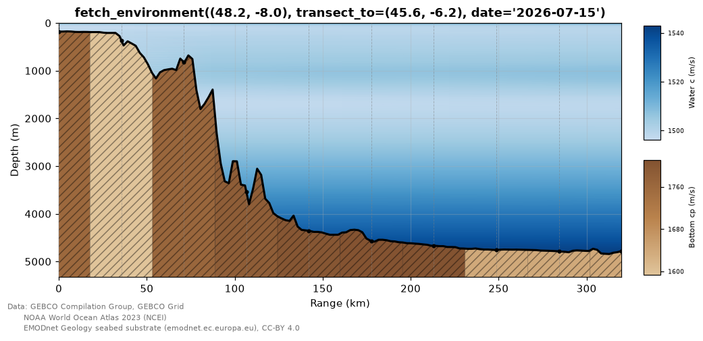
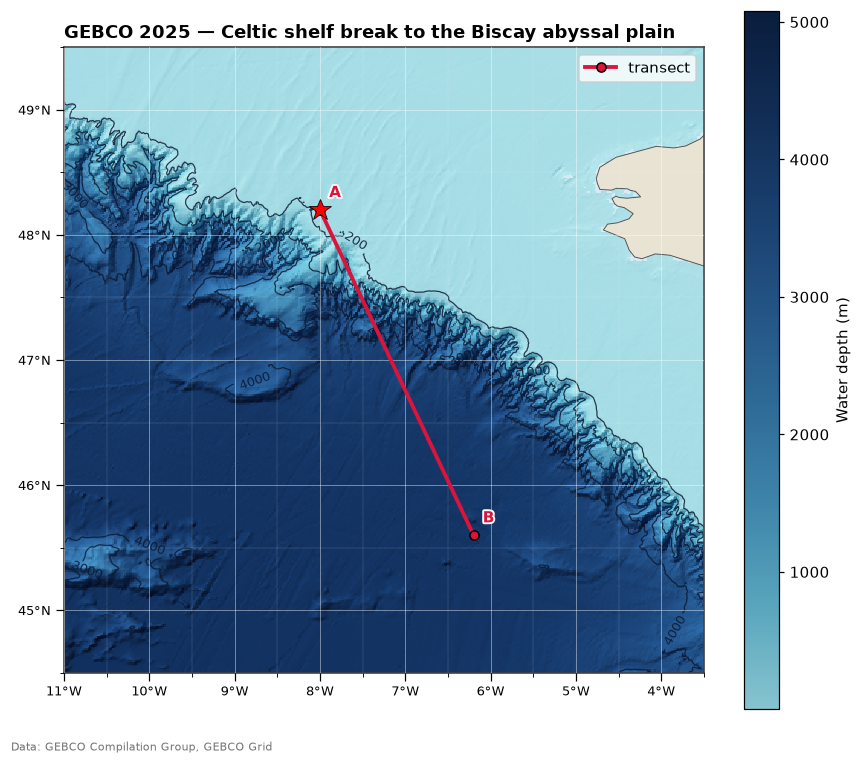
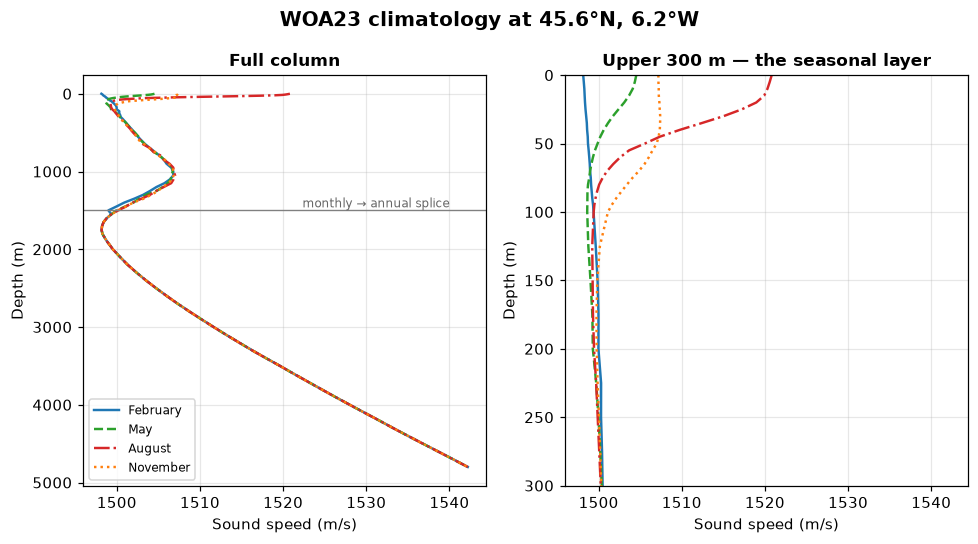
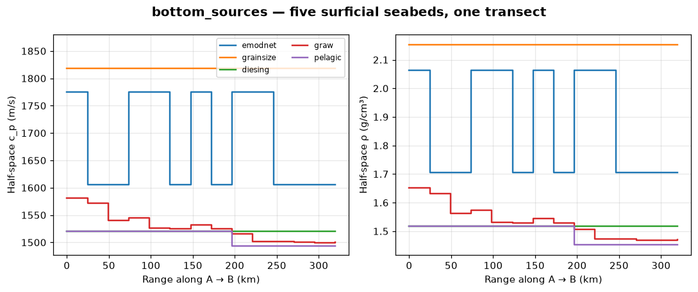
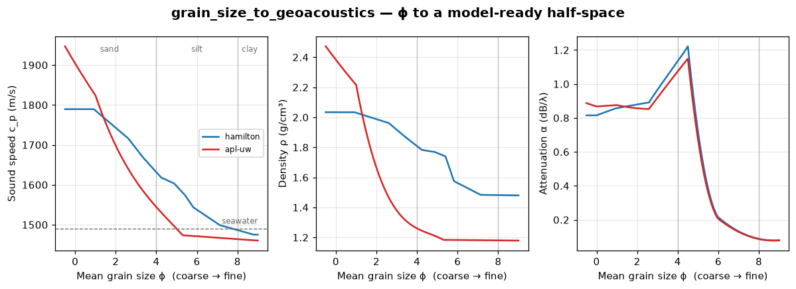
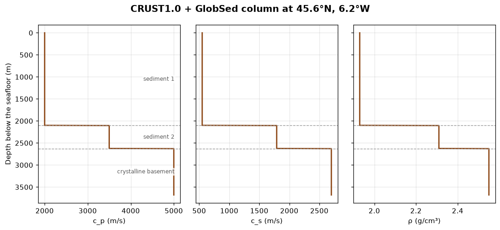
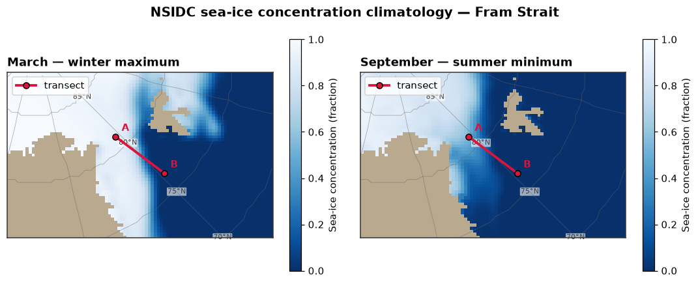

# External data — building an Environment from the real ocean

> `uacpy.data` · 70 public names · GPS coordinates (and a date) in, a
> ready-to-run [`Environment`](environment.md) out

[Environment](environment.md) tells you how to *describe* the ocean. This page
tells you where the numbers come from when you do not want to invent them:
which public datasets uacpy can pull, what each one actually covers, what its
licence obliges you to do, and how the whole thing runs from a local cache with
the network switched off.

The entry point is one function:

```python
import uacpy

env = uacpy.data.fetch_environment((45.6, -6.2), date='2026-07-15')
```

That is a real seafloor depth, a real seasonal sound-speed profile and a
provenance record, in one call.

---

## 1. `fetch_environment` — the capstone

`fetch_environment(point, ...)` assembles an `Environment` axis by axis and
stamps every layer with where it came from. Everything on this page comes from
[`docs/figure_scripts/data.py`](../figure_scripts/data.py) — the code below
**is** that code, so it cannot drift from what you see.

```python
A, B = (48.2, -8.0), (45.6, -6.2)
DATE = '2026-07-15'

def fetch_env():
    """The range-dependent environment along A → B, from local data only."""
    return uacpy.data.fetch_environment(
        A, transect_to=B, date=DATE,
        name='Celtic shelf break → Biscay abyssal plain',
        bathymetry_sources='local',      # cached GEBCO grid
        ssp_sources='local',             # cached WOA23 climatology
        bottom_sources='local',          # cached EMODnet substrate
        n_points=140, ssp_n_points='auto', bottom_n_points=10,
    )

env = fetch_env()
env.plot()
```



A 320 km transect off north-west France: 181 m of Celtic shelf, the continental
slope from 50 to 125 km, then the Biscay abyssal plain at 4.8 km. The seafloor is GEBCO,
the water column is the July WOA23 climatology sampled at each grid cell the
track crosses, the three seabed bands are EMODnet Folk classes, and the grey
footnote under the axes is the licence-required attribution for all three —
drawn automatically, because the environment knows what it is made of.

What comes back is an ordinary `Environment`. It has no special type, no
deferred fetching and no hidden state; it drops straight into any model:

```python
import numpy as np
from uacpy.models import RAM, RunMode

source = uacpy.Source(depths=100.0, frequencies=50.0)
receiver = uacpy.Receiver(depths=np.linspace(1, env.depth, 150),
                          ranges=np.linspace(100.0, env.max_range, 300))
tl = RAM().run(env, source, receiver, run_mode=RunMode.COHERENT_TL)
tl.plot(env=env, source=source)
```

### What it returns, and what it does not

| Axis | Fetched by default? | Without a source |
|---|---|---|
| `bathymetry` | ✅ GEBCO | you must pass `bathymetry=` |
| `ssp` | ✅ WOA23 | you must pass `ssp=` |
| `bottom` | ❌ | uacpy's default half-space (1600 m/s, 1.5 g/cm³, 0.5 dB/λ) |
| `surface` | ❌ | free (pressure-release) surface |
| `altimetry` | ❌ | flat sea surface |
| `absorption` | ❌ (`with_absorption=True`) | the model's default Thorp |

**Bathymetry and sound speed are mandatory axes**, so with neither a literal
nor a `*_sources` list they are fetched from the default chains. The seabed,
the surface and the sea state are **opt-in**: ask for them or you get uacpy's
defaults, silently — which is the single most common surprise on this page. A
fetched environment with no `bottom_sources=` has a *made-up* seabed.

### The full signature

**Site and identity**

| Argument | Default | Meaning |
|---|---|---|
| `point` | — | `(lat, lon)` in decimal degrees, WGS84 |
| `date` | `None` | picks the climatological month (WOA23, sea ice, wind) or the time step (Copernicus, Argo) |
| `name` | `None` | environment name; defaults to the coordinate string |
| `transect_to` | `None` | second `(lat, lon)`; makes the fetch range-dependent |

**Per-axis literals and sources** — every axis takes the same pair:

| Literal | Sources | Choices |
|---|---|---|
| `bathymetry=` | `bathymetry_sources=` | `'gebco'`, `'gmrt'`, `'emodnet_dtm'`, `'auto'`, `'local'` |
| `ssp=` | `ssp_sources=` | `'woa23'`, `'copernicus'`, `'argo'`, `'auto'`, `'local'` |
| `bottom=` | `bottom_sources=` | `'emodnet'`, `'grainsize'`, `'diesing'`, `'mars'`, `'graw'`, `'crust1'`, `'pelagic'`, `'auto'`, `'local'` |
| `surface=` | `surface_sources=` | `'seaice'`, `'auto'`, `'local'` |
| `altimetry=` | `altimetry_sources=` | `'waves'`, `'wind'`, `'local'`, `'auto'` |

**Range dependence and sampling**

| Argument | Default | Meaning |
|---|---|---|
| `n_points` | `50` | bathymetry samples along the transect; `'auto'` targets GEBCO native resolution |
| `max_points` | `1000` | ceiling on points probed per axis — the fetch budget |
| `range_dependent_ssp` / `_bottom` / `_surface` | `None` | `None` = range-dependent on a transect, range-independent at a point |
| `ssp_n_points` | `'auto'` | one column per distinct WOA23 cell crossed |
| `bottom_n_points` | `6` | seabed samples; `'auto'` probes every waypoint |
| `surface_n_points` | `'auto'` | ice/open-water zones collapsed to one boundary each |
| `sea_surface_n_points`, `sea_surface_seed` | `500`, `None` | fetched sea-surface realisation |

**Tolerances and numerics**

| Argument | Default | Meaning |
|---|---|---|
| `with_absorption` | `False` | build `FrancoisGarrison` from the site's T/S column (and GLODAP pH) |
| `max_distance_km` | `None` | distance guard for the **nearest-sample** sources (`argo`, `grainsize`, `mars`); ignored by grids and polygons |
| `max_days` | `None` | staleness guard for the **time-specific** SSP sources (`argo`, `copernicus`); ignored by climatologies |
| `formula` | `'unesco'` | sound-speed equation; `'delgrosso'` also available |
| `resolution` | `'1.00'` | WOA23 grid spacing in degrees (`'0.25'` for the fine grid) |
| `timeout`, `verbose` | `120.0`, `False` | forwarded to the fetchers |

---

## 2. How an axis is resolved

The same four rules apply to every axis, which is why the argument pairs look
identical.

**A literal and a source are not alternatives — they are a value and a
fallback.** Give both, and the source is fetched first; the literal is used
only if the fetch yields nothing (no coverage, service down, cache missing).
Give one, and it is the only thing tried.

```python
uacpy.data.fetch_environment(pt, bottom='sand')                  # literal only
uacpy.data.fetch_environment(pt, bottom_sources='emodnet')       # fetch only
uacpy.data.fetch_environment(pt, bottom_sources='emodnet',
                             bottom='sand')                      # fetch, else sand
```

**`*_sources` is an ordered fallback chain.** A bare string is a one-element
chain; a sequence is tried left to right. Two presets expand to a chain for
you:

| Preset | Bathymetry | SSP | Bottom |
|---|---|---|---|
| `'auto'` | `emodnet_dtm` → `gmrt` → `gebco` | `argo` → `copernicus` → `woa23` | `emodnet` → `diesing` → `mars` → `pelagic` |
| `'local'` | `gebco` (cached) | `woa23` (cached) | `emodnet` → `grainsize` → `diesing` → `pelagic` (cached) |

`'auto'` means *best available*: the finest regional product first, falling
back to the global one. For sound speed it means real float → model →
climatology, so `ssp_sources='auto'` without a `date=` or a Copernicus login
falls through to WOA23 by itself.

**Fetching is cache-first.** Within each source, an installed local dataset is
sampled before any network call. `'local'` keeps *only* the cached backends —
no network at all — so a source with no cached twin contributes nothing to the
chain and is skipped. That is what makes every figure on this page reproducible
offline.

**A failing source is not an error until the chain runs out.** Each source
raises `DataFetchError` (no coverage, on land, service down) or
`ConfigurationError` (cache not installed), the next is tried, and only if
every attempt fails does the most substantive error surface — a coverage
failure in preference to a missing-cache one.

---

## 3. Bathymetry

```python
depth  = uacpy.data.fetch_bathy((45.6, -6.2))               # float, m
track  = uacpy.data.fetch_bathy_transect(A, B, n_points=140)  # (N, 2) [range, depth]
grid   = uacpy.data.fetch_bathy_grid(lat_range, lon_range, n_lat=420, n_lon=420)
length = uacpy.data.transect_length(A, B)                   # m
```

| Source | Coverage | Resolution | Licence | Offline |
|---|---|---|---|---|
| `gebco` | global | 15″ ≈ 450 m | public domain (attribution requested) | ✅ `--data gebco` (~7.5 GB) |
| `gmrt` | global | ~100 m where multibeam-surveyed, GEBCO/SRTM15+ elsewhere | CC-BY 4.0 | ❌ live |
| `emodnet_dtm` | European seas + Caribbean | 1/16′ ≈ 115 m | CC-BY 4.0 | ❌ live |

Bathymetry is static, so these fetchers take coordinates only — `date=` enters
the data layer at the sound-speed stage.

```python
lats, lons, depth = uacpy.data.fetch_bathy_grid(
    REGION_LAT, REGION_LON, n_lat=420, n_lon=420, source='local')

uacpy.plot.plot_bathymetry_map(
    lats, lons, depth, transect=(A, B), source=A,
    contours=[200.0, 1000.0, 2000.0, 3000.0, 4000.0],
    data_source=[uacpy.data.SOURCES['gebco']],
    title='GEBCO 2025 — Celtic shelf break to the Biscay abyssal plain')
```



`fetch_bathy_grid` is the only bathymetry fetcher that tolerates land: land
cells come back as `NaN` so a coastline maps cleanly, while the point and
transect fetchers **raise** on land rather than returning a zero-thickness
water column.

Three notes that bite:

- **`emodnet_dtm` is referenced to Lowest Astronomical Tide**, not mean sea
  level, so it reads a few tenths of a metre to a couple of metres deeper than
  GEBCO/GMRT in shallow water. Negligible offshore, not negligible on a beach.
- **The live GEBCO path is rate-limited.** OpenTopoData's public host allows
  ≤100 points per request, ≤1 request/s and ≤1000 requests/day, so a 50×50 grid
  is 25 requests. `source='local'` has no cap at all.
- **`n_points='auto'`** targets GEBCO's native spacing and warns when
  `max_points` truncates it, telling you the spacing you actually got.

---

## 4. Sound speed, and the rest of the water column

```python
ssp   = uacpy.data.fetch_ssp((45.6, -6.2), date='2026-07-15')
ssp2d = uacpy.data.fetch_ssp_transect(A, B, date='2026-07-15')
z, T, S = uacpy.data.fetch_ts_profile((45.6, -6.2), date='2026-07-15')
```

| Source | Coverage | Resolution | Time | Licence | Offline |
|---|---|---|---|---|---|
| `woa23` | global | 1° (or 0.25°), 102 standard levels to 5500 m | monthly **climatology** | public domain (NOAA) | ✅ `--data woa23` |
| `copernicus` | global | operational model grid | date-specific (reanalysis / forecast) | Copernicus Marine Licence (commercial OK) | ❌ live, free login |
| `argo` | ice-free ocean, float-dependent | one real cast | the nearest profile in space and time | free and unrestricted | ❌ live |
| `glodap` | global | 1°, 33 levels | climatology | CC-BY 4.0 | ✅ `--data glodap` |
| `copernicus_bgc` | global | model grid | date-specific | Copernicus Marine Licence | ❌ live |

The first three feed `ssp`; the last two supply the **pH** that Francois–Garrison
absorption needs and WOA23 does not carry. T and S come from WOA23 (or whichever
SSP source resolved), and sound speed is computed with the UNESCO (Chen–Millero)
or Del Grosso equation from [`uacpy.core.acoustics`](utilities.md) — the fetchers
return physics, not a stored `c` field.

```python
months = [(2, 'February'), (5, 'May'), (8, 'August'), (11, 'November')]
profiles = [(label, uacpy.data.fetch_ssp(B, month=month, source='local'))
            for month, label in months]
```



Four climatological months at the deep end of the transect. The seasonal signal
lives in the top ~200 m: August puts a 1521 m/s warm layer at the surface with a
sharp thermocline under it, February mixes the same water to near-isovelocity at
1498 m/s. Below that the four curves converge to a few tenths of a m/s but never
quite merge — the spread widens again to 1.2 m/s approaching 1500 m, the deep
limit of WOA23's monthly fields. Below 1500 m they are the *same numbers*, and
that is construction rather than physics: the annual mean is spliced on there,
which the marked line makes explicit. So the local maximum near 1000 m (where
`fetch_ts_profile` shows a 35.80 psu salinity intrusion, the Mediterranean
outflow) still carries a little season, while the sound-channel minimum at
~1750 m and the pressure-driven climb below it carry none by construction.

The profile stops at 4800 m, not at WOA23's 5500 m floor: the column is
truncated at the first level with no data, which is the seafloor.

**Climatology is not weather.** WOA23 returns a decadal monthly *mean*: it is
reproducible, global and free, and it is wrong about any particular day.
`ssp_sources='copernicus'` gives the actual date; `'argo'` gives an actual
measurement. Both need the network, and `'argo'` needs a float to have been
nearby — `max_distance_km` (default 250 km) and `max_days` (default 15) decide
how nearby, and raise so the chain falls through when nothing qualifies.

Absorption rides along:

```python
env = uacpy.data.fetch_environment((45.6, -6.2), date='2026-07-15',
                                   with_absorption=True)
env.absorption      # FrancoisGarrison built from the T/S row nearest the
                    # column mid-depth — z_bar_m ≈ 2400 m for this ~4800 m
                    # column, with its cold deep temperature, not the surface
```

One extra T/S request builds a site-specific `FrancoisGarrison` instead of the
model-default Thorp, with pH from the cached GLODAP grid when installed and 8.1
otherwise. The one row picked sets the temperature for the *whole* column (the
models vary only depth), so the default reference is the T/S sample nearest the
column mid-depth, and pH is read at that same depth — pairing a surface pH
with a mid-column temperature would inflate the boric-acid relaxation term. The absorption is drawn from the same WOA23 cell and grid resolution
as the SSP, so the two are consistent. See
[environment §6](environment.md#6-absorption--volume-attenuation) for what the
absorption models do once attached.

---

## 5. The seabed

The seabed is the axis where the data is worst and the choices matter most, so
it has the most sources: surficial maps of the interface, deep-structure models
of the whole column, and one conversion in the middle that most of them route
through.

### Surficial sources — the top of the seabed

| Source | Coverage | Resolution | Licence | Offline |
|---|---|---|---|---|
| `emodnet` | European seas | Folk 5-class polygons, 1:1M | CC-BY 4.0 | ✅ `--data emodnet` (~200 MB) |
| `grainsize` | global but **sparse** | point samples (NCEI G00127 + DECK41) | public domain | ✅ `--data sediment` (~3 MB) |
| `diesing` | deep sea only (> 500 m) | 10 km raster, 5 lithologies | CC-BY 4.0 | ✅ `--data diesing` (~40 MB) |
| `mars` | Australian margin | ~100k point samples | CC-BY 4.0 | ❌ live WFS |
| `graw` | global | 5′ predicted bulk density | CC-BY 4.0 | ✅ `--data graw` (~37 MB) |
| `pelagic` | global | modelled from depth + latitude | public domain | ✅ no download |

Each returns a **half-space** `BoundaryProperties`, so any model can consume it.

```python
from uacpy.data import (
    diesing_local, emodnet_local, graw_local, pelagic, sediment_db,
)

sources = [
    ('emodnet', emodnet_local.fetch_bottom_local_transect(A, B, n_points=14)),
    ('grainsize', sediment_db.fetch_bottom_local_transect(A, B, n_points=14)),
    ('diesing', diesing_local.fetch_bottom_diesing_transect(A, B, n_points=14)),
    ('graw', graw_local.fetch_bottom_graw_transect(A, B, n_points=14)),
    ('pelagic', pelagic.fetch_bottom_pelagic_transect(
        A, B, n_points=14, cache_only=True)),
]
```



Five sources, one track, and they disagree by **280 m/s** in compressional
speed and 0.5 g/cm³ in density — a spread that swamps most of the modelling
decisions you will agonise over. Read the shapes, not just the values:

- **`emodnet`** is the only one with real horizontal structure here, because it
  is the only mapped *polygon* product in European seas: it flips between two
  Folk classes as the track crosses substrate boundaries.
- **`grainsize`** is flat because the whole 320 km resolves to a *single* NCEI
  sample, ϕ = 1.4, which sits 249 km from the middle of the track and 261 km and
  336 km from its two ends — so both ends fall outside the 250 km
  `max_distance_km` guard entirely and are filled from the middle. Sparse point
  data does not become a map by being interpolated, and uacpy does not pretend
  otherwise: it returns the nearest sample and refuses one that is too far.
- **`diesing`** covers deep sea only (> 500 m), so its shelf-end values are the
  first covered point held backwards. Transect fetchers **forward-fill** gaps
  from the nearest covered value and raise only if *no* point on the track is
  covered — a flat section can mean uniform seabed or no coverage, and only the
  source's documented footprint tells you which.
- **`graw`** is the one continuous field, so it is the only curve that varies
  smoothly. It is a machine-learning prediction of bulk *density*, with speed and
  attenuation back-derived by inverting the same Hamilton table the other sources
  use forwards.
- **`pelagic`** is a first-principles rule (carbonate compensation depth and
  latitude), so it steps exactly once, where the track crosses the CCD. It never
  fails, which is why it is the last rung of every chain.

None of these is *the* answer. Pick by coverage, and if the seabed matters to
your result, run two of them and look at the spread.

### The grain-size conversion

Most of those sources report a **mean grain size** on the Wentworth ϕ scale, not
geoacoustics. `grain_size_to_geoacoustics` is the conversion, and it is public
so you can drive it yourself:

```python
phi = np.linspace(-0.5, 9.0, 381)
water_c, water_rho = 1490.0, 1.03           # near-seabed seawater

for model in ('hamilton', 'apl-uw'):
    rows = [uacpy.data.grain_size_to_geoacoustics(
        p, model=model, water_sound_speed=water_c, water_density=water_rho)
        for p in phi]
```



Two published models: `'hamilton'` (Hamilton & Bachman 1982 table plus the
Hamilton 1980 `k_p` attenuation) is the **low-frequency** answer and the
default; `'apl-uw'` (APL-UW TR 9407 §IV.A.4) is the **high-frequency** one. They
agree on the shape — coarse sediment is fast, dense and lossy; fine mud is slow,
light and quiet — and disagree at the coarse end: ~160 m/s at the ϕ = −0.5 edge
of the plot, and 203 m/s for gravel-grade ϕ ≤ −1, where both tables have run out
and each returns its clamped end value.

Three things worth reading off the plot:

- **Speed and density are *ratios* to the overlying seawater**, scaled by the
  in-situ values you pass. That is why fine clay comes out *slower* than
  seawater — a ratio below 1, which a fixed table could not express. When
  `fetch_environment` builds a bottom it passes the sound speed from the
  reconciled SSP at that seafloor, so the seabed is scaled to the water actually
  above it.
- **Attenuation peaks at the sand–silt boundary** — ϕ = 4.05 for Hamilton,
  ϕ = 4.5 for APL-UW — then falls by roughly an order of magnitude into clay
  (8.6× and 14.6× respectively). The lossiest sediment is neither the coarsest
  nor the finest. Returned in dB/**wavelength**, which is frequency-independent.
- **Hamilton flattens below ϕ ≈ 0.5.** That is the edge of its table, and ϕ is
  clamped there. Beyond about 1 ϕ outside a model's range you get a
  `UserWarning` as well.

Two shortcuts wrap the conversion: `bottom_from_grain_size(phi)` and
`bottom_from_class('sand')`, both returning a ready `BoundaryProperties`.

### Deep structure — thickness, layers and shear

At tens of Hz the field penetrates the whole sediment column, so *how thick it
is* and *whether it supports shear* matter more than the top few centimetres.

| Source | Coverage | Resolution | Licence | Offline |
|---|---|---|---|---|
| `globsed` | global | 5′ total sediment thickness | public domain | ✅ `--data globsed` (~11 MB) |
| `crust1` | global | 1°, 8 layers + mantle: Vp, Vs, ρ | **no formal licence — commercial use not confirmed** | ✅ `--data crust1` (~1 MB) |

```python
from uacpy.data import crust1_local

column = crust1_local.fetch_bottom_crust1(B)
z = np.linspace(0.0, column.total_thickness() * 1.4, 800)
cp = [column.at(depth=zz).sound_speed for zz in z]
```



`fetch_bottom_crust1` returns a `SeabedColumn`: the sediment stack over the
crystalline-crust half-space, with `Vs` retained, so the bottom is **elastic**.
Under the Biscay abyssal plain that is 2.1 km of upper sediment over 0.5 km of
consolidated sediment over basement — and the shear speed is 550 m/s at the top
of the column and 2700 m/s in the basement, a loss channel a fluid half-space
simply does not have. Which models can take that honestly is the
[shear table in environment §4](environment.md#what-shear_speed-changes).

Three caveats, all real:

- **CRUST1.0 is a 1° crustal average.** Its top-of-column 2000 m/s is a
  kilometre-scale mean, not a surficial sediment speed. Use it for the deep
  layered structure; use a surficial source for the interface.
- **The column is rescaled to GlobSed by default**, because GlobSed's 5′
  thickness is far better resolved than CRUST1.0's 1° one. Both then appear in
  the provenance.
- **CRUST1.0 ships with no formal licence.** It is the one source in the
  catalogue with `commercial_use=False`, and fetching it emits a `UserWarning`
  — see §8.

---

## 6. The surface and the sea state

Two independent things live at the top boundary, and uacpy keeps them separate
exactly as [environment §2](environment.md#2-bathymetry-and-altimetry--the-two-shape-carriers)
describes: `surface` is the boundary's *properties*, `altimetry` is its *shape*.

| Source | Axis | Coverage | Resolution | Licence | Offline |
|---|---|---|---|---|---|
| `seaice` | `surface` | polar | 25 km, monthly climatology | public domain (NSIDC/NOAA) | ✅ `--data seaice` |
| `nbs` | `altimetry` | global | 0.25°, monthly climatology (cached) or daily (live) | public domain (NOAA) | ✅ `--data wind` |
| `ww3` | `altimetry` | global, recent window | model grid | public domain (NOAA) | ❌ live |
| `waverys` | `altimetry` | global, 1980→present | model grid | Copernicus Marine Licence | ❌ live |

### Ice — a different top boundary

```python
fram = ((81.0, -2.0), (76.5, 2.0))          # Fram Strait, marginal ice zone

for month, label in ((3, 'March — winter maximum'),
                     (9, 'September — summer minimum')):
    uacpy.plot.plot_sea_ice_map(
        seaice_local.sea_ice_grid(month, hemi='N'), hemi='N',
        transect=fram, title=label)
```



`surface_sources='seaice'` reads the NSIDC concentration at the point for
`date`'s month and, above the 15 % ice-edge, replaces the free surface with a
homogeneous **elastic ice canopy** — c_p 3500 m/s, c_s 1800 m/s, ρ 0.9 g/cm³,
α_p/α_s 0.4/1.0 dB/λ (*Computational Ocean Acoustics*). Below the ice edge it
returns nothing and the free surface stands, with no provenance recorded: an
ice-free point is not silently given an "ice" source.

On this transect A (81 °N) is 91 % ice in March and still 53 % in September, so
it is canopy in both; B (76.5 °N) is open water year-round. On a transect,
`range_dependent_surface` builds the marginal ice zone as a range-dependent
`Surface` — useful for inspection and plotting, but **every solver carries a
single global top boundary**, so a model run collapses it to one (with a
warning). Ice concentration is also available raw, via
`fetch_sea_ice_concentration` and `..._transect`.

### Wind and waves — the surface *shape*

`altimetry_sources` turns a fetched sea state into a Pierson–Moskowitz surface
realisation:

```python
env = uacpy.data.fetch_environment(
    A, transect_to=B, date='2026-01-15',
    altimetry_sources='local', sea_surface_seed=11)
```

`'waves'` inverts an observed significant wave height to the effective PM wind
(`U = √(Hs/0.021)`), so the realisation reproduces the observed `Hs` whether or
not the sea is fully developed; `'wind'` uses the live 10 m NBS wind under a
fully-developed assumption; `'local'` uses the cached NBS monthly climatology —
network-free, but a *mean state*, which understates a storm. `'auto'` tries them
in that order. Sea state is the one axis where the cached product is the last
resort rather than the first: a monthly mean is exactly what a wave field is
not.

**A fetched altimetry needs both `transect_to=` and `date=`.** The realisation
spans a range, and sea state is time-specific; a single point has neither, so
point altimetry is not fetched. For a hand-built surface use
`uacpy.generate_sea_surface` directly.

Wind is separately useful for [ambient noise](noise.md) — `fetch_wind` and
`fetch_wind_transect` return the 10 m speed, which is the Wenz-curve input.

---

## 7. Transects

Pass `transect_to=` and every fetched axis samples along the great-circle path,
with ranges measured from `point`. That is the whole API; the interesting part
is what each axis does with it.

| Axis | Sampling | Why |
|---|---|---|
| bathymetry | `n_points=50`, or `'auto'` at GEBCO native spacing | continuous field, nothing to collapse |
| SSP | `ssp_n_points='auto'` — one column per **distinct WOA23 cell** crossed | the cell is the sample identity, found analytically, so no duplicate column is ever fetched |
| bottom | `bottom_n_points=6`, explicit | the seabed sources expose no cheap identity, so `'auto'` must *fetch* at every probe point |
| surface | `surface_n_points='auto'` — consecutive ice/open zones collapsed | the marginal ice zone at native scale, no staircase |

`bottom_n_points='auto'` is cheap on the local sample databases and expensive on
the live EMODnet WFS — up to `max_points` requests. That asymmetry is why the
bottom defaults to a small explicit count while the SSP defaults to `'auto'`.

Range dependence is opt-out, not opt-in: on a transect a fetched axis is
range-dependent unless you pass `range_dependent_*=False`, and
`range_dependent_*=True` at a single point raises rather than silently doing
nothing. Setting `range_dependent_bottom=True` with no `bottom_sources=` implies
`'auto'`.

Size a receiver grid off the same geodesic the fetch used:

```python
L = uacpy.data.transect_length(A, B)        # 319797.9 m
receiver = uacpy.Receiver(depths=np.linspace(1.0, env.depth, 150),
                          ranges=np.linspace(100.0, L, 300))
```

`env.max_range` gives the same number once the environment is built, and
`env.transect` carries the two endpoints so a plot can redraw the track.

Which models take a range-dependent environment natively, and which collapse
it, is [environment §7](environment.md#7-collapse-policy). A fetched
range-dependent environment is exactly the case the collapse warnings exist
for: [Bellhop](../models/bellhop.md) and [RAM](../models/ram.md) consume it
whole, [Kraken](../models/kraken.md) and [Scooter](../models/scooter.md) will
tell you what they had to flatten.

---

## 8. Licensing and provenance

This is the part that gets people into trouble, so uacpy makes it hard to lose.

### Two levels, one renderer

```python
from uacpy.data import SOURCES, DataSource, DataProvenance
```

- **`DataSource`** is a *catalogue entry*: one immutable record per dataset,
  holding its identity, licence, attribution text, citation and a
  `commercial_use` flag. `SOURCES` is the single source of truth — 20 entries,
  keyed by the same ids you pass to `*_sources`.
- **`DataProvenance`** is one *fetch*: a reference to the `DataSource` plus the
  **actual** date and coordinates that fetch returned, which are usually not the
  ones you asked for.

That second level exists because the gap is real. A WOA23 climatology snaps to a
1° cell and to a month; an Argo float is the nearest cast, tens of kilometres and
days away. `DataProvenance` records both, and derives the miss distance:

```python
for prov in env.data_sources:
    print(prov.source.id, prov.data_date, prov.data_point, prov.offset_km)
# gebco  None                     None          None
# woa23  month 07 (climatology)   (48.5, -7.5)  49.8
# emodnet None                    None          None
```

Carriers carry provenance too — `env.ssp.data_sources`, `env.bathymetry.data_sources`
— and `env.data_sources` is the de-duplicated union in axis order. It survives
`env.copy()`.

### Attribution, rendered

```python
print(uacpy.data.citations(env))
```

```
GEBCO grid (served via OpenTopoData)  [Public domain (attribution requested)]
  Attribution: GEBCO Compilation Group, GEBCO Grid
  Cite:        GEBCO Compilation Group, GEBCO Grid — cite the grid DOI for the vintage used (GEBCO 2025 offline; gebco.net).

World Ocean Atlas 2023 (NOAA NCEI)  [U.S. Government work — public domain]
  Attribution: NOAA World Ocean Atlas 2023 (NCEI)
  Cite:        Reagan, J.R., et al. (2024). World Ocean Atlas 2023. NOAA National Centers for Environmental Information.
  Fetched:     date month 07 (climatology), requested 2026-07-15; at 48.500, -7.500, 50 km from requested

EMODnet Geology — seabed substrate  [CC-BY 4.0]
  Attribution: EMODnet Geology seabed substrate (emodnet.ec.europa.eu), CC-BY 4.0
  Cite:        EMODnet Geology seabed substrate (1:1M).
```

`citations()` takes an `Environment`, a carrier, a list of ids or `DataSource`s,
or nothing at all — in which case it renders the whole catalogue, which is the
quickest way to see what uacpy can pull and under what terms.

### Credit on every figure

The plotters that own an environment draw its attribution as a grey footnote,
automatically. You have already seen it twice on this page — under the
bathymetry map and under the environment cross-section:

| Call | Footnote |
|---|---|
| `env.plot()` | `Data:` from `env.data_sources` |
| `tl.plot(env=env)` | `Data:` from the env **and** `Model:` from the result |
| `plot_bottom_properties(env)` | `Data:` from `env.data_sources` |
| `plot_bathymetry_map(..., data_source=...)` | whatever you hand it |
| `plot_overview(env, ...)` | both, centred under the map panel |

The map is the exception that shows the rule: a bare `(lats, lons, depth)` grid
carries no provenance of its own, which is why the figure in §3 passes
`data_source=[SOURCES['gebco']]` explicitly. Only footnotes on standalone
figures are drawn — a plotter given `ax=` leaves the composition to its caller.

Pass `data_source=False` to suppress it, an `Environment` / `Result` / list of
`DataSource` / list of strings to override it. The default is `True`, which
means *use the object's own provenance*.

### Non-commercial sources are never silent

One catalogue entry has `commercial_use=False` — **CRUST1.0**, which ships with
no formal licence at all; the only stated obligation is to cite Laske et al.
(2013), and commercial terms are unspecified. Fetching it warns:

```
UserWarning: fetch_environment: data source 'crust1' (CRUST1.0 global crustal
model (UCSD)) does not permit commercial use without verification — see
uacpy.data.citations(env) for its licence/attribution.
```

The warning is driven off the catalogue flag, not off a hard-coded name, so any
future restricted source is covered by the same rule. `citations()` marks the
same entries with `⚠ Commercial use not confirmed`. Everything else in the
catalogue is public domain, CC-BY 4.0, the Argo free-and-unrestricted policy, or
the Copernicus Marine licence — all of which permit commercial use *with
attribution*, which is precisely what the footnote and `citations()` give you.

---

## 9. The offline cache

Public datasets are **not bundled**. Like OASES, they are downloaded on request
into a gitignored cache and sampled locally:

```bash
./install.sh --data all          # everything below
./install.sh --data gebco,woa23  # just the two mandatory axes
./install.sh --no-models --data all   # data only, no compilers
```

| Where | Value |
|---|---|
| Default location | `<repo>/data_cache/<dataset>/` |
| Override | `$UACPY_DATA_CACHE` — set it to any directory that has the datasets |
| Twelve datasets | `gebco woa23 sediment emodnet coastline globsed crust1 diesing seaice glodap wind graw` |

```python
from uacpy.data import _cache
_cache.cache_root()          # the directory in use
_cache.dataset_root('woa23') # where WOA23 is expected
```

A missing dataset raises a typed `ConfigurationError` naming the exact flag:

```
Offline gebco data not found: GEBCO 2025 global bathymetry grid (~4 GB).

How to fix:
Run `./install.sh --data gebco` to download it, or set $UACPY_DATA_CACHE to a
directory that has it.
```

Three reasons to install the cache even with a working network:
**reproducibility** — a climatology grid does not change under you; **speed** —
the local GEBCO grid returns the 420×420 region above in under 0.1 s;
and **rate limits** — there are none. The same region through the public
OpenTopoData API is 176 400 points, which at 100 points per request is well past
the 100-request safety cap `fetch_bathy_grid` enforces, so it would refuse
outright.

To guarantee no network call, pin the axes you care about with
`*_sources='local'` — the figures on this page do exactly that. A `'local'` axis
with no cached source fails fast with an install hint rather than quietly
reaching for the API.

The `coastline` dataset is not a data source in the catalogue sense; it is the
Natural Earth land-polygon backdrop `plot_bathymetry_map` draws (public domain,
no attribution required).

---

## 10. Gotchas

**A fetched environment without `bottom_sources=` has a default seabed.**
Bathymetry and sound speed are fetched by default; the bottom is not. The
half-space you get is 1600 m/s / 1.5 g/cm³ / 0.5 dB/λ and it is uacpy's
invention, not data. This is the mistake to check for first.

**`bottom=` is a material, `bottom_sources=` is a source.** `bottom='sand'` is a
`uacpy.materials` preset; `bottom_sources='emodnet'` is a fetch. They are
separate arguments precisely so a string can never mean both.

**Climatology is a mean, not a day.** WOA23, the NSIDC ice grid and the cached
NBS wind are all monthly climatologies. They are reproducible and they are not
the conditions on your date.

**Transect gaps forward-fill.** A source with partial coverage holds the nearest
covered value across the gap and raises only if *nothing* on the track is
covered. Check the source's coverage before reading structure into a flat line.

**`max_distance_km` and `max_days` do not apply to everything.** They guard the
nearest-sample sources (`argo`, `grainsize`, `mars`) and the time-specific ones
(`argo`, `copernicus`). Grids, polygons and models ignore them, because "how far
away was the data" is not a question a global grid can answer.

**A ϕ far outside a model's range is clamped, with a warning.** It is not
extrapolated, because neither published relation is valid there.

**Bathymetry and SSP come from different products**, so their deepest points
rarely agree. `fetch_environment` reconciles the profile to the fetched water
column — extending short profiles to the seafloor, trimming points below it —
before the seabed is built, because the grain-size conversion needs the water
speed *at the interface*. It does **not** resample onto a uniform grid; the
native levels carry the real sampling and each model owns its own `interp_ssp`.

**Live sources fail; that is normal.** Every fetcher raises `DataFetchError` for
no-coverage/service problems and `ConfigurationError` for a missing cache or a
bad argument, both subclasses of `UACPYError`. Catch that one type and fall back.

---

## 11. Where to go next

- **[Environment](environment.md)** — what the carriers a fetch fills in
  actually mean, and the collapse policy a range-dependent fetched environment
  will run into.
- **[Model index](../models/README.md)** — which solver to point at a real
  seafloor; [RAM](../models/ram.md) for long range-dependent transects,
  [Bellhop](../models/bellhop.md) at mid-to-high frequency.
- **[Plotting](plotting.md)** — `plot_overview`, the map plotters, and the
  `data_source=` argument every plotter shares.
- **[Noise](noise.md)** — where the fetched wind speed becomes an ambient-noise
  level.
- **[Utilities](utilities.md)** — the material presets and sound-speed equations
  the conversions here are built on.
- **[`uacpy/examples/example_37_realworld_environment.py`](../../uacpy/examples/example_37_realworld_environment.py)**
  — the full pipeline end to end: regional map, fetched transect, transmission
  loss and a three-panel composite.

---

**See also:** [documentation index](../README.md) · [environment](environment.md) ·
[results](results.md) · [plotting](plotting.md) · [noise](noise.md) ·
[file I/O](io.md) · [utilities](utilities.md) · [model index](../models/README.md)
