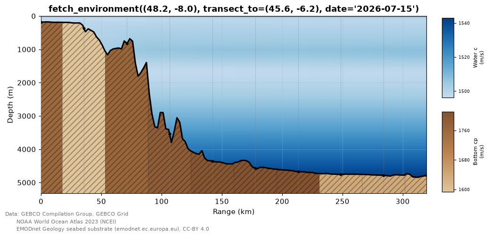
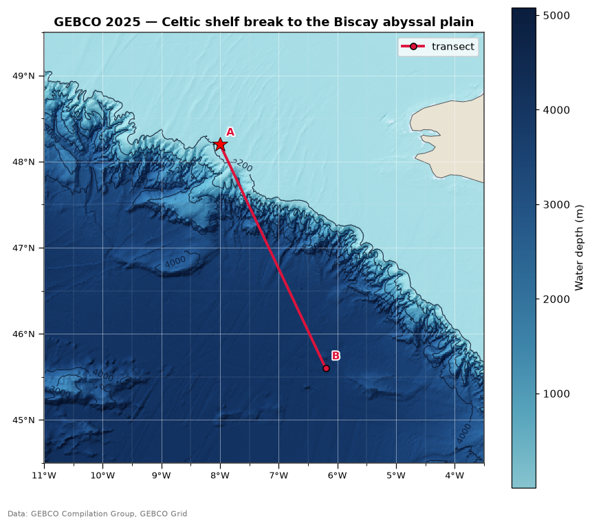
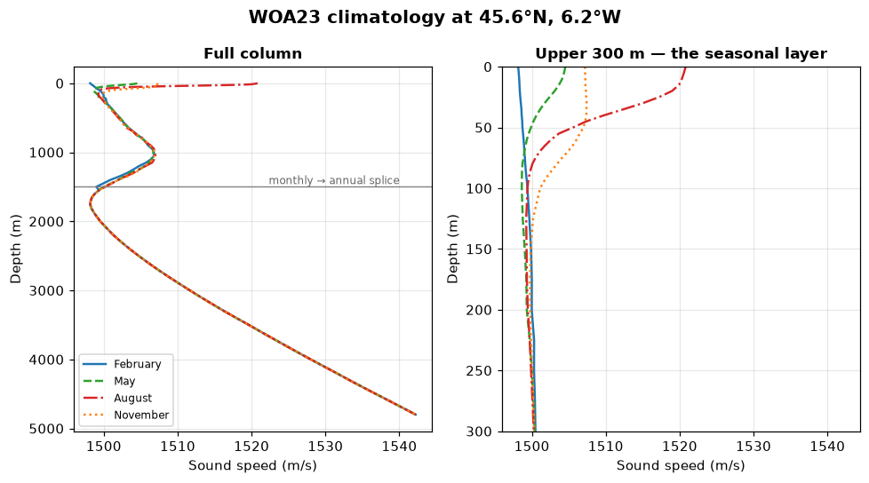
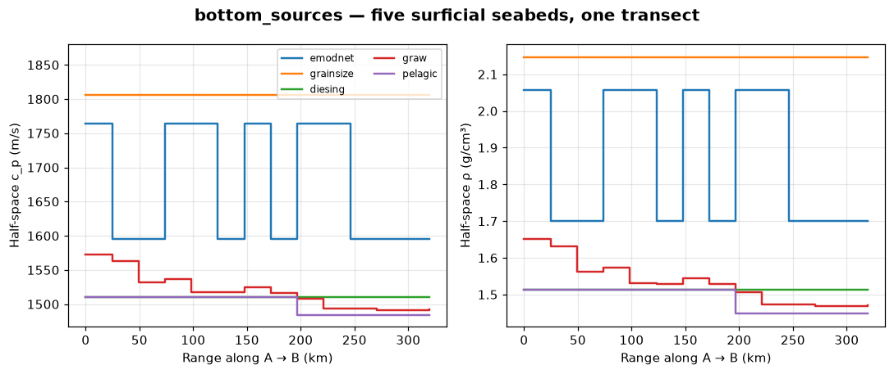
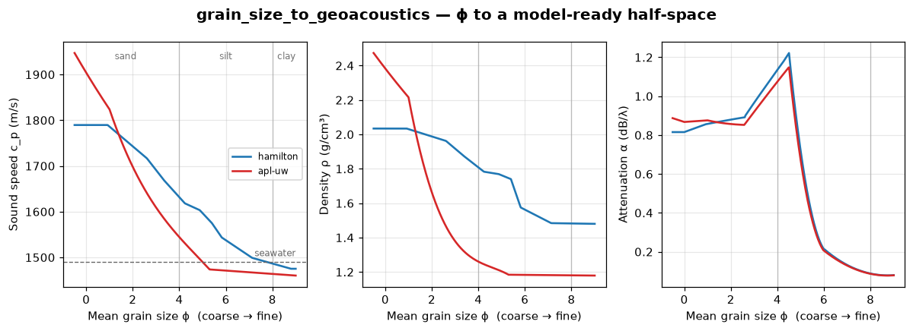
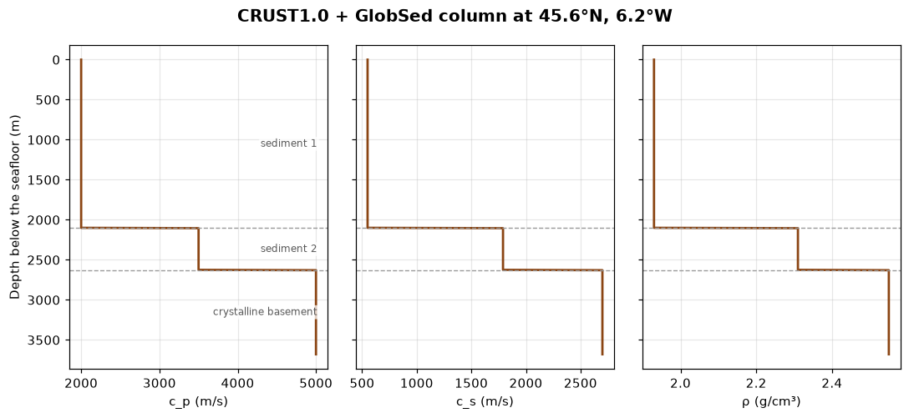
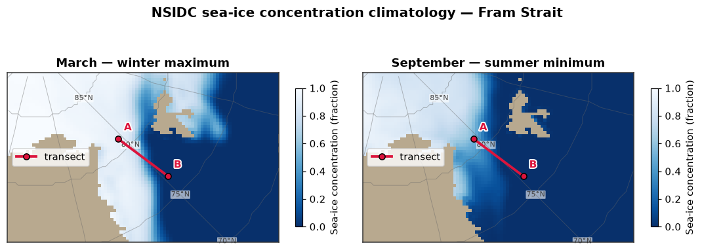

# External data — building an Environment from the real ocean

> `uacpy.data` · 78 public names · GPS coordinates (and a date) in, a
> ready-to-run [`Environment`](environment.md) out

[Environment](environment.md) tells you how to *describe* the ocean. This page
tells you where the numbers come from when you do not want to invent them:
which public datasets uacpy can pull, what each one actually covers, what its
licence obliges you to do, and how the whole thing runs from a local cache with
the network switched off.

The entry point is one function:

```python
import uacpy

env = uacpy.data.fetch_environment((45.6, -6.2), date='2026-07-15')
```

That is a real seafloor depth, a real seasonal sound-speed profile and a
provenance record, in one call.

---

## 1. `fetch_environment` — the capstone

`fetch_environment(point, ...)` assembles an `Environment` axis by axis and
stamps every layer with where it came from. Every figure on this page is
generated by [`docs/figure_scripts/data.py`](../figure_scripts/data.py); the
snippets below are condensed from it, so the script is the authoritative
figure code.

```python
A, B = (48.2, -8.0), (45.6, -6.2)
DATE = '2026-07-15'

def fetch_env():
    """The range-dependent environment along A → B, from local data only."""
    return uacpy.data.fetch_environment(
        A, transect_to=B, date=DATE,
        name='Celtic shelf break → Biscay abyssal plain',
        bathymetry_sources='local',      # cached GEBCO grid
        ssp_sources='local',             # cached WOA23 climatology
        bottom_sources='local',          # cached EMODnet substrate
        n_points=140, ssp_n_points='auto', bottom_n_points=10,
    )

env = fetch_env()
env.plot()
```



A 320 km transect off north-west France: 181 m of Celtic shelf, the continental
slope from 50 to 125 km, then the Biscay abyssal plain at 4.8 km. The seafloor is GEBCO,
the water column is the July WOA23 climatology sampled at each grid cell the
track crosses, the three seabed bands are EMODnet Folk classes, and the grey
footnote under the axes is the licence-required attribution for all three —
drawn automatically, because the environment knows what it is made of.

What comes back is an ordinary `Environment`. It has no special type, no
deferred fetching and no hidden state; it drops straight into any model:

```python
import numpy as np
from uacpy.models import RAM, RunMode

source = uacpy.Source(depths=100.0, frequencies=50.0)
receiver = uacpy.Receiver(depths=np.linspace(1, env.depth, 150),
                          ranges=np.linspace(100.0, env.range_max, 300))
tl = RAM().run(env, source, receiver, run_mode=RunMode.COHERENT_TL)
tl.plot(env=env, source=source)
```

### What it returns, and what it does not

| Axis | Fetched by default? | Without a source |
|---|---|---|
| `bathymetry` | ✅ GEBCO | you must pass `bathymetry=` |
| `ssp` | ✅ WOA23 | you must pass `ssp=` |
| `bottom` | ❌ | uacpy's default half-space (1600 m/s, 1.5 g/cm³, 0.5 dB/λ) |
| `surface` | ❌ | free (pressure-release) surface |
| `altimetry` | ❌ | flat sea surface |
| `absorption` | ❌ (`with_absorption=True`) | none: lossless water (pass `absorption=Thorp()` for a frequency-only law) |
| `water_density` | with `with_absorption=True` (the T/S row at mid-depth, IES-80) | 1.027 g/cm³ |

**Bathymetry and sound speed are mandatory axes**, so with neither a literal
nor a `*_sources` list they are fetched from the default chains. The seabed,
the surface and the sea state are **opt-in**: ask for them or you get uacpy's
defaults — which is the single most common surprise on this page. A fetched
environment with no `bottom_sources=` has a *made-up* seabed, and
`fetch_environment` says so with a `FallbackWarning` whenever neither `bottom=` nor
`bottom_sources=` is given.

### The full signature

**Site and identity**

| Argument | Default | Meaning |
|---|---|---|
| `point` | — | `(lat, lon)` in decimal degrees, WGS84 |
| `date` | `None` | picks the climatological month (WOA23, sea ice, wind) or the time step (Copernicus, Argo) |
| `name` | `None` | environment name; defaults to the coordinate string |
| `transect_to` | `None` | second `(lat, lon)`; makes the fetch range-dependent |

**Per-axis literals and sources** — every axis takes the same pair:

| Literal | Sources | Choices |
|---|---|---|
| `bathymetry=` | `bathymetry_sources=` | `'gebco'`, `'gmrt'`, `'emodnet_dtm'`, `'auto'`, `'local'` |
| `ssp=` | `ssp_sources=` | `'woa23'`, `'copernicus'`, `'argo'`, `'auto'`, `'local'` |
| `bottom=` | `bottom_sources=` | `'emodnet'`, `'grainsize'`, `'diesing'`, `'mars'`, `'graw'`, `'crust1'`, `'pelagic'`, `'auto'`, `'local'` |
| `surface=` | `surface_sources=` | `'seaice'`, `'auto'`, `'local'` |
| `altimetry=` | `altimetry_sources=` | `'waverys'`, `'ww3'`, `'nbs'`, `'local'`, `'auto'` (or a sequence) |

**Range dependence and sampling**

| Argument | Default | Meaning |
|---|---|---|
| `n_points` | `50` | bathymetry samples along the transect; `'auto'` targets GEBCO native resolution |
| `max_points` | `1000` | ceiling on points probed per axis — the fetch budget |
| `range_dependent_ssp` / `_bottom` / `_surface` | `None` | `None` = range-dependent on a transect, range-independent at a point |
| `ssp_n_points` | `'auto'` | one column per distinct WOA23 cell crossed |
| `bottom_n_points` | `6` | seabed samples; `'auto'` probes every waypoint |
| `surface_n_points` | `'auto'` | ice/open-water zones collapsed to one boundary each |
| `altimetry_n_points`, `altimetry_rng` | `None`, `None` | fetched sea-surface realisation; `n_points=None` sizes the grid from the sea state (8 samples per Pierson-Moskowitz peak wavelength, floored at 500), so a long transect resolves its waves instead of aliasing them flat |

**Tolerances and numerics**

| Argument | Default | Meaning |
|---|---|---|
| `bottom_model` | `'hamilton'` | grain-size → geoacoustics relations behind every seabed that arrives as a ϕ (all sources but `crust1`, and a ϕ literal): `'apl-uw'` for 10–100 kHz work, see [§5](#the-grain-size-conversion) |
| `with_absorption` | `False` | build a `FrancoisGarrison` profile from the site's T/S column (and GLODAP pH) |
| `max_distance_km` | `None` | refuse data whose point (cast, sample, or cell centre) stands farther than this from the site, on every fetched axis; see [the offset rule](#the-offset-rule) |
| `max_days` | `None` | staleness guard for the **time-specific** SSP sources (`argo`, `copernicus`); ignored by climatologies |
| `formula` | `'teos10'` | sound-speed equation; `'unesco'` (Chen–Millero 1977, ≈ 0.6 m/s high in deep water), `'delgrosso'` (open-ocean salinity only) and `'mackenzie'` (the nine-term equation behind `SoundSpeedProfile.from_temperature_salinity`) also available, see [utilities](utilities.md) |
| `resolution` | `'1.00'` | WOA23 grid spacing in degrees (`'0.25'` for the fine grid) |
| `timeout`, `verbose` | `120.0`, `False` | forwarded to the fetchers |

The named choices `bottom_model`, `bottom_environment`, `formula` and every
`*_sources` id match in any case (`'Hamilton'`, `'TEOS10'`, `'WOA23'`); unit
strings stay exact, since there case carries meaning (`dB`).

---

## 2. How an axis is resolved

The same four rules apply to every axis, which is why the argument pairs look
identical.

**A literal and a source are not alternatives — they are a value and a
fallback.** Give both, and the source is fetched first; the literal is used
only if the fetch yields nothing (no coverage, service down, cache missing).
Give one, and it is the only thing tried.

```python
uacpy.data.fetch_environment(pt, bottom='sand')                  # literal only
uacpy.data.fetch_environment(pt, bottom_sources='emodnet')       # fetch only
uacpy.data.fetch_environment(pt, bottom_sources='emodnet',
                             bottom='sand')                      # fetch, else sand
```

**`*_sources` is an ordered fallback chain.** A bare string is a one-element
chain; a sequence is tried left to right. Two presets expand to a chain for
you:

| Preset | Bathymetry | SSP | Bottom |
|---|---|---|---|
| `'auto'` | `emodnet_dtm` → `gmrt` → `gebco` | `argo` → `copernicus` → `woa23` | `emodnet` → `grainsize` → `diesing` → `mars` → `pelagic` |
| `'local'` | `gebco` (cached) | `woa23` (cached) | `emodnet` → `grainsize` → `diesing` → `pelagic` (cached) |

`'auto'` means *best available*: the finest regional product first, falling
back to the global one. For sound speed it means real float → model →
climatology, so `ssp_sources='auto'` without a `date=` or a Copernicus login
falls through to WOA23 by itself. For the bottom it means measured before
modelled: EMODnet's mapped polygons, then the nearest NCEI grain-size sample,
then the Diesing lithology map, then MARS, and only then the pelagic model.

**Fetching is cache-first.** Within each source, an installed local dataset is
sampled before any network call. `'local'` keeps *only* the cached backends —
no network at all — so a source with no cached twin contributes nothing to the
chain and is skipped. That is what makes every figure on this page reproducible
offline.

**A failing source is not an error until the chain runs out.** Each source
raises `DataFetchError` (no coverage, on land, service down) or
`ConfigurationError` (cache not installed), the next is tried, and only if
every attempt fails does the most substantive error surface — a coverage
failure in preference to a missing-cache one.

---

## 3. Bathymetry

```python
depth  = uacpy.data.fetch_bathy((45.6, -6.2))               # float, m
track  = uacpy.data.fetch_bathy_transect(A, B, n_points=140)  # (N, 2) [range, depth]
grid   = uacpy.data.fetch_bathy_grid(lat_range, lon_range, n_lat=420, n_lon=420)  # BathyGrid
length = uacpy.data.transect_length(A, B)                   # m
```

| Source | Coverage | Resolution | Licence | Offline |
|---|---|---|---|---|
| `gebco` | global | 15″ ≈ 450 m | public domain (attribution requested) | ✅ `--data gebco` (~7.5 GB) |
| `gmrt` | global | ~100 m where multibeam-surveyed, GEBCO/SRTM15+ elsewhere | CC-BY 4.0 | ❌ live |
| `emodnet_dtm` | European seas + Caribbean | 1/16′ ≈ 115 m | CC-BY 4.0 | ❌ live |

The per-layer fetchers take these same ids as `source=` (default `'gebco'`),
plus `'local'` for the installed GEBCO grid only. `'gebco'` is cache-first, as
`fetch_environment` is: the installed GEBCO 2025 grid when present, OpenTopoData's
GEBCO_2020 online otherwise.

Bathymetry is static, so these fetchers take coordinates only — `date=` enters
the data layer at the sound-speed stage.

```python
grid = uacpy.data.fetch_bathy_grid(
    REGION_LAT, REGION_LON, n_lat=420, n_lon=420, source='local')

uacpy.plot.plot_bathymetry_map(
    grid.lats, grid.lons, grid.depths, transect=(A, B), source=A,
    contours=[200.0, 1000.0, 2000.0, 3000.0, 4000.0],
    show_data_credit=[uacpy.data.SOURCES['gebco']],
    title='GEBCO 2025 — Celtic shelf break to the Biscay abyssal plain')
```



`fetch_bathy_grid` is the only bathymetry fetcher that tolerates land: land
cells come back as `NaN` so a coastline maps cleanly, while the point and
transect fetchers **raise** on land rather than returning a zero-thickness
water column.

Three notes that bite:

- **`emodnet_dtm` is referenced to Lowest Astronomical Tide** where the tide is
  significant, not mean sea level. LAT lies below MSL, so it reads *shallower*
  than GEBCO/GMRT by the local MSL − LAT offset: nothing in the micro-tidal
  Mediterranean and Baltic, several metres on macrotidal Atlantic coasts.
  Negligible offshore, not negligible on a shelf.
- **The live GEBCO path is rate-limited.** OpenTopoData's public host allows
  ≤100 points per request, ≤1 request/s and ≤1000 requests/day, so a 50×50 grid
  is 25 requests. `source='local'` has no cap at all.
- **`n_points='auto'`** targets GEBCO's native spacing and warns when
  `max_points` truncates it, telling you the spacing you actually got.

---

## 4. Sound speed, and the rest of the water column

```python
ssp   = uacpy.data.fetch_ssp((45.6, -6.2), date='2026-07-15')
ssp2d = uacpy.data.fetch_ssp_transect(A, B, date='2026-07-15')
ts    = uacpy.data.fetch_ts_profile((45.6, -6.2), date='2026-07-15')   # TSProfile
```

`source='woa23'` (the default) is cache-first — the installed WOA23 grids,
else the NCEI THREDDS server — and `source='local'` reads the installed grids
only.

| Source | Coverage | Resolution | Time | Licence | Offline |
|---|---|---|---|---|---|
| `woa23` | global | 1° (or 0.25°), 102 standard levels to 5500 m | monthly **climatology** | public domain (NOAA) | ✅ `--data woa23` |
| `copernicus` | global | operational model grid | date-specific (reanalysis / forecast) | Copernicus Marine Licence (commercial OK) | ❌ live, free login |
| `argo` | ice-free ocean, float-dependent | one real cast | the nearest profile in space and time | free and unrestricted | ❌ live |
| `glodap` | global | 1°, 33 levels | climatology | CC-BY 4.0 | ✅ `--data glodap` |
| `copernicus_bgc` | global | model grid | date-specific | Copernicus Marine Licence | ❌ live |

A fetched profile stops where its source stops, which is rarely the seafloor:
WOA23's deepest standard level is 5500 m, and a shelf cast can end hundreds of
metres above the bottom. Two public helpers close that gap, and they are what
`fetch_environment` uses itself, so driving them by hand gives the same column:

| Call | What it does |
|---|---|
| `extend_ssp_below_data(ssp, depth_max)` | Extend one profile down to `depth_max` along its own deep gradient, rather than holding the last value flat |
| `extend_column_to_seafloor(...)` | The transect form: one column extended to the seafloor under a given range |

A model needs sound speed *at* the seabed — an SSP that stops short leaves the
bottom boundary interpolating over a gap it cannot see.

The first three feed `ssp`; the last two supply the **pH** that Francois–Garrison
absorption needs and WOA23 does not carry. T and S come from WOA23 (or whichever
SSP source resolved), and sound speed is computed from them with TEOS-10 by
default (`formula='unesco'`, `'delgrosso'` or `'mackenzie'` choose another
equation) from [`uacpy.core.acoustics`](utilities.md) — the fetchers return
physics, not a stored `c` field.

```python
months = [(2, 'February'), (5, 'May'), (8, 'August'), (11, 'November')]
profiles = [(label, uacpy.data.fetch_ssp(B, month=month, source='local'))
            for month, label in months]
```



Four climatological months at the deep end of the transect. The seasonal signal
lives in the top ~200 m: August puts a 1521 m/s warm layer at the surface with a
sharp thermocline under it, February mixes the same water to near-isovelocity at
1498 m/s. Below that the four curves converge to a few tenths of a m/s but never
quite merge — the spread widens again to 1.2 m/s approaching 1500 m, the deep
limit of WOA23's monthly fields. Below 1500 m they are the *same numbers*, and
that is construction rather than physics: the annual mean is spliced on there,
which the marked line makes explicit. So the local maximum near 1000 m (where
`fetch_ts_profile` shows a 35.80 psu salinity intrusion, the Mediterranean
outflow) still carries a little season, while the sound-channel minimum at
~1750 m and the pressure-driven climb below it carry none by construction.

The profile stops at 4800 m, not at WOA23's 5500 m floor: the column is
truncated at the first level with no data, which is the seafloor.

**Climatology is not weather.** WOA23 returns a decadal monthly *mean*: it is
reproducible, global and free, and it is wrong about any particular day.
`ssp_sources='copernicus'` gives the actual date; `'argo'` gives an actual
measurement. Both need the network, and `'argo'` needs a float to have been
nearby — a 250 km search radius (narrowed by `max_distance_km`) and
`max_days` (default 15) decide how nearby, and raise so the chain falls
through when nothing qualifies. A cast farther than 50 km still answers, with
a `ProvenanceWarning` naming the distance.

Absorption rides along:

```python
env = uacpy.data.fetch_environment((45.6, -6.2), date='2026-07-15',
                                   with_absorption=True)
env.absorption      # a FrancoisGarrison profile over the fetched column's
                    # depths: each depth evaluated with its own water
```

One extra T/S request builds a site-specific `FrancoisGarrison` *profile*
instead of lossless water: every engine evaluates the formula at each depth
with the temperature and salinity there
(`FrancoisGarrison.from_temperature_salinity`; its `collapse_to_depth=` keeps
the one row nearest that depth instead, whose water then stands for the whole
column). pH is the cached GLODAP column when installed, as `(depth, pH)`
pairs on its own levels, one value at the column's mid-depth from Copernicus
BGC on that branch, and 8.0 (the package's reference sea water) otherwise (a fetched pH is declared `ph_scale='total'` and converted to the
NBS scale the formula was fitted on; see [environment](environment.md)). The
mid-depth T/S row sets `env.water_density` (IES-80 at that T and S), the one
density every deck's water column carries — see
[Conventions](environment.md#8-conventions-and-gotchas). The absorption is
drawn from the same WOA23 cell and grid resolution as the SSP, so the two are
consistent. See
[environment §6](environment.md#6-absorption--volume-attenuation) for what the
absorption models do once attached.

---

## 5. The seabed

The seabed is the axis where the data is worst and the choices matter most, so
it has the most sources: surficial maps of the interface, deep-structure models
of the whole column, and one conversion in the middle that most of them route
through.

### Surficial sources — the top of the seabed

| Source | Coverage | Resolution | Licence | Offline |
|---|---|---|---|---|
| `emodnet` | European seas | Folk 5-class polygons, 1:1M | CC-BY 4.0 | ✅ `--data emodnet` (~200 MB) |
| `grainsize` | global but **sparse** | point samples (NCEI G00127 + a hand-placed DECK41 file) | public domain | ✅ `--data sediment` (~3 MB; DECK41 is never downloaded) |
| `diesing` | deep sea only (> 500 m) | 10 km raster, 5 lithologies | CC-BY 4.0 | ✅ `--data diesing` (~40 MB) |
| `mars` | Australian margin | ~100k point samples | CC-BY 4.0 | ❌ live WFS |
| `graw` | global | 5′ predicted bulk density | CC-BY 4.0 | ✅ `--data graw` (~37 MB) |
| `pelagic` | global | modelled from depth + latitude | public domain | ✅ no download |

Each returns a **half-space** `BoundaryProperties`, so any model can consume it.
For the EMODnet cache there is also `fetch_emodnet_substrate_local((lat, lon))`, which
answers with the substrate **record** at a point — the Folk class and its
polygon — rather than a converted half-space, for when you want to see what the
map says before it becomes geoacoustics.

```python
sources = [
    (name, uacpy.data.fetch_bottom_transect(A, B, source=name, n_points=14))
    for name in ('emodnet', 'grainsize', 'diesing', 'graw', 'pelagic')
]
```

`fetch_bottom_transect` (and `fetch_bottom` at a point) takes the source by
id, cache-first: `'emodnet'` reads the installed EMODnet substrate polygons,
else the live WFS, and `'grainsize'` the nearest NCEI grain-size / DECK41
sample — two datasets, told apart by their `source=` id. A chain such as
`source='local'` is resolved at every waypoint, as `fetch_environment` does.



Five sources, one track, and they disagree by **296-322 m/s** in
compressional speed and 0.63-0.70 g/cm³ in density at every point along it — a
spread that swamps most of the modelling decisions you will agonise over. Read
the shapes, not just the values:

- **`emodnet`** is the only one with real horizontal structure here, because it
  is the only mapped *polygon* product in European seas: it flips between two
  Folk classes as the track crosses substrate boundaries.
- **`grainsize`** is flat because the whole 320 km resolves to a *single* NCEI
  sample, ϕ = 1.4, which sits 249 km from the middle of the track and 261 km and
  336 km from its two ends — so both ends fall outside the database's 250 km
  search radius entirely and are filled from the middle. Sparse point
  data does not become a map by being interpolated, and uacpy does not pretend
  otherwise: it returns the nearest sample and refuses one that is too far.
- **`diesing`** covers deep sea only (> 500 m), so its shelf-end values are the
  first covered point held backwards. Transect fetchers fill each gap from the
  **nearest covered** waypoint (by along-track distance, whichever side of the
  gap it lies on) and raise only if *no* point on the track is covered — a flat
  section can mean uniform seabed or no coverage, and only the source's
  documented footprint tells you which.
- **`graw`** is the one continuous field, so it is the only curve that varies
  smoothly. It is a machine-learning prediction of bulk *density*, with speed and
  attenuation back-derived by inverting the same Hamilton table the other sources
  use forwards.
- **`pelagic`** is a first-principles rule (carbonate compensation depth and
  latitude), so it steps exactly once, where the track crosses the CCD. It never
  fails, which is why it is the last rung of every chain.

None of these is *the* answer. Pick by coverage, and if the seabed matters to
your result, run two of them and look at the spread.

### The grain-size conversion

Most of those sources report a **mean grain size** on the Wentworth ϕ scale, not
geoacoustics. `uacpy.core.sediment.grain_size_to_geoacoustics` is the
conversion, and it is public so you can drive it yourself. Its inverse,
`uacpy.core.sediment.grain_size_from_density`, recovers
ϕ from a measured bulk density — which is how a density-only source (`graw`)
enters a model that wants a grain size:

```python
phi = np.linspace(-0.5, 9.0, 381)
water_c, water_rho = 1490.0, 1.03           # near-seabed seawater

for model in ('hamilton', 'apl-uw'):
    rows = [uacpy.core.sediment.grain_size_to_geoacoustics(
        p, model=model, water_sound_speed=water_c, water_density=water_rho)
        for p in phi]
```



Two published models, and they are **not independent**: `'hamilton'` (the
Hamilton & Bachman 1982 continental-terrace **regressions** plus the Hamilton
1972 `k_p` attenuation) is the default; `'apl-uw'` is APL-UW TR 9407 §IV.A.4. They return
the *same* attenuation — TR 9407 p. IV-9 reproduces Hamilton's α₂/f
parameterisation from that same 1972 paper — and the same density and sound
speed ratios below 1 ϕ, where TR 9407's coarse branch is the Hamilton & Bachman
regression divided by 1528 m/s and 1.026 g/cm³ ("The density and sound speed
ratios agree with those of Hamilton and Bachman for −1 ≤ M_z < 1", p. IV-8).

What separates them, on 1–9 ϕ only, is **the depth of sediment each describes**:
TR 9407 fits "the upper few centimeters" with surficial values it derived by
model fitting, Hamilton & Bachman measured the upper 30 cm. Frequency is a proxy
for that depth, not a property of the relations: neither source states a rule
for choosing, Hamilton's velocities were measured at ~200 kHz, and the
10–100 kHz band TR 9407 declares belongs to the scattering models its ratios
feed. **A third source states the rule.** Ainslie, *Principles of Sonar
Performance Modelling* §4.4.1, tabulates both sets with a band and a depth on
each: Table 4.17 is "Default HF geo-acoustic parameters (10–100 kHz).
Near-surface sediment properties" — APL-UW's, "the top few centimeters" —
and Table 4.18 is "Default MF geo-acoustic parameters (1–10 kHz). Bulk
sediment properties" — Hamilton's and Bachman's, "the uppermost few meters".
uacpy's tables reproduce his row for row: 0.004 % on speed and 0.04 % on
density against Table 4.17, and against Table 4.18 exactly below 0.81 ϕ then
within 0.15 % on speed and Bachman's own 7.5 % standard error on density.
That rule is why `'hamilton'` is the default: a propagation run at kilohertz
penetrates metres of sediment, so the bulk values are the ones it should see.
Pass `'apl-uw'` above 10 kHz — which is also what makes a uacpy seabed
identical to the Acoustics Toolbox's own `'G'` bottom. Coarse of 1 ϕ the two are one relation evaluated twice, agreeing to 0.03 m/s —
the rounding of TR 9407's printed coefficients.

Three things worth reading off the plot:

- **Speed and density are *ratios* to the overlying seawater**, scaled by the
  in-situ values you pass. That is why fine clay comes out *slower* than
  seawater — a ratio below 1, which a fixed table could not express. When
  `fetch_environment` builds a bottom it passes the sound speed from the
  reconciled SSP at that seafloor, so the seabed is scaled to the water actually
  above it.
- **Attenuation peaks at the sand–silt boundary** — ϕ = 4.5 for both
  Hamilton and APL-UW, the same `k_p` regression under both — then falls by
  roughly an order of magnitude into clay (15.3× and 14.6× respectively; they
  differ only through each model's own sound speed, dB/λ being `k_p·c/1000`). The lossiest sediment is neither the coarsest
  nor the finest. Returned in dB/**wavelength**, which is frequency-independent.
- **Each returned quantity is reported against its own source.** Hamilton is two
  sources: the (T) regressions for speed and density, evaluated over −1…9 ϕ
  (1–9 on Hamilton & Bachman's own authority, coarse of 1 on TR 9407's, whose
  branch is those same polynomials rescaled), and the `k_p` regression over
  0–9.5 ϕ for attenuation. So at ϕ = −0.5 the speed and density are evaluated
  while the attenuation's `k_p` is announced as its 0 ϕ value (the dB/λ still
  moves, with the speed it is multiplied by). APL-UW is one equation
  set over −1…9 ϕ, so its three answer together; outside that its polynomials
  keep extrapolating and the clamp does move the numbers (1.8 m/s at ϕ = 9.5,
  47 m/s at ϕ = −1.5), which the same warning reports.

Two shortcuts wrap the conversion: `bottom_from_grain_size(phi)` and
`bottom_from_class('sand')`, both returning a ready `BoundaryProperties`.

**Choosing the conversion for a fetched seabed.** Every seabed source that
reports a ϕ goes through this conversion, so the choice is one keyword away:

```python
env = uacpy.data.fetch_environment((43.2, 7.5), bottom_sources='auto',
                                   bottom_model='apl-uw')
```

`bottom_model` reaches every source (point and transect, cached and live) and
the ϕ literal `bottom=2.0` alike, and each seabed is still scaled to the
water at its own seafloor. It does not touch what carries its own numbers: a
class-name literal, a `BoundaryProperties`, the CRUST1.0 layers, and the
presets EMODnet rock, DECK41 `'rock'` and DECK41 gravel route through — the
last because gravel is coarser than either grain-size relation is fitted
over. The
seabed keeps its `grain_size_phi` either way, which is what the
high-frequency scattering model in `uacpy.sonar` reads back:
`BottomParameters.from_environment(env)` (see the
[sonar guide](sonar.md#the-high-frequency-boundary-models)) takes the
handbook's own relations off that grain size, with the geoacoustics as its
fallback for a seabed that has none.

### Deep structure — thickness, layers and shear

At tens of Hz the field penetrates the whole sediment column, so *how thick it
is* and *whether it supports shear* matter more than the top few centimetres.

| Source | Coverage | Resolution | Licence | Offline |
|---|---|---|---|---|
| `globsed` | global | 5′ total sediment thickness | public domain | ✅ `--data globsed` (~11 MB) |
| `crust1` | global | 1°, 8 layers + mantle: Vp, Vs, ρ | **no formal licence — commercial use not confirmed** | ✅ `--data crust1` (~1 MB) |

```python
column = uacpy.data.fetch_bottom(B, source='crust1')
z = np.linspace(0.0, column.total_thickness() * 1.4, 800)
cp = [column.at(depth=zz).sound_speed for zz in z]
```



`fetch_bottom(source='crust1')` returns a `SeabedColumn`: the sediment stack over the
crystalline-crust half-space, with `Vs` retained, so the bottom is **elastic**.
Under the Biscay abyssal plain that is 2.1 km of upper sediment over 0.5 km of
consolidated sediment over basement — and the shear speed is 550 m/s at the top
of the column and 2700 m/s in the basement, a loss channel a fluid half-space
simply does not have. Which models can take that honestly is the
[shear table in environment §4](environment.md#what-shear_speed-changes).

Three caveats, all real:

- **CRUST1.0 is a 1° crustal average.** Its top-of-column 2000 m/s is a
  kilometre-scale mean, not a surficial sediment speed. Use it for the deep
  layered structure; use a surficial source for the interface.
- **The column is rescaled to GlobSed by default**, because GlobSed's 5′
  thickness is far better resolved than CRUST1.0's 1° one. Both then appear in
  the provenance.
- **CRUST1.0 ships with no formal licence.** It is the one source in the
  catalogue with `commercial_use=False`, and fetching it emits a `ProvenanceWarning`
  — see §8.

---

## 6. The surface and the sea state

Two independent things live at the top boundary, and uacpy keeps them separate
exactly as [environment §2](environment.md#2-bathymetry-and-altimetry--the-two-shape-carriers)
describes: `surface` is the boundary's *properties*, `altimetry` is its *shape*.

| Source | Axis | Coverage | Resolution | Licence | Offline |
|---|---|---|---|---|---|
| `seaice` | `surface` | polar | 25 km, monthly climatology | public domain (NSIDC/NOAA) | ✅ `--data seaice` |
| `nbs` | `altimetry` | global | 0.25°, monthly climatology (cached) or 6-hourly sampled at 00:00 UTC (live) | public domain (NOAA) | ✅ `--data wind` |
| `ww3` | `altimetry` | global, recent window | model grid | public domain (NOAA) | ❌ live |
| `waverys` | `altimetry` | global, 1980→present | model grid | Copernicus Marine Licence | ❌ live |

### Ice — a different top boundary

```python
from uacpy.data import seaice_local

fram = ((81.0, -2.0), (76.5, 2.0))          # Fram Strait, marginal ice zone

for month, label in ((3, 'March — winter maximum'),
                     (9, 'September — summer minimum')):
    uacpy.plot.plot_sea_ice_map(
        seaice_local.sea_ice_grid(month, hemi='N'), hemi='N',
        transect=fram, title=label)
```



`surface_sources='seaice'` reads the NSIDC concentration at the point for
`date`'s month and, above the 15 % ice-edge, replaces the free surface with a
homogeneous **elastic ice canopy** — c_p 3500 m/s, c_s 1800 m/s, ρ 0.9 g/cm³,
α_p/α_s 0.4/1.0 dB/λ (*Computational Ocean Acoustics*). Below the ice edge it
returns nothing and the free surface stands, with no provenance recorded: an
ice-free point is not silently given an "ice" source.

On this transect A (81 °N) is 91 % ice in March and still 53 % in September, so
it is canopy in both; B (76.5 °N) is open water year-round. On a transect,
`range_dependent_surface` builds the marginal ice zone as a range-dependent
`Surface` — useful for inspection and plotting, but **every solver carries a
single global top boundary**, so a model run collapses it to one (with a
warning). Ice concentration is also available raw, via
`fetch_sea_ice_concentration` and `..._transect`.

### Wind and waves — the surface *shape*

`altimetry_sources` turns a fetched sea state into a Pierson–Moskowitz surface
realisation:

```python
env = uacpy.data.fetch_environment(
    A, transect_to=B, date='2026-01-15',
    altimetry_sources='local', altimetry_rng=np.random.default_rng(11))
```

`'waves'` inverts an observed significant wave height to the effective PM wind
with `hs_to_pm_wind(hs)` (`U = √(Hs/0.0214)`), which is public so you can apply
the same inversion to a wave height of your own, so the realisation reproduces
the observed `Hs` whether or not the sea is fully developed; `'wind'` uses the live 10 m NBS wind under a
fully-developed assumption; `'local'` uses the cached NBS monthly climatology —
network-free, but a *mean state*, which understates a storm. `'auto'` tries them
in that order. Sea state is the one axis where the cached product is the last
resort rather than the first: a monthly mean is exactly what a wave field is
not.

Called on its own, `fetch_sea_surface(point, date=..., rmax_m=...)` returns the
`Altimetry` carrier, with the sea state's provenance on `.data_sources` like
every other fetched layer. The cached climatology's record reads
`data_date='month MM, <period>'`, and a live fetch's record carries the
`requested_date`, so the two can be told apart after the fact.

**A fetched altimetry needs both `transect_to=` and `date=`.** The realisation
spans a range, and sea state is time-specific; a single point has neither, so
point altimetry is not fetched. For a hand-built surface use
`uacpy.generate_sea_surface` directly.

Wind is separately useful for [ambient noise](noise.md) — `fetch_wind` and
`fetch_wind_transect` return the 10 m speed, which is the Wenz-curve input.

---

## 7. Transects

Pass `transect_to=` and every fetched axis samples along the great-circle path,
with ranges measured from `point`. That is the whole API; the interesting part
is what each axis does with it.

| Axis | Sampling | Why |
|---|---|---|
| bathymetry | `n_points=50`, or `'auto'` at GEBCO native spacing | continuous field, nothing to collapse |
| SSP | `ssp_n_points='auto'` — one column per **distinct WOA23 cell** crossed | the cell is the sample identity, found analytically, so no duplicate column is ever fetched |
| bottom | `bottom_n_points=6`, explicit | the seabed sources expose no cheap identity, so `'auto'` must *fetch* at every probe point |
| surface | `surface_n_points='auto'` — consecutive ice/open zones collapsed | the marginal ice zone at native scale, no staircase |

`bottom_n_points='auto'` is cheap on the local sample databases and expensive on
the live EMODnet WFS — up to `max_points` requests. That asymmetry is why the
bottom defaults to a small explicit count while the SSP defaults to `'auto'`.

Range dependence is opt-out, not opt-in: on a transect a fetched axis is
range-dependent unless you pass `range_dependent_*=False`, and
`range_dependent_*=True` at a single point raises rather than silently doing
nothing. Setting `range_dependent_bottom=True` with no `bottom_sources=` implies
`'auto'`.

`bathy_transect_plan(A, B, n_points=...)` and `ssp_transect_plan(A, B)` say
how many samples each axis would take, and where, without fetching: the
SSP plan is the list of distinct WOA23 cells, so it is the number of columns
a transect will fetch.

Size a receiver grid off the same geodesic the fetch used:

```python
L = uacpy.data.transect_length(A, B)        # 319797.9 m
receiver = uacpy.Receiver(depths=np.linspace(1.0, env.depth, 150),
                          ranges=np.linspace(100.0, L, 300))
```

`env.range_max` gives the same number once the environment is built, and
`env.transect` carries the two endpoints so a plot can redraw the track.

Data of your own goes on the same geodesic.
`transect_waypoints(A, B, n_points=n)` returns the `(lats, lons, ranges_m)`
the fetchers sample, so a regional
multibeam grid or a set of CTD casts lands on the fetched range axis, and
`assemble_range_dependent(columns, ranges_m)` stacks your own 1-D
`SoundSpeedProfile` columns into the 2-D profile a fetched transect builds:

```python
lats, lons, r = uacpy.data.transect_waypoints(A, B, n_points=200)
z = my_grid.interp(lat=xr.DataArray(lats), lon=xr.DataArray(lons)).values
env = uacpy.data.fetch_environment(
    A, transect_to=B, bathymetry=np.column_stack([r, z]), ssp_sources='local')
```

Which models take a range-dependent environment natively, and which collapse
it, is [environment §7](environment.md#7-collapse-policy). A fetched
range-dependent environment is exactly the case the collapse warnings exist
for: [Bellhop](../models/bellhop.md) and [RAM](../models/ram.md) consume it
whole, [Kraken](../models/kraken.md) and [Scooter](../models/scooter.md) will
tell you what they had to flatten.

---

## 8. Licensing and provenance

This is the part that gets people into trouble, so uacpy makes it hard to lose.

**Where the record lives depends on what a fetcher returns.**

- A **carrier** (`SoundSpeedProfile`, `BoundaryProperties`, `Bottom`,
  `Surface`, `Altimetry`, and every carrier `fetch_environment` builds) holds
  its records on `.data_sources`.
- An `ArgoProfile` (`fetch_argo_profile`) holds one on `.provenance`.
- A `SeaStateRecord` (`fetch_waves`, `fetch_waves_operational`) holds one on
  `.provenance`.
- A `SeabedSample` (`fetch_emodnet_substrate`, `fetch_emodnet_substrate_local`,
  `fetch_sediment_sample`, `fetch_seafloor_lithology`, `fetch_mars_sediment`)
  holds one on `.provenance`; `samples_table(*samples)` puts any of them in
  one DataFrame.
- A `TSProfile` (`fetch_ts_profile`, `fetch_ts_profile_operational`) or a
  `PHProfile` (`fetch_ph_profile`) holds one on `.provenance`.
- A `BathyGrid` (`fetch_bathy_grid`) holds one on `.provenance`.
- An `AlongTrack` (the scalar transects: `fetch_sediment_thickness_transect`,
  `fetch_seabed_density_transect`, `fetch_sea_ice_concentration_transect`,
  `fetch_wind_transect`) holds one on `.provenance`, with the waypoints'
  lat/lon.
- A **raw value** (`fetch_bathy`, `fetch_bathy_transect`) holds none. Each one's docstring
  names the carrier-level function that records it.

A carrier built from a dict fetcher cites that dict's own record, so the two
can never disagree.

### Two levels, one renderer

```python
from uacpy.data import SOURCES, DataSource, DataProvenance
```

- **`DataSource`** is a *catalogue entry*: one immutable record per dataset,
  holding its identity, licence, attribution text, citation and a
  `commercial_use` flag. `SOURCES` is the single source of truth — 21 entries,
  keyed by the same ids you pass to `*_sources`.
- **`DataProvenance`** is one *fetch*: a reference to the `DataSource` plus the
  **actual** date and coordinates that fetch returned, which are usually not the
  ones you asked for.

That second level exists because the gap is real. A WOA23 climatology snaps to a
1° cell and to a month; an Argo float is the nearest cast, tens of kilometres and
days away. `DataProvenance` records both, and derives the miss distance:

```python
for prov in env.data_sources:
    print(prov.source.id, prov.data_date, prov.data_point, prov.offset_km)
# gebco   GEBCO_2025               (45.602, -6.198)  0.3
# woa23   month 07 (climatology)   (45.5, -6.5)      25.9
# emodnet None                     (45.6, -6.2)      0.0
```

(Point B of §1 on the cached grids, `*_sources='local'`, coordinates and
offsets rounded here: the GEBCO record carries the grid vintage as its date
and the centre of the 15-arc-second cell read; a local WOA23 fetch snaps to
the 1° cell centre; EMODnet substrate is a polygon lookup with no date, and
the polygon holds the point itself.)

### The offset rule

Every fetcher records the point its value came from, so `offset_km` is always
known, and judges it against a threshold of its own source:

- a **gridded** source (GEBCO, WOA23, Copernicus, GLODAP, CRUST1.0, GlobSed,
  GRAW, Diesing, NSIDC sea ice, NBS wind) warns when the cell read is not the
  point's own cell. WOA23 and CRUST1.0 know it from the grid indices — WOA23's
  hop from a dry cell to its closest wet neighbour is exactly such a read;
  the others infer it from the offset, which then exceeds the great-circle
  distance from the cell's centre to its farthest corner (an NSIDC unobserved
  coastal cell taking its neighbour's value, a query clamped at the edge of a
  regional grid);
- a **sparse** source warns past a stated policy distance: 50 km for an Argo
  cast, 10 km for a grain-size or MARS sample.

The warning is a `ProvenanceWarning` naming the source, what the data point is
— `the nearest wet 1° cell, centred 42.50 N, 4.50 E`, `the cast at …`,
`the sample at …` — and the km. `max_distance_km=` on any fetcher but the bathymetry ones (and once on
`fetch_environment`, for every axis, bathymetry included) turns it into a
refusal: data farther than that raise `DataFetchError`, and a chain falls
through to its next source. `fetch_bathy`, `fetch_bathy_transect` and
`fetch_bathy_grid` take no `max_distance_km` and return bare depths: their
grids are 15″ or finer, so the cell read is within a few hundred metres of the
point (0.28 km for GEBCO at the page's site), and `fetch_environment` records
that offset on `env.bathymetry.data_sources`.

**A time offset is judged like a distance.** `offset_days` is the requested
date minus the data's date, in whole days (`None` when either is unknown or
the data are a climatology period, which is no day). `citations()` prints it —
`date 2025-02-09, 5 days from requested 2025-02-14` — and summarises a
transect as `0–5 days from requested`. Each time-specific source warns past a
threshold of its own:

- an **Argo** cast more than 5 days from the requested date;
- a **Copernicus daily** field (physics, the 3-hourly WAVERYS waves, the daily
  BGC analysis) more than 3 days from it;
- a **Copernicus monthly** field (the BGC reanalysis pH) from another calendar
  month, however few days apart.

The warning is a `ProvenanceWarning` naming the source, the data's date, the
gap and the threshold; `max_days=` on the fetcher turns a gap past it into a
refusal, as `max_distance_km=` does for distance. The km thresholds above and
these day thresholds are defined together in `uacpy.data._offset_policy`.

**One call, one notice.** A transect samples its point fetcher at every
waypoint, and each sample past a threshold has its own notice. One call of
`fetch_environment` or of a transect fetcher (`fetch_bottom_transect`,
`fetch_ssp_transect`, `fetch_ssp_transect_operational`,
`fetch_sea_ice_concentration_transect`, `sea_ice_surface_transect`,
`fetch_seabed_density_transect`, `fetch_sediment_thickness_transect`,
`fetch_wind_transect`) gives one `ProvenanceWarning` listing them, the first
sentence of each: `fetch_bottom_transect: 3 note(s) on where the seabed's data
come from: (1) …; (2) …; (3) …`. A licence notice and a waypoint filled from
its neighbour are listed the same way; any other warning passes on as it came.
The single-point fetchers give their own notice.
A WOA23 month whose profile runs below 1500 m is spliced to the annual mean
there (the monthly fields stop at 1500 m); the record says so in
`split_depth_m` and `period_below`, and its citation reads `month 07
(climatology) above 1500 m, annual mean below`.

**A dry point is refused, not served from the nearest water.** `fetch_ssp`,
`fetch_ts_profile` and `fetch_bottom` first read the GEBCO elevation at the
point (the installed grid, else OpenTopoData, as `fetch_bathy` does) and raise
`DataFetchError` when it is land: Paris would otherwise get a WOA23 cell
227 km away and a grain-size sample 223 km away, each with only a warning.
`fetch_bottom(depth=...)` skips the check (you have said there is water), and
when neither GEBCO route answers (no installed grid and `cache_only=True`, or
OpenTopoData does not reply) the fetch goes on unchecked, with a
`FallbackWarning` saying the check was skipped and why.

Carriers carry provenance too — `env.ssp.data_sources`, `env.bathymetry.data_sources`
— and `env.data_sources` is their union in axis order, exact repeats removed. It
survives `env.copy()`, `to_dict` and NetCDF.

**A transect keeps one record per column.** Every waypoint of a
range-dependent SSP, seabed or surface is its own fetch with its own offset,
checked against the rule above (and `max_distance_km`) where it is read, so
`env.ssp.data_sources` holds one record per column, each stamped with the
column's along-track range as `range_m` — `[p for p in env.data_sources if
p.range_m == r]` is what was read at range `r`. Each record also says what its
`data_point` is: `point_kind` (`'cell'`, `'cast'`, `'sample'`, or `None` for a
value read at the point itself), `cell_size_deg` for a regular grid, and
`from_neighbour_cell` when the fetcher knows whether the point's own cell was
read. `citations()` gives a source read at several points one block whose
`Fetched:` line summarises them:

```
  Fetched:     date annual mean (climatology); 4 points along the transect, 0.0–78.3 km away (largest at range 0 km: nearest wet 1° cell, centred 42.50 N, 4.50 E)
```

and `provenance_table(env)` lists every record, one row each.

### Attribution, rendered

```python
print(uacpy.data.citations(env))
```

```
GEBCO grid  [Public domain (attribution requested)]
  Attribution: GEBCO Compilation Group, GEBCO Grid
  Cite:        GEBCO Compilation Group, GEBCO Grid — cite the grid DOI for the vintage used (GEBCO 2025 offline; gebco.net).
  Fetched:     date GEBCO_2025; at the 1/240° cell centred 45.60 N, 6.20 W, 0.3 km from requested

World Ocean Atlas 2023 (NOAA NCEI)  [U.S. Government work — public domain]
  Attribution: NOAA World Ocean Atlas 2023 (NCEI)
  Cite:        Reagan, J.R., et al. (2024). World Ocean Atlas 2023. NOAA National Centers for Environmental Information.
  Fetched:     date month 07 (climatology) above 1500 m, annual mean below, requested 2026-07-15; at the 1° cell centred 45.50 N, 6.50 W, 25.9 km from requested

EMODnet Geology — seabed substrate  [CC-BY 4.0]
  Attribution: EMODnet Geology seabed substrate (emodnet.ec.europa.eu), CC-BY 4.0
  Cite:        EMODnet Geology seabed substrate (1:1M).
  Fetched:     at 45.60 N, 6.20 W, 0.0 km from requested
```

`citations()` takes an `Environment`, a carrier, a list of ids or `DataSource`s,
or nothing at all — in which case it renders the whole catalogue, which is the
quickest way to see what uacpy can pull and under what terms.
`provenance_table(env, result)` gives the same records as a DataFrame, one row
per record (per column on a transect) and one for the engine that produced
`result`; each
`DataProvenance` also saves as plain types (`to_dict` / `from_dict`).

### Credit on every figure

The plotters that own an environment draw its attribution as a grey footnote,
automatically. You have already seen it twice on this page — under the
bathymetry map and under the environment cross-section:

| Call | Footnote |
|---|---|
| `env.plot()` | `Data:` from `env.data_sources` |
| `tl.plot(env=env)` | `Model:` from the result, above `Data:` from the env |
| `plot_bottom_properties(env)` | `Data:` from `env.data_sources` |
| `plot_bathymetry_map(..., show_data_credit=...)` | whatever you hand it |
| `plot_overview(env, ...)` | both, centred under the map panel |

The map is the exception that shows the rule: a bare `(lats, lons, depth)` grid
carries no provenance of its own, which is why the figure in §3 passes
`show_data_credit=[SOURCES['gebco']]` explicitly. Only footnotes on standalone
figures are drawn — a plotter given `ax=` leaves the composition to its caller.

Pass `show_data_credit=False` to suppress it, an `Environment` / `Result` / list of
`DataSource` / list of strings to override it. The default is `True`, which
means *use the object's own provenance*.

### Non-commercial sources are never silent

One catalogue entry has `commercial_use=False` — **CRUST1.0**, which ships with
no formal licence at all; the only stated obligation is to cite Laske et al.
(2013), and commercial terms are unspecified. Fetching it warns, inside the
call's one provenance notice:

```
ProvenanceWarning: fetch_environment: 2 note(s) on where this environment's
data come from: (1) CRUST1.0 has no formal licence and does not permit
commercial use without verification — cite Laske et al. 2013 and verify terms
before commercial use; (2) fetch_environment: data source 'crust1' (CRUST1.0
global crustal model (UCSD)) does not permit commercial use without
verification — see uacpy.data.citations(env) for its licence/attribution.
Each source's full record is in uacpy.data.citations(env).
```

The warning is driven off the catalogue flag, not off a hard-coded name, so any
future restricted source is covered by the same rule. `citations()` marks the
same entries with `⚠ Commercial use not confirmed`. Everything else in the
catalogue is public domain, CC-BY 4.0, the Argo free-and-unrestricted policy, or
the Copernicus Marine licence — all of which permit commercial use *with
attribution*, which is precisely what the footnote and `citations()` give you.

---

## 9. The offline cache

Public datasets are **not bundled**. Like OASES, they are downloaded on request
into a gitignored cache and sampled locally:

```bash
./install.sh --data all          # everything below
./install.sh --data gebco,woa23  # just the two mandatory axes
./install.sh --no-models --data all   # data only, no compilers
```

| Where | Value |
|---|---|
| Default location | `<repo>/data_cache/<dataset>/` |
| Override | `$UACPY_DATA_CACHE` — set it to any directory that has the datasets |
| Twelve datasets | `gebco woa23 sediment emodnet coastline globsed crust1 diesing seaice glodap wind graw` |

```python
from uacpy import data
data.cache_root()             # the directory in use
data.dataset_root('woa23')    # where WOA23 is expected
data.is_installed('woa23')    # True / False, without catching an exception
```

The GEBCO directory samples the newest file named `GEBCO_<year>.nc`; any other
`.nc` placed there is not sampled (it would be cited as GEBCO) and is named in a
warning. A grid of your own enters as a literal `bathymetry=` sampled on
`transect_waypoints` (§7).

### Fetching from somewhere else

Every `download_*_db` fetcher takes the address it downloads from, so a
publisher that moves, a site that answers 403 on every path, or a service that
hangs is not the end of the road:

```python
from uacpy import data

data.download_globsed_db(url='https://mirror.example.org/GlobSed-v3.nc')
data.download_seaice_db(base_url='https://mirror.example.org/NOAA/G02135')
```

`url=` names one file; `base_url=` names the address that many requests are
built on, and is what the two fetchers that page through a service take —
`download_emodnet_db` (the WFS endpoint) and `download_seaice_db` (the NSIDC
directory tree, whose `<hemisphere>/monthly/geotiff/<MM_Mon>/` layout a mirror
has to keep). `download_crust1_db` already tries a published mirror of its own
before failing, and verifies all four grids against their md5 before writing
any, so what decides whether a download is CRUST1.0 is the data rather than the
host it came from.

Only `http`/`https` are accepted, on both transports — a `file://` or `ftp://`
address is refused rather than turned into a local-file read. And a dataset
you have fetched by hand needs no download at all: drop it in the dataset's
cache directory, which is where the reader looks.

`is_installed` is the predicate behind the error below, for code that picks a
source rather than failing on a missing one; it takes optional path parts
(`data.is_installed('woa23', 'woa23_decav_s00_01.nc')`) to ask about one file
inside a dataset. An unknown dataset name raises — that is a typo, not an
uninstalled dataset.

A missing dataset raises a typed `ConfigurationError` naming the exact flag:

```
Offline gebco data not found: GEBCO 2025 global bathymetry grid (~7.5 GB).

How to fix:
Run `./install.sh --data gebco` to download it, or set $UACPY_DATA_CACHE to a
directory that has it.
```

Three reasons to install the cache even with a working network:
**reproducibility** — a climatology grid does not change under you; **speed** —
the local GEBCO grid returns the 420×420 region above in under 0.1 s;
and **rate limits** — there are none. The same region through the public
OpenTopoData API is 176 400 points, which at 100 points per request is well past
the 100-request safety cap `fetch_bathy_grid` enforces, so it would refuse
outright.

To guarantee no network call, pin the axes you care about with
`*_sources='local'` — the figures on this page do exactly that. A `'local'` axis
with no cached source fails fast with an install hint rather than quietly
reaching for the API.

The `coastline` dataset is not a data source in the catalogue sense; it is the
Natural Earth land-polygon backdrop `plot_bathymetry_map` draws (public domain,
no attribution required).

---

## 10. Gotchas

**A fetched environment without `bottom_sources=` has a default seabed.**
Bathymetry and sound speed are fetched by default; the bottom is not. The
half-space you get is 1600 m/s / 1.5 g/cm³ / 0.5 dB/λ and it is uacpy's
invention, not data; `fetch_environment` warns when it hands one back. This is
the mistake to check for first.

**`bottom=` is a material, `bottom_sources=` is a source.** `bottom='sand'` is a
`uacpy.materials` preset; `bottom_sources='emodnet'` is a fetch. They are
separate arguments precisely so a string can never mean both.

**Climatology is a mean, not a day.** WOA23, the NSIDC ice grid and the cached
NBS wind are all monthly climatologies. They are reproducible and they are not
the conditions on your date.

**A chain resolves each waypoint; a single source fills its gaps.** Under
`bottom_sources='auto'`, `'local'` or a sequence, every transect waypoint takes
the first source in the chain that covers it, and each seabed column cites the
source that supplied it, so a track leaving EMODnet's footprint continues on the
next source rather than on a European shelf class. A single named source has no
next source: it gives each uncovered waypoint the value of the nearest covered
one (by along-track distance), warns, and raises only if *nothing* on the track
is covered. Check the source's coverage before reading structure into a flat
line.

**`max_days` does not apply to everything; `max_distance_km` does.**
`max_days` guards the time-specific sources (`argo`, `copernicus`);
climatologies ignore it. `max_distance_km` reaches every fetched axis, grids
included, and a grid cell's centre stands up to half its diagonal from any
point inside it — about 79 km on the 1° WOA23 grid at the equator — so a
limit below that refuses ordinary cells, not only far samples.

**A ϕ outside a model's range is clamped.** It is not extrapolated, because
neither published relation is valid there. Both models warn (`ValidityWarning`)
for every quantity read outside its own source's range, as §5 sets out: on
`'hamilton'` at ϕ = −0.5 the attenuation's `k_p` is its ϕ = 0 value, and past
ϕ = 9 the speed and density are their ϕ = 9 values; `'apl-uw'` adds what its
unclamped polynomials would have given. A sweep across the range therefore
warns once per out-of-range ϕ.

**Bathymetry and SSP come from different products**, so their deepest points
rarely agree. `fetch_environment` reconciles the profile to the fetched water
column — extending short profiles to the seafloor, trimming points below it —
before the seabed is built, because the grain-size conversion needs the water
speed *at the interface*. It does **not** resample onto a uniform grid; the
native levels carry the real sampling and each model owns its own `interp_ssp`.

**Live sources fail; that is normal.** Every fetcher raises `DataFetchError`
when it cannot supply a value for the point asked about — no coverage, a
service problem, or a cached file it cannot read — and `ConfigurationError` for
a missing cache or a bad argument, both subclasses of `UACPYError`. Catch that
one type and fall back. The split is by *who can act*: a `DataFetchError` says
try another source, a `ConfigurationError` says fix the call or the install.

---

## 11. Where to go next

- **[Environment](environment.md)** — what the carriers a fetch fills in
  actually mean, and the collapse policy a range-dependent fetched environment
  will run into.
- **[Model index](../models/README.md)** — which solver to point at a real
  seafloor; [RAM](../models/ram.md) for long range-dependent transects,
  [Bellhop](../models/bellhop.md) at mid-to-high frequency.
- **[Plotting](plotting.md)** — `plot_overview`, the map plotters, and the
  `show_data_credit=` argument every plotter shares.
- **[Noise](noise.md)** — where the fetched wind speed becomes an ambient-noise
  level.
- **[Utilities](utilities.md)** — the material presets and sound-speed equations
  the conversions here are built on.
- **[`uacpy/examples/example_37_realworld_environment.py`](../../uacpy/examples/example_37_realworld_environment.py)**
  — the full pipeline end to end: regional map, fetched transect, transmission
  loss and a three-panel composite.

---

**See also:** [documentation index](../README.md) · [environment](environment.md) ·
[results](results.md) · [plotting](plotting.md) · [noise](noise.md) ·
[file I/O](io.md) · [utilities](utilities.md) · [model index](../models/README.md)
