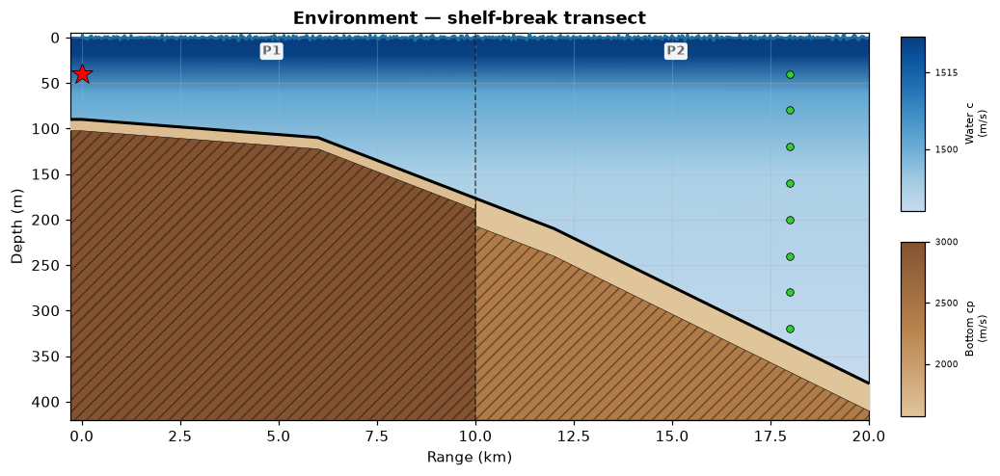
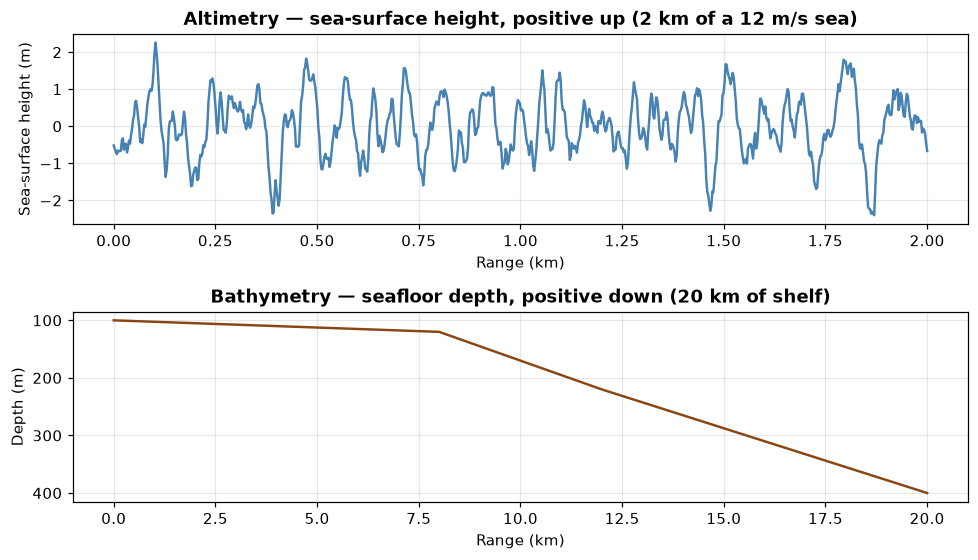
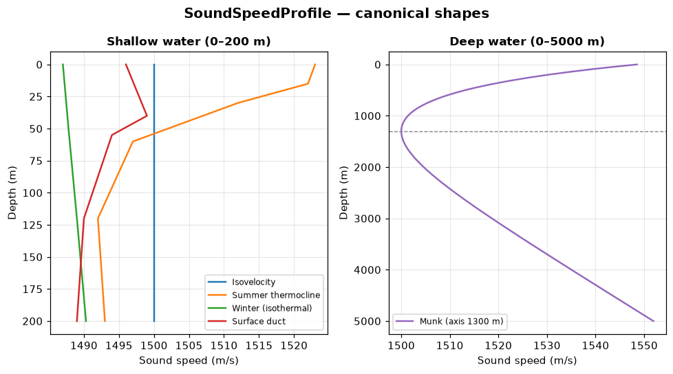
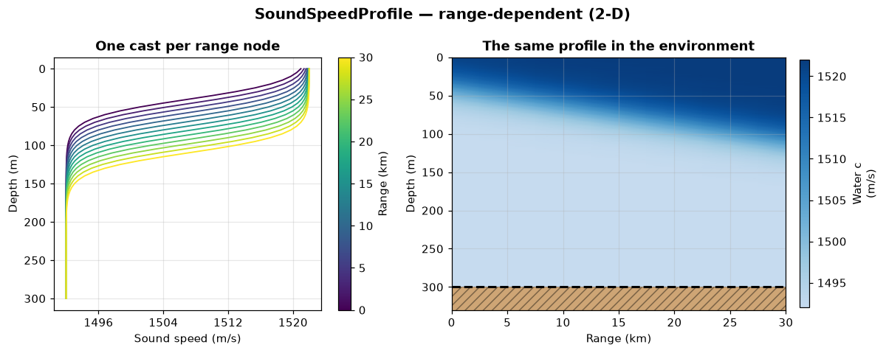
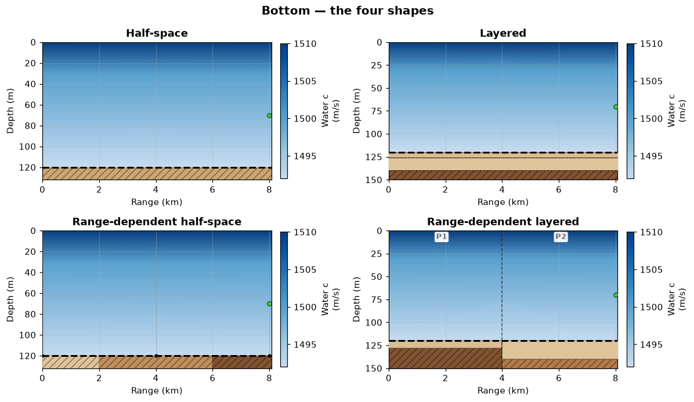
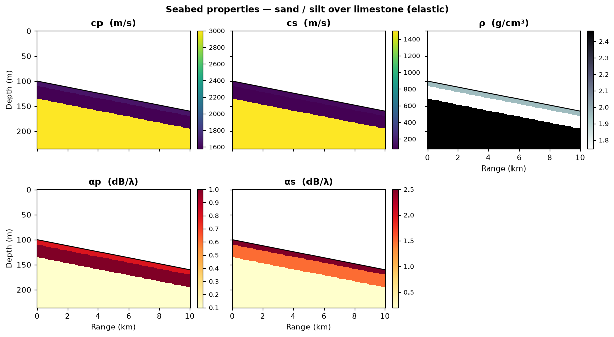
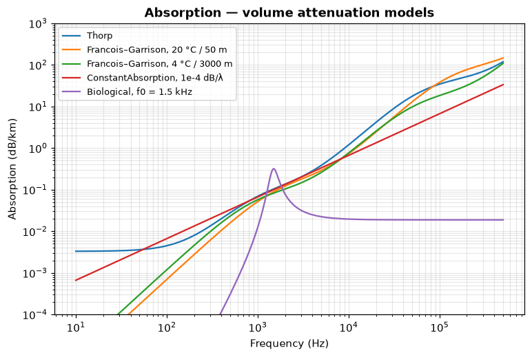
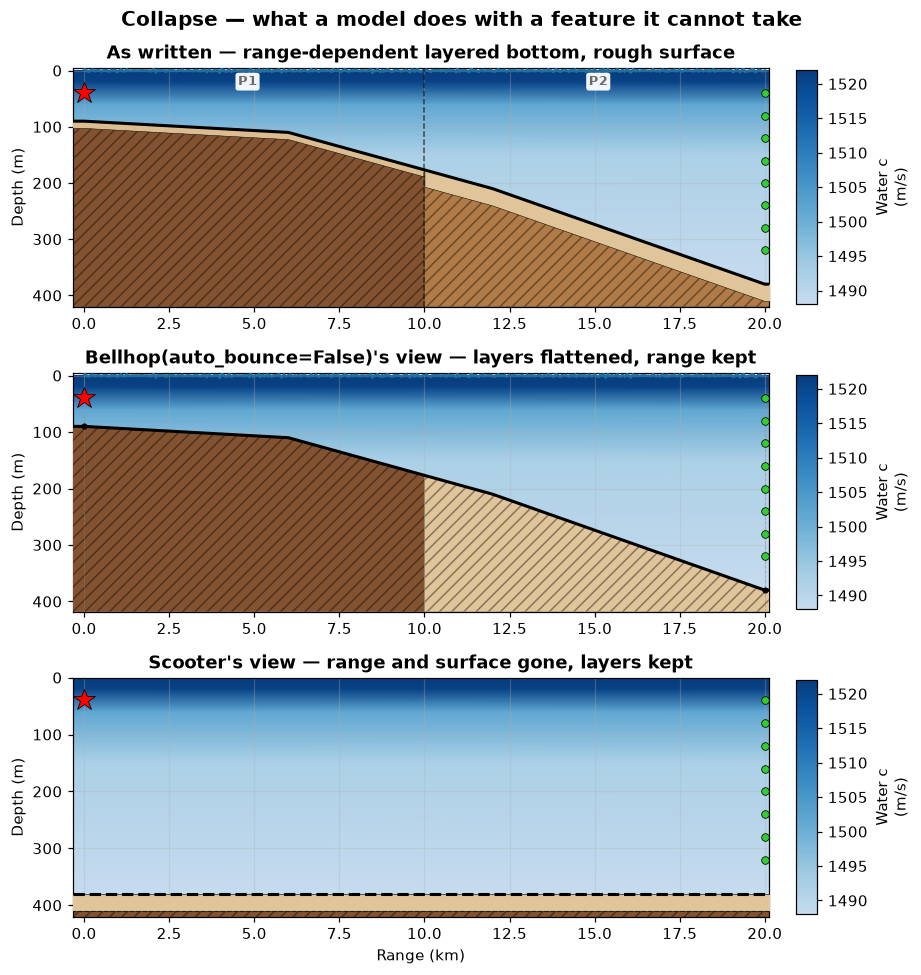

# Environment — describing the ocean to uacpy

> `uacpy.Environment` and the carriers it holds · the input every model consumes

You pick a model for the physics. You write an `Environment` for the water.
This page is the second thing to read: it covers every carrier that describes
the ocean, and the **collapse policy** that decides what happens when the model
you picked cannot consume something you wrote.

One object goes into every model in the package:

```python
result = Model(**knobs).run(env, source, receiver, run_mode=...)
```

`env` is always an `Environment`. `source` and `receiver` are covered in
[source and receiver](source-receiver.md).

---

## 1. The `Environment` carrier

`Environment` is a container of six independent carriers, each owning one
aspect of the ocean:

| Field | Type | What it owns | Default |
|---|---|---|---|
| `bathymetry` | `Bathymetry` | seafloor depth vs range | **required** |
| `ssp` | `SoundSpeedProfile` | water sound speed `c(z)` or `c(z, r)` | isovelocity 1500 m/s |
| `bottom` | `Bottom` | seabed acoustic properties | 1600 m/s / 1.5 g/cm³ / 0.5 dB/λ half-space |
| `surface` | `Surface` | top-boundary acoustic properties | vacuum (pressure release) |
| `altimetry` | `Altimetry` or `None` | sea-surface **shape** vs range | `None` (flat, z = 0) |
| `absorption` | `Absorption`, `AbsorptionCoefficient` or `None` | water-column volume attenuation | `None` |
| `water_density` | `float` (g/cm³) | sea-water density every deck writes for the water column | 1.027 |

Only `bathymetry` is required. Every other argument has a physically sensible
default, and each accepts a shorthand that is coerced to the real carrier — so
you rarely construct the carriers by hand:

```python
import uacpy

env = uacpy.Environment(
    name='Shallow-water channel',
    bathymetry=100.0,                                  # → Bathymetry
    ssp=[(0.0, 1500.0), (30.0, 1495.0), (100.0, 1490.0)],  # → SoundSpeedProfile
    bottom='sand',                                     # → Bottom (preset half-space)
)
```

`Environment` also carries optional provenance — `name`, `location`,
`transect`, `date` and `data_sources`. These are keyword-only, default to
`None`/empty for a hand-built environment, and are stamped for you by
`uacpy.data.fetch_environment`; see [external data](data.md).

### The six carriers, drawn at once

Every figure on this page is generated by
[`docs/figure_scripts/environment.py`](../figure_scripts/environment.py); the
snippets below are condensed from it, so the script is the authoritative
figure code.

```python
import numpy as np
import uacpy

env = uacpy.Environment(
    name='Shelf break',
    bathymetry=[(0.0, 90.0), (6000.0, 110.0),
                (12000.0, 210.0), (20000.0, 380.0)],
    ssp=[(0.0, 1522.0), (20.0, 1521.0), (60.0, 1502.0),
         (150.0, 1492.0), (380.0, 1488.0)],
    bottom=uacpy.Bottom.from_columns(
        [uacpy.SeabedColumn.from_presets(
            layers=[('sand', 12.0)], halfspace='limestone'),
         uacpy.SeabedColumn.from_presets(
            layers=[('silt', 30.0)], halfspace='chalk')],
        ranges=[0.0, 20_000.0],
    ),
    altimetry=uacpy.generate_sea_surface(
        20_000.0, wind_speed_kn=30.0, n_points=1200,
        rng=np.random.default_rng(0)),
)
source = uacpy.Source(depths=40.0, frequencies=150.0)
receiver = uacpy.Receiver(depths=np.linspace(40.0, 320.0, 8), ranges=18_000.0)

env.plot(source=source, receiver=receiver)
```



A shelf-break transect: the seafloor falls from 90 m to 380 m over 20 km, a
summer thermocline sits at 60 m, and the seabed turns from sand-over-limestone
to silt-over-chalk past the break. The two colour scales are independent —
**blues** are water sound speed, **browns** are seabed compressional speed —
because they span different ranges and sharing one would flatten both. `P1` and
`P2` mark the two seabed columns; the dashed line is the boundary between them,
drawn midway between the range nodes. The red star is the source, the green
dots the receiver array.

`env.plot()` is the carrier counterpart of `result.plot()`. Every uacpy object
you would plot on its own has a `.plot()` — see [plotting](plotting.md).

### `depth` is derived, not stored

```python
env.depth        # 380.0 — read-only, maximum of env.bathymetry.depths
env.range_max    # 20000.0 — largest range coordinate across every carrier
```

**`bathymetry` is the sole seafloor source.** No other carrier declares where
the seabed is: not `bottom` (which carries acoustic properties only), not
`ssp` (whose depth axis may extend past the seafloor). Assigning `env.depth`
raises `AttributeError`.

Consequences worth knowing:

- If the SSP stops **above** the deepest bathymetry, `Environment.__init__`
  extends it to that depth by holding the deepest sound speed flat — the
  constant-extrapolation convention the Acoustics-Toolbox writers require.
- If the SSP extends **below** the seafloor, it is left alone. `env.depth`
  still comes from the bathymetry.

```python
uacpy.Environment(bathymetry=100.0, ssp=[(0, 1500), (50, 1490)]).ssp.depths
# array([  0.,  50., 100.])   ← extended, c held at 1490 m/s

uacpy.Environment(bathymetry=100.0, ssp=[(0, 1500), (200, 1480)]).depth
# 100.0                       ← bathymetry wins
```

### Querying an environment

| Call | Returns |
|---|---|
| `env.depth` | max seafloor depth (m) |
| `env.range_max` | range extent across all carriers (m) |
| `env.ssp.sound_speed_at(depths, range=0.0, method='linear')` | `c` at depth(s) |
| `env.bathymetry.collapse_range(method)` | `'max'`/`'median'`/`'mean'`/`'min'`/`'initial'` |
| `env.is_range_dependent` | does *anything* vary with range? |
| `env.bathymetry.is_range_dependent` / `env.ssp.is_range_dependent` / `env.bottom.is_range_dependent` / `env.surface.is_range_dependent` | per-axis: more than one range node |
| `env.bathymetry.varies_with_range` | do the depths change with range? |
| `env.bottom.is_layered` | are there sediment layers? |
| `env.bottom.is_elastic` / `env.surface.is_elastic` | is there shear? |
| `env.copy()` | deep copy — every carrier duplicated |

`ssp.sound_speed_at` interpolates linearly unless you pass `method=`, whatever
scheme a model will use, and warns if you ask outside the profile (the value is
held flat at the nearest endpoint, never fabricated).

The carriers' `is_*` predicates are the same ones the collapse machinery reads in
[§7](#7-collapse-policy), so they tell you in advance what a model will complain
about.

### Saving an environment

An environment saves two ways, and reads back through its constructor, so a
loaded one passes every check a new one does and runs exactly as the one saved:

```python
np.savez('env.npz', **env.to_dict())                       # plain arrays
env = uacpy.Environment.from_dict(dict(np.load('env.npz', allow_pickle=True)))

env.to_netcdf('env.nc')                                     # one group per carrier
env = uacpy.Environment.from_netcdf('env.nc')
```

`to_dict()` nests every carrier's own `to_dict()` under its public class name;
the provenance is written by source id (`'gebco'`, `'woa23'`, …) with the fetch's
actual date and point, and restored from the catalogue. The NetCDF file has one
group per carrier — `bathymetry`, `ssp`, `altimetry`, `bottom`, `surface`,
`absorption` — each the carrier's `to_xarray()`: the gridded values (the sound
speed on `(depth, range)`, the seafloor depth and the surface height on
`range`, α on `(depth, frequency)`) as variables with CF `units`, every other
field as JSON in the group's `uacpy_fields` attribute. It needs a NetCDF engine
that writes groups (netCDF4 or h5netcdf, through the `uacpy[xarray]` extra).

Every carrier has the same calls on its own: `to_dict()` / `from_dict()`, and
`to_xarray()` / `from_xarray()`. `Bottom`, `SeabedColumn` and `Surface` also
have `to_dataframe()`: one row per layer, then the half-space, with its `top`
and `bottom` below the seafloor (one row per range node for a surface);
`Receiver.grid()` gives the `(Z, R)` depth and range of every receiver,
depth-first like a `(depth, range)` Field.

---

## 2. `Bathymetry` and `Altimetry` — the two shape carriers

Both are 1-D `value(range)` profiles with the same API. They differ in one
thing: **sign convention**.

| | `Bathymetry` | `Altimetry` |
|---|---|---|
| Value vector | `.depths` | `.heights` |
| Sign | positive **down** | positive **up** |
| Zero | sea surface | mean sea level |
| Constraint | strictly positive | any finite value |
| `None` allowed | no — required | yes (flat surface) |

```python
bathy = uacpy.Bathymetry.coerce([(0.0, 100.0), (5000.0, 200.0)])

bathy.at(range=2500.0)     # 100.0  — nearest stored node, never fabricates
bathy.eval(range=2500.0)   # 150.0  — linear interpolation
bathy.isel(range=-1)       # 200.0  — positional
bathy.depth                # 200.0  — the deepest point
bathy.range_max            # 5000.0
bathy.to_pairs()           # (N, 2) array of (range, depth)
```

`at` / `eval` / `isel` are the shared **grid-library** selectors used across
uacpy ([results](results.md) has the same three on `Field`). `at` is always
nearest; `eval` takes `method='linear'` (default), `'nearest'` or `'cubic'`,
with constant extrapolation past the ends. Because these carriers have a single
axis, the selectors collapse it and hand back the **value** directly — a float
for a scalar range, an array for an array of ranges.

Ranges are metres everywhere in the API. Kilometres appear only on plot axes
and inside the native model file formats.

### Generating a sea surface

`generate_sea_surface` draws a Pierson–Moskowitz realisation and returns an
`(n_points, 2)` array of `(range, height)`, ready to hand to
`Environment(altimetry=...)`; `Altimetry.from_sea_state` takes the same
arguments and returns the `Altimetry` carrier itself:

```python
from figure_scripts._common import sloping_shelf   # 100 m shelf → 400 m over 20 km

env, _, _ = sloping_shelf()
altimetry = uacpy.Altimetry.coerce(uacpy.generate_sea_surface(
    2000.0, wind_speed_kn=24.0, n_points=800,
    rng=np.random.default_rng(7)))

altimetry.plot(title='Altimetry — sea-surface height, positive up')
env.bathymetry.plot(title='Bathymetry — seafloor depth, positive down')
```



The two panels are the same kind of object with opposite sign conventions:
the altimetry axis points up and crosses zero, the bathymetry axis points down
and cannot. `wind_speed_kn` is the wind at 19.5 m (the Pierson–Moskowitz
convention), in knots; significant wave height is `Hs ≈ 0.021·U²` with `U`
in m/s, so 24 kn (12.3 m/s) gives `Hs ≈ 3 m` — consistent with the ±2 m
excursions above. Pass
`rng=np.random.default_rng(seed)` for a reproducible realisation.

**Altimetry is surface *shape*, `Surface` is surface *properties*.** A rough
sea surface that is still pressure-release is `altimetry=`; an ice canopy with
its own sound speed and shear is `surface=`. They are independent, and models
support them independently — [Bellhop](../models/bellhop.md) and
[RAM](../models/ram.md) are the only two that take altimetry natively, and
RAM only its depressions: `ramsurf` clamps every crest above `z = 0` to the
mean sea level (with a `FallbackWarning`), which flattens about half of a
two-sided surface such as `generate_sea_surface`'s. A two-sided wave field
needs Bellhop.

---

## 3. `SoundSpeedProfile`

The water column. One class covers 1-D and 2-D profiles: internally the data is
always a `(n_depth, n_range)` matrix, with `ranges=None` and one column for the
range-independent case.

### Building one

| Factory | Use |
|---|---|
| `SoundSpeedProfile.from_pairs([(z, c), …])` | measured cast — the common case |
| `SoundSpeedProfile.from_isovelocity(depth_max, sound_speed=1500.0)` | constant column |
| `SoundSpeedProfile.from_munk(depth_max, n_points=101)` | deep-water canonical profile |
| `SoundSpeedProfile.from_temperature_salinity(depths, T, S)` | from in-situ `T(z)` and `S(z)` |
| `SoundSpeedProfile.from_2d(depths, ranges, matrix)` | range-dependent `c(z, r)` on one shared depth axis |
| `SoundSpeedProfile.from_casts(ranges, casts, *, depths=None)` | range-dependent from casts on their own depth grids: sorted, repeated depths averaged, interpolated onto the union of depths, a short cast holding its deepest value |

`Environment(ssp=…)` coerces the shorthands for you: `None` → isovelocity at
1500 m/s spanning the water column, a scalar → isovelocity at that speed, a
list of `(depth, c)` pairs → `from_pairs`, and a `SoundSpeedProfile` is used
as-is.

```python
shallow = {
    'Isovelocity': uacpy.SoundSpeedProfile.from_isovelocity(200.0, 1500.0),
    'Summer thermocline': uacpy.SoundSpeedProfile.from_pairs(
        [(0.0, 1523.0), (15.0, 1522.0), (30.0, 1512.0),
         (60.0, 1497.0), (120.0, 1492.0), (200.0, 1493.0)]),
    'Winter (isothermal)': uacpy.SoundSpeedProfile.from_pairs(
        [(0.0, 1487.0), (50.0, 1487.8), (120.0, 1489.0), (200.0, 1490.3)]),
    'Surface duct': uacpy.SoundSpeedProfile.from_pairs(
        [(0.0, 1496.0), (40.0, 1499.0), (55.0, 1494.0),
         (120.0, 1490.0), (200.0, 1489.0)]),
}
munk = uacpy.SoundSpeedProfile.from_munk(5000.0)
```



Four shallow-water shapes and the deep-water canonical one. The **summer
thermocline** bends every ray downward and strips energy out of the surface
layer. The **winter** profile is very slightly upward-refracting, so energy
stays near the surface and range dependence matters less. The **surface duct**
has a sound-speed maximum at 40 m, trapping energy above it — at the price of
putting every trapped path onto the sea surface once per cycle, so a duct's
reach falls away with sea state and frequency (§2). **Munk** is the
canonical deep-water profile with its axis at 1300 m (dashed) and `c_min` =
1500 m/s — the sound channel that carries energy across ocean basins.

`from_munk` is analytic, so those numbers are fixed by the formula, not by the
`depth_max` you request; `n_points` only sets the sampling.

### The kind declares, the model interpolates

This split matters and is easy to trip over:

- The **carrier** declares what its samples *are*, via
  `SoundSpeedProfile(kind=…)`: `'measured'` (default), `'isovelocity'`,
  `'munk'`, `'analytic'` or `'n2linear'`.
- The **model** decides how to *connect* those samples, via
  `Model(interp_ssp=…)`: `'linear'`, `'pchip'`, `'cubic'`, `'quad'`,
  `'n2linear'`, `'analytic'`, or `None` for auto.

`kind` is informational metadata with exactly one exception:
`kind='isovelocity'` forces constant interpolation, because any connection
scheme over constant data is constant anyway. Every other value leaves the
choice to the model.

`interp_ssp=None` (the default on every model that has it) resolves to
`'quad'` when the environment carries a range-dependent SSP, and `'linear'`
otherwise.

The reason for the split: the same measured cast is a legitimate input to seven
solvers that discretise it differently. Baking an interpolation scheme into the
carrier would mean re-writing the environment to change solver — which is the
thing this whole design exists to avoid.

### Range-dependent (2-D) profiles

```python
depths = np.linspace(0.0, 300.0, 61)
ranges = np.linspace(0.0, 30_000.0, 13)
# A front: the thermocline deepens from 40 m to 110 m across the transect.
z_therm = np.linspace(40.0, 110.0, ranges.size)
matrix = np.empty((depths.size, ranges.size))
for j, zt in enumerate(z_therm):
    matrix[:, j] = 1492.0 + 30.0 / (1.0 + np.exp((depths - zt) / 12.0))

ssp = uacpy.SoundSpeedProfile.from_2d(depths, ranges, matrix)
env = uacpy.Environment(name='Frontal transect', bathymetry=300.0, ssp=ssp,
                        bottom='sand')

ssp.plot(title='One cast per range node')
env.plot(title='The same profile in the environment')
```



The same carrier, two views. On the left `ssp.plot()` draws one line per range
column, coloured by range — the fan of casts you would actually have measured.
On the right the environment renders it as a field, which is where the
structure reads: a warm eddy or shelf-slope front pushing the thermocline from
40 m down to 110 m across 30 km.

Slicing follows the grid-library rules, with one guard specific to 2-D
profiles:

```python
ssp.at(depth=50.0, range=10_000.0)   # nearest sample on both axes
ssp.eval(depth=50.0, range=10_000.0) # interpolated, method='linear'|'nearest'|'cubic'
ssp.isel(depth=0, range=-1)          # positional
ssp.collapse_range('mean')           # 2-D → 1-D: 'r0' | 'rmax' | 'mean' | 'median'

ssp.at(depth=50.0)                   # ConfigurationError on a 2-D profile
```

A depth-only slice of a range-dependent profile is ambiguous, and silently
returning the `r = 0` column would be wrong physics on exactly the profiles the
2-D carrier exists for. Pin the range as well, or collapse the range axis
first.

---

## 4. The seabed

Four classes, in increasing scope:

| Class | Is | Carries |
|---|---|---|
| `BoundaryProperties` | one boundary | `sound_speed`, `density`, `attenuation`, `shear_speed`, `shear_attenuation`, `roughness` |
| `SedimentLayer` | one finite layer | the above plus `thickness` |
| `SeabedColumn` | one column at one range | `layers` (possibly empty) over a `halfspace` |
| `Bottom` | the seabed | one or more `SeabedColumn`s plus an optional `ranges` axis |

`env.bottom` is **always** a `Bottom`. Everything else is coerced:

```python
uacpy.Environment(bathymetry=100.0, bottom='sand')      # preset half-space
uacpy.Environment(bathymetry=100.0, bottom=1800.0)      # half-space at 1800 m/s
uacpy.Environment(bathymetry=100.0, bottom=bp)          # a BoundaryProperties
uacpy.Environment(bathymetry=100.0, bottom=column)      # a SeabedColumn
uacpy.Environment(bathymetry=100.0, bottom=bottom)      # a Bottom, used as-is
```

Note what the seabed classes do **not** carry: any notion of where the seafloor
is. That is `env.bathymetry`, always.

### The four shapes a `Bottom` can take

The two axes — range and layering — are independent, giving four combinations:

```python
# Half-space
uacpy.BoundaryProperties.from_preset('sand')

# Layered
uacpy.SeabedColumn.from_presets(
    layers=[('sand', 6.0), ('silt', 14.0)], halfspace='limestone')

# Range-dependent half-space
uacpy.Bottom.from_halfspaces(
    [0.0, 4000.0, 8000.0], sound_speed=[1550.0, 1650.0, 1800.0],
    density=[1.6, 1.9, 2.0], attenuation=[0.3, 0.8, 0.6])

# Range-dependent layered
uacpy.Bottom.from_columns(
    [uacpy.SeabedColumn.from_presets(
        layers=[('sand', 8.0)], halfspace='limestone'),
     uacpy.SeabedColumn.from_presets(
        layers=[('silt', 20.0)], halfspace='chalk')],
    ranges=[0.0, 8000.0])
```



The same 120 m water column in all four panels, so the only thing that changes
is the seabed carrier. The half-space is a single hatched fill; the layered
column adds solid per-layer bands above it; the range-dependent half-space
steps through three property sets, each switch midway between two range nodes; the range-dependent
layered case is a geological cross-section with one column per range node
(`P1`, `P2`) and a dashed boundary between them.

`from_halfspaces` accepts a scalar or a per-range array for each property, so
`density=1.8` with three ranges means the same density everywhere.

Predicates tell you which of the four you have: `bottom.is_layered`,
`bottom.is_range_dependent`, `bottom.is_elastic`.

### Presets and the `uacpy.materials` catalogue

Nine class-typical materials, keyed by name:

| | `c_p` (m/s) | `ρ_b/ρ_w` | `α_p` (dB/λ) | `c_s` (m/s) | `α_s` (dB/λ) | `ϕ` |
|---|--:|--:|--:|--:|--:|--:|
| `clay` | 1500 | 1.5 | 0.2 | 80 | 1.0 | 8.8 |
| `silt` | 1575 | 1.7 | 1.0 | 80 | 1.5 | 5.4 |
| `sand` | 1650 | 1.9 | 0.8 | 110 | 2.5 | 3.34 |
| `gravel` | 1800 | 2.0 | 0.6 | 180 | 1.5 | −1.0 |
| `moraine` | 1950 | 2.1 | 0.4 | 600 | 1.0 | — |
| `chalk` | 2400 | 2.2 | 0.2 | 1000 | 0.5 | — |
| `limestone` | 3000 | 2.4 | 0.1 | 1500 | 0.2 | — |
| `basalt` | 5250 | 2.7 | 0.1 | 2500 | 0.2 | — |
| `granite` | 5750 | 2.58 (2.65 g/cm³) | 0.1 | 3000 | 0.2 | — |

The density column is Table 1.3's **ratio** `ρ_b/ρ_w`, which is what the table
prints and what propagation depends on. The stored `density` (g/cm³) is that
ratio times the package's one water density, 1.027 g/cm³
(`uacpy.DEFAULT_WATER_DENSITY_G_CM3`, what every deck writes for the water) —
so `get_material('sand')['density']` is 1.951, and a run in default water sees
exactly the tabulated 1.9. With `Environment(water_density=1.0)` the ratio
rises by 2.7 %; to reproduce a textbook curve drawn against `ρ_w = 1`, pass the
ratio itself (`density=1.9`). Granite is Ainslie's absolute 2.65 g/cm³.

Each entry also carries `porosity` (%) and `roughness` (m). `list_materials()`
returns the names, `get_material(name)` a copy of the dict. `ϕ` is the mean
Wentworth grain size, undefined for consolidated rocks. Rows `clay` … `basalt`
are Jensen, Kuperman, Porter & Schmidt Table 1.3; `granite` has no row there and
is Ainslie, *Principles of Sonar Performance Modelling* (2010), Table 4.20
instead — two sources, each row the one named for it, never a blend. The `c_s`
of silt, sand and gravel stands in for a depth-dependent `c_s(z̄)` that Table 1.3
leaves as a relation, and the depth that single value refers to is not recorded
there, so pass an explicit `shear_speed` when the depth matters.

Three constructors read the catalogue:

```python
uacpy.BoundaryProperties.from_preset('sand')                    # half-space
uacpy.SedimentLayer.from_preset('sand', thickness=10.0)         # one layer
uacpy.SeabedColumn.from_presets(layers=[('sand', 10.0), ('silt', 25.0)],
                                halfspace='limestone')          # a stack
```

All three are **fluid by default** — the preset's shear properties are dropped
so the result works in every model. Pass `elastic=True` to keep them. Any extra
keyword overrides a preset field for site-specific tuning, and layer entries may
be `(name, thickness, overrides)` triples.

Two other routes to a half-space: `BoundaryProperties.from_grain_size(phi)`
converts a Wentworth ϕ to explicit `c_p` / `ρ` / `α` via Hamilton (default) or
APL-UW, and `BoundaryProperties(acoustic_type='rigid')` gives a perfectly
reflecting boundary. A bare `grain_size_phi=` is rejected: it carries no
geoacoustics until converted, so inferring a bottom from it would silently use
the default properties.

### What `shear_speed` changes

`shear_speed > 0` anywhere in a column makes the seabed **elastic**, and that
single number changes which models can take your environment honestly:

| Model | With shear |
|---|---|
| [OASES](../models/oases.md), [Scooter](../models/scooter.md) | full elastic physics, natively |
| [Kraken](../models/kraken.md) | auto-routes to `backend='krakenc'` (complex modes) |
| [Bounce](../models/bounce.md) | exact plane-wave `R(θ)` for the elastic stack |
| [Bellhop](../models/bellhop.md) | runs Bounce first, then uses its `.brc` reflection table |
| [RAM](../models/ram.md) | routes to the `rams` backend |
| [SPARC](../models/sparc.md) | shear zeroed, with a warning — see [§7](#7-collapse-policy) |

Physically, shear opens a loss channel that a fluid seabed does not have:
energy converts to shear waves at the interface and leaves the water column, so
treating an elastic seabed as fluid **under-predicts** bottom loss. How much
depends on where `c_s` sits against the water speed. Clay through gravel
(`c_s` 80–180 m/s) cost under 0.25 dB, which you can ignore. The error grows as
`c_s` approaches the water speed and is worst for chalk and limestone, which
lose an extra 11–16 dB near 20–30° grazing. Above `c_s = 1500 m/s` the shear
wave is evanescent below the **shear critical angle** `arccos(1500/c_s)`, so a
basalt or granite basement loses nothing there and a few dB only at steeper
angles.

### Inspecting a seabed

```python
env = uacpy.Environment(
    name='Sand over limestone',
    bathymetry=[(0.0, 100.0), (10_000.0, 160.0)],
    ssp=[(0.0, 1505.0), (160.0, 1492.0)],
    bottom=uacpy.SeabedColumn.from_presets(
        layers=[('sand', 10.0), ('silt', 25.0)],
        halfspace='limestone', elastic=True),
)
uacpy.plot.plot_bottom_properties(env)
```



`Bottom` and `Surface` are the two carriers **without** a `.plot()`: placing a
sub-bottom depth axis needs a seafloor depth, which lives on the bathymetry, so
the plotter takes the whole environment. Five panels, one per geoacoustic
property — `c_p`, `c_s`, `ρ`, `α_p`, `α_s` — each drawn against range and
sub-bottom depth, so the layer stack is visible as horizontal bands tracking
the sloping seafloor. The `c_s` panel is the one to check when you are deciding
whether a fluid approximation is defensible: here the limestone half-space is
at 1500 m/s while the sediments are near 100 m/s.

Programmatic access:

```python
column = bottom.at(range=5000.0)          # nearest SeabedColumn — never blends stacks
column.at(depth=5.0)                      # material at 5 m sub-bottom (step lookup)
column.isel(layer=0)                      # the SedimentLayer itself
column.total_thickness()                  # 35.0
column.layer_depths(seafloor_depth=100.0) # [(100.0, 110.0), (110.0, 135.0)]

bottom.halfspace_at(range=2000.0)         # nearest column's half-space (step)
bottom.halfspace_at(range=2000.0, interp='linear')  # opt-in blend, pure half-spaces only
bottom.total_thickness_max()
bottom.all_sound_speeds()                 # every real c_p in the seabed
```

`Bottom` and `SeabedColumn` have `at` and `isel` but **no** `eval`: distinct
materials cannot be linearly blended, so selection is always nearest.
`halfspace_at` follows the same nearest rule by default, so a range-dependent
half-space is a step function of range whose switches sit midway between
consecutive nodes — the same switch every engine deck is written with. When
every column is a pure half-space, blending the properties is well defined,
and `interp='linear'` asks for it explicitly.

---

## 5. `Surface` — the top boundary

`env.surface` carries the acoustic properties of the top boundary, one
`BoundaryProperties` per range node. The default is a vacuum (pressure-release)
surface, which is right for open water.

```python
from uacpy.data import sea_ice_surface

# Uniform ice canopy: 3500 m/s, shear 1800 m/s, 0.9 g/cm³ (the SEA_ICE_*
# constants, Jensen et al.); the argument is the ice concentration, 0-1
ice = sea_ice_surface(1.0)
uacpy.Environment(bathymetry=200.0, surface=ice)

# Marginal ice zone: open water inshore, ice past 5 km
uacpy.Environment(bathymetry=200.0, surface=[
    (0.0, uacpy.BoundaryProperties(acoustic_type='vacuum')),
    (5000.0, ice),
])
```

`sea_ice_surface` returns `None` below the 15 % ice edge (open water), and
`fetch_sea_ice_surface(point, date=…)` builds the same boundary from the
concentration observed at a site. A rock preset is not ice: `chalk` is
2400 m/s at 2.26 g/cm³, a canopy that would sink.

A uniform `Surface` delegates attribute reads to its single node, so
`env.surface.acoustic_type` and friends work without indexing. Like `Bottom`,
it has `at` / `isel` but no `eval`.

Interfacial roughness lives on `BoundaryProperties.roughness` (RMS, metres) and
applies to **any** boundary type — a rough but still pressure-release sea
surface is `BoundaryProperties(roughness=2.0)`, which is why roughness never
triggers the half-space inference.

Which models consume it differs by boundary. [Kraken](../models/kraken.md) and
the [OASES](../models/oases.md) family take it at both the sea surface and the
seabed. [Scooter](../models/scooter.md) takes it at the sea surface **only when
that surface is a vacuum** — its solver reads the value through the
pressure-release impedance branch and nowhere else — and does not take it at
the seabed at all. Every other model, and every combination not listed, drops
it with a warning naming what was dropped.

What `Surface` and `altimetry` between them do **not** carry is a bubble layer.
Wind-driven bubbles change the sound speed in the top few metres — a void
fraction of only 1e-6 drops `bubble_sound_speed` by 14.4 m/s (1500.0 → 1485.6 at
its default, the nominal 1500 m/s; Wood's low-frequency limit) — and add an excess attenuation no boundary property
reproduces. `uacpy.core.acoustics` has `bubble_sound_speed`, `bubble_resonance`
and `bubble_surface_loss` for quantifying this by hand, but none of the three
feeds an `Environment`: they are calculators, not carriers. Note also that
`bubble_surface_loss` returns a per-bounce amplitude multiplier in `(0, 1]`,
at a grazing angle in degrees (`grazing_deg`) like `bottom_loss_curve`.

`uacpy.acoustics.critical_angle(bottom_sound_speed, water_sound_speed=1500.0)` is the
companion scalar — **seabed speed first** — returning the grazing angle
`arccos(water_sound_speed/bottom_sound_speed)` in degrees below which a faster seabed totally
reflects, and `nan` when the seabed is the slower of the two so there is no
critical angle to report (`critical_angle(1800, 1500)` is 33.6°;
`critical_angle(1500, 1800)` is `nan`). It is the same ratio-of-speeds angle as
`Modes.grazing_angles`, seen from the boundary instead of from a mode — that
one is vectorised over modes and returns `nan` per mode, which is why the two
are separate.

---

## 6. `Absorption` — volume attenuation

Volume attenuation is a property of the water, not of the solver: the same
column absorbs the same energy whichever model runs over it. So it lives on
`env.absorption`, and each model writer reads it to emit the right native
parameters.

**There is no default, and the models that can use one say so.** The
Acoustics Toolbox adds volume attenuation only when the option string asks
for it (`misc/AttenMod.f90:35-38`; the `SELECT CASE` at `:84` has no default
branch), so `absorption=None` is lossless water. That is the right default —
it is what the analytic benchmarks compare against, and it keeps a uacpy run
reproducing the engine's own answer for the same deck — but it is easy to
leave in place by accident: at 40 kHz over a kilometre Thorp puts the
omission at 12.9 dB, and at 20 kHz over 5 km a Kraken run measured 21.3 dB
against Francois-Garrison. Bellhop,
Kraken, Scooter, RAM and the OASES programs therefore warn when the omission is worth
more than a decibel over the track. SPARC does not: its march is lossless
whatever the environment says (`sparc.f90:221` keeps the real part of the
sound speed only), so it warns instead when an absorption or a seabed
attenuation is set, since neither is applied (see
[SPARC](../models/sparc.md#the-march-is-lossless)). Bounce does not, although the option
letter reaches its engine: it tabulates a reflection coefficient at an
interface, and its `receiver` is read only for `range_max`, which sizes the
table's angular resolution, so the notice would quote that knob as a
propagation distance. OASES takes it as each water layer's attenuation in
dB per wavelength, exact at the deck frequency; a multi-frequency deck (OASP,
OASSP, an OAST or OASN sweep) carries one value per layer for the whole
band, so across it the loss grows linearly in frequency. The value is
evaluated at the minimax anchor: the frequency in the band whose line
`α(f_a)·f/f_a` departs least, at its worst, from the law over the band and
the water column (`uacpy.core.absorption.minimax_anchor_frequency`; the band
centre when the law is already linear in frequency). The run warns when even
that line departs from the law by more than 0.05 dB/km. With `absorption=None` its water is written
lossless rather than left at the zero OASES would replace with its own
Skretting-Leroy law. OASR's water is a lossless half-space, and it says so
when an absorption is set. RAM carries it as a dB-per-wavelength
profile on every backend (see [RAM](../models/ram.md), *Environment
support*): the same `alpha(f, z)` the other wrappers hand their engines,
evaluated per bin on a broadband sweep.

| Class | Parameters | Depth-dependent |
|---|---|---|
| `Thorp()` | none | no |
| `FrancoisGarrison(temperature=10, salinity=35, pH=8, ph_scale='nbs', depths=None)` | the water (reference water by default) and the scale `pH` is on; arrays over `depths` for a T/S profile | yes |
| `Biological(layers=[(z_top, z_bottom, f0, Q, a0), …])` | per-layer resonance | yes, by layer |
| `ConstantAbsorption(value_dB_per_wavelength)` | one | no |

```python
freqs = np.logspace(1, 5.7, 400)

fig, ax = uacpy.Thorp().table(freqs).plot(label='Thorp')
uacpy.FrancoisGarrison(temperature=20.0, salinity=35.0,
                       pH=8.0).table(freqs, depths=50.0).plot(ax=ax)
uacpy.FrancoisGarrison(temperature=4.0, salinity=35.0,
                       pH=8.0).table(freqs, depths=3000.0).plot(ax=ax)
uacpy.ConstantAbsorption(value_dB_per_wavelength=1.0e-4).table(freqs).plot(ax=ax)
uacpy.Biological(layers=[(20.0, 80.0, 1500.0, 4.0, 0.02)]).table(
    freqs, depths=50.0).plot(ax=ax)
```



**One object per law.** The law is the thing you build, hand to an
environment, save and load; `law.table(frequencies, depths=None)` evaluates it
into an `AbsorptionCoefficient` — α in stated units (`.data`, read-only
through `.values()`), carrying the frequency axis and the law that made it
(`.model`, `.parameters`) — and the carrier draws itself. `depths=` takes a
scalar (evaluate there, one curve) or a sequence (a depth axis, drawn as an
α(f, z) heatmap); without it, a law is drawn at the surface (0 m), and a
Francois–Garrison profile on its own depths. `FrancoisGarrison` takes the
water as `temperature`, `salinity` and `pH`, the names and the
reference-water defaults (10 °C, 35 PSU, pH 8) of
`absorption_francois_garrison`, so `FrancoisGarrison().table(f)` is that
formula's surface curve like `Thorp().table(f)` is Thorp's. The law has no
depth of its own: the formula's depth (pressure) term varies down the
column, so every evaluation — `table`, `alpha_dB_per_m`, every engine —
takes the depth it is evaluated at, and every engine sees the same α(z). The
carrier's
`.parameters` records the values used (`FrancoisGarrison(**a.parameters)` is
the law again). The formulas under them take and return plain arrays in
dB/km, named `absorption_<model>` like `sound_speed_mackenzie` —
`uacpy.acoustics.absorption_thorp(f, depth=None)`,
`uacpy.acoustics.absorption_francois_garrison(f, temperature, salinity, pH,
depth)` and `uacpy.acoustics.absorption_biological(f, f0_hz, Q, a0)`, one
biological layer's resonance.

Reading the curves:

- **Thorp** implements *Computational Ocean Acoustics* Eq. (1.47) — four terms,
  one per regime: a 3.3×10⁻³ dB/km constant, the boric-acid (1 kHz) and
  magnesium-sulphate (64 kHz) relaxations, and viscous absorption in seawater,
  which does not overtake the magnesium-sulphate term until ~380 kHz.
  Frequency only, no parameters to get wrong, which is why it is the usual
  default. Two things the curve does not tell you. That constant is **not** an
  absorption mechanism — Jensen attributes the regime to leakage out of the deep
  sound channel, not to anything the water does — so below ~50 Hz Thorp and
  Francois–Garrison diverge hard: at 10 Hz Thorp gives 3.3×10⁻³ dB/km against
  FG's 1.2×10⁻⁵, and only FG is modelling absorption. And Eq. (1.47) is fitted at
  4 °C, 35 ppt, pH 8.0 and ~1000 m — the conditions of the 4 °C / 3000 m curve,
  not of the warm shallow one.
- **Francois–Garrison** is the same physics with the T/S/pH/depth dependence
  kept. The two curves stay within ~20 % of each other from 1 to 30 kHz and
  then separate: at 100 kHz the 20 °C / 50 m water absorbs about **twice** as
  much as the 4 °C / 3000 m water (37.8 vs 18.3 dB/km). They part at the other
  end too — below ~300 Hz the cold water absorbs 1.6–1.7× more, almost entirely
  a temperature effect — but both stay under 0.01 dB/km there, so the gap is a
  fraction of a dB even over 100 km. For high-frequency work in cold or deep
  water the choice matters a lot. Of the four parameters `pH` is the one to get
  right at low frequency: it scales the boric-acid term, and moving 8.0 (North
  Atlantic) to 7.7 (North Pacific) takes about a third off the absorption below
  1 kHz. Get its **scale** right too: the equation was fitted on NBS-scale pH
  (Brewer & Hester 2009), while GLODAP and the Copernicus BGC field report the
  total scale, about 0.1 lower for the same water. Pass `ph_scale='total'` for
  a measured value and it is moved to NBS with the Takahashi (1982) `fH` that
  CO2SYS uses (+0.10 at 4 °C, +0.15 at 25 °C at S = 35), which raises the
  absorption below 1 kHz by about 20 %; `fetch_environment(...,
  with_absorption=True)` does this for the pH it fetches. A hand-typed
  `pH=8.0` stays on NBS. `uacpy.acoustics.ph_to_nbs` is the conversion on its
  own.
- **ConstantAbsorption** is flat in dB/**wavelength**, which is a slope-1 line
  in dB/km on log-log: `α[dB/m] = α[dB/λ]·f/c`. It is a calibration knob, not a
  physical model.
- **Biological** is a Lorentzian fish-bladder resonance per layer, applied only
  within `[z_top, z_bottom]`. The peak at `f0` is `a0·Q²` (here
  0.02 × 4² = 0.32 dB/km), and far above `f0` it settles at
  `a0·Q²/(Q² + 1)` (0.0188 dB/km here, 0.94·`a0`). The Acoustics
  Toolbox engines (Bellhop, Kraken, Scooter, SPARC) evaluate the law only at
  sound-speed-profile nodes (`misc/AttenMod.f90:103-104`) and interpolate
  between them, so their deck writers add a node on every layer edge inside
  the water column and one 0.01 m outside it; without those nodes a layer
  that holds no SSP node would be lossless. Only a piecewise-linear profile
  (`interp_ssp='linear'` or `'n2linear'`) takes the extra nodes unchanged:
  under `'pchip'` or `'spline'` a layer edge inside the column is refused
  with a `ConfigurationError`, because the spline rings on the step in the
  imaginary sound speed and PCHIP reshapes the profile around the added
  nodes. RAM samples the layer edges itself and OASES averages the law over
  each water layer, so neither needs the nodes.

### Absorption from real water: a profile or a table

One `T S pH` row describes one water. A stratified column is several:
on a mid-latitude column (22 °C at the surface, 4 °C at 2 km) a single row
is off by tens of percent at the ends of the column. So the temperature,
salinity and pH of Francois–Garrison each take, mixed freely, a number, a
1-D array on the shared `depths=`, or `(depth, value)` pairs on depths of
their own (the convention of `SoundSpeedProfile.from_pairs`). Each property
is kept on its own depth axis and interpolated separately at the depth
evaluated (linear between its samples, its end values held beyond them; the
formula's depth term takes the depth asked). This is the one water-property
rule every T/S/pH input in uacpy follows — the `sound_speed_*` and
`absorption_*` formulas and `SoundSpeedProfile.from_temperature_salinity`
too, which with pairs builds its profile on their depths (see
[utilities](utilities.md#sound-speed)). Build the law, look at its table,
then hand the law to the environment.

```python
z = np.array([0.0, 30.0, 60.0, 200.0])        # m
T = np.array([22.0, 21.0, 12.0, 10.0])        # °C: a summer thermocline
S = np.array([35.0, 35.0, 34.8, 34.9])        # psu
freqs = np.logspace(3, 5, 60)

water = uacpy.FrancoisGarrison(temperature=T, salinity=S, depths=z,
                               pH=[(0.0, 8.1), (500.0, 8.0)])   # pairs
water           # FrancoisGarrison(T 10–22 °C (4 depths), S 34.8–35 psu (4 depths), pH 8–8.1 (2 depths))
table = water.table(freqs, depths=z)
table           # AbsorptionCoefficient(francois_garrison, T 10–22 °C (4 depths), ...)
table.plot()    # the α(f, z) heatmap

env = uacpy.Environment(bathymetry=200.0, ssp=1510.0, bottom='sand',
                        absorption=water)
field = uacpy.Kraken().run(env, uacpy.Source(depths=20.0, frequencies=10000.0),
                           uacpy.Receiver(depths=[20.0, 100.0],
                                          ranges=np.linspace(500.0, 5000.0, 10)))
```

`uacpy.data.fetch_environment(point, with_absorption=True)` builds the same
profile from the site's fetched T/S column
(`FrancoisGarrison.from_temperature_salinity`, whose `collapse_to_depth=`
keeps one row instead), with the cached GLODAP pH column as `(depth, pH)`
pairs on its own levels (one value at the column's mid-depth on the
Copernicus BGC branch).

What the environment does with a table:

- The table a law computed (`law.table(f)`, its `.model` set) is refused —
  `Environment(absorption=...)` takes the law itself, one object per law.
- A measured α(f, z) with no law behind it, built directly as
  `AbsorptionCoefficient(frequencies=f, data=alpha, units='dB/km',
  depths=z)` (`model=None`) with `data` shaped depth × frequency, is used
  as tabulated: linear in depth between its rows, linear in `log f` between
  its frequencies. A run at a frequency outside the table is refused
  (`ConfigurationError`): a table has no law to extrapolate with. Rows that
  stop short of the water column are held at the end row, and the
  environment says so (`ValidityWarning`). `env.absorption` prints as the
  table, and the environment's repr shows `absorption=tabulated`.

A measured table also comes from `(frequency, value)` pairs, the counterpart
of `SoundSpeedProfile.from_pairs`:

```python
from uacpy import AbsorptionCoefficient, Environment
# one measured spectrum, applied at every depth (dB/km by default)
table = AbsorptionCoefficient.from_pairs([(1e3, 0.06), (1e4, 0.95), (1e5, 33.0)])
# one spectrum per depth, all on the same frequencies
table = AbsorptionCoefficient.from_pairs({0.0:    [(1e3, 0.07), (1e4, 1.10)],
                                          1000.0: [(1e3, 0.05), (1e4, 0.80)]})
env = Environment(bathymetry=100.0, ssp=1500.0, absorption=table)
```

How each engine carries Francois–Garrison (one row or a profile) or a table
(no Fortran change):

- **Acoustics Toolbox, one frequency per deck** (Bellhop, Kraken, KrakenC,
  Scooter, SPARC, Bounce): `TopOpt(4)` is blank and every water SSP row's
  `alphaI` holds α at the deck frequency in
  dB per local wavelength, `α(f, z)·c(z)/f`, which the solver turns back
  into the same loss at that row's own sound speed. The law is sampled at
  the SSP nodes and interpolated between them — a fetched environment's
  profile comes from the same column, so its nodes are the T/S samples. A
  broadband deck (`TopOpt(6)='B'`) re-applies those rows at every
  frequency, linear in `f`, and warns (`NumericsWarning`) when that line
  departs from the law by 0.05 dB/km or more somewhere in the band. Under
  a range-dependent Bellhop profile (`'Q'`) the imaginary sound speed comes
  from the `.env` rows alone (`Bellhop/sspMod.f90:520`), the range-0
  column, so the range-0 α(z) is used at every range; the writer says so
  (`FallbackWarning`) when the profile's speeds leave that column.
- **Acoustics Toolbox, several frequencies per deck** (Kraken and Scooter
  broadband, `TopOpt(6)='B'`): one Francois–Garrison water row is written as
  AT's `'F'` row instead, exact in frequency, with `z_bar` at mid-water
  column: AT evaluates the formula there and applies it at every depth
  (`misc/AttenMod.f90:148-160`), and — unlike the water rows — in the
  sediment layers and half-spaces too (`CRCI`, `misc/AttenMod.f90:84-110`).
  The writer says so (`FallbackWarning`) when that one depth departs from the
  formula at depth by 0.05 dB/km or more somewhere in the band and the
  column (5-15 kHz in 20 °C water: 0.046 dB/km over 500 m, 0.055 over
  600 m). A profile or a table stays in the frozen rows, with the band
  check above.
- **Bellhop broadband / time series** trace once, at the carrier: a profile
  or a table does not scale from one frequency by one ratio, so the
  synthesis applies it linearly in frequency and gives the same warning. One
  Francois–Garrison row is scaled by its ratio `α(f)/α(fc)` at the surface,
  which the pressure terms bend with depth (0.058 dB/km at most over
  5-15 kHz in a 5 km column, against 0.54 for the linear line); the same
  check measures that bend and warns past 0.05 dB/km.
- **RAM** samples the law on its own grid and at every profile or table
  row, per frequency bin.
- **OASES** averages α over each water layer, as for every law.
- **Kraken's modal loss** (`Modes.with_attenuation`) evaluates the law at the
  mode depths.

A Francois–Garrison on the reference water (10 °C, 35 psu) assigned over an
environment's own water — `env.absorption = FrancoisGarrison(10, 35, 8)`
replacing a fetched profile — gives a `ProvenanceWarning` naming both waters
and the fix when they differ by more than 2 °C or 1 psu.

Units throughout the public API are **dB/wavelength** for material attenuation
and dB/km for the plotted volume curves; `uacpy.acoustics.convert_attenuation_units`
converts between the unit strings `'dB/km'`, `'dB/m'`, `'dB/wavelength'`, `'Nepers/m'`,
`'Q'` and `'L'` — spelled exactly so (the tables' `dB/λ` is `'dB/wavelength'`).

---

## 7. Collapse policy

This is the mechanism every model page links back to.

### The problem

Seven solvers make seven different approximations, and the approximation
decides what each can represent. [Scooter](../models/scooter.md) integrates over
a horizontally stratified medium, so a sloping seafloor is not something it can
express. [Bellhop](../models/bellhop.md) is a fluid ray tracer with no layered
seabed. [RAM](../models/ram.md) is one-way, so it cannot take a rough surface.

A library has three options when you hand a model something it cannot consume:
refuse, silently ignore, or reduce it under a stated policy. uacpy takes the
third.

### The mechanism

Before writing any input file, every model runs your environment through a
projection step that checks each feature against its own capability flags and
**collapses** anything it cannot take natively — emitting one `FallbackWarning` per
dropped feature, naming the feature, the method used, and the keyword that
overrides it.

```
FallbackWarning: Scooter does not support range-dependent bathymetry;
collapsed to 380.0 m (method='max', range 90.0–380.0 m). Override via
`collapse={'bathymetry': 'max'|'median'|'mean'|'min'|'initial'}`.
```

Your `env` is never mutated — the model works on a copy.

### The seven keys

| Key | Applies when | Methods | Default |
|---|---|---|---|
| `bathymetry` | seafloor varies with range | `max`, `median`, `mean`, `min`, `initial` | `max` |
| `ssp` | 2-D sound-speed profile | `r0`, `rmax`, `mean`, `median` | `r0` |
| `bottom_range` | seabed varies with range | `r0`, `rmax`, `mean`, `median` | `r0` |
| `bottom_layers` | seabed has layers | `halfspace`, `top_layer`, `volume_average` | `halfspace` |
| `altimetry` | rough/sloped sea surface | `drop` | `drop` |
| `surface` | top properties vary with range | `r0`, `rmax`, `mean`, `median` | `r0` |
| `elastic` | any shear present | `fluid`, `vacuum` | `fluid` |

`bottom_layers='volume_average'` is a thickness-weighted **arithmetic** mean of
`c`, `ρ` and dB/λ (and the shear pair) over the finite layers *and* the
half-space, which is weighted by the deepest layer's thickness because it has
none of its own. It is a bookkeeping number with no acoustic basis: 1 m of
1500 m/s, 1.4 g/cm³ mud over a 5250 m/s, 2.7 g/cm³ basalt half-space collapses
to 3375 m/s, where Wood's rule (averaging ρ and the compliance 1/ρc² over the
same two metres) would give about 1720 m/s. When the top layer is what the
field sees, use `'top_layer'`; when the stack matters, use a model that keeps
it (`supports_feature('layered_bottom')`).

Set them on the constructor:

```python
from uacpy.models import Scooter

Scooter(collapse={'bathymetry': 'median', 'bottom_layers': 'volume_average'})
```

Unknown keys and invalid methods raise `ConfigurationError` at construction,
not deep inside a writer at `run()` time.

Two behaviours are not `collapse` keys because they have no meaningful choice:
interfacial **roughness** is zeroed for models whose solver has nowhere to put
it, and `altimetry` only supports `'drop'`.

### Order matters for the seabed

The bottom has two orthogonal axes and they collapse in a fixed order: the
range axis first (to one column, layers intact), then the layer axis if needed.
For a model that takes range dependence but not layers that leaves a
*range-dependent half-space* bottom rather than a single column, which is
strictly more information than collapsing the other way round. Bellhop does
that only with `auto_bounce=False`; by default it routes a layered seabed
through BOUNCE, which keeps the layer stack and collapses the range axis to
one column (`bottom_range='median'`) — the opposite trade
([Bellhop](../models/bellhop.md) §3).

### Some defaults are per model

`DEFAULT_COLLAPSE` above is the project-wide baseline; a model may override it
where its physics prefers something else, and your `collapse={…}` always wins
over both.

| Model | Overrides |
|---|---|
| [Scooter](../models/scooter.md), [SPARC](../models/sparc.md), [OASES](../models/oases.md) except OASR | `ssp='mean'`, `bottom_range='median'` |
| [Bounce](../models/bounce.md), OASR | `bottom_range='median'` — the reflection-only engines leave the SSP on the global default |
| [Bellhop](../models/bellhop.md), [RAM](../models/ram.md), [Kraken](../models/kraken.md) | none — they take range dependence natively (Kraken segments bathymetry, SSP and bottom on its field path; `compute_modes` samples r = 0) |

The pattern: a modal or spectral solver reduces a 2-D profile by averaging
rather than by picking the source-end cast, because its answer depends on the
whole path.

### What it looks like

```python
env, source, _ = shelf_break()   # the §1 environment: RD layered bottom, rough surface

# Bellhop(auto_bounce=False) takes range dependence and the rough surface
# natively. It reads no layered bottom, so every column is flattened to its
# half-space. (The default Bellhop() keeps the layers through BOUNCE and
# collapses the range axis instead.)
bellhop_view = env.copy()
bellhop_view.bottom = env.bottom.collapse(layers='halfspace')

# Scooter is a stratified solver: the bathymetry, the bottom's range axis and
# the sea surface all go, but the layer stack survives intact.
scooter_view = env.copy()
scooter_view.bathymetry = uacpy.Bathymetry.coerce(
    env.bathymetry.collapse_range('max'))
scooter_view.bottom = env.bottom.collapse_range('median')
scooter_view.altimetry = None
```



One environment, three views. The reduced panels are built with the **public**
carrier reductions — `Bottom.collapse(layers=…)`, `Bottom.collapse_range(…)`,
`Bathymetry.collapse_range(…)` — at each model's documented default
method, so each panel reproduces exactly what that model hands its writer.

The averaging reductions have one boundary-type rule: `'mean'` / `'median'` on
`Bottom.collapse_range` and `Surface.collapse_range` average only across columns/nodes
that share a single `acoustic_type` (blending, say, a vacuum node into a sand
half-space would fold placeholders into the numbers). Over uniform `'file'` /
`'precalc'` columns — where each column *is* a reflection-coefficient table,
with no real numbers to average — they collapse to the shared reflection file,
reducing only the roughness (the one genuine number those columns carry), and
**raise** when the files differ: tables cannot be blended, so pick a column
with `'r0'` / `'rmax'` instead.

`Bellhop(auto_bounce=False)` keeps the slope, the two seabed columns and the
rough surface, and loses only the sand and silt layers: past 10 km the fill
turns to the pale chalk half-space that was underneath. The default `Bellhop()`
keeps the slope and the surface too, but hands its seabed to BOUNCE, which
keeps the layers of the median column and drops the range axis. Scooter keeps the layers and loses
everything range-dependent — a flat 380 m column (`bathymetry='max'`) carrying
the silt-over-chalk stack picked by `bottom_range='median'`, under a flat
surface.

Neither is a bug, and neither is the model being unhelpful. They are two
different approximations of the same ocean, and the warnings tell you which
parts of your description survived into each.

### Why the design exists

**You can hand the same `Environment` to every model.** That is the whole
point. Cross-model comparison — the most useful validation you can do — only
means something if both runs started from the same description of the water.
Maintaining seven environment shapes, one per solver, would make that
comparison impossible to trust.

**Silence would lie.** A model that quietly ignores your 2-D SSP produces a
plausible-looking field that answers a different question. The warning is the
feature: it names what was dropped, so you can decide whether that mattered.

**Refusing would be worse.** A first look at a shelf-break problem with Scooter
is genuinely useful even though Scooter must collapse the bathymetry, SSP and
seabed range axes to get there. Turning that into a hard error would force you to hand-build a
reduced environment — exactly the reduction the library just did for you, only
undocumented and unwarned.

**The reduction is yours to choose.** `max` is the safe default for bathymetry
because it never puts a receiver below the seafloor, but if you are modelling
the shallow end, `initial` or `min` is the better answer. The policy is a
keyword, not a hard-coded assumption.

When the collapse is not acceptable, that is the signal to change model, not to
fight the policy. The [capability matrix](../models/README.md#capability-matrix)
shows what each model takes natively.

---

## 8. Conventions and gotchas

**Units are SI, without exception.** Metres for depth, range and thickness;
m/s for every sound speed; g/cm³ for density; dB/wavelength for material
attenuation; Hz for frequency. Kilometres exist only on plot axes and inside
native file formats. The two classic slips warn at construction with a
`ValidityWarning` that quotes the value meant: a sound speed under 10 m/s
(typed in km/s) on a profile or a seabed, and a seabed density over 20
(typed in kg/m³).

**Depth is positive down, altimetry positive up.** Range is measured from the
source, which sits at `r = 0`.

**The water has a density, and it is not 1.** Seabed densities are absolute
g/cm³ from Hamilton's tables (sand 1.9, clay 1.5); sea water is about 1.027.
The decks used to write 1.0 for the water — the Acoustics Toolbox and Collins
convention — which overstated every impedance contrast by 2.7 %: sand over
water at normal incidence gave |R| = 0.353 instead of 0.341, a bottom loss of
9.05 dB instead of 9.34 dB per bounce, 1 to 3 dB over a ten-bounce
shallow-water path, always toward a harder seabed and invisible to a
cross-engine comparison because every engine agreed. `env.water_density`
(default 1.027 g/cm³, IES-80 at 10 °C and 35 psu) now goes into the water
rows of every deck that has one — Acoustics Toolbox and Bellhop SSP rows,
OASES water layers — and the engines that fix the water at 1 and read seabed densities
as ratios (the four RAM codes, and BOUNCE, whose `R` is referenced to a unit
density) receive each seabed density divided by it. `uacpy.acoustics.density(T, S) / 1000` gives the value for a measured
column, and `fetch_environment` sets it from the same T/S row that builds its
Francois-Garrison absorption. Textbook benchmarks take ρw = 1 by convention:
pass `water_density=1.0` to reproduce one.

**A result carries no environment.** `Result` holds its own identity and
provenance — the model, backend, frequencies and file paths — never the
`Environment`, `Source` or `Receiver` it ran against. Plotters take them
explicitly:

```python
tl.plot(env=env, source=source)
```

Without `env=`, a TL plot spans only the receiver grid and draws no seabed.
That is correct behaviour, not a missing feature: the result genuinely does not
know what water it came from. See [results](results.md).

**Carriers are stored by reference, not copied.** `Environment` does not
deep-copy the `ssp` / `bottom` / `surface` you pass. Models copy the whole
environment before touching anything, so your object is safe from *them* — but
if you mutate `env.ssp` in place yourself, you mutate the original. Use
`env.copy()` first.

**`at` never fabricates, `eval` interpolates.** Across every uacpy carrier and
result: `at` returns the nearest stored sample, `eval` interpolates, `isel`
indexes positionally. When a carrier has only `at`, it is because interpolating
that quantity is not well defined — layer stacks and boundary types cannot be
blended.

**Validation is at construction.** Non-monotonic axes, negative depths,
mismatched array lengths and unknown preset names all raise
`ConfigurationError` when you build the carrier, not when a solver chokes on
the file it generated.

**`bottom='sand'` is a half-space, not a layer.** The string and scalar
shorthands both build a pure half-space. For a finite sand layer over something
else you need `SeabedColumn.from_presets(layers=[('sand', 10.0)],
halfspace='limestone')`.

---

## 9. Where to go next

- **[Source and receiver](source-receiver.md)** — the other two carriers:
  geometry, frequencies, beam patterns, array layouts.
- **[External data](data.md)** — build an `Environment` from GPS coordinates
  instead of by hand: `fetch_environment` populates bathymetry, sound speed and
  seabed from public datasets and stamps the provenance.
- **[Model index](../models/README.md)** — the capability matrix, and which
  approximation breaks when.
- **[Results](results.md)** · **[Plotting](plotting.md)** — what comes back and
  how to draw it.
- **[Utilities](utilities.md)** — material presets, sound-speed and density
  helpers.
- **[File I/O](io.md)** — the readers and writers that turn these carriers into
  native model input.

---

**See also:** [documentation index](../README.md) ·
[source and receiver](source-receiver.md) · [results](results.md) ·
[plotting](plotting.md) · [external data](data.md) ·
[model index](../models/README.md)
