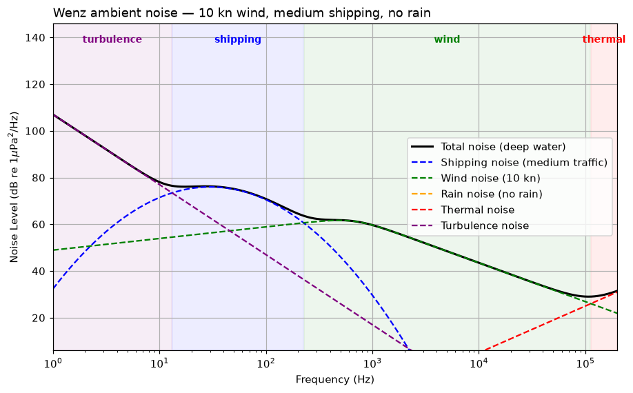
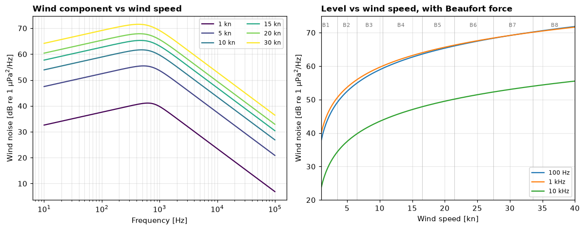
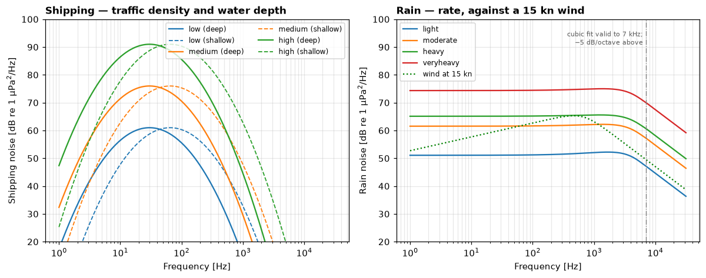
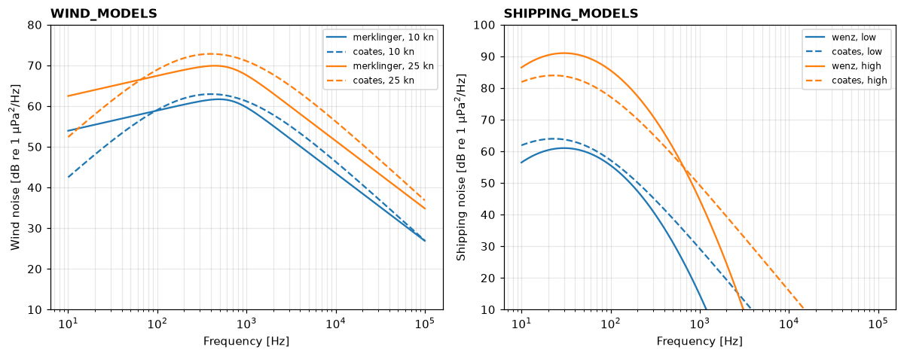
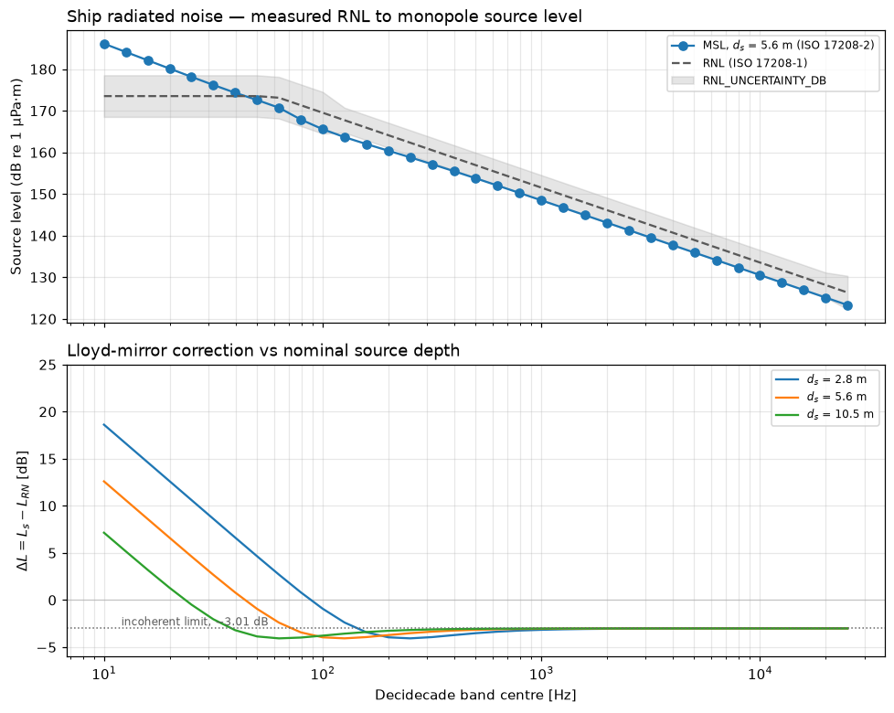
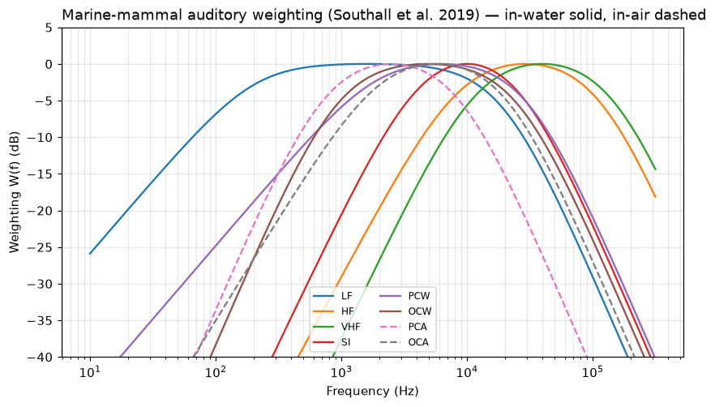
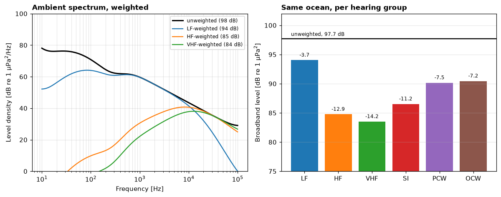

# Noise — the soundscape a receiver sits in

> `uacpy.noise` · Wenz composite ambient spectra · ship radiated noise
> (ISO 17208) · marine-mammal auditory weighting (Southall et al. 2019)

A propagation model tells you what arrives. It says nothing about what that
arrival has to compete with. `uacpy.noise` supplies the other half: the level
of the ocean itself, the level a ship puts into it, and the weighting that
turns a received spectrum into something an animal actually hears.

Three products, three consumers:

| Product | Function | Feeds |
|---|---|---|
| Ambient spectrum | `WenzNoise` | the `NL` term of the [sonar equation](sonar.md) |
| Ship source level | `monopole_source_level` | a propagation run, as the source |
| Auditory weighting | `weighted_level` | impact assessment |

Nothing in `uacpy.noise` imports matplotlib: it is pure computation, and the
matching plotters — `plot_wenz`, `plot_weighting`, `plot_source_level` — live
on `uacpy.plot` ([plotting](plotting.md)). A `WenzNoise` therefore has no
`.plot()` of its own; you pass it to `plot_wenz`.

---

## 1. The Wenz curves

Wenz's 1962 compilation is the canonical picture of ambient noise: spectral
level against frequency, from 1 Hz to 100 kHz, with the physically distinct
sources drawn as separate curves and the total as their envelope. It is the
first thing to look at because it answers the question "is my problem even
noise-limited, and by what?" before you run anything.

Everything on this page comes from
[`docs/figure_scripts/noise.py`](../figure_scripts/noise.py) — the code below
**is** that code, so it cannot drift from what you see.

```python
import numpy as np
import uacpy
from uacpy.noise import WenzNoise

f = np.logspace(0.0, 5.3, 1200)              # 1 Hz - 200 kHz
wenz = WenzNoise(f, wind_speed=10.0, shipping_level='medium')

uacpy.plot.plot_wenz(wenz)
```



The shaded bands are not decoration and are not hard-coded: they are read back
off the components, one band per source that is the largest at that frequency.
That is the point of the figure — the composite has the shape it has because
**four unrelated physical processes each own a stretch of the band**, and the
total is just their incoherent sum.

Every level on this page is a central estimate inside a very wide band: the
Wenz compilation it comes from spans about **50 dB at any given frequency**
(Abraham §3.3), and DRDC's own table of turbulence intercepts runs 88–138 dB.

The band edges quoted in the four headings below are this composite's own, at
10 kn and medium shipping, and they move with both. The canonical regimes are
broader and overlapping — turbulence below 20 Hz, shipping 10 Hz to 1 kHz,
wind-driven surface noise 100 Hz to 100 kHz, thermal above 50 kHz (Abraham,
Table 3.3) — so do not read a sharp edge as physics.

### Turbulence — below ~13 Hz

`107 − 33.2·log₁₀(f_Hz)`, so 107 dB at 1 Hz falling at 10 dB per octave —
`−10/log₁₀2 ≈ −33.2` dB per decade.

This is largely not radiated sound. The term fits the pressure fluctuation
produced by non-linear interaction among wind-generated surface waves and by
oceanic and atmospheric turbulence. It is 107 dB at 1 Hz and already under the
shipping hump by 13 Hz, so it matters only for infrasonic work — and there, a
real measurement depends as much on how the hydrophone is mounted as on the
ocean. Mounting is a separate quantity, though: flow past the sensor and cable
strumming land in the same band, but they are **self-noise** — excluded from
ambient noise by definition, and absent from this model.

The term takes no `wind_speed` — the wind component is the only one that does —
so raising the wind leaves this curve exactly where it was, and a VLF budget
built here will not respond to sea state. That is a known simplification: DRDC
notes a wind dependence in the slope "that is not captured by using a constant
value", and measured VLF noise correlates strongly with wind speed from 1–5 Hz.

### Shipping — roughly 13 to 230 Hz

A broad hump peaking near 30 Hz in deep water. This is **distant** traffic
integrated over a very large area, not one ship going past: propeller
blade-rate and machinery lines are low-frequency to begin with, and volume
absorption strips everything above a few hundred Hz out of the contributions
that travelled hundreds of kilometres. What survives the integration is the
low-frequency end, and that is the hump.

### Wind and sea state — ~230 Hz to ~110 kHz

Breaking waves and the oscillation of the bubble clouds they inject. This is
the dominant source across most of the band anyone works in, which is why wind
speed is the one ambient parameter you should always try to know — see
[external data](data.md) for fetching it from a real date and position.

The curve peaks near 500 Hz and rolls off at −5 dB per octave above it. Level
scales roughly as `20·log₁₀(u)`: **≈6 dB per doubling of wind speed** (5.99 dB
between 10 and 20 kn at 1 kHz, in this model).

### Thermal — above ~110 kHz

`−75 + 20·log₁₀(f)`, rising at 20 dB per decade: 25 dB at 100 kHz.

Molecular agitation of the water at the transducer face. This is a **floor**,
not a source — no receiver design beats it, because the medium itself is the
noise. Where it takes over depends entirely on the wind: at 10 kn the crossover
in this model is near 110 kHz, but in a flat calm (1 kn, no shipping) it falls
to about 32 kHz. The 110 kHz crossover is past the composite's published
1 Hz – 100 kHz range ([§2](#2-wenznoise--building-a-spectrum)); thermal is the
only term still meaningful up there, which is why the figure is drawn to
200 kHz.

### Rain — the fifth component

Rain is the fifth curve and does not own a band in the figure above, because
the figure is drawn with `rain_rate='no'` — the default. When it rains it
produces a broad hump — peaking at 1.2–1.7 kHz in this model — that can
dominate exactly the band the wind otherwise owns; see
[§4](#4-shipping-rain-and-the-deepshallow-switch).

---

## 2. `WenzNoise` — building a spectrum

```python
WenzNoise(frequencies, wind_speed, *, rain_rate='no', water_depth='deep',
          shipping_level='medium', wind_model=None, shipping_model=None,
          rain_model=None, thermal_model=None, turbulence_model=None)
```

| Argument | Units / values | Default |
|---|---|---|
| `frequencies` | Hz, strictly `> 0`; the fits are published for **1 Hz – 100 kHz** and nothing enforces that | **required** |
| `wind_speed` | **knots**, `≥ 0` | **required** |
| `shipping_level` | `'no'`, `'low'`, `'medium'`, `'high'` | `'medium'` |
| `rain_rate` | `'no'`, `'light'`, `'moderate'`, `'heavy'`, `'veryheavy'` | `'no'` |
| `water_depth` | `'deep'`, `'shallow'` | `'deep'` |
| `*_model` | `None`, a name from the registry, or a callable | `None` |

Wind speed is in **knots**, not m/s — the one wind speed in the package that is
not in m/s, because every published coefficient in this family is fitted in
knots. `uacpy.data.fetch_wind` and `generate_sea_surface(wind_speed_ms=…)` both
work in m/s; multiply by 1.9438 before handing a value here.

Everything is computed in `__init__`, so a `WenzNoise` is a result object, not
a solver:

| Attribute | Is |
|---|---|
| `frequencies` | the input vector (1-D, Hz) |
| `total` | incoherent sum of all five components, dB re 1 µPa²/Hz |
| `wind`, `shipping`, `rain`, `thermal`, `turbulence` | per-source spectra, same units |
| `components` | `NoiseComponents(total, wind, shipping, rain, thermal, turbulence)` |
| `models` | the submodel name chosen per component |
| `as_psd(ref=1.0)` | linear PSD; `10·log10(as_psd())` returns `total` to round-off |

**A switched-off source is `-inf`, not zero.** `shipping_level='no'`,
`rain_rate='no'` and `wind_speed=0` all return `-inf` dB at every frequency, so
the incoherent sum drops them exactly (`10**(-inf/10) == 0`) rather than adding
a 0 dB floor. That is why the hero figure's legend carries a "Rain noise (no
rain)" entry with no line under it: the component exists, it is silent.

`as_psd` is the bridge to time-domain work. The `ref` argument is the value of
the dB reference (1 µPa) expressed in your output unit, so `ref=1e-6` gives SI
Pa²/Hz:

```python
psd = wenz.as_psd(ref=1e-6)                  # Pa²/Hz
t, x, fs = uacpy.acoustic_signal.synthesize_noise_from_psd(
    psd, wenz.frequencies, sample_rate=96_000, duration=30.0)
```

That round-trip — analytic spectrum → realisation → PPSD back to the spectrum —
is [example 09](../../uacpy/examples/example_09_ambient_noise.py). See
[signal processing](signal.md) for the synthesis and PPSD side of it.

**Validation is at construction.** A DC bin (`f = 0`), a negative wind speed
and an unknown `shipping_level` each raise `ConfigurationError` immediately —
every component is a `log₁₀(f)` fit, and a 0 Hz bin would silently poison the
sum.

---

## 3. Wind and sea state

```python
f = np.logspace(1.0, 5.0, 800)
for u in [1.0, 5.0, 10.0, 15.0, 20.0, 30.0]:
    wenz = WenzNoise(f, wind_speed=u, shipping_level='no')
    ax_s.semilogx(f, wenz.wind, label=f'{u:g} kn')

probes = np.array([100.0, 1000.0, 10_000.0])
u_grid = np.linspace(1.0, 40.0, 160)
levels = np.array([WenzNoise(probes, wind_speed=u).wind for u in u_grid])
```



Left: the wind component alone, one curve per speed. The shape barely changes —
the whole family translates upward. The peak drifts slowly downward with
increasing wind (528 Hz at 5 kn, 453 Hz at 20 kn) because the knee frequency in
the fit is `770 − 100·log₁₀(u)`.

Right: the same data cut the other way, level against wind speed at three
frequencies, with Beaufort force marked. Two things read off it directly. The
**compression** — B1 to B4 buys 17.6 dB at 1 kHz, B5 to B8 only 5.8 dB — means
that in anything above a moderate sea, getting the wind speed exactly right
matters much less than it does in a calm. And 100 Hz and 1 kHz sit almost on
top of each other, which is the plateau at the top of the left panel.

`compute_windnoise` is the same wind term as a free function, without building
a whole composite:

```python
from uacpy.noise import compute_windnoise

compute_windnoise(f, u=15.0, water_depth='deep')             # dB re 1 µPa²/Hz
compute_windnoise(f, u=15.0, band_integrate=True)            # dB re 1 µPa²
```

`band_integrate=True` is the one place on the ambient side of `uacpy.noise`
that hands back a **band** level rather than a spectral level — see
[§6](#6-spectral-level-vs-band-level).

---

## 4. Shipping, rain, and the deep/shallow switch

```python
for level in ['low', 'medium', 'high']:
    deep = WenzNoise(f, wind_speed=5.0, shipping_level=level)
    shallow = WenzNoise(f, wind_speed=5.0, shipping_level=level,
                        water_depth='shallow')

for rate in ['light', 'moderate', 'heavy', 'veryheavy']:
    wenz = WenzNoise(f, wind_speed=5.0, rain_rate=rate)
```



**Traffic density is a 15 dB ladder.** `low` / `medium` / `high` peak at 61 /
76 / 91 dB re 1 µPa²/Hz — exactly 15 dB apart, because the model's density term
is `5·(c₂ − 4)` with `c₂ ∈ {1, 4, 7}`. Choosing one of three words is therefore
a ±15 dB decision about the loudest part of the low-frequency band, and it is
the single largest discretionary lever on this page. If you know the actual
traffic, use AIS data rather than a word.

**`water_depth` is not about your bathymetry.** It selects a coefficient
family, and it moves two things: the shipping hump's centre from 30 Hz to
65 Hz (dashed curves, left), and the wind term up by a flat 3 dB. The shift is
physical — a shallow waveguide cuts off the lowest frequencies, so the
distant-traffic contribution that survives to the receiver is higher in
frequency. Set it to match the water you are in; it is not derived from `env`.

**Rain is loud and lands where wind lives.** The right panel puts the four rain
rates against a 15 kn wind. Rain is nearly flat where wind is falling, so it
catches up with frequency: `light` rain is 11 dB below that wind at 1 kHz but
only 2.5 dB below by 5 kHz, and `veryheavy` is 12 dB above it at 1 kHz and
20 dB above at 5 kHz. Above the dot-dashed line at 7 kHz the cubic fit is out
of its published validity range, so the model melds onto a −5 dB/octave
roll-off anchored at the 7 kHz value. That anchoring is deliberate: without it,
the level above 7 kHz would depend on whether your frequency grid happened to
contain a sample just below the cutoff.

**Above ~10 kHz this component under-predicts rain.** The Torres–Costa cubic
peaks at 1.2–1.7 kHz and then falls monotonically, but measured rain noise has
a second, stronger peak in the **16–24 kHz** band from small-drop bubble
resonance (Abraham §3.3.4) which no term here carries. The DRDC report names
Ma, Nystuen & Lien (2005) — a combined wind-and-rain model — as the more
complex alternative it did not implement.

---

## 5. Swapping a component model

Each of the five components is looked up in a registry, so the composite is a
composition rather than one fused formula:

| Registry | Entries | Default |
|---|---|---|
| `WIND_MODELS` | `merklinger`, `coates` | `merklinger` |
| `SHIPPING_MODELS` | `wenz`, `coates` | `wenz` |
| `RAIN_MODELS` | `torres_costa` | `torres_costa` |
| `THERMAL_MODELS` | `mellen` | `mellen` |
| `TURBULENCE_MODELS` | `wenz` | `wenz` |

The defaults are the DRDC composite — turbulence included, though DRDC's two
sources for that term disagree with each other. `TURBULENCE_MODELS['wenz']`
implements the report's §2.1 specification, `107 − 33.2·log₁₀(f_Hz)`: the
slope is the primitive quantity, −10 dB/octave (`−10/log₁₀2 ≈ −33.2`
dB/decade), at the steep end of the −8 to −10 dB/octave range Wenz, Urick and
Nichols & Bradley all cite, with the 107 dB anchor traceable to Nichols &
Bradley in the report's own Table 1. DRDC's Annex A reference code implements
something else — `108.5 − 32.5·log₁₀(f_Hz)` (−9.78 dB/octave), which sits
1.5–2.9 dB higher over 1–100 Hz. uacpy follows the same rule here as
everywhere in this module: the numbered equations are normative, and the annex
is an implementation that takes shortcuts.

`coates` is the Coates (1989) / Stojanović (2007) pair that the
underwater-communications literature uses, so `WIND_MODELS` and
`SHIPPING_MODELS` let you reproduce either convention from the same call.

```python
merk = WenzNoise(f, wind_speed=25.0, wind_model='merklinger')
coat = WenzNoise(f, wind_speed=25.0, wind_model='coates')

wenz_ship = WenzNoise(f, wind_speed=10.0, shipping_level='high',
                      shipping_model='wenz')
coat_ship = WenzNoise(f, wind_speed=10.0, shipping_level='high',
                      shipping_model='coates')
```



The wind pair agrees to within a couple of dB in the mid-band and separates at
the ends: Coates is up to 4.8 dB louder at 10 kHz and 25 kn, and its
low-frequency roll-off is much steeper. The shipping pair differs more — Coates
has no real hump, just a shallow maximum and a monotone roll-off, so at the
Wenz peak (30 Hz, `high`) the two disagree by 7.3 dB, and by tens of dB above
1 kHz where both are far below the wind term anyway.

Selection accepts three things: `None` for the registry default, a `str` name,
or a **callable** used directly:

```python
def my_wind(frequencies, *, wind_speed, **_):
    return 44.0 + 20.0 * np.log10(wind_speed) - 17.0 * np.log10(frequencies)

WIND_MODELS['mine'] = my_wind                        # register by name
WenzNoise(f, wind_speed=12.0, wind_model=my_wind)    # or pass it directly
```

A submodel takes the whole parameter bundle (`wind_speed`, `water_depth`,
`shipping_level`, `rain_rate`) and ignores what it does not need via `**_`. It
must return one level per input frequency; a wrong shape or a missing `**_`
raises `ConfigurationError` naming the component, rather than failing
somewhere inside the sum. `wenz.models` records what was actually used — the
registry key if you passed a name, `'custom'` if you passed a callable
directly.

---

## 6. Spectral level vs band level

This is the one unit error that will silently cost you 20 dB.

Every level in `WenzNoise` is a **spectral** level: dB re 1 µPa²/**Hz**, a
density. `radiated_noise_level` and `monopole_source_level` in
[§7](#7-ship-radiated-noise-iso-17208) return **band** levels: dB re 1 µPa·m
integrated over a decidecade band. Differencing one against the other is a
`10·log₁₀(w)` error, where `w` is the bandwidth — 20 dB over a 100 Hz band.

Two ways across:

```python
from uacpy.noise import compute_windnoise

compute_windnoise(f, u=15.0, band_integrate=True)     # spectral -> band
band_level = spectral_level + 10 * np.log10(bandwidth_hz)
```

The rule for the sonar equation is that `SL`, `NL` and `RL` must all sit on the
same side — all spectral or all band. [`uacpy.sonar`](sonar.md) states and owns
that rule; `WenzNoise.total` is the `NL` term it expects, and
`uacpy.sonar.noise_background` is where `NL − DI` is formed. This page does not
restate the sonar equation.

---

## 7. Ship radiated noise (ISO 17208)

A ship is a source, and if you want to propagate one you need a source level.
Getting from a hydrophone measurement to a number a propagation model can
consume takes two standardised steps.

**Radiated Noise Level** (`radiated_noise_level`, ISO 17208-1 / ANSI-ASA
S12.64) is the measured decidecade-band SPL corrected back to 1 m by spherical
spreading: `L_RN = L_p + 20·log₁₀(r)`. It is a *measurement report*, not a
source description — it still contains the sea surface's interference pattern,
so it depends on the geometry you measured at.

**Monopole Source Level** (`monopole_source_level`, ISO 17208-2 §4) removes
that. The sea surface is pressure-release, so a source at depth `d` has a
negative image above it, and the pair radiates as a dipole. `ΔL` is the
correction that turns the measured pair back into the single omni-directional
point source a propagation model assumes:

```
ΔL = −10·log₁₀[ (2(kd)⁴ + 14(kd)²) / (14 + 2(kd)² + (kd)⁴) ],   k = 2πf/c
```

`nominal_source_depth(draught)` gives the `d` the standard prescribes:
`d_s = 0.7 × draught` (Formula 1).

```python
from uacpy.acoustic_signal.bands import decidecade_bands
from uacpy.noise import (RNL_UNCERTAINTY_DB, radiated_noise_level,
                         nominal_source_depth, monopole_source_level,
                         lloyd_mirror_correction)

_, fc, _ = decidecade_bands(10.0, 25_000.0)
received = 130.0 - 18.0 * np.log10(np.maximum(fc / 60.0, 1.0))

rnl = radiated_noise_level(received, 150.0)          # slant range 150 m
d_s = nominal_source_depth(8.0)                      # 8 m draught -> 5.6 m
msl = monopole_source_level(rnl, fc, d_s)
```



**Why this matters, and it matters a lot.** Look at the bottom panel. `ΔL`
settles to −3.01 dB at high frequency — source and image adding incoherently,
a factor of two in power — but at low frequency it grows without bound,
reaching +12.6 dB at 10 Hz for a 5.6 m source depth. A near-surface source
radiates *far less* at low frequency than its own strength implies, because
its image nearly cancels it. Report the RNL as a source level and you will
under-predict the low-frequency field by more than 10 dB.

The correction depends on `kd`, so **shallower sources are affected further up
in frequency**: a 2.8 m source is still +18.6 dB at 10 Hz where a 10.5 m source
is +7.2 dB. There is also a shallow dip to −4.07 dB before the curve settles —
the band where the surface image reinforces rather than cancels — whose
frequency scales inversely with depth (242 Hz at 2.8 m, 121 Hz at 5.6 m, 64 Hz
at 10.5 m).

**The honest uncertainty.** `RNL_UNCERTAINTY_DB` is the combined measurement
uncertainty ISO 17208-2 §5 attaches to a *measured* RNL, and it is the grey
band on the top panel:

| Bands | Uncertainty |
|---|---|
| 10 – 100 Hz | 5.0 dB |
| 125 Hz – 16 kHz | 3.0 dB |
| above 20 kHz | 4.0 dB |

Nothing in `uacpy.noise` applies it, deliberately: it belongs to a measurement,
and the uncertainty of a *modelled* level is the model's, not the standard's.
Quote it alongside a measured spectrum; do not add it to a synthetic one. (The
figure maps the two published band groups onto the full decidecade set by
treating everything from 125 Hz to below 20 kHz as `mid` — the standard leaves
16–20 kHz unnamed.)

Chaining an MSL through a real propagation run to a receiver is
[example 36](../../uacpy/examples/example_36_noise_impact_modeled.py); the
spreading-law version is
[example 35](../../uacpy/examples/example_35_noise_impact.py).

---

## 8. Marine-mammal auditory weighting

The impact-assessment path, and the one place on this page where getting it
wrong changes a regulatory answer.

**What a weighting function is for.** An unweighted broadband level treats
1 Hz and 100 kHz as equally damaging. No animal hears that way. A weighting
function `W(f)` is a filter shaped like a hearing group's sensitivity: apply it
before integrating, and the result is the part of the exposure that group can
actually receive. It is the marine-mammal analogue of A-weighting in air, and
it is what noise-exposure criteria are defined on.

Southall et al. (2019) Table 5 gives eight groups, each a five-parameter curve:

```
W(f) = C + 10·log₁₀[ (f/f₁)^2a / ( (1+(f/f₁)²)^a · (1+(f/f₂)²)^b ) ]
```

`f₁` and `f₂` set the low and high corners, the roll-off slopes are `+20a` and
`−20b` dB/decade, and `C` normalises the peak to 0 dB. `WEIGHTING_PARAMS`
carries all five plus the published `K` (the vertical position of the
**non-impulsive TTS** exposure function — Southall Table 5; PTS onset is
derived from it via TTS growth rates, not read off it). `uacpy` does not use
`K`; it is there for callers setting their own criteria.

| Key | Group |
|---|---|
| `LF` | Low-frequency cetaceans |
| `HF` | High-frequency cetaceans |
| `VHF` | Very-high-frequency cetaceans |
| `SI` | Sirenians |
| `PCW` | Phocid carnivores in water |
| `OCW` | Other marine carnivores in water |
| `PCA` | Phocid carnivores **in air** |
| `OCA` | Other marine carnivores **in air** |

```python
from uacpy.noise import HEARING_GROUPS

in_water = ['LF', 'HF', 'VHF', 'SI', 'PCW', 'OCW']
in_air = [g for g in HEARING_GROUPS if g not in in_water]

fig, ax = uacpy.plot.plot_weighting(in_water)
uacpy.plot.plot_weighting(in_air, ax=ax, linestyle='--')
```



The spread is the whole story. `LF` (baleen whales) is within 3 dB of its peak
from 195 Hz to 12.5 kHz and only −16.4 dB at the 30 Hz shipping peak. `VHF`
(porpoises) has its 3 dB band at 14–111 kHz and is −92.3 dB at 30 Hz. That is a
**76 dB** difference in how the two groups receive the loudest part of the
low-frequency soundscape — the same ship spectrum is a serious exposure for one
and contributes essentially nothing to the other's weighted exposure, and
expressing that is the whole job of a weighting function. Read −92.3 dB as
"irrelevant to the exposure metric", not "cannot hear it": `W(f)` is fitted to
TTS-onset data and is deliberately broader and flatter than the group
audiogram, and Southall warns that `f₁` and `f₂` "do not represent the lowest
sound frequencies at which animals can hear". The two dashed curves are in-air
groups: they are defined for hauled-out animals and should not be applied to an
underwater spectrum.

### Three functions, two of which are easy to confuse

| Function | Takes | Returns |
|---|---|---|
| `auditory_weighting(f, group)` | frequency in **Hz** | `W(f)` in dB, peak 0 |
| `apply_weighting(level, f, group)` | a level **spectrum** | `L(f) + W(f)`, still a spectrum |
| `weighted_level(psd_db, f, group)` | a level **density** | one broadband number |

`weighted_level` integrates: `10·log₁₀(∫ 10^((L+W)/10) df)`. It takes a
**density** (dB re ref²/Hz) precisely so that the answer does not depend on how
finely you sampled the frequency axis — a bare sum over samples would scale
with the number of bins. Hand it decidecade band levels and the result is
meaningless; use `apply_weighting` per band and sum the band energies instead,
which is what examples 35 and 36 do.

```python
from uacpy.noise import apply_weighting, weighted_level

f = np.logspace(1.0, 5.0, 1200)              # 10 Hz - 100 kHz
wenz = WenzNoise(f, wind_speed=10.0, shipping_level='medium')

unweighted = 10.0 * np.log10(np.trapezoid(10.0 ** (wenz.total / 10.0), f))
weighted = {g: weighted_level(wenz.total, f, g) for g in in_water}

apply_weighting(wenz.total, f, 'LF')         # the weighted spectrum itself
```



One ambient spectrum — 10 kn, medium shipping — heard six ways. Broadband it is
97.6 dB re 1 µPa². A baleen whale receives 94.0 dB of that (−3.5 dB: it hears
almost all of it, because the energy is where its hearing is). A porpoise
receives 83.5 dB (−14.2 dB). Nothing about the ocean changed between those two
numbers.

The left panel shows where the difference comes from. `LF` tracks the
unweighted spectrum across the whole mid-band and cuts only the extreme ends,
so it keeps most of the energy. `HF` and `VHF` delete the low-frequency
shipping hump outright — and that hump is where most of the energy is. The
practical consequence: quietening a ship at 30 Hz moves the `LF` number and
leaves the `VHF` one essentially unchanged, because `VHF` had already
discarded that band. You can only see that by weighting *before* you integrate,
never after.

---

## 9. Gotchas

**This is ambient noise, not the noise at your hydrophone.** Ambient noise is
what is left after every identifiable transient is removed. It excludes
self-noise — flow past the sensor, cable strumming, ownship and platform noise
— and it excludes transients: one ship going past, a biological chorus, a
passing rain shower. There is also no term for surf (20–700 Hz on a
continental shelf), for biologics, for seismic and microseism energy below
1 Hz, or for ice. Under a pack-ice canopy the wind and shipping terms both
over-predict — no wind-wave interaction, no local traffic, and open-ocean
levels can run 10 dB high — while at the marginal ice zone ice-edge noise
(3 Hz to >1 kHz, driven by ice fracture and surface-gravity-wave forcing) runs
*above* open ocean. No `wind_speed` or `water_depth` you can pass here
represents any of that. (`uacpy.data` does carry sea ice —
`fetch_environment(surface_sources='seaice')` — but that sets the *surface
boundary* of a propagation run. Nothing there feeds `uacpy.noise`.)

**Wind speed is in knots.** Everywhere else in the package wind is m/s.
`uacpy.data.fetch_wind` returns m/s; multiply by 1.9438.

**`WenzNoise.total` is a density, ship levels are band levels.** They cannot be
differenced directly. See [§6](#6-spectral-level-vs-band-level).

**`water_depth` is a coefficient family, not your bathymetry.** It is not read
from `env` and nothing checks it against one. Pick it to match the water.

**`shipping_level` is a ±15 dB choice.** Three words spanning 30 dB at the
peak. If the answer depends on it, it needs real traffic data, not a word.

**Rain and shipping `'no'` give `-inf`, not `0`.** Correct for summing, but
`np.mean` over a component array containing `-inf` is `-inf`. Mask before
aggregating.

**A 0 Hz bin raises.** Every component is a `log₁₀(f)` fit. Passing a raw
`rfft` grid trips this immediately — drop the DC bin with
`f[f > 0]`.

**Do not report an RNL as a source level.** Without the Lloyd-mirror
correction you under-predict the low-frequency field by 10 dB or more for a
near-surface source. [§7](#7-ship-radiated-noise-iso-17208).

**Do not weight with the in-air groups underwater.** `PCA` and `OCA` are for
hauled-out animals.

**`weighted_level` needs a density.** Band levels in, nonsense out. Use
`apply_weighting` for per-band work.

---

## 10. References

- Tollefsen, C. D. S. & Pecknold, S., *A simple yet practical ambient noise
  model*, DRDC-RDDC-2022-D051, DRDC-Atlantic, May 2022 — vendored at
  [`docs/other/WenzCurves.pdf`](../other/WenzCurves.pdf). This is the packaging
  `WenzNoise` implements, and the source of the default submodels.
The component references below are the ones the DRDC report lists for each
submodel:

- Wenz, G. M., "Acoustic ambient noise in the ocean: spectra and sources",
  *JASA* 34(12), 1962 — the original compilation and the shipping and
  turbulence curves.
- Mellen, R. H., "The thermal-noise limit in the detection of underwater
  acoustic signals", *JASA* 24(5), 1952.
- Piggott, C. L., "Ambient sea noise at low frequencies in shallow water",
  *JASA* 36(11), 1964 — the shallow-water wind adjustment.
- Merklinger, H. M., "Formulae for estimation of undersea noise spectra", 1979.
- Torres, C. & Costa, C., "Underwater ambient noise — an estimation", 2019 —
  the rain fits.
- Coates, R., *Underwater Acoustic Systems*, 1989; Stojanović, M., "On the
  relationship between capacity and distance in an underwater acoustic
  communication channel", 2007 — the `'coates'` wind and shipping models.
- ISO 17208-1:2016 and ISO 17208-2:2019, *Underwater acoustics — Quantities and
  procedures for description and measurement of underwater sound from ships*;
  ANSI/ASA S12.64-2009 (harmonised RNL).
- Southall, B. L., Finneran, J. J., Reichmuth, C., et al., "Marine Mammal Noise
  Exposure Criteria: Updated Scientific Recommendations for Residual Hearing
  Effects", *Aquatic Mammals* 45(2), 2019, Table 5. Consistent with NMFS (2018)
  Technical Guidance, NMFS-OPR-59.
- Urick, R. J., *Principles of Underwater Sound*, 3rd ed., 1983 — chapter 7 for
  ambient noise, and the Beaufort/sea-state table reproduced in the `WenzNoise`
  docstring.

---

## 11. Where to go next

- **[Sonar](sonar.md)** — where `NL` is consumed: the sonar equation, signal
  excess, detection theory.
- **[External data](data.md)** — fetch the wind speed and sea state that drive
  the wind term from a real date and position.
- **[Signal processing](signal.md)** — synthesise a time series from
  `as_psd()`, then PPSD, spectrogram and SEL it back.
- **[Plotting](plotting.md)** — `plot_wenz`, `plot_weighting` and
  `plot_source_level`, and the `(fig, ax)` free-plotter convention they share
  with every other plotter in the package.
- **[OASES](../models/oases.md)** — the OASN module models a *spatially*
  correlated noise field across an array (surface, deep and white noise
  sheets), which is a different question from the point spectrum here.

---

**See also:** [documentation index](../README.md) · [sonar](sonar.md) ·
[signal processing](signal.md) · [external data](data.md) ·
[plotting](plotting.md) · [environment](environment.md)
