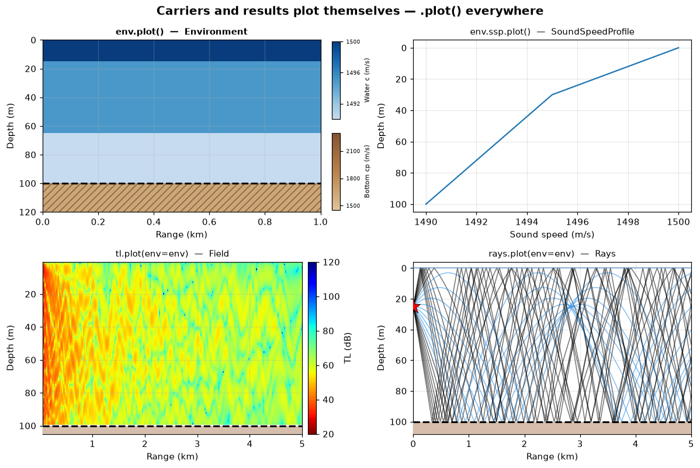
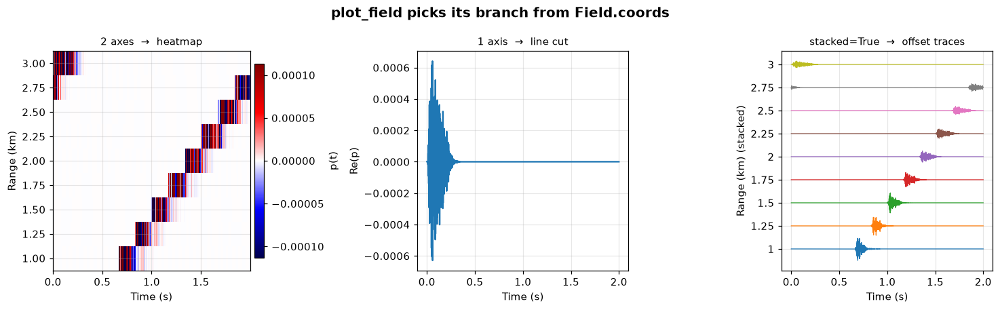
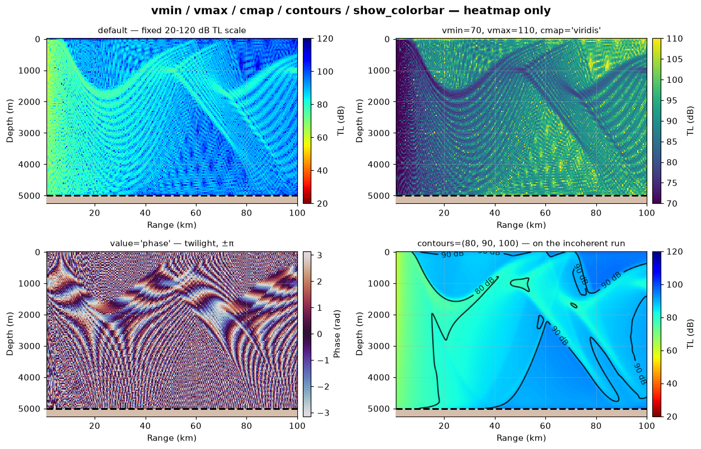
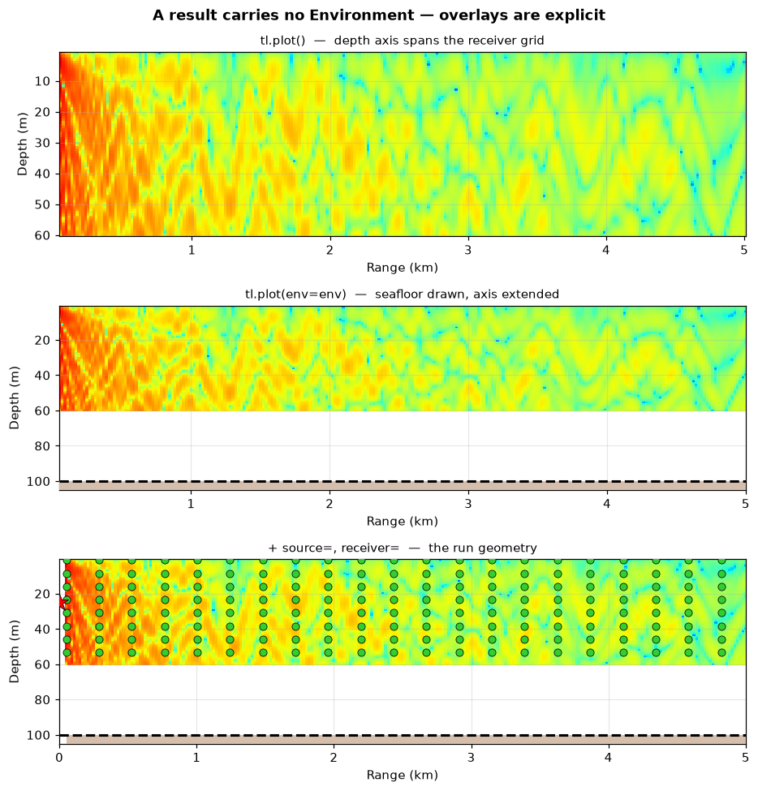
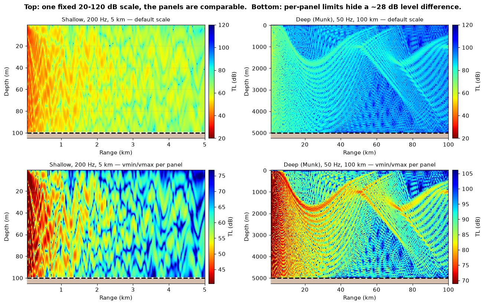
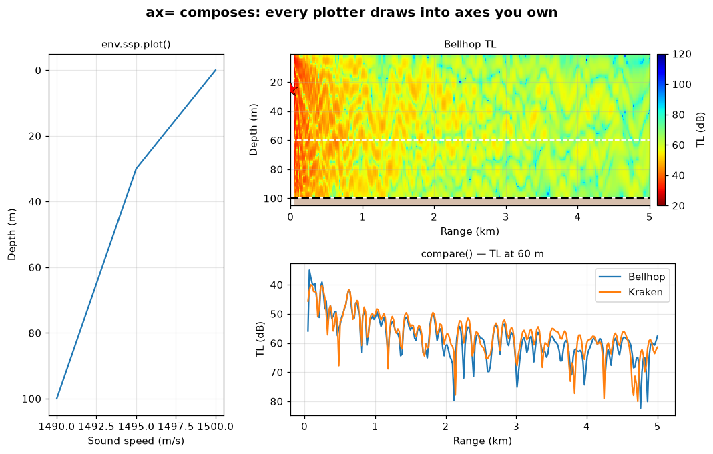
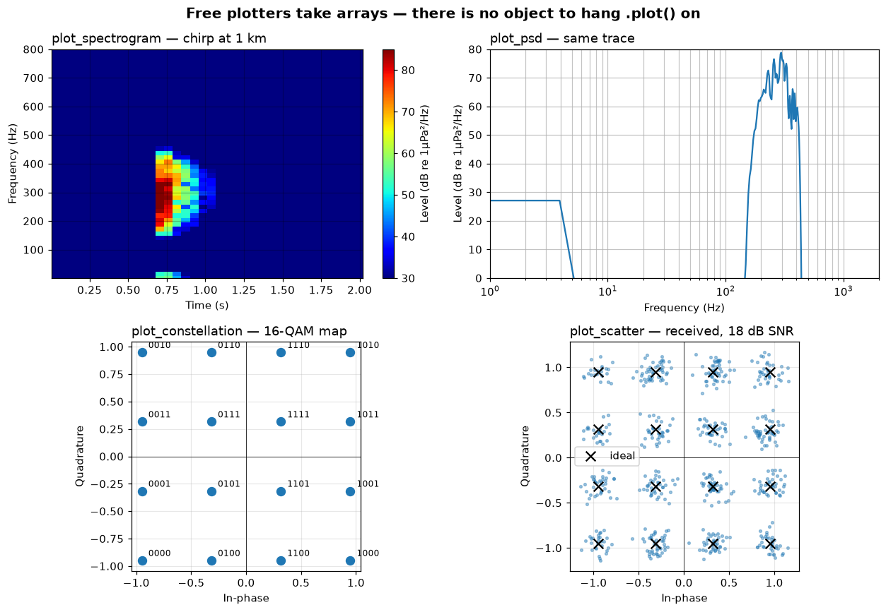

# Plotting — one convention, one workhorse

> `uacpy.plot` · 50 public plotters · every result and every drawable carrier
> renders itself with `.plot()`

There are two halves to the plotting surface. Anything that is a uacpy object
draws itself — `result.plot()`, `env.plot()`, `env.ssp.plot()` — so you never
have to remember which function goes with which type. Anything that is *not* an
object, because it is a pair of NumPy arrays coming out of a DSP routine, gets a
free plotter: `plot_spectrogram(f, t, Sxx)`.

Every plotter returns `(fig, ax)` — `(fig, axes)` for the multi-panel ones —
takes `title=`, and, if it draws on a single axes, takes `ax=`, so any of them
can be dropped into a panel of a figure you built yourself. (The two animation
helpers are the exceptions: `animate_field` returns a `FuncAnimation` and
`save_animation` returns the path it wrote.)

---

## 1. The convention: everything plots itself

```python
import uacpy
```

`uacpy.plot` is the whole surface. It is an attribute alias for
`uacpy.visualization.plots`, so use `uacpy.plot.plot_field(...)` after
`import uacpy`, or import the name directly from
`uacpy.visualization` — `from uacpy.plot import plot_field` raises
`ModuleNotFoundError`, because `uacpy.plot` is not a module path. Four names are
also re-exported at the top level for convenience: `uacpy.plot_result`,
`uacpy.plot_field`, `uacpy.plot_overview`, `uacpy.compare_models`.



```python
env, source, receiver = shallow_water()
tl = Bellhop(n_beams=3000).run(env, source, receiver).to_db()
rays = Bellhop(n_beams=25, alpha=(-12.0, 12.0)).run(
    env, source, receiver, run_mode=RunMode.RAYS)

fig, axes = plt.subplots(2, 2, figsize=(11.0, 7.4))
env.plot(ax=axes[0][0], title='env.plot()  —  Environment')
env.ssp.plot(ax=axes[0][1], title='env.ssp.plot()  —  SoundSpeedProfile')
tl.plot(env=env, ax=axes[1][0], title='tl.plot(env=env)  —  Field')
rays.plot(env=env, ax=axes[1][1], show_receivers=False, show_legend=False,
          title='rays.plot(env=env)  —  Rays')
```

### Results

`Result.plot(**kwargs)` forwards to **`plot_result`**, which dispatches on type
and forwards the rest of your keywords to the plotter it picked:

| Result | `.plot()` draws | Underlying plotter |
|---|---|---|
| `Field` | heatmap / line cut / stacked traces | `plot_field` (public) |
| `ResultStack[Field]` | one titled panel per slab | `_plot_field_stack` |
| `Rays` | the ray fan, coloured by boundary interaction | `_plot_rays` |
| `Arrivals` | amplitude-vs-delay stems | `_plot_arrivals` |
| `Modes` | the depth eigenfunctions ψ(z) | `_plot_mode_functions` |
| `ReflectionCoefficient` | \|R(θ)\| (and phase with `show_phase=True`) | `_plot_reflection_coefficient` |
| `Covariance` | the CSDM as an image | `_plot_covariance` |
| `Replicas` | the replica field | `_plot_replicas` |

Only `plot_field` is public in that list. The other seven are single-view
renderers with exactly one caller each, so they live behind the `.plot()` they
implement; two *alternate* views of `Modes` that `.plot()` does not give you —
`plot_mode_wavenumbers` and `plot_modes_heatmap` — are public, because there is
no other way to reach them.

### Carriers

Carriers are not results, but the drawable ones follow the same convention:

| Carrier | `.plot()` draws |
|---|---|
| `Environment` | water column + seafloor cross-section, with optional `source=` / `receiver=` |
| `SoundSpeedProfile` | c(z), one line per range column |
| `Bathymetry` | seafloor depth vs range (axis pointing down) |
| `Altimetry` | sea-surface height vs range (axis pointing up) |
| `Absorption` | α(f) in dB/km, log-log — **takes `frequencies` as a required argument**, because absorption *is* a function of frequency |

`Bottom.plot()` and `Surface.plot()` deliberately **do not exist**. A seabed
cross-section needs to know where the seafloor is, and that lives in
`env.bathymetry`, not in the `Bottom` — a `Bottom` on its own has nothing to
draw itself against. Use [`plot_bottom_properties(env)`](environment.md)
instead, which gives you a small-multiples panel per geoacoustic property
(cp, cs, ρ, αp, αs) — strictly more than `env.plot()`'s cp-only view.

`Source` and `Receiver` have no `.plot()` for the same reason: they are geometry
to be drawn *over* something. Pass them as `source=` / `receiver=` to a plotter
that has a cross-section (§3).

---

## 2. `plot_field` in depth

`plot_field` is the workhorse — every TL image, every range cut, every waterfall
in this documentation goes through it.

```python
plot_field(field, ax=None, *, env=None, source=None, receiver=None,
           value=None, vmin=None, vmax=None, cmap=None, title=None,
           label=None, figsize=(10, 5), stacked=False, stack_offset=None,
           show_colorbar=None, contours=None, **mpl_kw)
```

### 2.1 Three render branches, chosen from `coords`

`plot_field` does not ask what you want drawn; it reads `field.coords` and
picks:

| Surviving axes | Branch | Looks like |
|---|---|---|
| 2 | **heatmap** | `pcolormesh`; `(depth, range)` puts range on x and depth down the y axis |
| 1 | **line cut** | a `depth` axis goes on y pointing down; anything else on x, and a TL y axis is inverted so louder is up |
| 2, one of them `time`, `stacked=True` | **stacked traces** | the seismic waterfall: one offset trace per row |

So the way to control the picture is to slice the field first —
`.at()` / `.isel()` / `.max()` drop an axis into `.pinned`, which is what the
[results page](results.md) is about. One field, three branches:



```python
def _time_series():
    """``p(depth, range, time)`` — the field every render branch is drawn from."""
    env, _, _ = shallow_water()
    source = uacpy.Source(depths=25.0,
                          frequencies=np.arange(150.0, 450.1, 0.5))
    receiver = uacpy.Receiver(depths=CUT_DEPTH,
                              ranges=np.linspace(1000.0, 3000.0, 9))
    H = Bellhop(n_beams=3000).run(env, source, receiver,
                                  run_mode=RunMode.BROADBAND)
    _, waveform = lfm_chirp(150.0, 450.0, 0.04, 4000.0)
    return H.synthesize_time_series(waveform, 4000.0)

series = _time_series()
panel = series.isel(depth=0)     # coords {range, time}

fig, axes = plt.subplots(1, 3, figsize=(13.5, 4.2))
panel.plot(ax=axes[0],
           title="2 axes  →  heatmap")
panel.at(range=CUT_RANGE).plot(ax=axes[1],
                               title="1 axis  →  line cut")
panel.plot(stacked=True, ax=axes[2],
           title="stacked=True  →  offset traces")
```

A field with **three or more** surviving axes has no picture, and says so:

```
ConfigurationError: plot_field: cannot plot a 3-axis field (coords
['depth', 'range', 'frequency']); slice it first with .at(...) / .isel(...)
so 1 or 2 axes remain.
```

`stacked=True` on anything but a 2-D field carrying a `time` axis is rejected
the same way.

### 2.2 Keywords the selected branch cannot use are **rejected**

This is the part that surprises people, and it is deliberate.

```python
>>> tl.at(depth=60.0).plot(vmin=20)
ConfigurationError: plot_field: vmin= has no effect on a 1-D line cut
(coords ['range']). vmin=, vmax=, cmap=, show_colorbar=, contours= apply to
the 2-D heatmap, env=, source=, receiver= to a (depth, range) cross-section,
label= to the 1-D line cut, stack_offset= to stacked=True.
```

A colour limit on a line plot is not a harmless no-op — it means you believe you
are looking at a heatmap and you are not. Silently dropping it would let that
misunderstanding survive all the way into a figure you publish. So every knob is
owned by a branch, and passing one to a branch that cannot read it raises
`ConfigurationError` before any figure is created:

| Keyword | Valid on |
|---|---|
| `vmin`, `vmax`, `cmap`, `show_colorbar`, `contours` | the 2-D heatmap |
| `env`, `source`, `receiver` | a `(depth, range)` heatmap only — not *any* heatmap |
| `label` | the 1-D line cut (it is the legend entry) |
| `stack_offset` | `stacked=True` |
| `value`, `title`, `figsize`, `ax` | every branch |

Note the second row. `env=` keys on the **axes**, not just on the branch: a
2-D heatmap of `(range, time)` is still a heatmap, but there is no depth axis to
hang a seafloor on, so it rejects too, with a message naming the distinction:

```
ConfigurationError: plot_field: env= has no effect on a heatmap that is not a
(depth, range) cross-section (coords ['range', 'time']). …
```

### 2.3 `value=` — which number gets drawn

`value=` applies to every branch and picks what the field's complex pressure is
reduced to. It defaults to `'real'` for a time-series field and `'db'`
otherwise.

| `value` | Draws | Auto colour treatment (heatmap) |
|---|---|---|
| `'db'` | the dB view (TL for a pressure field) | fixed 20–120 dB scale (§4) |
| `'mag_db'` | 20·log10\|H\| = −TL, dB | TL colormap, autoscaled |
| `'mag'` | \|p\|, linear (complex fields only) | linear colormap (`seismic`), anchored at zero |
| `'phase'` | arg(p), radians (complex fields only) | `twilight`, fixed ±π |
| `'real'`, `'imag'` | Re(p) / Im(p) (`'imag'` complex only) | linear colormap (`seismic`), symmetric about zero; real time-domain data is clipped to ±RMS |



```python
env, source, receiver = deep_water()
model = Bellhop(n_beams=3000)
p = model.run(env, source, receiver)
incoherent = model.run(env, source, receiver,
                       run_mode=RunMode.INCOHERENT_TL)

p.plot(env=env, ax=axes[0][0],
       title='default — fixed 20-120 dB TL scale')
p.plot(env=env, ax=axes[0][1], vmin=70.0, vmax=110.0, cmap='viridis',
       title="vmin=70, vmax=110, cmap='viridis'")
p.plot(env=env, ax=axes[1][0], value='phase',
       title="value='phase' — twilight, ±π")
incoherent.plot(env=env, ax=axes[1][1], contours=(80.0, 90.0, 100.0),
                title='contours=(80, 90, 100) — on the incoherent run')
```

Two things worth reading off that figure. Narrowing `vmin`/`vmax` to the range
the data actually occupies is how you see convergence-zone structure that the
fixed scale compresses — it is the legitimate reason to override it. And
`contours=` is drawn on the **coherent** field only if you enjoy contouring
speckle: interference nulls put a 90 dB level everywhere. Contours read on a
smooth field, which in practice means an incoherent run, so that is the panel
they are shown on.

---

## 3. Overlays: `env=`, `source=`, `receiver=`

**A `Result` carries no `Environment`, `Source` or `Receiver`.** It knows its
model, its backend, its provenance and its frequencies, and nothing about the
water it ran through. That is a deliberate design choice — a result is a value,
not a scene graph — and it has one visible consequence: a TL plot with no `env=`
spans exactly the receiver grid and draws no seabed. That is correct, not a bug.



```python
env, source, _ = shallow_water()
receiver = uacpy.Receiver(depths=np.linspace(1.0, 60.0, 80),
                          ranges=np.linspace(50.0, 5000.0, 250))
tl = Bellhop(n_beams=3000).run(env, source, receiver).to_db()

tl.plot(ax=axes[0], show_colorbar=False,
        title='tl.plot()  —  depth axis spans the receiver grid')
tl.plot(env=env, ax=axes[1], show_colorbar=False,
        title='tl.plot(env=env)  —  seafloor drawn, axis extended')
tl.plot(env=env, source=source, receiver=receiver, ax=axes[2],
        show_colorbar=False,
        title='+ source=, receiver=  —  the run geometry')
```

The receiver grid stops at 60 m in a 100 m channel, which makes the difference
plain:

- **top** — the depth axis runs 1–60 m. Everything drawn is data.
- **`env=`** — the axis is extended past the seafloor (to 105 m, 5 % headroom
  below it), the seabed line is drawn and the sediment below it filled. A
  range-dependent bathymetry is clipped to the plotted range span, so a long
  environment does not stretch a short plot.
- **`source=` / `receiver=`** — the run geometry. The receiver lattice is
  decimated (≤ 20 range dots × 10 depth dots) so a dense grid does not paint the
  panel solid. The source is drawn at **r = 0** by the package convention that
  range is measured from it, and the x axis widens to keep it on screen — which
  is why the last panel starts at 0 km while the data starts at 50 m.

All three apply to a `(depth, range)` cross-section only (§2.2). `env=` is
accepted by every view that has one — `plot_field`, `plot_signal_excess`,
`plot_detection_probability`, `compare_models`, `animate_field`,
`plot_time_snapshots` and the ray plotter behind `rays.plot()`. `source=` /
`receiver=` are `plot_field`'s, `env.plot()`'s and `plot_overview`'s; the ray
plotter draws both by default instead, and turns them off with
`show_source=False` / `show_receivers=False`. Ask for an overlay anywhere else —
`arrivals.plot(env=env)`, a `(range, time)` heatmap — and you get a
`ConfigurationError` saying so rather than a silently ignored keyword.

---

## 4. The fixed TL colour scale

TL heatmaps default to **`vmin=20`, `vmax=120` dB** — a fixed scale, not one
derived from the data. `_TL_LIMITS` in
[`uacpy/visualization/plots/_common.py`](../../uacpy/visualization/plots/_common.py)
is the single definition; `plot_field(value='db')` and `compare_models` both
read it.



```python
env_s, src_s, rcv_s = shallow_water()
env_d, src_d, rcv_d = deep_water()
shallow = Bellhop(n_beams=3000).run(env_s, src_s, rcv_s).to_db()
deep = Bellhop(n_beams=3000).run(env_d, src_d, rcv_d).to_db()

for col, (field, env, name) in enumerate(
        [(shallow, env_s, 'Shallow, 200 Hz, 5 km'),
         (deep, env_d, 'Deep (Munk), 50 Hz, 100 km')]):
    field.plot(env=env, ax=axes[0][col],
               title=f'{name} — default scale')
    lo, hi = np.nanpercentile(field.data, [2.0, 98.0])
    field.plot(env=env, ax=axes[1][col], vmin=lo, vmax=hi,
               title=f'{name} — vmin/vmax per panel')
```

The top row says something true: the deep-water field at 100 km is roughly
28 dB quieter than the shallow-water field at 5 km, and you can read that
straight off the colour. The bottom row autoscales each panel to its own 2nd–98th
percentile. Both panels now look equally colourful, the level difference has
vanished, and the two colourbars are the only warning — which nobody reads.
A colour scale that changes per panel turns a comparison into a decoration.

The corollaries:

- **The default is comparable across models, frequencies and runs.** Two TL
  images produced a week apart can be put side by side.
- **`compare_models` shares one colourbar** across its grid, and warns if the
  fields' depth or range axes do not match, because a shared scale over
  different sample grids is misleading in a subtler way.
- **Override for structure, not for prettiness.** Narrow the window when the
  variation you are after occupies a fraction of the 100 dB range, as in §2.3 —
  and then say so on the figure.
- **No-data cells are `NaN`, not 120 dB.** Bellhop cells no ray reached render
  as the axes background, so they read as absent rather than as very quiet.

---

## 5. Composition with `ax=`

Every single-axes plotter takes `ax=`. Hand it one and it draws into your axes
and returns `(fig, ax)` for that figure; hand it nothing and it makes its own of
`figsize=`.



```python
env, source, receiver = shallow_water()
bellhop = Bellhop(n_beams=3000).run(env, source, receiver).to_db()
kraken = Kraken().run(env, source, receiver).to_db()

fig = plt.figure(figsize=(11.0, 6.4))
gs = fig.add_gridspec(2, 2, width_ratios=[1.0, 2.2],
                      hspace=0.38, wspace=0.24)

env.ssp.plot(ax=fig.add_subplot(gs[:, 0]), title='env.ssp.plot()')
ax_tl = fig.add_subplot(gs[0, 1])
bellhop.plot(env=env, source=source, ax=ax_tl, title='Bellhop TL')
ax_tl.axhline(CUT_DEPTH, color='white', lw=1.2, ls='--')

uacpy.plot.compare(
    [bellhop.at(depth=CUT_DEPTH), kraken.at(depth=CUT_DEPTH)],
    labels=['Bellhop', 'Kraken'], ax=fig.add_subplot(gs[1, 1]),
    title=f'compare() — TL at {CUT_DEPTH:g} m')
```

Three rules make this work:

**Depth-axis inversion is idempotent.** `Axes.invert_yaxis` *toggles*, so a
plotter that called it unconditionally would flip the axis back to
increasing-upward the second time you drew into the same axes. Every uacpy
plotter goes through one helper that inverts only if the axis is not already
inverted, so overlaying two fields — or a field and an SSP — on one `ax` is
safe in any order and any number of times.

**`figsize=` is ignored when you pass `ax=`.** The figure already exists. Size it
yourself in `plt.subplots(figsize=…)` or `plt.figure(figsize=…)`.

**Figure furniture is only drawn by whoever owns the figure.** The grey
provenance footnote — `Model: Bellhop — Michael B. Porter, Acoustics Toolbox`,
plus a `Data:` block listing the sources of a fetched `env` — is added only when
the plotter created the figure. In a composed figure it is your call where the
credit goes, so nothing is stamped on top of your layout. (Colorbars are *not*
figure furniture: they still get drawn per axes. Pass `show_colorbar=False` on
the panels that should share one.)

A handful of plotters are **figure-level** and take no `ax=`, because one axes
is not enough to hold what they draw: `compare_models`,
`plot_bottom_properties`, `plot_overview`, `plot_impulse_response_info`,
`plot_time_snapshots` (multi-panel), `plot_result` (it forwards to whichever
plotter fits) and `save_animation` (it writes a file). Two plotters take a
**2-tuple** of axes instead: `plot_frf` and `plot_channel`, which are inherently
two stacked panels. `Field.plot_transfer_function` does the same via
`axes=(ax_mag, ax_phase)`.

### `Field`'s two rendering shortcuts

Beyond `.plot()`, a broadband `Field` carries two methods that render a
reduce-then-plot view of one receiver cell:

| Method | Draws |
|---|---|
| `H.plot_transfer_function(axes=None, …)` | 20·log10\|H\| over arg(H), two stacked panels sharing the frequency axis |
| `H.plot_impulse_response(ax=None, window='hann', …)` | the band-limited `p(t)` that `H` inverts to |

Both squeeze singleton axes and require the field to reduce to a single
`(depth, range)` cell — `H.at(depth=…, range=…).plot_transfer_function()`.

---

## 6. Free plotters: arrays in, no object

The DSP, comms and noise routines return plain arrays or small result tuples,
not uacpy objects — there is nothing to hang a `.plot()` on. Those get a free
plotter that consumes exactly what the analysis function produced.



```python
rng = np.random.default_rng(0)
sample_rate = 4000.0
trace = _time_series().isel(depth=0).at(range=1000.0)
# Model pressure is referenced to a unit source at 1 m; scale it to a
# 170 dB re 1 µPa @ 1 m projector so the dB axes read physically.
p_t = 316.0 * np.asarray(trace.data, dtype=float)

f_s, t_s, S = spectrogram(p_t, sample_rate, nperseg=256)
f_p, P = psd(p_t, sample_rate, nperseg=1024)

mod = Modulator('16qam')
bits = rng.integers(0, 2, size=4 * 600)
symbols = awgn(mod.modulate(bits), 18.0, rng=rng)

uacpy.plot.plot_spectrogram(f_s, t_s, S, ax=axes[0][0], vmin=30, vmax=85,
                            ymax=800.0,
                            title='plot_spectrogram — chirp at 1 km')
uacpy.plot.plot_psd(f_p, P, ax=axes[0][1], ymin=0, ymax=80,
                    title='plot_psd — same trace')
uacpy.plot.plot_constellation(constellation('16qam'), ax=axes[1][0],
                              scheme='16qam',
                              title='plot_constellation — 16-QAM map')
uacpy.plot.plot_scatter(symbols, ax=axes[1][1],
                        ideal=constellation('16qam'),
                        title='plot_scatter — received, 18 dB SNR')
```

The pairing is one-to-one and mechanical: `spectrogram` → `plot_spectrogram`,
`psd` → `plot_psd`, `cwt` → `plot_cwt`, `fk_transform` → `plot_fk`,
`ambiguity_function` → `plot_ambiguity`. Unpack the result and pass it through.

Two conventions to know before reading the levels:

- **dB references are the plotter's, not the data's.** The acoustic plotters
  take `ref=1e-6` (1 µPa) and their default axis limits assume ocean-ambient
  levels. A model field is pressure for a *unit* source at 1 m, not the pressure
  at a real projector — multiply by the source amplitude in Pa (above, 316 Pa
  ≈ 170 dB re 1 µPa @ 1 m) before reading a dB axis, or the trace sits below
  `ymin` and the panel looks empty.
- **`draw_sound_cone` and `draw_slowness_line` are overlays, not plots.** They
  take an existing `ax` as their first positional argument and annotate an f-k
  or τ-p panel you already drew.

The science behind these lives on the pages that own it:
[signal processing](signal.md) for the time-frequency and transform plotters,
[array processing](arrays.md) for `plot_angular_spectrum`,
[communications](comms.md) for the constellation/eye/BER family,
[noise](noise.md) for Wenz and weighting, [sonar](sonar.md) for signal excess,
detection probability and the ROC.

---

## 7. Reference — every public plotter

All 50 plotters in `uacpy.plot.__all__` — the 8 remaining names in `__all__`
are the submodules themselves. **ax** marks a single-axes plotter you can
compose with. Every entry takes `title=` except `plot_result` (it forwards
yours) and the two `draw_*` overlays; every entry takes
`figsize=` except `plot_result`, `animate_field`, the two `draw_*` overlays and
`plot_time_snapshots`, which sizes itself from `figsize_per_panel=` instead.

### Fields and results

| Plotter | ax | Draws |
|---|---|---|
| `plot_result(result, env=None, **kw)` | — | type-dispatcher behind every `Result.plot()` |
| `plot_field(field, ax=None, …)` | ✓ | the workhorse — §2 |
| `compare(fields, labels=None, ax=None, value='db')` | ✓ | overlay several 1-D sliced fields on one axes |
| `compare_models(fields, labels=None, env=None, ncols=None, contours=None)` | — | side-by-side heatmap grid, one shared colourbar |
| `plot_signal_excess(field, ax=None, env=None, …)` | ✓ | diverging SE heatmap + the SE = 0 detection boundary → [sonar](sonar.md) |
| `plot_detection_probability(field, ax=None, env=None, …)` | ✓ | `P_D` on a fixed [0, 1] scale with labelled contours → [sonar](sonar.md) |
| `animate_field(field, env=None, fps=30, …)` | ✓ | a `FuncAnimation` sweeping the time axis |
| `save_animation(field, path, fps=20, …)` | — | render that animation to GIF/MP4 (writer from the suffix) |
| `plot_time_snapshots(fields, times_s, env=None, …)` | — | per-model rows × per-time columns of `p(d, r, t)` |

### Rays and modes

| Plotter | ax | Draws |
|---|---|---|
| `plot_mode_wavenumbers(modes, ax=None)` | ✓ | `Re(k_m)` vs mode index, with `Im(k_m)` when non-zero → [Kraken](../models/kraken.md) |
| `plot_modes_heatmap(modes, n_modes=None, ax=None, …)` | ✓ | ψ_m(z) as a (depth, mode index) image |

Ray fans, arrival stems, mode functions, covariance, replicas and reflection
coefficients have no public free plotter — they are reached through
`result.plot()` (§1).

### Environment

| Plotter | ax | Draws |
|---|---|---|
| `plot_bottom_properties(env, properties=None, n_range=240, n_depth=200)` | — | small-multiples seabed cross-sections, one panel per property → [environment](environment.md) |
| `plot_absorption(frequencies, absorption=None, ax=None, model=None, label=None)` | ✓ | α(f) in dB/km, log-log; `absorption.plot(frequencies)` is the object form |

### Maps

| Plotter | ax | Draws |
|---|---|---|
| `plot_bathymetry_map(lats, lons, depth, transect=None, relief=True, …)` | ✓ | a fetched bathymetry grid as a geographic map → [external data](data.md) |
| `plot_overview(env, map_args, tl=None, source=None, receiver=None, …)` | — | one-call composite: map + TL + environment cross-section |
| `plot_sea_ice_map(grid, hemi='N', transect=None, …)` | ✓ | sea-ice concentration on a polar map |

### Signal processing

Every one consumes the output of the same-named routine in
`uacpy.acoustic_signal` → [signal processing](signal.md).

| Plotter | ax | Consumes |
|---|---|---|
| `plot_psd(frequencies, psd_linear, ax=None, ref=1e-6, …)` | ✓ | `psd` — Welch PSD, dB |
| `plot_ppsd(result, ax=None, …)` | ✓ | `ppsd` — 2-D histogram of PSD levels |
| `plot_sel(sel_pa2s, bands, ax=None, band_type='third_octave', …)` | ✓ | `sel` — per-band sound exposure level |
| `plot_band_levels(centers, levels, ax=None, …)` | ✓ | `decidecade_band_levels` — bar plot |
| `plot_spectrogram(frequencies, times, Sxx, ax=None, ymin=1, vmin=0, vmax=200, …)` | ✓ | `spectrogram` |
| `plot_constant_q_spectrogram(frequencies, times, power, ax=None, scaling='spectrum', …)` | ✓ | `constant_q_spectrogram` (log frequency) |
| `plot_constant_q_psd(frequencies, power, ax=None, scaling='spectrum', …)` | ✓ | `constant_q_psd` |
| `plot_constant_q_ppsd(result, ax=None, scaling='spectrum', …)` | ✓ | `probabilistic_constant_q` |
| `plot_cwt(frequencies, W, sample_rate, ax=None, …)` | ✓ | `cwt` — scalogram \|W\| |
| `plot_wigner_ville(frequencies, times, W, ax=None, …)` | ✓ | `wigner_ville` |
| `plot_cepstrum(c, ax=None, sample_rate=None, …)` | ✓ | `cepstrum` vs quefrency |
| `plot_fk(frequencies, wavenumbers, power, ax=None, sound_speed=None, …)` | ✓ | `fk_transform` — f-k power panel, dB |
| `plot_taup(slownesses, taus, taup, ax=None, sound_speed=None, …)` | ✓ | `taup_transform` |
| `plot_radon(moveout, taus, R, ax=None, kind='linear', …)` | ✓ | `radon_transform` |
| `draw_sound_cone(ax, f_max, k_max, sound_speed, …)` | overlay | the `f = c·k/2π` cone on an f-k axis |
| `draw_slowness_line(ax, tau_max, sound_speed, …)` | overlay | `p = ±1/c` on a τ-p axis |
| `plot_ambiguity(delays_s, doppler_hz, chi, ax=None, …)` | ✓ | `ambiguity_function` — range-Doppler surface |
| `plot_angular_spectrum(angles_deg, spectrum, ax=None, db=True, …)` | ✓ | a Bartlett / MVDR / MUSIC spectrum → [arrays](arrays.md) |
| `plot_frf(frequencies, tf, ax=None, tag='', …)` | 2-tuple | `FRF` — magnitude (dB) over phase (deg) |
| `plot_coherence(frequencies, coh, ax=None, …)` | ✓ | `FRF` coherence vs frequency |
| `plot_impulse_response_info(Minfo, Vinfo, g)` | — | LS-FIR diagnostics: information matrix, vector, impulse response |

### Communications

→ [communications](comms.md).

| Plotter | ax | Draws |
|---|---|---|
| `plot_channel(h, sample_rate, ax=None, …)` | 2-tuple | \|h[n]\| and \|H(f)\| side by side |
| `plot_subcarriers(channel, n_subcarriers, ax=None, …)` | ✓ | channel magnitude across the OFDM subcarriers |
| `plot_constellation(constellation, ax=None, scheme='', annotate=True, …)` | ✓ | the ideal Gray-labelled constellation |
| `plot_scatter(symbols, ax=None, ideal=None, …)` | ✓ | received symbols, optionally over the ideal points |
| `plot_eye_diagram(signal, samples_per_symbol, ax=None, n_symbols=2, …)` | ✓ | overlaid symbol windows |
| `plot_convergence(mse, ax=None, label=None, …)` | ✓ | equaliser learning curve (MSE vs symbol, dB) |
| `plot_sync_metric(metric, ax=None, threshold=None, …)` | ✓ | synchronisation metric vs sample index |
| `plot_doppler_ambiguity(scales, peak_metric, ax=None, …)` | ✓ | peak correlation vs Doppler scale |
| `plot_ber_curve(ebn0_db, ber_measured, ax=None, scheme=None, …)` | ✓ | measured BER vs Eb/N0, with the theory curve when `scheme=` is given |

### Noise and sonar

| Plotter | ax | Draws |
|---|---|---|
| `plot_wenz(wenz, ax=None, show_components=True, …)` | ✓ | a Wenz ambient-noise spectrum and its components → [noise](noise.md) |
| `plot_weighting(group, ax=None, frequency=None, …)` | ✓ | marine-mammal auditory weighting curve(s) |
| `plot_source_level(frequency, level_db, ax=None, label=None, …)` | ✓ | a ship source-level spectrum |
| `plot_roc(deflection=None, ax=None, pfa=None, pd=None, …)` | ✓ | the ROC curve, `P_D` vs log `P_F` → [sonar](sonar.md) |

---

## 8. Gotchas

**`from uacpy.plot import …` does not work.** `uacpy.plot` is an attribute
alias for `uacpy.visualization.plots`, not an importable path. Use
`import uacpy` then `uacpy.plot.plot_field(...)`, or
`from uacpy.visualization import plot_field`.

**Slice, then plot.** There is no `depth=`/`range=` selection keyword on
`plot_field`. The field decides its own picture from `coords`, so the way to ask
for a cut is `field.at(depth=60.0).plot()`, not a plotter argument.

**A rejected keyword leaves no figure behind.** Branch validation happens before
anything is created, and the `plot_*` functions are wrapped in a guard that
closes any figure a failed call opened. Nothing half-drawn survives in
`plt.get_fignums()`.

**`ConfigurationError` is what a bad plot call raises**, including for degenerate
input (empty or mismatched-length arrays, wrong shapes, a missing arrival key)
that would otherwise leak a bare `IndexError`, `KeyError` or `ValueError` from
matplotlib. That same guard does the relabelling. A genuine wrong-type call still raises `TypeError` — that is a bug
in the caller, not bad input.

**Importing `uacpy.visualization` does not touch `matplotlib.rcParams`.** Your
own style sheet survives. Anything you want globally, set yourself.

**`env=` extends the depth axis, it does not clip the data.** If your receiver
grid reaches below the seafloor, those values are still drawn — the seabed fill
just covers them. That is a sign of a receiver grid that needs fixing, not a
plotting artefact.

**Every figure on this page is generated by committed code.** It is
[`docs/figure_scripts/plotting.py`](../figure_scripts/plotting.py); the snippets
above are that code. Regenerate with:

```bash
python docs/generate_model_figures.py plotting
```

---

**See also:** [Results](results.md) — the slicing that produces each render
branch · [Environment](environment.md) · [Source and receiver](source-receiver.md) ·
[Signal processing](signal.md) · [Array processing](arrays.md) ·
[Communications](comms.md) · [Noise](noise.md) · [Sonar](sonar.md) ·
[External data](data.md) · [documentation index](../README.md)
