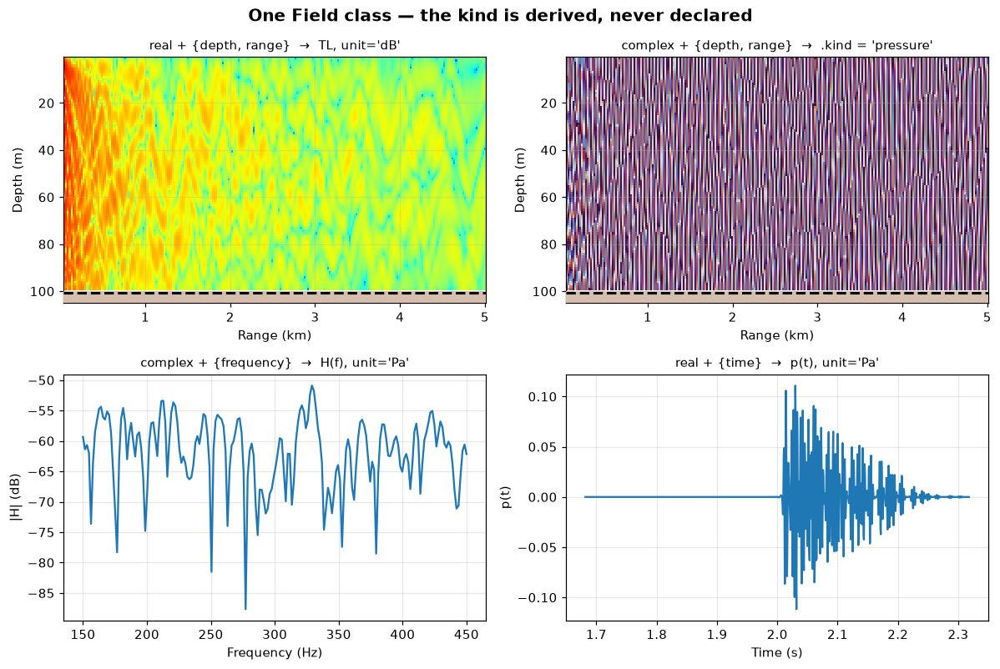
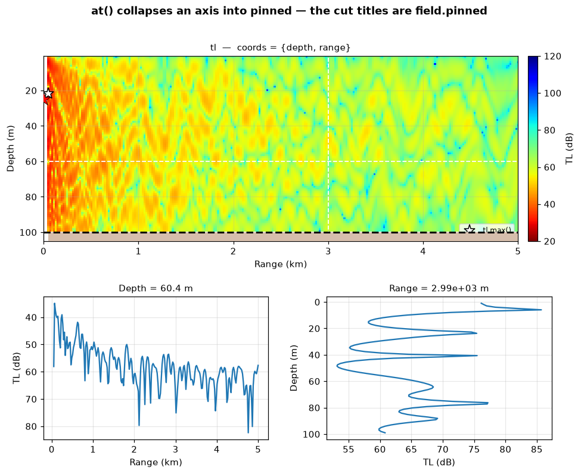
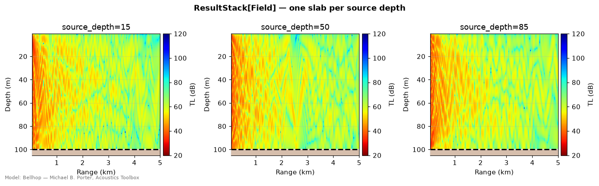
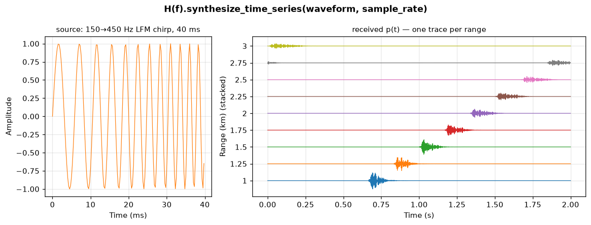
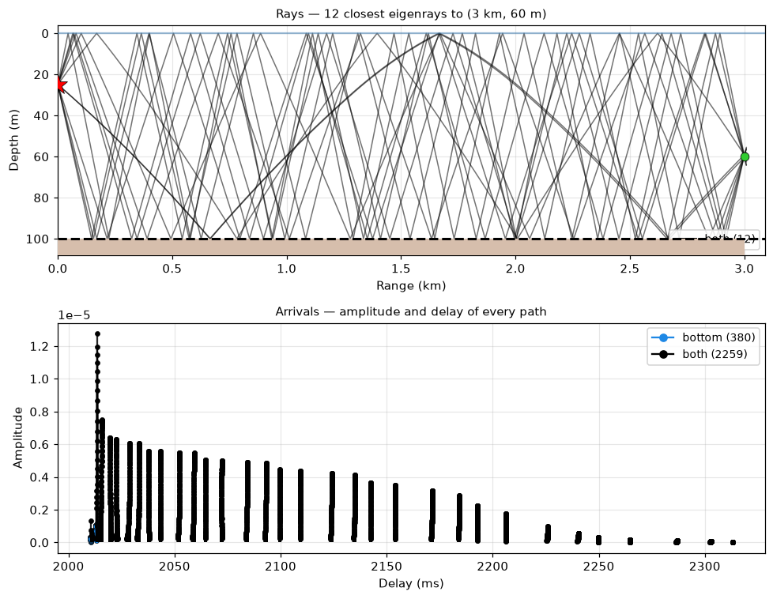
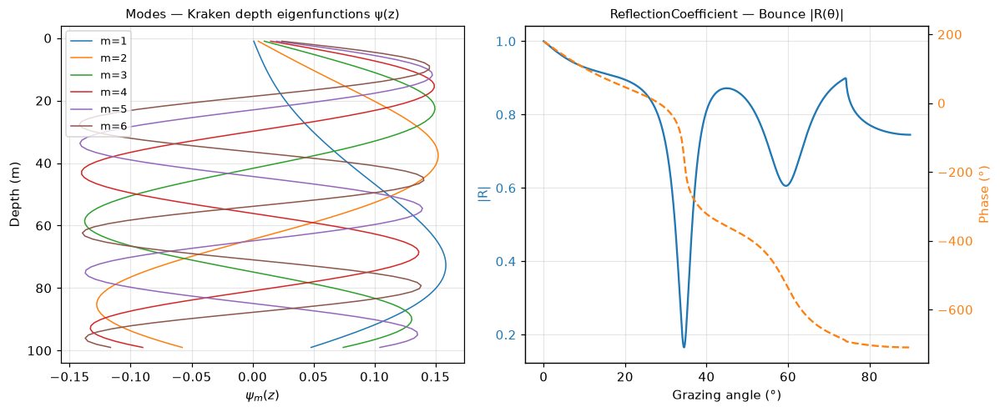

# Results — what a model gives you back

> `uacpy.core.results` · every public name re-exported on `uacpy.*`
> · `Field` · `Rays` · `Arrivals` · `Modes` · `Covariance` · `Replicas`
> · `ReflectionCoefficient` · `ResultStack`

Every model in the package has the same shape: three carriers in
([environment](environment.md), [source and receiver](source-receiver.md)),
one **result** out. This page is about that result — what type you get for
which `RunMode`, how to slice it down to the number you actually wanted, and
what it knows about the run that produced it.

The organising idea is that a result is **data plus identity, and nothing
else**. It carries its values, its axes, and the provenance of the run. It does
not carry the environment, the source or the receiver — see
[§8](#8-identity-and-provenance) for why that is deliberate.

---

## 1. The eight result types

```python
from uacpy.models import Bellhop, RunMode
result = Bellhop().run(env, source, receiver, run_mode=RunMode.COHERENT_TL)
```

| Type | `RunMode` that produces it | Payload | Models |
|---|---|---|---|
| `Field` | `COHERENT_TL`, `INCOHERENT_TL`, `SEMICOHERENT_TL`, `BROADBAND`, `TIME_SERIES` | gridded values + named axes | [Bellhop](../models/bellhop.md), [Kraken](../models/kraken.md), [Scooter](../models/scooter.md), [RAM](../models/ram.md), [SPARC](../models/sparc.md), [OAST / OASP](../models/oases.md) |
| `Rays` | `RAYS`, `EIGENRAYS` | list of ray polylines | [Bellhop](../models/bellhop.md) |
| `Arrivals` | `ARRIVALS` | flat list of arrival events | [Bellhop](../models/bellhop.md) |
| `Modes` | `MODES` | `k` (wavenumbers) + `phi` (mode shapes) | [Kraken](../models/kraken.md) |
| `ReflectionCoefficient` | `REFLECTION` | `R(θ)` magnitude + phase | [Bounce](../models/bounce.md), [OASR](../models/oases.md) |
| `Covariance` | `COVARIANCE` | `C(f, i, j)` across an array | [OASN](../models/oases.md) |
| `Replicas` | `REPLICA` | Green's functions per candidate position | [OASN](../models/oases.md) |
| `ResultStack` | any of the above, with several source depths | a list of slabs + the coordinate they vary along | [Bellhop](../models/bellhop.md), [`run_parallel`](utilities.md) |

Not every model supports every mode; ask the model rather than guessing:

```python
>>> [m.name for m in Bellhop().supported_modes]
['COHERENT_TL', 'INCOHERENT_TL', 'SEMICOHERENT_TL', 'RAYS', 'EIGENRAYS',
 'ARRIVALS', 'BROADBAND', 'TIME_SERIES']
>>> Bellhop().supports_mode(RunMode.MODES)
False
```

Every one of these types prints a one-line summary of itself, which is the
fastest way to see what you are holding:

```
Field(kind='pressure', model='Bellhop', f=200 Hz, axes=(depth, range))
Rays(model='Bellhop', f=200 Hz, n_eigenrays=2639)
Arrivals(model='Bellhop', f=200 Hz, n_arrivals=2639)
Modes(model='Kraken', f=200 Hz, n_modes=14, n_z=101)
ReflectionCoefficient(model='Bounce', f=200 Hz, n_θ=571, narrowband)
ResultStack[Field](n_slabs=3, source_depth=[15.0, 50.0, 85.0])
```

---

## 2. `Field` — one container whose meaning is derived

There is exactly one gridded result class. Transmission loss, complex
pressure, a broadband transfer function and a time series are **not** four
types: they are four states of `Field`, and `.kind` reads that state off the
data rather than off a flag someone set.

```
.kind  ←  ( dtype of .data ,  keys of .coords )
```

| `.data` dtype | `.coords` contains | `.kind` | Physical meaning |
|---|---|---|---|
| complex | a `frequency` axis | `'transfer_function'` | `H(f)` |
| real | a `time` axis | `'time_series'` | `p(t)` |
| complex | neither | `'pressure'` | complex pressure `p` |
| real | neither | `'tl'` | transmission loss, dB |

The rule is evaluated **in that order**, which settles the two mixed cases:
a *real* field with a frequency axis is `'tl'` (a dB spectrum, not a transfer
function — it has no phase to invert), and a *complex* field with a time axis
is `'pressure'`.

Nothing about dimensionality enters into it. `tl.at(depth=20)` is a 1-D range
cut and still `'tl'`; `tl.max()` is a scalar and still `'tl'`.



All four panels above are the same class:

```python
env, source, receiver = shallow_water()
pressure = Bellhop(n_beams=3000).run(env, source, receiver)

source_bb = uacpy.Source(depths=25.0,
                         frequencies=np.linspace(150.0, 450.0, 192))
point = uacpy.Receiver(depths=60.0, ranges=3000.0)
H = Bellhop(n_beams=3000).run(env, source_bb, point,
                              run_mode=RunMode.BROADBAND)

spectrum = H.isel(depth=0, range=0)
trace = H.to_time_trace()

pressure.to_tl().plot(env=env)          # real    + {depth, range} → 'tl'
pressure.plot(env=env, value='phase')   # complex + {depth, range} → 'pressure'
spectrum.plot(value='mag_db')           # complex + {frequency}    → 'transfer_function'
trace.plot()                            # real    + {time}         → 'time_series'
```

The consequence worth internalising: **operations that change the dtype or the
axes change the kind**. `pressure.to_tl()` turns `'pressure'` into `'tl'`.
`H.at(frequency=300)` drops the frequency axis and turns `'transfer_function'`
into `'pressure'`. `H.to_time_trace()` produces `'time_series'`. You never
declare any of it.

### Canonical layouts

`data.shape` follows the insertion order of `coords`, and every uacpy producer
uses the same order: `source_depth → depth → range → frequency` (or `time`).

| `coords` | `.kind` | Produced by |
|---|---|---|
| `{depth, range}`, complex | `'pressure'` | `COHERENT_TL` from every field model |
| `{depth, range}`, real | `'tl'` | Kraken `INCOHERENT_TL`, OAST `COHERENT_TL`, any `.to_tl()` |
| `{depth, range, frequency}` | `'transfer_function'` | `BROADBAND` |
| `{depth, range, time}` | `'time_series'` | `TIME_SERIES` (natively from [SPARC](../models/sparc.md)) |
| `{time}` | `'time_series'` | `to_time_trace()` on one cell |
| `{source_depth, depth, range}` | `'pressure'` | a replica bank for [matched-field processing](sonar.md) |

Depths and ranges are **metres** throughout; kilometres appear only on plot
axes. See [units and conventions](../README.md#conventions).

---

## 3. Slicing — `at`, `isel`, `eval`, `max`, and `.pinned`

A model hands you a grid; you almost always want a cut through it. All four
slicers share one rule:

> **A collapsed axis is dropped from `coords` and its value is recorded in
> `pinned`.**

That is the whole mechanism. `coords` is what remains — the axes the field is
still a function of. `pinned` is the running record of where you are standing.

| Call | Selection | Fabricates values? |
|---|---|---|
| `.at(depth=60.0)` | nearest **stored sample** to the label | no |
| `.isel(depth=0)` | positional index (negatives allowed) | no |
| `.eval(depth=60.0, method='linear')` | interpolated onto the label | **yes** |
| `.max()` | the loudest cell, every axis at once | no |



```python
tl = Bellhop(n_beams=3000).run(env, source, receiver).to_tl()
loudest = tl.max()

tl.plot(env=env, source=source)     # coords = {depth, range}  → heatmap
tl.at(depth=60.0).plot()            # coords = {range}         → range cut
tl.at(range=3000.0).plot()          # coords = {depth}         → depth cut
```

The two cut panels were given **no** title. The titles you see — `Depth =
60.4 m` and `Range = 2.99e+03 m` — are the plotter rendering `field.pinned`,
and they are the honest answer to "what did I actually get?":

```python
>>> cut = tl.at(depth=60.0)
>>> cut
Field(kind='tl', model='Bellhop', f=200 Hz, axes=(range))
>>> cut.coords.keys()
dict_keys(['range'])
>>> cut.pinned
{'depth': 60.39393997192383}          # nearest receiver depth, not 60.0
```

`at` asked for 60 m and got 60.394 m, because that is where a receiver
actually is. Nothing was interpolated and nothing was invented. Slicing
composes, and `pinned` accumulates:

```python
>>> tl.at(depth=60.0).at(range=3000.0)
Field(kind='tl', model='Bellhop', f=200 Hz, axes=(scalar))
>>> _.pinned
{'depth': 60.39393997192383, 'range': 2992.169}
>>> _.data                       # 0-D array — a single number
array(66.18309, dtype=float32)
```

`.max()` does the same thing for every axis in one step (the white star on the
figure). For a complex or time-domain field it takes the global argmax of
`|data|`; for real dB it takes the **minimum** finite TL, because smaller dB is
louder. `NaN` no-data cells are skipped:

```python
>>> tl.max().pinned
{'depth': 21.787879943847656, 'range': 50.0}
```

Pinning an identity-bearing axis narrows the identity too, so a slice never
misreports itself: `H.at(frequency=300)` comes back with
`frequencies == [299.2]` and an `f0` to match.

### How slicing decides what a plot looks like

[`plotting.md`](plotting.md) owns rendering, but the branch it takes is chosen
by the `coords` **you** left behind:

| surviving axes | render branch |
|---|---|
| 2 | heatmap (or stacked traces with `stacked=True` when one axis is `time`) |
| 1 | line plot |
| 3 or more | `ConfigurationError` — slice it first |

```python
>>> H.plot()
ConfigurationError: plot_field: cannot plot a 3-axis field (coords
['depth', 'range', 'frequency']); slice it first with .at(...) / .isel(...)
so 1 or 2 axes remain.
```

So `.at` / `.isel` are not just data reduction — they are how you choose the
view. [`plotting.md`](plotting.md) covers what each branch then draws.

---

## 4. Derived views and grid operations

None of these mutate the field; each returns a fresh array or a fresh `Field`.

| Accessor | Returns | Notes |
|---|---|---|
| `.tl` | ndarray, dB | `-20·log10\|data\|` for complex data; a **read-only view** when data is already dB. Raises for `'time_series'`. |
| `.p` | ndarray, complex | read-only view; raises when data is real (the phase is gone) |
| `.magnitude` | ndarray | `\|data\|`, complex only |
| `.phase` | ndarray, radians | `angle(data)`, complex only |
| `.to_tl()` | `Field` | the dB counterpart of this field; a no-op when already real |
| `.shape`, `.axes`, `.is_complex` | — | shape, axis names, dtype test |
| `.depths`, `.ranges`, `.times` | ndarray or `None` | the coord vectors by name |
| `.dt`, `.sample_rate` | float | time-axis spacing; `0.0` when not time-resolved |

`.tl` and `.p` hand back read-only views on purpose: the array *is* the
result's payload, and `p = field.p; p *= 2` would otherwise silently corrupt
it. Copy first if you need to modify.

Grid-level operations, all requiring the canonical `['depth', 'range']` layout
(or `['depth', 'range', 'time']` where noted):

| Method | What it does |
|---|---|
| `.resample_to(depths=…, ranges=…)` | interpolate onto a new grid; out-of-bounds is `NaN`. Keyword-only and depth-first. |
| `.mask_below_seafloor(env)` | `NaN` out samples under the bathymetry |
| `.extract_tone(f)` | steady-state complex pressure at one frequency from a `{depth, range, time}` field |
| `.get_spectrum()` | `(freqs, X)` — real FFT along the time axis |
| `.to_dict()` / `Field.from_dict(d)` | round-trip to plain arrays for caching or `np.savez` |
| `.copy()` | deep copy, symmetric with the carriers |

`to_dict` is the supported way to transform a field's values and keep it a
field — [SPARC's record section](../models/sparc.md) uses exactly that to
apply a `√r` gain before plotting.

---

## 5. `ResultStack` — one run, several source depths

[Bellhop](../models/bellhop.md) is the only model that accepts more than one
source depth in a single run; it returns a `ResultStack` — a list of slabs plus
the coordinate they vary along.



```python
source = uacpy.Source(depths=[15.0, 50.0, 85.0], frequencies=200.0)
stack = Bellhop(n_beams=3000).run(env, source, receiver)
stack.plot(env=env, title='ResultStack[Field] — one slab per source depth')
```

Every slab is a full result of the same concrete type, sharing `model`,
`backend` and every identity axis except the stacking one — `ResultStack`
validates that at construction rather than letting a mismatched bundle through.

| Access | Gives you |
|---|---|
| `stack[i]` | the `i`-th slab |
| `stack.at(source_depth=50.0)` | the slab nearest a label |
| `stack.isel(source_depth=1)` | the slab at a position |
| `for depth, slab in stack:` | `(coordinate, slab)` pairs |
| `len(stack)`, `stack.n_slabs` | slab count |
| `stack.tl` | one dense array, shape `(n_slabs, *slab.tl.shape)` |
| `stack.model`, `.backend`, `.frequencies`, `.source_depths` | the identity every slab agrees on |

`stack.tl` exists so generic code can read `result.tl` whether one or many
source depths were asked for. Everything else — `Rays`, `Arrivals` — stacks the
same way, and `RunMode.RAYS` / `ARRIVALS` with several source depths gives you
`ResultStack[Rays]` / `ResultStack[Arrivals]`. The exception is Bellhop's own
broadband path: `BROADBAND` and `TIME_SERIES` synthesise from one carrier
frequency at one source depth, and reject a multi-depth `Source`.

The other models take one source depth per run and say so:

```python
>>> Kraken().run(env, uacpy.Source(depths=[20.0, 60.0], frequencies=200.0), receiver)
ConfigurationError: Kraken takes a single source depth per run; got 2:
[np.float64(20.0), np.float64(60.0)]. Loop over Sources externally for
multi-depth runs.
```

For those, sweep with [`run_parallel`](utilities.md) and call `.stack()` on
the outcome — the same `ResultStack`, along whatever coordinate you varied.

---

## 6. From `H(f)` to `p(t)`

A `BROADBAND` run gives you a complex transfer function on a `frequency` axis.
Two methods turn it into time:

| Method | Input | Output |
|---|---|---|
| `.to_time_trace(depth=…, range=…)` | one `(depth, range)` cell | `Field`, `coords={'time'}` — the band-limited impulse response |
| `.synthesize_time_series(waveform, sample_rate)` | a source waveform | `Field`, `coords={'depth', 'range', 'time'}` — every cell convolved |

Both require the canonical `['depth', 'range', 'frequency']` layout. With no
arguments, `to_time_trace` takes the middle depth and the first range.



```python
from uacpy.acoustic_signal import lfm_chirp

source = uacpy.Source(depths=25.0, frequencies=np.arange(150.0, 450.1, 0.5))
receiver = uacpy.Receiver(depths=60.0, ranges=np.linspace(1000.0, 3000.0, 9))
H = Bellhop(n_beams=3000).run(env, source, receiver, run_mode=RunMode.BROADBAND)

sample_rate = 4000.0
t_src, waveform = lfm_chirp(150.0, 450.0, 0.04, sample_rate)
series = H.synthesize_time_series(waveform, sample_rate)

series.isel(depth=0).plot(stacked=True)
```

The moveout across the nine traces is the travel time to each range — the
figure is a record section, and it comes out of the same `Field` container as
everything else.

**The frequency grid sets the record length.** The synthesis places each model
frequency at bin `round(f / Δf)`, so the trace it can represent is exactly
`1/Δf` long. That is why the run above uses `Δf = 0.5 Hz` (a 2 s window, enough
to hold the spread of arrivals out to 3 km) rather than a coarser grid: a
longer record needs **more model frequencies**, not a bigger `nfft`. uacpy
warns rather than aliasing silently when the receiver span outruns the window.

Other knobs: `window=` tapers the band edges before the IFFT (`'hann'` by
default — a hard band edge rings), `t_start=` moves the window, and `nfft=`
overrides the auto-sizing. Both methods tag their output
`phase_reference='time_domain_native'`, because from there on the payload is
`p(t)` whatever convention `H(f)` carried.

---

## 7. The other result types

### Rays and Arrivals — the sparse pair



```python
point = uacpy.Receiver(depths=60.0, ranges=3000.0)
model = Bellhop(n_beams=4000, alpha=(-45.0, 45.0))
eig = model.run(env, source, point, run_mode=RunMode.EIGENRAYS)
arr = model.run(env, source, point, run_mode=RunMode.ARRIVALS)

eig.top_n_by_miss(12).plot(env=env)
arr.plot()
```

Both are pure data containers whose filters return new objects and never call
back into a solver, so they chain freely:

| `Rays` | |
|---|---|
| `.rays` | list of dicts: `r`, `z` (metres), `alpha`, `n_top_bounces`, `n_bot_bounces` |
| `.is_eigen` | `True` for an eigenray solve, set from the run type |
| `.filter_by_bounces(kind=…, top=…, bot=…)` | `'direct'` / `'surface'` / `'bottom'` / `'both'`, or exact counts / `(lo, hi)` ranges |
| `.filter_by_launch_angle(min_deg, max_deg)`, `.filter_nfirst(n)`, `.filter(predicate)` | subsets |
| `.sorted_by_miss()`, `.top_n_by_miss(n)`, `.filter_by_miss_distance(max_miss)` | closest approach to the receiver; each kept ray gains `miss_distance_m` |
| `.truncate_at_receiver()` | clip each polyline at its closest approach |

| `Arrivals` | |
|---|---|
| `.arrivals` | list of dicts: `delay`, `amplitude`, `phase`, bounce counts, `src_angle`, `rcv_angle`, `kind`, cell indices |
| `.delays`, `.amplitudes`, `.phases` | bulk ndarray views — `phases` is converted to **radians** |
| `.filter_by_bounces(…)`, `.in_delay_window(t_min, t_max)`, `.filter(predicate)` | subsets |
| `.sorted_by_amplitude()`, `.top_n_by_amplitude(n)` | rank by strength |
| `len(arr)`, `for a in arr:` | count and iterate |

The miss-distance helpers default their target to the receiver the run was
aimed at, so `top_n_by_miss(12)` needs no coordinates when the receiver is a
single point. `Arrivals` is the channel impulse response that
[`uacpy.comms`](comms.md) simulates a modem link over.

### Modes and reflection coefficients



```python
modes = Kraken().run(env, source, receiver, run_mode=RunMode.MODES)
refl = Bounce().run(env_el, source_el, receiver_el, run_mode=RunMode.REFLECTION)

modes.plot(n_modes=6)
refl.plot(show_phase=True)
```

`Modes` carries `k` (complex horizontal wavenumbers, shape `(n_modes,)`),
`phi` (mode shapes, `(n_depths, n_modes)`) and `depths`. `n_modes` is derived
from `len(k)`, so it can never desync. Beyond plotting it does real work:
`first_n(n)` trims `k` and `phi` together, `compute_phase_speeds()` gives
`ω/Re(k)`, `compute_group_velocity(other)` differences two nearby frequencies,
`with_attenuation(...)` applies a first-order perturbation, and
`modal_propagation_loss(...)` sums the modes into a complex `Field` — a
`Modes` result that becomes a `Field`. See [Kraken](../models/kraken.md).

`ReflectionCoefficient` holds `theta` (grazing angles, degrees), `R`
(magnitude) and `phi` (phase, radians), either 1-D or frequency-resolved
(`is_broadband`). Its `.at` / `.isel` / `.eval` deliberately differ from
`Field`'s: selecting one **frequency** collapses to a narrowband `R(theta)`,
but selecting one **angle** keeps `theta` as a length-1 axis, because `theta`
is this type's permanent abscissa. See [Bounce](../models/bounce.md).

### Covariance and Replicas

[OASN](../models/oases.md) produces the two array-processing types.
`Covariance` holds `C(f, i, j)` across the hydrophones; `Replicas` holds
Green's-function samples at every element for every candidate source position
`(z, x, y)`. They meet in the ambiguity surface:

```python
surface = cov.bartlett(replicas)             # (n_freq, n_zr, n_xr, n_yr)
sharper = cov.mvdr(replicas, diagonal_loading=1e-6)
```

Both return a plain ndarray — argmax over the last three axes is the
localisation estimate. [`sonar.md`](sonar.md) covers matched-field processing
properly, including building a replica bank out of ordinary `Field` results.

---

## 8. Identity and provenance

Every result, gridded or sparse, carries the same identity surface:

| Attribute | Type | What it records |
|---|---|---|
| `model` | `str` | wrapper class that produced it — `'Bellhop'`, `'Kraken'`, `'RAM'` |
| `backend` | `str` | the concrete binary that ran — `'cuda'`, `'krakenc'`, `'mpiramS'` |
| `model_source` | `ModelSource` or `None` | engine provenance: authors, licence, citation, URL. Drawn as the credit line on plots. |
| `source_depths` | ndarray | source depths of the run, metres |
| `frequencies` | ndarray or `None` | plural-only: 1-D, length ≥ 1. `f0` gives the scalar; `n_frequencies` the count. |
| `phase_reference` | `str` or `None` | phase convention of a complex payload — below |
| `metadata` | `dict` | model-specific extras |

Plus `copy()` (deep), `id_kwargs()` (the identity as a kwargs dict, for
spawning a derived result with the provenance intact) and `list_metadata()`.

**`backend` is worth reading after a run.** `Bellhop(backend='cuda')` without a
usable GPU falls back to Fortran with a warning; `result.backend` is what
actually executed.

### `phase_reference` — the contract for complex payloads

A complex `H(f)` is meaningless to a consumer that does not know which phase
convention it is in, and every model's native convention differs. uacpy
normalises at the wrapper boundary and records the answer:

| Value | Meaning | Who tags it |
|---|---|---|
| `'travelling_wave'` | `H(f)` carries the engineering propagator `exp(-i k₀ r)`, so `2·Re[ifft(H)]` lands the causal arrival at `t = r/c₀` | every frequency-domain producer: Bellhop, Kraken, Scooter, RAM, OASES |
| `'time_domain_native'` | the payload is already `p(t)` | [SPARC](../models/sparc.md), and everything `to_time_trace` / `synthesize_time_series` returns |

This is what lets one IFFT path serve every model. It also lets that path
refuse work it cannot do: handing a `'time_domain_native'` field to the
synthesis raises rather than inverting a spectrum that was never a travelling
wave. `PhaseReference` subclasses `str`, so `result.phase_reference ==
'travelling_wave'` just works.

### `metadata` and `list_metadata()`

`metadata` is a free-form bag — output-file paths under a pinned `work_dir`,
solver settings the wrapper resolved for you, intermediate results.
`list_metadata()` describes what is actually in it, so you do not have to grep
the source:

```python
>>> p = SPARC(t_max=0.8).run(env, source, point)
>>> p.list_metadata()['dt']
{'value_type': 'float',
 'documented_type': 'float',
 'description': 'Time-sample step (s) for TIME_SERIES output.'}
```

Undocumented keys still appear, with `documented_type=None` and
`description=None`, so nothing a wrapper attached is hidden from you. Some
entries are whole results: a Bellhop broadband run keeps the `Arrivals` it was
synthesised from under `metadata['arrivals_field']`, so you can re-synthesise
with a different waveform without re-running the model.

### Why a result carries no `Environment`

A `Field` knows it came from Bellhop at 200 Hz with the source at 25 m. It does
**not** hold the `Environment`, `Source` or `Receiver` it ran against, and that
is a design decision rather than an omission.

The inputs live in the carriers, and carriers are mutable. If a result kept a
reference to the environment, then editing that environment after the run —
deepening the bathymetry, swapping the seabed — would leave a result whose
attached environment no longer describes the water it was computed in. Every
plot drawn from it afterwards would assert something false, and nothing in the
code could detect the disagreement. Copying the environment into the result
instead just moves the problem: now you have two environments that look
authoritative and quietly differ.

So results carry provenance, not inputs. The cost is one keyword at the plot
call:

```python
tl.plot(env=env, source=source, receiver=receiver)
```

`env=` draws the seabed and spans the full water column; `source=` and
`receiver=` overlay the geometry. Without them the plot spans exactly the
receiver grid, which is **correct** — it is drawing the only depth axis the
result has. If your TL image stops at 99 m over a 100 m seabed, you did not hit
a bug; you did not pass `env=`. [`plotting.md`](plotting.md) has the full
overlay story.

---

## 9. Gotchas

**`.at()` never interpolates.** It returns the nearest stored sample and tells
you which one in `pinned`. Ask for 3000 m on a grid that samples 2992 m and you
get 2992 m. Use `.eval()` when you genuinely want an interpolated value — and
prefer to interpolate complex pressure, not dB: interpolating in dB smooths
sharp interference nulls into something that never existed.

**A fully-collapsed `Field` is a number, not a plot.** `tl.max()` has empty
`coords` and 0-D `data`; read `.data` and `.pinned`, do not try to plot it.

**An incoherent field has no phase, whatever its dtype says.** Kraken's
`INCOHERENT_TL` and OAST's `COHERENT_TL` return `kind='tl'` — real dB, and no
path to time-series synthesis. Bellhop writes its incoherent sum into the same
complex `.shd` container, so `.kind` stays `'pressure'` with an **identically
zero** imaginary part. The phase is meaningless in both cases; only `.kind`
differs.

**No-data cells are `NaN`, not zero.** Where no ray reached, TL is `NaN`.
`.max()` skips them; your own reductions should use `np.nanmedian` and friends.

**Slicing narrows identity.** After `H.at(frequency=300)` the result's
`frequencies` is `[299.2]`, not the original 192-element grid. That is the point
— the slice reports what it is — but do not expect the full sweep back from a
slice. Keep the parent if you need it.

**A synthesised record is `1/Δf` long.** More `nfft` does not buy more time; a
finer frequency grid does, at the cost of more model runs.

**`.p` — and `.tl` on an already-real field — hand back read-only views.**
They look at the result's own buffer, so numpy refuses in-place edits rather
than let you corrupt it. Copy first. (`.tl` on complex data computes a fresh
array, which is writable; do not rely on the difference.)

---

## 10. Where this connects

- **Rendering** — [`plotting.md`](plotting.md). You shape `coords` here; that
  page turns them into a picture.
- **Inputs** — [environment](environment.md),
  [source and receiver](source-receiver.md), and
  [external data](data.md) if you want an environment built from GPS.
- **Downstream analysis** — [signal processing](signal.md),
  [array processing](arrays.md), [communications](comms.md),
  [noise](noise.md), [sonar and matched-field](sonar.md).
- **Persistence** — [file I/O](io.md) for the native formats behind
  `metadata`'s file paths; [utilities](utilities.md) for TL metrics and
  parallel sweeps.
- **Per-model detail** — [Bellhop](../models/bellhop.md) ·
  [Kraken](../models/kraken.md) · [Scooter](../models/scooter.md) ·
  [SPARC](../models/sparc.md) · [RAM](../models/ram.md) ·
  [Bounce](../models/bounce.md) · [OASES](../models/oases.md) ·
  [model index](../models/README.md)

Every figure on this page comes from
[`docs/figure_scripts/results.py`](../figure_scripts/results.py) — the code
above is that code, so it cannot drift from what you see.

---

**See also:** [guide index](../README.md) · [plotting](plotting.md) ·
[reference](../../DOCUMENTATION.md)
