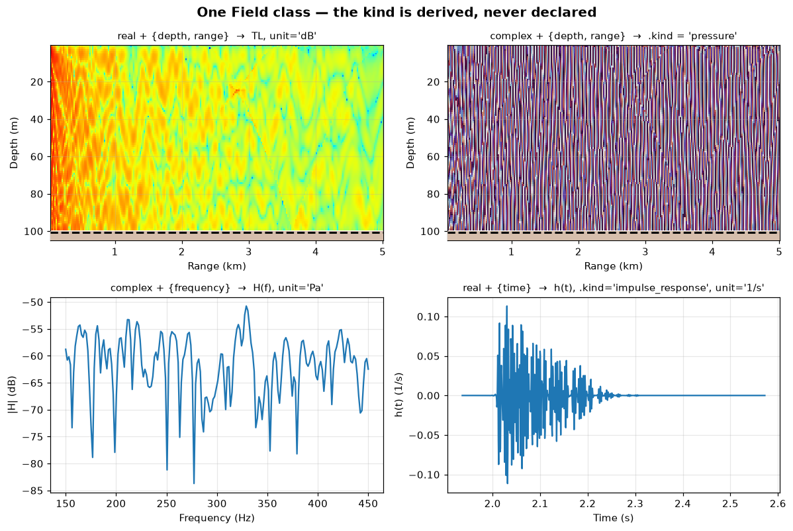
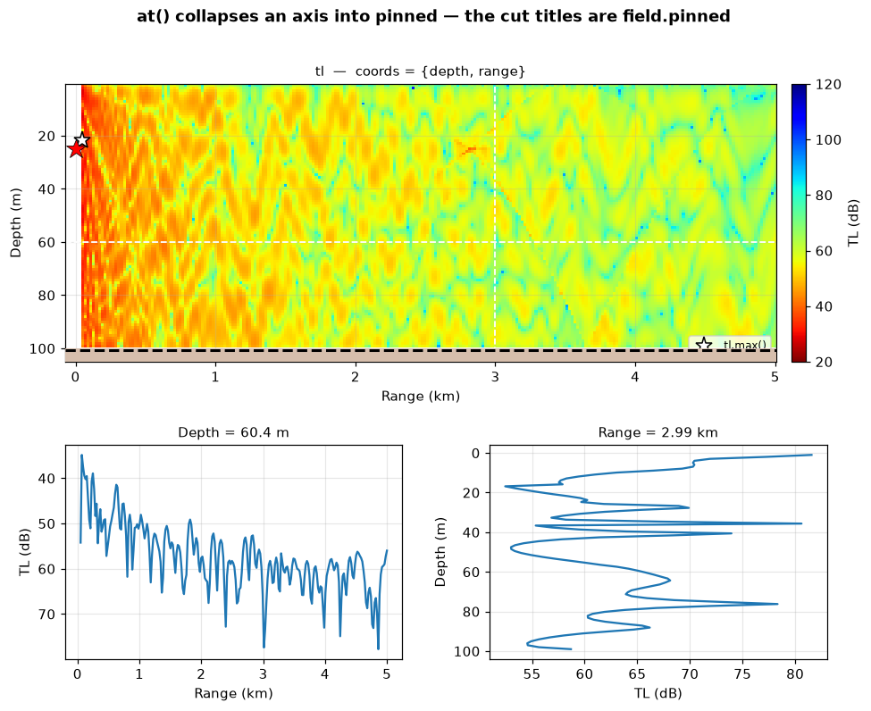
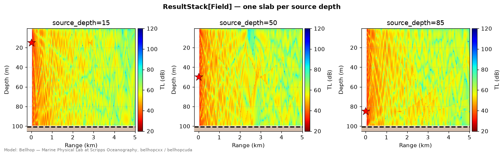
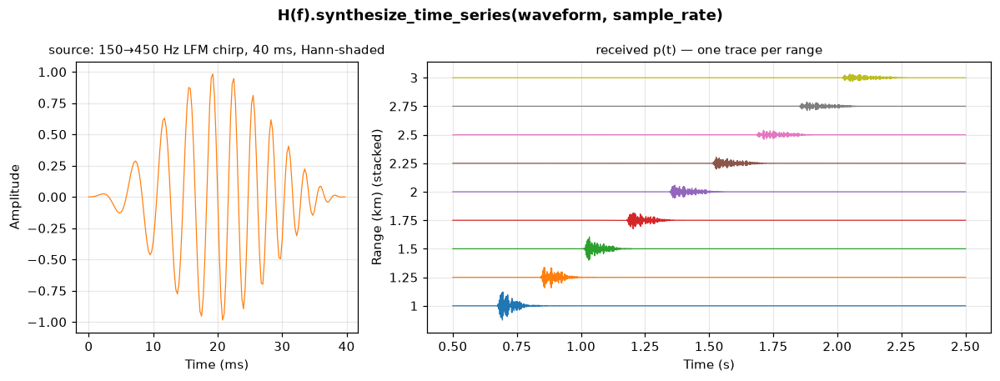
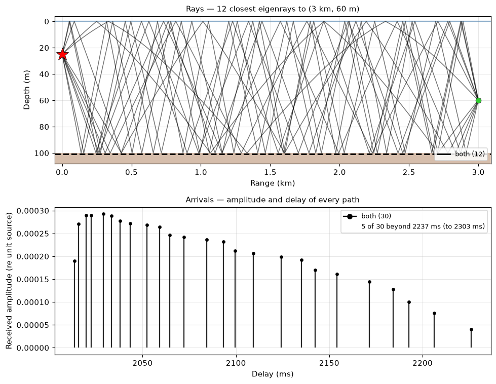
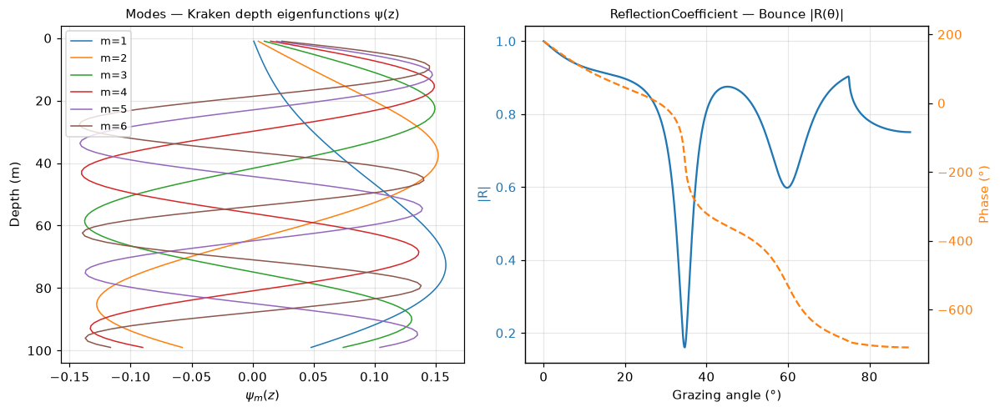

# Results — what a model gives you back

> `uacpy.core.results` · every public name re-exported on `uacpy.*`
> · `Field` · `Rays` · `Arrivals` · `Modes` · `Covariance` · `Replicas`
> · `ReflectionCoefficient` · `GreensFunction` · `ResultStack`

Every model in the package has the same shape: three carriers in
([environment](environment.md), [source and receiver](source-receiver.md)),
one **result** out. This page is about that result — what type you get for
which `RunMode`, how to slice it down to the number you actually wanted, and
what it knows about the run that produced it.

The organising idea is that a result is **data plus identity, and nothing
else**. It carries its values, its axes, and the provenance of the run. It does
not carry the environment, the source or the receiver — see
[§8](#8-identity-and-provenance) for why that is deliberate.

---

## 1. The nine result types

```python
from uacpy.models import Bellhop, RunMode
result = Bellhop().run(env, source, receiver, run_mode=RunMode.COHERENT_TL)
```

| Type | `RunMode` that produces it | Payload | Models |
|---|---|---|---|
| `Field` | `COHERENT_TL`, `INCOHERENT_TL`, `SEMICOHERENT_TL`, `BROADBAND`, `TIME_SERIES` | gridded values + named axes | [Bellhop](../models/bellhop.md), [Kraken](../models/kraken.md), [Scooter](../models/scooter.md), [RAM](../models/ram.md), [SPARC](../models/sparc.md), [OAST / OASP](../models/oases.md) |
| `Rays` | `RAYS`, `EIGENRAYS` | list of ray polylines | [Bellhop](../models/bellhop.md) |
| `Arrivals` | `ARRIVALS` | flat list of arrival events | [Bellhop](../models/bellhop.md) |
| `Modes` | `MODES` | `k` (wavenumbers) + `phi` (mode shapes) | [Kraken](../models/kraken.md) |
| `ReflectionCoefficient` | `REFLECTION` | `R(θ)` magnitude + phase | [Bounce](../models/bounce.md), [OASR](../models/oases.md) |
| `Covariance` | `COVARIANCE` | `C(f, i, j)` across an array | [OASN](../models/oases.md) |
| `Replicas` | `REPLICA` | Green's functions per candidate position | [OASN](../models/oases.md) |
| `GreensFunction` | none: `uacpy.io.read_grn_file` reads it from a `.grn` | `G(k, z)` on a phase-speed grid, before the transform to range | [Scooter](../models/scooter.md), [SPARC](../models/sparc.md) snapshot |
| `ResultStack` | any of the above, with several source depths | a list of slabs + the coordinate they vary along | every field model, [Bellhop](../models/bellhop.md) for rays/arrivals, [`run_parallel`](utilities.md) |

Not every model supports every mode; ask the model rather than guessing:

```python
>>> [m.name for m in Bellhop().supported_modes]
['COHERENT_TL', 'INCOHERENT_TL', 'SEMICOHERENT_TL', 'RAYS', 'EIGENRAYS',
 'ARRIVALS', 'BROADBAND', 'TIME_SERIES']
>>> Bellhop().supports_mode(RunMode.MODES)
False
```

The class answers too, without building an instance — the way to ask a model
whose constructor needs arguments, such as OASS and OASSP (`correlation_length=`):

```python
>>> [m.name for m in OASS.spec.modes]
['REVERBERATION', 'COVARIANCE']
```

`Model.spec.modes` is the declaration every instance's `supported_modes`
copies.

Every one of these types prints a one-line summary of itself, which is the
fastest way to see what you are holding:

```
Field(Bellhop, pressure Pa, frequency 200 Hz, 100 depths 1–99 m × 250 ranges 50–5000 m)
Rays(Bellhop, frequency 200 Hz, 60 eigenrays, receiver depth 60 m, receiver range 3000 m)
Arrivals(Bellhop, frequency 200 Hz, 30 arrivals, receiver depth 60 m, receiver range 3000 m)
Modes(Kraken, frequency 200 Hz, 14 modes, 101 depths 1–99 m)
ReflectionCoefficient(Bounce, frequency 200 Hz, 671 angles 0–90 deg)
ResultStack(3 Field slabs, source depths [15, 50, 85] m)
```

---

## 2. `Field` — one container described on three axes

There is exactly one gridded result class. Transmission loss, complex
pressure, a broadband transfer function and a time series are **not** four
types: they are one class described on three independent axes, each derived
from the data rather than read off a flag someone set.

| axis | question it answers | ask it when you need |
|---|---|---|
| `.kind` | *what* is this? | to know whether comparing two fields means anything |
| `.unit` | what is it *measured in*? | to know which direction is louder |
| `.data.dtype` | how is it *stored*? | to know whether there is phase to work with |

There is no `Field.dtype` — the storage axis is read off `.data.dtype`, or as
the boolean `.is_complex`.

Bellhop's `COHERENT_TL` hands back complex pressure — `unit='Pa'`, as the
one-line summaries above show. `.to_dB()` is the step that moves it onto the dB
side of the `.unit` axis:

```python
>>> tl_dB = tl.to_dB()
>>> tl_dB
Field(Bellhop, pressure dB, frequency 200 Hz, 100 depths 1–99 m × 250 ranges 50–5000 m)
```

`.kind` is `'pressure'` unless a model tags something else — reverberation
level, for instance. Transmission loss is deliberately **not** its own kind:
`-20·log10|p|` is the same pressure field written in dB, and that difference
is the `.unit` axis's job. The **domain** is not an axis either; it is already
in `.coords`, as a `time` or `frequency` entry.

| `.data` dtype | `.coords` contains | `.kind` | `.unit` | Physical meaning |
|---|---|---|---|---|
| complex | a `frequency` axis | `'pressure'` | `'Pa'` | `H(f)` |
| real | a `time` axis, synthesised with a source | `'pressure'` | `'Pa'` | `p(t)` |
| real | a `time` axis, `to_time_trace()` with no source | `'impulse_response'` | `'1/s'` | band-limited impulse response `h(t)` |
| complex | neither | `'pressure'` | `'Pa'` | complex pressure `p` |
| real | neither | `'pressure'` | `'dB'` | transmission loss, dB |

Real data alone does not mean dB — a time trace is linear, which is why
`.unit` consults the axes too. The one row that is tagged rather than derived
is the impulse response: `to_time_trace()` with no source spectrum or waveform
returns `Σ H(f)·e^{2πift}·Δf`, a pressure ratio re the unit source times
hertz, so per second; with a source it is the received pressure `p(t)`.

Nothing about dimensionality enters into it. `tl.at(depth=20)` is a 1-D range
cut and still dB; `tl.max()` is a scalar and still dB.

A `Field` built by hand states its quantity at construction:
`Field(data=levels, coords={'depth': z, 'range': r}, kind='level', unit='dB')`.
Both must be registered names (`uacpy.core.results.quantities`); they are the
Field's own attributes `.kind` and `.unit`, and a `metadata` entry of either
name is refused.



All four panels above are the same class:

```python
env, source, receiver = shallow_water()
pressure = Bellhop(n_beams=3000).run(env, source, receiver)

source_bb = uacpy.Source(depths=25.0,
                         frequencies=np.linspace(150.0, 450.0, 192))
point = uacpy.Receiver(depths=60.0, ranges=3000.0)
H = Bellhop(n_beams=3000).run(env, source_bb, point,
                              run_mode=RunMode.BROADBAND)

spectrum = H.isel(depth=0, range=0)
trace = H.to_time_trace()

pressure.to_dB().plot(env=env)          # real    + {depth, range} → dB
pressure.plot(env=env, value='phase')   # complex + {depth, range} → Pa
spectrum.plot(value='level')           # complex + {frequency}    → H(f)
trace.plot()                            # real    + {time}         → h(t), 1/s
```

### Why the axes are kept apart

Collapsing them is not hypothetical — each collapse has produced a bug:

- `Field.max` inferred dB-ness from the quantity. Introducing a reverberation
  kind made it return the *quietest* cell of a dB grid instead of the loudest.
- `compare_models` keyed on representation, so it refused a RAM TL field
  against a Kraken complex one — the ordinary cross-model comparison, since
  those are one quantity written two ways.
- `replica_bank_from_field` asked for a quantity when what matched-field
  processing actually needs is **phase**, i.e. the dtype. A real TL field
  answers `kind='pressure'` and would have sailed past a kind-only guard.

So: compare on `.kind`, decide loudness on `.unit`, and require phase on the
dtype.

### Adding a quantity

Every quantity is registered once, in
[`core/results/quantities.py`](../../uacpy/core/results/quantities.py), with
the units it may carry and the label for each pairing:

```python
Quantity('reverberation', {'dB': 'Reverberation loss (dB re unit source)'}),
```

A model then builds its Field with `kind='reverberation'`, and the label,
the validation and the colour scale follow. An **unregistered** kind is
refused when the `Field` is constructed rather than defaulting silently, since
a typo'd kind otherwise resurfaces much later as a wrong colour scale or a
wrong `.max()` direction with nothing pointing back at the model that set it.

The quantity is the Field's own: `kind`, `unit`, `coherent`, and on a surface
in dB re one of its own values `reference` / `reference_unit`, are set once
when the Field is built (as keywords, or read off its storage) and carried to
every Field derived from it. They are not `metadata`, and a `metadata=`
carrying one of them is refused. `to_dict()` writes them at the top level, and
`Field.from_dict` also reads a file that keeps them in its metadata.

Colormaps are deliberately *not* in that registry — they are a rendering
choice and live in `visualization/style.py`, which `core/` must not depend on.

Two things it deliberately does not model: unit conversion, and a per-unit
"which way is louder" flag. Two quantities are inverted — transmission loss,
and OASS reverberation, which OASES writes as `-10·log10 E[|p_scat|²]` — so
two documented special cases in `Field.max` beat a field that would read `+1`
in every row but two. Both read as losses everywhere: `Field.max` returns the
smallest cell, and a 1-D cut of either draws its value axis downward.

The consequence worth internalising: **operations that change the dtype or the
axes change what the field is**. `pressure.to_dB()` moves `Pa` to `dB`.
`H.at(frequency=300)` drops the frequency axis. `H.to_time_trace()` returns to
the time domain. You never declare any of it.

### Canonical layouts

`data.shape` follows the insertion order of `coords`, and every uacpy producer
uses the same order: `source_depth → depth → range → frequency` (or `time`).

| `coords` | `.unit` | Produced by |
|---|---|---|
| `{depth, range}`, complex | `Pa` | `COHERENT_TL` from every field model |
| `{depth, range}`, real | `dB` | Kraken `INCOHERENT_TL`, OAST `COHERENT_TL`, any `.to_dB()` |
| `{depth, range, frequency}` | `Pa` | `BROADBAND` |
| `{depth, range, time}` | `Pa` | `TIME_SERIES` (natively from [SPARC](../models/sparc.md)) |
| `{time}` | `Pa` | `to_time_trace()` on one cell, with a `source_waveform` or `source_spectrum` |
| `{time}` | `1/s` | `to_time_trace()` on one cell with no source — the impulse response, `kind='impulse_response'` |
| `{source_depth, depth, range}` | `Pa` | assembled by hand from per-source-depth fields, for [matched-field processing](sonar.md) (a multi-source run itself returns a `ResultStack`; `replica_bank` returns a `Replicas`) |

Every row but the impulse response is `kind='pressure'`; a model producing
another quantity (OASS reverberation) tags its own `.kind`.

Depths and ranges are **metres** throughout; kilometres appear only on plot
axes. See [units and conventions](../README.md#conventions).

---

## 3. Slicing — `at`, `isel`, `eval`, `max`, and `.pinned`

A model hands you a grid; you almost always want a cut through it. All four
slicers share one rule:

> **A collapsed axis is dropped from `coords` and its value is recorded in
> `pinned`.**

That is the whole mechanism. `coords` is what remains — the axes the field is
still a function of. `pinned` is the running record of where you are standing.

| Call | Selection | Fabricates values? |
|---|---|---|
| `.at(depth=60.0)` | nearest **stored sample** to the label | no |
| `.isel(depth=0)` | positional index (negatives allowed) | no |
| `.eval(depth=60.0, method='linear')` | interpolated onto the label | **yes** |
| `.max()` | the loudest cell, every axis at once | no |

Past the end of an axis `at` returns the edge sample and `eval` holds the edge
value constant; both warn, naming the edge used. `resample_to` returns `NaN`
there instead.



```python
tl = Bellhop(n_beams=3000).run(env, source, receiver).to_dB()
loudest = tl.max()

tl.plot(env=env, source=source)     # coords = {depth, range}  → heatmap
tl.at(depth=60.0).plot()            # coords = {range}         → range cut
tl.at(range=3000.0).plot()          # coords = {depth}         → depth cut
```

The two cut panels were given **no** title. The titles you see — `Depth =
60.4 m` and `Range = 2.99 km` — are the plotter rendering `field.pinned`,
and they are the honest answer to "what did I actually get?":

```python
>>> cut = tl.at(depth=60.0)
>>> cut
Field(Bellhop, pressure dB, frequency 200 Hz, 250 ranges 50–5000 m, at depth=60.3939 m)
>>> cut.coords.keys()
dict_keys(['range'])
>>> cut.pinned
{'depth': 60.3939393939394}           # nearest receiver depth, not 60.0
```

### Narrowing an axis instead of collapsing it — `window` and `shift`

The four slicers above all *collapse*: one sample survives and the axis is
gone. Two more methods leave the axis in place.

| Call | Effect | Axis survives? |
|---|---|---|
| `.window(time=(0.0, 0.18))` | drop samples outside an inclusive label range | **yes** |
| `.shift(time=-0.02)` | translate the coordinate, data untouched | **yes** |

`window` takes `None` for either end, so `window(time=(0.0, None))` trims a
pre-roll and nothing else, and it **raises when the window keeps no sample** —
an empty axis is not a smaller field but a field with nothing in it, and every
later slice of it would fail somewhere less obvious.

Together they put several models on one display axis, which is what comparing
them takes:

```python
# A time-marching solver integrates from a negative pre-roll; an IFFT one
# starts at zero and carries the source waveform's own peak offset. Move the
# emission to t=0, then cut both to the same window.
aligned = synthesised.shift(time=-waveform_peak).window(time=(0.0, t_max))
```

Both go through `Field.replace()`, so the result keeps the quantity (`kind`,
`unit`, `coherent`), the synthesis inputs (`speeds`, `synthesis_floor`) and the
whole identity surface of §8 — model, backend, frequencies, source depths,
phase reference, `model_source`, `source_level_dB`, `source_weights` and
`metadata`. Rebuilding a `Field` by hand to do this is how they get dropped:
the quantity then falls back to what the storage implies, so a tagged quantity
silently becomes an untagged one.

### The same move in the frequency domain — `remove_delay`

Shifting a time axis by `-τ` and removing a delay `τ` from `H(f)` are one
operation on two representations, so `remove_delay` is `shift`'s frequency-domain
twin:

```python
H.remove_delay(seconds=tau)          # a delay you already know
H.remove_delay(sound_speed=1500.0)   # take r/c from the field's own range
```

**There is no default τ.** The delay worth removing is the geometric travel time
`r/c`, and a `Field` carries `r` but not `c` — the sound speed belongs to the
Environment that produced it, and guessing 1500 m/s would be the package
inventing a number you did not supply. Give it `sound_speed` and it does the
division itself; on a field that still has a range axis, **each range is
advanced by its own `r/c`** (the reduced-time convention).

Why you need it: the phase of a delay wraps at `1/τ` in frequency, so on a grid
of spacing `Δf` it is unambiguous only for `τ < 1/(2·Δf)`. A 3.3 s travel time
on a 1 Hz grid is aliased beyond reading — and two models sampled on *different*
grids alias differently and appear to disagree when they do not. Read the delay
back off the unwrapped phase slope of one such field and the coarse grid says
+340 ms while a finer one says −60 ms, for a true 3340 ms; compensated, both say
the 7 ms residual they can actually resolve. The magnitude is untouched
throughout — it is a unit-modulus factor — so `|H|` and any TL from it are
unchanged.

`at` asked for 60 m and got 60.394 m, because that is where a receiver
actually is. Nothing was interpolated and nothing was invented. Slicing
composes, and `pinned` accumulates:

```python
>>> cell = tl.at(depth=60.0).at(range=3000.0)
>>> cell
Field(Bellhop, pressure dB, frequency 200 Hz, scalar, at depth=60.3939 m, range=2992.17 m)
>>> cell.pinned
{'depth': 60.3939393939394, 'range': 2992.169}
>>> cell.data                    # 0-D array — a single number
array(65.82971266)
```

`.max()` does the same thing for every axis in one step (the white star on the
figure). For a complex or time-domain field it takes the global argmax of
`|data|`; for real dB it takes the **minimum** finite TL, because smaller dB is
louder. `NaN` no-data cells are skipped:

```python
>>> tl.max().pinned
{'depth': 21.78787878787879, 'range': 50.0}
```

Pinning an identity-bearing axis narrows the identity too, so a slice never
misreports itself: `H.at(frequency=300)` comes back with
`frequencies == [299.2]` and an `f0` to match.

### How slicing decides what a plot looks like

[`plotting.md`](plotting.md) owns rendering, but the branch it takes is chosen
by the `coords` **you** left behind, counting only the axes that hold more
than one sample:

| surviving axes | render branch |
|---|---|
| 2 | heatmap (or stacked traces with `stacked=True` when one axis is `time`) |
| 1 | line plot |
| 3 or more | `ConfigurationError` — slice it first |

```python
>>> grid = uacpy.Receiver(depths=[40.0, 60.0], ranges=[2000.0, 3000.0])
>>> Bellhop(n_beams=3000).run(env, source_bb, grid, run_mode=RunMode.BROADBAND).plot()
ConfigurationError: plot_field: cannot plot a 3-axis field (coords
['depth', 'range', 'frequency']); slice it first with .at(...) / .isel(...)
so 1 or 2 axes remain.
```

The single-point `H` of §2 has one depth and one range, so it has one
surviving axis and `H.plot()` draws its TL against frequency.

So `.at` / `.isel` are not just data reduction — they are how you choose the
view. [`plotting.md`](plotting.md) covers what each branch then draws.

---

## 4. Derived views and grid operations

None of these mutate the field; each returns a fresh array or a fresh `Field`.

| Accessor | Returns | Notes |
|---|---|---|
| `.dB` | ndarray, dB | `-20·log10\|data\|` for complex data; a **read-only view** when data is already dB. Raises for a time-domain field. |
| `.tl` | ndarray, dB | transmission loss: exactly `.dB`, on **pressure-kind fields only** — any other kind raises and points at `.dB` |
| `.p` | ndarray, complex | read-only view; raises when data is real (the phase is gone) |
| `.magnitude` | ndarray | `\|data\|`, complex only |
| `.phase` | ndarray, radians | `angle(data)`, complex only |
| `.to_dB()` | `Field` | the dB counterpart of this field; a no-op when already real |
| `.shape`, `.axes`, `.is_complex` | — | shape, axis names, dtype test |
| `.depths`, `.ranges`, `.times` | ndarray or `None` | the coord vectors by name |
| `.dt`, `.sample_rate` | float | time-axis spacing; `0.0` when not time-resolved |

`.dB` and `.p` hand back read-only views on purpose: the array *is* the
result's payload, and `p = field.p; p *= 2` would otherwise silently corrupt
it. Copy first if you need to modify.

Grid-level operations, all requiring the canonical `['depth', 'range']` layout
(or `['depth', 'range', 'time']` where noted):

| Method | What it does |
|---|---|
| `.resample_to(depths=…, ranges=…)` | interpolate onto a new grid; out-of-bounds is `NaN`. Keyword-only and depth-first. |
| `.mask_below_seafloor(env)` | `NaN` out samples under the bathymetry; `depth` and `range` must be the first two axes, and a trailing axis (frequency, time) takes the mask of its cell. On plain arrays: `uacpy.core.bathymetry.mask_below_seafloor(data, depths, ranges, bathymetry, *, paired=False)` |
| `.check_sampling(view='interpolate')` | warn when the grid is too coarse: `'interpolate'` against a quarter wavelength (what `eval` and `resample_to` check), `'phase'` against half a wavelength (what a phase, real or imaginary plot checks) |
| `.extract_tone(f)` | steady-state complex pressure at one frequency from any field with a `time` axis (the other axes are kept; a single `{time}` trace gives one phasor) |
| `.to_dict()` / `Field.from_dict(d)` | round-trip to plain arrays for caching or pickling; a `np.savez(f, **field.to_dict())` file reads back with `Field.from_dict(np.load(f, allow_pickle=True))` |
| `.to_xarray()` / `Field.from_xarray(da)` | a labelled `xarray.DataArray` — dims in axis order, pinned axes as scalar coordinates, the data unit and every axis's unit as the CF `units` attribute, `kind`/identity in `attrs`, named by the `kind`; `xarray.open_dataarray` reads a NetCDF file of it back. Needs the optional extra `pip install "uacpy[xarray]"` |
| `.to_netcdf(path)` | `to_xarray()` written to NetCDF; complex data as its real and imaginary parts on a trailing `_pfnc_complex` dimension, which every backend writes and plain netCDF4 opens; `from_netcdf` / `from_xarray` join them back exactly |
| `.values()` | the data as a **read-only** view; `.view(value)` is any derived view by name — `'dB'`, `'level'` (`20·log10\|p\|`, the `value='level'` a plotter draws), `'magnitude'`, `'phase'`, `'real'`, `'imag'` — so every plotted value is reachable without plotting |
| `.copy()` | deep copy, symmetric with the carriers |

`to_dict` is the supported way to transform a field's values and keep it a
field — [SPARC's record section](../models/sparc.md) uses exactly that to
apply a `√r` gain before plotting.

---

## 5. `ResultStack` — one run, several source depths

A `Source` with several depths runs on every field model in a single call
and returns a `ResultStack` — a list of slabs plus the coordinate they vary
along, one slab per source. Bellhop writes every depth into one deck, and
so do Kraken in its TL modes and Scooter in `COHERENT_TL`; the other engines
run once per depth inside `run()`.

`stack.superpose()` adds the slabs' complex pressure — the elements of one
array, driven with a fixed relative phase — and `superpose(coherent=False)`
adds their intensity instead, for sources that are mutually incoherent. N
identical sources give `20·log10(N)` one way and `10·log10(N)` the other, so
the choice is a statement about the sources rather than about the arithmetic.

Either total keeps transmission loss's reference — one unit source at 1 m —
so the array's gain sits inside the number and the map is captioned *Total
level*, not TL. Give the `Source` a `source_level_dB=` and
`total.at_source_level()` returns an absolute received level instead, in dB
re 1 µPa, which carries no such ambiguity. See example 40.



```python
source = uacpy.Source(depths=[15.0, 50.0, 85.0], frequencies=200.0)
stack = Bellhop(n_beams=3000).run(env, source, receiver)
stack.plot(env=env, title='ResultStack[Field] — one slab per source depth')
```

Every slab is a full result of the same concrete type, sharing `model`,
`backend` and every identity axis except the stacking one — `ResultStack`
validates that at construction rather than letting a mismatched bundle through.

| Access | Gives you |
|---|---|
| `stack[i]` | the `i`-th slab |
| `stack.at(source_depth=50.0)` | the slab nearest a label |
| `stack.isel(source_depth=1)` | the slab at a position |
| `for depth, slab in stack:` | `(coordinate, slab)` pairs |
| `len(stack)`, `stack.n_slabs` | slab count |
| `stack.dB` | one dense array, shape `(n_slabs, *slab.dB.shape)` |
| `stack.tl` | `stack.dB` for pressure slabs; any other kind raises |
| `stack.p` | complex pressure, shape `(n_slabs, *slab.shape)`; a real (dB) stack raises, as `Field.p` does |
| `stack.model`, `.backend`, `.frequencies`, `.source_depths` | the identity every slab agrees on |
| `stack.superpose()` | one `Field`: `Σ wᵢ·pᵢ` over the slabs with the `Source`'s `weights` |
| `stack.superpose([w1, w2, …])` | the same sum with weights given here |
| `stack.to_xarray()` | one `xarray.DataArray` with a leading stacking dimension (extra `uacpy[xarray]`); `Field.from_xarray(da.isel(source_depth=i))` is slab `i` |

`stack.dB` exists so generic code can read `result.dB` whether one or many
source depths were asked for.

`superpose` is how several sources are driven together: each slab is the
complex field of one unit-amplitude source, the engines are linear in the
source amplitude, so the weighted sum on the shared grid is the field of the
weighted array. The sum keeps the slabs' grid and `phase_reference`, widens
`source_depths` to every depth it added and records the depths and weights
in `metadata['superposed_sources']`. A `TIME_SERIES` stack sums its real
traces with real weights. A stack of real dB values has lost its phase and
refuses — superpose the complex field the run returned, before `to_dB()`.

```python
pair = uacpy.Source(depths=[40.0, 60.0], frequencies=200.0, weights=[1, -1])
stack = Kraken().run(env, pair, receiver)       # ResultStack[Field], 2 slabs
field = stack.superpose()                       # p(40 m) − p(60 m)
same = stack.superpose([1, -1])                 # weights given at the call
```

Bellhop's `RAYS` / `ARRIVALS` / `EIGENRAYS` stack the same way and give
`ResultStack[Rays]` / `ResultStack[Arrivals]`; those slabs are not fields and
do not superpose. Kraken's `MODES` returns one `Modes` for every depth (the
mode set does not depend on the source depth; `source_depths` lists them).
Every other non-field mode (`REFLECTION`, `COVARIANCE`, `REPLICA`,
`REVERBERATION`) takes one source depth per run and says so:

```python
>>> OASR().run(env, uacpy.Source(depths=[20.0, 60.0], frequencies=200.0),
...            receiver)
ConfigurationError: OASR takes a single source depth per REFLECTION run; got 2:
[20.0, 60.0]. A multi-depth Source stacks only in the
field modes (COHERENT_TL / INCOHERENT_TL / SEMICOHERENT_TL / BROADBAND /
TIME_SERIES); for REFLECTION loop over single-depth Sources externally.
```

A sweep over any other parameter goes through [`run_parallel`](utilities.md);
`.stack()` on the outcome gives the same `ResultStack`, along whatever
coordinate you varied.

---

## 6. From `H(f)` to `p(t)`

A `BROADBAND` run gives you a complex transfer function on a `frequency` axis.
Two methods turn it into time:

| Method | Input | Output |
|---|---|---|
| `.to_time_trace(depth=…, range=…)` | one `(depth, range)` cell | `Field`, `coords={'time'}` — the band-limited impulse response |
| `.synthesize_time_series(source_waveform, sample_rate)` | a source waveform | `Field`, `coords={'depth', 'range', 'time'}` — every cell convolved |
| `.truncate_response(duration, origin='peak', window=None)` | a pulse length | `Field`, same coords — `H(f)` with its impulse response cut to what a pulse that long can overlap. `H(f)` as a model returns it is the **continuous-wave** answer, every path at once; two copies of a `T`-long pulse interfere only where they overlap, so arrivals more than `T` apart arrive separately and do not add. The window reaches `duration` **either side** of the origin. Works on any model's `H`, which is the point — a wave model has no paths to drop, so it has to be found in the response. Warns when the `1/Δf` record has already folded the response, because a fold cannot be told from an early arrival |

Both require the canonical `['depth', 'range', 'frequency']` layout. With no
arguments, `to_time_trace` takes the middle depth and the first range.

**Channel simulation — one signal, one receiver.** There are two routes and
the model-level one came first: `RunMode.TIME_SERIES` with `source_waveform=`
and `sample_rate=` runs the solver straight to `p(t)` on Bellhop, Kraken,
Scooter, RAM, SPARC and OASP — see
[example 19](../../uacpy/examples/example_19_broadband_comparison.py), which
reconstructs a chirp at one receiver across eight solvers.

Use `to_time_trace` when you already hold an `H(f)` — from a `BROADBAND` run
you made for the level maps above, say — and want a receiver's waveform out
of it without a second model run:

```python
trace = H.to_time_trace(depth=60, range=2000, source_waveform=tx, sample_rate=fs)
```

Use `synthesize_time_series` when you want every cell; this when you want a
receiver. A `depth` or `range` outside the grid warns — the match is to the
nearest stored coordinate, so a receiver past the panel's edge would
otherwise become the edge cell and return a perfectly ordinary trace of the
wrong place.

**Size the frequency grid from the arrivals, not by eye.** The record is
`1/Δf` long and circular, so a channel whose multipath outlasts it folds onto
its own early part and reads as extra arrivals. `Arrivals.synthesis_band`
picks Δf for you:

```python
f = arrivals.synthesis_band(bandwidth=1600.0, centre=3000.0,
                            energy_fraction=0.999)
H = model.run(env, Source(depths=30.0, frequencies=f), rcv,
              run_mode=RunMode.BROADBAND, frequencies=f)
```

On the page's `shallow_water()` channel at 2 km (source 30 m, receiver 60 m,
Bellhop arrivals at 3 kHz), with 33 ms of rms delay spread, it chose
Δf = 5.08 Hz — a 197 ms record for 164 ms of arrival energy. A hand-picked
10 Hz would have given 100 ms and folded 18 of the 34 arrivals back onto the
early trace.

**Add the pulse yourself.** That default budgets the *arrivals* only, so a
20 ms pulse through a 2.7 ms channel can be handed a 5 ms record and wrap
completely — `synthesis_band` stays silent because the arrivals do fit. State
the whole budget with `record=`, which bypasses the helper's own `margin`, so
supply headroom too:

```python
span = arrivals.energy_support(0.999) + len(waveform) / fs
f = arrivals.synthesis_band(bandwidth=B, centre=f0, record=6.0 * span)
```

Several times over, not a token factor: the pulse has to fit *and* the band
edge's precursor needs somewhere to sit. Measured on example 45's received
chirp, energy arriving before the first path could ran 1.9 % at 1.5×, 0.18 % at 4×, and
0.19 % at 60× — so it converges around 4×, and that floor is the band edge,
not a fold.

**Two routes to a received signal, and they are not identical.** The wave
route above keeps `H(f)` across the band. The path route —
`Arrivals.channel_taps` / `acoustic_signal.simulate_reception` — freezes the
arrival amplitudes at one carrier, which is the tap model's narrowband
assumption, so the two differ wherever the arrival amplitudes change across
the signal's band. For modem work `Arrivals.channel_regime(symbol_rate)` says
which regime you are in (the channel above: frequency-selective, 33 ms of
spread = 65 symbols at 2 kBd).



**And back again.** `Field.to_transfer_function()` is the way from a
time-domain `Field` to `H(f)`, as a carrier rather than as raw arrays:

```python
trace = H.to_time_trace(depth=50.0, range=5e3, window=None)
back  = trace.to_transfer_function()     # same band, same numbers
```

The band is **restricted, not extended**. An `rfft` of an `N`-sample record
returns every bin up to Nyquist, but a trace synthesised from a 100–995 Hz
field supports nothing outside that — the rest are the synthesis's own edges,
and returning them would invent data. The band comes from the Field's
identity, or from `band=`.

The result is a complex `['…', 'frequency']` Field, so
`plot_transfer_function`, `broadband_loss` and `truncate_response` all take
it. Note that `window='hann'` (what `to_time_trace` uses for a bare
impulse response) is a real modification of the signal: the round trip
closes to 7e-16 with `window=None` and differs visibly with the window on,
which is the window working, not the transform failing.

The method is a wrapper: the transform, the `t0` rotation and the band cut are
[`transfer_function_from_impulse_response`](signal.md#61-going-back-h--h),
which you can call on your own arrays. What the Field adds is the axis
bookkeeping, the band read off its identity, the metadata, and the `dt` that
carries the result into the density convention — see that section for why
there are two conventions and what mixing them costs.

For the narrower tool: `extract_tone` is the careful
single-frequency answer, evaluated AT the frequency rather than at the
nearest bin.

---

## 6a. The level a signal with bandwidth or duration reaches

A model's TL is the **continuous-wave** answer. Two quantities say what a real
signal reaches, and they answer different questions:

**Both start from a `RunMode.BROADBAND` run.** They need a complex `H(f)` with
a `frequency` axis, and that is the only run mode that produces one —
`COHERENT_TL` refuses more than one source frequency by construction. Bellhop,
Kraken, Scooter and RAM all offer it:

```python
f = np.arange(800.0, 1201.0, 20.0)
H = model.run(env, Source(depths=20.0, frequencies=f), rcv,
              run_mode=RunMode.BROADBAND, frequencies=f)
```

`Δf` sets the record length `1/Δf` that the exposure integral and any time
trace live in, so size it from the channel — `Arrivals.synthesis_band` does
that (see §6).

| Method | Returns | Question |
|---|---|---|
| `.broadband_loss(source_spectrum=None, *, source_waveform=None, sample_rate=None)` | `Field`, frequency axis gone, `kind='pressure'` `unit='dB'` — so `.tl` and `.plot()` treat it as the TL map it is | how much of the continuous-wave interference does my **bandwidth** survive? |
| `.sound_exposure_level(source_waveform, sample_rate)` | `Field`, `kind='sound_exposure'` — a **level**, so it reads upward and never shares a colorbar with TL | how much **energy** does one transmission deliver? |
| `.peak_sound_pressure_level(source_waveform, sample_rate)` | `Field`, `kind='peak_pressure'` — a level of its own kind, distinct from `'level'` | how loud is its **single loudest excursion**? |

`broadband_loss` is the frequency average of the **coherent** `|H|²`, weighted
by `|source_spectrum|²`:

```python
# the simplest form: hand it the signal, get that signal's TL map
loss = H.broadband_loss(source_waveform=my_chirp, sample_rate=fs)
loss.plot(env=env)

# or a plain band, when you want the band rather than a specific waveform
band = H.window(frequency=(40e3 - 25, 40e3 + 25))    # a 20 ms burst's 1/T
band.broadband_loss().plot(env=env)
```

`source_waveform=` evaluates the spectrum on the field's axis with the same DTFT
`synthesize_time_series` uses, so `SEL = ESL − TPL` closes exactly. Do **not**
`np.interp` an `rfft` onto the axis and pass it as `source_spectrum=` — the two grids
rarely coincide and interpolation is a triangular-kernel convolution, not a
resampling; measured at 0.13 dB of error on a plain tone burst.

This **is** the transmission loss of a transient signal, in the ordinary
sense of the word: Ainslie's broadband propagation loss (§11.3.3, Eq. 11.46),
which is Abraham's pulse propagation loss `L_p = ∫|U|²df / ∫|H|²|U|²df`
(§3.2.4.2) once a source spectrum weights it, and Ainslie's total path loss
(§3.3.2.1) in energy form. Received level is `SL − TPL` for mean square and
`SEL = ESL − TPL` for energy, exactly as a CW TL is used.

Two properties make it a generalisation of TL rather than a lookalike:

* **It converges to the CW loss as the band narrows.** On a two-path channel
  at a near-cancellation frequency: 12.19 dB of error at B = 200 Hz, 4.12 at
  50, 0.295 at 10, 0.0166 at 2, and exactly 0 at one bin.
* **It is a functional of `|S(f)|` on the field's own axis.** Phase does not
  enter at that point, so a `source_spectrum=` and the same magnitudes with any
  other phase give the same map. It does **not** follow that two waveforms sharing a
  nominal band share a loss: `source_waveform=` evaluates the continuous DTFT on the
  field's axis, and off a waveform's own DFT grid that is not fixed by its
  `|rfft|`. Whether phase matters at all is decided by **grid alignment**:
  `|DTFT|` equals `|rfft|` only on the waveform's own DFT bins, spaced
  `1/T`. When `T·Δf` is an integer the field's axis is a subset of those
  bins, phase cannot reach the answer, and two same-`|rfft|` waveforms give
  **exactly** the same loss. Off that alignment it can. On a two-path
  channel over a 25 Hz axis, 500 Hz bursts of 20 and 40 cycles (`T·Δf` = 1
  and 2) spread 0.0000 dB, while 19, 21 and 41 cycles (0.95, 1.05, 2.05)
  spread 0.066, 0.055 and 0.043 — and 21 cycles is *narrower* than 20, so
  this is not a bandwidth effect. Either way different signals get
  different losses, which is the point of passing the waveform.

It is **not** `RunMode.INCOHERENT_TL` (Ainslie's Eq. 11.47), which drops the
arrivals' relative phase — Ainslie marks that approximation invalid within a
few wavelengths of a boundary, which is every Lloyd mirror. Jensen's
semicoherent loss (§3.3.5.4) is a third thing again, and he calls that family
"somewhat informal and partially empirically based".

`sound_exposure_level` integrates `p(t)²` from `synthesize_time_series` —
Abraham's energy flux density integral (§3.2.1.5), ISO 18405's sound exposure:

```python
sel = H.sound_exposure_level(tone_burst(40e3, 800, sample_rate=fs)[1], fs)   # dB re 1 µPa²s
```

There is **no source-level argument** — the level rides on the waveform's
amplitude, because `synthesize_time_series` reproduces the source waveform
where `H` is unity. For a source level `SL` in dB re 1 µPa at 1 m:

```python
unit = waveform / np.sqrt(np.mean(waveform ** 2))
sel  = H.sound_exposure_level(unit * 1e-6 * 10 ** (SL / 20), fs)
```

Pass the unit waveform instead and you get the propagation term alone, with
the source level added afterwards as an **energy** source level,
`ESL = SL + 10log10(T)` (Ainslie Eq. 3.155). The two agree exactly: `SL` =
190 dB at 1 m, a 10 ms burst, 100 m of spherical spreading gives
190 − 40 + 10log10(0.01) = **130 dB re 1 µPa²s** either way.

The last two are the **dual metric** impulsive-exposure criteria are written
in — "frequency-weighted SEL and unweighted peak sound pressure level", either
one exceeding its threshold being sufficient (Southall et al. 2019). Neither
substitutes for the other, and a peak is a property of the waveform in *time*,
so no reduction of `|H(f)|` yields it. One asymmetry worth knowing: SEL is
exactly invariant to the synthesis length (Parseval), while the peak is not —
a maximum is a sample. Sweeping `nfft` from 320 to 65536 moved the peak
**0.0615 dB** and the SEL **0.0000 dB**; the peak is converged by
`nfft ≈ 4096`.

Its band window defaults to `'none'`, as `synthesize_time_series`'s does,
because a window removes energy the integral is defined to count: a
5-cycle 500 Hz burst over a 25 Hz–4 kHz band reads 52.675 dB flat and
35.676 dB with a Hann, 17 dB light, purely because 500 Hz sits low in the
band.

**Neither one gates.** Both keep a late path's energy; only its *interference*
goes. Discarding the path itself is `.truncate_response`, which answers a
receiver-side question about one cell.

```python
from uacpy.acoustic_signal import lfm_chirp

source = uacpy.Source(depths=25.0, frequencies=np.arange(150.0, 450.1, 0.5))
receiver = uacpy.Receiver(depths=60.0, ranges=np.linspace(1000.0, 3000.0, 9))
H = Bellhop(n_beams=3000).run(env, source, receiver, run_mode=RunMode.BROADBAND)

sample_rate = 4000.0
t_src, waveform = lfm_chirp(150.0, 450.0, 0.04, sample_rate=sample_rate)
series = H.synthesize_time_series(waveform, sample_rate)

series.isel(depth=0).plot(stacked=True)
```

The moveout across the nine traces is the travel time to each range — the
figure is a record section, and it comes out of the same `Field` container as
everything else.

**The frequency grid sets the record length.** The synthesis places each model
frequency at bin `round(f / Δf)`, so the trace it can represent is exactly
`1/Δf` long. That is why the run above uses `Δf = 0.5 Hz` (a 2 s window, enough
to hold the spread of arrivals out to 3 km) rather than a coarser grid: a
longer record needs **more model frequencies**, not a bigger `nfft`. uacpy
warns rather than aliasing silently when the receiver span outruns the window.

The window opens on what the Field states about its medium. `Field.speeds` is a
`SoundSpeeds` record of named speeds: `surface` and `water_max` (Bellhop),
`water_min` (mpiramS), and `waveguide_min` / `waveguide_max` from the run
settings. The record opens before the estimated first arrival `r / c` on the
fastest of `water_max` (else `waveguide_max`) and `surface`, by a tenth of its
length or by four inverse bandwidths (`4/B`, room for the band-limited onset of
the first path), whichever is longer and at most half; the rest of the record
holds the paths behind it. It warns
when it ends before `r / c` at the slowest stated water speed (`water_min`,
else `surface`, else `waveguide_min`), since every later path then folds onto
its start. `t_start=` replaces that placement, on `to_time_trace` /
`synthesize_time_series` and on a model's `TIME_SERIES` run alike. The span
check times the receiver ranges with `surface` (else `waveguide_min`).
`Field.synthesis_floor` is the FFT length the producer's own transform used
(mpiramS's `Nsam`, OASP's `NX`, OASSP's `NT`); the `nfft` the synthesis
picks when given none is never shorter. Both are the Field's attributes, written by `to_dict()` and
`to_xarray()`, and a `metadata=` naming one of them, or `c0` / `c_max` /
`n_time_samples`, is refused.

Other knobs: `window=` applies a spectral window across the whole band
before the IFFT. It defaults to `'none'` whenever a waveform or source
spectrum is given — the received signal is `S(f)·H(f)` with no extra filter
(Jensen et al., *Computational Ocean Acoustics*, sect. 8.2.1.1), whereas a
Hann there costs 0.8–7.7 dB on ordinary pulses — and to `'hann'` for a bare
`to_time_trace` impulse response, whose hard band edges ring. An untapered
synthesis whose band cuts through the waveform's spectrum (edge above −40 dB
re its peak) warns. `t_start=` moves the time window, and `nfft=` overrides
the auto-sizing. Both methods tag their output
`phase_reference='time_domain_native'`, because from there on the payload is
`p(t)` whatever convention `H(f)` carried.

---

## 7. The other result types

### Rays and Arrivals — the sparse pair



```python
point = uacpy.Receiver(depths=60.0, ranges=3000.0)
model = Bellhop(n_beams=4000, launch_angles=(-45.0, 45.0))
eig = model.run(env, source, point, run_mode=RunMode.EIGENRAYS)
arr = model.run(env, source, point, run_mode=RunMode.ARRIVALS)

eig.top_n_by_miss(12).plot(env=env)
arr.plot()
```

Both are pure data containers whose filters return new objects and never call
back into a solver, so they chain freely:

| `Rays` | |
|---|---|
| `.rays` | list of dicts: `r`, `z` (metres), `launch_angle`, `n_top_bounces`, `n_bot_bounces` |
| `.is_eigen` | `True` for an eigenray solve, set from the run type |
| `.filter_by_bounces(kind=…, top=…, bot=…)` | `'direct'` / `'surface'` / `'bottom'` / `'both'`, or exact counts / `(lo, hi)` ranges |
| `.window(launch_angle_deg=(lo, hi))`, `.first_n(n)`, `.filter(predicate)` | subsets |
| `.sorted_by_miss()`, `.top_n_by_miss(n)`, `.filter_by_miss_distance(max_miss)` | closest approach to the receiver; each kept ray gains `miss_distance_m`. Measured to the polyline's **segments**, not its vertices, so the number is the ray's geometry and not the ray step — a ray passing through the receiver misses by zero however coarsely it was sampled |
| `.truncate_at_receiver()` | clip each polyline at its closest approach |

`Rays`'s miss-distance helpers default their target to the receiver the run
was aimed at, so `top_n_by_miss(12)` needs no coordinates when the receiver is
a single point.

| `Arrivals` | |
|---|---|
| `.arrivals` | list of dicts: `delay`, `amplitude`, `phase`, bounce counts, `source_angle`, `receiver_angle`, `kind`, cell indices — built from the table on each call |
| `.by_receiver` | the nested `[source][depth][range]` cells `read_arr_file` builds, regrouped from the table on each call |
| `.delays`, `.delays_imag`, `.amplitudes`, `.phases`, `.n_top_bounces`, `.n_bot_bounces`, `.kinds` | bulk read-only views of the table — `phases` is converted to **radians** |
| `.receiver_depth`, `.receiver_range` | the receiver (m) each arrival reaches; `.n_arrivals` the row count |
| `.to_dataframe()` | the table, one row per arrival, with `receiver_depth`/`receiver_range` (pandas, from the `uacpy[xarray]` extra) |
| `.received_amplitudes` | complex amplitude that actually **arrives**: `A·exp(ω·Im τ)·exp(i·phase)`. Use this to compare, sum or synthesise. `.amplitudes` is Bellhop's *geometric* column and carries no volume absorption — Bellhop keeps that in the imaginary travel time, so on that column a long absorbed path stands at its lossless height |
| `.absorption` | the water-column law the arrivals' `Im τ` was traced with (recorded by Bellhop), or `None`. With `.f0` it scales the absorption to another frequency in `.transfer_function` and `.channel_taps` |
| `.filter_by_bounces(…)`, `.window(delay=(t_min, t_max))`, `.filter(predicate)` | subsets |
| `.sorted_by_amplitude()`, `.top_n_by_amplitude(n)` | rank by strength |
| `.at_receiver(receiver=None)` / `.plot(receiver=None)` | one receiver cell's arrivals, as `Arrivals`, and the stem plot of that channel; a multi-cell set needs `receiver=(depth, range)` and is refused without it, as every channel statistic below is |
| `.rms_delay_spread(receiver=None)` | energy-weighted width of the arrival pattern (s) — how much the multipath smears a pulse, and far less tail-driven than `ptp(delays)`. Like every channel statistic below it is one receiver's: a multi-cell set needs `receiver=(depth, range)`, as `.transfer_function` does, because pooling cells would read the travel-time difference between receivers as spread |
| `.energy_support(fraction=0.999, receiver=None)` | delay span holding that share of the energy (s) — the span a synthesis window has to cover, unmoved by a faint straggler the way `ptp(delays)` is |
| `.synthesis_band(bandwidth=…, record=…)` | frequency grid to synthesise these arrivals on — a record is `1/Δf` long, so the window, not the bandwidth, decides the spacing. State `record` (seconds) or let it come from `energy_support`; anything left outside folds back onto the early trace, and it says so |
| `.transfer_function(frequencies, receiver=None)` | `H(f) = Σ aᵢ(f)·e^{iφᵢ}·e^{−i2πfτᵢ}` as a single-cell broadband `Field`, with `aᵢ(f)` the received amplitude at each `f`: the absorption in `Im τ`, exact at `f0`, is scaled to each `f` by `.absorption` (the traced environment's law, stamped by Bellhop) — as `α(f)/α(f0)` for Thorp and Francois-Garrison, exact; linearly in `f` for a constant dB/λ law (exact), a Biological layer or a hand-built list — the same expression `RunMode.BROADBAND` evaluates, reproduced to floating point. It exists separately because these arrivals can be **filtered first**: `arr.window(delay=(t0, t0 + T)).transfer_function(grid)` is the channel a `T`-long pulse sees, and which paths belong in the sum is a question about the signal, not about the channel |
| `.channel_taps(symbol_rate, fc=…, sps=1, pulse=None)` | the arrivals as a modem's baseband channel: `ChannelTaps` whose `.taps[k]` is `Σ aᵢ·e^{iφᵢ}·e^{−i2πf_cτᵢ}·g(kT − τᵢ)` with `aᵢ` the received amplitude at the carrier and `g` the pulse — by default the raised cosine at `sps=1` (transmit pulse times matched filter: the channel at the decision instants) and the root-raised-cosine transmit half above it; `pulse='nearest'` bins to the nearest sample, exactly `comms.multipath_channel`. `comms.simulate_link(..., channel=taps)` takes the `sps=1` set; a multi-cell result needs `receiver=(depth, range)` |
| `.coherence_bandwidth(convention='inverse_spread', factor=None, receiver=None)`, `.channel_regime(symbol_rate, convention=…, factor=…, receiver=None)` | `1/(k·τ_rms)` with `k = 1` by default — the convention the corpus states (APL-UW TR 9407 §II.7.b: the inverse of the delay spread measures the coherence bandwidth; Abraham §8.8.1: `W < 1/σ_t`). Rappaport's 0.5- and 0.9-correlation rules are the named options `'rappaport_0.5'` (`k = 5`) and `'rappaport_0.9'` (`k = 50`), and `factor=k` sets any other. The regime is the verdict for one symbol rate: signal bandwidth, coherence bandwidth, ISI in symbols, the convention used and `frequency_selective` — true when the symbol band is wider than the coherence bandwidth |
| `len(arr)`, `for a in arr:` | count and iterate |
| `.to_dict()` / `Arrivals.from_dict(d)` | one plain column per record key, named as the bulk views are (`delays`, `phases`, `amplitudes`, `delays_imag`, bounce counts, `source_angles`, `receiver_angles`, `kinds`, cell indices), plus the receiver grid and identity — a table or CSV away; `np.savez(f, **arr.to_dict())` reads back with `Arrivals.from_dict(np.load(f, allow_pickle=True))`, nested `by_receiver` view included |

`Arrivals` is the channel impulse response that
[`uacpy.comms`](comms.md) simulates a modem link over. It holds one table,
one row per arrival; the record list, the nested cells and every bulk view
are read from it, so they cannot disagree.

`Rays` has the per-ray views `.launch_angles` (deg), `.n_top_bounces`,
`.n_bot_bounces`, `.lengths` (path length, m) and `.miss_distances` (m, NaN
until a miss filter measures them), `.n_rays` and `len(rays)`; its
`.to_dataframe()` is one row per ray, and `.to_xarray()` holds the polylines
on a ragged `vertex` dimension.

### One export protocol

Every result type answers the same calls, derived from the arrays it holds:

| Call | |
|---|---|
| `.values(name=None)` | a payload array (the primary one by default) as a read-only view |
| `.to_dict()` / `Type.from_dict(d)` | plain arrays and the identity; `np.savez(path, **x.to_dict())` saves it and `Type.from_dict(dict(np.load(path, allow_pickle=True)))` reads it back |
| `.to_xarray()` / `Type.from_xarray(obj)` | labelled: every array on its named dimensions, every coordinate on its axis, each with its CF `units` |
| `.to_netcdf(path)` | NetCDF of `to_xarray()`, complex data as real and imaginary parts |
| `.to_dataframe()` | one row per record, for the tabular types: `Arrivals`, `Rays`, `Modes` (`mode`, `k_real`, `k_imag`, `phase_speed`, `group_speed`, `attenuation_dB_per_km`) and `ReflectionCoefficient` (long form); a gridded type refuses it and names `to_xarray()` |

The units are SI unsuffixed, angles in degrees, and each axis's unit is the
one `uacpy.core.results.quantities.COORDINATE_UNITS` states.

### Modes and reflection coefficients



```python
modes = Kraken().run(env, source, receiver, run_mode=RunMode.MODES)
refl = Bounce().run(env_el, source_el, receiver_el, run_mode=RunMode.REFLECTION)

modes.plot(n_modes=6)
refl.plot(show_phase=True)
```

**The modal physics takes plain arrays.** `Modes.with_attenuation` and
`Modes.modal_pressure_field` are wrappers over
`uacpy.acoustics.modal_attenuation` (JKPS Eq. 5.176 over the normalisation of Eq. 5.169, the first-order
perturbation) and `uacpy.acoustics.modal_field` (the asymptotic modal
sum; `form='hankel'` sums the exact Hankel functions instead, as the
`uacpy.analytic` reference fields do), so a mode set from another solver, a
file or an analytic waveguide reaches the same code. A source array's
free-field pattern is on plain arrays too: `uacpy.acoustics.array_factor`
(the point-source geometry) and `uacpy.acoustics.element_directivity` (a
tabulated element pattern as amplitude), behind `Source.array_factor` and
`Source.element_directivity`:

```python
from uacpy.acoustics import modal_attenuation, modal_field

alpha_m = modal_attenuation(k, phi, depths, 0.01, frequency=100.0)  # Np/m per mode
p = modal_field(k, phi[z_s_index], phi_at_receivers, ranges)        # complex Pa
```

The modal tables are on plain arrays as well:
`modal_phase_speeds(k, frequency)` (`ω/Re k`, behind
`Modes.phase_speeds`), `modal_grazing_angles(k, frequency,
sound_speed)` (`arccos(c/v)`, NaN for a mode evanescent at `c`, behind
`Modes.grazing_angles`) and `modal_excitation(phi_at_sources, weights,
directivity=None)` (`Σ wₙ φₘ(zₙ)`, times the element response, behind
`Modes.excitation`). `uacpy.core.bottom.medium_density_at(depth, tops,
densities, bottom_depth, halfspace_density)` is the `ρ(z)` of a stack of
media that `MediaTable.density_at` and a Kraken run both divide the modal sum
by, and `polyline_miss_distance(ranges, depths, target_range, target_depth)`
the closest approach of a ray polyline to a receiver, behind the `Rays`
miss-distance filters.

`modal_field` takes the shapes **already evaluated** at the source and
receiver depths. `mode_shapes_at(phi, depths, at_depths, outside='raise'|'nan')`
gets them there from a tabulation — linear in depth, never extrapolated: a depth
outside the tabulation is refused or returned as NaN. `Modes.shapes_at`,
`Modes.excitation` and `Modes.modal_pressure_field` all read their shapes
through it (the propagation loss masks a receiver outside the tabulation and
refuses a source there).

`uacpy.acoustics.transmission_loss_dB` is the conversion behind every
TL view in the package — `-20·log10(max(|p|, floor))`, note the **minus**,
so a quiet cell is a large number. It takes the pressure, not its square,
which is what separates it from `power_to_dB`.

Similarly `uacpy.acoustics.hankel_transform` turns a wavenumber-domain
`G(k)` into a range-domain field (the direct trapezoidal DFT of
`fieldsco.m`, not an FFT), and `wavenumber_taper` builds the `c_min`/`c_max`
phase-speed window that decides which physics a spectral run keeps. Both
were private inside the `.grn` reader; they work on any `G(k)`.
`alias_period(Δk)` gives the range at which such a transform wraps
(`2π/Δk`), and `ranges_fit_alias_period(Δk, rmax_m)` answers whether the
ranges you want sit inside it — necessary, not sufficient, and the one
question nothing downstream of `G(k)` can answer for you, because folded
energy is indistinguishable from real energy once it has landed and makes
the field too **loud**.

`Modes` carries `k` (complex horizontal wavenumbers, shape `(n_modes,)`),
`phi` (mode shapes, `(n_depths, n_modes)`) and `depths`. `n_modes` is derived
from `len(k)`, so it can never desync. Beyond plotting it does real work:
`first_n(n)` trims `k` and `phi` together, `phase_speeds` gives
`ω/Re(k)`, `group_velocity_between(other)` differences two nearby frequencies,
`with_attenuation(...)` applies a first-order perturbation, written as
`Im k < 0` as Kraken writes its own losses — pass `bottom=`
so the mode normalisation can run into the half-space, since without it the
evanescent tail is missing from the denominator and the returned attenuation
is an upper bound (it warns) — and
`modal_pressure_field(...)` sums the modes into a complex `Field` — a
`Modes` result that becomes a `Field`. See [Kraken](../models/kraken.md).
The sum divides by the density at the source, which `Modes.media` (a
`MediaTable`) gives: the water density, and from a `.mod` the top depth and
density of every medium below it, so `media.density_at(z)` answers for a
source in the water or in a sediment layer.

`ReflectionCoefficient` holds `angles` (grazing, degrees), `magnitude` and
`phase` (radians), either 1-D or frequency-resolved (`is_broadband`). Its
`.at` / `.isel` / `.eval` deliberately differ from `Field`'s: selecting one
**frequency** collapses to a narrowband `R(θ)`, but selecting one **angle**
keeps `angles` as a length-1 axis, because the angle is this type's permanent
abscissa. Two derived views save the hand
arithmetic: `.coefficient` is the complex `R·exp(iφ)` (the package's
travelling-wave phase, comparable with `reflection_coeff`), and `.dB` is the
bottom loss `-20·log10 R` (negative for a transmission table with `R > 1`).
See [Bounce](../models/bounce.md).

### Covariance and Replicas

[OASN](../models/oases.md) produces the two array-processing types.
`Covariance` holds `C(f, i, j)` across the hydrophones; `Replicas` holds
Green's-function samples at every element for every candidate source position,
the element axis last, on the named `candidates` grid — `{'depth', 'x', 'y'}`
for OASN. They meet in the ambiguity surface:

```python
surface = cov.bartlett(replicas)   # Field on (frequency, depth, x, y)
sharper = cov.mvdr(replicas, diagonal_loading=1e-6)
best = surface.max()               # the estimate, with its coordinates
```

Both return an ambiguity `Field` in dB re its peak, whose `reference` is that
peak power in the covariance's unit (Pa²/Hz for OASN), so
`surface.reference * 10**(surface.data / 10)` is the linear surface.
`uacpy.core.results.ambiguity_field` builds the same Field from any
array-level surface. [`sonar.md`](sonar.md) covers matched-field processing
properly, including building a replica bank out of ordinary `Field` results.

### GreensFunction — the wavenumber kernel before the transform

Scooter, and SPARC in snapshot mode, solve for the depth-separated Green's
function `G(k, z)` and write it to a `.grn`; the models transform it to range
and hand back a `Field`. `uacpy.io.read_grn_file` reads the file itself into a
`GreensFunction`: `data` `(slot, source depth, receiver depth, k)`,
`phase_speeds` (the grid the solver sampled, m/s), `receiver_depths`,
`source_depths`, `frequencies`, and `times` for a SPARC snapshot, whose first
axis holds output times rather than frequencies.

```python
gf = uacpy.io.read_grn_file(field.metadata['grn_file'])   # work_dir pinned
k = gf.wavenumbers(200.0)                  # k = 2πf/c on the stored grid
tl = gf.to_field(ranges, frequency=200.0)  # the Field the model returns
gf.plot()                                  # |G(k_r, z)|: the modes are its ridges
```

`to_transfer_function` transforms every frequency at once; a SPARC snapshot
takes `snapshot_to_field` (the steady state at one frequency, calibrated with
`source_waveform=`) and `snapshot_to_time_field` (`p(z, r, t)`) instead. The
methods run the array functions of `uacpy.core.acoustics` —
`hankel_transform`, `wavenumber_taper`, `wavenumbers_from_phase_speeds`,
`snapshot_frequency_component` — which take any `G(k)`.

---

## 8. Identity and provenance

Every result, gridded or sparse, carries the same identity surface:

| Attribute | Type | What it records |
|---|---|---|
| `model` | `str` | wrapper class that produced it — `'Bellhop'`, `'Kraken'`, `'RAM'` |
| `backend` | `str` | the concrete binary that ran — `'cuda'`, `'krakenc'`, `'mpirams'` |
| `model_source` | `ModelProvenance` or `None` | engine provenance: authors, licence, citation, URL. Drawn as the credit line on plots. |
| `source_depths` | ndarray | source depths of the run, metres |
| `frequencies` | ndarray or `None` | plural-only: 1-D, length ≥ 1. `f0` gives the scalar; `n_frequencies` the count. |
| `phase_reference` | `str` or `None` | phase convention of a complex payload — below |
| `run_mode` | `RunMode` or `None` | the mode of the model run the result came from, carried onto every result derived from it; an OAST `COHERENT_TL` field stores real dB and is still coherent. `None` for a result built by hand |
| `source_level_dB` | `float` or `None` | the `Source`'s drive level, dB re 1 µPa at 1 m, which `Field.at_source_level()` applies when given no argument |
| `source_weights` | ndarray or `None` | the `Source` weights of a multi-depth run, one per source depth, which `ResultStack.superpose()` applies by default |
| `metadata` | `dict` | model-specific extras; it never holds an identity field, and a `metadata=` carrying `source_level_dB` or `source_weights` is refused |
| `run_settings` | `RunSettings` or `None` | everything the run resolved: the knobs as given, every derived value, the frequency grid, the notices. `Model.from_run_settings(result.run_settings)` rebuilds the engine that repeats the run. It survives `to_dict` / `save`, and `to_xarray` / `to_netcdf` write it as the JSON attribute `run_settings` that `from_xarray` / `from_netcdf` read back. `None` for a result built by hand |

Plus `copy()` (deep), `id_kwargs()` (the identity as a kwargs dict, for
spawning a derived result with the provenance intact) and `list_metadata()`.

**`backend` is worth reading after a run.** `Bellhop()` picks the fastest
installed binary; `result.backend` is what actually executed.

### `phase_reference` — the contract for complex payloads

A complex `H(f)` is meaningless to a consumer that does not know which phase
convention it is in, and every model's native convention differs. uacpy
normalises at the wrapper boundary and records the answer:

| Value | Meaning | Who tags it |
|---|---|---|
| `'travelling_wave'` | `H(f)` carries the engineering propagator `exp(-i k₀ r)`, so `2·Re[ifft(H)]` lands the causal arrival at `t = r/c₀` | every frequency-domain producer: Bellhop, Kraken, Scooter, RAM, OASES |
| `'time_domain_native'` | the payload is already in time — `p(t)`, or `h(t)` from a sourceless `to_time_trace` | [SPARC](../models/sparc.md), and everything `to_time_trace` / `synthesize_time_series` returns |

This is what lets one IFFT path serve every model. It also lets that path
refuse work it cannot do: handing a `'time_domain_native'` field to the
synthesis raises rather than inverting a spectrum that was never a travelling
wave. `PhaseReference` subclasses `str`, so `result.phase_reference ==
'travelling_wave'` just works.

### `components` — the results a result was built from

`result.components` is a read-only mapping of the results this one was made
from that are results in their own right, under a fixed set of names
(`Result.COMPONENT_NAMES`): `'arrivals'` (the `Arrivals` a Bellhop broadband
or time-series field was synthesised from), `'bounce'` (the Bounce
`ReflectionCoefficient` a routed seabed used) and `'mean_field'` (the OASES
mean field a reverberation run scattered). It is empty when there are none.
The values are the objects themselves, not copies. A derivation of the same
quantity — `replace`, `window`, `at`, `isel`, `to_dB` and the rest built on
`replace` — keeps them; one to another quantity, or a new result built from
`id_kwargs()`, starts without them.

### `metadata` and `list_metadata()`

`metadata` is a free-form bag — output-file paths under a pinned `work_dir`,
solver settings the wrapper resolved for you, intermediate results.
`list_metadata()` describes what is actually in it, so you do not have to grep
the source:

```python
>>> p = SPARC(time_max=0.8).run(rigid_floor_env, source, point)   # SPARC takes vacuum / rigid floors only
>>> p.list_metadata()['dt']
{'value_type': 'float',
 'documented_type': 'float',
 'description': 'Time-sample step (s) for TIME_SERIES output.'}
```

Undocumented keys still appear, with `documented_type=None` and
`description=None`, so nothing a wrapper attached is hidden from you. The
results a result was built from are not metadata but its `components`: a
Bellhop broadband run keeps the `Arrivals` it was synthesised from as
`components['arrivals']`, so you can re-synthesise with a different waveform
without re-running the model.

### Why a result carries no `Environment`

A `Field` knows it came from Bellhop at 200 Hz with the source at 25 m. It does
**not** hold the `Environment`, `Source` or `Receiver` it ran against, and that
is a design decision rather than an omission.

The inputs live in the carriers, and carriers are mutable. If a result kept a
reference to the environment, then editing that environment after the run —
deepening the bathymetry, swapping the seabed — would leave a result whose
attached environment no longer describes the water it was computed in. Every
plot drawn from it afterwards would assert something false, and nothing in the
code could detect the disagreement. Copying the environment into the result
instead just moves the problem: now you have two environments that look
authoritative and quietly differ.

So results carry provenance, not inputs. The cost is one keyword at the plot
call:

```python
tl.plot(env=env, source=source, receiver=receiver)
```

`env=` draws the seabed and spans the full water column; `source=` and
`receiver=` overlay the geometry. Without them the plot spans exactly the
receiver grid, which is **correct** — it is drawing the only depth axis the
result has. If your TL image stops at 99 m over a 100 m seabed, you did not hit
a bug; you did not pass `env=`. [`plotting.md`](plotting.md) has the full
overlay story.

---

## 9. Gotchas

**`.at()` never interpolates.** It returns the nearest stored sample and tells
you which one in `pinned`. Ask for 3000 m on a grid that samples 2992 m and you
get 2992 m. Use `.eval()` when you genuinely want an interpolated value — and
prefer to interpolate complex pressure, not dB: interpolating in dB smooths
sharp interference nulls into something that never existed.

**A fully-collapsed `Field` is a number, not a plot.** `tl.max()` has empty
`coords` and 0-D `data`; read `.data` and `.pinned`, do not try to plot it.

**An incoherent field has no phase.** Every engine's `INCOHERENT_TL` (and
Bellhop's `SEMICOHERENT_TL`), like OAST's `COHERENT_TL`, returns real dB with
`unit='dB'`: no phase and no path to time-series synthesis. Bellhop reads its
incoherent sum from the complex `.shd` container and stores its level, so a
zero phase that the sum never had does not reach the result.

**No-data cells are `NaN`, not zero.** Where no ray reached, TL is `NaN`, and
so is a cell the solver could not solve — a diverged PE march, a mode whose
attenuation has no answer, a trace synthesised from a spectrum with unsolved
bins. uacpy never writes a level over a sample the model did not produce, so
`NaN` means *no data* and is never a quiet result you could mistake for one; a
cell that genuinely carries **no energy** is a different thing and reports the
600 dB `PRESSURE_FLOOR`, past anything a real field reaches. The solver cases
are announced by a warning naming the cause: a `NumericsWarning` for a diverged
march or unsolved bins, a `ValidityWarning` for a mode whose attenuation has no
answer. `.max()` skips NaNs; your own reductions should
use `np.nanmedian` and friends.

**Slicing narrows identity.** After `H.at(frequency=300)` the result's
`frequencies` is `[299.2]`, not the original 192-element grid. That is the point
— the slice reports what it is — but do not expect the full sweep back from a
slice. Keep the parent if you need it.

**A synthesised record is `1/Δf` long.** More `nfft` does not buy more time; a
finer frequency grid does, at the cost of more model runs.

**`.p` — and `.dB` on an already-real field — hand back read-only views.**
They look at the result's own buffer, so numpy refuses in-place edits rather
than let you corrupt it. Copy first. (`.dB` on complex data computes a fresh
array, which is writable; do not rely on the difference.)

---

## 10. Where this connects

- **Rendering** — [`plotting.md`](plotting.md). You shape `coords` here; that
  page turns them into a picture.
- **Inputs** — [environment](environment.md),
  [source and receiver](source-receiver.md), and
  [external data](data.md) if you want an environment built from GPS.
- **Downstream analysis** — [signal processing](signal.md),
  [array processing](arrays.md), [communications](comms.md),
  [noise](noise.md), [sonar and matched-field](sonar.md).
- **Persistence** — [file I/O](io.md) for the native formats behind
  `metadata`'s file paths; [utilities](utilities.md) for TL metrics and
  parallel sweeps.
- **Per-model detail** — [Bellhop](../models/bellhop.md) ·
  [Kraken](../models/kraken.md) · [Scooter](../models/scooter.md) ·
  [SPARC](../models/sparc.md) · [RAM](../models/ram.md) ·
  [Bounce](../models/bounce.md) · [OASES](../models/oases.md) ·
  [model index](../models/README.md)

Every figure on this page is generated by
[`docs/figure_scripts/results.py`](../figure_scripts/results.py); the snippets
above are condensed from it, so the script is the authoritative figure code.

---

**See also:** [guide index](../README.md) · [plotting](plotting.md) ·
[reference](../../DOCUMENTATION.md)
