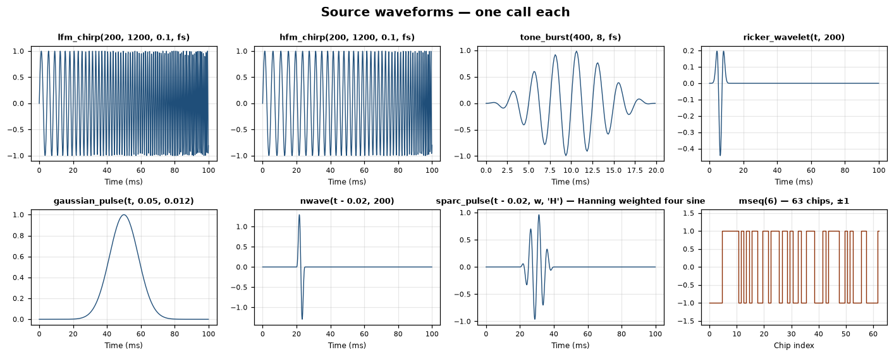
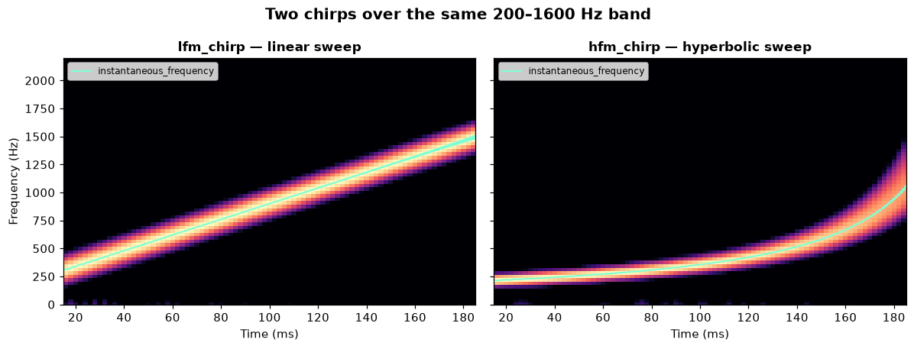
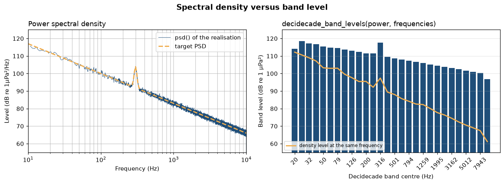
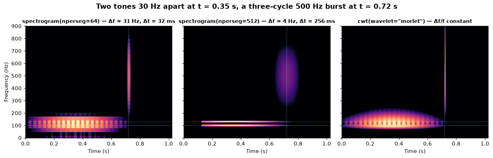
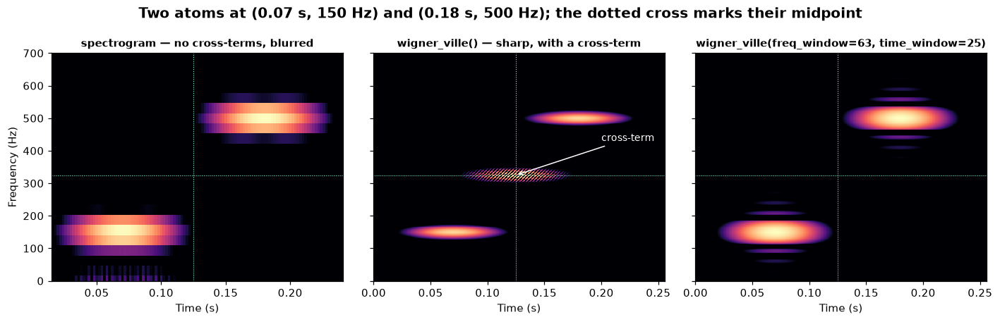
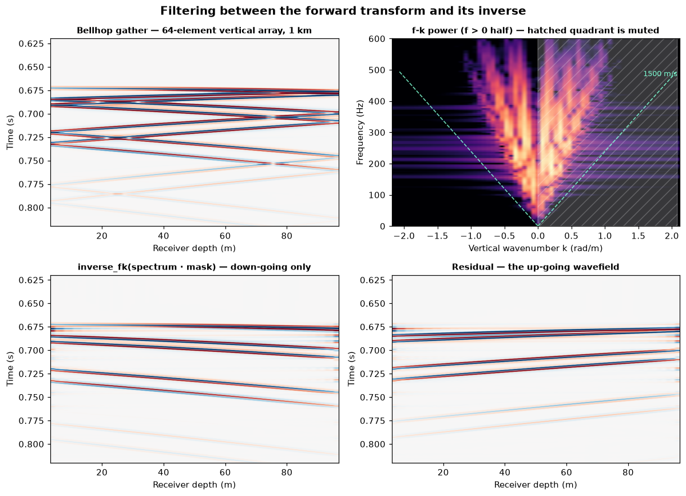
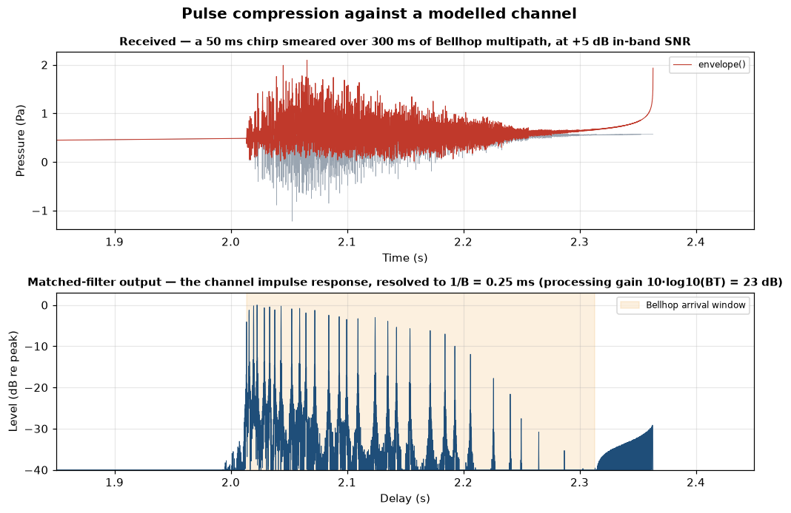
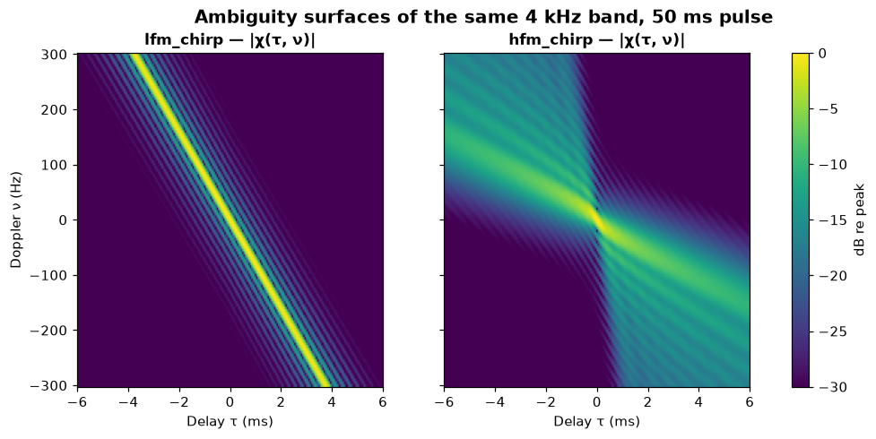
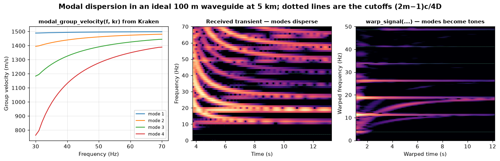

# Signal processing — what you do with a waveform

> `uacpy.acoustic_signal` · waveform generation · spectra and levels ·
> time-frequency · gather transforms · active sonar · channel simulation ·
> noise synthesis

A propagation model gives you a field, a set of arrivals or a transfer
function. This page is about everything you do either side of that: building
the waveform you transmit, and taking apart the record that comes back.

The package is called `acoustic_signal` rather than `signal` so it cannot
collide with Python's standard-library module of that name. Nothing here is
re-exported onto `uacpy.*`; you import from the sub-package:

```python
from uacpy.acoustic_signal import lfm_chirp, psd, spectrogram, matched_filter
```

Array processing — steering vectors, conventional and MVDR beamforming, MUSIC —
also lives under `uacpy.acoustic_signal.arrays`, but it is documented in
[`arrays.md`](arrays.md). The sonar equation, detection theory and matched-field
processing are in [`sonar.md`](sonar.md).

---

## 1. How the package is laid out

| Sub-module | What it holds |
|---|---|
| `waveforms` | deterministic pulses: chirps, tone bursts, Ricker, Gaussian, N-wave, the SPARC pulse library |
| `sequences` | m-sequences, BPSK modulation, the m-sequence channel probe |
| `noise_synthesis` | PSD-to-time-series realisation, band-limited noise, SNR mixing, Fourier synthesis |
| `analysis` | `psd`, `ppsd`, `sel` — spectral and level estimators |
| `bands` | decidecade (ISO 18405) band edges and band levels |
| `timefreq` | Hilbert, spectrogram, wavelet, Wigner-Ville, cepstrum |
| `constant_q` | geometric-frequency (constant-Q) transform, PSD, spectrogram, PPSD |
| `transforms` | f-k, tau-p, Radon gather transforms **and their inverses** |
| `active` | matched filter, pulse compression, processing gain, ambiguity |
| `channel` | impulse response and received-signal simulation |
| `modal` | modal group velocity, waveguide warping |
| `system_id` | `FRF` — frequency-response-function estimation |
| `arrays` | beamforming — see [`arrays.md`](arrays.md) |

Three conventions hold across all of it:

**Everything is a pure function.** No estimator carries state, and none of them
plot. A transform takes arrays and keyword arguments and returns arrays, or a
small data-only namedtuple (`PSDResult`, `FKResult`, `AmbiguityResult` …) that
unpacks positionally:

```python
frequencies, power = psd(x, fs)
f, t, Sxx = spectrogram(x, fs, nperseg=1024)
```

`FRF` is the single exception — it is a class because it carries a fitted model.

**Levels are reference-free until the last step.** `psd` returns Pa²/Hz and
`sel` returns Pa²·s, both linear. The reference pressure enters only where a dB
number is actually formed: `decidecade_band_levels(..., ref=)`, `ppsd(ref=)`,
and the plotters. That way an estimate never carries a hidden `1 µPa` baked
into it.

**Plotting lives elsewhere.** Every estimator here has a matching drawer in
[`uacpy.visualization`](plotting.md) — `plot_psd`, `plot_spectrogram`,
`plot_fk`, `plot_ambiguity`, `plot_cwt`, `plot_wigner_ville`,
`plot_band_levels`, and so on — which consume exactly what the estimator
returned.

---

## 2. Waveforms

One return convention throughout. A generator that owns its own sampling
returns `(time, signal)` — time first, matching the channel and synthesis
helpers — while one you evaluate on a time vector you already have returns just
the signal.

| Call | Returns | Notes |
|---|---|---|
| `lfm_chirp(fmin, fmax, duration, sample_rate)` | `(t, s)` | linear sweep; instantaneous frequency ramps `fmin → fmax` |
| `hfm_chirp(fmin, fmax, duration, sample_rate)` | `(t, s)` | hyperbolic sweep, a.k.a. linear period modulation |
| `tone_burst(frequency, n_cycles, sample_rate, window=True)` | `(t, s)` | Hann-gated by default; `window=False` for a hard gate |
| `ricker_wavelet(time, frequency)` | `s` | second derivative of a Gaussian, AT centring `u = 2πFt − 8` |
| `gaussian_pulse(time, delay, duration)` | `s` | `exp(−((t − delay)/duration)²)` |
| `nwave(time, frequency)` | `s` | `sin(ωt) − ½sin(2ωt)`, forced to zero outside `[0, 1/f]` |
| `sparc_pulse(t, omega, pulse_type)` | `(s, title)` | the 11-shape SPARC library; `omega` is **rad/s**, and the second return is the shape's name |
| `mseq(m)` | `s` | maximum-length sequence, `2**m − 1` chips of ±1, `2 ≤ m ≤ 15` |
| `bpsk_modulate(chips, fc, sample_rate, chips_per_sec)` | `s` | one carrier cycle-block per chip; requires an integer `sample_rate / chips_per_sec` |
| `make_mseq_probe(fmin, fmax, sample_rate, T_tot)` | `probe` | 0.2 s leader + whole periods of `mseq(10)`, BPSK'd at `(fmin + fmax)/2`, zero-filled to exactly `round(T_tot · sample_rate)` samples |

```python
import numpy as np
from uacpy.acoustic_signal import (
    lfm_chirp, hfm_chirp, tone_burst, ricker_wavelet,
    gaussian_pulse, nwave, sparc_pulse, mseq,
)

fs = 8000.0
t = np.arange(int(0.10 * fs)) / fs

t_lfm, lfm = lfm_chirp(200.0, 1200.0, 0.10, fs)
t_hfm, hfm = hfm_chirp(200.0, 1200.0, 0.10, fs)
t_burst, burst = tone_burst(400.0, 8, fs)
ricker = ricker_wavelet(t, 200.0)
gauss = gaussian_pulse(t, delay=0.05, duration=0.012)
nw = nwave(t - 0.02, 200.0)
hann4, hann4_title = sparc_pulse(t - 0.02, 2 * np.pi * 200.0, 'H')
chips = mseq(6)
```



Reading the panels: both chirps fill the same 100 ms and the same band, but the
LFM's oscillation tightens at a steady rate while the HFM lingers at the low
end and crams the top of the band into its last 20 ms. The tone burst is eight
cycles of 400 Hz under a Hann taper. The Ricker's main lobe is **negative**
(≈ −0.44) with positive side lobes — that is the sign the AT `Ricker.m`
convention gives, and it is worth knowing before you go looking for a bug. The
N-wave and the Hanning-weighted four-sine both sit inside their finite support
and are identically zero outside it; the argument `t - 0.02` is what places them
at 20 ms, since both are defined from `t = 0`. `mseq(6)` is 63 chips, not 64.

### The two chirps, and where their frequency actually is

```python
from uacpy.acoustic_signal import spectrogram, instantaneous_frequency

t_lfm, lfm = lfm_chirp(200.0, 1600.0, 0.20, fs)
t_hfm, hfm = hfm_chirp(200.0, 1600.0, 0.20, fs)

f, t_spec, Sxx = spectrogram(lfm, fs, nperseg=256, noverlap=240)
f_inst = instantaneous_frequency(lfm, fs)
```



The cyan trace is `instantaneous_frequency`, which differentiates the unwrapped
analytic-signal phase; it lands on the spectrogram ridge in both panels, which
is the point — it is an independent estimate, not a replot of the design law.
The LFM ridge is a straight line. The HFM ridge is not: it spends most of the
pulse below 500 Hz and sweeps the upper half of the band in the last fifth of
the duration. That asymmetry is why the two waveforms behave so differently
under Doppler — see [§7](#7-active-sonar).

The end-of-record excursions are trimmed from the trace on purpose: a phase
derivative taken by centred differences is meaningless where the signal has
just switched on or off.

There is a second caveat, and in the ocean it bites harder. The analytic-signal
instantaneous frequency is only meaningful for a *monocomponent* record like
these chirps. Give it two equal tones at 100 and 130 Hz and it returns 115 Hz —
their mean, which is neither of them and is not a frequency present in the
signal. A multipath or multimode arrival is multicomponent by definition, so
separate the components first — with `spectrogram`, `cwt` or
[`warp_signal`](#8-modal-dispersion-and-warping) — and take the instantaneous
frequency of each.

---

## 3. Spectra, levels and bands

| Call | Returns | Units |
|---|---|---|
| `psd(data, sample_rate, *, window='hann', nperseg=8192, noverlap=None, nfft=None, scaling='density')` | `PSDResult(frequencies, power)` | Pa²/Hz, linear |
| `ppsd(data, sample_rate, *, seg_duration=1.0, overlap_pct=50, ddB=1.0, …, ref=1e-6)` | `PPSDResult(frequencies, level_edges, pdf, mean_db, std_db, binwidth_db, seg_duration)` | dB histogram per frequency |
| `sel(data, sample_rate, *, fmin=8.9125, fmax=22387, band_type='third_octave', num_bands=30, …)` | `SELResult(sel_pa2s, bands)` | Pa²·s, linear; `plot_sel(ref=1e-6)` gives dB re 1 µPa²·s |
| `decidecade_bands(f_low, f_high)` | `(lower, centers, upper)` | Hz |
| `decidecade_band_levels(psd, frequencies, ref=1e-6)` | `(centers, levels)` | dB re `ref²` |

`ppsd` accepts a 1-D signal, a 2-D block (longer axis is time), or a list of
1-D arrays; the list form is the unambiguous one. Its constant-Q counterpart is
`probabilistic_constant_q`.

`scaling='density'` (the default) gives Pa²/Hz and is independent of `nperseg`
and of the window — the right choice for noise. `scaling='spectrum'` gives
per-bin power instead, which is the right choice for a tone and which moves with
`nperseg`. Either way a Hann window's noise-equivalent bandwidth is 1.5 bins, so
a tone falling between bins reads about a decibel low; that is the estimator,
not the signal.

### Decidecade is the base-10 third-octave, not the base-2 one

`decidecade_bands` implements the IEC 61260-1 / ISO 18405 **base-10** system:
centre frequencies are `1000 · 10^(n/10)`, band edges are `centre · 10^(±1/20)`,
and a band is therefore `10^(1/10)` wide — one tenth of a decade, or 0.3322
octave. This is the convention underwater soundscape and ship-radiated-noise
reporting uses, and it is also where the familiar third-octave centre
frequencies come from: the standard series is built on powers of `10^(1/10)`,
which is why 1, 10, 100 and 1000 Hz all land on band centres.

`sel`'s `band_type='third_octave'` is the **base-2** system instead, `2^(1/3)`
wide (0.3333 octave) on `2^(±1/6)` edges. The two are close, deliberately
different, and not interchangeable in a report.

### Density versus band level

```python
from uacpy.acoustic_signal import synthesize_noise_from_psd, psd, decidecade_band_levels
from uacpy.visualization import plot_psd, plot_band_levels

# A target soundscape: −17 dB/decade with a narrow 300 Hz tonal on top.
rng = np.random.default_rng(0)
f_target = np.logspace(np.log10(10.0), np.log10(10_000.0), 200)
level_db = 100.0 - 17.0 * np.log10(f_target / 100.0)
level_db += 12.0 * np.exp(-0.5 * ((np.log10(f_target / 300.0)) / 0.02) ** 2)
target = 1e-12 * 10.0 ** (level_db / 10.0)          # Pa²/Hz

_, x, fs = synthesize_noise_from_psd(
    target, f_target, duration=30.0, sample_rate=25_000,
    n_fft=65536, interp='log', rng=rng)

frequencies, power = psd(x, fs, nperseg=32768)
band = (frequencies >= 20.0) & (frequencies <= 11_000.0)
centers, levels = decidecade_band_levels(power[band], frequencies[band])

plot_psd(frequencies, power, label='psd() of the realisation', ymin=55, ymax=125)
plot_band_levels(centers, levels)
```



The left panel is the check that the synthesis worked: the realisation's Welch
PSD sits on the target across three decades, tonal included. The right panel is
the same data as 28 decidecade band levels, with the *density* level at each
band centre drawn over the bars.

The bars are higher, and the gap widens with frequency — from about 7 dB at the
25 Hz band to about 33 dB at the 7.9 kHz band. That gap is `10·log10` of the
band's width in Hz, and a decidecade band's width is proportional to its centre
frequency — the `10^(±1/20)` edges above give `(10^(1/20) − 10^(−1/20)) · f =
0.2308 · f` — so it grows by 10 dB per decade. **A band level and a
density level are different quantities and are only equal in a 1 Hz band.**
The 316 Hz bar is the one visible departure from the smooth trend: that is the
tonal, whose energy is confined to one band and so survives integration intact.

The first and last bars read low. That is not an artefact of the estimator — the
PSD was sliced to 20 Hz–11 kHz before integration, so those two bands were only
partly covered and were integrated over the part they were given. Slice
generously, or trim the end bands.

`decidecade_band_levels` also warns, once, if any band straddled fewer than two
PSD grid points; those bands fall back to a rectangular `psd · bandwidth`
estimate rather than silently returning zero. If you see that warning, your PSD
grid is too coarse at the bottom of the band set — raise `nperseg`.

---

## 4. Time-frequency

| Call | Returns | Invertible? |
|---|---|---|
| `analytic_signal(data)` | complex analytic signal | — (raises on complex input) |
| `envelope(data)` | instantaneous amplitude, `abs(analytic_signal(data))` | no |
| `instantaneous_frequency(data, sample_rate)` | Hz, same length as `data` | no |
| `spectrogram(data, sample_rate, *, window='hann', nperseg=8192, noverlap=None, nfft=None, scaling='density', mode='psd')` | `SpectrogramResult(frequencies, times, power)` | no |
| `cwt(data, sample_rate, frequencies=None, wavelet='morlet', *, w0=6.0, order=None, n_freqs=64)` | `CWTResult(frequencies, coefficients)` | `inverse_cwt`, approximately |
| `wigner_ville(data, sample_rate, *, analytic=True, freq_window=None, time_window=None, nfft=None)` | `WignerVilleResult(frequencies, times, distribution)` | no |
| `cepstrum(data, *, window=None, nfft=None, lifter=None)` | real cepstrum | no — phase is discarded |
| `complex_cepstrum(data)` | **complex** cepstrum | `inverse_complex_cepstrum`, exactly |
| `constant_q_transform` / `_spectrogram` / `_psd` / `probabilistic_constant_q` | `CQTResult` / `CQSpectrogramResult` / `CQPSDResult` / `CQPPSDResult` | no |

`cwt` offers three analysing wavelets: `'morlet'` (complex, best frequency
resolution), `'paul'` (complex, best time resolution) and `'dog'` (real
derivative-of-Gaussian; `order=2` is the Mexican-hat). `inverse_cwt` uses the
Torrence & Compo eq.-11 reconstruction with constants derived for the order you
actually used, so a non-default `w0` or `order` still reconstructs at the right
amplitude — but a band-limited scale set only reconstructs its own band, which
is why the round trip is approximate rather than exact.

Two things `cwt` does not do for you. It does not check a `frequencies=` array
you supply against Nyquist — only the default grid is capped at `fs/2` — so
asking for 700 Hz at `fs = 1000` returns coefficients rather than an error, and
what comes back is numerical residue, not signal. And it returns no cone of
influence: within roughly `w0/(2πf)` of either end of the record the wavelet
runs off the data, so those coefficients are edge artefacts, worst at the lowest
frequency where the wavelet is longest. Nothing marks that region for you, so
give the record margin either side of the feature you care about.

The constant-Q family bins geometrically (`bins_per_octave=24` by default)
instead of linearly, which is the right resolution law for a soundscape spanning
decades. Each is the constant-Q analogue of its linear counterpart:
`constant_q_psd` ↔ `psd`, `constant_q_spectrogram` ↔ `spectrogram`,
`probabilistic_constant_q` ↔ `ppsd`.

### The resolution trade-off

You cannot buy time resolution and frequency resolution at once. The figure
measures that against a signal with a known answer: two tones 30 Hz apart
burst together at 0.35 s, and a three-cycle 500 Hz click at 0.72 s. The dotted
lines mark all three.

```python
f, t_spec, Sxx = spectrogram(sig, fs, nperseg=64,  noverlap=56)   # Δf ≈ 31 Hz
f, t_spec, Sxx = spectrogram(sig, fs, nperseg=512, noverlap=504)  # Δf ≈ 4 Hz
freqs, W = cwt(sig, fs, frequencies=np.logspace(np.log10(20.0),
                                                np.log10(900.0), 160))
```



The short window (left) places the click as a clean vertical line at 0.72 s but
smears the two tones into a single broad blob — 31 Hz bins cannot separate
peaks 30 Hz apart. The long window (middle) resolves the tones into two crisp
horizontal lines at 100 and 130 Hz and turns the click into a fat ellipse
spanning 0.25 s and 500 Hz. Same signal, same estimator, one parameter.

The wavelet (right) is **not** a way out of the trade — it is a different place
to stand in it, and the place moves with frequency. `Δf/f` is constant, so the
time resolution keeps improving as you go up: at 500 Hz the CWT places the click
in 3.7 ms against the short window's 11.7 ms (−3 dB widths, and the click's own
envelope is 2.0 ms), while at 100 Hz the tones are as merged as they were on the
left. The CWT buys time resolution at high frequency by giving up frequency
resolution there, which is the correct trade for transient arrivals and the
wrong one for closely spaced tonals.

### Wigner-Ville, cross-terms included

The Wigner-Ville distribution is not subject to the window trade-off that shapes
the panels above — there is no window to trade. That is not the same as beating
the uncertainty principle: for a Gaussian atom the distribution sits exactly on
the bound, `σ_t·σ_f = 1/(4π)`, which is the limit a windowed transform cannot
reach. What goes away is the estimator's own smearing, not the limit. It is a
quadratic energy distribution, and the price of the sharpness is an interference
term sitting between every pair of components.

```python
from uacpy.acoustic_signal import wigner_ville

f_w, t_w, W = wigner_ville(sig, fs)
f_p, t_p, P = wigner_ville(sig, fs, freq_window=63, time_window=25)
```



Two Gaussian-tapered atoms, at (0.07 s, 150 Hz) and (0.18 s, 500 Hz); the
dotted cross marks their midpoint. The spectrogram (left) shows two honest,
blurred blobs. `wigner_ville()` (middle) resolves both atoms to a fraction of
the spectrogram's footprint — and puts a third, oscillating blob at exactly
(0.125 s, 325 Hz), where there is no signal at all. That is the cross-term. It
is not noise and it is not a bug — it is what the quadratic kernel
`z(t+τ)z*(t−τ)` does to a two-component signal, and being deterministic it will
not go away by collecting more records. It does oscillate, and that is the
handle: the frequency marginal is exactly `|z(t)|²`, so the interference has to
integrate to nothing — equal positive and negative excursions.

`freq_window` (a lag-domain window — the *pseudo*-WVD) and `time_window` (a
time-domain smoothing — the *smoothed-pseudo*-WVD) trade it back. The right
panel applies both: the cross-term is gone, and the auto-terms have grown
noticeably in both directions and picked up side lobes. That is the actual
choice on offer — cross-terms or resolution — not a free lunch.

Two mechanical notes. `analytic=True` (the default) transforms real input to
its analytic signal first, which removes the cross-term between the positive
and negative halves of the spectrum before you start. And the kernel doubles
the apparent frequency, so the physical frequency axis is `k·fs/(2·NF)` — read
the axis the function returns, do not build your own.

`wigner_ville` loops over time samples in Python, so cost grows as `n²`. It is a
transient-analysis tool: 512 samples is comfortable, 50 000 is not.

### Cepstra

`cepstrum` is `irfft(log|rfft(x)|)` — the real cepstrum, useful for picking
echo delays and sub-bottom layer spacings, and **not** invertible, because
taking the magnitude throws the phase away. The mechanism is worth stating,
because it is what tells you how to read the axis: the log turns the channel's
convolution into a sum, an echo at delay `τ` ripples `log|X(f)|` with period
`1/τ`, and the inverse transform turns that ripple into a peak at quefrency `τ`.
Convolve a source with `δ(t) + 0.6·δ(t − τ)` and the peak lands exactly on `τ`.
`lifter` weights the quefrency axis: a positive int keeps the low quefrencies
(spectral envelope), a negative int zeroes them (excitation and echo structure),
and an array is applied element-wise.

`complex_cepstrum` keeps the unwrapped phase and therefore returns a complex
array — the imaginary part is significant, not a rounding artefact, and it is
exactly what `inverse_complex_cepstrum` needs. That pair round-trips to machine
precision, which is what makes homomorphic deconvolution possible: transform,
edit the quefrency domain, transform back.

---

## 5. Gather transforms, and why the inverses are free functions

Three duals decompose a `(n_time, n_space)` gather by apparent slowness or
wavenumber. Each has a standalone inverse.

| Forward | Returns | Inverse |
|---|---|---|
| `fk_transform(data, sample_rate, dx, *, nperseg=None, noverlap=None, window=None, nfft=None, normalize=False)` | `FKResult(frequencies, wavenumbers, power, spectrum)` | `inverse_fk(spectrum)` |
| `taup_transform(data, sample_rate, dx, slownesses=None, n_slowness=201, p_max=None, *, window=None, nfft=None)` | `TauPResult(slownesses, taus, panel)` | `inverse_taup(taup, slownesses, sample_rate, dx, nx)` |
| `radon_transform(data, sample_rate, dx, moveout, kind='linear', x0=0.0)` | `RadonResult(moveout, taus, panel)` | `inverse_radon(R, sample_rate, dx, moveout, nx, kind='linear', x0=0.0)` |

`radon_transform` scans three moveout families: `'linear'` (`t = τ + p·x`,
`moveout` is slowness in s/m — the tau-p slant stack), `'parabolic'`
(`t = τ + q·x²`, s/m²) and `'hyperbolic'` (`t = √(τ² + (x/v)²)`, m/s).

**The design rule: an inverse is a function of coefficients, never a method on
the forward result.** There is no `fk.inverse()`. `inverse_fk` takes a
spectrum — and it does not care whether that spectrum is the one
`fk_transform` handed you or one you have since muted, weighted or replaced.
That is the entire point. A gather transform is almost never an end in itself;
you run it *in order to* edit the coefficients and come back. Binding the
inverse to the forward object would make the round trip the default and the
filter the awkward case, which is backwards.

`inverse_fk` is a true inverse and round-trips to machine precision.
`inverse_taup` and `inverse_radon` are adjoints — back-projections, not
least-squares inverses. Two things follow, and the amplitude one shows up first:
the adjoint carries no normalisation, so a round trip comes back scaled by
roughly the number of slowness or moveout traces you asked for — a few hundred
on the default axis — and it is band-limited on top of that. Fit a scalar if you
need amplitudes back; do not read either effect as a bug.

### Filtering between the two

```python
from uacpy.acoustic_signal import fk_transform, inverse_fk
from uacpy.visualization import draw_sound_cone

# gather: (n_time, n_depth) from a Bellhop TIME_SERIES run on a 64-element
# vertical array at 1 km; dz is the element spacing.
frequencies, wavenumbers, power, spectrum = fk_transform(gather, fs, dz)

kk, ff = np.meshgrid(wavenumbers, frequencies)
mask = np.ones_like(power)
mask[(ff > 0) & (kk > 0)] = 0.0
mask[(ff < 0) & (kk < 0)] = 0.0
down = inverse_fk(spectrum * mask)
```



The gather (top left) is a criss-cross: some events arrive later at deeper
phones, some earlier. In f-k (top right) they separate into the two
half-planes, the coherent energy falling inside the 1500 m/s sound cone that
`draw_sound_cone` marks (what lies outside it is low-level speckle).
Muting the hatched quadrant and inverting gives a panel (bottom left) in which
every event dips the same way — later with increasing depth, which is a
down-going wave. Subtracting it from the original leaves the complement (bottom
right), where every event arrives *earlier* at deeper phones. One transform,
one mask, one inverse.

**Sign convention.** `wavenumbers` is the **angular** wavenumber `k = 2πν` in
rad/m, matching the `k = ω/c` convention the propagation models use, so a wave
of speed `c` lies on the line `ω = c·k`. A linear event `t = t₀ + p·z` maps to
`k = −2πf·p`, so for `f > 0` the down-going half (`p > 0`, later at greater
depth) is `k < 0`. Muting `k > 0` for `f > 0`, and its conjugate `k < 0` for
`f < 0`, is what keeps the down-going field. Get the conjugate quadrant wrong
and `inverse_fk` returns a complex-symmetry-violating panel that no longer
means anything.

**Invertibility is a property of how you called the forward transform.**
`fk_transform` with `nperseg=None` (the default) uses the whole record as one
segment and returns that segment's complex panel in `spectrum`. Set an
`nperseg`/`noverlap` pair that fits more than one block and it Welch-averages
`|FK|²` across them — a far better power estimator, since a single-snapshot f-k
panel is inconsistent — but an averaged power panel has no single phase, so
`spectrum` comes back `None`. A setting that still yields a single block keeps
the phase and stays invertible: on a 256-sample record `nperseg=200` returns a
panel, `nperseg=128` returns `None`. Ask `inverse_fk` to invert a `None` and it
says so explicitly rather than guessing:

```
ConfigurationError: inverse_fk: spectrum is None — an f-k panel averaged over
more than one segment has no phase and cannot be inverted. Re-run fk_transform
with nperseg=None for an invertible spectrum.
```

It also refuses the whole `FKResult` tuple, since the fourth field is what it
wants. Decide up front whether you are estimating power or filtering.

---

## 6. From arrivals to a received signal

| Call | Returns | Use |
|---|---|---|
| `impulse_response(amplitudes, delays_s, sample_rate, *, n_samples=None, fractional=True)` | `(t, h)` | discrete arrivals → channel IR |
| `simulate_reception(transmit, amplitudes, delays_s, sample_rate)` | `(t, received)` | transmit waveform convolved with that IR |
| `impulse_response_from_transfer_function(H, frequencies, sample_rate, n_samples=None)` | `(t, h)` | one-sided `H(f)` → real IR |

`fractional=True` splits each arrival's amplitude linearly between the two
nearest samples, so a delay is not quantised to the sample grid; `False` snaps
to the nearest sample. `amplitudes` may be complex, in which case `h` is too —
which is how you carry a Bellhop arrival's phase:

```python
from uacpy.acoustic_signal import analytic_signal, simulate_reception

arr = Bellhop(n_beams=6000, alpha=(-60.0, 60.0)).run(
    env, source, point, run_mode=RunMode.ARRIVALS)

taps = arr.amplitudes * np.exp(1j * arr.phases)
_, rx = simulate_reception(analytic_signal(tx), taps, arr.delays, fs)
rx = np.real(rx)
```

[`Arrivals`](results.md#7-the-other-result-types) is exactly the
`(amplitudes, phases, delays)` triple these functions want, which is why a
Bellhop `ARRIVALS` run drops straight in. The same machinery underpins
[`uacpy.comms`](comms.md)'s replay benchmarks.

`impulse_response_from_transfer_function` resamples `H` onto the uniform DFT
grid over `[0, fs/2]` and inverse-transforms. Grid bins outside
`[frequencies[0], frequencies[-1]]` are set to **zero**, not extrapolated: a
band-limited model result carries no out-of-band energy, and holding the edge
value would fabricate a DC or high-frequency plateau in the impulse response.
It is the raw-array route; if you are holding a `Field` from a `BROADBAND` run,
prefer [`Field.to_time_trace()` /
`Field.synthesize_time_series()`](results.md#6-from-hf-to-pt), which handle bin
placement, windowing and grid-independent amplitude for you.

---

## 7. Active sonar

| Call | Returns | Notes |
|---|---|---|
| `matched_filter(received, replica, *, mode='full', normalize=True)` | ndarray | correlates against the conjugated, time-reversed replica; complex input supported |
| `pulse_compression(received, replica, sample_rate, *, normalize=True)` | `(lags_s, compressed)` | the same, with a delay axis in seconds |
| `processing_gain(bandwidth_hz, duration_s)` | float, dB | `10·log10(B·T)`; `bandwidth_hz` is the **waveform's** bandwidth, not the receiver's, so a CW pulse (`B ≈ 1/T`) correctly returns 0 dB |
| `ambiguity_function(waveform, sample_rate, *, doppler_hz=None, n_doppler=101)` | `AmbiguityResult(delays_s, doppler_hz, amplitude)` | narrowband `\|χ(τ, ν)\|`, normalised to 1 at the origin |

`normalize=True` divides by the replica energy, so a perfectly matched
unit-amplitude echo compresses to unit peak. Feed both arguments as analytic
signals for bandpass data — `matched_filter` handles complex input, and the
envelope of a real correlation is what you actually want to peak-pick.

### Compressing a chirp back out of a modelled channel

```python
from uacpy.acoustic_signal import (
    lfm_chirp, analytic_signal, simulate_reception, add_noise,
    envelope, pulse_compression, processing_gain,
)

fs = 20_000.0
fmin, fmax, T = 1000.0, 5000.0, 0.05
_, tx = lfm_chirp(fmin, fmax, T, fs)

taps = arr.amplitudes * np.exp(1j * arr.phases)
_, rx = simulate_reception(analytic_signal(tx), taps, arr.delays, fs)
noisy = add_noise(np.real(rx), fs, source_level=180.0, noise_level=72.0,
                  fc=3000.0, bandwidth=4000.0, rng=rng)

lags, comp = pulse_compression(analytic_signal(noisy), analytic_signal(tx), fs)
gain = processing_gain(fmax - fmin, T)          # 23 dB
```



The channel is a real Bellhop solve, not a drawn one: 332 arrivals spread over
300 ms at 3 km. The top panel is what a hydrophone sees — a 50 ms transmission
smeared across six times its own duration and buried at about +2 dB in-band
SNR, with `envelope()` in red. There is nothing in it you could call an arrival.

The bottom panel is the same record after correlation with the replica. The
arrival structure appears inside the Bellhop delay window and nowhere else: the
strongest peaks stand about 24 dB above the median correlation floor that fills
the delay axis on either side. Each spike is resolved to `1/B = 0.25 ms`, and the
processing gain is `10·log10(B·T) = 23 dB` — bought purely by spreading the
same energy over 50 ms of sweep instead of 0.25 ms of pulse. Those two decibel
figures are not the same quantity and only look alike here. Processing gain is
the *ratio* of output SNR to input SNR, not a level you can read off the output
trace; it lands next to the peak-to-floor figure only because this record went
in at about +2 dB.

Note what the resolution buys and what it does not. `1/B` sets how finely two
paths can be told apart; it does not thin out the 332 of them, which is why the
window is a picket fence rather than a handful of clean stems.

### Ambiguity: what a waveform costs you

```python
from uacpy.acoustic_signal import ambiguity_function

doppler = np.linspace(-300.0, 300.0, 121)
delays, dop, chi = ambiguity_function(analytic_signal(lfm), fs, doppler_hz=doppler)
```



Same band, same duration, two waveforms. The LFM's surface is a knife-edge
ridge through the origin, and it is *straight*: the peak stays within 0.7 dB of
full amplitude all the way to ±300 Hz, but it slides in delay at exactly
−12.5 µs/Hz. That number is `−T/B = −1/(sweep rate)`, and it is the classic
range-Doppler coupling — an LFM never loses a Doppler-shifted echo, it
**mis-ranges** it. At ±300 Hz that is a 3.75 ms bias, fifteen resolution cells.

The HFM's surface is a broad X. Under this narrowband model its response spreads
along both diagonals and loses 13 dB by ±300 Hz, so the picture is not the
"HFM is Doppler-tolerant" story you may be expecting — and that is worth being
precise about. `ambiguity_function` computes the **narrowband** surface, where
Doppler is modelled as a pure frequency shift `exp(j2πνt)`. The HFM's celebrated
tolerance is tolerance to a *time-scale change*, which is what wideband Doppler
actually is and which a frequency-shift kernel does not represent. Read this
figure as what it is: the frequency-shift ambiguity of two waveforms. For a
moving target with a genuine scale factor, simulate the scaling.

The default Doppler span, when you leave `doppler_hz` unset, is `n_doppler`
points across ±`sample_rate/20`.

---

## 8. Modal dispersion and warping

| Call | Returns | Notes |
|---|---|---|
| `modal_group_velocity(frequencies, k_horizontal)` | m/s, same shape as `k_horizontal` | `dω/dk_r` by finite difference; `frequencies` must be strictly increasing, `k_horizontal` is `(n_freq,)` or `(n_freq, n_modes)` |
| `warp_signal(signal, sample_rate, range_m, c=1500.0)` | `(warped, t_warp)` | `t_w = √(t² − t_r²)`, `t_r = range/c` |
| `unwarp_signal(warped, t_warp, sample_rate, range_m, c=1500.0)` | `(signal, t)` | back onto the original grid |

`warp_signal` assumes `signal` **starts at the direct arrival** `t_r = range/c`.
Feed it a record that starts earlier and the warp is meaningless; slice first.
The warped axis is not uniformly sampled in the original time, so read the
warped sample rate off `t_warp` rather than assuming it equals `sample_rate`.

```python
from uacpy.acoustic_signal import (
    modal_group_velocity, impulse_response_from_transfer_function, warp_signal,
)

# Ideal 100 m isovelocity waveguide, perfectly rigid seabed, receiver at 5 km.
kr = [Kraken().compute_modes(env, uacpy.Source(depths=20.0,
                                               frequencies=float(f))).k
      for f in sweep]
v_group = modal_group_velocity(sweep, k_matrix)

H = Kraken().run(env, uacpy.Source(depths=20.0, frequencies=frequencies),
                 uacpy.Receiver(depths=50.0, ranges=5000.0),
                 run_mode=RunMode.BROADBAND)
_, h = impulse_response_from_transfer_function(
    np.asarray(H.data).ravel(), frequencies, fs, n)

arrival = h[int(round(range_m / c * fs)):]
warped, t_warp = warp_signal(arrival, fs, range_m, c)
fs_warp = 1.0 / float(t_warp[1] - t_warp[0])
```



Left: group velocity per mode, computed from Kraken's own wavenumbers across a
30–70 Hz sweep. Four modes, because that is how many the 100 m rigid-bottom
guide supports at 30 Hz — mode `m` cuts on at `(2m−1)·c/4D`, giving 3.75, 11.25,
18.75 and 26.25 Hz below 30 Hz. Mode 1 is nearly non-dispersive at 1490–1500
m/s; mode 4 runs at 760 m/s near its cutoff and has still not caught up by
70 Hz. That spread is the dispersion.

Middle: the transient that produces. Each mode traces a curve that starts high
and sweeps down toward its own cutoff (the dotted lines), arriving over nine
seconds of record from a source that was impulsive.

Right: the same transient after `warp_signal`. The curves are now horizontal
lines, each sitting on the cutoff frequency of its mode. That is the whole
trick — `t_w = √(t² − t_r²)` is exactly the change of variable that linearises
ideal-waveguide dispersion, so a single hydrophone can separate modes that
overlap in both time and frequency. From there, mode-by-mode filtering in the
warped domain and `unwarp_signal` back is the standard single-receiver
source-range and geoacoustic-inversion route (Bonnel et al., JASA 134(2), 2013).

The warping is derived for the **ideal** waveguide. A real profile and a lossy
seabed blur the tones; they do not sit as cleanly on the cutoffs as they do
here, which is why the figure uses a rigid bottom and isovelocity water.

---

## 9. Noise synthesis

| Call | Returns | Notes |
|---|---|---|
| `synthesize_noise_from_psd(Pxx, Fxx, duration=1, scale=1, *, n_fft=65536, sample_rate=None, interp='linear', rng=None)` | `(t, x, sample_rate)` | realise a time series matching a target one-sided PSD |
| `make_bandlimited_noise(fc, bandwidth, duration, sample_rate, *, rng=None)` | `(noise, t)` | **unit-RMS** band-limited Gaussian noise |
| `make_noise_waveform(fc, bandwidth_hz, T, sample_rate, *, rng=None)` | `(nts, t)` | heterodyned band-limited noise probe |
| `add_noise(timeseries, sample_rate, source_level, noise_level, fc, bandwidth, *, rng=None)` | ndarray | scale a 0 dB-source record by `source_level` and add noise at `noise_level` |
| `fourier_synthesis(pressure_freq, frequencies, source_spectrum=None, Tstart=0.0)` | `(rmod, time)` | AT `stack.m` — raw-DFT synthesis on the input frequency grid |

`synthesize_noise_from_psd` resamples the target onto the FFT-native grid, so
`Fxx` may be uniform, log-spaced or coarse — Wenz curves drop straight in. Use
`interp='log'` for anything spanning decades; linear interpolation of a
steep PSD in linear frequency will not track it. Frequencies outside
`[Fxx[0], Fxx[-1]]` are zero. `n_fft` must be an even power of two in
`[16, 262144]`; anything else is clamped or rounded **with a warning** rather
than silently accepted.

`add_noise` takes `source_level` as a total-power dB figure and `noise_level`
as a **power spectral density**, and the two are not interchangeable. It scales
the input by `10^(SL/20)` — so the input is expected to be a 0 dB-source record
— and adds noise whose in-band density is exactly `noise_level`. Getting that
exact is why `make_bandlimited_noise` returns unit-RMS noise: the scaling uses
the zero-phase filter's *noise-equivalent* bandwidth, which is narrower than
the nominal −3 dB `bandwidth`, so the density lands where you asked rather than
a decibel or two under. Both levels are dB on whatever reference *you* are
working in: `add_noise` only ever forms `10^(SL/20)` and `10^(NL/10)`, with no
reference constant anywhere in it, so it is reference-free like the rest of the
package. The one rule is that the two share a reference — read them as dB re
1 µPa and dB re 1 µPa²/Hz and the output is in µPa, which is why the
pulse-compression figure above divides by 10⁶ to label its axis in Pa. For a
multi-channel input (`(n_samples, n_receivers)`) each column gets an independent
realisation, so cross-channel noise correlation is zero — which is what
array-gain claims in [`arrays.md`](arrays.md) depend on.

Pass `rng=np.random.default_rng(seed)` to every one of these for a reproducible
realisation.

`fourier_synthesis` is a direct translation of AT's `stack.m` and exists for
externally produced spectra: raw-DFT scaling, output grid fixed by the input
frequency grid. It warns if `frequencies[0] > 0` while `Tstart=0`, because that
combination puts a phase ramp through the synthesised trace. For a uacpy
`Field`, use [`synthesize_time_series`](results.md#6-from-hf-to-pt) instead.

Physical noise *models* — Wenz curves, wind, shipping, rain, thermal — are in
[`noise.md`](noise.md). This section is only the synthesis machinery that turns
a spectrum into samples.

---

## 10. System identification — `FRF`

`FRF` is the one class in the package, because it holds a fitted model.

```python
from uacpy.acoustic_signal import FRF

frf = FRF(method='ls_fir')
frequencies, tf = frf.compute(x, y, sample_rate, m='CP')
```

| Constructor | Default | Meaning |
|---|---|---|
| `method` | `'welch'` | `'welch'` (stationary, gives coherence), `'etfe'` (whole-record ratio), `'p_etfe'` (period-averaged ETFE), `'ls_fir'` (least-squares impulse response) |
| `estimator` | `'H1'` | `'H1'` = `Sxy/Sxx`, minimises output-noise bias; `'H2'` = `Syy/Syx`, minimises input-noise bias |
| `m` | `512` | FIR length for `'ls_fir'` — **or** an order-selection criterion |

`compute(x, y, sample_rate, m=…, method=…, estimator=…, nperseg=…, noverlap=…, m_max=4096, stop_count=None)`
returns `(frequencies, tf)` and accepts 1-D inputs or 2-D blocks of rows, in
which case the transfer functions are averaged over measurements.

**`m` holds the criterion; the chosen order is published separately.** Pass
`m='AIC'`, `'BIC'`, `'FPE'` or `'CP'` and `FRF` searches FIR orders up to
`m_max`, stopping early after `stop_count` consecutive non-improvements. The
attribute `m` still reads back as the criterion string you asked for — the
order the search actually settled on is on `selected_order`:

```python
>>> frf = FRF(method='ls_fir')
>>> frequencies, tf = frf.compute(u, y, 1000.0, m='CP')
>>> frf.m
'CP'
>>> frf.selected_order
4
>>> frf.g[:4]
array([ 1. , -0.6,  0.3,  0.1])
```

Read `selected_order` when you want to know what the fit did; read `m` when you
want to know what you asked for. `selected_order` is `None` for every method
other than `'ls_fir'`.

After a run the object also carries `frequencies`, `tf`, `g` (the impulse
response, `'ls_fir'` only) and `coh` (coherence, `'welch'` only). Every call
rewrites all of them, so a reused `FRF` cannot report a previous method's
result. Draw them with `plot_frf`, `plot_coherence` and
`plot_impulse_response_info`.

---

## 11. Gotchas

**Nothing here is on `uacpy.*`.** Import from `uacpy.acoustic_signal`.

**`psd` and `sel` do not agree at DC, on purpose.** Welch detrends the constant
component of every segment, so `psd`'s DC bin is suppressed. `sel` uses a
boxcar window with no overlap and no detrending, because that is the only way
the summed PSD equals the band exposure exactly (Parseval). Do not "fix" `sel`
by giving it a smoothing window — it would corrupt the energy identity.

**A band level is not a density level.** They differ by `10·log10(bandwidth)`,
which for decidecade bands is proportional to the centre frequency. See
[§3](#3-spectra-levels-and-bands).

**`analytic_signal` refuses complex input.** The Hilbert representation is
defined for a real signal; handing it something already analytic is a mistake
the function will not guess its way past. Same for `cepstrum` and
`complex_cepstrum`.

**`spectrogram` and `psd` default to `nperseg=8192`.** That is right for a long
soundscape record and far too long for a transient. Scipy clamps `nperseg` to
the input length rather than raising, so a short signal comes back as a single
frame with a `UserWarning` — which you will miss if your warning filters are
turned down. Set `nperseg` deliberately.

**An f-k panel is invertible only when it came from one segment.** Setting
`nperseg` so that more than one block fits buys a consistent power estimate and
costs you `spectrum`, which comes back `None`. See
[§5](#5-gather-transforms-and-why-the-inverses-are-free-functions).

**`inverse_taup` and `inverse_radon` are adjoints, not inverses.** A round trip
comes back unnormalised and band-limited by construction. `inverse_fk` is the
exact one.

**`wigner_ville` cross-terms are real output, not artefacts to be ignored.**
Every pair of components contributes one, at their midpoint. If you need a
picture you can hand to someone else, smooth it and accept the resolution loss.

**`ambiguity_function` is the narrowband surface.** Doppler is a frequency
shift in that model, not a time-scale change. Do not read wideband Doppler
tolerance off it.

**`warp_signal` wants a record starting at the direct arrival**, and the warped
time axis it returns is not sampled at the input rate. Take `fs_warp` from
`t_warp`.

**Seed your generators.** `add_noise`, `make_bandlimited_noise`,
`make_noise_waveform` and `synthesize_noise_from_psd` all take `rng=`. Without
it a figure or a test is irreproducible.

---

## 12. Where this connects

- **Getting a record to process** — [results](results.md) for `Field`,
  `Arrivals` and the `H(f) → p(t)` path; [Bellhop](../models/bellhop.md) for
  arrivals and time series; [SPARC](../models/sparc.md) for `p(t)` natively.
- **Drawing any of it** — [plotting](plotting.md); every estimator on this page
  has a matching `plot_*` in `uacpy.visualization`.
- **Arrays** — [array processing](arrays.md) for beamforming, MVDR and MUSIC,
  which share the `arrays` sub-module with this page's estimators.
- **Sonar** — [sonar](sonar.md) for the sonar equation, detection theory and
  matched-field processing; this page supplies the waveform and the
  processing gain that feed it.
- **Communications** — [comms](comms.md), which builds on `simulate_reception`
  and the coded sequences here.
- **Noise** — [noise](noise.md) for the physical spectra that
  `synthesize_noise_from_psd` realises.
- **Geometry and water** — [environment](environment.md),
  [source and receiver](source-receiver.md).
- **Files** — [I/O](io.md) for reading recorded data in;
  [utilities](utilities.md) for the rest.

Every figure on this page comes from
[`docs/figure_scripts/signal.py`](../figure_scripts/signal.py) — the code above
is that code, so it cannot drift from what you see.

---

**See also:** [guide index](../README.md) · [array processing](arrays.md) ·
[sonar](sonar.md) · [reference](../../DOCUMENTATION.md)
