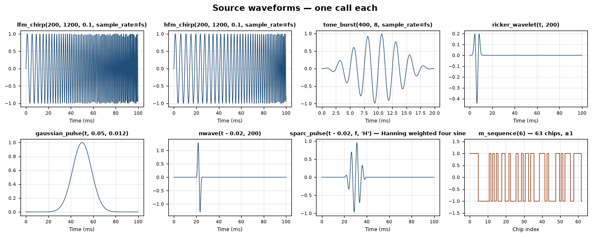
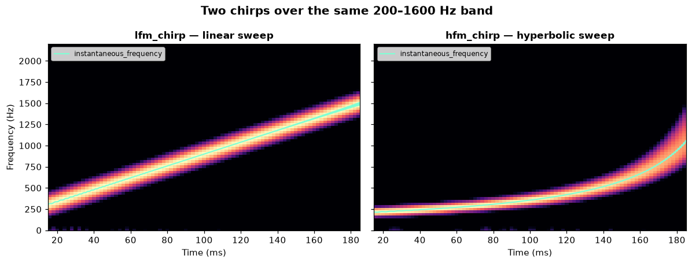
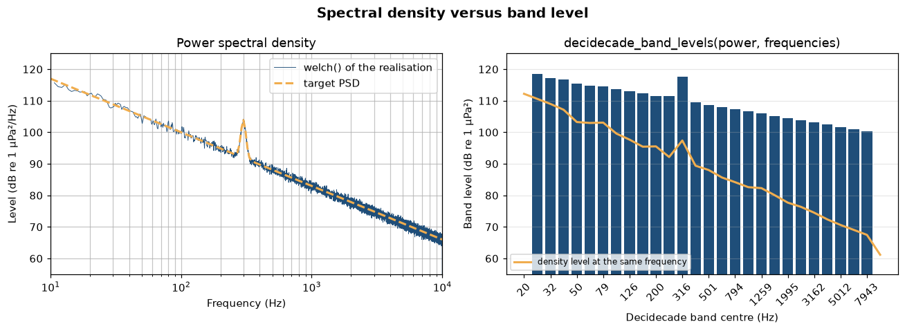
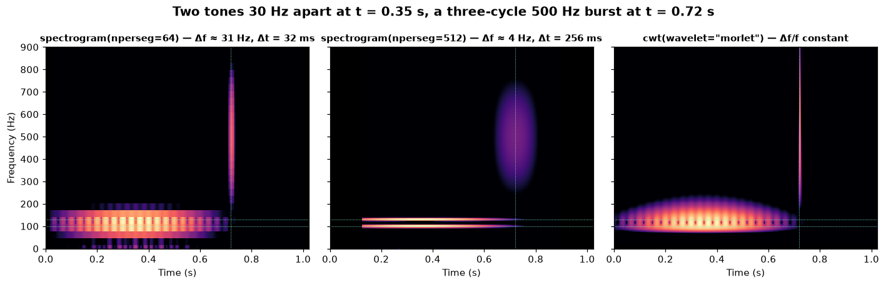
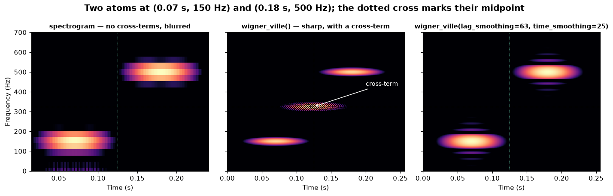
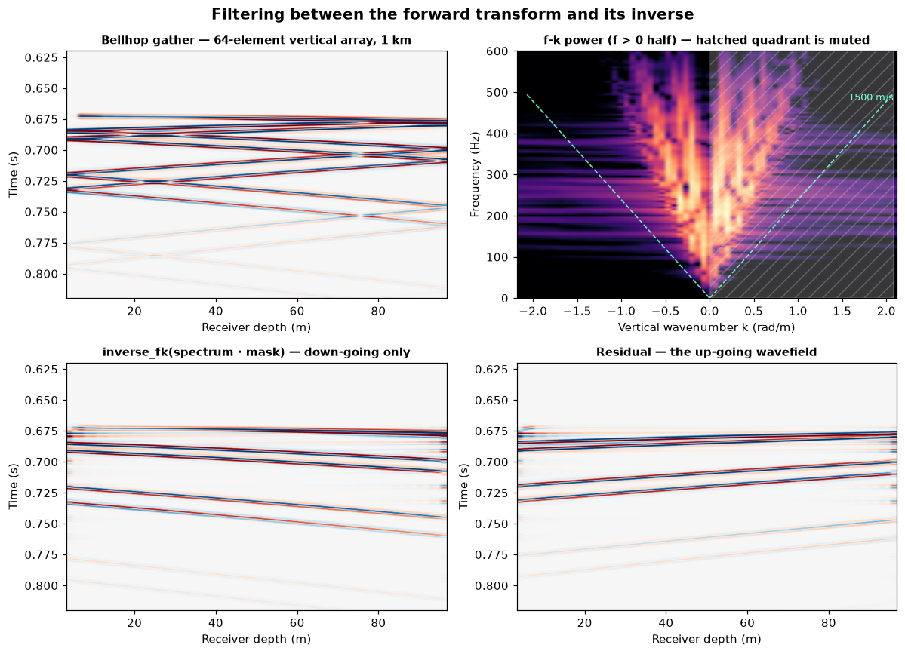
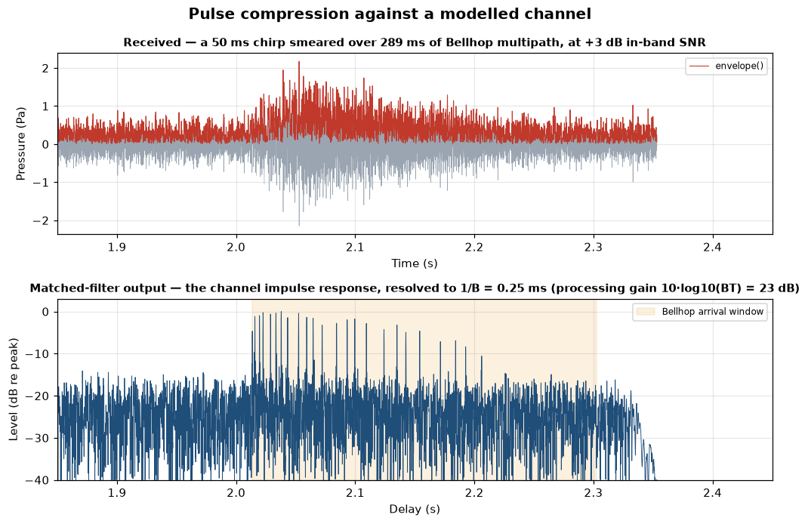
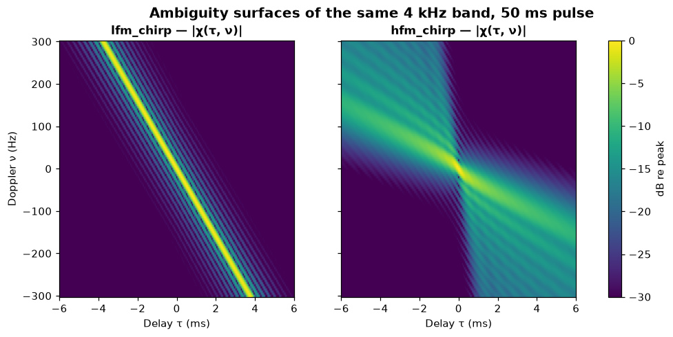
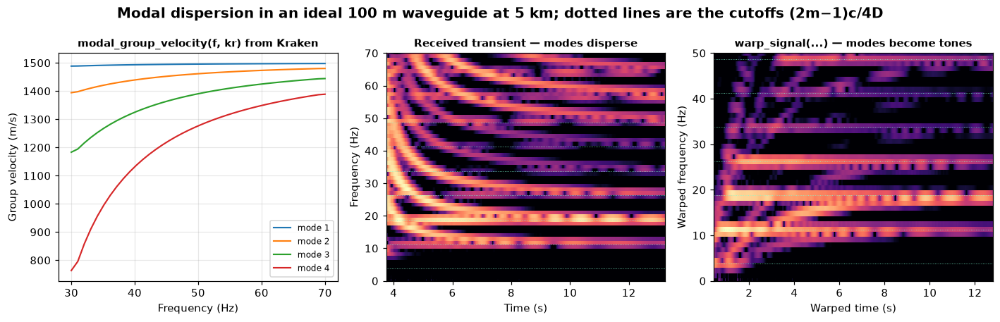

# Signal processing — what you do with a waveform

> `uacpy.acoustic_signal` · waveform generation · spectra and levels ·
> time-frequency · gather transforms · active sonar · channel simulation ·
> noise synthesis

A propagation model gives you a field, a set of arrivals or a transfer
function. This page is about everything you do either side of that: building
the waveform you transmit, and taking apart the record that comes back.

The package is called `acoustic_signal` rather than `signal` so it cannot
collide with Python's standard-library module of that name. Nothing here is
re-exported onto `uacpy.*`; you import from the sub-package:

```python
from uacpy.acoustic_signal import (lfm_chirp, welch,
                                   spectrogram, matched_filter)
```

Array processing — steering vectors, conventional and MVDR beamforming, MUSIC —
also lives under `uacpy.acoustic_signal`, but it is documented in
[`arrays.md`](arrays.md). The sonar equation, detection theory and matched-field
processing are in [`sonar.md`](sonar.md).

---

## 1. How the package is laid out

| Sub-module | The question it answers | What it holds |
|---|---|---|
| `generate` | give me a signal | chirps, tone bursts, Ricker/Gaussian/N-wave, the SPARC pulse library; m-sequences and BPSK; PSD-to-time-series realisation, band-limited noise (SNR mixing is `uacpy.comms.awgn`) |
| `estimate` | measure this signal | `welch`, `constant_q`, `sound_exposure` and a `probabilistic_` twin of each; the constant-Q transform and spectrogram; Hilbert, spectrogram, wavelet, Wigner-Ville, cepstrum; decidecade (ISO 18405) band edges and levels |
| `arrays` | what does this array see | beamforming and steering vectors (see [`arrays.md`](arrays.md)), plus the f-k, tau-p and Radon gather transforms **and their inverses** — the ones that take a receiver spacing `dx` |
| `detect` | is my transmission in there | matched filter, pulse compression, processing gain, ambiguity |
| `system` | what did the channel do to it | frequency-response estimation (`frf_welch`, `etfe`, `periodic_etfe`, `lsfir`, and `FRF` to configure one), impulse response and received-signal simulation, modal group velocity and waveguide warping |

You will not type those names: every public name is re-exported from
`uacpy.acoustic_signal`, so it is `uacpy.acoustic_signal.welch`, never
`...estimate.welch`. The boundaries are for whoever maintains the package.

Three conventions hold across all of it:

**Everything is a pure function.** No estimator carries state, and none of them
plot. A transform takes arrays and keyword arguments and returns arrays, or a
small data-only namedtuple (`SpectralEstimate`, `FKResult`, `AmbiguityResult`
…) that
unpacks positionally:

```python
frequencies, power = welch(x, fs)
f, t, Sxx = spectrogram(x, fs, nperseg=1024)
```

Each result also carries `.units` (the unit of every field) and the export
protocol the model results have: `to_dict()` / `from_dict()`, `to_xarray()` /
`from_xarray()` — every array on its axes, an axis being the earlier 1-D field
of its length, so a spectrogram's `power` sits on `(frequencies, times)` — and
`to_dataframe()` where the fields are equal-length columns (`welch`,
`BandLevels`, a BER curve).

Frequency-response estimation is functions too; `FRF` is a class only to hold
one of them configured, and it keeps no result.

**Levels are reference-free until the last step.** The estimators return
Pa²/Hz, Pa² or Pa²·s — whichever `scaling` was asked for — all linear. The
reference pressure enters only where a dB
number is actually formed: `decidecade_band_levels(..., ref=)`, the histogram
estimators' `ref=`,
and the plotters. That way an estimate never carries a hidden `1 µPa` baked
into it.

**Plotting lives elsewhere.** Every estimator here has a matching drawer in
[`uacpy.visualization`](plotting.md) — `plot_psd`, `plot_spectrogram`,
`plot_fk`, `plot_ambiguity`, `plot_cwt`, `plot_wigner_ville`,
`plot_band_levels`, and so on — which consume exactly what the estimator
returned.

---

## 2. Waveforms

One return convention throughout. A generator that owns its own sampling
returns `(time, signal)` — time first, matching the channel and synthesis
helpers — while one you evaluate on a time vector you already have returns just
the signal.

| Call | Returns | Notes |
|---|---|---|
| `lfm_chirp(freq_start, freq_end, duration, *, sample_rate)` | `(t, s)` | linear sweep; instantaneous frequency ramps `freq_start → freq_end` |
| `hfm_chirp(freq_start, freq_end, duration, *, sample_rate)` | `(t, s)` | hyperbolic sweep, a.k.a. linear period modulation |
| `tone_burst(frequency, n_cycles, *, sample_rate, window='hann')` | `(t, s)` | Hann-gated by default; `window=None` for a hard gate |
| `ricker_wavelet(times, frequency, delay=None)` | `s` | second derivative of a Gaussian, AT centring `u = 2πFt − 8`. `delay` centres it where you ask instead and **broadcasts against `time`**, so one call lays a pulse on every trace of a moveout gather |
| `gaussian_pulse(times, delay, duration)` | `s` | `exp(−((t − delay)/duration)²)` |
| `nwave(times, frequency)` | `s` | `sin(ωt) − ½sin(2ωt)`, forced to zero outside `[0, 1/f]` |
| `sparc_pulse(times, frequency, pulse_type)` | `(s, title)` | the 11-shape SPARC library; `frequency` is the characteristic frequency in Hz, and the second return is the shape's name |
| `m_sequence(n_register, taps=None)` | `s` | maximum-length sequence, `2**n − 1` chips of ±1 (standard BPSK mapping bit 0 → +1, bit 1 → −1); `taps=None` takes the Acoustics-Toolbox `mseq.m` primitive polynomial for `2 ≤ n ≤ 15`, explicit `taps` any primitive one. The same function is `uacpy.comms.m_sequence` |
| `bpsk_modulate(chips, fc, *, sample_rate, chips_per_sec)` | `s` | one carrier cycle-block per chip; requires an integer `sample_rate / chips_per_sec` |
| `make_mseq_probe(freq_min, freq_max, *, sample_rate, duration)` | `probe` | 0.2 s leader + whole periods of `m_sequence(10)`, BPSK'd at `(freq_min + freq_max)/2`, zero-filled to exactly `round(duration · sample_rate)` samples |

```python
import numpy as np
from uacpy.acoustic_signal import (
    lfm_chirp, hfm_chirp, tone_burst, ricker_wavelet,
    gaussian_pulse, nwave, sparc_pulse, m_sequence,
)

fs = 8000.0
t = np.arange(int(0.10 * fs)) / fs

t_lfm, lfm = lfm_chirp(200.0, 1200.0, 0.10, sample_rate=fs)
t_hfm, hfm = hfm_chirp(200.0, 1200.0, 0.10, sample_rate=fs)
t_burst, burst = tone_burst(400.0, 8, sample_rate=fs)
ricker = ricker_wavelet(t, 200.0)
gauss = gaussian_pulse(t, delay=0.05, duration=0.012)
nw = nwave(t - 0.02, 200.0)
hann4, hann4_title = sparc_pulse(t - 0.02, 200.0, 'H')
chips = m_sequence(6)
```



Reading the panels: both chirps fill the same 100 ms and the same band, but the
LFM's oscillation tightens at a steady rate while the HFM lingers at the low
end and crams the top of the band into its last 20 ms. The tone burst is eight
cycles of 400 Hz under a Hann taper. The Ricker's main lobe is **negative**
(≈ −0.44) with positive side lobes — that is the sign the AT `Ricker.m`
convention gives, and it is worth knowing before you go looking for a bug. The
N-wave and the Hanning-weighted four-sine both sit inside their finite support
and are identically zero outside it; the argument `t - 0.02` is what places them
at 20 ms, since both are defined from `t = 0`. `m_sequence(6)` is 63 chips, not 64.

### The two chirps, and where their frequency actually is

```python
from uacpy.acoustic_signal import spectrogram, instantaneous_frequency

t_lfm, lfm = lfm_chirp(200.0, 1600.0, 0.20, sample_rate=fs)
t_hfm, hfm = hfm_chirp(200.0, 1600.0, 0.20, sample_rate=fs)

f, t_spec, Sxx = spectrogram(lfm, fs, nperseg=256, noverlap=240)
f_inst = instantaneous_frequency(lfm, fs)
```



The cyan trace is `instantaneous_frequency`, which differentiates the unwrapped
analytic-signal phase; it lands on the spectrogram ridge in both panels, which
is the point — it is an independent estimate, not a replot of the design law.
The LFM ridge is a straight line. The HFM ridge is not: it spends most of the
pulse below 500 Hz and sweeps the upper half of the band in the last fifth of
the duration. That asymmetry is why the two waveforms behave so differently
under Doppler — see [§7](#7-active-sonar).

The end-of-record excursions are trimmed from the trace on purpose: a phase
derivative taken by centred differences is meaningless where the signal has
just switched on or off.

There is a second caveat, and in the ocean it bites harder. The analytic-signal
instantaneous frequency is only meaningful for a *monocomponent* record like
these chirps. Give it two equal tones at 100 and 130 Hz and it returns 115 Hz —
their mean, which is neither of them and is not a frequency present in the
signal. A multipath or multimode arrival is multicomponent by definition, so
separate the components first — with `spectrogram`, `cwt` or
[`warp_signal`](#8-modal-dispersion-and-warping) — and take the instantaneous
frequency of each.

---

## 3. Spectra, levels and bands

| Call | Returns | Units |
|---|---|---|
| `welch(data, sample_rate, *, scaling='density', nperseg=8192, noverlap=None, nfft=None, detrend='constant', average='mean', window=None, freq_min=None, freq_max=None, integration_time=None)` | `SpectralEstimate(frequencies, power)` carrying `.scaling`, `.method` | Pa²/Hz or Pa² per bin, linear |
| `constant_q(data, sample_rate, *, scaling='density', freq_min=20.0, freq_max=None, bins_per_octave=24, window='hann', integration_time=None)` | same, on geometric bins | Pa²/Hz or Pa² per bin, linear |
| `probabilistic_welch(data, sample_rate, *, scaling='density', segment_duration=1.0, segment_overlap_percent=50, level_step_dB=1.0, level_min_dB=0, level_max_dB=150, nperseg=8192, noverlap=None, detrend='constant', window=None, freq_min=None, freq_max=None, integration_time=None, ref=1e-6, axis=None)` | `ProbabilisticSpectralEstimate(frequencies, level_edges, pdf)` carrying `.mean_dB`, `.std_dB`, `.level_step_dB`, `.segment_duration`, `.ref`, `.scaling`, `.method`, `.bands` | dB histogram per frequency |
| `probabilistic_constant_q(data, sample_rate, *, scaling='density', freq_min=20.0, …, level_step_dB=1.0, level_min_dB=0, level_max_dB=150, ref=1e-6)` | same, one sample per frame rather than per segment | dB histogram per frequency |
| `sound_exposure(data, sample_rate, *, band_type='decidecade', n_bands=30, nperseg=None, batch_size=None, freq_min=8.9125, freq_max=22387, integration_time=None)` | `SpectralEstimate` carrying `.bands`, `.band_type` | Pa²·s per standard band — the ISO 18405 sound exposure; `.plot()` / `plot_sel(ref=1e-6)` gives dB re 1 µPa²·s |
| `probabilistic_sound_exposure(data, sample_rate, *, segment_duration=1.0, …, band_type='decidecade', …, ref=1e-6)` | `ProbabilisticSpectralEstimate` carrying `.bands` | dB re 1 µPa²·s histogram, one sample per segment |
| `decidecade_bands(freq_min, freq_max)` | `(lower, centers, upper)` of every IEC 61260-1 base-10 band overlapping the range | Hz |
| `octave_bands(freq_min, freq_max, *, base=10)` | the same for the IEC 61260-1 octaves, every third decidecade (`base=2`: exact octaves) | Hz |
| `standard_bands(freq_min, freq_max, *, band_type='decidecade', sample_rate=None, n_bands=None)` | `(lower, centers, upper)`: the bands `sound_exposure` reports that range on | Hz |
| `band_levels(psd, frequencies, *, band_type='decidecade', ref=1e-6)` | `BandLevels(centres, levels)` on the `band_type` ladder, carrying `.lower`, `.upper`, `.band_type`, `.ref`; `.plot()` draws it | dB re `ref²` |
| `decidecade_band_levels(psd, frequencies, *, ref=1e-6)` | `band_levels` on the decidecade ladder | dB re `ref²` |

The probabilistic estimators accept a 1-D signal, a multichannel block whose
time axis `axis=` names under `welch`'s rule (the last axis by default, and a
`read_wav`-shaped `(n_samples, n_channels)` block refused rather than guessed
at), or a list of 1-D records; every channel's segments go into the one
histogram. There are
no `psd` / `ppsd` short names: a three-letter alias of a nine-word statistic is
exactly where a density gets read as a spectrum.

**One function per method, and a `scaling` only where it is one divide.**
There is no `method` keyword to cross: the name at the call site says how
frequency is resolved, and each function takes only the parameters that method
can honour.

| function | what it returns | its own parameters |
|---|---|---|
| `welch` | Pa²/Hz or Pa² on equal-width bins | `scaling`, `nperseg`, `noverlap`, `nfft`, `detrend`, `average`, `window` |
| `constant_q` | the same two, on geometric bins | `scaling`, `freq_min`, `freq_max`, `bins_per_octave`, `window` |
| `sound_exposure` | Pa²·s per standard band | `band_type` (one of `BAND_TYPES`), `n_bands`, `nperseg`, `batch_size` |

`scaling='density'` and `'spectrum'` are the same estimate divided, or not, by
the bin's noise-equivalent bandwidth, so they share every other argument and
nothing has to be policed — `window=None` still resolves to `hann` for a
density and `flattop` for a spectrum. An exposure is not a third value of that
keyword: it is an energy, it needs bands, and it must refuse the knobs below,
so it is its own function.

Three arguments are shared, because one sentence describes each everywhere:
`freq_min` / `freq_max`, the frequency range of the estimate, and `integration_time`,
the stretch of record it is taken over (seconds from the start). What an unset
one falls back to is the estimator's own answer — Welch resolves the whole
spectrum and the range crops what comes back, constant-Q runs from 20 Hz to
the last bin a tone's level can be read in (just under Nyquist), the ladder spans the 10 Hz to 20 kHz reporting range.

**What each function does not take is the point.** `sound_exposure` has no
`window`, `noverlap`, `detrend` or `average`: a band's value is the sum of the
bins inside it, which is the band's energy only when every bin is counted once
and whole, so those are not choices there and Python's own `TypeError` says so.
The same rule removed four runtime guards that used to police the combinations
— the signature does that work now.

`batch_size` (on `sound_exposure` alone) is not an estimator choice either: it
is how many samples are read at a time, so a multi-hour record never
materialises as one segment matrix. It changes memory, not the estimate, as
long as each batch holds whole segments — it defaults to a whole number of
them, and warns when a value you pass does not.

**A band exposure is the Welch bins summed.** `sound_exposure` calls the Welch
route per batch under the settings above and adds up the bins each band
covers, a bin straddling a band edge shared between the two bands in proportion
to its overlap; there is no second estimator underneath, which is why the two
agree to floating-point noise. At the default 1 Hz bins the seven lowest
decidecade bands hold 2 to 7 FFT lines each, short of the ten a synthesised
band level wants (Fahy, *Sound Intensity*). That is a resolution limit — few
lines per band — and not an error in the total or the band width. Raising
`nperseg` to about `10·sample_rate/2.3` (4.3 s of record) resolves them, at the
cost of time resolution.

Welch also forwards scipy's own two estimate-changing knobs: `average='median'`
— the robust choice for a record with transients, where a passing ship moves
the mean of the periodograms and leaves the median at the background (3.7 dB
apart on a tape with one loud burst in it) — and `detrend=`, which
`spectrogram` and `probabilistic_welch` take too, with the same default.
`'constant'` (scipy's default) subtracts each segment's mean. On a stationary
record that removes a DC offset; on a **transient** it fabricates one: a
segment holding part of a pulse has a mean the pulse does not have, and
subtracting it adds a step across the whole segment, which lands in the lowest
bins. Measured at 8 kHz, `nperseg=1024`, lowest bins in dB re the spectral
peak: a Gaussian-windowed 200 Hz tone reads −37.6 dB at DC under the default
against −93.7 dB with `detrend=False` (spectrogram, worst frame: −59.6 against
−98.4); a zero-mean pulse — a Ricker or N-wave — is unchanged. Pass
`detrend=False` for pulses and model time series, where there is no offset to
remove. `axis=` names the time axis
of a multichannel record, and the result carries frequency last (one spectrum
per channel). Left unset it is the last axis, as in scipy — except that an
array shaped like `read_wav`'s `(n_samples, n_channels)` is refused rather than
transformed across its channels (48 000 two-bin "spectra" for a 3-channel
second at 48 kHz); pass `axis=0` for it. `spectrogram` and `constant_q` take the
same `axis=`, and `sound_exposure` takes one channel at a time (`x[:, ch]`).
`return_onesided` is not forwarded: complex input already produces a two-sided
spectrum with a warning.

Every estimate draws itself: `welch(x, fs).plot()` labels its own
axis from the `scaling` and `method` it carries, the same convenience a model
result's `.plot()` gives, and it returns `(fig, ax)` like every plotter in the
package. `freq_scale='linear'` reads a narrow band the way a spectrum analyser
does; the default `'log'` is what spaces constant-Q's geometric bins evenly.

The histogram estimators draw themselves the same way:
`probabilistic_welch(x, fs).plot()` goes to `plot_ppsd`, and the same
call on a `method='constant_q'` estimate goes to `plot_constant_q_ppsd` —
picked from the estimate's own `method`, so the two cannot be crossed. Calling
the wrong plotter by hand raises and names the other one, because constant-Q
bins are geometric and carry no `segment_duration`.

| Estimate | `.plot()` draws | Underlying plotter |
|---|---|---|
| `SpectralEstimate` from `welch` / `constant_q` | the spectrum as a line, dB | `plot_psd` |
| `SpectralEstimate` from `sound_exposure` | one bar per standard band | `plot_sel` |
| `ProbabilisticSpectralEstimate` from `probabilistic_welch` / `probabilistic_sound_exposure` | the level histogram | `plot_ppsd` |
| `ProbabilisticSpectralEstimate` from `probabilistic_constant_q` | the same, on geometric bins | `plot_constant_q_ppsd` |

`scaling='density'` (the default on `welch` and `constant_q`) gives Pa²/Hz,
independent of the window and of `nperseg` — the right choice for noise.
`scaling='spectrum'` gives per-bin power, where an on-bin tone reads its full
`A²/2` — the right choice for tones. The energy a record delivered is
`sound_exposure`, which is a function rather than a third value of `scaling`:
it needs standard bands, and it needs a window and an overlap the caller does
not get to choose. Asking a bin estimator for `scaling='exposure'` **raises**
and names it.

**The window default follows the scaling**, because the two measure different
things. A density uses `hann` (1.50-bin noise-equivalent bandwidth); a spectrum
uses `flattop`, where a tone half a bin off centre reads about 0.01 dB low
instead of hann's **1.42 dB**. That 1.42 dB is *scalloping* loss, set by the
main-lobe shape, and is a different figure of merit from the bandwidth that
makes a density window-independent — both are the estimator, not the signal.
Flat-top pays for it in resolution: its noise-equivalent bandwidth is 3.77 bins
against hann's 1.50 and its main lobe 10 bins against hann's 4, so pass
`window='hann'` when separating neighbouring tones matters more than reading
their level. Constant-Q keeps `hann` under both scalings, because a kernel's
length sets its bin's bandwidth and swapping the window would change the Q the
method is named for.

| | `scaling='density'` | `scaling='spectrum'` | `sound_exposure` |
|---|---|---|---|
| Welch window | `hann` | `flattop` | `boxcar`, not an argument |
| constant-Q window | `hann` | `hann` | — (a band sum needs orthogonal bins) |
| Welch `noverlap` | `nperseg // 2` | 78.3 % of `nperseg`, rounded up | `0`, not an argument |
| Welch `detrend` | `'constant'` | `'constant'` | `False`, not an argument |
| `average` | `'mean'`, `'median'` for robustness | same | `'mean'`, not an argument |
| short record | left as it is | left as it is | padded to whole segments (padding adds no energy) |
| unit | Pa²/Hz | Pa² | Pa²·s per band |
| plot label / title | dB re 1 µPa²/Hz, "Power spectral density" | dB re 1 µPa², "Power spectrum" | dB re 1 µPa²·s, "SEL" (bars) |

The default overlap is the window's: segments may sit at most `N / eta_w`
apart before independent samples of the record go unused (Abraham §9.2.10.1),
`eta_w` being the window's independent sample rate — 2.1 for hann, hence half
a segment, and 4.60 for flat-top, hence 78.3 %. `frf_welch` and
`spectrogram` (hann under both scalings, to resolve where energy sits rather
than read a tone's level) take the same rule.

`window=` is yours on `welch`, `probabilistic_welch`, `spectrogram` and
`constant_q`; `noverlap=` and `detrend=` on `welch`, `probabilistic_welch` and
`spectrogram` (constant-Q kernels subtract nothing); `average=` on `welch`. On
`sound_exposure` they do not exist: a band's value is the sum
of the bins inside it, which is the band's energy only when every bin is
counted once and whole, so the enforcement is the signature rather than a
runtime refusal.

**`sound_exposure` is the Welch route, integrated — literally.** It runs the
estimator `welch` runs (the private `_estimate`, with an internal
`scaling='exposure'` that no public call accepts), with a boxcar window and no
overlap, on each batch of the record and sums the bins each band covers; there is no second estimator
underneath. That per-bin exposure is already the energy (the record is padded
to whole segments and the average multiplied by the padded duration, which is
the sum over segments), and energy adds, so the batching is memory rather than
method: a multi-hour record never materialises as one segment matrix.
`nperseg` defaults to `sample_rate`, i.e. 1 Hz bins, and `batch_size` to a
whole number of those segments.

At those 1 Hz bins the seven lowest decidecade bands hold 2 to 7 FFT lines
each, short of the ten a synthesised band level wants (Fahy, *Sound
Intensity*). That is a resolution limit and not an error in the total or the
band width: each bin is split between the bands its interval overlaps, in
proportion to the overlap, so a band integrates exactly its own width. Raising
`nperseg` to about `10·sample_rate/2.3` (4.3 s of record) resolves them, at the
cost of time resolution.

Because the bins are weighted by overlap, `sound_exposure` and
`decidecade_band_levels` (a PSD integrated over the exact band edges) measure
the same band widths. Counting whole bins instead — each bin in the band its
centre falls in — measures the 10 Hz band (2.31 Hz wide) over 3 bins, +1.14 dB
on a flat spectrum, and the 16 Hz band (3.66 Hz) over 3 bins, −0.86 dB; the
weights remove that. What remains between the two on one record is the
difference between two estimators (boxcar segments against a Hann-windowed
Welch average), which is estimation noise in the few-line bands.

Banding a constant-Q estimate is not offered: its kernels overlap, so summing
its bins would count the same energy more than once.

`BAND_TYPES` names the ladders, for a caller that wants to loop over them or
validate its own input.

**Two result types, not six.** Every averaging estimator returns a
`SpectralEstimate` and every histogram estimator a
`ProbabilisticSpectralEstimate`, whichever method and scaling produced it —
`method=` picks the frequency axis, not the return type. A name that fixes one
scaling would say "density" over band power,
so there is no such name.

Both follow one rule: **the tuple is the measurement, the attributes are what
it means.** `frequencies, power = welch(x, fs)` and
`frequencies, level_edges, pdf = probabilistic_welch(x, fs)` unpack
the numbers; `.scaling`, `.method`, `.ref`, `.bands`, `.segment_duration`,
`.mean_dB`, `.std_dB`, `.level_step_dB` are attributes on whichever type carries
them, identical in name and meaning across the two, so code written against
one reads the other.

A Welch or exposure histogram also keeps the population it was built from:
`.segment_levels_dB` holds every segment's level at every frequency, and
`.segment_times` the centre of each segment. `.percentiles(q)` reads level
percentiles off them, over every segment, where a quantile read off `pdf` is
clipped by `level_min_dB`/`level_max_dB`. A `pdf` bin no segment fell in is 0,
so a column integrates (`pdf[:, i].sum() * level_step_dB == 1`) and cumulates
as it stands; a frequency with no level inside the window is a `NaN` column,
and the plot draws empty bins blank. Both go through user-level functions on plain
arrays: `level_histogram(levels_dB, level_edges, *, axis=0)` returns
`(pdf, mean_dB, std_dB)`, the histogram every `probabilistic_*` estimator
builds, and `level_percentiles(levels_dB, q, *, axis=0)` returns the
percentiles. A constant-Q histogram keeps no per-segment levels: its frames per
bin differ in number.

### The ladders are base 10: decidecades and octaves

`decidecade_bands` implements the IEC 61260-1 / ISO 18405 **base-10** system:
centre frequencies are `1000 · 10^(n/10)`, band edges are `centre · 10^(±1/20)`,
and a band is therefore `10^(1/10)` wide — one tenth of a decade, or 0.3322
octave. This is the convention underwater soundscape and ship-radiated-noise
reporting uses, and it is also where the familiar third-octave centre
frequencies come from: the standard series is built on powers of `10^(1/10)`,
which is why 1, 10, 100 and 1000 Hz all land on band centres. The base-10
third-octave *is* the decidecade — ISO 18405's term, "the nearly equivalent and
preferred decidecade" (Abraham, §3.3.1.1) — so the package has that one name
for it.

`sound_exposure` is written on that same ladder: its `band_type` defaults to
`'decidecade'` and shares `decidecade_bands`'s edges exactly, so a band level
and a band exposure are stated over the same bands. `band_type='octave'` is
the IEC 61260-1 base-10 octave, every third decidecade (`10^(3/10)` wide, so
the band four octaves above 1 kHz is centred on 15.85 kHz, not 16 kHz), and
`'linear'` cuts `n_bands` equal-width bands. The same names select the same
ladders everywhere: `octave_bands` gives the octave edges (`base=2` for exact
octaves), `standard_bands(band_type=...)` the bands `sound_exposure` reports a
range on, and `band_levels(band_type=...)` a PSD's levels on them.

### Density versus band level

```python
from uacpy.acoustic_signal import (synthesize_noise_from_psd,
                                   welch,
                                   decidecade_band_levels)
from uacpy.plot import plot_psd, plot_band_levels

# A target soundscape: −17 dB/decade with a narrow 300 Hz tonal on top.
rng = np.random.default_rng(0)
f_target = np.logspace(np.log10(10.0), np.log10(10_000.0), 200)
level_dB = 100.0 - 17.0 * np.log10(f_target / 100.0)
level_dB += 12.0 * np.exp(-0.5 * ((np.log10(f_target / 300.0)) / 0.02) ** 2)
target = 1e-12 * 10.0 ** (level_dB / 10.0)          # Pa²/Hz

_, x, fs = synthesize_noise_from_psd(
    target, f_target, duration=30.0, sample_rate=25_000,
    nfft=65536, interp='log', rng=rng)

frequencies, power = welch(x, fs, nperseg=32768)
band = (frequencies >= 20.0) & (frequencies <= 11_000.0)
centers, levels = decidecade_band_levels(power[band], frequencies=frequencies[band])

plot_psd(frequencies, power, label='welch() of the realisation',
         ymin=55, ymax=125)
plot_band_levels(centers, levels)
```



The left panel is the check that the synthesis worked: the realisation's Welch
PSD sits on the target across three decades, tonal included. The right panel is
the same data as 28 decidecade band levels, with the *density* level at each
band centre drawn over the bars.

The bars are higher, and the gap widens with frequency — from about 7 dB at the
25 Hz band to about 33 dB at the 7.9 kHz band. That gap is `10·log10` of the
band's width in Hz, and a decidecade band's width is proportional to its centre
frequency — the `10^(±1/20)` edges above give `(10^(1/20) − 10^(−1/20)) · f =
0.2308 · f` — so it grows by 10 dB per decade. **A band level and a
density level are different quantities and are only equal in a 1 Hz band.**
The 316 Hz bar is the one visible departure from the smooth trend: that is the
tonal, whose energy is confined to one band and so survives integration intact.

The end bands come back `nan`, and no amount of widening will change that. The
band set is generated *from the grid you supply* — `decidecade_band_levels`
takes your grid's smallest positive and largest frequency and asks for every
decidecade band that **overlaps** that span. Overlapping, not contained: so
unless an endpoint happens to land exactly on a band edge, the outermost band on
each side reaches past the support, and a partial integral is not a band level.
Those two bands are returned as `nan`, deliberately without a warning: it
would fire on every well-formed call. Mask them with `np.isfinite(levels)`.

**"Slice generously" is not a remedy, because widening the grid moves the two
`nan` bands outward without ever removing them.** Widening this page's
20 Hz–11 kHz support by a decade at each end, three times over, gives 28, 48, 68
and 88 bands — and **exactly two `nan`, at the first and last position, every
time**. Across 300 randomly drawn grids the count was 2 every time. The two
useful responses are to **trim**: `centers[1:-1]`, `levels[1:-1]` leaves 26
finite bands here, from 25.1 Hz to 7.94 kHz; or, when you need a *specific* band
set complete, to supply support running one decidecade past the outermost band
you want and then drop the `nan` entries — that recipe delivered every requested
band finite on all eight band ranges tried.

The exception is that "unless": if both endpoints land *exactly* on decidecade
band edges, nothing overhangs and no band is `nan`. `decidecade_bands(100, 1000)` returns 11 bands
spanning 89.1251–1122.0185 Hz, and a PSD on exactly that span yields 11 bands
and zero `nan`. Do not build on it, though — it is knife-edge. Alignment held
for 5 of 8 band ranges tried; the other 3 pulled in a neighbouring band on each
side through floating-point round-off in the overlap test, and those came back
`nan`. Perturbing an aligned endpoint by one part in 10¹² was enough to bring
the `nan` back. Trim the ends instead.

`decidecade_band_levels` also warns, once, if any band straddled fewer than two
PSD grid points; such a band's level rests almost entirely on its interpolated
band edges rather than on integrated data. If you see that warning, your PSD
grid is too coarse at the bottom of the band set — raise `nperseg`.

---

### 3.1 One tone, and a spectrum where you ask for it

| Call | Returns | Use |
|---|---|---|
| `tone_phasor(data, times, frequency, *, window='hann', axis=-1)` | complex | amplitude and phase of **one** tone in a record |
| `waveform_spectrum_at(waveform, sample_rate, frequencies)` | `S(f)` | the **whole** spectrum, at whatever frequencies you ask for |


`tone_phasor` evaluates the transform **at** the frequency rather than
sampling the nearest DFT bin. Off a bin, `X[k]` is a leakage sample of the
window transform — neither the phasor at your frequency nor the one at
`freqs[k]` — and a record picks its own `nt` and `fs`, so the frequency of
interest is essentially never on a bin:

| offset from the bin | level error | phase error |
|---|---|---|
| 0.10 bin | −0.06 dB | 18° |
| 0.30 bin | −0.51 dB | 54° |
| 0.50 bin | −1.42 dB | **90°** |

**The phase reaches 90° before the level has moved 1.5 dB**, which is why a
level check alone does not find this. `Field.extract_tone` and `uacpy.models.sparc.rts_to_pressure` both call it, so the two public routes to "the
tone in this record" now agree to 1e-15 instead of disagreeing by the table
above.

`rts_to_pressure`'s `pulse_type=` deconvolution branch takes the ratio of the
record's and the known pulse's rectangular transforms, both evaluated at the
frequency: taking the same bin on both sides nearly cancels the leakage but
not quite (+0.06 dB and +6° at half a bin against a three-path channel), while
the pair at the frequency is exact off-bin.

---

## 4. Time-frequency

| Call | Returns | Invertible? |
|---|---|---|
| `analytic_signal(data)` | complex analytic signal | — (raises on complex input) |
| `envelope(data)` | instantaneous amplitude, `abs(analytic_signal(data))` | no |
| `instantaneous_frequency(data, sample_rate)` | Hz, same length as `data` | no |
| `spectrogram(data, sample_rate, *, window='hann', nperseg=8192, noverlap=None, nfft=None, detrend='constant', scaling='density', mode='psd', axis=None)` | `SpectrogramResult(frequencies, times, power)`; `noverlap=None` is half a segment, as on `welch` | no |
| `cwt(data, sample_rate, frequencies=None, wavelet='morlet', *, w0=6.0, order=None, n_freqs=64)` | `CWTResult(frequencies, times, coefficients)`; `times` is `arange(n) / sample_rate` | `inverse_cwt`, approximately |
| `wigner_ville(data, sample_rate, *, analytic=True, lag_smoothing=None, time_smoothing=None, nfft=None)` | `WignerVilleResult(frequencies, times, distribution)` | no |
| `cepstrum(data, *, sample_rate=None, window=None, nfft=None, lifter=None)` | `Cepstrum(quefrencies, cepstrum)`, the real cepstrum on its quefrency axis: seconds when `sample_rate` is given, samples otherwise | no — phase is discarded |
| `complex_cepstrum(data)` | `ComplexCepstrum(cepstrum, delay)` — the **complex** cepstrum, and the linear-phase samples removed that its inverse needs back | `inverse_complex_cepstrum`, exactly |
| `constant_q_transform(data, sample_rate, *, freq_min=20.0, freq_max=None, bins_per_octave=24, window='hann')` | `CQTResult(frequencies, coefficients)` — one centred frame, complex | no |
| `constant_q_spectrogram(data, sample_rate, *, freq_min=20.0, freq_max=None, bins_per_octave=24, hop=None, window='hann', scaling='density')` | `CQSpectrogramResult(frequencies, times, power)` carrying `.scaling` | no |
| `constant_q(data, sample_rate, *, scaling='density', freq_min=20.0, freq_max=None, bins_per_octave=24, window='hann', integration_time=None)` | `SpectralEstimate(frequencies, power)` — unset `freq_max` stops below the near-Nyquist bins whose image leaks into a tone's level (0.4795·fs at 24 bins per octave) | no |
| `probabilistic_constant_q(data, sample_rate, *, scaling='density', freq_min=20.0, …, level_step_dB=1.0, level_min_dB=0, level_max_dB=150, ref=1e-6)` | `ProbabilisticSpectralEstimate(frequencies, level_edges, pdf)` with `.segment_duration = None` and `.method = 'constant_q'` | no |

`cwt` offers three analysing wavelets: `'morlet'` (complex, best frequency
resolution), `'paul'` (complex, best time resolution) and `'dog'` (real
derivative-of-Gaussian; `order=2` is the Mexican-hat). `inverse_cwt` uses the
Torrence & Compo eq.-11 reconstruction with constants derived for the order you
actually used, so a non-default `w0` or `order` still reconstructs at the right
amplitude — but a band-limited scale set only reconstructs its own band, which
is why the round trip is approximate rather than exact.

A `frequencies=` array you supply is checked against Nyquist: asking for
700 Hz at `fs = 1000` raises a `ConfigurationError` (a frequency of exactly
`fs/2` — the default grid's own cap — is still analysed).

One thing `cwt` does not do for you: it returns no cone of
influence: within roughly `w0/(2πf)` of either end of the record the wavelet
runs off the data, so those coefficients are edge artefacts, worst at the lowest
frequency where the wavelet is longest. Nothing marks that region for you, so
give the record margin either side of the feature you care about.

Constant-Q bins geometrically (`bins_per_octave=24` by default) instead of
linearly, which is the right resolution law for a soundscape spanning decades.
It is **not a separate family**: `constant_q(x, fs, freq_min=20)` is the
constant-Q counterpart of `welch(x, fs)` (and `probabilistic_constant_q` of
`probabilistic_welch`), runs the same estimator underneath and returns the same
`SpectralEstimate`, whose `method` reads `'constant_q'`. The transform and the
spectrogram keep their own names because they have no linear twin to share.

The scaling default is the same under both methods — `'density'` — but what a
density means per bin is not: Welch divides by one noise-equivalent bandwidth
for the whole axis, constant-Q by each bin's own, which widens in proportion
to frequency. Compare a constant-Q spectrum against a Welch density without
aligning `scaling=` and the offset is frequency-dependent: on white noise ~4×
at 100 Hz and ~40× at 1 kHz.

The probabilistic constant-Q estimate is the one to read carefully: each of its samples is
a single unaveraged frame, so its per-bin `mean_dB` is the mean of a *single
look's* dB levels. On noise that sits 2.51 dB (`10γ/ln10`) below the power mean
`constant_q(...)` returns from the same record — measured 2.506 ± 0.003 dB (the
median over bins) over four seeds, on 60 s of white noise at 8 kHz and
`bins_per_octave=24`; single bins scatter about it by up to 0.5 dB below 100 Hz,
where a bin holds fewer independent frames. That is the
two-degrees-of-freedom figure, and it holds across the band with
one exception: a bin essentially at Nyquist has no quadrature component left, so
the offset climbs toward the one-dof value of 5.52 dB — measured 5.24 dB at
`f/fs = 0.4995`. The band *power* there is unaffected; what moves is the shape
of its distribution.

the Welch histogram's `mean_dB` carries the same bias, and how much of it
depends on how many
Welch segments a `segment_duration` chunk actually holds. `nperseg` is clamped to
the chunk length, so at the defaults (`segment_duration=1.0`, `nperseg=8192`) a
sample is **one look — the full 2.51 dB — at any `sample_rate` of 8192 Hz or
below**, which is most of this package's own test and example rates. Measured on
white noise: 2.49 dB at both 4 and 8 kHz (one look), 1.19 dB at 16 kHz (two),
0.23 dB at 48 kHz (ten), against `(10/ln10)·(ψ(L) − ln L)` for `L` looks.
Compare a `welch` or `constant_q` spectrum against a target curve; read either `mean_dB`
as the centre of the histogram it describes.

### The resolution trade-off

You cannot buy time resolution and frequency resolution at once. The figure
measures that against a signal with a known answer: two tones 30 Hz apart
burst together at 0.35 s, and a three-cycle 500 Hz click at 0.72 s. The dotted
lines mark all three.

```python
f, t_spec, Sxx = spectrogram(sig, fs, nperseg=64,  noverlap=56)   # Δf ≈ 31 Hz
f, t_spec, Sxx = spectrogram(sig, fs, nperseg=512, noverlap=504)  # Δf ≈ 4 Hz
freqs, t_cwt, W = cwt(sig, fs, frequencies=np.logspace(np.log10(20.0),
                                                       np.log10(900.0), 160))
```



The short window (left) places the click as a clean vertical line at 0.72 s but
smears the two tones into a single broad blob — 31 Hz bins cannot separate
peaks 30 Hz apart. The long window (middle) resolves the tones into two crisp
horizontal lines at 100 and 130 Hz and turns the click into a fat ellipse
spanning 0.25 s and 500 Hz. Same signal, same estimator, one parameter.

The wavelet (right) is **not** a way out of the trade — it is a different place
to stand in it, and the place moves with frequency. `Δf/f` is constant, so the
time resolution keeps improving as you go up: at 500 Hz the CWT places the click
in 3.7 ms against the short window's 11.7 ms (−3 dB widths, and the click's own
envelope is 2.0 ms), while at 100 Hz the tones are as merged as they were on the
left. The CWT buys time resolution at high frequency by giving up frequency
resolution there, which is the correct trade for transient arrivals and the
wrong one for closely spaced tonals.

### Wigner-Ville, cross-terms included

The Wigner-Ville distribution is not subject to the window trade-off that shapes
the panels above — there is no window to trade. That is not the same as beating
the uncertainty principle: for a Gaussian atom the distribution sits exactly on
the bound, `σ_t·σ_f = 1/(4π)`, which is the limit a windowed transform cannot
reach. What goes away is the estimator's own smearing, not the limit. It is a
quadratic energy distribution, and the price of the sharpness is an interference
term sitting between every pair of components.

```python
from uacpy.acoustic_signal import wigner_ville

f_w, t_w, W = wigner_ville(sig, fs)
f_p, t_p, P = wigner_ville(sig, fs, lag_smoothing=63, time_smoothing=25)
```



Two Gaussian-tapered atoms, at (0.07 s, 150 Hz) and (0.18 s, 500 Hz); the
dotted cross marks their midpoint. The spectrogram (left) shows two honest,
blurred blobs. `wigner_ville()` (middle) resolves both atoms to a fraction of
the spectrogram's footprint — and puts a third, oscillating blob at exactly
(0.125 s, 325 Hz), where there is no signal at all. That is the cross-term. It
is not noise and it is not a bug — it is what the quadratic kernel
`z(t+τ)z*(t−τ)` does to a two-component signal, and being deterministic it will
not go away by collecting more records. It does oscillate, and that is the
handle: the frequency marginal is exactly `|z(t)|²`, so the interference has to
integrate to nothing — equal positive and negative excursions.

`freq_window` (a lag-domain window — the *pseudo*-WVD) and `time_window` (a
time-domain smoothing — the *smoothed-pseudo*-WVD) trade it back. The right
panel applies both: the cross-term is gone, and the auto-terms have grown
noticeably in both directions and picked up side lobes. That is the actual
choice on offer — cross-terms or resolution — not a free lunch.

Two mechanical notes. `analytic=True` (the default) transforms real input to
its analytic signal first, which removes the cross-term between the positive
and negative halves of the spectrum before you start. And the kernel doubles
the apparent frequency, so the physical frequency axis is `k·fs/(2·NF)` — read
the axis the function returns, do not build your own.

`wigner_ville` loops over time samples in Python, so cost grows as `n²`. It is a
transient-analysis tool: 512 samples is comfortable, 50 000 is not.

### Cepstra

`cepstrum` is `irfft(log|rfft(x)|)` — the real cepstrum, useful for picking
echo delays and sub-bottom layer spacings, and **not** invertible, because
taking the magnitude throws the phase away. The mechanism is worth stating,
because it is what tells you how to read the axis: the log turns the channel's
convolution into a sum, an echo at delay `τ` ripples `log|X(f)|` with period
`1/τ`, and the inverse transform turns that ripple into a peak at quefrency `τ`.
Convolve a source with `δ(t) + 0.6·δ(t − τ)` and the peak lands exactly on `τ`.
`lifter` weights the quefrency axis: a positive int keeps the low quefrencies
(spectral envelope), a negative int zeroes them (excitation and echo structure),
and an array is applied element-wise.

`complex_cepstrum` keeps the unwrapped phase and therefore returns a complex
array — the imaginary part is significant, not a rounding artefact, and it is
exactly what `inverse_complex_cepstrum` needs. That pair round-trips to machine
precision, which is what makes homomorphic deconvolution possible: transform,
edit the quefrency domain, transform back.

---

## 5. Gather transforms, and why the inverses are free functions

Three duals decompose a `(n_time, n_space)` gather by apparent slowness or
wavenumber. Each has a standalone inverse.

| Forward | Returns | Inverse |
|---|---|---|
| `fk_transform(data, sample_rate, dx, *, nperseg=None, noverlap=None, window=None, nfft=None, scaling='power')` | `FKResult(frequencies, wavenumbers, power, spectrum)`, carrying `.scaling` (`'density'` or `'power'`, the `scaling=` passed); a gather with ≤ 64 time samples and more traces warns that it reads as `(nx, nt)` | `inverse_fk(spectrum)` |
| `taup_transform(data, sample_rate, dx, slownesses=None, n_slowness=201, p_max=None, *, x0=0.0, window=None, nfft=None)` | `TauPResult(slownesses, taus, panel)` | `inverse_taup(taup, sample_rate, dx, slownesses, nx, *, x0=0.0)` |
| `radon_transform(data, sample_rate, dx, moveout, kind='linear', x0=0.0)` | `RadonResult(moveout, taus, panel)` | `inverse_radon(R, sample_rate, dx, moveout, nx, kind='linear', x0=0.0)` |

`radon_transform` scans three moveout families: `'linear'` (`t = τ + p·x`,
`moveout` is slowness in s/m — the tau-p slant stack), `'parabolic'`
(`t = τ + q·x²`, s/m²) and `'hyperbolic'` (`t = √(τ² + (x/v)²)`, m/s).

**The design rule: an inverse is a function of coefficients, never a method on
the forward result.** There is no `fk.inverse()`. `inverse_fk` takes a
spectrum — and it does not care whether that spectrum is the one
`fk_transform` handed you or one you have since muted, weighted or replaced.
That is the entire point. A gather transform is almost never an end in itself;
you run it *in order to* edit the coefficients and come back. Binding the
inverse to the forward object would make the round trip the default and the
filter the awkward case, which is backwards.

`inverse_fk` is a true inverse and round-trips to machine precision.
`inverse_taup` and `inverse_radon` are adjoints — back-projections, not
least-squares inverses. Two things follow, and the amplitude one shows up first:
the adjoint carries no normalisation, so a round trip comes back scaled by
roughly the number of slowness or moveout traces you asked for — a few hundred
on the default axis — and it is band-limited on top of that. Fit a scalar if you
need amplitudes back; do not read either effect as a bug.

### Filtering between the two

```python
from uacpy.acoustic_signal import fk_transform, inverse_fk
from uacpy.plot import draw_sound_cone

# gather: (n_time, n_depth) from a Bellhop TIME_SERIES run on a 64-element
# vertical array at 1 km; dz is the element spacing.
frequencies, wavenumbers, power, spectrum = fk_transform(gather, fs, dz)

kk, ff = np.meshgrid(wavenumbers, frequencies)
mask = np.ones_like(power)
mask[(ff > 0) & (kk < 0)] = 0.0
mask[(ff < 0) & (kk > 0)] = 0.0
down = inverse_fk(spectrum * mask)
```



The gather (top left) is a criss-cross: some events arrive later at deeper
phones, some earlier. In f-k (top right) they separate into the two
half-planes, the coherent energy falling inside the 1500 m/s sound cone that
`draw_sound_cone` marks. What lies outside it is spatial leakage, 27 dB or
more below the peak: horizontal bands at the frequencies where the gather is
strongest. The 64-element aperture ends abruptly, a rectangular window in
depth whose sidelobes spread each frequency across k; a Hann taper over the
phones takes the leakage down to −50 dB, at the price of the edge phones'
signal.
Muting the hatched quadrant and inverting gives a panel (bottom left) in which
every event dips the same way — later with increasing depth, which is a
down-going wave. Subtracting it from the original leaves the complement (bottom
right), where every event arrives *earlier* at deeper phones. One transform,
one mask, one inverse.

**Sign convention.** `wavenumbers` is the **angular** wavenumber `k = 2πν` in
rad/m, matching the `k = ω/c` convention the propagation models use, so a wave
of speed `c` lies on the line `ω = c·k`. A linear event `t = t₀ + p·z` maps to
`k = +2πf·p`, so for `f > 0` the down-going half (`p > 0`, later at greater
depth) is `k > 0`. Muting `k < 0` for `f > 0`, and its conjugate `k > 0` for
`f < 0`, is what keeps the down-going field. Get the conjugate quadrant wrong
and `inverse_fk` returns a complex-symmetry-violating panel that no longer
means anything.

**Units.** `power` is in one of two scalings, and the result says which in
its `scaling` attribute (a fifth tuple element would have changed every
four-wide unpack for one flag the plotter reads). With `scaling='density'` it is
a two-sided density in `x²` per `Hz·rad/m`, `ΣP·Δf·Δk = ⟨x²⟩`, so for a
pressure record the unit is Pa²·m/(Hz·rad) and `scaling` reads `'density'`.
With the default `scaling='power'` it is the raw `|FK|²` of the windowed,
zero-padded FFT: it grows with the record (`ΣP = Σx²·NF·NX` for a boxcar with
no padding), carries no physical unit, and `scaling` reads `'power'`.
`plot_fk(result)` labels the colour axis from that attribute — "PSD (dB re
1 µPa²·m/(Hz·rad))" for a density, "|FK|² (dB re 1 µPa², unnormalised)" for
the raw panel — and with bare arrays `scaling=` must state it. Its
`wavenumber_unit='cycles/m'` draws the abscissa as `ν = k/2π`; a density is
then multiplied by 2π so that `ΣP·Δf·Δν` is still `⟨x²⟩` and the label reads
Pa²·m/Hz, while a raw panel is left as it is.

**Invertibility is a property of how you called the forward transform.**
`fk_transform` with `nperseg=None` (the default) uses the whole record as one
segment and returns that segment's complex panel in `spectrum`. Set an
`nperseg`/`noverlap` pair that fits more than one block and it Welch-averages
`|FK|²` across them — a far better power estimator, since a single-snapshot f-k
panel is inconsistent — but an averaged power panel has no single phase, so
`spectrum` comes back `None`. A setting that still yields a single block keeps
the phase and stays invertible: on a 256-sample record `nperseg=200` returns a
panel, `nperseg=128` returns `None`. Ask `inverse_fk` to invert a `None` and it
says so explicitly rather than guessing:

```
ConfigurationError: inverse_fk: spectrum is None — an f-k panel averaged over
more than one segment has no phase and cannot be inverted. Re-run fk_transform
with nperseg=None for an invertible spectrum.
```

It also refuses the whole `FKResult` tuple, since the fourth field is what it
wants. Decide up front whether you are estimating power or filtering.

---

## 6. From arrivals to a received signal

| Call | Returns | Use |
|---|---|---|
| `impulse_response(amplitudes, delays_s, *, sample_rate, *, n_samples=None, fractional=True)` | `(t, h)` | discrete arrivals → channel IR |
| `simulate_reception(source_waveform, amplitudes, delays_s, sample_rate)` | `(t, received)` | transmit waveform convolved with that IR |
| `impulse_response_from_transfer_function(H, *, frequencies, sample_rate, n_samples=None)` | `(t, h)` | one-sided `H(f)` → real IR |
| `synthesize_time_series(H, *, frequencies, source_waveform, sample_rate, t_start=0.0, window=None, nfft=None, axis=-1)` | `(t, p)` | `H(f)` and a transmitted waveform → the received pressure signal |
| `channel_response(h, sample_rate, *, nfft=None)` | `(f, H)` | complex IR → two-sided `H(f)`, complex |
| `transfer_function_from_impulse_response(h, sample_rate, *, t0=0.0, band=None, axis=-1)` | `(f, H)` | real IR → one-sided `H(f)`; the exact inverse of the row above-but-one |
| `arrival_transfer_function(frequencies, amplitudes, delays_s, *, delays_imag_s=None, phases_rad=None, trace_frequency=None, absorption=None)` | `H(f)` | a sparse arrival list → its transfer function; `trace_frequency` and `absorption` scale the `Im τ` absorption to each `f` by the law |
| `arrival_grid_transfer_function(frequencies, cells, *, phase_offset=0.0, trace_frequency=None, absorption=None)` | `H(i, j, f)` | the same at every receiver of a grid (`cells[i][j]`, one arrival list per receiver); a cell no arrival reached is NaN — what `Arrivals.transfer_function()` and Bellhop's BROADBAND sum |
| `broadband_propagation_loss(H, weights=None, *, axis=-1)` | dB | Ainslie Eq. 11.46 — the loss a signal with bandwidth actually suffers |
| `gate_transfer_function(H, *, frequencies, duration, origin='peak', window=None, axis=-1)` | `H(f)` | keep only the paths within ±`duration` of the response centre |
| `rms_delay_spread(delays_s, powers)` | s | energy-weighted spread of a power delay profile |
| `energy_support(delays_s, powers, fraction=0.999)` | s | delay span holding that share of the energy — what a synthesis window has to cover |
| `synthesis_band(delays_s, powers, *, bandwidth, centre, record=None, energy_fraction=None, margin=1.2)` | Hz | the frequency grid that synthesises the profile un-aliased: a record of `margin × energy_support` (or `record`), never shorter than `1/bandwidth`; warns with the fold when the record does not reach the last arrival (`Arrivals.synthesis_band` wraps it) |
| `received_amplitudes(amplitudes, delays_imag_s, phases, frequency, *, trace_frequency=None, absorption=None)` | complex | what each arrival delivers, `\|A\|·exp(e)·exp(i·phase)` with the `Im τ` absorption applied (`Arrivals.received_amplitudes` wraps it) |
| `remove_delay(H, frequencies, delay, *, axis=-1)` | `H(f)` | `H·exp(+2πi·f·τ)`: advance a transfer function by a known delay, magnitude untouched (`Field.remove_delay` wraps it) |
| `spectral_centroid(frequencies, weights)` | Hz | the weighted mean frequency, the plain mean for zero weights — the frequency a band-collapsing reducer pins |
| `coherence_bandwidth(delays_s, powers, *, convention='inverse_spread')` | Hz | `1/(k·τ_rms)` |
| `channel_regime(delays_s, powers, symbol_rate, *, rolloff=0)` | `ChannelRegime` | flat or frequency-selective at that symbol rate |
| `coherence_factor(convention, factor=None)` | `k` | the `k` those two read, from `COHERENCE_BANDWIDTH_FACTORS` |
| `uniform_frequency_step(frequencies)` | Hz | the `df` of a uniform ascending grid, or a refusal — what every `H(f)` → time route asks first |
| `simulate_arrival_reception(source_waveform, amplitudes, delays_s, sample_rate, fc, *, delays_imag_s=None, phases_rad=None, absorption=None, …)` | `(t, received)` | a reception from a sparse arrival list **with** the carrier rotation and the volume absorption of `Im τ` (traced at `fc`) applied at every frequency of the waveform |
| `simulate_arrival_grid(source_timeseries, cells, sample_rate, fc, *, time_window=None, t_start=None, absorption=None)` | `(t, traces)` | the same reception at every receiver of a grid (`cells[i][j]`, one arrival list per receiver) on ONE window spanning the whole grid's arrivals; a cell no arrival reached is NaN |
| `pulse_shaped_taps(amplitudes, delays_s, symbol_rate, *, pulse='rc', rolloff, sps, span)` | `ChannelTaps` (`.taps` on `.delays_s`) | arrivals laid down through the modem's own pulse (`uacpy.comms`) |
| `fractional_delay_taps(frac, half_len=8, beta=8.0)` | `2·half_len` taps | the sub-sample kernel `impulse_response` places arrivals with (`simulate_reception` through it) |

`fractional=True` places each arrival with a windowed-sinc fractional-delay
kernel (Kaiser `β = 8`, 8 taps each side, normalised to unit DC gain), so a
delay is not quantised to the sample grid; `False` snaps to the nearest sample.

The kernel is what keeps the arrival's **level** right, not just its timing. A
two-tap linear split — the obvious way to straddle a sub-sample delay — is not
a fractional delay at all: its response `|(1-frac) + frac·e^{-jω}|` is a
lowpass whose attenuation depends on `frac`, −3.0 dB at `f/fs = 0.25`, −10.2 dB
at 0.40, and a full null at Nyquist for `frac = 0.5`. Two arrivals a
propagation model reports as equal would then come back differing by up to
10 dB, decided by the sub-sample part of their travel times — at the right
time, at the wrong level. The windowed sinc is flat to ~0.01 dB over the same
band.

An arrival sitting within 8 samples of either end of the response has its
kernel truncated, which moves its amplitude in **either** direction (measured
+1.04 dB for an arrival half a sample from the end). That warns; lengthen
`n_samples`, or pass `fractional=False` to quantise instead.

`amplitudes` may be complex, in which case `h` is too — which is how you carry
a Bellhop arrival's phase:

```python
from uacpy.acoustic_signal import analytic_signal, simulate_reception

arr = Bellhop(n_beams=6000, launch_angles=(-60.0, 60.0)).run(
    env, source, point, run_mode=RunMode.ARRIVALS)

taps = arr.amplitudes * np.exp(1j * arr.phases)
_, rx = simulate_reception(analytic_signal(tx), taps, arr.delays, fs)
rx = np.real(rx)
```

[`Arrivals`](results.md#7-the-other-result-types) is exactly the
`(amplitudes, phases, delays)` triple these functions want, which is why a
Bellhop `ARRIVALS` run drops straight in. The same machinery underpins
[`uacpy.comms`](comms.md)'s replay benchmarks.

`channel_response` is the other direction: a complex baseband impulse
response to `H(f)`, two-sided and centred on 0 Hz, because a baseband channel
is not conjugate symmetric and the negative half carries information the
positive half does not. `nfft` defaults to `max(1024, 2·h.size)` — the padding
interpolates between DFT bins and resolves nothing the record length cannot,
and the floor of 1024 is there so a short tap set still draws as a curve.
Magnitude in dB is the caller's, since `20·log10|H|` is `-inf` at a perfect
null and the floor chosen sets how deep the null is drawn. It exists so the
channel's response can be obtained without drawing it: `plot_channel` calls
it for its right-hand panel rather than transforming the taps itself.

The two are not exact inverses. Composing them puts a 40-tap real `h` back
with a peak error of 1.8e-4, because the inverse zeroes every bin outside the
band it was handed — Nyquist included, which `channel_response`'s grid reaches
and its does not.

`impulse_response_from_transfer_function` resamples `H` onto the uniform DFT
grid over `[0, fs/2]` and inverse-transforms. Left to itself it sizes that
grid from the **spacing** of `frequencies`, not their count, so the unambiguous
delay window is the `1/df` the spacing implies — a band-limited `H` therefore
returns a full-band-length response rather than a short one that would wrap
late arrivals back onto early ones. A spacing implying more than 2²² samples
raises instead of allocating; pass `n_samples` to choose the window yourself.
Grid bins outside
`[frequencies[0], frequencies[-1]]` are set to **zero**, not extrapolated: a
band-limited model result carries no out-of-band energy, and holding the edge
value would fabricate a DC or high-frequency plateau in the impulse response.
It returns the channel's discrete **taps** — an unscaled `irfft`, the `h`
that `simulate_reception` convolves.

`synthesize_time_series` answers the other question: the received **pressure
signal** when a waveform goes through `H(f)`. It treats `H` as a spectral
density (`p(t) = 2·Re Σ H·S·e^{2πift}·Δf`, `S` the waveform's exact DTFT on
the axis), places a band whose start is not a multiple of `Δf` exactly, and
returns the waveform itself for `H ≡ 1`. It is the array form of
[`Field.synthesize_time_series()`](results.md#6-from-hf-to-pt) — same grid,
same windowing, same warnings — which adds a start time estimated from the
model's range and sound speed; the array form starts at `t_start=0.0`, the
emission. Taps and received signal differ by the density scale and are not
interchangeable.

### 6.0 These take plain arrays

Everything in the table above is a function over arrays. `Arrivals` and
`Field` wrap them — `Arrivals.rms_delay_spread()` is
`rms_delay_spread(self.delays, self._arrival_power())` and nothing more — so a
power delay profile from a chirp sounding, a `.mat` file or another model
reaches the same code:

```python
from uacpy.acoustic_signal import rms_delay_spread, coherence_bandwidth

tau  = np.array([0.0, 3.5e-3, 11e-3, 30e-3])     # measured, from anywhere
pwr  = np.array([1.0, 0.30, 0.096, 0.005])       # |a|**2

spread = rms_delay_spread(tau, pwr)               # s
Bc     = coherence_bandwidth(tau, pwr)            # Hz
```

`powers` is `|a|²`, not the complex amplitudes — a negative entry is refused
rather than squared behind your back.

`simulate_arrival_reception` is what `Arrivals`-driven Bellhop synthesis
uses (`delayandsum` unpacks its dict into it). It differs from
`simulate_reception` above in the things that matter for a real passband
channel: it takes a real waveform and applies each arrival's phase as
`Re{A·e^{iφ}·hilbert(s)}` itself, it applies the volume absorption carried in
`Im τ`, and it sizes an output window from the arrivals (or takes
`time_window=`/`t_start=`). `simulate_reception` refuses complex amplitudes
on a real `transmit` — multiplying a real waveform by `e^{iφ}` is not a phase
rotation — which is why the recipe above passes `analytic_signal(tx)`. Both
place arrivals with the same fractional-delay kernel.

`arrival_transfer_function` is the same story for the sum itself. Note that
ray codes put volume absorption in the **imaginary travel time**, not in the
amplitude, so `delays_imag_s` is what gives a band its absorption slope;
without it the list is lossless. `Im τ` is exact at the frequency the list
was traced at; pass that as `trace_frequency` with the environment's
`absorption` and a Thorp or Francois-Garrison slope is exact across the band
(`α(f)/α(f_t)`); without them the slope is linear in `f`, which is exact only
for a constant dB/λ law. `simulate_arrival_reception` applies the same law to
every frequency of the waveform. And an amplitude there is a **magnitude** —
its sign belongs in `phases_rad` as π. Passing a negative amplitude is
refused, because the package once had two implementations of this sum that
disagreed on exactly that input by up to 10.7 dB per bin, in silence.

### 6.1 Going back: `h` → `H`

Two calls return a spectrum from an impulse response, and they answer
different questions.

`channel_response` is the **two-sided** view of a possibly-complex `h`: every
bin from `-fs/2` to `+fs/2`, no rotation, no band. Use it to look at a
channel, including the negative frequencies a baseband response has.

`transfer_function_from_impulse_response` is the **inverse** of
`impulse_response_from_transfer_function`: one-sided, band-restricted, and
rotated by `t0`. It takes `axis=`, so a `(depth, range, time)` block of
responses transforms in one call.

```python
from uacpy.acoustic_signal import (impulse_response_from_transfer_function,
                                   transfer_function_from_impulse_response)

t, h = impulse_response_from_transfer_function(H, frequencies=f, sample_rate=fs)
f_back, H_back = transfer_function_from_impulse_response(h, fs, band=(f[0], f[-1]))
```

The rotation is what makes it an inverse rather than merely a spectrum. A
record that starts at `t0` carries that offset in every sample, so a bare
`rfft` returns `H` multiplied by `exp(+2πi f t0)` — right in modulus, wrong in
angle, which stays invisible until two of them interfere.

**Two conventions live here, and each is self-consistent.** The pair above is
**unscaled**: `irfft` one way, `rfft` the other, so `H = 1` is a unit-height
sample. `Field.to_time_trace` and
[`Field.to_transfer_function`](results.md#6-from-hf-to-pt) use the **density**
convention instead (`ifft · fs` out, `rfft · dt` back), because a model's `H`
is a density. Both pairs round-trip to floating point; mixing one half of one
with one half of the other is off by `fs`, **with the phase still exact** — so
a test that checks only angles will not see it.

---

## 7. Active sonar

| Call | Returns | Notes |
|---|---|---|
| `matched_filter(received, replica, *, mode='full', normalize=True)` | ndarray | correlates against the conjugated, time-reversed replica; complex input supported |
| `pulse_compression(received, replica, sample_rate, *, normalize=True)` | `(lags_s, compressed)` | the same, with a delay axis in seconds |
| `processing_gain_dB(bandwidth_hz, duration_s)` | float, dB | `10·log10(B·T)`; `bandwidth_hz` is the **waveform's** bandwidth, not the receiver's, so a CW pulse (`B ≈ 1/T`) correctly returns 0 dB |
| `ambiguity_function(waveform, sample_rate, *, doppler_hz=None, n_doppler=101)` | `AmbiguityResult(delays_s, doppler_hz, amplitude)` | narrowband `\|χ(τ, ν)\|`, normalised to 1 at the origin |

`normalize=True` divides by the replica energy, so a perfectly matched
unit-amplitude echo compresses to unit peak. Feed both arguments as analytic
signals for bandpass data — `matched_filter` handles complex input, and the
envelope of a real correlation is what you actually want to peak-pick.

### Compressing a chirp back out of a modelled channel

```python
from uacpy.acoustic_signal import (
    lfm_chirp, analytic_signal, simulate_reception, make_bandlimited_noise,
    envelope, pulse_compression, processing_gain_dB,
)

fs = 20_000.0
freq_start, freq_end, T = 1000.0, 5000.0, 0.05
_, tx = lfm_chirp(freq_start, freq_end, T, sample_rate=fs)

taps = arr.amplitudes * np.exp(1j * arr.phases)
_, rx = simulate_reception(analytic_signal(tx), taps, arr.delays, fs)
rx = np.real(rx) * 1e-6 * 10 ** (180.0 / 20)       # 0 dB source -> Pa at SL 180
_, noise = make_bandlimited_noise(3000.0, 4000.0, rx.size / fs, sample_rate=fs,
                                  psd_level_dB=72.0, rng=rng)
noisy = rx + noise

lags, comp = pulse_compression(analytic_signal(noisy), analytic_signal(tx), fs)
gain = processing_gain_dB(freq_max - freq_min, T)          # 23 dB
```



The channel is a real Bellhop solve, not a drawn one: 332 arrivals spread over
300 ms at 3 km. The top panel is what a hydrophone sees — a 50 ms transmission
smeared across six times its own duration and buried at about +2 dB in-band
SNR, with `envelope()` in red. There is nothing in it you could call an arrival.

The bottom panel is the same record after correlation with the replica. The
arrival structure appears inside the Bellhop delay window and nowhere else: the
strongest peaks stand about 24 dB above the median correlation floor that fills
the delay axis on either side. Each spike is resolved to `1/B = 0.25 ms`, and the
processing gain is `10·log10(B·T) = 23 dB` — bought purely by spreading the
same energy over 50 ms of sweep instead of 0.25 ms of pulse. Those two decibel
figures are not the same quantity and only look alike here. Processing gain is
the *ratio* of output SNR to input SNR, not a level you can read off the output
trace; it lands next to the peak-to-floor figure only because this record went
in at about +2 dB.

Note what the resolution buys and what it does not. `1/B` sets how finely two
paths can be told apart; it does not thin out the 332 of them, which is why the
window is a picket fence rather than a handful of clean stems.

### Ambiguity: what a waveform costs you

```python
from uacpy.acoustic_signal import ambiguity_function

doppler = np.linspace(-300.0, 300.0, 121)
delays, dop, chi = ambiguity_function(analytic_signal(lfm), fs, doppler_hz=doppler)
```



Same band, same duration, two waveforms. The LFM's surface is a knife-edge
ridge through the origin, and it is *straight*: the peak stays within 0.7 dB of
full amplitude all the way to ±300 Hz, but it slides in delay at exactly
−12.5 µs/Hz. That number is `−T/B = −1/(sweep rate)`, and it is the classic
range-Doppler coupling — an LFM never loses a Doppler-shifted echo, it
**mis-ranges** it. At ±300 Hz that is a 3.75 ms bias, fifteen resolution cells.

The HFM's surface is a broad X. Under this narrowband model its response spreads
along both diagonals and loses 13 dB by ±300 Hz, so the picture is not the
"HFM is Doppler-tolerant" story you may be expecting — and that is worth being
precise about. `ambiguity_function` computes the **narrowband** surface, where
Doppler is modelled as a pure frequency shift `exp(j2πνt)`. The HFM's celebrated
tolerance is tolerance to a *time-scale change*, which is what wideband Doppler
actually is and which a frequency-shift kernel does not represent. Read this
figure as what it is: the frequency-shift ambiguity of two waveforms. For a
moving target with a genuine scale factor, simulate the scaling.

The default Doppler span, when you leave `doppler_hz` unset, is `n_doppler`
points across ±`sample_rate/20`.

---

## 8. Modal dispersion and warping

| Call | Returns | Notes |
|---|---|---|
| `modal_group_velocity(frequencies, *, k_horizontal)` | m/s, same shape as `k_horizontal` | `dω/dk_r` by finite difference; `frequencies` must be strictly increasing, `k_horizontal` is `(n_freq,)` or `(n_freq, n_modes)` |
| `warp_signal(data, sample_rate, range_m, sound_speed=1500.0, *, oversample=None, interpolation='linear')` | `(warped, t_warp)` | `t_w = √(t² − t_r²)`, `t_r = range/sound_speed`; `oversample=None` takes Bonnel et al. (2020) Eqs. (13)–(14), a factor `2·(1 + t_r/t_max)` in (2, 4); a number overrides it (≥ 1, fractional allowed) and the round-trip error roughly halves per doubling |
| `unwarp_signal(warped, t_warp, sample_rate, range_m, sound_speed=1500.0, *, interpolation='linear')` | `(t, signal)` | back onto the original grid |

`warp_signal` assumes `signal` **starts at the direct arrival** `t_r = range/c`.
Feed it a record that starts earlier and the warp is meaningless; slice first.
The warped axis is not uniformly sampled in the original time, so read the
warped sample rate off `t_warp` rather than assuming it equals `sample_rate`.

**`range_m` and `c` are trial parameters, not measurements.** They enter only
as `t_r = range/c`, warp→unwarp cancels it exactly, and the source paper warps
every signal in its tutorial at r = 10 km, c = 1500 m/s while the true ranges
are 5–15 km. The choice the result *is* sensitive to is the time origin, and
its failure is asymmetric: too early and the modes smear across the warped
band and interfere; too late and they sharpen but **mode 1 disappears**.

**Why the default grid is prescribed rather than 1.** The map is expansive, so
a warped axis the same length as the input sits *below* the paper's own
Nyquist bound (Eq. C8) by a factor `1 + t_r/t_max` at every range and rate —
not merely coarse. On white noise over 2–10 kHz and 0.1–20 km the round-trip
error is 46.5–60.5 % at `oversample=1` against 15.6–20.6 % at the
prescription. `interpolation='sinc'` (Eq. C12, Whittaker–Shannon) takes that to
0.0036–0.0067 % — but only on the prescribed grid: on the `oversample=1` grid
it is *worse* than linear, because an exact reconstruction faithfully
reproduces the aliased content linear interpolation was smoothing away. It
costs of order 1500–1700× the time of linear interpolation, which is why it is
opt-in, and it must be passed to `unwarp_signal` too.

```python
from uacpy.acoustic_signal import (
    modal_group_velocity, impulse_response_from_transfer_function, warp_signal,
)

# Ideal 100 m isovelocity waveguide, perfectly rigid seabed, receiver at 5 km.
kr = [Kraken().compute_modes(env, uacpy.Source(depths=20.0,
                                               frequencies=float(f))).k
      for f in sweep]
n_modes = min(len(k) for k in kr)
k_matrix = np.real(np.array([k[:n_modes] for k in kr]))
v_group = modal_group_velocity(sweep, k_horizontal=k_matrix)

H = Kraken().run(env, uacpy.Source(depths=20.0, frequencies=frequencies),
                 uacpy.Receiver(depths=50.0, ranges=5000.0),
                 run_mode=RunMode.BROADBAND)
_, h = impulse_response_from_transfer_function(
    np.asarray(H.data).ravel(), frequencies=frequencies, sample_rate=fs, n_samples=n)

arrival = h[int(round(range_m / c * fs)):]
warped, t_warp = warp_signal(arrival, fs, range_m, c)
fs_warp = 1.0 / float(t_warp[1] - t_warp[0])
```



Left: group velocity per mode, computed from Kraken's own wavenumbers across a
30–70 Hz sweep. Four modes, because that is how many the 100 m rigid-bottom
guide supports at 30 Hz — mode `m` cuts on at `(2m−1)·c/4D`, giving 3.75, 11.25,
18.75 and 26.25 Hz below 30 Hz. Mode 1 is nearly non-dispersive at 1490–1500
m/s; mode 4 runs at 760 m/s near its cutoff and has still not caught up by
70 Hz. That spread is the dispersion.

Middle: the transient that produces. Each mode traces a curve that starts high
and sweeps down toward its own cutoff (the dotted lines), arriving over nine
seconds of record from a source that was impulsive.

Right: the same transient after `warp_signal`. The curves are now horizontal
lines, each sitting on the cutoff frequency of its mode. That is the whole
trick — `t_w = √(t² − t_r²)` is exactly the change of variable that linearises
ideal-waveguide dispersion, so a single hydrophone can separate modes that
overlap in both time and frequency. From there, mode-by-mode filtering in the
warped domain and `unwarp_signal` back is the standard single-receiver
source-range and geoacoustic-inversion route (Bonnel, Thode, Wright & Chapman,
*Nonlinear time-warping made simple*, JASA **147**(3), 1897–1926, 2020,
doi:10.1121/10.0000937 — the operator is Eqs. (7), (10) and (11) on pp. 1906-1907).

The warping is derived for the **ideal isovelocity** waveguide. On a real
profile the warped modes are, in that paper's words, "not the theoretically
predicted pure tones … but instead are tilted and slightly curved" — still
separable, but no longer sitting as cleanly on the cutoffs as they do here,
which is why the figure uses a rigid bottom and isovelocity water.

---

## 9. Noise synthesis

| Call | Returns | Notes |
|---|---|---|
| `synthesize_noise_from_psd(psd, frequencies, duration=1, amplitude_factor=1, *, nfft=65536, sample_rate=None, interp='linear', rng=None)` | `(t, x, sample_rate)` | realise a time series matching a target one-sided PSD, at that PSD's absolute level |
| `make_bandlimited_noise(fc, bandwidth, duration, *, sample_rate, *, psd_level_dB=None, ref=1e-6, n_channels=1, rng=None)` | `(t, noise)` | band-limited Gaussian noise: **unit-RMS**, or in **Pa** at an in-band density `psd_level_dB` re `ref²`/Hz |
| `uacpy.comms.awgn(signal, snr_dB, *, rng=None)` | ndarray | white noise set **relative** to the signal's own power |

**Three questions, three functions.** Noise at a stated SNR relative to a
signal is `awgn` — no units ever enter. Noise at an *absolute* level is one of
the other two: `make_bandlimited_noise` for a flat band, and
`synthesize_noise_from_psd` for any spectrum (a Wenz curve, a measured PSD).
Both absolute doors return pressure in the units of their level, Pa for a
level in dB re 1 µPa²/Hz, which is what every level helper in the package
reads.

`make_bandlimited_noise` passes white noise through a zero-phase 4th-order
Butterworth band and scales it. With `psd_level_dB` the scale uses the
filter's *noise-equivalent* bandwidth (about 0.90 × `bandwidth`), not the
nominal one, so the in-band density lands where you asked rather than half a
decibel off: `psd_level_dB=60` over 8-12 kHz at 48 kHz reads 59.995 dB re
1 µPa²/Hz on a Welch estimate over the middle of the band. `n_channels` draws
independent columns, `(n_samples, n_channels)`, so cross-channel noise
correlation is zero — which is what array-gain claims in
[`arrays.md`](arrays.md) depend on.

Putting a received signal at a source level is a separate multiply, not a job
of the noise function. A record `rx` computed for a 0 dB source (pressure re
1 m, what a model's arrivals give) becomes pressure in Pa at source level `SL`
(dB re 1 µPa at 1 m) as `rx * 1e-6 * 10**(SL/20)`; add the noise to that.

`synthesize_noise_from_psd` resamples the target onto the FFT-native grid, so
`frequencies` may be uniform, log-spaced or coarse — Wenz curves drop straight in. Use
`interp='log'` for anything spanning decades; linear interpolation of a
steep PSD in linear frequency will not track it. Frequencies outside
`[frequencies[0], frequencies[-1]]` are zero. `nfft` must be an even power of two in
`[16, 262144]`; anything else is clamped or rounded **with a warning** rather
than silently accepted.

Pass `rng=np.random.default_rng(seed)` to every one of these for a reproducible
realisation.

Physical noise *models* — Wenz curves, wind, shipping, rain, thermal — are in
[`noise.md`](noise.md). This section is only the synthesis machinery that turns
a spectrum into samples.

---

## 10. System identification — `frf_welch`, `etfe`, `periodic_etfe`, `lsfir`

Four functions estimate a transfer function from one input/output record pair
and return an `FRFResult`, whose fields are the response and whose attributes
carry what else the method produced:

```python
from uacpy.acoustic_signal import frf_welch, lsfir

result = frf_welch(x, y, sample_rate)            # H1, with coherence
frequencies, transfer_function = result
result.coherence

fit = lsfir(x, y, sample_rate, order='CP')       # the order Mallows' Cp selects
fit.order, fit.impulse_response
fit.plot()                                       # plot_frf: magnitude over phase
```

| Function | Estimate | Attributes beyond the response |
|---|---|---|
| `frf_welch(x, y, sample_rate, *, estimator='H1', nperseg=8192, noverlap=None, **welch_options)` | `'H1'` = `Sxy/Sxx`, minimises output-noise bias; `'H2'` = `Syy/Syx`, minimises input-noise bias. For stationary signals | `estimator`, `coherence` |
| `etfe(x, y, sample_rate)` | `rfft(y) / rfft(x)` over the whole record: unbiased, not consistent | — |
| `periodic_etfe(x, y, sample_rate, *, period)` | the ETFE of the records averaged over whole periods | — |
| `lsfir(x, y, sample_rate, *, order, n_samples=None, max_order=4096, stop_count=50, nperseg=8192)` | a least-squares FIR fit; `order` is the FIR order or a criterion, `'AIC'`, `'BIC'`, `'FPE'` or `'CP'` | `impulse_response`, `order`, `criterion`, `rcond`, `information_matrix`, `information_vector` |

Every attribute a method does not produce is `None`, and `method` names the
estimator that ran. Given a criterion, `lsfir` searches FIR orders up to
`max_order`, stopping early after `stop_count` consecutive non-improvements;
`order` is the one it settled on and `criterion` the criterion, which is `None`
when the order was given. Draw a result with `.plot()`, the coherence with
`plot_coherence(result.frequencies, result.coherence)`, and a fit's normal
equations with `plot_lsfir_diagnostics(fit.information_matrix,
fit.information_vector, fit.impulse_response)`.

`FRF` holds one of them as a configuration, set once and run on each record
pair or 2-D block of measurements it is given:

| Constructor | Default | Meaning |
|---|---|---|
| `method` | `'welch'` | `'welch'` (`frf_welch`), `'etfe'`, `'p_etfe'` (`periodic_etfe` over `nperseg`-sample periods), `'ls_fir'` (`lsfir`) |
| `estimator` | `'H1'` | the `frf_welch` estimator |
| `order` | `512` | the `lsfir` order — **or** an order-selection criterion |

`compute(x, y, sample_rate, order=…, method=…, estimator=…, nperseg=…, noverlap=…, max_order=4096, stop_count=50)`
returns an `FRFResult`. Given a 2-D block of rows, its transfer function (and
coherence) is the mean over the measurements, and each `'ls_fir'` attribute is
a tuple with one entry per measurement: fits of different orders have no mean.

**Every `compute` argument applies to that call alone.** `order`, `method`,
`estimator`, `nperseg` and `noverlap` override the constructor for the run and
leave the object's own settings as the constructor set them, so two results
from one `FRF` are comparable unless you say otherwise on each call. Read the
settings back off the constructor, and what the run found off its result:

```python
>>> frf = FRF(method='ls_fir')          # order defaults to 512
>>> result = frf.compute(u, y, 1000.0, order='CP')
>>> result.order                        # what this run's search settled on
6
>>> frf.order                           # unchanged: the constructor's value
512
>>> frf.compute(u, y, 1000.0)           # no order= : the search does not repeat
```

**Match the FIR order to the band you excite.** `lsfir` fits through the
normal equations `X.T @ X`, whose condition number is the square of the design
matrix's, so an order longer than the excited band can support makes the system
numerically singular: a 100 Hz - 20 kHz sweep at `sample_rate=48000` does it at
order 512, `FRF`'s default `order`. `lsfir` solves such a system for its
minimum-norm impulse response and warns, naming the order; the result's `rcond`
carries the reciprocal condition number the fit came out of, and a value at or
below `2.2e-16` means the frequency response is undetermined wherever the input
carries no energy. Lower the order, or excite the whole band up to Nyquist.

---

## 11. Gotchas

**Nothing here is on `uacpy.*`.** Import from `uacpy.acoustic_signal`.

**A density and an exposure do not agree at DC, on purpose.** Welch detrends
the constant component of every segment under `scaling='density'`, so a
density's
DC bin is suppressed. An exposure turns detrending and overlap off and takes a
boxcar window, because that is the only way the summed bins equal the record's
energy exactly (Parseval) — which is why `sound_exposure` has no `window=`
argument at all, rather than quietly returning a number a window factor below
the energy that passed the sensor.

**A band level is not a density level.** They differ by `10·log10(bandwidth)`,
which for decidecade bands is proportional to the centre frequency. See
[§3](#3-spectra-levels-and-bands).

**`analytic_signal` refuses complex input.** The Hilbert representation is
defined for a real signal; handing it something already analytic is a mistake
the function will not guess its way past. Same for `cepstrum` and
`complex_cepstrum`.

**`spectrogram` and the Welch estimators default to `nperseg=8192`.** That is
right for a long
soundscape record and far too long for a transient. Scipy clamps `nperseg` to
the input length rather than raising, so a short signal comes back as a single
frame with scipy's own `UserWarning` — which you will miss if your warning filters are
turned down. Set `nperseg` deliberately.

**An f-k panel is invertible only when it came from one segment.** Setting
`nperseg` so that more than one block fits buys a consistent power estimate and
costs you `spectrum`, which comes back `None`. See
[§5](#5-gather-transforms-and-why-the-inverses-are-free-functions).

**`inverse_taup` and `inverse_radon` are adjoints, not inverses.** A round trip
comes back unnormalised and band-limited by construction. `inverse_fk` is the
exact one.

**`wigner_ville` cross-terms are real output, not artefacts to be ignored.**
Every pair of components contributes one, at their midpoint. If you need a
picture you can hand to someone else, smooth it and accept the resolution loss.

**`ambiguity_function` is the narrowband surface.** Doppler is a frequency
shift in that model, not a time-scale change. Do not read wideband Doppler
tolerance off it.

**`warp_signal` wants a record starting at the direct arrival**, and the warped
time axis it returns is not sampled at the input rate. Take `fs_warp` from
`t_warp`.

**Seed your generators.** `make_bandlimited_noise`, `synthesize_noise_from_psd`
and `uacpy.comms.awgn` all take `rng=`. Without
it a figure or a test is irreproducible.

---

## 12. Where this connects

- **Getting a record to process** — [results](results.md) for `Field`,
  `Arrivals` and the `H(f) → p(t)` path; [Bellhop](../models/bellhop.md) for
  arrivals and time series; [SPARC](../models/sparc.md) for `p(t)` natively.
- **Drawing any of it** — [plotting](plotting.md); every estimator on this page
  has a matching `plot_*` in `uacpy.visualization`.
- **Arrays** — [array processing](arrays.md) for beamforming, MVDR and MUSIC,
  which share the `arrays` sub-module with this page's estimators.
- **Sonar** — [sonar](sonar.md) for the sonar equation, detection theory and
  matched-field processing; this page supplies the waveform and the
  processing gain that feed it.
- **Communications** — [comms](comms.md), which builds on `simulate_reception`
  and the coded sequences here.
- **Noise** — [noise](noise.md) for the physical spectra that
  `synthesize_noise_from_psd` realises.
- **Geometry and water** — [environment](environment.md),
  [source and receiver](source-receiver.md).
- **Files** — [I/O](io.md) for reading recorded data in;
  [utilities](utilities.md) for the rest.

Every figure on this page is generated by
[`docs/figure_scripts/signal.py`](../figure_scripts/signal.py); the snippets
above are condensed from it, so the script is the authoritative figure code.

---

**See also:** [guide index](../README.md) · [array processing](arrays.md) ·
[sonar](sonar.md) · [reference](../../DOCUMENTATION.md)
