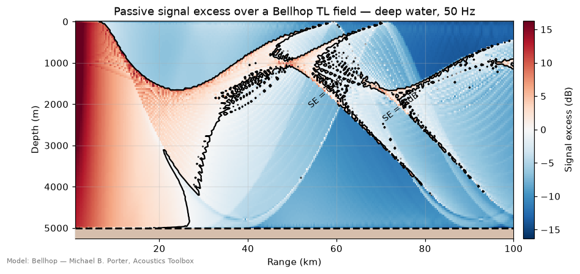
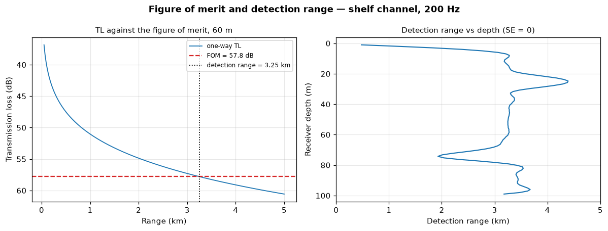
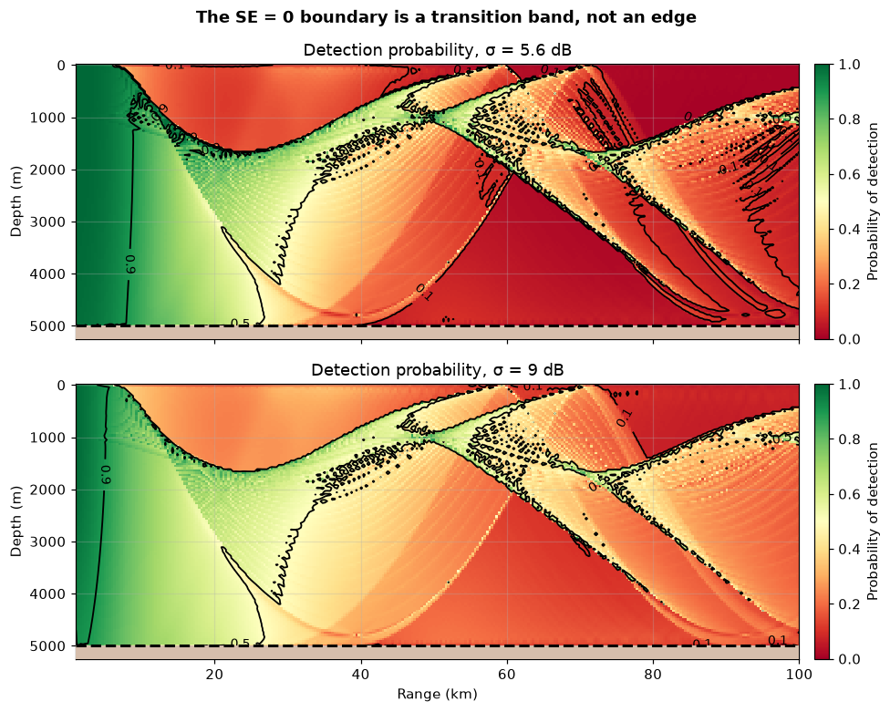
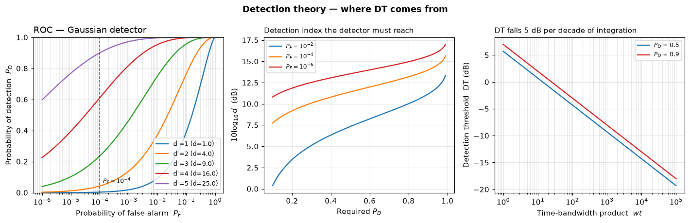
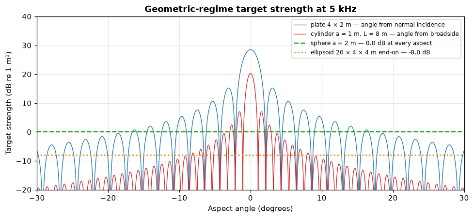
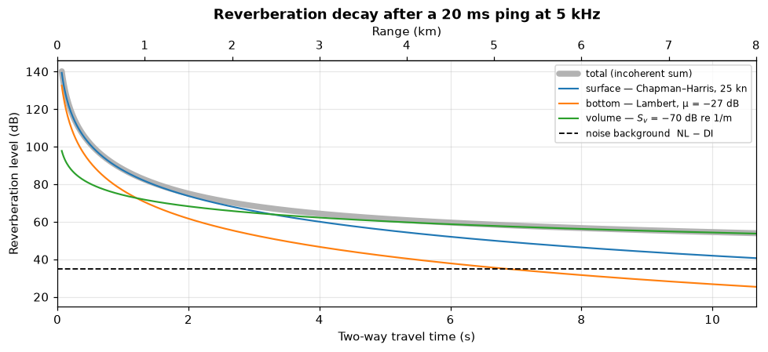
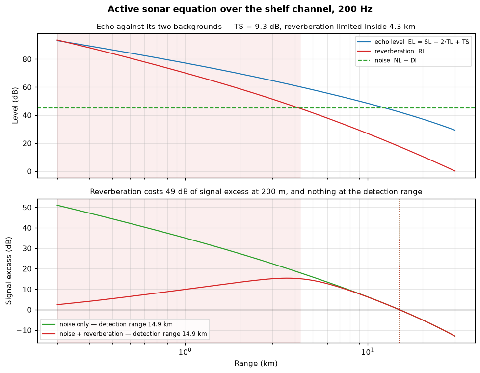
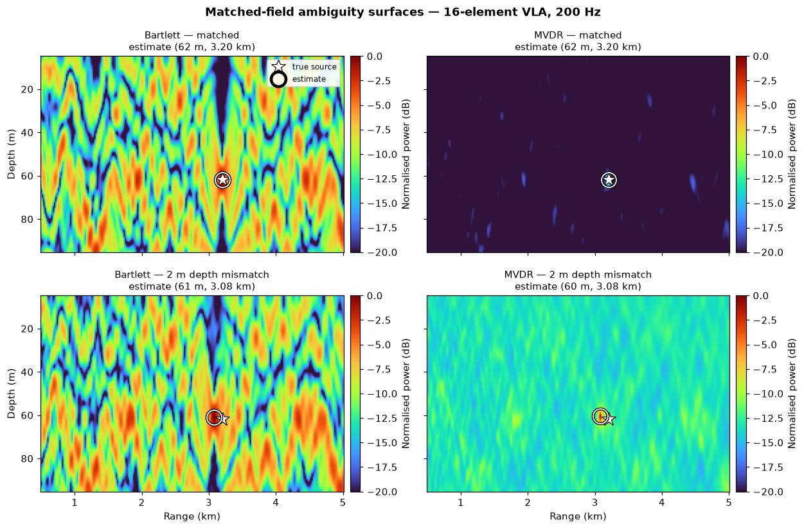
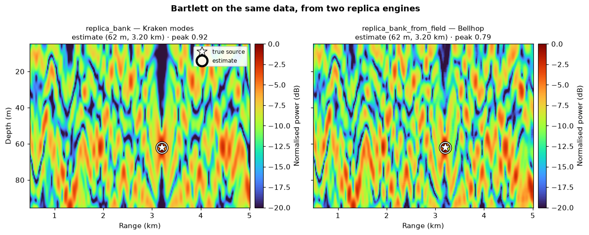

# Sonar — the sonar equation and what hangs off it

> `uacpy.sonar` · signal excess over a modelled TL field · detection theory ·
> reverberation · target strength · matched-field processing

Every other page in this guide is about the ocean or about a solver. This one
is about the **question you were asking in the first place**: can this sonar
detect that target, at what range, and how sure is the answer.

The whole page hangs off one equation. Section 1 states it; everything after is
a term in it, a way of getting a term, or a way of reading the result over a
grid.

The thing that makes it more than arithmetic is that `TL` comes from a
propagation model. A budget written with `20·log10(r)` gives you a circle on a
chart. A budget written over a Bellhop or Kraken field gives you the shape the
ocean actually has — convergence zones, shadow zones, a best depth — and that
is [§2](#2-signal-excess-over-a-modelled-tl-field).

---

## 1. The sonar equation

All terms are in decibels, and the sign of each is fixed by whether it helps or
hurts the detector.

### Passive

```
SE = SL − TL − (NL − DI) − DT − L_sp
   = SL − TL − NL + DI − DT − L_sp
```

You listen to a target that radiates `SL`. It arrives `TL` weaker. It competes
with ambient noise `NL`, which your array suppresses by `DI`. The detector needs
`DT` dB of margin to hit its design operating point, and `L_sp` accounts for
implementation loss.

**`SE ≥ 0` means the detector achieves its design `(P_D, P_F)`.** That is the
whole meaning of signal excess: not "the target is audible", but "the detector
you specified meets the specification you gave it".

### Active

The echo makes the round trip, so `TL` is paid **twice**, and the target's
ability to reflect enters as `TS`:

```
EL = SL − 2·TL + TS                            echo level

SE = SL − 2·TL + TS − (NL − DI) − DT − L_sp    noise-limited
SE = SL − 2·TL + TS − RL      − DT − L_sp      reverberation-limited
```

Two sign details worth pinning down:

- **`DI` is applied against `NL`, never against `RL`.** A beamformed receiver
  gets no gain against reverberation that arrives from inside its own beam —
  the beam width is already baked into `RL` through the scattering-cell size
  ([§7](#7-reverberation)). This follows Urick Ch. 8, and `active_signal_excess`
  enforces it.
- Give it **both** `noise_level` and `reverberation_level` and the two
  backgrounds are **power-summed**, `10·log10(10^((NL−DI)/10) + 10^(RL/10))`,
  per range. In practice that tracks whichever is louder, with a ~3 dB shoulder
  where they cross.

### Figure of merit

```
FOM = SL − (NL − DI) − DT − L_sp
```

Everything in the passive budget except `TL`. Rearranged, `SE = FOM − TL`, so
**the FOM is the maximum allowable one-way transmission loss**, and the `SE = 0`
detection boundary is nothing more than the `TL = FOM` contour of your
propagation field. That identity is the hinge between this page and every model
page.

It is a passive identity. For an active sonar it becomes the maximum allowable
*two-way* TL, and only when `TS = 0`; and it **fails outright when the sonar is
reverberation-limited**, because `RL` carries `SL` with it, so the FOM stops
being a constant and varies with range. [§8](#8-the-active-budget-end-to-end)
is that failure, plotted.

### The terms

| Term | Is | Sign | Where it comes from |
|---|---|---|---|
| `SL` | source level | `+` | the target (passive) or your projector (active) |
| `TL` | transmission loss | `−` once passive, `−2` active | **a propagation model** — [§2](#2-signal-excess-over-a-modelled-tl-field) |
| `NL` | ambient noise level | `−` | [noise](noise.md) — `WenzNoise.total` |
| `DI` | receiving directivity index | `+` | `10·log10(N)` for a λ/2 line array — [array processing](arrays.md#that-gain-against-isotropic-noise-is-the-sonar-equations-di) derives it |
| `AG` | array gain | `+` | replaces `DI` in anisotropic noise |
| `DT` | detection threshold | `−` | [§5](#5-detection-theory--where-dt-comes-from) |
| `TS` | target strength | `+` (active) | [§6](#6-target-strength) |
| `RL` | reverberation level | `−` (active) | [§7](#7-reverberation) |
| `L_sp` | implementation loss | `−` | your processing chain |

### The band-reference rule

**This is the one unit error that silently costs 20 dB**, and this page owns the
rule that [`noise.md`](noise.md#6-spectral-level-vs-band-level) defers to:

> `SL`, `NL` and `RL` must all share one band reference. Either *all* spectral
> levels (`NL` dB re 1 µPa²/Hz, `SL` dB re 1 µPa²·m²/Hz), or *all* band levels
> over the processing band (`NL` dB re 1 µPa², `SL` dB re 1 µPa²·m²).

The two differ by `10·log10(w)` — 20 dB at a 100 Hz band. The `DT` from
`detection_threshold_energy` is a **unitless power ratio**, correct for either
choice but only for a *matched* pair.

The two `uacpy.noise` products sit on opposite sides of this line:
`WenzNoise.total` is spectral, `radiated_noise_level` is a decidecade band
level. Convert one before differencing them.

### The API

```python
from uacpy import sonar
```

| Call | Returns |
|---|---|
| `echo_level(source_level, tl, target_strength)` | `EL` |
| `noise_background(noise_level, directivity_index=None, *, array_gain=None)` | `NL − DI` |
| `passive_signal_excess(source_level, tl, noise_level, directivity_index=None, detection_threshold=0.0, *, array_gain=None, processing_loss_db=0.0)` | `SE` |
| `active_signal_excess(source_level, tl, target_strength, *, noise_level=None, directivity_index=None, reverberation_level=None, detection_threshold=0.0, array_gain=None, processing_loss_db=0.0)` | `SE` |
| `figure_of_merit(source_level, noise_level, directivity_index=None, detection_threshold=0.0, *, array_gain=None, processing_loss_db=0.0)` | `FOM` |

`directivity_index` defaults to `None`, treated as 0 dB. `None` rather than
`0.0` so that "not supplied" stays distinguishable from a legitimate per-angle
`DI` array that happens to contain a zero. `array_gain` **replaces** it — passing
both raises `ConfigurationError`, because they are two parametrisations of the
same term. `AG = DI` only for isotropic noise; anisotropic noise or signal
coherence loss across the array makes `AG < DI`.

`active_signal_excess` with neither `noise_level` nor `reverberation_level`
raises: a signal excess against no background is not a number.

---

## 2. Signal excess over a modelled TL field

Every figure on this page is generated by
[`docs/figure_scripts/sonar.py`](../figure_scripts/sonar.py); the snippets
below are condensed from it, so the script is the authoritative figure code.

The `*_field` helpers take the `Field` a propagation model returned and
evaluate the sonar equation at every `(depth, range)` sample of it:

| Call | Takes | Gives |
|---|---|---|
| `passive_signal_excess_field(tl_field, *, source_level, noise_level, directivity_index=None, detection_threshold=0.0, array_gain=None, processing_loss_db=0.0)` | a TL `Field` | `SE` `Field` |
| `active_signal_excess_field(tl_field, *, source_level, target_strength, noise_level=None, reverberation_level=None, directivity_index=None, detection_threshold=0.0, array_gain=None, processing_loss_db=0.0)` | a TL `Field` | `SE` `Field` |
| `probability_of_detection_field(se_field, *, sigma_db)` | an `SE` `Field` | `P_D` `Field` |
| `detection_range_by_depth(se_field)` | an `SE` `Field` | `(depths, ranges)` |

```python
import numpy as np
import uacpy
from uacpy import sonar
from uacpy.models import Bellhop, Kraken, RunMode
from uacpy.visualization import (
    plot_detection_probability, plot_roc, plot_signal_excess)

from figure_scripts._common import deep_water, shallow_water

DT_PASSIVE = sonar.detection_threshold_energy(
    0.5, 1e-4, bandwidth_hz=50.0, integration_time_s=10.0)     # −7.79 dB

PASSIVE_DEEP = dict(source_level=125.0, noise_level=65.0,
                    directivity_index=15.0, detection_threshold=DT_PASSIVE)

env, source, receiver = deep_water()
tl = Bellhop(beam_type='G', n_beams=0, backend='fortran').run(
    env, source, receiver, run_mode=RunMode.INCOHERENT_TL)
se = sonar.passive_signal_excess_field(tl, **PASSIVE_DEEP)

plot_signal_excess(
    se, env=env,
    title='Passive signal excess over a Bellhop TL field — deep water, 50 Hz')
```



A Munk profile 5000 m deep, source at 1000 m, 50 Hz, receivers out to 100 km.
Warm is detectable, cool is not, and the black contour labelled `SE 0 dB` is
the detection boundary. With `FOM = 82.8 dB` for this budget, that contour is
**exactly the 82.8 dB TL contour** of the Bellhop field — the sonar equation has
done nothing but relabel the colour axis.

What that buys you is the shape. The detectable region is a solid lobe filling
the whole water column out to about 20 km, then it collapses: the boundary dives
to ~1700 m by 25 km and sends a tongue all the way to the seabed near 27 km.
Past that, detectability is not a disc at all — it survives only in slivers that
track the deep-sound-channel ray arcs, with warm bands reappearing near the
surface around 50 km and near 1000–1500 m out past 70 km. A range-independent
budget would have drawn a circle at 20 km and been wrong in both directions.

The speckled clusters of tiny closed contours around 1000–2000 m at 40–60 km are
worth recognising: that is beam-level graininess in the underlying incoherent TL,
and the `SE = 0` contour resolves it into confetti because it happens to pass
right through there. It is a property of the ray fan, not of the sonar — raise
`n_beams` and it settles down (see the [Bellhop gotchas](../models/bellhop.md#7-gotchas)).

**Nothing in `uacpy.sonar` cares which model produced the TL.** `Field` in,
`Field` out. The result keeps the run's identity and provenance, with the budget
recorded for you:

```python
>>> se.metadata['sonar_budget']
{'mode': 'passive', 'source_level': 125.0, 'noise_level': 65.0,
 'directivity_index': 15.0, 'detection_threshold': -7.79..., 'processing_loss_db': 0.0}
```

---

## 3. Figure of merit and detection range

```python
PASSIVE_SHELF = dict(source_level=110.0, noise_level=75.0,
                     directivity_index=15.0, detection_threshold=DT_PASSIVE)

env, source, receiver = shallow_water()
tl = Kraken().run(env, source, receiver, run_mode=RunMode.INCOHERENT_TL)
se = sonar.passive_signal_excess_field(tl, **PASSIVE_SHELF)

fom = sonar.figure_of_merit(**PASSIVE_SHELF)              # 57.79 dB
cut = se.at(depth=60.0)
r_det = sonar.detection_range(cut.coords['range'], cut.data)   # 3141.6 m
depths, ranges = sonar.detection_range_by_depth(se)
```



100 m of water at 200 Hz is `D/λ ≈ 13` — usable for either solver — and this
one runs on [Kraken](../models/kraken.md) rather than Bellhop because a
detection-range profile wants a TL field that is smooth in depth, which the
modal sum gives for free where a ray fan has to be converged into it. **The
sonar equation does not notice the change**: swap the model and the same
`passive_signal_excess_field` call takes its output.

**Left:** the FOM as a horizontal line on a TL plot. TL climbs from 43 dB near
the source through the 57.8 dB FOM at 3.14 km. Everything to the left of the
crossing is detectable; everything to the right is not. That picture is the
entire passive budget, and it is why `figure_of_merit` is worth having as its
own call — one number, comparable across sonars, that you can cross with any
model's TL.

**Right:** the same crossing repeated at every receiver depth.
`detection_range_by_depth` applies `detection_range` to each depth row of the
2-D field. The profile is not flat and not monotonic:

| Receiver depth | Detection range |
|---|--:|
| 1 m (shallowest) | 0.46 km |
| 24.8 m | **4.24 km** |
| 74.3 m | 1.85 km |
| 99 m (seabed) | 3.12 km |

The best depth is 24.8 m, which is where the source is — put your hydrophone at
the target's depth and the modal excitation matches. The worst is the shallowest
receiver, killed by the pressure-release surface, and there is a second bad band
near 74 m. A 9× swing in detection range across the water column, from one
environment and one budget: that is the argument for computing a field instead
of quoting a radius.

`detection_range` returns `np.inf` when `SE ≥ 0` at every sampled range and
`np.nan` when it is negative everywhere, so guard with `np.isfinite` before you
put it in a table.

**`np.isfinite` is not enough on its own.** There is a third case, and it does
not announce itself with a sentinel. If `SE` goes negative somewhere in the
middle of your grid and comes back positive at the **far edge** — a convergence
zone, a bottom-bounce lobe — then there is no crossing-down left to interpolate,
and the function returns the **last sampled range**. That is an ordinary finite
number in metres. It sails through `np.isfinite`, plots without complaint, and
is simply your `receiver.ranges[-1]` wearing a detection range's clothes.

It is a **lower bound**, not an answer, and the bound can be far below the
truth. On the deep-water budget of [§2](#2-signal-excess-over-a-modelled-tl-field)
(`FOM = 82.8 dB`), at the 2731 m receiver depth:

| `receiver.ranges` out to | `detection_range` returns |
|---|--:|
| 20 km | `20000.0 m` — *exactly the last sample* |
| 60 km | `45893.2 m` |

The 20 km run is not wrong about its own grid: `SE` really is `+0.9 dB` at
20 km. It just never saw the crossing, because the crossing is at 46 km. A
2.3× understatement, reported as a clean finite number.

So `np.isfinite` needs a second test beside it — but **not** the obvious
`r < ranges[-1]`. That comparison is right only while every range cell carries
data, and where the assumption fails it fails *quietly*.

**Compare against the last range with data, not the last range.**
`detection_range` masks the no-data cells out *before* it goes looking for the
far edge, so the number it returns on a far-edge recovery is the outermost
sampled range **that has data** — which equals `ranges[-1]` only when the outer
cells are filled. Give a 20 km grid three trailing no-data cells and a far-edge
recovery comes back as `17000.0 m`; `17000 < 20000` is true, so the `ranges[-1]`
test reports that lower bound as a trustworthy crossing. It fails in the
reassuring direction, which is the direction that costs you. And a TL field with
empty outer cells is ordinary, not exotic: `NaN` is the package's no-data
convention, and a Bellhop cell no ray reached is exactly that
([results](results.md#9-gotchas)).

Two guards do hold. Either compare against the last range the model actually
filled:

```python
r_det = sonar.detection_range(cut.coords['range'], cut.data)

known = np.isfinite(cut.data)                    # cells the model filled
last_known = cut.coords['range'][known][-1]      # 17000.0 m, not 20000.0 m
if np.isfinite(r_det) and r_det >= last_known:
    ...      # a lower bound — widen receiver.ranges and re-run
```

or catch the `UserWarning` the function raises for exactly this case, which is
the code's own mechanism and needs no bookkeeping of yours:

```python
import warnings

with warnings.catch_warnings(record=True) as caught:
    warnings.simplefilter('always')
    r_det = sonar.detection_range(cut.coords['range'], cut.data)

if any(issubclass(w.category, UserWarning) for w in caught):
    ...      # a lower bound — widen receiver.ranges and re-run
```

Either way, widen `receiver.ranges` until the answer stops moving. Neither guard
fires on a genuine interpolated crossing.

**`detection_range_by_depth` has no single number to compare against at all.**
It applies `detection_range` to each depth row independently, and each row masks
its own no-data cells, so "the last range with data" is a *per-row* quantity,
not a property of the field. On one 20 km grid, two depth rows that both recover
positive at their far edges returned `17000.0 m` and `12000.0 m` — two different
lower bounds, neither of them `ranges[-1]`, and a profile-wide `r < ranges[-1]`
passes both. Do the comparison row by row against
`ranges[np.isfinite(se_field.data[i])][-1]`, or read the warnings — with one
caveat. The function raises one warning per affected row, but the message quotes
that row's edge range, so under Python's default filter two rows sharing an edge
are deduplicated to a single warning: two rows both pinned at 17 km reported
**2** warnings under `simplefilter('always')` and **1** under the default filter.
Count rows, not warnings, unless you have set `'always'`.

It also **interpolates** linearly between the two samples that straddle the
crossing: `3141.6 m` sits between grid points at 3131.3 and 3151.2 m, on a
range axis spaced 19.9 m. Crossings quoted later on this page from a plotted curve
rather than from `detection_range` — the reverberation orderings in
[§7](#7-reverberation), the reverberation-limited edge in
[§8](#8-the-active-budget-end-to-end) — are the **grid sample** where the sign
changes, and the two conventions can differ by up to one cell.

### Where `noise_level` comes from — `WenzNoise` into the budget

Every budget on this page passes `noise_level=` as a bare literal, which is fine
for teaching and useless for a real site. [`uacpy.noise`](noise.md) is where the
number actually comes from, and joining the two takes one conversion — the
[band-reference rule](#the-band-reference-rule), applied:

```python
from uacpy.noise import WenzNoise

BW = 50.0                                            # the processing band, Hz
wenz = WenzNoise(frequencies=200.0, wind_speed_kn=10.0, shipping_level='medium')
nl_band = float(wenz.total[0]) + 10 * np.log10(BW)   # 64.53 -> 81.52 dB

fom = sonar.figure_of_merit(source_level=110.0, noise_level=nl_band,
                            directivity_index=15.0,
                            detection_threshold=DT_PASSIVE)   # 51.27 dB
```

`WenzNoise.total` is a **spectral** level — 64.53 dB re 1 µPa²/Hz at 200 Hz for
10 kn of wind and medium shipping. `figure_of_merit` neither knows nor can check
that; it just subtracts whatever you hand it. So `SL = 110.0` here has to be a
**band** level too, dB re 1 µPa²·m² over the same 50 Hz — which is why the
`+ 10·log10(BW)` line exists, and why it must not be skipped.

Skip it, pass the raw 64.53, and `figure_of_merit` returns **68.26 dB** instead
of 51.27. Nothing raises, nothing warns, and the budget is 16.99 dB
(`= 10·log10(50)`) optimistic — the one error [§1](#the-band-reference-rule)
opens by naming, in the place where a newcomer is most likely to make it.

---

## 4. From signal excess to probability of detection

`SE = 0` is a threshold on a mean, and the ocean does not deliver means. The
received level fluctuates, so a target sitting exactly on the boundary is
detected about half the time — provided `DT` was set at the `P_D = 0.5`
operating point, the minimum detectable level, which is what `DT_PASSIVE` and
`DT_ACTIVE` on this page do. `Φ(0) = 0.5` whatever `DT` you passed, so a budget
built for `P_D = 0.9` still reports 0.5 on its own `SE = 0` contour and the two
statements stop agreeing. Recompute `DT` at 0.5, or read the surface as a
relative one.

`probability_of_detection_field` applies the **log-normal** transition curve:
the decision statistic is taken log-normal, so in dB it is Gaussian with
standard deviation `sigma_db`, giving

```
P_D = Φ(SE / sigma_db)
```

```python
env, se = _passive_deep()      # the §2 run, factored into a helper
for sigma in (5.6, 9.0):
    pd = sonar.probability_of_detection_field(se, sigma_db=sigma)
    plot_detection_probability(pd, env=env,
                               title=f'Detection probability, σ = {sigma:g} dB')
```



The same deep-water field as §2, now read as probability. Green is detected, red
is lost, and the contours are `P_D = 0.1`, `0.5`, `0.9`.

**The `P_D = 0.5` contour is identical in both panels** — it *is* the `SE = 0`
boundary, unchanged, because `Φ(0) = 0.5` for any `σ`. What `σ` changes is the
width of the band around it. At `σ = 5.6` dB the transition is tight: the field
goes from confident green to confident red across a narrow strip. At `σ = 9` dB
the same boundary smears into wide yellow and orange margins — the `0.9` contour
retreats toward the source and the `0.1` contour pushes far beyond it. The
detectable *area* barely moves; the certainty with which you can speak about its
edge collapses.

`sigma_db` has **no default**, deliberately. It is a physical claim about the
channel, not a processing knob. Dyer's *saturated-multipath* result gives
`σ ≈ 5.6` dB; measured one-way totals typically run 5–9 dB, which is exactly
the span the two panels bracket. Saturation is the precondition: many arrivals
of comparable amplitude and effectively random phase are the central-limit
condition for a circular complex-Gaussian field — a Rayleigh envelope and an
**exponentially** distributed intensity. The log-normal is a *fit* to that, and
5.6 dB is the number that makes the fit: the dB-domain spread of an exponential
is `(10/ln10)·π/√6 = 5.57` dB. A two-path or few-path channel is not saturated,
and the Gaussian-in-dB model has no claim on it.

The log-normal approximation is most accurate near `SE = 0` and optimistic in
the tails. For fluctuation statistics beyond Gaussian-in-dB the standard tool
is Abraham's **gamma fluctuating-intensity** model, parametrised by SNR and a
scintillation index — `SI = 0` deterministic, `SI = 1` Gaussian-fluctuating,
higher means more fluctuation, and `SI ≈ 2.5` reproduces the `σ_dB = 10` case.
`uacpy` does not implement it, and neither of the detector functions in
[§5](#5-detection-theory--where-dt-comes-from) is a fluctuating-signal `P_D`
model.

---

## 5. Detection theory — where DT comes from

`DT` is the only term in the sonar equation that is not about the ocean or the
target. It is about **what you promised**: a required probability of detection
at a tolerated false-alarm rate. Everything in this section is the machinery
that turns that promise into decibels.

| Call | Gives |
|---|---|
| `deflection_coefficient(pd, pf)` | `d' = Φ⁻¹(P_D) − Φ⁻¹(P_F)` — separation in noise σ |
| `detection_index(pd, pf)` | `d = (d')²` — Urick's detection index |
| `probability_of_detection(deflection, pf)` | `P_D = Q(Q⁻¹(P_F) − d')`; `pf` may be an array |
| `roc_curve(deflection, n_points=200)` | `(P_F, P_D)` arrays, `P_F` log-spaced over `[1e-6, ~1]` |
| `albersheim_snr(pd, pf, n_pulses=1)` | required per-sample SNR (dB), envelope detector |
| `detection_threshold_energy(pd, pf, bandwidth_hz, integration_time_s)` | `DT` (dB), energy detector |

```python
plot_roc([1.0, 2.0, 3.0, 4.0, 5.0], title='ROC — Gaussian detector')

pd_axis = np.linspace(0.1, 0.99, 200)
d = [sonar.detection_index(p, 1e-4) for p in pd_axis]

wt = np.logspace(0.0, 5.0, 200)
dt = [sonar.detection_threshold_energy(0.5, 1e-4, bandwidth_hz=m,
                                       integration_time_s=1.0) for m in wt]
```



**Left — the ROC.** One curve per deflection `d' = 1…5`; the legend also reports
`d = (d')²`. Read it at the dashed line, `P_F = 10⁻⁴`: a detector with `d' = 4`
reaches `P_D ≈ 0.61` there, and you need `d' = 5` to reach `P_D ≈ 0.9`. Buying a
decade of false-alarm rate costs real deflection, which is what makes `P_F` an
engineering decision rather than a preference. `plot_roc` takes a scalar or a
sequence of deflections, or pre-computed `pfa`/`pd` arrays.

**Middle — the price of a requirement.** `10·log10 d` against required `P_D`, for
three false-alarm rates. This is the detector's side of the contract: at
`P_D = 0.5` and `P_F = 10⁻⁴` you need `d = 13.8`, i.e. 11.4 dB. Tightening `P_F`
from `10⁻²` to `10⁻⁶` costs 6.2 dB there — and only 4.5 dB at `P_D = 0.9`, which
is why the three curves converge to the right. False alarms are cheapest to
suppress on a sonar that is already asking for high detection probability. The
curves also steepen as `P_D → 1`: the last few percent are the expensive ones.

**Right — where integration pays it back.** `DT = 5·log10(d / (w·t))` for an
incoherent energy detector, plotted against the time-bandwidth product. The
lines are straight with slope **−5 dB per decade**: every tenfold increase in
`w·t` relaxes the required SNR by 5 dB. That is the entire reason a passive
sonar integrates. The two curves are `P_D = 0.5` and `P_D = 0.9`, separated by
only ~1.3 dB — cheap compared to what integration buys.

This is where the page's `DT` values come from:

```python
DT_PASSIVE = sonar.detection_threshold_energy(
    0.5, 1e-4, bandwidth_hz=50.0, integration_time_s=10.0)     # −7.79 dB
DT_ACTIVE  = sonar.detection_threshold_energy(
    0.5, 1e-4, bandwidth_hz=100.0, integration_time_s=0.5)     # −2.79 dB
```

Both aim at the same `(0.5, 10⁻⁴)` operating point. The passive sonar's
`w·t = 500` earns a **negative** `DT` — it detects signals below the noise, which
is the normal state of affairs for a narrowband passive system. The active
sonar's half-second ping over 100 Hz gives `w·t = 50` and 5 dB less relief.

### Which `DT` you are holding

`detection_threshold_energy` returns `DT = 5·log10(d / (w·t))`, the required
ratio of signal to noise **power spectral density**. It is a unitless power
ratio, valid whenever `SL` and `NL` share a reference — the rule from
[§1](#the-band-reference-rule).

Urick's form is the *other* one, `DT = 5·log10(d·w/t)`: signal band power
referenced to noise in a 1 Hz band (Abraham's `DT_Hz`, units dB re Hz). The two
differ by `10·log10(w)`. If you are transcribing a `DT` out of a textbook,
check which one it is before it costs you 20 dB.

Both forms are the large-`w·t` Gaussian (CLT) approximation to the
energy-detector statistic, so the left-hand end of the right-hand panel above —
`w·t` near 1 — is the least trustworthy part of that plot.

Two more transcription traps. Modern sonar-modelling literature calls this term
the **recognition differential** `RD` and measures the threshold SNR at the
display rather than at the receiver input terminals, which is where `DT` is
measured; the page's `L_sp` covers most of that gap. And Urick subscripts it
`RD_N` and `RD_R` — **the required margin is not the same number against noise
as against reverberation** — while `active_signal_excess` takes a single
`detection_threshold` for both backgrounds. If the two differ for your system,
run the noise-limited and reverberation-limited budgets separately.

`albersheim_snr` answers a different question: the per-sample SNR required by a
linear or square-law **envelope** detector after non-coherent integration of
`n_pulses` samples, for a **non-fluctuating (deterministic) target** — the case
Abraham §2.3.5.2 covers, appropriate when conditions do not change much from
ping to ping. A fluctuating target needs more SNR than this returns.

It is a closed-form fit to Robertson's curves. The usual quoted accuracy is
~0.2 dB over `0.1 ≤ P_D ≤ 0.9` and `10⁻⁷ ≤ P_F ≤ 10⁻³`; Abraham §2.3.5.2, after
Tufts & Cann (1983), gives it as holding at least over `0.3 ≤ P_D ≤ 0.95`,
`10⁻⁸ ≤ P_F ≤ 10⁻⁴` and **`n_pulses ≤ 16`**. Past 16 pulses it still runs and
is still usable, just less accurate — worst near `P_D` = 0 or 1 — and nothing
in `albersheim_snr` warns you. It is the right call for a pulsed active system
where the energy-detector model does not fit.

---

## 6. Target strength

`TS` is the target's contribution to the active budget: how much of what you
put on it comes back, in dB re 1 m².

| Call | Formula | Aspect | Regime |
|---|---|---|---|
| `ts_sphere(radius_m, *, frequency_hz=None, sound_speed=1500.0)` | `10·log10(a²/4)` | flat | `ka > 10` |
| `ts_convex(radius1_m, radius2_m, *, frequency_hz=None, sound_speed=1500.0)` | `10·log10(a₁a₂/4)` | one aspect | `ka > 10` on the smaller radius |
| `ts_ellipsoid(a_m, b_m, c_m, *, frequency_hz=None, sound_speed=1500.0)` | `20·log10(bc/2a)` | viewed along `a` | `ka > 10` on `min(b²/a, c²/a)` — **not on any semi-axis** |
| `ts_cylinder(radius_m, length_m, frequency_hz, *, angle_deg=0.0, sound_speed=1500.0)` | `10·log10[(aL²/2λ)·sinc²β·cos²θ]` | **from broadside** | `ka > 1` |
| `ts_plate(width_m, height_m, frequency_hz, *, angle_deg=0.0, sound_speed=1500.0)` | `10·log10[(wh/λ)²·sinc²β·cos²θ]` | **from normal incidence** | `k·min(w,h) > 2π`, i.e. both dimensions at least a wavelength |

The split runs down the middle of that table. The first three are
**frequency-flat**: a rigid convex body in the geometric regime returns the same
strength whatever you ping it with, and `ts_ellipsoid` is literally
`ts_convex(b²/a, c²/a)`. Their `frequency_hz` argument is optional and is used
for **nothing but the validity warning** — pass it and you get told when `ka`
has fallen below the geometric regime; omit it and you get the formula with no
check. The last two are finite apertures, so they carry a wavelength and a
radiation pattern.

**That delegation moves `ts_ellipsoid`'s `ka` test off the semi-axes**, and the
table cell says so because the arithmetic a reader does by hand will not match
the one the code does. `ka > 10` is checked on `min(b²/a, c²/a)` — the principal
**radii of curvature** at the tip of the `a` axis, which for anything but a
sphere are nothing like `a`, `b` or `c`. The gap is large and it runs both ways.
Take a needle, `a = 10 m`, `b = c = 1 m`, pinged end-on at 1 kHz in 1500 m/s
water (`k = 4.19 rad/m`): compute `ka` from the semi-axis and you get **41.9**,
comfortably geometric — but the radii of curvature are `b²/a = 0.1 m`, the code
checks **0.42**, and it warns, naming `ts_convex` rather than the function you
called. A factor of 100 between the reader's number and the code's. Invert the
body — an oblate `a = 1 m`, `b = c = 10 m` — and it reverses: `ka` from the
semi-axis is **4.19** and looks invalid, while the radii of curvature are
`b²/a = 100 m`, the code checks **419**, and no warning fires. The page's own
`ts_ellipsoid(20.0, 4.0, 4.0)` at 5 kHz is a valid call, but not for the reason
`k·a = 419` suggests: its radii of curvature are `0.8 m` and the real check is
`k·0.8 = 16.8`.

This is not a quirk to route around — it is the formula being honest. High-
frequency backscatter from a smooth convex body is set by how sharply the
surface curves where the sound strikes it, not by how large the body is, so
curvature is the quantity that has to clear the geometric threshold. A long thin
target ensonified end-on really is a poor geometric scatterer at 1 kHz, however
long it is. When the warning names `ts_convex`, it is naming the function that
holds the test, not reporting a call you did not make.

```python
freq = 5000.0
angles = np.linspace(-30.0, 30.0, 2401)

plate     = sonar.ts_plate(4.0, 2.0, freq, angle_deg=angles)
cylinder  = sonar.ts_cylinder(1.0, 8.0, freq, angle_deg=angles)
sphere    = sonar.ts_sphere(2.0, frequency_hz=freq)                    #  0.0 dB
ellipsoid = sonar.ts_ellipsoid(20.0, 4.0, 4.0, frequency_hz=freq)      # −8.0 dB
```



5 kHz, because the geometric forms need `ka ≫ 1` and the 200 Hz channels used
elsewhere on this page do not deliver it.

Two flat lines and two beam patterns, and the contrast is the point. The
**sphere**, radius 2 m, returns 0.0 dB from every direction — the classic
calibration anchor. The **ellipsoid**, 20 × 4 × 4 m viewed end-on, returns
−8.0 dB: five times longer than the sphere is wide, and *quieter*, because
elongation along the line of sight flattens the curvature at the tip and sprays
the energy elsewhere. Size is not target strength.

The **plate**, 4 × 2 m, peaks at 28.5 dB at normal incidence, and the **cylinder**,
a = 1 m and L = 8 m, at 20.3 dB broadside. Both then fall off a cliff. The
null-to-null main lobe is `≈ λ/L` radians for the cylinder — 2.1° at 5 kHz —
and `≈ λ/w` for the plate, 4.3°. Rotate the cylinder three degrees — well past
the first null at 1.07° — and **23 dB** of echo is gone: 20.3 dB broadside
becomes −2.9 dB out on the sidelobes. Land on a null instead and all of it is
gone. **A single `TS` number in a budget is a strong assumption**, and
the aspect-dependent forms exist to tell you how strong.

Both patterns null exactly at end-on, and real bodies do not: end-caps and
edges keep reflecting. Treat the aspect curves as valid near their main lobe
only.

---

## 7. Reverberation

Reverberation is your own transmission coming back off the sea itself — the
boundaries and the volume — and in an active sonar it is usually the background
that matters. Unlike noise, it is *your* signal, which changes the arithmetic
completely ([§8](#8-the-active-budget-end-to-end)).

Both forms use the short-pulse cell-scattering approximation. The cell has
range extent `cτ/2` — half the pulse travel — and the two differ in how it grows:

```
boundary:  RL(r) = SL − 2·TL(r) + S_b + 10·log10(Φ · r   · cτ/2)
volume:    RL(r) = SL − 2·TL(r) + S_v + 10·log10(Ψ · r²  · cτ/2)
```

`Φ` is the equivalent two-way horizontal beamwidth (rad), `Ψ` the equivalent
two-way solid-angle beamwidth (sr). A boundary cell is an annular patch that
grows as `r`; a volume cell is a shell segment that grows as `r²`.

A boundary annulus is strictly `cτ/(2·cos θ_g)` wide down-range;
`boundary_reverberation` uses the `θ_g → 0` limit `cτ/2`, the usual convention.
That under-states the cell by `−10·log₁₀(cos θ_g)` — 1.5 dB at 45° grazing,
0.3 dB at 20°, nothing below 10° — so it matters only in the first few cells
after the ping.

| Call | |
|---|---|
| `boundary_reverberation(ranges_m, source_level, scattering_strength_db, *, pulse_length_s, horizontal_beamwidth_rad, sound_speed=1500.0, tl_db=None)` | surface or bottom |
| `volume_reverberation(ranges_m, source_level, scattering_strength_db, *, pulse_length_s, solid_angle_beamwidth_sr, sound_speed=1500.0, tl_db=None)` | scattering layers |
| `total_reverberation(*levels_db)` | incoherent (power) sum |

`tl_db=None` falls back to spherical spreading, `20·log10(r)`. Pass an array or
a callable to use a **modelled** TL instead — the same move as §2, and §8 does
exactly that.

### Scattering strength

| Call | |
|---|---|
| `lambert_bottom(grazing_deg, mu_db=-27.0)` | `S_b = µ_dB + 20·log10(sin θ)`, the **monostatic** case of `S_b = 10·log10(µ sin θ_i sin θ_s)`; Mackenzie's −27 dB; holds below ~45° grazing |
| `chapman_harris_surface(grazing_deg, wind_speed_kn, frequency)` | wind-driven sea surface; fitted by Chapman & Harris over 0.4–6.4 kHz, validated by Chapman & Scott over 0.1–6.4 kHz for θ < 80°, though the underlying data are all below 40° grazing |
| `column_scattering_strength(sv_db, thickness_m)` | `S_v + 10·log10(h)` — a scattering layer as an equivalent area strength |

`LAMBERT_MU_DB` is exported if you want the constant itself. Any substitute is
bounded above by **−4.97 dB** — `µ = 1/π`, the diffuse-scattering ceiling that
conservation of energy imposes — so Mackenzie's −27 dB sits 22 dB under the
limit, and a value above −5 dB is unphysical rather than merely loud. Both
scattering laws here are **backscatter**; a bistatic geometry needs both the
incident and the scattered grazing angle, and nothing in `uacpy.sonar` takes
two.

```python
ranges = np.linspace(50.0, 8000.0, 700)
grazing = np.rad2deg(np.arctan2(50.0, ranges))   # sonar 50 m off each boundary

bottom = sonar.boundary_reverberation(
    ranges, 210.0, sonar.lambert_bottom(grazing),
    pulse_length_s=0.02, horizontal_beamwidth_rad=0.15, sound_speed=1500.0)
surface = sonar.boundary_reverberation(
    ranges, 210.0,
    sonar.chapman_harris_surface(grazing, wind_speed_kn=25.0, frequency=5000.0),
    pulse_length_s=0.02, horizontal_beamwidth_rad=0.15, sound_speed=1500.0)
volume = sonar.volume_reverberation(
    ranges, 210.0, -70.0,
    pulse_length_s=0.02, solid_angle_beamwidth_sr=0.01, sound_speed=1500.0)

total = sonar.total_reverberation(bottom, surface, volume)
background = sonar.noise_background(55.0, 20.0)          # 35.0 dB
```



A 20 ms ping at 5 kHz, plotted against two-way travel time with range on the
top axis. The two boundary terms dominate at the start — 139 dB surface and
133 dB bottom at 50 m, against 98 dB of volume — but they decay **at three
different rates**, and the rates are not empirical. They fall straight out of
the cell geometry:

| Component | at 1 km | at 8 km | decay | why |
|---|--:|--:|--:|---|
| surface — Chapman–Harris, 25 kn | 81.6 dB | 40.6 dB | −45.5 dB/decade | −30 geometry, −15.5 from `S_s(θ)` |
| bottom — Lambert, µ = −27 dB | 70.4 dB | 25.3 dB | −50.0 dB/decade | −30 geometry, −20 from `20·log10(sin θ)` |
| volume — `S_v` = −70 dB re 1/m | 71.7 dB | 53.7 dB | −20.0 dB/decade | −40 spreading, +20 from the `r²` cell |

With spherical spreading, `−2·TL` contributes `−40 dB/decade`. The volume cell
gives `+20` back, leaving `−20`. A boundary cell gives only `+10`, leaving
`−30`, and then the grazing angle falls as `1/r` and drags the scattering
strength down with it — steeply for Lambert, more gently for Chapman–Harris.

**Every rate in that table is conditioned on spherical spreading**, which is
what `tl_db=None` gives you. A waveguide changes them: in a shallow-water
mode-stripping region where `TL = 15·log₁₀ r`, boundary reverberation decays at
20 dB/decade rather than 30. Worse for planning, Zhou and Harrison show that
under Lambert's rule the echo and the reverberation both settle to `30·log₁₀ r`
at ranges large compared with the water depth, so the signal-to-reverberation
ratio **stops improving with range altogether**. Pass `tl_db=` a modelled TL, as
[§8](#8-the-active-budget-end-to-end) does, and the rate comes out right without
your having to know which regime you are in.

So the ordering **inverts with range**. Volume overtakes bottom at 914 m and
surface at 2.47 km, and by 8 km the grey total is within 0.2 dB of the volume
term alone: the two boundary components have stopped mattering. Bottom
reverberation crosses below the `NL − DI` line at 5.13 km (6.85 s) — past that
it is quieter than the ambient noise and there is no point modelling it.

The practical reading: **boundary reverberation is a near-field problem, volume
reverberation is a far-field one.** Which one you must fight depends on how far
out your target is.

---

## 8. The active budget, end to end

This is the section where everything meets: a modelled TL field from §2, a `TS`
from §6, a reverberation curve from §7, and a `DT` from §5.

```python
DT_ACTIVE = sonar.detection_threshold_energy(
    0.5, 1e-4, bandwidth_hz=100.0, integration_time_s=0.5)      # −2.79 dB
ACTIVE_SL, ACTIVE_NL, DIRECTIVITY = 170.0, 60.0, 15.0
PULSE_S, BEAMWIDTH_RAD, SONAR_HEIGHT = 0.5, 0.3, 75.0

env, source, _ = shallow_water()
receiver = uacpy.Receiver(depths=np.linspace(1.0, 99.0, 60),
                          ranges=np.linspace(200.0, 30_000.0, 300))
tl_field = Kraken().run(env, source, receiver, run_mode=RunMode.INCOHERENT_TL)
ranges = receiver.ranges
tl = tl_field.at(depth=60.0).data
tl_bottom = tl_field.at(depth=99.0).data

ts = sonar.ts_cylinder(2.0, 8.0, 200.0)                         # 9.3 dB
el = sonar.echo_level(ACTIVE_SL, tl, ts)
nl_di = sonar.noise_background(ACTIVE_NL, DIRECTIVITY)          # 45.0 dB

grazing = np.rad2deg(np.arctan2(SONAR_HEIGHT, ranges))
rl = sonar.boundary_reverberation(
    ranges, ACTIVE_SL, sonar.lambert_bottom(grazing),
    pulse_length_s=PULSE_S, horizontal_beamwidth_rad=BEAMWIDTH_RAD,
    tl_db=tl_bottom)

se_noise = sonar.active_signal_excess(
    ACTIVE_SL, tl, ts, noise_level=ACTIVE_NL,
    directivity_index=DIRECTIVITY, detection_threshold=DT_ACTIVE)
se_both = sonar.active_signal_excess(
    ACTIVE_SL, tl, ts, noise_level=ACTIVE_NL, directivity_index=DIRECTIVITY,
    reverberation_level=rl, detection_threshold=DT_ACTIVE)
```

Note `tl_db=tl_bottom` on the reverberation call: the scattering patch is on the
seabed, so its two-way loss is the modelled TL **at the seabed**, not spherical
spreading and not the TL to the target at 60 m. And the grazing angle falls as
the range grows, because the sonar sits 75 m above the bottom.

The `TS` is the weak number here. `ka = 1.7` at 200 Hz on a 2 m radius: above
`ts_cylinder`'s stated `ka > 1` floor, so it does not warn, but inside the
resonance regime [§6](#6-target-strength) says to avoid. Read 9.3 dB as an
order of magnitude, not a measurement: it shifts `EL` and both `SE` curves
bodily, and with them every range quoted below, while leaving their shape and
the reverberation crossover untouched.



**Top — the echo against its two backgrounds.** `EL` and `RL` are on top of each
other at 200 m — 92.8 and 93.2 dB — and separate as they go out, because `RL`
decays faster (§7). `NL − DI` is flat at 45 dB. The shaded band marks where
reverberation is the louder background: inside 4.19 km. `EL` crosses the noise
floor at 12.1 km, and detection survives 2.3 km past that, out to 14.4 km,
because `DT_ACTIVE` is −2.79 dB: the integration gain of §5 is a credit that
buys margin *below* the noise floor.

**Bottom — what that does to signal excess.** Without reverberation (green), `SE`
starts at 50.6 dB and falls monotonically. With it (red), `SE` at 200 m is
48.2 dB lower — **2.3 dB** of margin instead of 51 — and then it *rises* with
range to a peak of 15.1 dB at 3.6 km before rejoining the noise-limited curve.
Both curves reach `SE = 0` at **exactly the same 14.44 km**.

That is the whole lesson of reverberation-limited operation, and it survives
inspection of the equations:

```
SE_reverb-limited = (SL − 2·TL + TS) − (SL − 2·TL_b + S_b + 10·log10(cell)) − DT
```

**`SL` cancels exactly.** Inside the shaded zone, turning the projector up raises
the echo and the reverberation by identical amounts, and buys precisely nothing.
The knobs that do work there are the ones that shrink the scattering cell — a
narrower beam, and above all more **bandwidth** — or a receiver that resolves the
target's Doppler away from the reverberation. Bandwidth is the first lever:
pulse duration by itself does nothing, and for a CW pulse the only way to buy
bandwidth is to shorten it, `W = 1/T_p`, which is why the advice is usually
phrased as "shorten the pulse". An FM sweep breaks that link and gives separate
control of the two, which is the reason FM waveforms exist. Outside the zone the
sonar is noise-limited, `SL` works normally again, and that is where the
detection range is actually set.

The field-grid counterpart of the same call is `active_signal_excess_field`,
which takes the whole TL `Field` and accepts `reverberation_level` as either a
scalar or a 1-D per-range array matching the field's `'range'` axis.

---

## 9. Matched-field processing

The sonar equation asks *whether* you can detect. MFP asks **where the source
is**, and answers with range and depth at once by using the multipath structure
rather than fighting it.

A **replica** is the ocean's Green's function — the pressure a point source at a
hypothesised position would produce — sampled at the array elements. Scan the
replicas across a candidate grid, correlate each against the measured
cross-spectral density matrix, and the peak of the resulting **ambiguity
surface** is the localisation estimate.

| Call | Gives |
|---|---|
| `synthesize_replica(modes, src_depth, ranges, array_depths)` | one replica, `(N, R)` |
| `replica_bank(modes, array_depths, candidate_depths, candidate_ranges)` | `(N, n_z, n_r)` from Kraken modes |
| `replica_bank_from_field(field, *, array_depths=None)` | `(N, *grid)` from any coherent `Field`/`ResultStack` |
| `csdm(snapshots)` | `(N, N)` from `(N, L)` complex snapshots |
| `bartlett(K, replicas)` | `P_B = eᴴKe / (eᴴe · tr K)`, normalised to `[0, 1]` |
| `mvdr(K, replicas, diagonal_loading=1e-2)` | `P_MV = 1 / (eᴴK⁻¹e)`, max scaled to 1 |

`replica_bank` evaluates the Kraken far-field modal sum directly, so the
eigenpairs are computed once and every grid point is a cheap analytic re-sum. It
models a **vertical line array**: every element shares the candidate range. Both
processors unit-normalise each replica, so the omitted global source scalar
divides out.

### Bartlett vs MVDR, matched and mismatched

```python
ARRAY_DEPTHS = np.linspace(5.0, 95.0, 16)       # 16-element vertical array
TRUE_DEPTH, TRUE_RANGE = 62.0, 3200.0
CAND_DEPTHS = np.linspace(5.0, 95.0, 181)
CAND_RANGES = np.linspace(500.0, 5000.0, 226)

env, source, _ = shallow_water()
modes = Kraken().compute_modes(env, source)                  # 14 modes
bank = sonar.replica_bank(modes, ARRAY_DEPTHS, CAND_DEPTHS, CAND_RANGES)

# The data come from a channel that is really 102 m deep; the bank is built
# for the 100 m on the chart.
true_env = uacpy.Environment(
    name='The ocean, 2 m deeper than charted',
    bathymetry=102.0,
    ssp=[(0.0, 1500.0), (30.0, 1495.0), (102.0, 1490.0)],
    bottom=uacpy.BoundaryProperties(acoustic_type='half-space',
                                    sound_speed=1650.0, density=1.8,
                                    attenuation=0.6),
)
k_matched = _csdm(modes)
k_mismatched = _csdm(Kraken().compute_modes(true_env, source))

sonar.bartlett(k_matched, bank)
sonar.mvdr(k_matched, bank, diagonal_loading=1e-3)
sonar.bartlett(k_mismatched, bank)
sonar.mvdr(k_mismatched, bank, diagonal_loading=1e-3)
```

`_csdm` is the figure module's data simulator, and it is a handful of lines of
`uacpy.sonar` plus numpy: `synthesize_replica` at the true position, 50
snapshots given random phase, complex Gaussian noise added at 10 dB SNR, and
`csdm()` over the result. It takes a `Modes` set, so passing a *perturbed*
environment's modes is how the mismatch below is staged — the data come from one
ocean, the replicas from another.



Four surfaces on a common −20 dB colour floor, with the true source starred and
each processor's own peak circled.

| | Bartlett | MVDR, `diagonal_loading=1e-3` |
|---|---|---|
| matched — estimate | (62 m, 3.20 km) — **exact** | (62 m, 3.20 km) — **exact** |
| matched — median level below peak | −10.4 dB | **−21.7 dB** |
| 2 m mismatch — estimate | (61 m, 3.08 km) | (60 m, 3.08 km) |
| 2 m mismatch — median level below peak | −10.4 dB | −13.3 dB |

Both processors find the source exactly when the replicas match the water. What
separates them is everything that is *not* the source. Matched Bartlett is a
mottled field of sidelobes sitting about 10 dB down — it is the matched filter,
robust and broad-lobed, and it never claimed to suppress anything. Matched MVDR
is almost black: its median cell is 21.7 dB below the peak, past the figure's
colour floor, which is why the panel reads as empty space around a single point.
That contrast is the entire reason to pay for the inverse.

Now chart the water 2 m too shallow. **Bartlett barely notices**: its estimate
slips to (61 m, 3.08 km) — one metre and 120 m of range — and its background
does not move at all, still 10.4 dB down. **MVDR loses the thing you bought it
for**: the surface lifts from −21.7 dB to −13.3 dB, over 8 dB of suppression
gone, and the panel turns from black to uniform mottled green with the peak
barely distinguishable from the clutter. It still points roughly the right way,
but it no longer speaks with authority.

That is the MFP trade in one figure, and it is why `loading` exists: raising it
flattens MVDR toward Bartlett, trading resolution for robustness. Loading is
also **required** when `K` is rank-deficient — a single snapshot, for instance.

### Replicas from any model

`replica_bank` needs Kraken modes. `replica_bank_from_field` needs only a
coherent pressure `Field`, from whatever produced it — a replica is a Green's
function, and modes, a ray sum and a PE march are three ways of evaluating the
same one.

```python
# One Bellhop run fills the whole bank: candidate depths are the source depths,
# array elements are the receivers, candidate ranges are the range axis. The
# run returns a ResultStack over source_depth.
swept = uacpy.Source(depths=CAND_DEPTHS, frequencies=200.0)
array = uacpy.Receiver(depths=ARRAY_DEPTHS, ranges=CAND_RANGES)
stack = Bellhop(n_beams=4000).run(env, swept, array,
                                  run_mode=RunMode.COHERENT_TL)
ray_bank = sonar.replica_bank_from_field(stack, array_depths=ARRAY_DEPTHS)
```



The same measured CSDM — synthesised from Kraken modes — processed against two
independently built banks. **Both localise the source exactly**, (62 m, 3.20 km).

The peak heights differ, and both are informative. The Kraken bank reaches
**0.92**, which is the ceiling rather than a good score: Bartlett normalises by
`tr K`, so at 10 dB SNR on 16 elements a perfectly matched replica tops out
around `(10 + 1/16)/11 = 0.915`, and the observed 0.92 is that value within
finite-snapshot scatter. Read it as a sanity check on the wiring — a matched
bank against its own data has nowhere higher to go. The Bellhop bank reaches
**0.79** — a completely different numerical method, agreeing to a normalised
correlation of 0.79 with data it never saw, and putting its peak on the same
cell. Its surface carries finer-scale mottling, the ray fan's signature rather
than the modal sum's.

The trick is in how the carriers are used: the candidate depths become the
**source** depths and the array elements become the **receivers**, which is
carrier geometry standing on its head relative to a normal TL run — see
[source and receiver](source-receiver.md).

`replica_bank_from_field` accepts either a single `Field` whose axes are a
subset of `{source_depth, depth, range}`, or a `ResultStack` over `source_depth`
— which is exactly what a multi-depth [Bellhop](../models/bellhop.md) run
returns. `depth` is the array axis and is moved to position 0; the remaining
axes become the candidate grid, in order. Pass `array_depths=` and the depth
axis is checked against it rather than trusted.

Two things it will not do for you. It requires `kind='pressure'` — **coherent**
complex pressure, not TL — so slice a broadband field to one frequency first
with `field.at(frequency=…)`; **uacpy's** MFP is single-frequency. Broadband
MFP is standard in the literature — coherent and incoherent multi-frequency
Bartlett both exist, and both are markedly more robust to mismatch — but
neither is implemented here: loop over frequencies and combine the surfaces
yourself. And every slab of a
`ResultStack` must share identical depth and range axes, because two slabs on
different grids would stack into a bank with an undefined candidate axis and
mislocalise silently.

**A cheaper construction by reciprocity.** When the array has fewer elements
than the candidate-depth grid has points — 16 against 181 here — put the source
at each *element* depth and the receivers over the whole candidate grid. That is
one run per element instead of one per candidate depth, and
`p(z_a; z_s, r) = p(z_s; z_a, r)` makes the resulting bank the same one.

**A caveat that comes with the freedom.** Opening MFP to range-dependent ray and
PE replicas invites exactly the regime where MVDR's mismatch sensitivity is
worst. The 2 m error above is trivial compared to what a real range-dependent
environment gets wrong. Start with Bartlett; reach for MVDR when you have
earned confidence in the environment.

[OASES/OASN](../models/oases.md) is the other route to replicas, when you want
them computed by a full elastic model; it produces `Covariance` and `Replicas`
result types with their own `.bartlett()` / `.mvdr()` methods. See
[results](results.md#covariance-and-replicas).

---

## 10. Gotchas

**Band references must match.** `SL`, `NL` and `RL` all spectral, or all band
levels. A mixed pair is a `10·log10(w)` error — 20 dB at 100 Hz — and nothing in
the code can detect it, because decibels do not carry units.
[§1](#the-band-reference-rule) has the rule.

**`DI` never applies against `RL`.** It is applied to `NL` only. If you find
yourself subtracting array gain from a reverberation level, the beamwidth is
already accounting for it in the scattering cell.

**A signal-excess `Field` reports `kind='signal_excess'`, `unit='dB'`.** It
is tagged rather than derived, because signal excess is neither pressure nor a
loss — see [results](results.md#2-field--one-container-described-on-three-axes).
That tag is what keeps `.max()` reporting the *best* cell: transmission loss
is the one quantity where less is louder, and signal excess must not inherit
that inversion. `metadata['sonar_budget']` carries the term-by-term budget.
`probability_of_detection_field` likewise returns
`kind='probability_of_detection'`, `unit='1'` — dimensionless, not dB.

**`detection_range` returns `inf` and `nan`, not exceptions.** `np.inf` when
`SE ≥ 0` at every sampled range, `np.nan` when it is negative everywhere. Guard
with `np.isfinite` before formatting.

**…but a finite answer can still be the grid edge.** When `SE` recovers positive
at the far edge without crossing back down, there is nothing to interpolate and
you get the outermost sampled range back — a plausible finite number that
`np.isfinite` waves through. **Compare against the last range *with data*, not
`ranges[-1]`:** the no-data cells are masked out before the far edge is located,
so on a 20 km grid whose outer three cells are empty the return is `17000.0 m`,
and testing it against `ranges[-1] = 20000.0` passes a lower bound off as a
crossing. Catching the `UserWarning` the function raises is the guard that does
not depend on the outer cells being filled.
[§3](#3-figure-of-merit-and-detection-range) has both guards, measures one such
case at 20 km where the answer is 46 km, and covers `detection_range_by_depth`,
where each depth row masks independently and there is no single edge range to
compare a whole profile against.

**`detection_range` takes the *outermost* crossing.** That is deliberate: a
convergence zone giving `+, −, +` is genuinely detectable at the far lobe, and
reporting the first crossing would hide it. The consequence is that a **coherent**
TL cut, which crosses the FOM line at every interference null, will report a
range far beyond the last reliable one. Budgets want `INCOHERENT_TL`.

**And `compute_tl` is the coherent one.** `Model.compute_tl(...)` — and the
default `Model.run(...)` — is `RunMode.COHERENT_TL`, so the warning above lands
squarely on the shortest path into the package. On the deep-water budget of
[§2](#2-signal-excess-over-a-modelled-tl-field) at 2731 m receiver depth, the
same 60 km field gives **45.9 km** coherent against **31.7 km** incoherent: 45 %
too far, from one keyword. Pass `run_mode=RunMode.INCOHERENT_TL` whenever the
answer you want is a detection range rather than an interference pattern.

**`sigma_db` has no default.** `probability_of_detection_field` requires it,
because it is a claim about the channel. 5–9 dB covers most one-way
measurements; Dyer's saturated-multipath value is 5.6 dB.

**Frequency on the flat TS forms is a checker, not a parameter.**
`ts_sphere`, `ts_convex` and `ts_ellipsoid` return the same number whatever you
pass; `frequency_hz` only enables the `ka > 10` warning. Omit it and you lose
the warning, not accuracy. The `a` in that `ka` is a **radius of curvature**,
which is the radius only for `ts_sphere`: `ts_convex` tests the smaller of the
two you passed, and `ts_ellipsoid` tests `min(b²/a, c²/a)`, which can sit a
factor of 100 either side of the semi-axis you would have used —
[§6](#6-target-strength) works both directions through.

**The TS aspect patterns null at end-on; real targets do not.** `ts_cylinder`
and `ts_plate` are valid near broadside / normal incidence. Real end-caps and
edges keep reflecting where these go to `−inf`.

**Reverberation ordering inverts with range.** Boundary components decay at
45–50 dB/decade, volume at 20. Whichever dominates at 1 km probably does not at
8 km.

**Raising `SL` does nothing when reverberation-limited.** It cancels out of the
signal excess exactly. Buy bandwidth or narrow the beam instead — and note that
the waveform reaches `boundary_reverberation` and `volume_reverberation` only as
`pulse_length_s`, with no bandwidth parameter, so they describe a CW ping; an FM
sweep's separation of bandwidth from duration is not represented.

**uacpy's MFP is single-frequency.** Slice a broadband field with
`.at(frequency=…)` before building a bank, and use complex pressure — a TL
field has no phase to correlate. Broadband MFP exists in the literature; it is
not implemented here.

**MVDR's `loading` is a robustness knob, not a tuning nuisance.** Small values
give sharp Capon peaks and collapse under mismatch; larger values approach
Bartlett. The default is `1e-2`; this page's figures use `1e-3` to make the
mismatch behaviour visible.

---

## 11. References

- Urick, R. J., *Principles of Underwater Sound*, 3rd ed., 1983 — Ch. 2 for the
  sonar equations and the table of parameters this module's signs follow, Ch. 8
  for reverberation and scattering strength, Table 9.1 for target strength,
  Ch. 12 for detection and the `P_D` transition curve (Fig. 12.10).
- Abraham, D. A., *Underwater Acoustic Signal Processing*, Springer — §2.3.5 for
  the `DT` vs `DT_Hz` distinction, §3.4 for the geometric target-strength forms
  and their `ka` bounds, §9.2 for the incoherent energy detector.
- Etter, P. C., *Underwater Acoustic Modeling and Simulation* — Table 11.1 for
  the sonar-parameter grouping, Ch. 9 and §10.3 for scattering and
  reverberation, §11.5.7.1 for matched-field processing.
- Chapman, R. P. & Harris, J. H., "Surface backscattering strengths measured
  with explosive sound sources", *JASA* 34, 1592–1597, 1962 — the empirical fit,
  from octave-band measurements between 0.4 and 6.4 kHz.
- Chapman, R. P. & Scott, H. D., "Surface backscattering strengths measured over
  an extended range of frequencies and grazing angles", *JASA* 36, 1735–1737,
  1964 — validation of that fit down to 0.1 kHz, for grazing angles below 80°.
- Mackenzie, K. V., "Bottom reverberation for 530- and 1030-cps sound in deep
  water", *JASA* 33(11), 1498–1504, 1961 — the −27 dB Lambert coefficient.
- Albersheim, W. J., "A closed-form approximation to Robertson's detection
  characteristics", *Proc. IEEE* 69(7), 839, 1981; Tufts, D. W. & Cann, A. J.,
  "On Albersheim's detection equation", *IEEE Trans. AES* 19(4), 643–646, 1983 —
  the accuracy bounds; see also Richards, M. A., *Fundamentals of Radar Signal
  Processing*.
- Baggeroer, A. B., Kuperman, W. A. & Mikhalevsky, P. N., "An overview of
  matched field methods in ocean acoustics", *IEEE J. Ocean. Eng.* 18(4), 1993.
- Jensen, Kuperman, Porter & Schmidt, *Computational Ocean Acoustics*, 2nd ed.,
  Springer, 2011 — §10.6 for matched-field mismatch.
- Pierce, A. D., *Acoustics* — §4.9.3, interchange of source and listener, the
  reciprocity result behind the cheap replica-bank construction.

Runnable examples:
[`example_27_sonar_equation.py`](../../uacpy/examples/example_27_sonar_equation.py)
(sonar equation, reverberation, detection-range maps) and
[`example_38_matched_field.py`](../../uacpy/examples/example_38_matched_field.py)
(matched-field localisation with Kraken replicas).

---

## 12. Where to go next

- **[Noise](noise.md)** — produces the `NL` this page consumes: Wenz curves,
  wind and shipping, ship radiated noise, and the spectral-vs-band distinction
  in full.
- **[Array processing](arrays.md)** — produces `DI`: steering vectors,
  conventional and MVDR beamforming, MUSIC. The plane-wave counterpart of §9.
- **[Results](results.md)** — the `Field` that goes into every `*_field` helper,
  and the `Covariance` / `Replicas` types OASN returns.
- **[Plotting](plotting.md)** — `plot_signal_excess`, `plot_detection_probability`
  and `plot_roc` alongside every other plotter.
- **Where TL comes from** — [Bellhop](../models/bellhop.md) for rays and high
  frequency, [Kraken](../models/kraken.md) for modes and low frequency,
  [OASES](../models/oases.md) for elastic seabeds and OASN replicas, or the
  [model index](../models/README.md) to choose.
- **[Signal processing](signal.md)** — matched filtering and time-frequency
  analysis, upstream of the detector `DT` describes.

---

**See also:** [documentation index](../README.md) · [noise](noise.md) ·
[array processing](arrays.md) · [results](results.md) ·
[environment](environment.md) · [model index](../models/README.md) ·
[reference](../../DOCUMENTATION.md)
