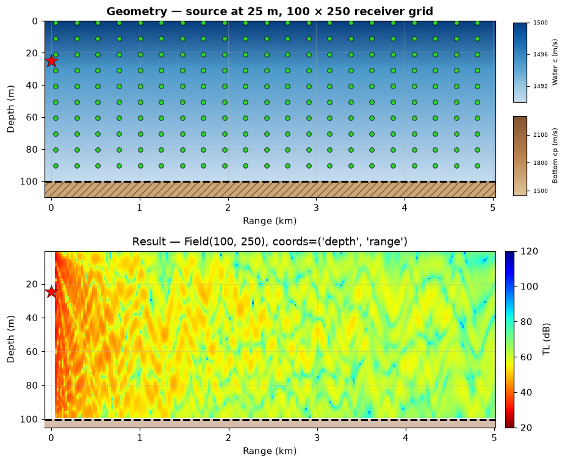
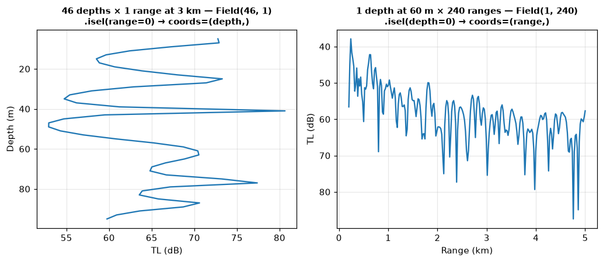
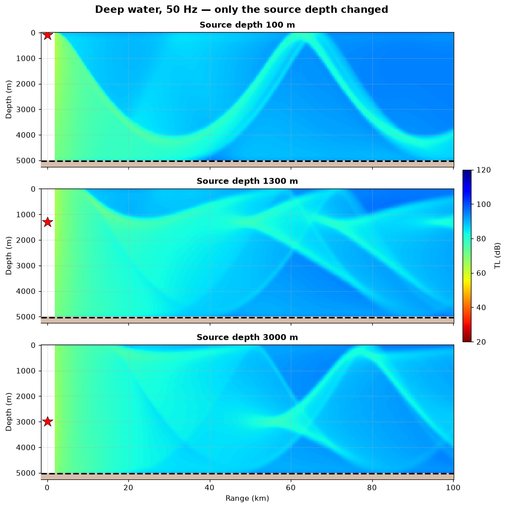
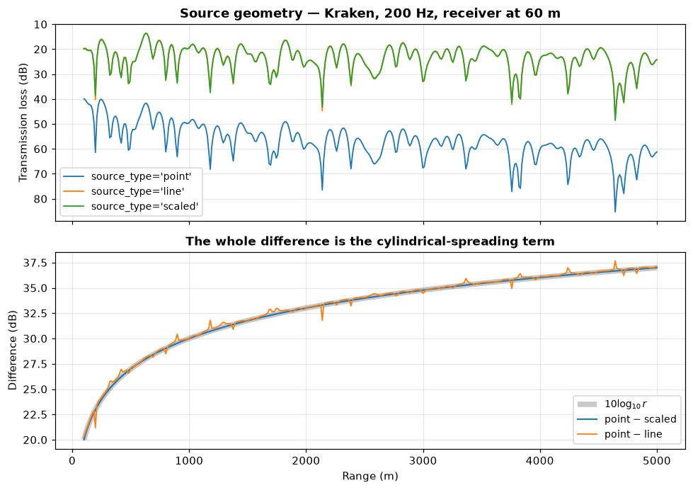
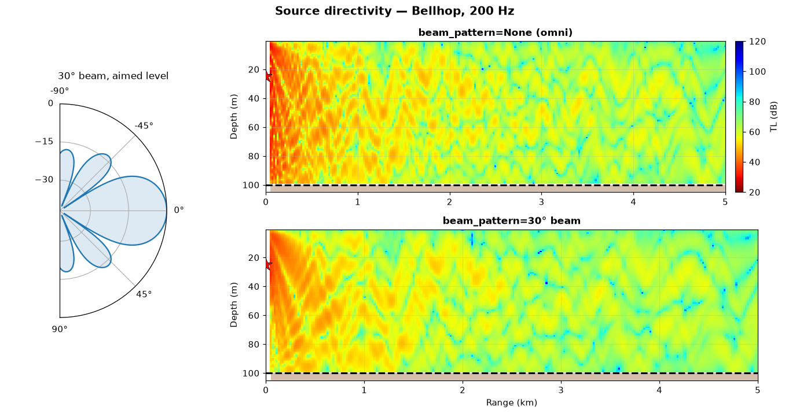
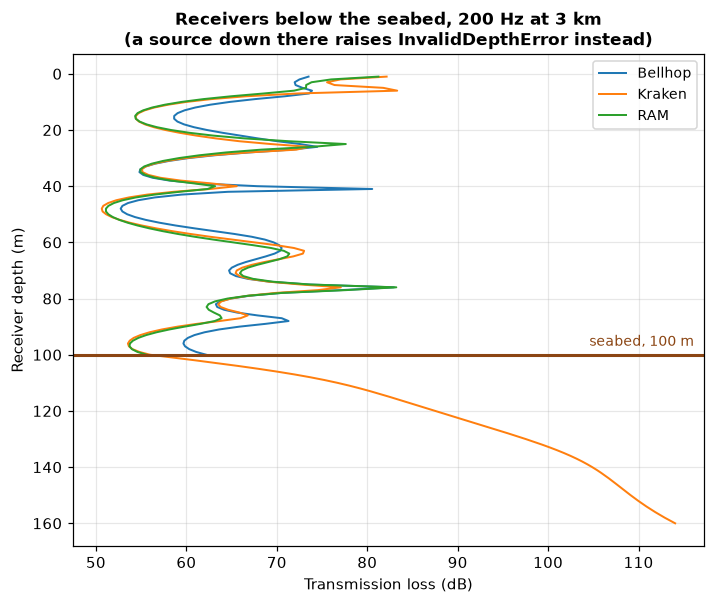

# Source and receiver — the geometry of a run

> `uacpy.Source` · `uacpy.Receiver` · the two carriers that fix where the sound
> starts, where you listen, and what shape the answer comes back in

[`Environment`](environment.md) describes the water. These two describe the
**geometry**: one point (or a few) that radiates, and a lattice of points that
listen. They are the smallest carriers in the package and the ones you write
most often:

```python
result = Model(**knobs).run(env, source, receiver, run_mode=...)
```

They are worth a page of their own for two reasons. The receiver grid **is**
the shape of the returned [`Field`](results.md) — nothing downstream reshapes
it — and a handful of their rules are strict on purpose, so it pays to know
which ones and why.

---

## 1. The two carriers at a glance

```python
import numpy as np
import uacpy

source = uacpy.Source(depths=25.0, frequencies=200.0)
receiver = uacpy.Receiver(depths=np.linspace(1.0, 99.0, 100),
                          ranges=np.linspace(50.0, 5000.0, 250))
```

| `Source(...)` | Default | Meaning |
|---|---|---|
| `depths` | **required** | Source depth(s), metres, positive down. |
| `frequencies` | **required** | Hz. Scalar or vector — [§6](#6-frequencies--a-scalar-or-a-band). |
| `source_type` | `'point'` | Source *geometry*: `'point'`, `'line'`, `'scaled'` — [§4](#4-source_type--what-the-source-physically-is). |
| `beam_pattern` | `None` | Directivity, `(N, 2)` of `[angle_deg, level_dB]` or a `.sbp` path — [§5](#5-beam_pattern--a-directional-source). |

| `Receiver(...)` | Default | Meaning |
|---|---|---|
| `depths` | **required** | Receiver depth(s), metres, positive down. |
| `ranges` | `None` → `0.0` **+ warning** | Metres, measured from the source. |
| `receiver_type` | `'grid'` | Sampling layout. `'grid'` is the only implemented one; `'line'` raises — [§7](#7-conventions-that-bite). |

Both coerce scalars and lists to 1-D `float64` arrays, so `depths=25.0` and
`depths=[25.0]` leave you holding the same `array([25.])`. Both are
`@dataclass(eq=False)` — a generated `__eq__` over `ndarray` fields raises, so
they compare by identity — and both carry `copy()` for a deep copy, symmetric
with `Environment`.

The derived attributes exist so you never recount an axis by hand:

```python
>>> source
Source(25.0m, 200.0Hz, type='point')
>>> source.n_sources, source.n_frequencies
(1, 1)
>>> receiver
Receiver(grid: 100 depths × 250 ranges)
>>> receiver.n_depths, receiver.n_ranges
(100, 250)
>>> receiver.depth_min, receiver.depth_max, receiver.range_min, receiver.range_max
(1.0, 99.0, 50.0, 5000.0)
```

---

## 2. The receiver grid *is* the shape of the `Field`

Every figure on this page is generated by
[`docs/figure_scripts/srcrcv.py`](../figure_scripts/srcrcv.py); the snippets
below are condensed from it, so the script is the authoritative figure code.

```python
env, source, receiver = shallow_water()      # 100 m channel, 200 Hz
tl = Bellhop(n_beams=3000).run(env, source, receiver).to_db()

env.plot(source=source, receiver=receiver)   # top panel
tl.plot(env=env, source=source)              # bottom panel
```



The red star is the source at `(r = 0, z = 25 m)`; the green lattice is the
receiver grid. Below it is what the model wrote into that lattice. There is no
resampling step in between:

```
Receiver(depths=(100,), ranges=(250,))  →  Field(data.shape=(100, 250),
                                                 coords={'depth': …, 'range': …})
```

`env.plot()` **decimates** the markers it draws — at most 10 depths by 20
ranges — so the picture stays readable. The grid itself is whatever you passed.

Shape follows the carrier for every field model in the package. Verified
against Bellhop, Kraken, Scooter and RAM: `field.coords['depth']` equals
`receiver.depths` and `field.coords['range']` equals `receiver.ranges`, element
for element.

| You write | `data.shape` | `coords` |
|---|---|---|
| `Receiver(depths=lin(40), ranges=lin(120))` | `(40, 120)` | `{depth, range}` |
| `Receiver(depths=lin(46), ranges=3000.0)` | `(46, 1)` | `{depth, range}` |
| `Receiver(depths=60.0, ranges=lin(240))` | `(1, 240)` | `{depth, range}` |
| `Receiver(depths=60.0, ranges=3000.0)` | `(1, 1)` | `{depth, range}` |

Note the last three: a **degenerate** axis is kept, not dropped. A vertical
line array comes back as `(46, 1)` and a horizontal one as `(1, 240)`, both
still two-axis fields. Collapse the length-1 axis yourself when you want a
curve:

```python
vla = uacpy.Receiver(depths=np.linspace(5.0, 95.0, 46), ranges=3000.0)
hla = uacpy.Receiver(depths=60.0, ranges=np.linspace(200.0, 5000.0, 240))

model = Bellhop(n_beams=3000)
tl_v = model.run(env, source, vla).to_db()
tl_h = model.run(env, source, hla).to_db()

tl_v.isel(range=0).plot()     # coords = {depth} → a depth cut
tl_h.isel(depth=0).plot()     # coords = {range} → a range cut
```



Same water, same source, same model — two receiver shapes, two differently
shaped `Field`s. Which render branch each takes, and what `.isel` records in
`.pinned`, belongs to [results](results.md) and [plotting](plotting.md); the
part that is *yours* is the shape going in.

---

## 3. Source depth — one, or several

Source depth is the single most consequential number in a run. Same water,
same 50 Hz, same receiver grid; only `depths` changed:

```python
env, _, _ = deep_water()                          # 5000 m Munk profile
source = uacpy.Source(depths=[100.0, 1300.0, 3000.0], frequencies=50.0)
receiver = uacpy.Receiver(depths=np.linspace(0.0, 5000.0, 140),
                          ranges=np.linspace(2000.0, 100_000.0, 320))

stack = Bellhop(n_beams=3000).run(env, source, receiver,
                                  run_mode=RunMode.INCOHERENT_TL)
for depth, slab in stack:
    slab.plot(env=env)
```



The Munk profile's sound-channel axis is at 1300 m, and where the source sits
relative to it changes everything. From 100 m — well above the axis — the
energy funnels down, turns, and returns to the surface as the classic
convergence-zone arcs, the first at ~55 km with a broad shadow zone in front of
it. Put the source **on** the axis and that structure reorganises: the arcs are
shallower, closer together, and no longer separated by clean shadow. From
3000 m, below the axis, it reorganises a third time, with one bright arc
reaching the surface near 78 km.

(Incoherent TL here, so what you see is the geometry rather than the
interference pattern laid over it — see [Bellhop](../models/bellhop.md) for the
three summation modes.)

### Multi-element `depths` and `ResultStack`

**Only Bellhop accepts more than one source depth in a single run.** It returns
a [`ResultStack`](results.md#5-resultstack--one-run-several-source-depths) —
one slab per depth, plus the coordinate they vary along:

```python
>>> Bellhop(n_beams=3000).run(env, uacpy.Source(depths=[15., 50., 85.],
...                                             frequencies=200.0), receiver)
ResultStack[Field](n_slabs=3, source_depth=[15.0, 50.0, 85.0])
```

Every other model takes one depth per run and says so rather than silently
using the first:

```python
>>> Kraken().run(env, uacpy.Source(depths=[20.0, 60.0], frequencies=200.0), receiver)
ConfigurationError: Kraken takes a single source depth per run; got 2:
[np.float64(20.0), np.float64(60.0)]. Loop over Sources externally for
multi-depth runs.
```

For those, build one `Source` per depth and sweep with
[`run_parallel`](utilities.md) — `.stack()` on the outcome gives you the same
`ResultStack`, along whatever coordinate you varied.

| Model | Multi-element `depths`? |
|---|---|
| [Bellhop](../models/bellhop.md) | ✅ returns `ResultStack` |
| [Kraken](../models/kraken.md), [Scooter](../models/scooter.md), [RAM](../models/ram.md), [SPARC](../models/sparc.md), [Bounce](../models/bounce.md), [OASES](../models/oases.md) | ❌ `ConfigurationError` |

Bellhop's own broadband path is the exception inside the exception:
`BROADBAND` and `TIME_SERIES` synthesise from one carrier frequency at one
source depth, and reject a multi-depth `Source`.

---

## 4. `source_type` — what the source physically *is*

Three geometries, and the choice is worth real decibels:

| `source_type` | Physically | Acoustics-Toolbox code |
|---|---|---|
| `'point'` *(default)* | a true point source: the 3-D problem, solved in cylindrical coordinates about the source | `'R'` |
| `'line'` | an infinite coherent line source normal to the propagation plane: the 2-D Cartesian problem | `'X'` |
| `'scaled'` | the point-source solution with the cylindrical spreading factor divided out | `'S'` |

In free space a point source spreads spherically (`20·log₁₀ R`) and an infinite
line source spreads cylindrically (`10·log₁₀ r`). Inside a waveguide the
surface and seabed cap the vertical spreading, so the point source falls back
to cylindrical `10·log₁₀ r` and the line source to no geometric spreading at
all — but the *difference* between the two is the cylindrical term either way.

```python
ranges = np.linspace(100.0, 5000.0, 400)
receiver = uacpy.Receiver(depths=60.0, ranges=ranges)

curves = {}
for kind in ('point', 'line', 'scaled'):
    source = uacpy.Source(depths=25.0, frequencies=200.0, source_type=kind)
    curves[kind] = Kraken().run(env, source, receiver).to_db().data.ravel()
```



The lower panel is the whole story. `point − scaled` is `10·log₁₀ r` to within
10⁻⁵ dB — that is the definition of `'scaled'`, not an approximation.
`point − line` tracks the same curve about 0.9 dB above it, because a line
source also reweights the modes slightly, not just the spreading.

Which model honours which:

| Model | `'point'` | `'line'` | `'scaled'` |
|---|---|---|---|
| [Bellhop](../models/bellhop.md) | ✅ | ✅ | ❌ |
| [Kraken](../models/kraken.md), [Scooter](../models/scooter.md), [Bounce](../models/bounce.md) | ✅ | ✅ | ✅ |
| [RAM](../models/ram.md), [OASES](../models/oases.md) | ✅ | ❌ | ❌ |
| [SPARC](../models/sparc.md) | ✅ | `output_mode='S'` only | `output_mode='S'` only |

Anything outside a model's set is refused up front:

```python
>>> RAM().run(env, uacpy.Source(depths=25.0, frequencies=200.0,
...                             source_type='line'), receiver)
UnsupportedFeatureError: RAM does not support: Source(source_type='line')

How to fix:
Try one of these source geometries instead:
  • 'point'
```

> **`Source(source_type='line')` and `Receiver(receiver_type='line')` are
> unrelated.** The first is a physical source shape, supported by several
> models. The second is a *sampling* rule (pair `depths[i]` with `ranges[i]`
> instead of taking the cross-product) that no model implements, so the
> carrier rejects it. The shared word names two different concepts.

---

## 5. `beam_pattern` — a directional source

Real projectors are not omnidirectional. `beam_pattern` takes an `(N, 2)` array
of `[angle_deg, level_dB]` with **strictly increasing** angles, or a path to an
existing `.sbp` file. uacpy stages it into the run's working directory as
`<case>.sbp` and flips the engine's beam-pattern switch.

Give the lobe the shape a projector has rather than a rectangle. A beam
pattern is specified the way a projector is — by its **beamwidth** — and that
is all this table is: an angular weighting on a point source's launch
amplitude. No aperture or element spacing enters; that geometry belongs to a
receiving [array](arrays.md), and the engine's model has none of it.

```python
angles = np.linspace(-90.0, 90.0, 721)
beamwidth = 30.0                                  # degrees between -3 dB points
lobe = 0.442946 * angles / (0.5 * beamwidth)      # sinc is -3 dB at 0.442946
level = 20.0 * np.log10(np.maximum(np.abs(np.sinc(lobe)), 10.0 ** (-40.0 / 20.0)))
pattern = np.column_stack([angles, level])

beamed = uacpy.Source(depths=25.0, frequencies=200.0, beam_pattern=pattern)
beamed.plot_beam_pattern()                        # the pattern itself
Bellhop(n_beams=3000).run(env, beamed, receiver).plot(env=env, source=beamed)
```

The levels are floored because the nulls are true zeros and the table has to
stay finite, and the table stops at ±90° because a steeper launch has
`COS(alpha) < 0` and travels to negative range, which a 2-D run never
evaluates.



The beam is 30° wide between its −3 dB points, so it covers about what a
hand-drawn "±15°" table would — but with a skirt instead of a cliff: −10 dB at
25°, a first null at 33.5°, and sidelobes no higher than −13.3 dB. The steep
launch angles are suppressed rather than deleted, and the near-source field
thins accordingly. Counting cells louder than 50 dB TL, the omni panel lights
63% of the water column at 500 m range against the beamed panel's 35%, and 84%
against 63% at 200 m. The beam's −3 dB edge reaches the seabed at about 280 m.

Past that the two panels converge, and that convergence is the physical point:
a beam pattern buys near-field control, not far-field gain. Averaged over
range the beamed source is 3.7 dB quieter than the omni one inside 500 m but
only 1.2 dB quieter over 3.5–5 km, because the paths that survive to 5 km in a
100 m channel are shallow ones sitting on the main lobe, which this pattern
passes at full level. The residual 1.2 dB is the skirt still costing a little
on the steeper multipaths — a rectangular table, which passes everything
inside ±15° flat and kills everything outside, converges harder still, to
+0.5 dB.

**Only two models read a pattern**: [Bellhop](../models/bellhop.md) and
[Kraken](../models/kraken.md). Anything else refuses rather than ignoring it:

```python
>>> RAM().run(env, beamed, receiver)
ConfigurationError: RAM does not read a source beam pattern; drop
Source(beam_pattern=...) or use Bellhop or Kraken.
```

Two details that decide whether your pattern does what you meant:

- **The angle axis must span what the engine asks for.** Bellhop queries
  *launch* angles (the reference `shaded.sbp` covers ±180°); Kraken queries
  *mode* angles in [0°, 90°]. A pattern that stops short is extrapolated from
  its end sample.
- **Interpolation happens in amplitude, not in dB.** The engines convert levels
  with `10**(dB/20)` *before* interpolating between your samples
  (`beampattern.f90:59`), so a coarsely sampled pattern rounds off a steep
  roll-off. Sample finely across the shoulders.

---

## 6. Frequencies — a scalar or a band

`Source.frequencies` is the single source of truth for frequency content, and
it is always stored as a 1-D array. What the model does with it depends on the
run mode:

| Run mode | What `frequencies` must be |
|---|---|
| `COHERENT_TL`, `INCOHERENT_TL`, `SEMICOHERENT_TL`, `RAYS`, `EIGENRAYS`, `ARRIVALS`, `MODES` | exactly **one** element |
| `BROADBAND`, `TIME_SERIES` | the band. A vector **is** the grid; a single value auto-expands to `fc·(1 ± bandwidth/2)` |

**A multi-element `frequencies` does not by itself select a broadband run.**
Left to itself, every frequency-domain field model in the package defaults to
coherent TL, and a frequency vector then hits the single-frequency guard:

```python
>>> Bellhop().run(env, uacpy.Source(depths=25.0,
...                                 frequencies=np.linspace(150., 250., 16)), point)
ConfigurationError: Bellhop.run(run_mode=COHERENT_TL) takes a single source
frequency; got 16: [...]. For broadband H(f) use RunMode.BROADBAND, and for
time-domain p(t) use RunMode.TIME_SERIES.
```

Ask for the mode you want. The one place a frequency vector *does* pick the
mode for you is [Kraken](../models/kraken.md)'s per-call override
`run(..., frequencies=…)`, which defaults to `BROADBAND` when handed more than
one value:

```python
>>> Kraken().run(env, source, point, frequencies=np.linspace(150., 250., 8))
Field(kind='pressure', unit='Pa', model='Kraken', axes=(depth, range, frequency))
```

That keyword is an **override** of the broadband grid, useful for reusing one
`Source` across several sweeps; when omitted, `source.frequencies` is used.
Models that only honour it in a broadband mode say so rather than silently
applying it:

```
UserWarning: Bellhop.run(run_mode=COHERENT_TL): ignoring frequencies= —
these apply to BROADBAND/TIME_SERIES only.
```

Unlike `depths` and `ranges`, `frequencies` is **not** required to be
increasing — only finite and strictly positive. It indexes a result axis, not
an interpolation abscissa.

---

## 7. Conventions that bite

Every rule below was checked by triggering it.

### Range is measured from the source, which sits at `r = 0`

`receiver.ranges` are horizontal separations from the source, not positions on
some external chart. The source is at range zero, which is a **singularity**:
the field there is infinite for a point source, so no engine can give you a
useful number — and every engine now refuses it the same way. Run
`Receiver(depths=[30.0, 60.0], ranges=[0.0, 1000.0])` on any model —
Bellhop, Kraken, Scooter, RAM, SPARC, the OASES family included — and the
`r = 0` column comes back **`NaN` with a `UserWarning`**: Bellhop's notes
that no ray travels zero distance; the others name the `1/√r`-type spreading
factor that is singular there and mask the meaningless number the engine
wrote into that column.

All the engines agree to about a decibel in the `r = 1 km` column of the very
same run — 53–54 dB at 30 m, 50–51 dB at 60 m for Bellhop, Kraken, Scooter
and RAM. So start a TL grid past the near field —
`np.linspace(50.0, 5000.0, 250)`, not `np.linspace(0.0, 5000.0, 250)` — and
the warning is your cue when you forget.

### Depths are positive down

Depth is metres below the sea surface for both carriers, and negative values
are rejected. The one carrier that measures the other way is sea-surface
altimetry, which is positive **up** — see [environment](environment.md).

A source at exactly `z = 0` is accepted but warns, because it sits on the
pressure-release surface where the field is ~0 and the result is degenerate:

```
UserWarning: Kraken: a source at depth 0 m is on the pressure-release sea
surface, where the field is ~0 — the result is degenerate (null / saturated
TL, model-dependent). Use a small positive depth (e.g. 1 m).
```

Bellhop is the exception: it refuses a `z = 0` source with a
`ConfigurationError` instead of warning — a source on the top boundary has
every ray terminated at step one, so the run would return an all-`NaN` field.

### Multi-element axes must be strictly increasing

`Source.depths`, `Receiver.depths` and `Receiver.ranges` are all checked, and
equal neighbours are rejected too:

```python
>>> uacpy.Receiver(depths=[90.0, 10.0], ranges=1000.0)
ConfigurationError: Receiver.depths must be strictly increasing; got
90.0 >= 10.0 at index 1 (axis length 2)
>>> uacpy.Source(depths=[10.0, 10.0], frequencies=100.0)
ConfigurationError: source depths must be strictly increasing; got
10.0 >= 10.0 at index 1 (axis length 2)
```

This is deliberate, and it is about the *output*. Row `i` of a returned `Field`
is receiver depth `i`; slab `i` of a `ResultStack` is source depth `i`. An
unsorted axis would make those rows ambiguous, and a duplicated one would put
two identical rows in a result you then index by label. It also protects every
downstream `np.interp`, which produces silent garbage on an unsorted `xp`.

### `NaN` and `inf` are rejected at construction

```python
>>> uacpy.Source(depths=[10.0, np.nan], frequencies=100.0)
ConfigurationError: source depths must be finite (no NaN/inf) (metres,
positive down from surface); got nan at flat index 1 of 2 value(s)
>>> uacpy.Receiver(depths=10.0, ranges=[100.0, np.inf])
ConfigurationError: receiver ranges must be finite (no NaN/inf) (metres,
outward from source); got inf at flat index 1 of 2 value(s)
```

Every model writes a fixed-width Fortran input file. A `nan` reaching a writer
does not raise — it produces a syntactically valid `.env` that the binary reads
as garbage, and you get a plausible-looking wrong answer instead of an error.
The guard sits at construction so a non-finite value can never get that far.
Frequencies are held to a stricter rule still: finite **and** strictly
positive.

### A receiver below the domain is accepted; a source below it is not

This is the asymmetry that surprises people most, and it follows from what each
carrier *is*.

```python
receiver = uacpy.Receiver(depths=np.linspace(1.0, 160.0, 160), ranges=3000.0)
for model in (Bellhop(n_beams=4000), Kraken(), RAM()):
    model.run(env, source, receiver).to_db()      # 100 m water — warns, runs
```



```
UserWarning: Bellhop: receiver depth 150.0 m is below the model's resolvable
depth (100.0 m). It is accepted; the result there reflects the model's
below-domain behaviour (a physical transmitted / evanescent field from Kraken
and OASES; NaN from Bellhop, Scooter, SPARC and RAM).
```

A **receiver is an output**. Asking for a value under the seabed is a
legitimate question — you want the transmitted field, or you are gridding
uniformly and do not want to special-case the seafloor — and every model has a
defined answer down there. So uacpy accepts it, warns once, and hands back the
per-engine truth: Kraken and the OASES models mesh the sediment and return the
physical transmitted / evanescent field, while Bellhop, Scooter, SPARC and RAM
return `NaN` — their solvers clamp such a receiver onto the domain or stop
meshing, so no field is actually evaluated at the asked depth, and a fabricated
number there would misreport where the field was sampled. Different answers,
all honest, none of them a bug.

A **source is an input**. It injects the energy the whole solution is built
from, and a model has no defined behaviour for energy injected outside the
domain it discretised. There is no answer to hand back, so it raises:

```python
>>> Bellhop().run(env, uacpy.Source(depths=150.0, frequencies=200.0), receiver)
InvalidDepthError: Source depth (150.0m) exceeds resolvable depth (100.0m)

How to fix:
Set source depth to ≤ 100.0m
```

"Resolvable depth" rather than "water depth" because the two differ:
[Scooter](../models/scooter.md) and [SPARC](../models/sparc.md) discretise the
sediment column too, so over 100 m of water with an 8 m sand layer their limit
is 108 m while Bellhop's is 100 m.

### `receiver_type='line'` is rejected at construction

`'line'` would pair `depths[i]` with `ranges[i]` instead of taking the
cross-product. No model's result assembly does that — every one returns the
full grid — so the carrier refuses the layout outright rather than letting a
run hand back a shape you did not ask for:

```python
>>> uacpy.Receiver(depths=[10., 20., 30.],
...                ranges=[1000., 2000., 3000.], receiver_type='line')
ConfigurationError: receiver_type must be 'grid'; got 'line'.
receiver_type='line' is not implemented — every model returns the full depth
x range grid, so the paired (depths[i], ranges[i]) sampling would be silently
ignored. Use receiver_type='grid' and index the diagonal yourself:
tl[np.arange(len(depths)), np.arange(len(ranges))].
```

Refusing beats returning a `(3, 3)` grid to someone who asked for 3 points.

### `Receiver` without `ranges` warns

```python
>>> uacpy.Receiver(depths=50.0)
UserWarning: Receiver: ranges not given, defaulting to a single point at 0 m
(the source location), which is singular for TL/pressure runs; pass explicit
ranges= to avoid this.
```

The default exists because two run modes genuinely have no range axis:
`RunMode.MODES` ([Kraken](../models/kraken.md)) and `RunMode.REFLECTION`
([Bounce](../models/bounce.md)) both run happily on a `Receiver(depths=…)` with
nothing else. For anything that computes a field, the default lands you on the
singularity above.

---

## 8. Gotchas

**A length-1 axis is not dropped.** A single-point `Receiver` returns
`Field(data.shape=(1, 1))`, not a scalar. Use `.isel(...)` or `.at(...)` to
collapse it — see [results](results.md).

**You do not choose the slab order.** `Source(depths=[85., 15., 50.])` does not
give you a `ResultStack` in that order — it raises, because the axis must be
increasing. Reorder after the run if you need to.

**One `Source`, many models.** The carriers hold no solver state, so the same
`Source` and `Receiver` go into every model — that is what makes the
[cross-model comparisons](../models/README.md) honest. The only per-model
coupling is a capability check at `run()`: `source_type`, `beam_pattern`,
multi-element `depths`.

**`copy()` before mutating a carrier you have already run.** Nothing is frozen,
and a result holds no reference back to its inputs
([why](results.md#why-a-result-carries-no-environment)) — so editing
`receiver.depths` after a run leaves a `Field` whose axes no longer match the
object you are holding.

**Frequencies need not be sorted, but everything else must be.** The asymmetry
is real: `frequencies` indexes a result axis; `depths` and `ranges` are also
interpolation abscissae.

---

## 9. Where this connects

- **The other input** — [environment](environment.md) owns the water:
  bathymetry, sound speed, seabed, sea surface, absorption. Together with this
  page that is the complete input to `run()`.
- **What comes back** — [results](results.md) for the `Field` this geometry
  shapes, `ResultStack`, and slicing; [plotting](plotting.md) for `source=` /
  `receiver=` overlays.
- **Arrays as instruments** — [array processing](arrays.md) takes the `Field`
  from a `Receiver` you laid out as an array and beamforms it;
  [sonar](sonar.md) builds replica banks by sweeping source position.
- **Sweeping geometry** — [utilities](utilities.md) for `run_parallel` over a
  list of `Source`s when the model takes one depth at a time.
- **Per-model detail** — [Bellhop](../models/bellhop.md) ·
  [Kraken](../models/kraken.md) · [Scooter](../models/scooter.md) ·
  [SPARC](../models/sparc.md) · [RAM](../models/ram.md) ·
  [Bounce](../models/bounce.md) · [OASES](../models/oases.md) ·
  [model index](../models/README.md)

---

**See also:** [guide index](../README.md) · [environment](environment.md) ·
[results](results.md) · [reference](../../DOCUMENTATION.md)
