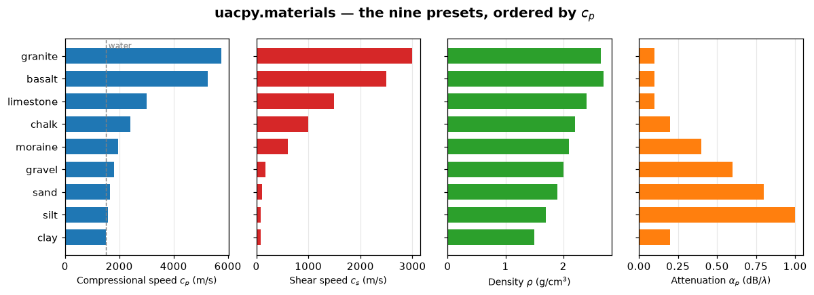
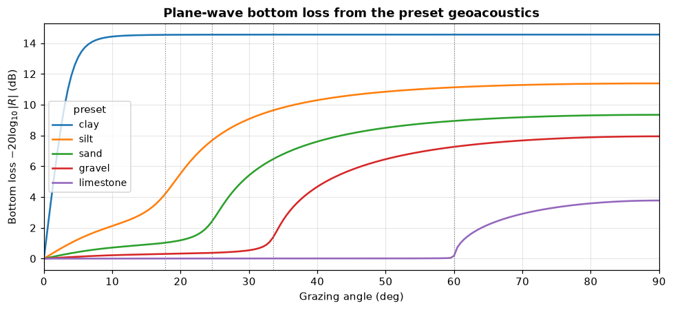
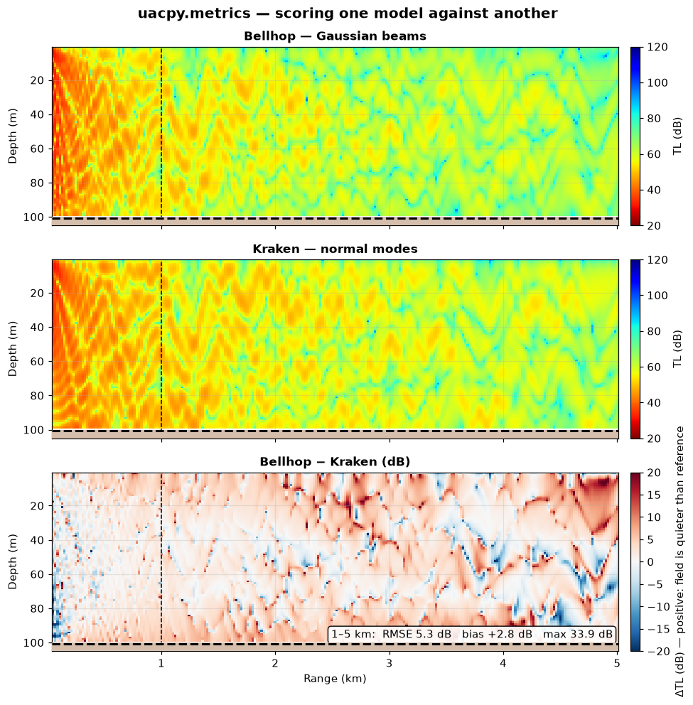
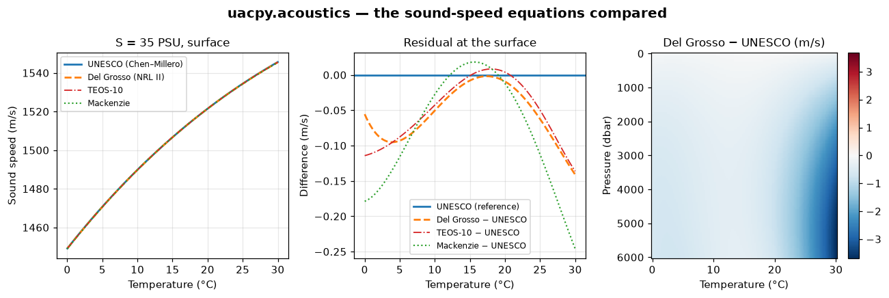

# Utilities — presets, metrics, physics helpers, batching, logging

> `uacpy.materials` · `uacpy.metrics` · `uacpy.acoustics` · `uacpy.run_parallel`
> · `uacpy._log`

The five things that are not a model, not a carrier, and not a result: the
seabed catalogue you build environments from, the metrics you compare two
models with, the closed-form water and boundary physics, the process pool that
runs a batch, and the one channel every status line goes through.

Every figure on this page comes from
[`docs/figure_scripts/utilities.py`](../figure_scripts/utilities.py) — the code
below is that code, so it cannot drift from what you see.

---

## 1. `uacpy.materials` — the seabed catalogue

Nine class-typical seafloor materials, keyed by name. Three names are on the
package root; the module itself is `uacpy.materials`.

```python
import uacpy

uacpy.list_materials()        # ['basalt', 'chalk', 'clay', 'granite', 'gravel',
                              #  'limestone', 'moraine', 'sand', 'silt']
uacpy.get_material('sand')
# {'sound_speed': 1650.0, 'density': 1.9, 'attenuation': 0.8,
#  'shear_speed': 110.0, 'shear_attenuation': 2.5,
#  'porosity': 45.0, 'grain_size_phi': 3.34, 'roughness': 0.0}
```

`uacpy.MATERIALS` is the raw dict. `get_material(name)` is case-insensitive,
returns a **copy** so you can edit it freely, and raises `ConfigurationError`
listing the available names on a typo — not a `KeyError` two frames deeper.

### What the eight fields mean

| Key | Symbol | Unit | Meaning |
|---|---|---|---|
| `sound_speed` | `c_p` | m/s | Compressional wave speed |
| `density` | `ρ` | g/cm³ | Bulk mass density |
| `attenuation` | `α_p` | dB/λ_p | Compressional attenuation, **per wavelength** |
| `shear_speed` | `c_s` | m/s | Shear wave speed; `0` marks a fluid sediment |
| `shear_attenuation` | `α_s` | dB/λ_s | Shear attenuation |
| `porosity` | `ϕ_w` | % | Pore-water volume fraction; `None` for rocks |
| `grain_size_phi` | `ϕ` | — | Mean Wentworth grain size; `None` for rocks |
| `roughness` | | m | RMS interface roughness; `0` unless overridden |

Attenuation is in dB per **wavelength**, not dB/km, so it is frequency-free:
the same `α_p` applies at 50 Hz and 5 kHz. That is the convention throughout
uacpy — see [environment](environment.md).

```python
names = sorted(uacpy.list_materials(),
               key=lambda n: uacpy.get_material(n)['sound_speed'])
values = [uacpy.get_material(n)['sound_speed'] for n in names]
```



Ordered by `c_p`, the catalogue splits cleanly. The five unconsolidated
sediments (clay through moraine) sit within a factor of 1.3 of the water speed
— clay sits exactly on it — and carry shear speeds of 80–180 m/s, moraine
excepted at 600. The four rocks jump to 2400–5500 m/s with shear speeds
of 1000–3000. Attenuation does not track `c_p`: it peaks in the middle of the
catalogue at silt (1.0 dB/λ) and falls off both ways — to 0.2 dB/λ in clay, the
slowest material of the nine, and 0.1–0.2 dB/λ in the rocks.

Two caveats the numbers do not carry. `c_s` for the unconsolidated sediments
is a **near-surface (1 m)** value — real shear speed grows with depth below the
seabed, so pass an explicit `shear_speed` if you need another depth. And `ϕ`
(Wentworth grain size) is undefined for consolidated rock, hence the `None`.

### What those numbers buy you

The geoacoustic values are not decoration: they set how much energy the seabed
returns at each grazing angle.

```python
from uacpy.core import acoustics

for name in ['clay', 'silt', 'sand', 'gravel', 'limestone']:
    angles, loss_db = acoustics.bottom_loss_curve(name)
```



Dotted lines mark the **critical grazing angle**, `arccos(1500/c_p)`. Below it
the seabed totally reflects, and the only loss is what attenuation leaks away;
above it energy refracts into the sediment and the loss jumps. Limestone at
`c_p = 3000 m/s` has a critical angle of 60°, so it is a near-perfect mirror
for everything shallower — which is exactly why a limestone basement carries
energy so much further than sand. Clay has no critical angle at all: its
preset `c_p` is 1500 m/s — exactly the reference water speed, and `c_p/c_w
= 1.00` in *Computational Ocean Acoustics* Table 1.3, where the preset comes
from — so `arccos(1500/c_p)` degenerates to 0° and the angle dependence drops
out. What is left is the density contrast alone,
`|R| = (ρ_b − ρ_w)/(ρ_b + ρ_w) = 0.2`: a flat ~14 dB at every angle steeper
than a few degrees.

That is the **equal-speed** limit, not the slow-bottom one. A seabed genuinely
slower than the water — high-porosity mud, `c_p/c_w < 1` with `ρ_b > ρ_w` —
also has no critical angle, but it has an **angle of intromission**, where `R`
vanishes and everything transmits into the sediment. Its loss curve *peaks*
there, at 10–20° grazing for real sediments, instead of saturating. Pass
`bottom_loss_curve` a property `dict` to see one.

`bottom_loss_curve` is fluid–fluid: it ignores shear entirely. That costs under
0.25 dB for clay through gravel, whose shear speeds are far below the water's,
but 11–16 dB near 20–30° grazing for chalk and limestone, whose are not. For the
real `R(θ)` of an elastic or layered seabed use [Bounce](../models/bounce.md);
[environment](environment.md) has the full breakdown.

### Building a seabed from presets

Three constructors read the catalogue, and all three are **fluid by default** —
the preset's shear properties are dropped so the result works in every model.
Pass `elastic=True` to keep them.

```python
uacpy.BoundaryProperties.from_preset('sand')                      # half-space
uacpy.SedimentLayer.from_preset('sand', thickness=10.0)           # one layer
uacpy.SeabedColumn.from_presets(layers=[('sand', 10.0), ('silt', 25.0)],
                                halfspace='limestone')            # a stack
```

`from_presets(layers, *, halfspace, halfspace_overrides=None, elastic=False)`
takes `(name, thickness)` pairs, or `(name, thickness, overrides)` triples when
one layer needs site-specific tuning. Any extra keyword on the two single-entry
constructors overrides a preset field the same way. See
[environment](environment.md) for how the resulting carriers compose.

---

## 2. `uacpy.metrics` — comparing two models quantitatively

Three functions, one job: put a number on how far apart two TL fields are.

```python
from uacpy.metrics import tl_rmse, tl_max_error, tl_bias
```

| Function | Returns |
|---|---|
| `tl_rmse(a, b, range_window=None, depth_window=None)` | Root-mean-square TL difference, dB |
| `tl_max_error(a, b, …)` | Largest absolute TL difference, dB |
| `tl_bias(a, b, …)` | Mean **signed** difference; positive means `a` reports more loss |

Both arguments must be 2-D `(depth, range)` [`Field`](results.md) instances.
TL is pulled from `.db`, so it does not matter whether a field stores complex
pressure or real dB. Non-finite cells — Bellhop's shadow zones, an empty modal
sum — are dropped rather than propagated.

The windows take `(min_m, max_m)` inclusive and default to the whole grid. Use
them: the near field is where two models disagree for uninteresting reasons.

### Same grid, or nothing

The metrics refuse fields on different grids. Depth and range axes must match
to ~1 mm, which is loose enough for the sub-millimetre rounding two models pick
up interpolating onto the same requested receiver grid, and tight enough that
genuinely different grids raise:

```
ConfigurationError: tl_rmse: range axes differ — sample-cells are not aligned.
Resample one field onto the other's grid before comparing.
```

That is deliberate. Silently interpolating one field onto the other would bury
the resampling error inside the number you are about to quote. Call
`Field.resample_to` yourself, and own it.

`ConfigurationError` also fires when the window selects no finite cells at all
— an empty comparison is a bug, not a zero.

### A worked comparison

```python
from figure_scripts._common import shallow_water
from uacpy.metrics import tl_bias, tl_max_error, tl_rmse
from uacpy.models import Bellhop, Kraken, RunMode

env, source, receiver = shallow_water()
window = (1000.0, 5000.0)

bellhop = Bellhop(n_beams=3000).run(env, source, receiver,
                                    run_mode=RunMode.COHERENT_TL)
kraken = Kraken().run(env, source, receiver, run_mode=RunMode.COHERENT_TL)

rmse = tl_rmse(bellhop, kraken, range_window=window)      # 5.3 dB
bias = tl_bias(bellhop, kraken, range_window=window)      # +2.6 dB
peak = tl_max_error(bellhop, kraken, range_window=window) # 40.0 dB
```



The same 100 m channel at 200 Hz, run through a ray tracer and a modal solver.
The dashed line marks where the 1–5 km scoring window starts.

Read the three numbers together, because each answers a different question:

- **Bias, +2.6 dB.** Bellhop reports more loss than Kraken on average. This is
  the number that tells you something systematic is happening — here, the ray
  approximation under-filling the field at `D/λ ≈ 13`, close to Bellhop's
  validity floor. A bias near zero means the two models agree on the energy
  budget even if they disagree cell by cell.
- **RMSE, 5.3 dB.** The typical disagreement. Note it is *twice* the bias, so
  most of the difference is scatter, not offset.
- **Max error, 40 dB.** Almost meaningless on its own. Coherent TL has
  interference nulls tens of dB deep, and the two solvers place them
  fractionally differently; a null that lands one cell apart produces a huge
  pointwise error from two fields that are, physically, in close agreement.
  That is what the red/blue filaments in the difference panel are.

The lesson the max error teaches is the useful one: **compare coherent fields
with RMSE and bias, and look at where the difference is structured.** In the
bottom panel the difference is near zero out to about 2 km and then grows with
range and toward the surface — a real, interpretable divergence — while the
filaments are null misalignment and should not be read as error.

If you want a comparison that is insensitive to null placement, run both models
incoherently ([Bellhop](../models/bellhop.md) §4) and score that instead.

`uacpy.compare_models(...)` draws the side-by-side panels without the
difference; see [plotting](plotting.md).

---

## 3. `uacpy.acoustics` — closed-form water and boundary physics

Fourteen standalone functions, all pure NumPy, no solver involved. They are
what the rest of the package calls when it needs a number rather than a field,
and each names the standard or paper it implements.

### Sound speed

| Function | Implements | Inputs |
|---|---|---|
| `soundspeed(temperature, salinity, depth)` | Mackenzie (1981), nine-term | °C, PSU, **metres** |
| `soundspeed_unesco(temperature, salinity, pressure)` | UNESCO (1983) / Chen & Millero (1977) | °C (ITS-90), PSU (PSS-78), **decibars** |
| `soundspeed_delgrosso(temperature, salinity, pressure)` | Del Grosso (1974), "NRL II" | °C, PSU, **decibars** |

Note the third argument: Mackenzie takes **depth in metres**, the other two
take **pressure in decibars**. They are numerically close (≈ 1 dbar per metre)
but they are not the same quantity, and the two standard equations are defined
in pressure.

UNESCO is the international standard algorithm. `soundspeed_unesco` accepts
ITS-90 temperature and converts internally to the IPTS-68 scale the polynomial
was fitted on. Valid for `T ∈ [0, 40] °C`, `S ∈ [0, 40] PSU`,
`P ∈ [0, 1000] bar`.

Del Grosso is the usual alternative, often preferred at high pressure. Its
`pressure` is accepted in decibars and converted to the kg/cm² the original
equation uses (`1 kg/cm² = 9.80665 dbar`). Stated standard deviation 0.05 m/s,
over `T ∈ [0, 35] °C`, `S ∈ [29, 43]` and `P ∈ [0, 1000] kg/cm²` (9807 dbar).
The paper predates PSS-78 and states that salinity range in ‰ (ppt); the
`salinity` argument here is PSU, the scale that replaced it.

Mackenzie is the cheap nine-term fit. It is validated for
`T ∈ [-2, 30] °C`, `S ∈ [25, 40] PSU`, `depth ∈ [0, 8000] m`, and emits a
`UserWarning` outside those ranges rather than quietly extrapolating.

All three vectorise over any argument.

```python
temperatures = np.linspace(0.0, 30.0, 121)
pressures = np.linspace(0.0, 6000.0, 121)          # dbar ≈ metres

unesco = acoustics.soundspeed_unesco(temperatures, 35.0, 0.0)
delgrosso = acoustics.soundspeed_delgrosso(temperatures, 35.0, 0.0)
mackenzie = acoustics.soundspeed(temperatures, 35.0, 0.0)

T, P = np.meshgrid(temperatures, pressures)
delta = (acoustics.soundspeed_delgrosso(T, 35.0, P)
         - acoustics.soundspeed_unesco(T, 35.0, P))
```



Left: the physics. Sound speed climbs about 4.5 m/s per °C near freezing and
about 2 m/s per °C at 30 °C — temperature is by far the strongest control in
the upper ocean, which is why the thermocline is the dominant feature of almost
every profile.

Middle: the three equations against each other at the surface. Del Grosso stays
within 0.15 m/s of UNESCO and Mackenzie within 0.25 m/s, across the whole
temperature range. At that level the choice of equation is irrelevant next to
the uncertainty in your `T` and `S`.

Right: the same difference over the full temperature–pressure plane. Del Grosso
is slower than UNESCO everywhere here, and the gap grows with both temperature
and pressure to −3.7 m/s in the 30 °C / 5600 dbar corner — 0.22 %, or 0.14 s of
travel time over a 100 km path. That corner is a numerical extreme rather than
an ocean: Del Grosso built his tables from *realistic* `(S, T, P)` triads and
pairs 30 °C with 1 kg/cm² (≈ 10 dbar), not 570. Down a column the ocean actually
presents, the two agree far better: over the Biscay cast the [data
guide](data.md) plots, 0 to 4800 m, the difference never exceeds 0.67 m/s and
averages 0.29. Which is still worth having for tomography and long-baseline
positioning, and for little else.
`SoundSpeedProfile.from_mackenzie` is the built-in route from a measured
`T(z)`/`S(z)` cast to a profile; see [environment](environment.md).

### Density, and everything else

| Function | Implements |
|---|---|
| `density(temperature, salinity)` | Fofonoff (1985), IES 80 — near-surface seawater density, **kg/m³** |
| `reflection_coeff(angle, rho1, c1, alpha=0, rho=None, c=None)` | Rayleigh plane-wave `R` (Brekhovskikh & Lysanov); `angle` is **from normal, in radians** |
| `bottom_loss_curve(material, …)` | Preset-aware wrapper: grazing angles in **degrees**, loss in dB |
| `doppler(speed, frequency, c=None)` | Doppler shift, `speed ≪ c` |
| `bubble_resonance(radius, depth=0.0, …)` | Minnaert resonance (Medwin & Clay 1998) |
| `bubble_surface_loss(windspeed, frequency, angle)` | APL-UW (1994) surface loss — returns a **linear multiplier** in `(0, 1]` |
| `bubble_soundspeed(void_fraction, …)` | Wood (1964) / Buckingham (1997) two-phase speed |
| `pekeris_root(gamma2)` | The Pekeris branch of `sqrt`, enforcing decay in the half-space |

`density` returns **kg/m³**, while the seabed carriers use **g/cm³**. That is
not an inconsistency to paper over: `density()` is the oceanographic equation
of state and its literature unit is kg/m³, whereas the geoacoustic file formats
every model writes are g/cm³. `bottom_loss_curve` does the ×1000 for you when
it hands preset values to `reflection_coeff`.

`reflection_coeff` only ever uses the ratios `rho1/rho` and `c/c1`, so any
consistent density unit works — but the angle convention is the one to check:
it takes the angle **from normal in radians**, while `bottom_loss_curve` and
every uacpy plot use **grazing angle in degrees**. The conversion is
`from_normal = π/2 − grazing`.

`bubble_surface_loss` returns a multiplier, not a loss. For a positive dB
number consistent with `bottom_loss_curve`, negate the log:
`loss_db = -20 * np.log10(multiplier)`.

### SPL and level conversions

| Function | For |
|---|---|
| `pressure(x, sensitivity, gain, volt_params=None)` | Recorded volts (or ADC bits) → µPa, given hydrophone sensitivity in dB re 1 V/µPa and preamp gain in dB |
| `spl(x, ref=1)` | A pressure time series → mean SPL in dB re `ref` µPa |
| `power_to_db(power, ref=1e-6, floor=1e-30)` | A **squared** quantity (PSD, mean-square pressure, an f-k spectrum) → dB re `ref` |

`power_to_db` is the conversion every spectral estimator in the package uses:
`10·log10(power / ref²)`, with `power` floored before the log so a silent
sample gives a finite, very negative level instead of `-inf` — which would
otherwise poison a downstream `mean` or histogram. Use `spl` for a waveform,
`power_to_db` for anything already squared. For standards-based band levels and
weighting, see [noise](noise.md) and [signal processing](signal.md).

---

## 4. `uacpy.run_parallel` — batching independent runs

Every model run is a self-contained, subprocess-bound computation, so a batch
of them is embarrassingly parallel. One primitive covers parameter sweeps and
cross-model comparisons alike, because a `Job` carries everything a run needs.

```python
from uacpy import Job, run_parallel
```

`Job` is a dataclass with fields `model`, `env`, `source`, `receiver`, and the
optional `run_mode`, `run_kwargs` (a dict of extra `run()` arguments) and
`label` (defaults to the job index). Because each job is pickled to its own
worker, a batch may mix models, scenarios and run modes freely — heterogeneous
batches need no special handling.

```python
import uacpy
from uacpy.models import Bellhop, Kraken, RAM, RunMode

jobs = [uacpy.Job(model, env, source, receiver,
                  run_mode=RunMode.COHERENT_TL, label=name)
        for name, model in [('Bellhop', Bellhop()), ('Kraken', Kraken()),
                            ('RAM', RAM())]]

batch = uacpy.run_parallel(jobs)
batch.ok                    # True if every job succeeded
for result in batch: ...    # aligned to jobs; None where one failed
```

To sweep one model's knobs, use `model.copy(**overrides)` — configuration is
constructor-only, so a sweep is "build it again with one thing changed":

```python
base = RAM(dr=2.0, dz=0.5, np_pade=8)
jobs = [uacpy.Job(base.copy(dr=dr), env, source, receiver, label=dr)
        for dr in (1.0, 2.0, 4.0)]
stack = uacpy.run_parallel(jobs, coordinate_name='dr').stack()
```

`ParallelResult` holds `results` (aligned to the jobs, `None` where one
raised), `errors` (`{job_index: exception}`), `labels` and `coordinate_name`.
It iterates and indexes like a list, and `.stack()` bundles the successes into
a [`ResultStack`](results.md). Stacking requires the slabs to share a concrete
type *and* the same `model` / `backend`, so it is for single-model sweeps —
iterate `results` for a cross-model batch.

### The four things worth knowing

**`raise_on_error=True` is the default.** The first failing job re-raises and
pending jobs are cancelled. Pass `False` to collect clean per-job failures in
`.errors` and let the rest finish.

**A hard worker crash always raises.** A native binary that segfaults or gets
OOM-killed breaks the whole `ProcessPoolExecutor`, so the remaining jobs cannot
complete. That case raises a typed `ConfigurationError` regardless of
`raise_on_error`, because it cannot be isolated to one slot.

**`start_method='spawn'` is the default, and it has a consequence.** `'fork'`
is unsafe here: uacpy is multi-threaded through NumPy/BLAS, and forking a
multi-threaded process can deadlock the child on a copied lock. But spawned
workers **re-import `__main__`**, so:

```python
if __name__ == '__main__':          # required
    batch = uacpy.run_parallel(jobs)
```

Without the guard, each worker re-enters `run_parallel` on import and the pool
dies before any job completes. From a REPL, Jupyter, `python -c` or piped
stdin there is no importable `__main__` at all. uacpy detects both cases and
turns the opaque `BrokenProcessPool` into a message that names the fix.

**Results survive the trip; files do not.** `Field`, `Rays`, `Modes` and
`Arrivals` carry their full numerical content as in-memory arrays, so pickling
them back from a worker loses nothing — ray paths and mode shapes included. But
a worker that owns its scratch dir (`cleanup=True`, the default) drops the
on-disk artifacts and the `result.metadata` paths that point at them. Build the
job's model with a pinned `work_dir` and `cleanup=False` to keep them — and
give **each job its own directory**. `run_parallel` raises if one `work_dir` is
pinned on more than one job, because concurrent workers would collide on the
models' fixed scratch filenames. See [file I/O](io.md).

---

## 5. Logging and warnings

Two channels, and the split is by *who the message is for*.

| | For | Goes through | Silenced by |
|---|---|---|---|
| **Status** | You, watching a run | `log_message` → stdout | `verbose` |
| **Problem** | You, about a decision uacpy made on your behalf | `warnings.warn(..., UserWarning)` | `warnings.simplefilter` |

A collapsed environment feature, a backend that fell back, a receiver clamped
to the computed grid — those are `UserWarning`s, because they change what your
answer means. "Running field.exe", "resolved dz = 0.42 m" is status.

### `verbose` is a threshold, not a switch

Models are quiet by default: only `WARN` and `ERROR` print.

| `verbose=` | Prints |
|---|---|
| `False` / `None` / `'off'` / `'silent'` | `WARN`, `ERROR` |
| `True` / `'info'` | `INFO`, `WARN`, `ERROR` |
| `'debug'` | everything, including subprocess command lines and grid choices |

Anything else raises `ConfigurationError` at the call, rather than being
treated as truthy.

Every uacpy module routes status through one function —
`uacpy._log.log_message(source, message, *, verbose=False, level='info')` —
and never through a bare `print`. It is an underscore module: internal, but
worth knowing about because it is why `verbose='debug'` on one model produces
consistently formatted output from its writers and readers too.

```
[2026/08/01 20:50:17 UTC] [INFO] [Bellhop] interp_ssp auto-picked = 'linear' (env.has_range_dependent_ssp=False)
[2026/08/01 20:50:17 UTC] [INFO] [Bellhop] Writing environment file: /tmp/bellhop_l5avebd3/model.env
```

### One format for warnings too

`install_warning_formatter()` replaces `warnings.formatwarning` so that every
`warnings.warn(...)` in the process renders in the same
`[timestamp] [LEVEL] [source] message` shape as `log_message`:

```
[2026/08/01 20:50:17 UTC] [WARN] [study:31] Scooter does not support
range-dependent bathymetry; collapsed to 400.0 m (method='max', range
100.0–400.0 m). Override via `collapse={'bathymetry': 'min'|…|'initial'}`.
```

The `[source]` field is **your** calling frame, not the uacpy internal that
raised it — the warnings carry `skip_file_prefixes`, so the line number points
at the `run()` call you wrote. It is called once at `import uacpy` and is
idempotent. Only the *rendering* is
replaced — Python's filtering, `pytest.warns`, `simplefilter('error')` and
friends all keep working unchanged, so you can still turn a collapse warning
into a hard failure in a test:

```python
import warnings
with warnings.catch_warnings():
    warnings.simplefilter('error', UserWarning)
    result = model.run(env, source, receiver)   # raises if anything collapses
```

That is a genuinely useful pattern for a validation script: it turns "uacpy
quietly reduced my environment" from something you have to read the log for
into something that stops the run.

---

## 6. Where to go next

- **[Environment](environment.md)** — where the material presets end up, and
  the collapse policy the warnings announce.
- **[Results](results.md)** — the `Field` the metrics score, `ResultStack`, and
  `result.metadata`.
- **[File I/O](io.md)** — `work_dir` / `cleanup`, and the readers behind every
  path `run_parallel` can hand back.
- **[Plotting](plotting.md)** — `compare_models` and the `.plot()` convention.
- **[Model index](../models/README.md)** — the capability matrix, for deciding
  which two models are worth comparing in the first place.

---

**See also:** [documentation index](../README.md) · [environment](environment.md)
· [results](results.md) · [file I/O](io.md) · [plotting](plotting.md) ·
[model index](../models/README.md)
