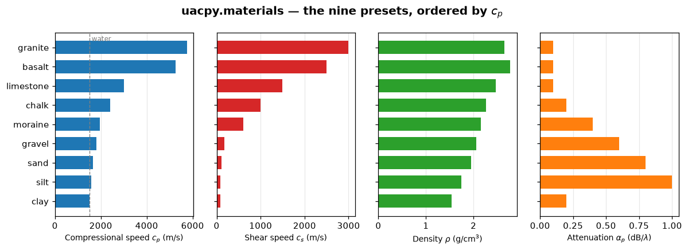
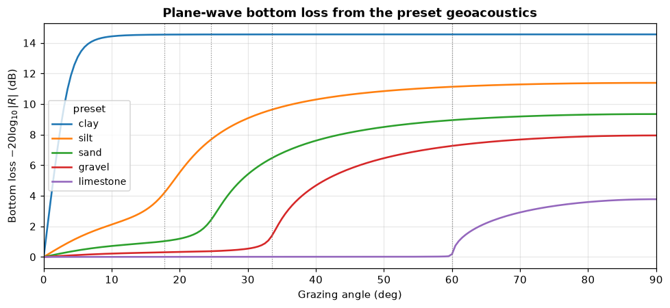
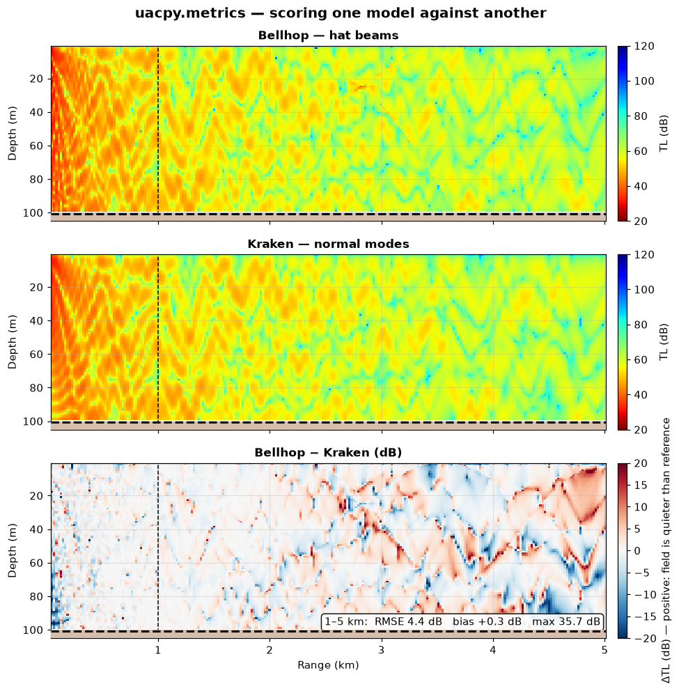
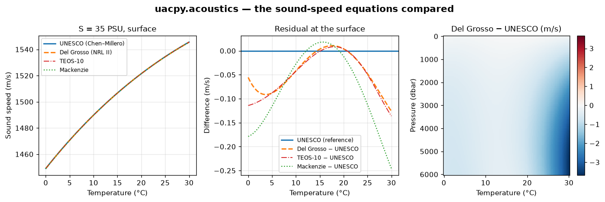

# Utilities — presets, metrics, physics helpers, batching, logging

> `uacpy.materials` · `uacpy.metrics` · `uacpy.acoustics` · `uacpy.run_parallel`
> · `uacpy._log`

The five things that are not a model, not a carrier, and not a result: the
seabed catalogue you build environments from, the metrics you compare two
models with, the closed-form water and boundary physics, the process pool that
runs a batch, and the one channel every status line goes through.

Every figure on this page is generated by
[`docs/figure_scripts/utilities.py`](../figure_scripts/utilities.py); the
snippets below are condensed from it, so the script is the authoritative
figure code.

---

## 1. `uacpy.materials` — the seabed catalogue

Nine class-typical seafloor materials, keyed by name. Three names are on the
package root; the module itself is `uacpy.materials`
(`from uacpy.materials import get_material`).

```python
import uacpy

uacpy.list_materials()        # ['basalt', 'chalk', 'clay', 'granite', 'gravel',
                              #  'limestone', 'moraine', 'sand', 'silt']
uacpy.get_material('sand')
# {'sound_speed': 1650.0, 'density': 1.9513, 'attenuation': 0.8,
#  'shear_speed': 110.0, 'shear_attenuation': 2.5,
#  'porosity': 45.0, 'grain_size_phi': 3.34, 'roughness': 0.0}
```

`uacpy.MATERIALS` is the catalogue itself, read-only: writing into it raises
`TypeError` instead of changing every later `from_preset`. `get_material(name)`
is case-insensitive, returns a **copy** so you can edit it freely, and raises
`ConfigurationError` listing the available names on a typo — not a `KeyError`
two frames deeper. `uacpy.materials_table()` returns the whole catalogue as a
pandas DataFrame, one row per material (pandas is needed for that one call;
`pip install 'uacpy[xarray]'` brings it).

### What the eight fields mean

| Key | Symbol | Unit | Meaning |
|---|---|---|---|
| `sound_speed` | `c_p` | m/s | Compressional wave speed |
| `density` | `ρ` | g/cm³ | Bulk mass density |
| `attenuation` | `α_p` | dB/λ_p | Compressional attenuation, **per wavelength** |
| `shear_speed` | `c_s` | m/s | Shear wave speed; `0` marks a fluid sediment |
| `shear_attenuation` | `α_s` | dB/λ_s | Shear attenuation |
| `porosity` | `ϕ_w` | % | Pore-water volume fraction; `None` for rocks |
| `grain_size_phi` | `ϕ` | — | Mean Wentworth grain size; `None` for rocks |
| `roughness` | | m | RMS interface roughness; `0` unless overridden |

Attenuation is in dB per **wavelength**, not dB/km, so it is frequency-free:
the same `α_p` applies at 50 Hz and 5 kHz. That is the convention throughout
uacpy — see [environment](environment.md).

```python
names = sorted(uacpy.list_materials(),
               key=lambda n: uacpy.get_material(n)['sound_speed'])
values = [uacpy.get_material(n)['sound_speed'] for n in names]
```



Ordered by `c_p`, the catalogue splits cleanly. The five unconsolidated
sediments (clay through moraine) sit within a factor of 1.3 of the water speed
— clay sits exactly on it — and carry shear speeds of 80–180 m/s, moraine
excepted at 600. The four rocks jump to 2400–5750 m/s with shear speeds
of 1000–3000. Attenuation does not track `c_p`: it peaks in the middle of the
catalogue at silt (1.0 dB/λ) and falls off both ways — to 0.2 dB/λ in clay, the
slowest material of the nine, and 0.1–0.2 dB/λ in the rocks.

Two caveats the numbers do not carry. `c_s` for silt, sand and gravel is a
single value standing in for the depth-dependent `c_s(z̄)` their source table
leaves as a relation, and the depth it refers to is not recorded there — pass an
explicit `shear_speed` when the depth matters. And `ϕ` (Wentworth grain size) is
undefined for consolidated rock, hence the `None`.

### What those numbers buy you

The geoacoustic values are not decoration: they set how much energy the seabed
returns at each grazing angle.

```python
from uacpy.core import acoustics

for name in ['clay', 'silt', 'sand', 'gravel', 'limestone']:
    angles, loss_dB = acoustics.bottom_loss_curve(name)
```



Dotted lines mark the **critical grazing angle**, `arccos(1500/c_p)`. Below it
the seabed totally reflects, and the only loss is what attenuation leaks away;
above it energy refracts into the sediment and the loss jumps. Limestone at
`c_p = 3000 m/s` has a critical angle of 60°, so it is a near-perfect mirror
for everything shallower — which is exactly why a limestone basement carries
energy so much further than sand. Clay has no critical angle at all: its
preset `c_p` is 1500 m/s — exactly the reference water speed, and `c_p/c_w
= 1.00` in *Computational Ocean Acoustics* Table 1.3, where the preset comes
from — so `arccos(1500/c_p)` degenerates to 0° and the angle dependence drops
out. What is left is the density contrast alone,
`|R| = (ρ_b/ρ_w − 1)/(ρ_b/ρ_w + 1) = (1.5 − 1)/(1.5 + 1) = 0.2`: a flat
~14.0 dB at every angle steeper than a few degrees. The 1.5 is Table 1.3's
ratio, which the preset carries against the 1.027 g/cm³ water every deck writes
(`bottom_loss_curve`'s `water_density` default), so the default reproduces the
textbook. A seabed typed in as an absolute `density=1.5` is read against that
same water instead, `(1.5 − 1.027)/(1.5 + 1.027) = 0.19` and ~14.5 dB.

That is the **equal-speed** limit, not the slow-bottom one. A seabed genuinely
slower than the water — high-porosity mud, `c_p/c_w < 1` with `ρ_b > ρ_w` —
also has no critical angle, but it has an **angle of intromission**, where `R`
vanishes and everything transmits into the sediment. Its loss curve *peaks*
there, at 10–20° grazing for real sediments, instead of saturating. Pass
`bottom_loss_curve` a property `dict` to see one.

`bottom_loss_curve` is fluid–fluid: it ignores shear entirely. That costs under
0.25 dB for clay through gravel, whose shear speeds are far below the water's,
but 11–16 dB near 20–30° grazing for chalk and limestone, whose are not. For the
real `R(θ)` of an elastic or layered seabed use [Bounce](../models/bounce.md);
[environment](environment.md) has the full breakdown.

### Building a seabed from presets

Three constructors read the catalogue, and all three are **fluid by default** —
the preset's shear properties are dropped so the result works in every model.
Pass `elastic=True` to keep them.

```python
uacpy.BoundaryProperties.from_preset('sand')                      # half-space
uacpy.SedimentLayer.from_preset('sand', thickness=10.0)           # one layer
uacpy.SeabedColumn.from_presets(layers=[('sand', 10.0), ('silt', 25.0)],
                                halfspace='limestone')            # a stack
```

`from_presets(layers, *, halfspace, halfspace_overrides=None, elastic=False)`
takes `(name, thickness)` pairs, or `(name, thickness, overrides)` triples when
one layer needs site-specific tuning. Any extra keyword on the two single-entry
constructors overrides a preset field the same way. See
[environment](environment.md) for how the resulting carriers compose.

---

## 2. `uacpy.metrics` — comparing two models quantitatively

Four functions, one job: put a number on how far apart two TL fields are.

```python
from uacpy.metrics import tl_rmse, tl_max_error, tl_bias
```

| Function | Returns |
|---|---|
| `tl_rmse(field, reference, range_window=None, depth_window=None)` | Root-mean-square TL difference, dB |
| `tl_max_error(field, reference, …)` | Largest absolute TL difference, dB |
| `tl_bias(field, reference, …)` | Mean **signed** difference `field - reference`; positive means `field` reports more loss |
| `tl_rmse_on_shared_ranges(field, reference, *, depth)` | RMS dB difference at one depth over the ranges both reach, **resampling** onto the coarser axis |

The first three take two [`Field`](results.md) instances on the same `depth`
and/or `range` axes (a 2-D grid, or a 1-D cut such as `field.at(depth=50.0)`),
or two plain dB arrays of one shape (a measured TL curve, a table from another
code; the windows need Fields). TL is pulled from `.dB`, so it does not matter
whether a field stores complex pressure or real dB. Non-finite cells — Bellhop's shadow zones, an empty modal
sum — are dropped rather than propagated.

The windows take `(min_m, max_m)` inclusive and default to the whole grid. Use
them: the near field is where two models disagree for uninteresting reasons.

### Same grid, or nothing

The metrics refuse fields on different grids. Depth and range axes must match
to ~1 mm, which is loose enough for the sub-millimetre rounding two models pick
up interpolating onto the same requested receiver grid, and tight enough that
genuinely different grids raise:

```
ConfigurationError: tl_rmse: range axes differ — sample-cells are not aligned.
Resample one field onto the other's grid before comparing.
```

That is deliberate. Silently interpolating one field onto the other would bury
the resampling error inside the number you are about to quote.

**When resampling is the question, not a shortcut**, use
`tl_rmse_on_shared_ranges(field, reference, depth=…)`. Comparing *models* means comparing
runs on different range axes by nature, so the refusal above is the wrong
answer there — it is the number the pairwise table of
`uacpy.plot.plot_field_statistics` prints in every cell, and
`tl_rmse_on_shared_ranges` is where it comes from. Two functions rather
than a flag on one: the refusal and the resampling answer different
questions, and picking the wrong one should mean picking a name.

`ConfigurationError` also fires when the window selects no finite cells at all
— an empty comparison is a bug, not a zero.

### A worked comparison

```python
from figure_scripts._common import shallow_water
from uacpy.metrics import tl_bias, tl_max_error, tl_rmse
from uacpy.models import Bellhop, Kraken, RunMode

env, source, receiver = shallow_water()
window = (1000.0, 5000.0)

bellhop = Bellhop(n_beams=3000).run(env, source, receiver,
                                    run_mode=RunMode.COHERENT_TL)
kraken = Kraken().run(env, source, receiver, run_mode=RunMode.COHERENT_TL)

rmse = tl_rmse(bellhop, kraken, range_window=window)      # 4.4 dB
bias = tl_bias(bellhop, kraken, range_window=window)      # +0.3 dB
peak = tl_max_error(bellhop, kraken, range_window=window) # 35.7 dB
```



The same 100 m channel at 200 Hz, run through a ray tracer and a modal solver.
The dashed line marks where the 1–5 km scoring window starts.

Read the three numbers together, because each answers a different question:

- **Bias, +0.3 dB.** Bellhop reports slightly more loss than Kraken on
  average. This is the number that tells you whether something systematic is
  happening, and a bias near zero means the two models agree on the energy
  budget even if they disagree cell by cell. Run the same comparison with
  `beam_type='B'` and it reads +2.6 dB: the Gaussian beam's width is floored
  at `πλ` (24 m at 200 Hz, a 4σ window of 94 m in a 100 m duct), and that
  floor, not the ray approximation, is the offset.
- **RMSE, 4.4 dB.** The typical disagreement. It is far larger than the bias,
  so the difference is scatter, not offset.
- **Max error, 35.7 dB.** Almost meaningless on its own. Coherent TL has
  interference nulls tens of dB deep, and the two solvers place them
  fractionally differently; a null that lands one cell apart produces a huge
  pointwise error from two fields that are, physically, in close agreement.
  That is what the red/blue filaments in the difference panel are.

The lesson the max error teaches is the useful one: **compare coherent fields
with RMSE and bias, and look at where the difference is structured.** In the
bottom panel the difference is near zero out to about 2 km and then grows with
range and toward the surface — a real, interpretable divergence — while the
filaments are null misalignment and should not be read as error.

If you want a comparison that is insensitive to null placement, run both models
incoherently ([Bellhop](../models/bellhop.md) §4) and score that instead.

`uacpy.plot.compare_models(...)` draws the side-by-side panels without the
difference; see [plotting](plotting.md).

### Scoring an engine against the truth

Two engines agreeing says nothing about whether either is right.
`uacpy.analytic` returns the textbook closed forms as the same complex-pressure
`Field` an engine returns (travelling-wave phase, unit amplitude at 1 m), so
the metrics above score an engine against the exact answer:

| Function | Geometry | Reference |
|---|---|---|
| `free_field(source, receiver, *, sound_speed=1500)` | unbounded medium | JKPS §2.3.2 |
| `lloyd_mirror(source, receiver, *, sound_speed=1500)` | pressure-release surface, no bottom (image solution) | JKPS Eq. 1.19 |
| `ideal_waveguide(env, source, receiver)` | isovelocity water over a `'rigid'` or `'vacuum'` bottom, full modal sum | JKPS §2.4.4 |
| `pekeris(env, source, receiver)` | isovelocity water over a lossless fluid half-space, trapped modes | JKPS §2.4.5 |

```python
import numpy as np
import uacpy
from uacpy import analytic
from uacpy.core.bottom import BoundaryProperties

env = uacpy.Environment(bathymetry=100, ssp=1500, bottom=BoundaryProperties(
    acoustic_type='half-space', sound_speed=1800, density=2.0, attenuation=0.0))
src = uacpy.Source(depths=36.0, frequencies=50.0)
rx = uacpy.Receiver(depths=np.linspace(5, 95, 10),
                    ranges=np.linspace(1000, 10000, 10))

truth = analytic.pekeris(env, src, rx)
tl_rmse(uacpy.Kraken().run(env, src, rx), truth)   # 0.017 dB
```

The environment-taking forms refuse an environment they do not model — a
refracting profile, range dependence, water absorption, a lossy or layered
bottom — rather than return an answer to a different problem. `pekeris` omits
the continuous spectrum, so compare beyond a few water depths from the source.

---

## 3. `uacpy.acoustics` — closed-form water and boundary physics

Standalone functions, all pure NumPy, no solver involved. They are
what the rest of the package calls when it needs a number rather than a field,
and each names the standard or paper it implements. Formulas compute numbers; objects are what models take, plot, save and cite; the object calls the formula.

They are grouped by subject in six sub-modules — `seawater` (sound speed,
density, Doppler), `boundaries` (reflection, bottom loss, the Pekeris branch),
`bubbles`, `levels` (volts → Pa → dB), `wavenumber` (the Hankel transform and
its alias period) and `modal` (a normal-mode sum on arrays) — but every one of
them is re-exported from the package, so you reach them all as
`uacpy.acoustics.<name>` (or `from uacpy.acoustics import <name>`) and never
name a sub-module.

### Sound speed

| Function | Implements | Inputs |
|---|---|---|
| `sound_speed_mackenzie(temperature, salinity, depth)` | Mackenzie (1981), nine-term | °C, PSU, **metres** |
| `sound_speed_unesco(temperature, salinity, *, depth= \| pressure_dbar=, latitude_deg=)` | UNESCO (1983) / Chen & Millero (1977) | °C (ITS-90), PSU (PSS-78), **decibars** |
| `sound_speed_delgrosso(temperature, salinity, *, depth= \| pressure_dbar=, latitude_deg=)` | Del Grosso (1974), "NRL II" | °C (ITS-90), PSU, **decibars** |
| `sound_speed_teos10(temperature, salinity, *, depth= \| pressure_dbar=, latitude_deg=)` | TEOS-10 (IOC/SCOR/IAPSO 2010), Eqn. (2.17.1) on the IAPWS-08/09 Gibbs function | °C (ITS-90), PSU (PSS-78), **decibars** |

**Water properties, one rule everywhere.** Every water-property input —
`temperature`, `salinity` and `pH` of these formulas, of
`absorption_francois_garrison`, of the `FrancoisGarrison` law and of
`SoundSpeedProfile.from_temperature_salinity` — is a single value, an array
on the depths it is evaluated at (broadcast as usual), or `(depth, value)`
pairs interpolated linearly onto those depths, end values held. Pairs need
the evaluation coordinate, `depth=` (pairs are always on depth, in metres,
for the pressure equations too), and a call without it is
refused. One helper, `uacpy.core._validate.water_property`, applies the rule
for all of them. `absorption_thorp(f, depth=)` takes the same depth argument,
so its call has the shape of `absorption_francois_garrison`'s; Thorp has no
water inputs and no depth term, so its value is the same at every depth.

```python
z = np.array([0.0, 30.0, 100.0, 500.0])
thermocline = [(0.0, 22.0), (60.0, 12.0), (200.0, 10.0)]   # (depth m, °C)
c = acoustics.sound_speed_mackenzie(thermocline, 35.0, depth=z)
a = acoustics.absorption_francois_garrison(1e4, thermocline, 35.0, 8.0,
                                           depth=z)        # dB/km
```

Every one is evaluated at `depth=` (metres), the one coordinate of every
`sound_speed_*` and `absorption_*` formula. UNESCO, Del Grosso and TEOS-10
are stated in **pressure**, so they convert the depth themselves with
`depth_to_pressure_dbar` (Leroy & Parthiot's standard ocean) at
`latitude_deg=` (default 45°), the conversion
`SoundSpeedProfile.from_temperature_salinity` uses; pressure-native data (an
Argo cast) passes `pressure_dbar=` instead, keyword only. Depth and pressure
are numerically close (≈ 1 dbar per metre) but they are not the same
quantity.

A cast held in depth reaches any of the four through
`sound_speed_at_depth(temperature, salinity, depth, formula=, latitude_deg=)`:
it converts depth to pressure at the cast's latitude for the three
pressure equations and evaluates Mackenzie on the depth directly. The
conversion itself is public too — `depth_to_pressure_dbar(depth_m,
latitude_deg)` and its inverse `pressure_dbar_to_depth(pressure_dbar,
latitude_deg)` (Leroy & Parthiot 1998 standard ocean) — for Argo floats and
CTDs that report pressure.

An ocean model reports potential temperature (`thetao`), the temperature a
parcel would have brought adiabatically to the surface; the equations take
in-situ temperature. `insitu_from_potential(*, salinity, theta, pressure_dbar)` (keyword-only)
converts it with the UNESCO 44 adiabatic lapse rate (Fofonoff & Millard
1983, routines `ATG` and `THETA`). The difference grows with depth: about
+2 m/s of sound speed at 5000 m.

UNESCO was the international standard algorithm until TEOS-10 replaced it,
and it stays available as `formula='unesco'`. `sound_speed_unesco` accepts
ITS-90 temperature and converts internally to the IPTS-68 scale the polynomial
was fitted on. Valid for `T ∈ [0, 40] °C`, `S ∈ [0, 40] PSU`,
`P ∈ [0, 1000] bar`.

Del Grosso is the usual alternative, often preferred at high pressure. Like
UNESCO it takes ITS-90 temperature and converts to IPTS-68, the scale in force
when it was fitted (Saunders' `t68 = 1.00024·t90`, TEOS-10 manual §2.1). Its
`pressure` is accepted in decibars and converted to the kg/cm² the original
equation uses (`1 kg/cm² = 9.80665 dbar`). Stated standard deviation 0.05 m/s,
over `T ∈ [0, 35] °C`, `S ∈ [29, 43]` and `P ∈ [0, 1000] kg/cm²` (9807 dbar).
The paper predates PSS-78 and states that salinity range in ‰ (ppt); the
`salinity` argument here is PSU, the scale that replaced it.

TEOS-10 is the current international standard for seawater thermodynamics.
`sound_speed_teos10` evaluates the manual's sound-speed definition,
`c = g_P·sqrt(g_TT / (g_TP² − g_TT·g_PP))`, on the full Gibbs function (the
IAPWS-09 pure-water and IAPWS-08 saline coefficient tables are written out in
`core/acoustics/seawater.py`; no library is needed). It takes the same
triple as the other two — Practical Salinity is converted to Reference Salinity with the
exact `35.16504/35` factor; the ≤ 0.025 g/kg Absolute Salinity anomaly of
real seawater is not applied (≈ 0.03 m/s). Valid over `S ∈ [0, 41.8] PSU`,
`T ∈ [−6, 40] °C`, `P ∈ [0, 10000] dbar`. The Gibbs function was fitted to
the laboratory sound-speed data (rms 0.035 m/s), so at depth it reproduces
Del Grosso and not UNESCO: the Chen–Millero polynomial as published carries
a pressure-dependent bias of about +0.6 m/s below 3000 dbar (the Millero &
Li 1994 correction, which `sound_speed_unesco` does not include). That is
27 ms of travel time per 100 km — invisible in a transmission-loss curve,
real for tomography or any comparison with a TEOS-10-based tool. It is the
default `formula` on every data route that turns T/S into sound speed.

Mackenzie is the cheap nine-term fit. It is validated for
`T ∈ [-2, 30] °C`, `S ∈ [25, 40] PSU`, `depth ∈ [0, 8000] m`, and emits a
`ValidityWarning` outside those ranges rather than quietly extrapolating.

All four vectorise over any argument.

```python
temperatures = np.linspace(0.0, 30.0, 121)
pressures = np.linspace(0.0, 6000.0, 121)          # dbar ≈ metres

unesco = acoustics.sound_speed_unesco(temperatures, 35.0, depth=0.0)
delgrosso = acoustics.sound_speed_delgrosso(temperatures, 35.0, depth=0.0)
teos10 = acoustics.sound_speed_teos10(temperatures, 35.0, depth=0.0)
mackenzie = acoustics.sound_speed_mackenzie(temperatures, 35.0, depth=0.0)

T, P = np.meshgrid(temperatures, pressures)
delta = (acoustics.sound_speed_delgrosso(T, 35.0, pressure_dbar=P)
         - acoustics.sound_speed_unesco(T, 35.0, pressure_dbar=P))
```



Left: the physics. Sound speed climbs about 4.5 m/s per °C near freezing and
about 2 m/s per °C at 30 °C — temperature is by far the strongest control in
the upper ocean, which is why the thermocline is the dominant feature of almost
every profile.

Middle: the four equations against each other at the surface. Del Grosso and
TEOS-10 stay within 0.15 m/s of UNESCO (and within 0.06 m/s of each other) and
Mackenzie within 0.25 m/s, across the whole temperature range. At that level the choice of equation is irrelevant next to
the uncertainty in your `T` and `S`.

Right: the same difference over the full temperature–pressure plane. Del Grosso
is slower than UNESCO everywhere here, and the gap grows with both temperature
and pressure to −3.7 m/s in the 30 °C / 5600 dbar corner — 0.22 %, or 0.14 s of
travel time over a 100 km path. That corner is a numerical extreme rather than
an ocean: Del Grosso built his tables from *realistic* `(S, T, P)` triads and
pairs 30 °C with 1 kg/cm² (≈ 10 dbar), not 570. Down a column the ocean actually
presents, the two agree far better: over the Biscay cast the [data
guide](data.md) plots, 0 to 4800 m, the difference never exceeds 0.67 m/s and
averages 0.29. Which is still worth having for tomography and long-baseline
positioning, and for little else.
`SoundSpeedProfile.from_temperature_salinity` is the built-in route from a measured
`T(z)`/`S(z)` cast to a profile; see [environment](environment.md).

### Density, and everything else

| Function | Implements |
|---|---|
| `density(temperature, salinity)` | Fofonoff (1985), IES 80 — near-surface seawater density, **kg/m³**, temperature ITS-90 (converted to EOS-80's IPTS-68); `Environment(water_density=density(T, S) / 1000)` is how a measured value reaches the decks |
| `reflection_coeff(grazing_deg, *, sound_speed, density, attenuation=0, water_sound_speed=1500, water_density=1.027)` | Rayleigh plane-wave `R` of a fluid half-space (Brekhovskikh & Lysanov), complex, in the package's units: grazing **degrees**, g/cm³, dB/λ |
| `bottom_loss_curve(material, …)` | Preset-aware wrapper: grazing angles in **degrees**, loss in dB |
| `doppler(speed, frequency, sound_speed=None)` | Doppler-shifted frequency `f·(1 + v/c)` (not the shift), `speed ≪ sound_speed` |
| `bubble_resonance(radius, depth=0.0, …, water_density_kg_m3=1027.0)` | Minnaert resonance (Medwin & Clay 1998); water density in **kg/m³** |
| `bubble_surface_loss(wind_speed_kn, frequency, grazing_deg)` | APL-UW (1994) surface loss at a grazing angle in **degrees** — returns a **linear multiplier** in `(0, 1]` |
| `bubble_sound_speed(void_fraction, …)` | Wood (1964) two-phase speed (Medwin & Clay Eq. 8.3.39; low-frequency limit) |
| `pekeris_root(gamma2)` | The Pekeris branch of `sqrt`, enforcing decay in the half-space |

`density` returns **kg/m³**, while the seabed carriers use **g/cm³**. That is
not an inconsistency to paper over: `density()` is the oceanographic equation
of state and its literature unit is kg/m³, whereas the geoacoustic file formats
every model writes are g/cm³ — and `reflection_coeff` and `bottom_loss_curve`
take g/cm³ like the carriers (a density above 20 is refused as a kg/m³ number).
`bottom_loss_curve` is `reflection_coeff` swept over grazing angle for a preset
name, a property dict or a seabed carrier, so the two give one curve.

`bubble_surface_loss` returns a multiplier, not a loss. For a positive dB
number consistent with `bottom_loss_curve`, negate the log:
`loss_dB = -20 * np.log10(multiplier)`.

### SPL and level conversions

| Function | For |
|---|---|
| `pressure(x, sensitivity, gain, volt_params=None)` | Recorded volts (or ADC bits) → **pascals**, given hydrophone sensitivity in dB re 1 V/µPa and preamp gain in dB |
| `spl(x, ref=REFERENCE_PRESSURE_WATER, *, axis=None, floor=PRESSURE_FLOOR, complex_record=None)` | A pressure time series in Pa → mean SPL in dB re `ref` (default 1 µPa, written in Pa as `1e-6`). `axis=-1` gives one level per record of a block |
| `peak_level(x, ref=…, *, axis=None, floor=…, complex_record=None)` | The same record → **peak** SPL, `20·log10(max\|x\|/ref)` |
| `sound_exposure_level(p, sample_rate, ref=…, *, axis=-1)` | A record → **SEL**, `10·log10(Σp²/fs/ref²)` in dB re 1 µPa²·s; the rate, as on `Field.sound_exposure_level` (a value below 1 Hz is refused as a sample interval) |
| `power_to_dB(power, ref=1e-6, floor=1e-30)` | A **squared** quantity (PSD, mean-square pressure, an f-k spectrum) → dB re `ref` |
| `sum_levels_dB(*levels_dB, axis=None)` | The **incoherent** (power) sum of dB levels — the separate arguments, or one array's levels along `axis` (`sum_levels_dB([L1, L2, L3])` without `axis` is the three levels unchanged), `10·log10(Σ10^(L/10))`, through `logaddexp` so a very loud term cannot overflow and a `-inf` term adds nothing; two equal levels give +3.01 dB. The sum of no-energy markers stays the marker, and a NaN level sums to NaN |
| `integrate_psd(psd, frequencies, freq_min=None, freq_max=None)` | The power a one-sided PSD carries in a band, `∫ psd df` (Pa²/Hz → Pa²), with the band edges spliced into the grid; a band reaching past the spectrum is refused |
| `band_level(level_density_dB, frequencies, freq_min=None, freq_max=None)` | The band level of a level density, `10·log10 ∫ 10^(L/10) df`; an empty band is `-inf`. `WenzNoise.band_level`, `weighted_level`, `wind_noise_level(band_integrate=True)` and `decidecade_band_levels` all integrate through it |
| `received_level_dB(source_level_dB, tl_dB)` | The sonar-equation propagation term `SL - TL` (dB re 1 µPa); a no-energy cell (`\|TL\| >= 600`) stays the marker, at -600, instead of becoming a finite `SL - 600`. `Field.at_source_level` is this on a field |
| `no_energy_mask(levels_dB)` | `True` where a dB value is the **no-energy marker** (±600 dB, `NO_ENERGY_DB`: a cell a model reached with no energy), not a level — the one test every metric and plotter excludes such cells with. A genuine deep null is kept |

#### Volts → Pa → spectrum → dB

`pressure` is the one place a recording's own units enter the package. It takes
the hydrophone's data-sheet sensitivity in dB re 1 V/µPa (a negative number)
and the preamp gain in dB, and returns **pascals**, so every estimator and
every default reference downstream reads the same unit:

```python
from uacpy.acoustics import pressure, spl
from uacpy.acoustic_signal import welch

p = pressure(volts, sensitivity=-165.0, gain=20.0)   # Pa
spl(p)                                               # dB re 1 µPa
est = welch(p, sample_rate)         # Pa²/Hz
est.plot()                                           # dB re 1 µPa²/Hz
```

Pass `volt_params=(bits, v_ref)` when `x` is raw ADC counts rather than volts;
the conversion to volts then happens first. The µPa in the sensitivity unit and
the Pa that comes back out are 120 dB apart, and `pressure` carries that factor
— a hand-rolled `10**(SH/20)` division leaves the level 120 dB high.

`power_to_dB` is the conversion every spectral estimator in the package uses:
`10·log10(power / ref²)`, with `power` floored before the log so a silent
sample gives a finite, very negative level instead of `-inf` — which would
otherwise poison a downstream `mean` or histogram. Use `spl` for a waveform,
`power_to_dB` for anything already squared. For standards-based band levels and
weighting, see [noise](noise.md) and [signal processing](signal.md).

**Three levels of the same record, and they answer different questions.** `spl`
is set by the **rms**, `peak_level` by the **peak**, `sound_exposure_level` by
the **energy**. A short transient can reach a damaging peak while carrying
little energy, and a long one can do the reverse — which is why Southall et al.
(2019) state injury criteria as a peak *and* an exposure, never one alone. SEL
also accumulates where the other two do not: doubling the duration of a steady
signal adds 3 dB to SEL and nothing to `spl`.

A complex record must say what it is, through `complex_record=` on all
three; unnamed, it is refused, because the two readings give different levels.
`'analytic'` (the record plus its Hilbert quadrature) reads the **real part**,
which is the pressure; `|x|²` would be twice it (+3.01 dB). `'baseband'` (the
complex envelope, `p = Re{x·e^{iω_c t}}`) reads `|x|`: mean square
`|x|²/2`, i.e. `10·log10(mean|x|²/2 / ref²)`, and peak `|x|`. Its real part
depends on the carrier phase (116.99, 120.00 or −180 dB for one constant
envelope), which is why it is not used.
Their `floor=` bounds the **squared** pressure, as on `power_to_dB`;
`transmission_loss_dB(p, floor=)` is the exception and bounds `|p|` itself,
which is why its no-energy cap is 600 dB.

All three floor a silent record at the same constant (−180 dB re 1 µPa at the
default reference) rather than returning `-inf`, so one quiet cell cannot
poison a mean taken over a map of them.

`Field.sound_exposure_level` and `Field.peak_sound_pressure_level` are these
functions plus a synthesis and the band metadata — the levels themselves are
the two above, and you can call them on a record from anywhere.

---

## 4. `uacpy.run_parallel` — batching independent runs

Every model run is a self-contained, subprocess-bound computation, so a batch
of them is embarrassingly parallel. One primitive covers parameter sweeps and
cross-model comparisons alike, because a `Job` carries everything a run needs.

```python
from uacpy import Job, run_parallel
```

`Job` is a dataclass with fields `model`, `env`, `source`, `receiver`, and the
optional `run_mode`, `run_kwargs` (a dict of extra `run()` arguments) and
`label` (defaults to the job index). Because each job is pickled to its own
worker, a batch may mix models, scenarios and run modes freely — heterogeneous
batches need no special handling.

```python
import uacpy
from uacpy.models import Bellhop, Kraken, RAM, RunMode

jobs = [uacpy.Job(model, env, source, receiver,
                  run_mode=RunMode.COHERENT_TL, label=name)
        for name, model in [('Bellhop', Bellhop()), ('Kraken', Kraken()),
                            ('RAM', RAM())]]

batch = uacpy.run_parallel(jobs)
batch.ok                    # True if every job succeeded
for result in batch: ...    # aligned to jobs; None where one failed
```

To sweep one model's knobs, use `model.copy(**overrides)` — configuration is
constructor-only, so a sweep is "build it again with one thing changed":

```python
base = RAM(dr=2.0, dz=0.5, n_pade=8)
jobs = [uacpy.Job(base.copy(dr=dr), env, source, receiver, label=dr)
        for dr in (1.0, 2.0, 4.0)]
stack = uacpy.run_parallel(jobs, coordinate_name='dr').stack()
```

`ParallelResult` holds `results` (aligned to the jobs, `None` where one
raised), `errors` (`{job_index: exception}`), `labels` and `coordinate_name`.
It iterates and indexes like a list, and `.stack()` bundles the successes into
a [`ResultStack`](results.md). Stacking requires the slabs to share a concrete
type *and* the same `model` / `backend`, so it is for single-model sweeps —
iterate `results` for a cross-model batch.

### The four things worth knowing

**`raise_on_error=True` is the default.** The first failing job re-raises and
pending jobs are cancelled. Pass `False` to collect clean per-job failures in
`.errors` and let the rest finish.

**A hard worker crash cuts off every unfinished job.** A native binary that
segfaults or gets OOM-killed breaks the whole `ProcessPoolExecutor`, so the jobs
still running or queued cannot complete. It is a `ModelExecutionError` (a
solver that died): with `raise_on_error=True` it is raised; with `False` the
jobs that finished keep their results and every job the crash cut off carries
that error in `.errors`, so one OOM does not lose a night's finished runs.

**`start_method='spawn'` is the default, and it has a consequence.** `'fork'`
is unsafe here: uacpy is multi-threaded through NumPy/BLAS, and forking a
multi-threaded process can deadlock the child on a copied lock. But spawned
workers **re-import `__main__`**, so:

```python
if __name__ == '__main__':          # required
    batch = uacpy.run_parallel(jobs)
```

Without the guard, each worker re-enters `run_parallel` on import and the pool
dies before any job completes. A REPL, a Jupyter kernel and `python -c` have
no `__main__` file, so the workers skip that re-import and `run_parallel`
works there as it is. Code piped on stdin is the one session that cannot run
a pool: its `__main__` names the file `'<stdin>'`, which no worker can re-read.
uacpy turns both bootstrap deaths into a message that names the fix. Wherever
you run, a model class you define in an interactive `__main__` cannot be loaded
by a worker; `run_parallel` refuses such a job before starting the pool, so
define the class in an importable module.

**Results survive the trip; files do not.** `Field`, `Rays`, `Modes` and
`Arrivals` carry their full numerical content as in-memory arrays, so pickling
them back from a worker loses nothing — ray paths and mode shapes included. But
a worker that owns its scratch dir (`cleanup=True`, the default) drops the
on-disk artifacts and the `result.metadata` paths that point at them. Build the
job's model with a pinned `work_dir` and `cleanup=False` to keep them — and
give **each job its own directory**. `run_parallel` raises if one `work_dir` is
pinned on more than one job, because concurrent workers would collide on the
models' fixed scratch filenames. See [file I/O](io.md).

---

## 5. Logging and warnings

Two channels, and the split is by *who the message is for*.

| | For | Goes through | Silenced by |
|---|---|---|---|
| **Status** | You, watching a run | `log_message` → stdout (DEBUG/INFO), stderr (WARN/ERROR) | `verbose` |
| **Problem** | You, about a decision uacpy made on your behalf | `warnings.warn(...)` with a `UACPYWarning` subclass | `warnings.simplefilter` |

A collapsed environment feature, a backend that fell back, a receiver clamped
to the computed grid — those are warnings, because they change what your
answer means. Each is a `UACPYWarning` (a `UserWarning`) whose subclass names
the cause — `NumericsWarning`, `ValidityWarning`, `FallbackWarning`,
`ProvenanceWarning`, `IOWarning` (DOCUMENTATION §4) — so a filter can pick
one cause. "Running field.exe", "resolved dz = 0.42 m" is status.

### `verbose` is a threshold, not a switch

Models are quiet by default: only `WARN` and `ERROR` print.

| `verbose=` | Prints |
|---|---|
| `False` / `None` / `'off'` / `'silent'` | `WARN`, `ERROR` |
| `True` / `'info'` | `INFO`, `WARN`, `ERROR` |
| `'debug'` | everything, including subprocess command lines and grid choices |

Anything else raises `ConfigurationError` at the call, rather than being
treated as truthy.

Every uacpy module routes status through one function —
`uacpy._log.log_message(source, message, *, verbose=False, level='info')` —
and never through a bare `print`. It is an underscore module: internal, but
worth knowing about because it is why `verbose='debug'` on one model produces
consistently formatted output from its writers and readers too.

```
[2026/08/01 20:50:17 UTC] [INFO] [Bellhop] interp_ssp auto-picked = 'linear' (env.ssp.is_range_dependent=False)
[2026/08/01 20:50:17 UTC] [INFO] [Bellhop] Writing environment file: /tmp/bellhop_l5avebd3/model.env
```

### One format for warnings too

`install_warning_formatter()` replaces `warnings.formatwarning` so that every
`warnings.warn(...)` in the process renders in the same
`[timestamp] [LEVEL] [source] message` shape as `log_message`:

```
[2026/08/01 20:50:17 UTC] [WARN] [study:31] Scooter does not support
range-dependent bathymetry; collapsed to 400.0 m (method='max', range
100.0–400.0 m). Override via `collapse={'bathymetry': 'min'|…|'initial'}`.
```

The `[source]` field is **your** calling frame, not the uacpy internal that
raised it — the warnings carry `skip_file_prefixes`, so the line number points
at the `run()` call you wrote. It is called once at `import uacpy` and is
idempotent. Only the *rendering* is
replaced — Python's filtering, `pytest.warns`, `simplefilter('error')` and
friends all keep working unchanged, so you can still turn a collapse warning
into a hard failure in a test:

```python
import warnings
with warnings.catch_warnings():
    warnings.simplefilter('error', UserWarning)
    result = model.run(env, source, receiver)   # raises if anything collapses
```

That is a genuinely useful pattern for a validation script: it turns "uacpy
quietly reduced my environment" from something you have to read the log for
into something that stops the run.

---

## 6. Where to go next

- **[Environment](environment.md)** — where the material presets end up, and
  the collapse policy the warnings announce.
- **[Results](results.md)** — the `Field` the metrics score, `ResultStack`, and
  `result.metadata`.
- **[File I/O](io.md)** — `work_dir` / `cleanup`, and the readers behind every
  path `run_parallel` can hand back.
- **[Plotting](plotting.md)** — `compare_models` and the `.plot()` convention.
- **[Model index](../models/README.md)** — the capability matrix, for deciding
  which two models are worth comparing in the first place.

---

**See also:** [documentation index](../README.md) · [environment](environment.md)
· [results](results.md) · [file I/O](io.md) · [plotting](plotting.md) ·
[model index](../models/README.md)
