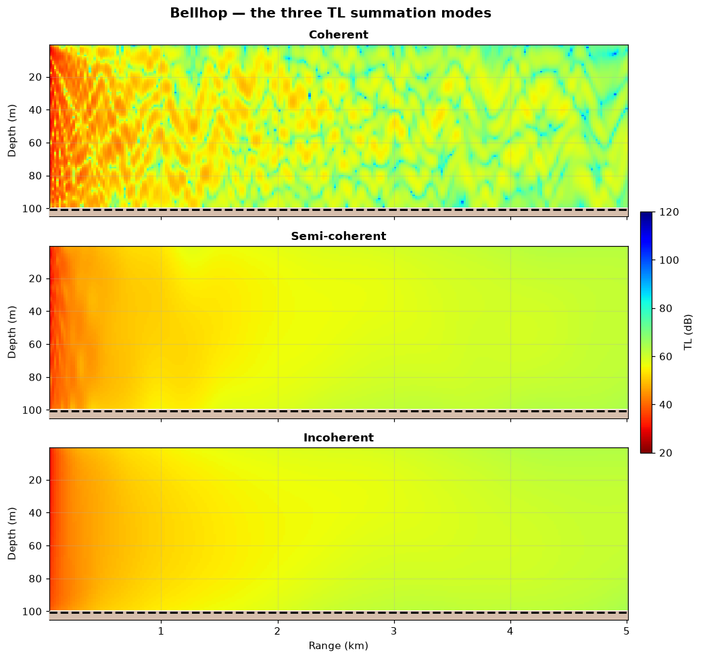
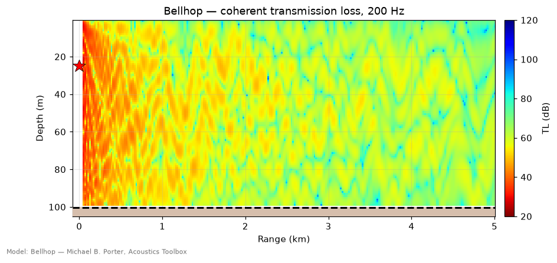
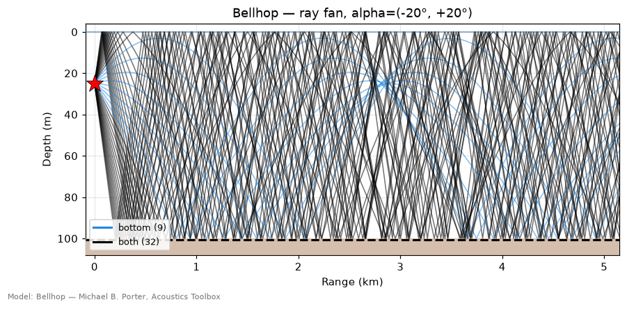
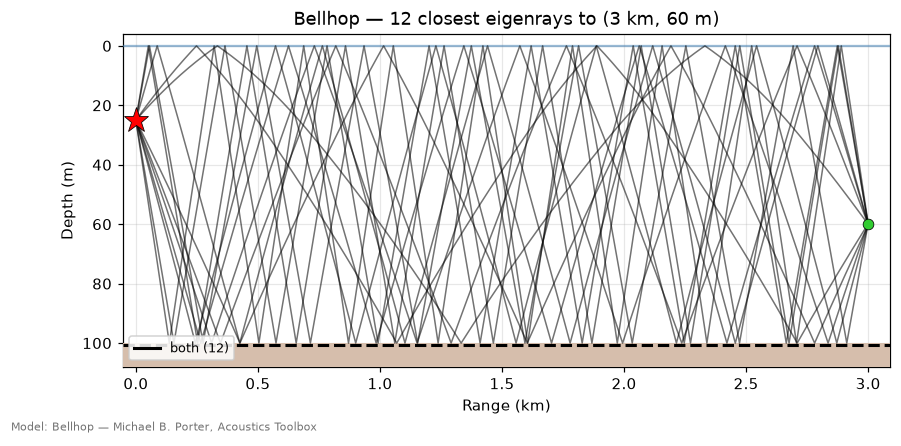
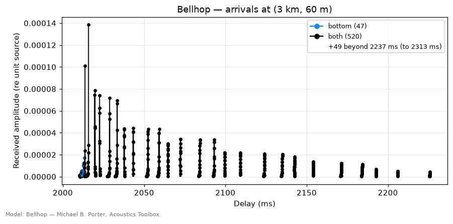
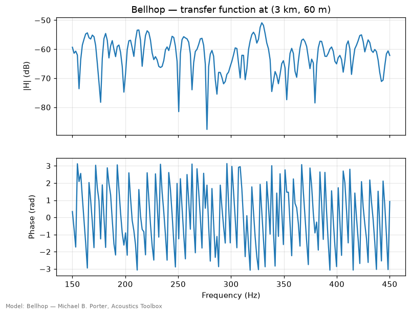

# Bellhop — Gaussian-beam ray tracing

> `uacpy.models.Bellhop` · wraps Michael B. Porter's BELLHOP (Acoustics Toolbox)
> · backends: `fortran`, `cxx`, `cuda`

Bellhop is the model to reach for first in shallow water at mid-to-high
frequency, and the only uacpy model that gives you the **geometry** of the
sound field — the actual ray paths, which boundaries each one bounced off, and
the arrival structure at a point.

---

## 1. What it solves

Bellhop solves the Helmholtz equation in the **ray / Gaussian-beam
approximation**. Instead of solving for the field everywhere at once, it fires
a fan of rays from the source, traces each through the sound-speed profile by
Snell's law, and reconstructs pressure by summing the beams that pass near each
receiver.

Each ray obeys the eikonal equations, so a ray bends toward lower sound speed:

```
dr/ds = c·ξ            dξ/ds = −(1/c²)·∂c/∂r
dz/ds = c·ζ            dζ/ds = −(1/c²)·∂c/∂z
```

A pure ray field has zeros in shadow zones and infinities at caustics.
`beam_type='B'` (the default) replaces each ray with a *geometric* **Gaussian
beam**: the width still follows the spreading of the ray tube, but the
cross-profile is Gaussian and the width is floored at `πλ` — the
Weinberg–Keenan focal limit. That floor, not the Gaussian shape by itself, is
what keeps caustics finite: the hat beam of `beam_type='G'` has a finite width
too, no floor, and reproduces the ray-theoretic singularity. The Gaussian tails
also leak energy into shadow zones. These beams interpolate the field between
rays; they are not models of a physically propagating beam.

**Validity is asymptotic, not a threshold.** Jensen (§3.4.2) is explicit that
no a-priori criterion exists; the guideline is that the wavelength be
substantially smaller than *any* physical scale in the problem — water depth,
bathymetric relief and duct thickness alike. The `D/λ` bands below are an
engineering convention on the depth scale only, and the literature brackets them
loosely on both sides: published guidance puts full confidence as high as
`D/λ ≳ 100`, while ray models have been validated against PE and
wavenumber-integral solutions down to 50 Hz in range-dependent shallow water.
Treat them as a first filter, not a criterion. At `c = 1500 m/s`:

| Depth | 50 Hz | 200 Hz | 1 kHz |
|---|---|---|---|
| 20 m | `D/λ ≈ 0.7` ✗ | `2.7` ✗ | `13` ~ |
| 100 m | `3.3` ✗ | `13` ~ | `67` ✓ |
| 1000 m | `33` ✓ | `133` ✓ | `667` ✓ |

✗ below `D/λ ≈ 5`, rays are the wrong tool · ~ `5–20`, cross-check a ray answer
against a modal one · ✓ above `≈ 20`, rays are comfortable and far cheaper.

Ray theory also degrades near caustics and in shadow zones whatever `D/λ` says,
and both regions widen with range. Where it fails, use a modal solver
([Kraken](kraken.md)) or a wavenumber-integral solver ([Scooter](scooter.md)) —
they are exact where Bellhop is asymptotic.

---

## 2. When to use it — and when not to

**Use Bellhop when:**

- you need **ray paths, eigenrays or arrival times**, not just transmission
  loss — no other uacpy model produces them;
- the water spans enough wavelengths — `D/λ ≳ 20` is comfortable, `5–20` wants
  a modal cross-check (§1);
- the environment is **range-dependent** (sloping bathymetry, a rough sea
  surface, a bottom whose properties change with range) — Bellhop handles all
  of these natively, without collapsing them;
- you want a **broadband impulse response** cheaply: one arrivals run gives
  `H(f)` across a whole band, instead of re-solving per frequency.

**Reach for something else when:**

| Situation | Why Bellhop struggles | Use instead |
|---|---|---|
| Low frequency / very shallow | Ray approximation breaks down | [Kraken](kraken.md), [Scooter](scooter.md) |
| You need modes themselves | Bellhop has no modal decomposition | [Kraken](kraken.md) |
| Layered *fluid* sediment stack | Reflection table, not resolved in the ray trace | [RAM](ram.md), [OASES](oases.md) |
| Exact elastic seabed physics | Approximated via a reflection table | [OASES](oases.md), [Scooter](scooter.md) |
| Seismo-acoustic / shear detail | Fluid-approximated | [OASES](oases.md) |

---

## 3. Environment support

What Bellhop takes natively, and what it routes or collapses first:

| Feature | Native? | Note |
|---|---|---|
| Range-dependent bathymetry | ✅ | written as a `.bty` boundary file |
| Range-dependent SSP | ✅ | multi-profile `.ssp`; needs `interp_ssp='quad'` |
| Range-dependent bottom | ✅ | |
| Sea-surface altimetry | ✅ | also supported by [RAM](ram.md) (`ramsurf` backend); no other model |
| Multiple source depths | ✅ | returns a `ResultStack` |
| Source beam pattern | ✅ | staged as an `.sbp` |
| Elastic media | ✅ | via auto-BOUNCE — see below |
| Layered bottom | ✅ | via auto-BOUNCE; layer stack kept, range collapsed to one column |
| Rough surface/bottom (`sigma`) | ❌ | collapsed |

### Elastic bottoms and the auto-BOUNCE route

Bellhop is a **fluid** ray tracer: it cannot represent shear directly. When
`env.bottom` carries shear or a layer stack, uacpy automatically runs
[Bounce](bounce.md) first to compute a plane-wave reflection-coefficient table
(`.brc`), then hands Bellhop that table as its bottom boundary.

The table is the exact **plane-wave** reflection coefficient of the layered
elastic stack, angle by angle — the layer stack itself is kept. Two things it
cannot carry. BOUNCE is range-independent, so the bottom collapses to one
representative column (you get a `UserWarning`). And a plane-wave `R(θ)` applied
at the bounce point is specular: it misses beam and time displacement — real
energy enters the sediment, refracts, and re-emerges downrange — and misses the
head (lateral) wave generated near the critical angle. `Bellhop(beam_shift=True)`
turns on BELLHOP's own beam-displacement correction. Where those effects
dominate, use [OASES](oases.md) or [Scooter](scooter.md). Disable the route with
`Bellhop(auto_bounce=False)` to fluid-approximate instead.

---

## 4. Run modes

```python
from uacpy.models import Bellhop, RunMode
```

| `RunMode` | Returns | What you get |
|---|---|---|
| `COHERENT_TL` | `Field` | complex pressure; keeps interference nulls |
| `INCOHERENT_TL` | `Field` | intensity sum; smooth, no nulls |
| `SEMICOHERENT_TL` | `Field` | intensity sum + Lloyd-mirror source shading |
| `RAYS` | `Rays` | the whole ray fan |
| `EIGENRAYS` | `Rays` | only rays that reach the receiver |
| `ARRIVALS` | `Arrivals` | amplitude + delay per path |
| `BROADBAND` | `Field` | `H(d, r, f)` transfer function |
| `TIME_SERIES` | `Field` | `p(d, r, t)` |

Default is `COHERENT_TL`. Unlike Kraken, Bellhop does not promote to
`BROADBAND` on its own: a multi-frequency source left on the default run mode
raises `ConfigurationError`. Ask for `RunMode.BROADBAND` (or `TIME_SERIES`)
explicitly.

### The three TL modes, side by side



Coherent TL keeps the interference structure — those nulls are real, and they
move if you shift the source by a wavelength. Incoherent TL sums intensities
and throws the phase away, giving the smooth envelope you want when you are
modelling a *band* of frequencies or do not trust the environment to
wavelength precision.

Semi-coherent is not a blend of the two. It sums intensities exactly as the
incoherent mode does, but first applies a Lloyd-mirror shading
`√2·|sin(ω z_s sinθ₀ / c)|` to the source's launch-angle **amplitude**
(`bellhop.f90:276-278`) — equivalently `2sin²(·)` once the contribution is
squared into the intensity sum. That is the physical `4sin²` Lloyd pattern
renormalised to unit mean, which is why the shading redistributes energy
rather than adding any. The
case for it is a shallow, mid-frequency source: the interference of the source
with its own surface image is a stable feature worth keeping even when the
ray-to-ray phase is not. That is why the middle panel tracks the incoherent one
everywhere except the first kilometre, where the source pattern still bites.

---

## 5. Constructor knobs

Everything is configured on the constructor; `run()` has a fixed signature.

**Geometry and beams**

| Name | Default | Meaning |
|---|---|---|
| `n_beams` | `0` | Number of rays. `0` lets Bellhop choose. |
| `alpha` | `(-80, 80)` | Launch-angle fan, degrees. Narrow it to isolate paths. |
| `beam_type` | `'B'` | Cross-beam profile. `'B'` geometric Gaussian and `'G'` geometric hat, both Cartesian; `'g'` the ray-centred hat; `'S'` Bucker simple Gaussian; `'C'`/`'R'` Červený beams in Cartesian / ray-centred coordinates. `'G'` is BELLHOP's own default. |
| `step` | `0.0` | Ray step (m); `0` auto-selects. |
| `z_box`, `r_box` | `None` | Ray-trace bounding box; auto-fitted to the receiver grid. |

**Numerics and environment**

| Name | Default | Meaning |
|---|---|---|
| `grid_type` | `'R'` | Receiver grid: `'R'` rectilinear, `'I'` irregular (paired depth/range). |
| `interp_ssp` | `None` | SSP connection scheme: `'linear'`, `'pchip'`, `'cubic'`, `'quad'`, `'n2linear'`, `'analytic'`. `None` auto-picks `'quad'` for a range-dependent `env.ssp`, `'linear'` otherwise. |
| `interp_bathymetry` | `'linear'` | `'linear'` or `'curvilinear'`. |
| `interp_altimetry` | `'linear'` | as above, for the sea surface. |
| `auto_bounce` | `True` | Route elastic/layered bottoms through BOUNCE. |

**Červený beams only** (`beam_type='C'` or `'R'`)

These are written to the env file only for the two Červený beam types. Setting
any of them under another beam type — including the default `'B'` — emits a
`UserWarning` and does nothing.

| Name | Default | Meaning |
|---|---|---|
| `beam_width_type` | `'F'` | Beam-width law: `'F'` filling, `'M'` match, `'W'` waveguide. |
| `beam_curvature` | `'D'` | Curvature correction. |
| `component` | `'P'` | Output component for displacement-receiver fields: `'P'` pressure, `'V'` vertical, `'H'` horizontal (`influence.f90:120-130`). |

**Broadband synthesis**

| Name | Default | Meaning |
|---|---|---|
| `n_freqs` | `128` | Frequency bins synthesised from one arrivals run. |
| `bandwidth_factor` | `0.5` | Band width as a fraction of centre frequency. |
| `time_window`, `t_start` | `None` | Time-series window and start. |

**Execution**

| Name | Default | Meaning |
|---|---|---|
| `backend` | `None` | `'fortran'`, `'cxx'`, `'cuda'`; `None` auto-picks in the order cuda → cxx → fortran, silently. |
| `dimensionality` | `'2D'` | Only `'2D'`; `'3D'` raises. It is the `--2D` flag the cxx/cuda CLIs require; the Fortran binary takes none. |
| `work_dir` | `None` | Pin the scratch dir to keep `.env`/`.shd`/`.prt`. |
| `cleanup` | `None` | Defaults to *keep* when `work_dir` is pinned. |
| `timeout` | `600.0` | Subprocess timeout (s). |
| `verbose` | `False` | `True` / `'info'` / `'debug'`. |

---

## 6. Worked example

Every figure on this page comes from
[`docs/figure_scripts/bellhop.py`](../figure_scripts/bellhop.py) — the code
below is that code, so it cannot drift from what you see.

```python
import numpy as np
import uacpy
from uacpy.models import Bellhop, RunMode

env = uacpy.Environment(
    name='Shallow-water channel',
    bathymetry=100.0,
    ssp=[(0.0, 1500.0), (30.0, 1495.0), (100.0, 1490.0)],
    bottom=uacpy.BoundaryProperties(
        acoustic_type='half-space',
        sound_speed=1650.0, density=1.8, attenuation=0.6,
    ),
)
source = uacpy.Source(depths=25.0, frequencies=200.0)
receiver = uacpy.Receiver(
    depths=np.linspace(1.0, 99.0, 100),
    ranges=np.linspace(50.0, 5000.0, 250),
)

tl = Bellhop(n_beams=3000).run(env, source, receiver,
                               run_mode=RunMode.COHERENT_TL)
tl.plot(env=env, source=source, title='Coherent transmission loss, 200 Hz')
```



Pass `env=` to draw the seabed and span the full water column, and
`source=` / `receiver=` to overlay the geometry. A result carries **no**
environment of its own, so without `env=` the depth axis spans only the
receiver grid.

### Ray paths

```python
rays = Bellhop(n_beams=41, alpha=(-20.0, 20.0)).run(
    env, source, receiver, run_mode=RunMode.RAYS)
rays.plot(env=env, show_receivers=False)
```



Rays are coloured by what they hit: **red** direct, **green** surface-reflected,
**blue** bottom-reflected, **black** both. The legend counts each class.

### Eigenrays — the paths that actually arrive

```python
point = uacpy.Receiver(depths=60.0, ranges=3000.0)
eig = Bellhop(n_beams=4000, alpha=(-45.0, 45.0)).run(
    env, source, point, run_mode=RunMode.EIGENRAYS)
eig.top_n_by_miss(12).plot(env=env)
```



Eigenrays are the subset of the fan that lands near the receiver.
`top_n_by_miss(n)` keeps the `n` that pass closest — unfiltered, this run
returns 2639 of them, for the same beam-window reason as the arrivals below.

### Arrivals — the impulse structure

```python
arr = Bellhop(n_beams=4000, alpha=(-45.0, 45.0)).run(
    env, source, point, run_mode=RunMode.ARRIVALS)
arr.plot()
```



Each marker is one *beam* contribution: its delay is the travel time, its
height the amplitude, its colour the multipath class. With the default Gaussian
beams (`beam_type='B'`) every physical path is resolved into a picket of
neighbouring beams that fall inside the beam window — 2639 entries here against
61 for the same run with `beam_type='G'` — which is why the columns read solid
rather than as individual stems. Use `beam_type='G'` (geometric hat beams) to
get one arrival per path; that is what the BELLHOP user guide prescribes for
arrivals and eigenrays. Either way this is the channel impulse response, and it
is what [`uacpy.comms`](../guide/comms.md) uses to simulate a modem link.

### Broadband transfer function

```python
source_bb = uacpy.Source(depths=25.0,
                         frequencies=np.linspace(150.0, 450.0, 192))
H = Bellhop(n_beams=3000).run(env, source_bb, point,
                              run_mode=RunMode.BROADBAND)
H.plot_transfer_function()
```



Bellhop synthesises the whole band from **one** arrivals run by phasing the
delays, rather than re-solving per frequency — which is why it is dramatically
cheaper than a modal or spectral sweep for broadband work. The price is in the
amplitudes: delays and volume attenuation are exact per frequency, but the beam
amplitudes are computed once at the band centre `fc` and held flat, so they are
only first-order correct near `fc` and degrade toward the band edges, worst at
caustics. The example above spans 150–450 Hz — `fc = 300 Hz` at ±50 %, which is
the practical limit. For wider bands, run sub-bands at several `fc` and stitch.

The phase panel is aliased, not noisy: at 192 bins over 300 Hz the spacing is
`Δf ≈ 1.57 Hz`, and a ~2 s bulk delay advances the phase ~20 rad per bin
against a Nyquist limit of π. Read `|H|` here, and use `plot_impulse_response()`
for timing.

---

## 7. Gotchas

**Ray-box fitting.** `r_box` is auto-fitted to 1.2× the furthest receiver.
That margin is deliberate: rays that leave the box are killed, and
back-scattered rays need headroom. Do not "tighten" it.

**Range-dependent SSP needs `interp_ssp='quad'`.** That is what writes
BELLHOP's Quad (`'Q'`) SSP interpolation and the multi-profile `.ssp`. The
default `interp_ssp=None` auto-picks `'quad'` whenever `env.ssp` is
range-dependent, so you normally get it for free; pass `interp_ssp` yourself
and you own it. (`grid_type` is unrelated — that selects the *receiver* grid.)

**No-data cells are `NaN`, not zero.** Where no ray reached, TL is `NaN` and
plots transparent. `np.nanmedian` and friends, not `np.median`.

**Beam count is a convergence parameter.** Too few beams gives a speckled,
under-sampled field. If the TL image looks grainy, raise `n_beams` and confirm
the picture stops changing.

**`alpha` clips the field, not just the picture.** Narrowing the fan removes
steep paths entirely — useful for isolating a path, wrong if you want total
field.

**Backend fallback is about binaries, not GPUs.** An explicit `backend='cuda'`
falls back to fortran with a `UserWarning` when the `bellhopcuda` *binary* is
missing. A binary that is present but has no usable GPU is not detected here,
and the `backend=None` auto-pick never warns at all. Check `result.backend` to
see what actually ran.

---

## 8. References

- Porter, M. B., *The BELLHOP Manual and User's Guide*, HLS Research, 2011 —
  vendored at [`docs/other/Bellhop_userGuide.pdf`](../other/Bellhop_userGuide.pdf).
- Porter, M. B. & Bucker, H. P., "Gaussian beam tracing for computing ocean
  acoustic fields", *JASA* 82(4), 1987.
- Jensen, Kuperman, Porter & Schmidt, *Computational Ocean Acoustics*, 2nd ed.,
  Springer, 2011 — chapter 3 for ray theory.
- Local modifications to the vendored source:
  [`uacpy/third_party/MODIFICATIONS.md`](../../uacpy/third_party/MODIFICATIONS.md).

---

**See also:** [Kraken](kraken.md) · [RAM](ram.md) · [Scooter](scooter.md) ·
[Bounce](bounce.md) · [model index](README.md)
