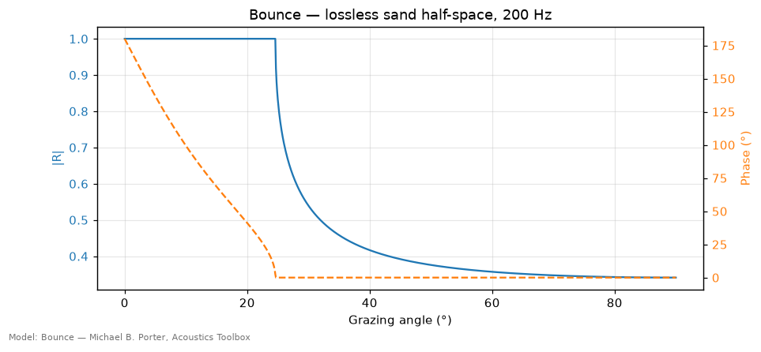
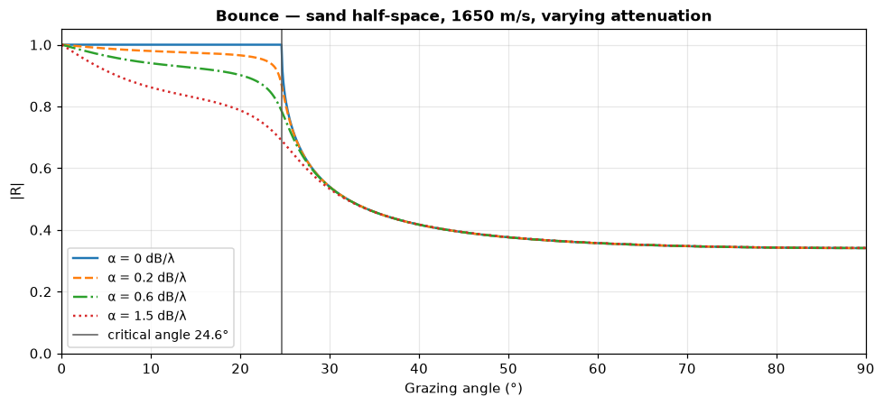
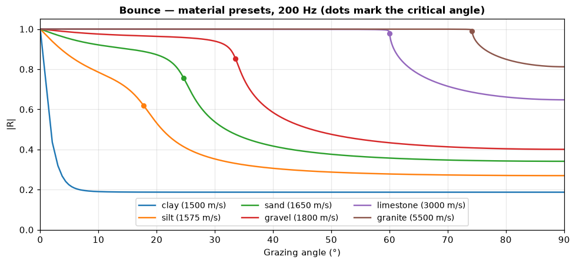
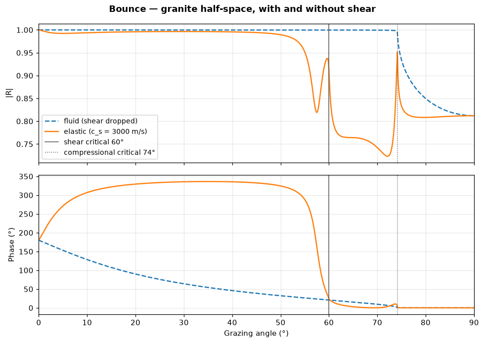
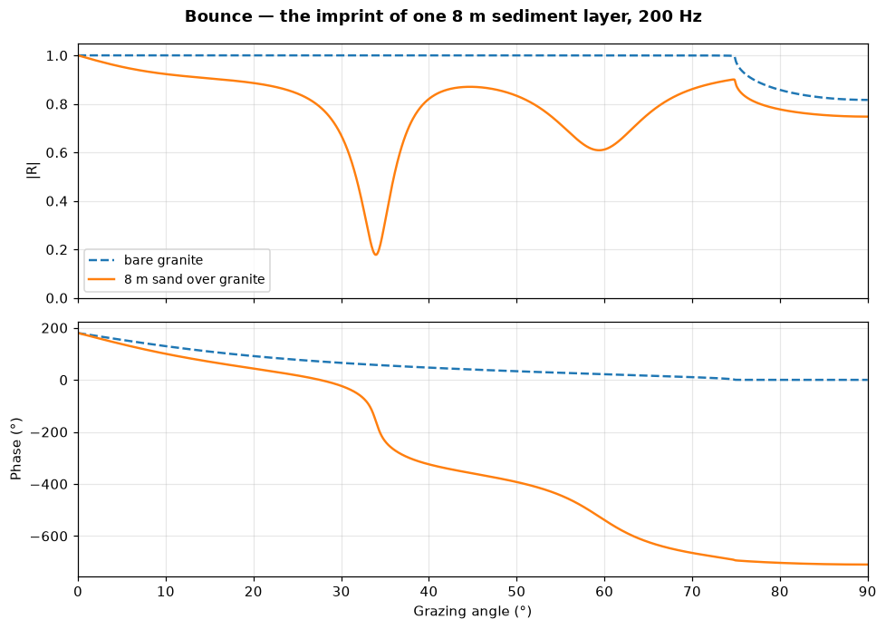
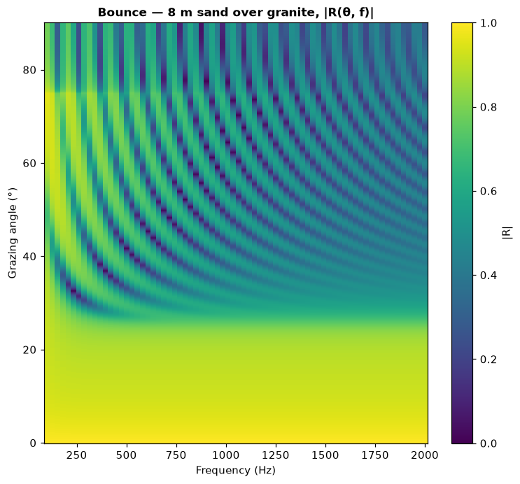
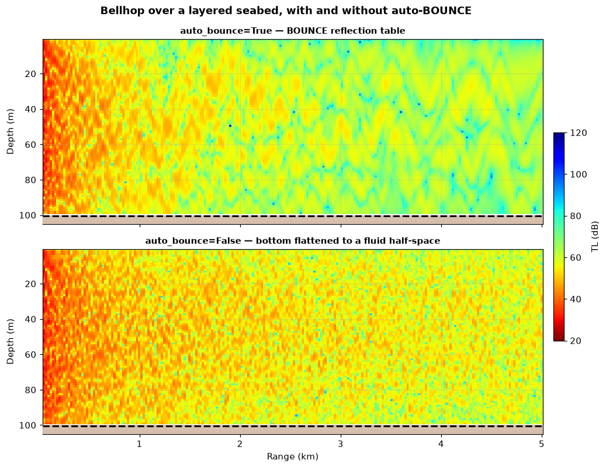

# Bounce — plane-wave reflection coefficients

> `uacpy.models.Bounce` · wraps Michael B. Porter's BOUNCE (Acoustics Toolbox)

Bounce is the odd one out. It does not propagate anything, has no receiver
grid, and returns no field. It answers one question about one boundary: **when
a plane wave hits this seabed at grazing angle θ, what comes back?**

That answer — the complex reflection coefficient `R(θ)` — is the single most
important property of a seabed for everything else in this package, and it is
what the other models are quietly asking for when you hand them a bottom.

---

## 1. What it solves

At a boundary between two media, an incident plane wave splits into a
reflected wave and whatever propagates into the lower medium. The **reflection
coefficient** is the ratio of the reflected to the incident complex amplitude:

```
R(θ) = |R(θ)| · e^{iφ(θ)}
```

`|R|` is the fraction of amplitude returned (0 = perfectly absorbing, 1 =
perfectly reflecting) and `φ` is the phase the boundary adds, in the Acoustics
Toolbox's `e^{−iωt}` time convention: `rc.R * exp(1j * rc.phi)` is exactly the
coefficient BOUNCE computed. Both depend on the grazing angle θ, measured from
the interface — **0° is a ray skimming along the seabed, 90° is normal
incidence.**

For a fluid half-space this has a closed form. With the normal impedance
`Z = ρc / sin θ` in each medium,

```
R = (Z₂ − Z₁) / (Z₂ + Z₁)        Z_i = ρ_i c_i / sin θ_i
```

and Snell's law in grazing-angle form, `cos θ₁ / c₁ = cos θ₂ / c₂`, ties the
two angles together. Bounce solves the same problem for an arbitrary stack of
fluid layers over a fluid or elastic half-space, where the closed form stops
being a formula you would write down: it meshes the stack, marches an impedance
recursion *up* from the bottom half-space, and tabulates the result.

### Why a reflection coefficient is the right abstraction

A propagation model does not need to know what your sediment is made of. It
needs to know what the seabed *does* to a wave. `R(θ)` is the complete linear
description of everything below the water that a propagating wave in the water
can see: layer thicknesses, impedance contrasts, shear, absorption — all of it
collapses into one complex function of one variable.

That is why the Acoustics Toolbox field models accept a reflection-coefficient
file (`.brc`) *in place of* a seabed description, and why the auto-BOUNCE route in
[Bellhop](bellhop.md#elastic-bottoms-and-the-auto-bounce-route) works at all:
Bellhop cannot represent a layered elastic stack, but it can look up a table.

**What `R(θ)` throws away is range dependence**, and one piece of physics. It is
a property of a stratified boundary, so a bottom that changes along the track has
to be reduced to a single representative column before Bounce sees it. And an
elastic seabed also supports a Scholte interface wave, whose horizontal
wavenumber exceeds the water's: it lives outside the propagating angle range a
`.brc` tabulates, so no reflection-coefficient table can hand it to a ray tracer.
If you need it, you need [OASES](oases.md) or [Scooter](scooter.md) end to end.

---

## 2. When to use it — and when not to

**Use Bounce when:**

- you want to **understand a seabed** — the critical angle, how much energy
  each bounce costs, where a sediment layer puts its interference nulls;
- you are **choosing geoacoustic parameters** and want to see what your choice
  does before spending a propagation run on it;
- you need a `.brc` table to feed [Bellhop](bellhop.md),
  [Scooter](scooter.md) or [Kraken](kraken.md) explicitly.

**Reach for something else when:**

| Situation | Why Bounce cannot | Use instead |
|---|---|---|
| You want transmission loss | Bounce computes no field | any propagation model |
| Reflection across a **band** | one frequency per run | [OASES](oases.md) (OASR) |
| A shear-converted coefficient (P-SV, P-Slow) | BOUNCE emits P-P only | [OASES](oases.md) (OASR) |
| P-SV conversion, transmission coefficients | BOUNCE emits P-P only | [OASES](oases.md) (OASR) |
| The bottom changes along the track | range-independent by construction | [RAM](ram.md), [Bellhop](bellhop.md) |

### Bounce or OASR?

Both compute plane-wave reflection coefficients for a stratified seabed, and on
a fluid stack they agree. They differ in reach and in plumbing:

| | **Bounce** (AT) | **OASR** ([OASES](oases.md)) |
|---|---|---|
| Media | fluid or elastic layers over a fluid or elastic half-space | full seismo-acoustic |
| Frequency | one per run | swept in one run → 2-D `R(θ, f)` |
| Angle grid | derived from `c_low`/`c_high`/`rmax` | you pass `angles=` |
| Coefficient | P-P | P-P, P-SV, transmission |
| Writes `.brc` / `.irc` | ✅ — consumed directly by AT models | ✗ |

Bounce is the one wired into the rest of the toolbox. OASR is the one to reach
for when you need physics BOUNCE does not model, or a broadband picture.

---

## 3. Environment support

| Feature | Native? | Note |
|---|---|---|
| Layered bottom | ✅ | the whole point — an arbitrary stack of fluid layers |
| Elastic media (shear) | ✅ | elastic layers and half-space; P-P coefficient only |
| Range-dependent bottom | ❌ | collapsed to the median column, with a `UserWarning` |
| Range-dependent bathymetry / SSP | ❌ | Bounce reads no range axis |
| Sea-surface altimetry | ❌ | |
| Multiple frequencies | ❌ | raises; loop, or use OASR |

Bounce reads **no source or receiver geometry** — the plane-wave reflection
coefficient does not depend on where anything is. `source.frequencies[0]` and
`receiver.range_max` are the only two numbers it takes from those carriers, and
`rmax=` replaces the second one.

See [environment carriers](../guide/environment.md) for how to build the
`SeabedColumn`, `SedimentLayer` and `BoundaryProperties` that describe a stack,
and for the `uacpy.materials` preset catalogue used throughout this page.

---

## 4. Run modes

```python
from uacpy.models import Bounce, RunMode
```

| `RunMode` | Returns | What you get |
|---|---|---|
| `REFLECTION` | `ReflectionCoefficient` | magnitude and phase versus grazing angle, plus the `.brc` / `.irc` files |

That is the entire list, and it is the default — `run_mode=` can be omitted.

The result carries `theta` (degrees), `R` (magnitude, 0–1) and `phi` (radians),
plus the usual `.at` / `.isel` / `.eval` slicing on an `angle=` axis. Note the
deliberate asymmetry documented in [results](../guide/results.md): slicing an
*angle* keeps `theta` as a length-1 axis, because θ is this type's permanent
abscissa.

Like every uacpy result it draws itself with `.plot()` — see
[plotting](../guide/plotting.md). `show_phase=True` adds `φ(θ)` on a twin axis;
a 2-D `R(θ, f)` (which only OASR produces) renders as a heatmap instead.

---

## 5. Constructor knobs

Everything is configured on the constructor; `run()` has a fixed signature.

**The angular grid**

| Name | Default | Meaning |
|---|---|---|
| `c_low` | `1400.0` | Lowest phase velocity tabulated (m/s). Must be `> 0`. |
| `c_high` | `1e9` | Highest phase velocity. `1e9` zeroes the minimum wavenumber and buys the full 0–90° sweep. |
| `rmax` | `None` | Range (m) the table is sized for — it sets how many angles you get. `None` auto-derives from `receiver.range_max`, or 10 km. |
| `n_angles` | `None` | Ask for ≈ N samples directly; `rmax` is back-derived to match. |

**Everything else**

| Name | Default | Meaning |
|---|---|---|
| `executable` | `None` | Path to `bounce`; auto-detected. |
| `interp_ssp` | `None` | SSP interpolation scheme written into the `.env`. |
| `collapse` | `None` | Override the collapse policy (default `bottom_range='median'`). |
| `use_tmpfs` | `False` | Stage scratch files in RAM. |
| `work_dir` | `None` | Pin the scratch dir to keep `.brc` / `.irc` / `.env` / `.prt`. |
| `cleanup` | `None` | Defaults to *keep* when `work_dir` is pinned. |
| `timeout` | `600.0` | Subprocess timeout (s). |
| `verbose` | `False` | `True` / `'info'` / `'debug'`. |

---

## 6. Worked example

Every figure on this page comes from
[`docs/figure_scripts/bounce.py`](../figure_scripts/bounce.py) — the code below
is that code, so it cannot drift from what you see. All of it shares one setup:
the same water over a different seabed each time, so the curves are comparable
from figure to figure.

```python
import numpy as np
import uacpy
from uacpy.models import Bounce

GRID = dict(c_low=1400.0, c_high=1e9, rmax=10_000.0)
PROBE = uacpy.Receiver(depths=50.0, ranges=10_000.0)
WATER_SPEED = 1500.0


def seabed(bottom):
    """100 m of isovelocity water over ``bottom`` — the one thing that varies."""
    return uacpy.Environment(
        name='Reflection test case',
        bathymetry=100.0,
        ssp=[(0.0, WATER_SPEED), (100.0, WATER_SPEED)],
        bottom=bottom,
    )


def reflection(bottom, frequency=200.0):
    """Plane-wave reflection coefficient of ``bottom`` at ``frequency``."""
    source = uacpy.Source(depths=25.0, frequencies=frequency)
    return Bounce(**GRID).run(seabed(bottom), source, PROBE)


def critical_angle(sound_speed):
    """Grazing angle below which a wave in the water cannot enter ``sound_speed``."""
    return np.degrees(np.arccos(WATER_SPEED / sound_speed))


def as_explicit_layer(bottom, thickness=1.0):
    """``bottom`` rewritten as one explicit layer of itself over itself.

    Same seabed, same ``|R|`` — but it keeps the phase referenced to the
    seafloor. See [Gotchas](#8-gotchas). Fluid media only.
    """
    return uacpy.SeabedColumn(
        layers=[uacpy.SedimentLayer(
            thickness=thickness,
            sound_speed=bottom.sound_speed,
            density=bottom.density,
            attenuation=bottom.attenuation,
        )],
        halfspace=bottom,
    )
```

### The critical angle

```python
sand = uacpy.BoundaryProperties(
    acoustic_type='half-space',
    sound_speed=1650.0, density=1.9, attenuation=0.0,
)
rc = reflection(as_explicit_layer(sand))
rc.plot(show_phase=True, title='Bounce — lossless sand half-space, 200 Hz')
```



Below **24.6°** the reflection is *total*: `|R| = 1` exactly, not approximately.
That angle is `arccos(c_water / c_bottom) = arccos(1500/1650)`, and the reason
is Snell's law. A wave arriving flatter than the critical angle would need
`cos θ₂ > 1` to continue into the sediment — impossible, so no propagating wave
exists down there. The field below the interface is evanescent, it carries no
energy away, and everything comes back.

The phase (dashed) tells the other half of the story. At grazing incidence the
seabed behaves like a pressure-release surface — `R = −1`, a 180° shift — and as
the angle steepens the phase sweeps continuously down to zero at the critical
angle. Above the critical angle `R` is real and positive, so there is no phase
shift at all. Total reflection is not free: it *delays* the wave by an
angle-dependent amount, and that delay is what enters the eigenvalue equation a
normal-mode solver like [Kraken](kraken.md) solves. It is why a waveguide's
modes depend on the sediment even when the sediment absorbs nothing.

Above the critical angle energy escapes into the bottom and `|R|` falls fast,
levelling off at normal incidence to the impedance-contrast value
`(ρ₂c₂ − ρ₁c₁)/(ρ₂c₂ + ρ₁c₁) = 0.353`.

### What absorption does to it

```python
for alpha in [0.0, 0.2, 0.6, 1.5]:
    rc = reflection(uacpy.BoundaryProperties(
        acoustic_type='half-space',
        sound_speed=1650.0, density=1.9, attenuation=alpha,
    ))
    ax.plot(rc.theta, rc.R, label=f'α = {alpha:g} dB/λ')
```



Total internal reflection is total only in a lossless sediment. The evanescent
field below the interface still samples the medium, so if that medium absorbs,
the "totally reflected" wave loses a little on every bounce — and the sub-critical
plateau sags. At `α = 1.5 dB/λ` a 10° ray gives up ~14 % of its amplitude per
bounce, which over a hundred bounces is the difference between a usable
waveguide and none.

Note what does *not* move: the critical angle itself, and the super-critical
tail. Absorption controls the plateau height; the sound-speed contrast controls
where the plateau ends.

### The catalogue, side by side

```python
for name in ['clay', 'silt', 'sand', 'gravel', 'limestone', 'granite']:
    bottom = uacpy.BoundaryProperties.from_preset(name)
    rc = reflection(bottom)
    ax.plot(rc.theta, rc.R, label=f'{name} ({bottom.sound_speed:.0f} m/s)')
    if bottom.sound_speed > WATER_SPEED:
        theta_c = critical_angle(bottom.sound_speed)
        ax.plot([theta_c], [np.interp(theta_c, rc.theta, rc.R)], 'o')
```



This is the whole reason "the bottom type" matters. Harder bottom → faster
sound → larger critical angle → a wider cone of angles trapped in the water
column. Granite holds on to everything out to 74°; silt gives up beyond 18°,
and leaks even below that.

Clay is the instructive extreme: its sound speed *equals* the water's, so there
is no critical angle at all and `|R| = 0.2` at every angle — pure density
contrast, `(1.5 − 1.0)/(1.5 + 1.0)`. A clay seabed is close to an anechoic
termination, and a shallow channel over clay barely propagates.

Sonar-equation work wants this as a loss rather than a ratio:
`BL(θ) = −20 log₁₀|R(θ)|` is the bottom loss in dB per bounce, which is the unit
the [OASES](oases.md) page plots. The catalogue spans it: at 10° grazing, sand
gives up 0.7 dB per bounce and clay 13.9 dB. Note that sand's advantage is a
low-angle one — by 24°, just under its critical angle, it is already losing
2.0 dB.

No preset is *slower* than the water, and a slow bottom behaves differently
again: it has no critical angle at all, and instead an **intromission angle**
where the two impedances match, `|R|` falls to zero and the seabed swallows
everything. Soft mud at 1450 m/s and 1.4 g/cm³ puts it at 15.7°, where
`|R| = 0.0007` and the phase steps through 180°. If you are modelling mud rather
than sand, that null is the feature to look for.

Building these bottoms — presets, overrides, layer stacks — is
[the environment guide's](../guide/environment.md) subject.

### Shear: what a fluid model cannot see

```python
fluid = uacpy.BoundaryProperties.from_preset('granite')
elastic = uacpy.BoundaryProperties.from_preset('granite', elastic=True)
```



Same rock, same density, same compressional speed — the only difference is
whether the preset's shear speed (3000 m/s) is kept. `from_preset` drops shear
by default so the result works with every model; `elastic=True` keeps it.

An elastic solid supports two body waves, and each gets its own critical angle:
60° for shear, 74° for compression. Below 60° both are evanescent and the rock
is very nearly a mirror — though not identically to the fluid case, because the
evanescent shear field still samples a lossy solid and gives up a little more on
every bounce. **Between 60° and 74° the shear wave propagates**,
and it carries energy away — so `|R|` drops to ~0.73 while the fluid model,
which has no shear wave to radiate into, still says 0.999.

That is ~2.7 dB of loss per bounce that a fluid seabed simply cannot produce.
Over a rocky shelf it is the difference between a right answer and a
comfortable one. When you need this physics inside a propagation run rather
than at a single boundary, [OASES](oases.md) and [Scooter](scooter.md) solve
elastic media directly.

### A layer turns a mirror into a filter

```python
bare = as_explicit_layer(uacpy.BoundaryProperties.from_preset('granite'))
stack = uacpy.SeabedColumn.from_presets(layers=[('sand', 8.0)], halfspace='granite')
```



Add 8 m of sand on top of the granite and the smooth curve grows deep nulls.
The layer is an etalon: part of the wave reflects off the water/sand interface
and part off the sand/granite interface, and the two returns interfere. The
round-trip phase through the layer is `2 (ω/c_layer) h sin θ_layer`, and where
the two returns arrive out of step the reflection is suppressed — here at 34°
and 60°, where `|R|` drops to 0.16 and 0.60. The nulls are not evenly spaced in
that round-trip phase — 285° at the first, 578° at the second — because the
granite's own reflection phase is swinging with angle too, and they are not
perfect cancellations, because the two returns do not have equal amplitude.

The phase panel shows the same thing more sharply: each null is a 360° phase
wrap. This structure is real and it is what makes sediment thickness estimable
from acoustic data at all.

### The same stack, across frequency

`layered_elastic()` is the shared 8 m-sand-over-granite scenario from
[`_common.py`](../figure_scripts/_common.py), which the other model pages use
too — the seabed is the same stack as above, under the canonical water column.

```python
env, _, _ = layered_elastic()          # 8 m sand over granite
freqs = np.linspace(100.0, 2000.0, 72)
theta = np.linspace(0.0, 90.0, 601)
R = np.empty((theta.size, freqs.size))
for j, f in enumerate(freqs):
    source = uacpy.Source(depths=25.0, frequencies=float(f))
    rc = Bounce(**GRID).run(env, source, PROBE)
    R[:, j] = np.interp(theta, rc.theta, rc.R)

ax.pcolormesh(freqs, theta, R, shading='nearest', cmap='viridis', vmin=0, vmax=1)
```



Bounce tabulates one frequency per run, so a band is a loop — and each run
picks its own angle grid (denser at high frequency), which is why the rows are
resampled onto a common axis before stacking.

The picture pays for the loop. Frequency and angle enter the layer's round-trip
phase only through the product `f · sin θ_layer`, so the nulls trace out a fan:
at 100 Hz there is barely one, by 2 kHz there are a dozen.

Below the sand's critical angle (~25°) the fringes stop: the wave is evanescent
in the sand, so there is no round trip to interfere with. What is left is
neither a perfect mirror nor quite frequency-flat. The sand's `α = 0.8 dB/λ`
holds `|R|` near 0.93 at 10° — about 0.6 dB per bounce — and close to the
critical angle the level still drifts, from 0.92 at 100 Hz to 0.83 by 800 Hz at
24°. That drift is the basement showing through: at low frequency 8 m of sand is
thin compared with the evanescent decay length, so the wave reaches the
near-lossless granite (`|R| = 0.9998` on its own) and reflects off that. By
800 Hz the sand has swallowed the evanescent tail and the stack returns exactly
the bare sand half-space's 0.829. Jensen et al. read the same effect as an
*apparent* critical angle that migrates with frequency, from the basement's
value at low frequency to the surface layer's at high (§1.6.3, Fig. 1.26b).

A homogeneous half-space has no length scale, so its `R(θ)` — magnitude and
phase alike — is the same at every frequency; every feature above belongs to the
layer. That is also the honest reason a broadband calculation over a *layered*
seabed cannot reuse one `.brc` table: the seabed is a different filter at every
frequency.

---

## 7. How Bounce reaches you without being called

Most users meet Bounce indirectly.
[Bellhop](bellhop.md#elastic-bottoms-and-the-auto-bounce-route) is a fluid ray
tracer and cannot represent shear or a layer stack. When `env.bottom` carries
either, uacpy runs Bounce first, writes the `.brc` table, and hands Bellhop that
table as its bottom boundary. You get a `UserWarning` saying so, because BOUNCE
is range-independent: the bottom is collapsed to one representative column
first. `Bellhop(auto_bounce=False)` opts out and fluid-approximates instead.

```python
env, source, receiver = layered_elastic()      # 8 m sand over granite
fig, axes = plt.subplots(2, 1, sharex=True, sharey=True)
for ax, auto in zip(axes, (True, False)):
    tl = Bellhop(n_beams=6000, auto_bounce=auto).run(
        env, source, receiver, run_mode=RunMode.COHERENT_TL)
    tl.plot(env=env, ax=ax)
```



Two runs over the same seabed. With auto-BOUNCE the sediment layer is honoured
exactly — its interference nulls strip whole families of angles out of the
field, and the result has visible structure. Without it, the layer is discarded
and the column flattens to the bare granite half-space, which reflects almost
everything out to 74°: the field stays hot and nearly featureless to 5 km.

The route is **exact in the plane-wave reflection coefficient**, amplitude and
phase alike, and the approximations left are the ones a ray tracer always makes.
`R(θ)` is a plane-wave quantity and a Gaussian beam is not a plane wave: Bellhop
applies the table as a specular reflection at a point, which discards the
horizontal displacement a real beam undergoes below the critical angle — the
lateral wave. That displacement scales as `1/f`, so it is negligible at high
frequency and matters at low and intermediate frequency (Jensen et al.,
§2.4.3.3). The other approximation is the one the warning names: the table is
range-independent.

### Doing it yourself

Pin `work_dir=` and the files outlive the call, so any model that reads a
reflection file can consume them:

```python
rc = Bounce(c_low=1400.0, c_high=1e9, work_dir='./brc_out').run(env, source, receiver)

env_rc = uacpy.Environment(
    bathymetry=100.0,
    ssp=[(0.0, 1500.0), (100.0, 1500.0)],
    bottom=uacpy.BoundaryProperties(
        acoustic_type='file', reflection_file=rc.metadata['brc_file'],
    ),
)
tl = Bellhop().run(env_rc, source, receiver, run_mode=RunMode.COHERENT_TL)
```

`.brc` is read by [Bellhop](bellhop.md), [Scooter](scooter.md) and
`Kraken(backend='krakenc')`; `.irc` is the internal-reflection form that
`Kraken(backend='kraken')` wants. [SPARC](sparc.md) reads neither.

---

## 8. Gotchas

**`c_high` sets where the table stops.** It runs from 0° up to
`arccos(c_water / c_high)`. The default `1e9` zeroes BOUNCE's minimum
wavenumber, so the sweep is the full 0–90° out of the box; pinning a finite
value truncates it — `c_high=10000` stops at ~81°, which is fine for a
propagation-facing table but not for inspecting normal incidence.

**The angle grid is uniform in `cos θ`, not in θ.** It comes from a uniform
sweep in horizontal slowness, which means it is *coarse where you probably care
most*: with `rmax=10 km` the spacing is 0.9° below 5° grazing and 0.04° near
normal incidence. Raise `rmax` (or set `n_angles`) if the sub-critical region
looks under-sampled. You cannot specify the angles directly — OASR can.

**The phase of a bare half-space's `.brc` is referenced 1 m above the seafloor.**
BOUNCE needs at least one medium, so when `env.bottom` is a bare half-space with
no layers, uacpy inserts a 1 m dummy slab at the *water* sound speed and puts the
half-space beneath it. BOUNCE reports the impedance at the top of that slab, so
the tabulated phase carries a spurious `−2 k (1 m) sin θ` term that grows with
frequency: −96° at normal incidence at 200 Hz, −192° at 400 Hz. `|R|` is
untouched — the slab is water on water — so magnitude-only work is unaffected.
Give the bottom an explicit layer and BOUNCE takes its exact path instead:

```python
sand = uacpy.BoundaryProperties(
    acoustic_type='half-space', sound_speed=1650.0, density=1.9, attenuation=0.0,
)
bottom = uacpy.SeabedColumn(
    layers=[uacpy.SedimentLayer(
        thickness=1.0, sound_speed=sand.sound_speed,
        density=sand.density, attenuation=sand.attenuation,
    )],
    halfspace=sand,
)
```

The layer is the same material as the half-space, so the seabed is physically
unchanged and `|R|` is identical to 3 × 10⁻⁶; the phase then lands on the
closed-form `arg R` to 0.001° and is identically zero above the critical angle.
Fluid media only — an elastic half-space has no acoustic layer to absorb the
respelling, so it keeps the offset. This is not confined to inspection work: a
bare elastic half-space has no layers, so
[Bellhop](bellhop.md)'s auto-BOUNCE route feeds on a table carrying the offset.

**One frequency per run.** A multi-frequency `Source` raises
`ConfigurationError` rather than silently using the first. Loop, or use OASR.

**The critical angle uses the water speed at the seabed**, not at the surface.
With a downward-refracting profile the seafloor sound speed is the lower one, so
the critical angle is *larger* than a surface-speed estimate suggests.

**Files only exist if you pin `work_dir`.** Without it, uacpy uses a temp
directory and wipes it when `run()` returns; `metadata['brc_file']` is not
populated with a stale path. The in-memory `.theta` / `.R` / `.phi` are always
there.

**A `Receiver` is required but barely used.** `run()` keeps the uniform
signature every model has; Bounce reads only `receiver.range_max`, and only when
`rmax=None`. Pin `rmax` and the receiver becomes a formality.

**Range-dependent bottoms are collapsed, not refused.** You get the median
column and a `UserWarning`. If the bottom genuinely varies along your track,
`R(θ)` is the wrong abstraction and you want [RAM](ram.md) or
[Bellhop](bellhop.md) with a range-dependent bottom.

---

## 9. References

- Porter, M. B., *The KRAKEN Normal Mode Program*, SACLANT Undersea Research
  Centre Memorandum SM-245, 1991 — BOUNCE shares KRAKEN's environment format
  and mesh machinery.
- Brekhovskikh, L. M., *Waves in Layered Media*, 2nd ed., Academic Press, 1980 —
  the classical treatment of `R(θ)` for stratified media.
- Jensen, Kuperman, Porter & Schmidt, *Computational Ocean Acoustics*, 2nd ed.,
  Springer, 2011 — chapter 1 for reflection and transmission at fluid and
  elastic interfaces.
- Local modifications to the vendored source:
  [`uacpy/third_party/MODIFICATIONS.md`](../../uacpy/third_party/MODIFICATIONS.md).

---

**See also:** [Bellhop](bellhop.md) · [Kraken](kraken.md) ·
[Scooter](scooter.md) · [OASES](oases.md) ·
[environment carriers](../guide/environment.md) · [model index](README.md) ·
[documentation index](../README.md)
