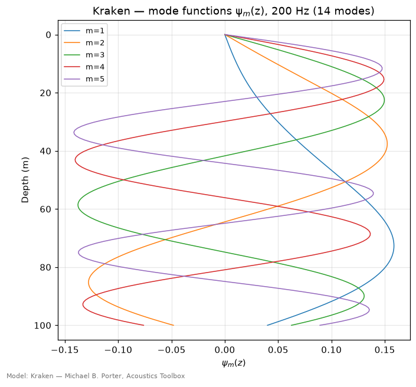
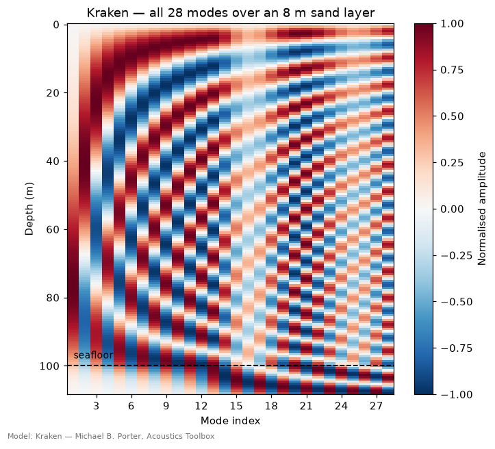
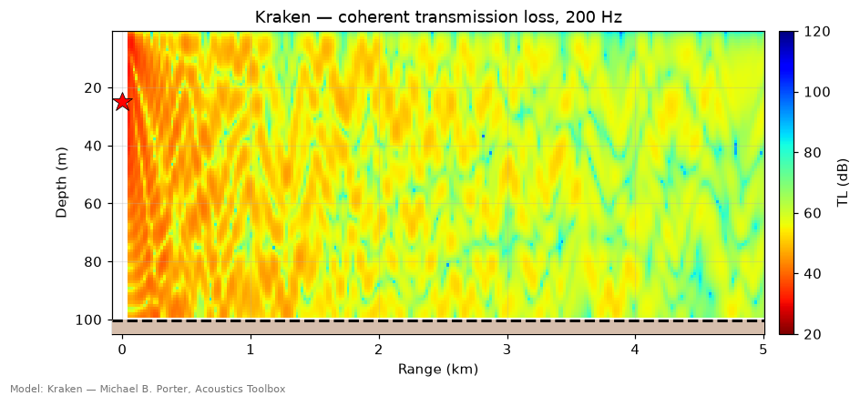
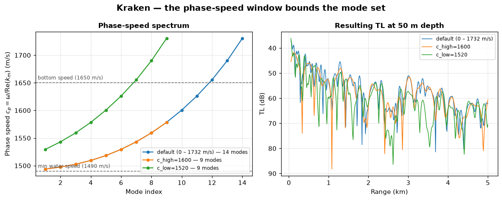
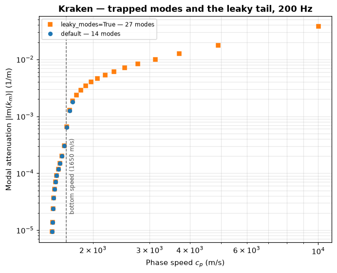
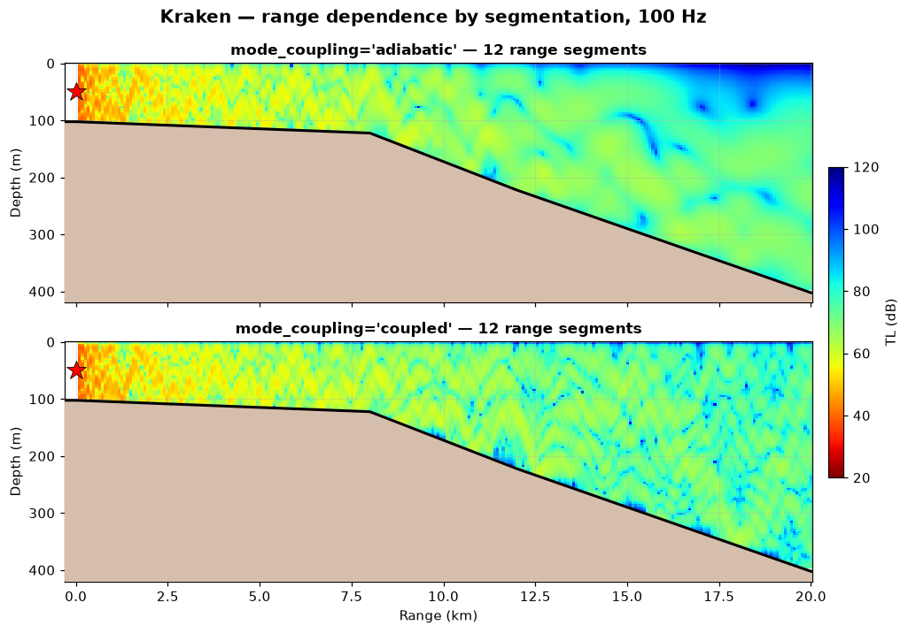
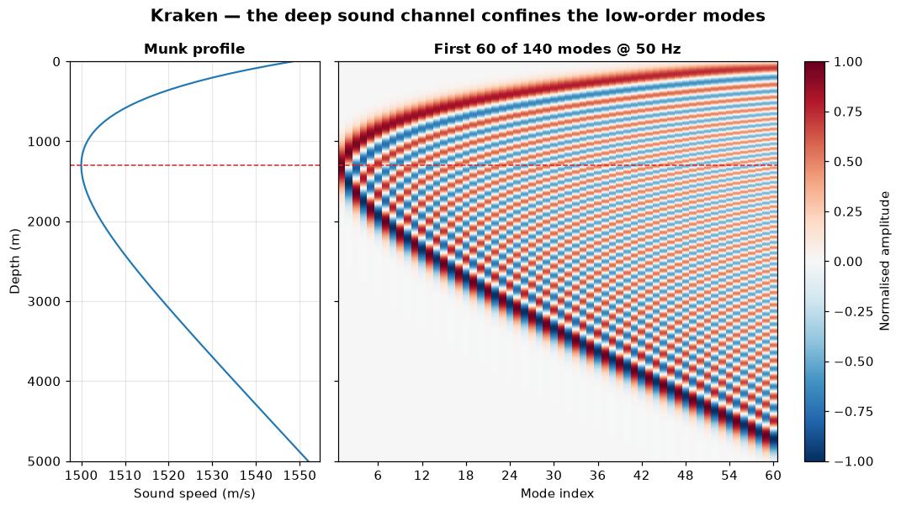

# Kraken — normal-mode propagation

> `uacpy.models.Kraken` · wraps Michael B. Porter's KRAKEN (Acoustics Toolbox)
> · backends: `kraken`, `krakenc`

Kraken is the model to reach for when the water is shallow and the frequency is
low — the regime where a ray is not a meaningful object — and the only uacpy
model that hands you the **modes** themselves rather than just the field they
sum to.

It is the exact complement of [Bellhop](bellhop.md). Bellhop is asymptotic in a
regime where modes are unusable because there are too many of them; Kraken is
non-asymptotic in a regime where rays are meaningless. Between them they cover
the frequency axis.

---

## 1. What it solves

In a horizontally stratified waveguide the Helmholtz equation **separates**.
Kraken solves the depth half of it as an eigenvalue problem, by finite
differences on a mesh:

```
ρ(z) · d/dz ( (1/ρ(z)) · dψ_m/dz ) + ( ω²/c(z)² − k_m² ) ψ_m(z) = 0
```

subject to the surface and seabed boundary conditions, with the normalisation
`∫ |ψ_m(z)|² / ρ(z) dz = 1`. The `ρ` weighting is what carries a mode across a
density jump — the water-to-sediment step in every example below — and it is
what Kraken discretises (`1/(h·ρ)` off-diagonals, `kraken.f90:564`). Only where
`ρ` is constant does it collapse to a plain `d²ψ_m/dz²`. Each eigenvalue `k_m`
is a horizontal wavenumber; each eigenfunction `ψ_m(z)` is a standing wave
across the water column. The field is their sum, every term travelling in range
with its own phase speed `c_p = ω / Re(k_m)` and its own decay `Im(k_m)`:

```
p(r, z) ≈ i·e^(−iπ/4) / ( ρ(z_s)·√(8πr) ) · Σ_m ψ_m(z_s)·ψ_m(z)·e^(i k_m r) / √k_m
```

The sum is written in the `e^(−iωt)` convention, where a decaying mode has
`Im(k_m) > 0`. `Modes.k` is in the Acoustics Toolbox's `e^(+iωt)` convention,
where decay is `Im(k_m) < 0` — what Kraken writes and what
`Modes.with_attenuation` writes too — so a hand-written sum over `modes.k` uses
`e^(−i k_m r)`, or the conjugate of the sum above. The package's modal sums
(`Modes.modal_pressure_field`, `uacpy.acoustics.modal_field`) also decay a mode
by `|Im(k_m)|` when a `Modes` built by hand carries the other sign.

**Nothing in that sum is a high-frequency approximation.** A mode is an exact
solution of the wave equation for the stratified problem — it has no
wavelength-scale validity condition to violate, which is precisely why it
survives where a ray does not.

What Kraken *does* approximate is which part of the spectrum it keeps: the
**discrete, trapped** modes. The continuous spectrum — steep-angle energy that
radiates into the seabed instead of reflecting off it — is not in the sum. That
is one of the two things that make the modal sum a far-field method; the other
is that the sum above is already the large-argument form of `H₀⁽¹⁾(k_m r)`,
valid only for `k_m r ≫ 1`. Widening the phase-speed window addresses the first
and cannot touch the second, which is why the near field is
[Scooter](scooter.md)'s job rather than a Kraken setting.

### The cost is the mode count

The number of trapped modes grows with the product of frequency and depth:

```
M ≈ 2 f D · √( 1/c_w² − 1/c_b² )
```

That counts only what is trapped below the bottom speed. Kraken's default
ceiling sits 5 % past it, so to predict what the solver returns, substitute
`c_high = 1.05 c_b` for `c_b` — for the table below that is 1732.5 m/s, and it
is the difference between 55 modes and 67 in the 100 m / 1 kHz cell.

Measured mode counts, for an isovelocity 1500 m/s channel over a 1650 m/s
half-space with the default phase-speed window:

| Depth | 50 Hz | 200 Hz | 1 kHz |
|---|---|---|---|
| 20 m | 1 | 3 | 13 |
| 100 m | 3 | 13 | 67 |
| 1000 m | 33 | 133 | 667 |

Compare that table with the `D/λ` table on the [Bellhop](bellhop.md) page: for
this water-to-seabed speed ratio the two happen to land on nearly the same
numbers. The coincidence is arithmetic, not a law, but it makes the trade
concrete — the regime where Bellhop is accurate (`D/λ ≳ 20`) is exactly the
regime where the modal sum has tens to hundreds of terms, and the regime where
Kraken has a handful of modes to add up is exactly where a ray answer is
nonsense.

---

## 2. When to use it — and when not to

**Use Kraken when:**

- the frequency is low or the water shallow — below `D/λ ≈ 5` the ray
  approximation is simply invalid, and between 5 and 20 a modal answer is the
  cross-check that tells you whether the ray one can be trusted;
- you want the **modes**, not just the field: eigenvalues, mode shapes,
  phase and group speeds, a modal basis for matched-field work. No other
  uacpy model produces them;
- the environment is range-independent, or range-dependent gently enough for
  adiabatic mode theory;
- you want **broadband** cheaply: one multi-frequency `.mod` file covers the
  whole band in a single `field.exe` pass, instead of one solve per bin.

**Reach for something else when:**

| Situation | Why Kraken struggles | Use instead |
|---|---|---|
| High frequency / `D/λ ≳ 20` | Hundreds of modes; Bellhop is far cheaper | [Bellhop](bellhop.md) |
| You need ray paths or arrival times | A mode has no geometry | [Bellhop](bellhop.md) |
| Near field, or below the modal cutoff | The continuous spectrum is not in the sum | [Scooter](scooter.md), [OASES](oases.md) |
| Steep slopes, long range, strong range dependence | Segmentation + adiabatic/coupled is an approximation | [RAM](ram.md) |
| A rough or moving sea surface | Altimetry is dropped | [Bellhop](bellhop.md) |
| A true elastic *modal* decomposition | `krakenc` handles elastic media with complex wavenumbers, but AT's elastic-mode solver `krakel.exe` is not wrapped | [OASES](oases.md) |

---

## 3. Environment support

| Feature | Native? | Note |
|---|:--:|---|
| Range-dependent bathymetry | ✅ | segmented into per-range profiles |
| Range-dependent SSP | ✅ | as above; the `MODES` path samples `r = 0` |
| Layered bottom | ✅ | meshed as extra media — modes continue into the sediment |
| Elastic media (shear) | ✅ | requires `backend='krakenc'`, auto-selected |
| Rough surface / bottom (`sigma`) | ✅ | |
| Source beam pattern | ✅ | staged as an `.sbp` |
| Range-dependent bottom | ✅ | each profile block carries the seabed column at its own range, layers included (every block is a full environment, `kraken.f90:42-46`); the `MODES` path samples `r = 0` |
| Sea-surface altimetry | ❌ | dropped; flat surface |
| Multiple source depths | ✅ (TL modes) | `field.exe` sums every depth of the `.flp` from the one `.mod` — the mode solve reads no source depth — so `COHERENT_TL` / `INCOHERENT_TL` launch once and the `.shd` reader splits the `NSz` axis into a `ResultStack` (measured 4.4× at eight depths). `BROADBAND` / `TIME_SERIES` loop through `run()`, one deck per depth; `MODES` returns one `Modes` whose `source_depths` lists every depth. Each slab equals that depth's stand-alone run exactly: the receiver depths sit on the mode-tabulation grid and are written to the `.flp` in full, so no source depth can reach another depth's answer |

The ❌ row is *collapsed* with a `FallbackWarning` naming what was dropped; the
mechanism, and the `collapse=` dict that overrides it, is in the
[environment guide](../guide/environment.md). Kraken declares no per-model
collapse default: bathymetry, SSP and bottom are all segmented on the field
path, and `compute_modes` samples every quantity at `r = 0`. `Bottom.at` takes
the nearest column, so a profile carries whichever column lies closest to its
own range. On the example-18 transects (a two-column layered seabed) the
segmented run agrees with RAM to 1.9 / 1.9 dB RMS at 103 m, hard / soft; one
collapsed column standing in for the whole run would differ by 8.4 / 16.0 dB.

### Real or complex arithmetic: `kraken` vs `krakenc`

The Acoustics Toolbox ships two mode solvers, and `backend=` picks between
them:

| `backend` | Binary | Handles |
|---|---|---|
| `'kraken'` | `kraken.exe` | real eigenvalues; attenuation added by perturbation |
| `'krakenc'` | `krakenc.exe` | complex eigenvalues: shear, leaky modes |
| `None` (default) | auto | `krakenc.exe` when the environment carries shear or `leaky_modes=True`, `kraken.exe` otherwise |

Real-arithmetic `kraken.exe` will *run* an elastic bottom — it has first-class
elastic branches — but it returns a **wrong** answer rather than merely an
incomplete one, for two reasons:

- It clamps the upper phase-speed bound to the half-space **shear** speed
  (`kraken.f90:209`, `cHigh = MIN(cHigh, HSBot%cS)`), silently discarding every
  mode above it. On a sand-over-granite deck it stops at 2974.8 m/s and finds 26
  modes — a figure measured before the `granite` preset took its present
  compressional speed and density, and not re-measured since, because reaching
  it means driving `kraken.exe` on an elastic deck, which uacpy refuses by
  design. `krakenc.exe` on that deck reaches 5545.9 m/s and finds 29.
- Its absorption perturbation loops only over **acoustic** media
  (`kraken.f90:728`), so an elastic layer's loss is never accumulated and every
  mode comes back with `Im(k) = 0` — lossless, despite the sediment's
  attenuation.

`krakenc.exe`'s complex eigenvalues carry that loss correctly, so the default
`backend=None` detects shear and dispatches there for you. Forcing
`backend='kraken'` on an elastic environment raises `ConfigurationError` rather
than returning the wrong field:

```python
env = uacpy.Environment(
    bathymetry=100.0,
    ssp=[(0.0, 1500.0), (100.0, 1490.0)],
    bottom=uacpy.SeabedColumn.from_presets(
        layers=[('sand', 8.0)], halfspace='granite', elastic=True),
)
Kraken().select_backend(env)      # 'krakenc'
```

`select_backend(env)` reports the dispatch without running anything.

Note the `elastic=True` above: `from_presets` fluid-approximates its presets by
default, so `halfspace='granite'` on its own gives you granite's compressional
speed with the shear dropped — and stays on `kraken.exe`.

---

## 4. Run modes

```python
from uacpy.models import Kraken, RunMode
```

| `RunMode` | Returns | What you get |
|---|---|---|
| `MODES` | `Modes` | eigenvalues `k` and mode shapes `phi(z)` |
| `COHERENT_TL` | `Field` | complex modal sum; keeps interference nulls |
| `INCOHERENT_TL` | `Field` | mode *magnitudes* summed; real dB, no phase |
| `BROADBAND` | `Field` | `H(d, r, f)` from one multi-frequency `.mod` |
| `TIME_SERIES` | `Field` | `p(d, r, t)` |

Default is `COHERENT_TL`, or `BROADBAND` when `frequencies=` has more than one
element.

### Two pipelines behind one model

Kraken is a two-stage pipeline, and which stages run depends on what you asked
for:

```
env, source ──► kraken.exe / krakenc.exe ──► .mod ──► field.exe ──► .shd
                                             │                       │
                                    compute_modes → Modes      run() → Field
```

`compute_modes(env, source)` stops at the `.mod`. It is the one `compute_*`
wrapper that takes **no receiver** — normal modes are receiver-independent
depth eigenfunctions, so there is nothing to position — and its third argument
is `n_modes`, not a receiver. A `MODES`-only Kraken never needs `field.exe`
installed.

Everything that produces a field chains `field.exe`, which does the modal sum
onto your receiver grid. `Kraken(n_modes=N)` caps how many modes it sums
(`MLimit` in the `.flp` deck), and a `MODES` run's `Modes` result is truncated
to the same first `N`, so the modes you hold are the ones the field used. To
trim an existing `Modes` result instead, use `modes.first_n(N)`.

The `Modes` result is documented with the other result types in the
[results guide](../guide/results.md). Beyond `k`, `phi` and `depths` it carries
`phase_speeds`, `group_velocity_between(other)` (from a second solve
at a nearby frequency), `first_n(n)`, `with_attenuation(..., bottom=env.bottom)` for a first-order
perturbation (pass `bottom=` — the mode normalisation has to run into the
half-space or the returned attenuation is an upper bound), and `modal_pressure_field(...)` to build a field from the modal
sum in Python.

---

## 5. Constructor knobs

Everything is configured on the constructor; `run()` has a fixed signature.

**The mode search**

| Name | Default | Meaning |
|---|---|---|
| `c_low` | `None` | Lower phase-speed bound (m/s). `None` → `0.0` for a fluid environment, which hands the floor to KRAKEN; → the slowest compressional speed when the bottom **or the surface** carries shear (an elastic ice canopy drags KRAKEN's automatic floor down exactly as an elastic seabed does). |
| `c_high` | `None` | Upper bound (m/s). `None` → `1.05 ×` the fastest speed among the SSP and the seabed; `10 ×` the fastest water speed over a `'file'` / `'precalc'` reflection-table seabed (`_TABLE_BOTTOM_C_HIGH_FACTOR`); `10 ×` the fastest speed in the profile with `leaky_modes=True`. |
| `leaky_modes` | `False` | Raise `c_high` to `10 ×` the fastest speed in each profile so the solver attempts leaky modes (§6.5). Forces `backend='krakenc'`. |
| `n_mesh` | `0` | Finite-difference points **per medium** — a total count, not a per-wavelength density, and the *initial* mesh that `rmax_m` then doubles. `0` lets Kraken size it: 20 points per wavelength, taken from the medium's **shear** speed wherever one is set (`ReadEnvironmentMod.f90:101-104`), which is far finer than the compressional wavelength would ask for. A value below half of what it would have chosen is not silently accepted — it aborts with *Mesh is too coarse*. |
| `interp_ssp` | `None` | SSP connection scheme: `'linear'` (the default), `'n2linear'`, `'pchip'`, `'cubic'` / `'spline'`. `'quad'` (Bellhop-only) is refused with `UnsupportedFeatureError` — a capability limit, not a bad argument — and `'analytic'` (the Acoustics-Toolbox hard-coded Munk curve, which would ignore `env.ssp`) with `ConfigurationError`. |
| `rmax_m` | `None` | `RMax` written into the deck (m, converted to km) — the range at which the eigenvalues must be accurate. Kraken solves on successively doubled meshes (multipliers 1, 2, 4, 8, 16), Richardson-extrapolates, and stops once `Error × RMax < 1` (`kraken.f90:80`); a value `≤ 0` would satisfy that test on the coarsest mesh, so the constructor refuses it with `ConfigurationError`. `None` → `1.05 ×` the outermost receiver range, or `3 ×` for a broadband sweep. |

**How the modes are sampled**

| Name | Default | Meaning |
|---|---|---|
| `mode_points_per_meter` | `None` (derived: 10 pts/wavelength, floor 1.5) | Density of the depth grid `ψ_m(z)` is returned on, spanning water plus sediment. The caller's receiver depths join that grid, so a range-independent or adiabatic **field** no longer interpolates between tabulated points and this knob does not move it (measured 2.9e-7 relative between 2 and 20 pts/m). It still sets the accuracy of `compute_modes`' own output, and of a **coupled** run, whose coupling integrals `EvaluateCMMod` forms from the tabulated shapes (2.6e-2 dB across the same pair). |
| `mode_depths` | `None` | Pin that grid explicitly instead. |

**Range dependence**

| Name | Default | Meaning |
|---|---|---|
| `mode_coupling` | `'adiabatic'` | `'adiabatic'` or `'coupled'` — see §6.6. |
| `n_segments` | `None` | `None` puts segment edges at bathymetry / SSP change points and inserts intermediates so no segment exceeds 2 km. An int forces a uniform split. |

**Boundaries and execution**

| Name | Default | Meaning |
|---|---|---|
| `top_reflection_file` | `None` | A `.trc` reflection table; overrides the surface condition and is staged next to the `.env`. |
| `backend` | `None` | `'kraken'`, `'krakenc'`, or `None` to auto-select. |
| `work_dir` | `None` | Pin the scratch dir to keep the `.env` / `.mod` / `.shd` / `.prt`. |
| `cleanup` | `None` | Defaults to *keep* when `work_dir` is pinned. |
| `timeout` | `600.0` | Subprocess timeout (s). |
| `verbose` | `False` | `True` / `'info'` / `'debug'`. With `'info'` the resolved `c_low` / `c_high` are logged. |

---

## 6. Worked example

Every figure on this page comes from
[`docs/figure_scripts/kraken.py`](../figure_scripts/kraken.py) — the code below
is that code, so it cannot drift from what you see. The shallow-water channel
is the same one the [Bellhop](bellhop.md) page draws, so the two are comparable
picture for picture:

```python
import numpy as np
import uacpy
from uacpy.models import Kraken, RunMode

env = uacpy.Environment(
    name='Shallow-water channel',
    bathymetry=100.0,
    ssp=[(0.0, 1500.0), (30.0, 1495.0), (100.0, 1490.0)],
    bottom=uacpy.BoundaryProperties(
        acoustic_type='half-space',
        sound_speed=1650.0, density=1.8, attenuation=0.6,
    ),
)
source = uacpy.Source(depths=25.0, frequencies=200.0)
receiver = uacpy.Receiver(
    depths=np.linspace(1.0, 99.0, 100),
    ranges=np.linspace(50.0, 5000.0, 250),
)
```

### 6.1 The modes

```python
modes = Kraken().compute_modes(env, source)
fig, ax = modes.plot(
    n_modes=5, figsize=TALL,
    title=f'Kraken — mode functions ψ$_m$(z), 200 Hz '
          f'({modes.n_modes} modes)')
```



Fourteen modes at 200 Hz in 100 m of water — eleven trapped, plus three that the
default ceiling's 5 % overshoot keeps past the 1650 m/s bottom speed, and which
are therefore leaky in the sense of §6.5. Mode `m` has `m − 1` zero crossings,
and the higher the index the steeper the equivalent ray and the more
of the mode's energy sits near the seabed — which is why high-order modes
attenuate fastest. All five go to zero at the pressure-release surface; none of
them goes to zero at the seafloor, because the sediment is not rigid and the
mode leaks into it.

### 6.2 All of them at once

Plotting fourteen curves is already crowded; sixty is hopeless. The heatmap
renders `ψ_m(z)` as an image over (depth, mode index), each column rescaled to
peak `±1` so the high-order modes stay visible:

The seabed here is `layered_elastic()`, the shared 8 m-sand-over-granite
scenario from [`_common.py`](../figure_scripts/_common.py) that the
[Bounce](bounce.md) page dissects boundary-first:

```python
from uacpy.plot import plot_modes_heatmap

env, source, _ = layered_elastic()
modes = Kraken().compute_modes(env, source)
fig, ax = plot_modes_heatmap(
    modes, figsize=TALL,
    title=f'Kraken — all {modes.n_modes} modes over an 8 m sand layer')
```



Two things to read off it. First, the depth axis runs past the dashed seafloor
line to 108 m: Kraken **meshes through the sediment**, so a layered seabed is a
medium the modes live in, not a boundary condition bolted on. Second, there are
28 modes here against 14 for the same water column over a plain sand
half-space — the granite basement is fast (5750 m/s compressional), the auto
`c_high` follows it up to 6037.5 m/s, and the extra modes are steep ones that
only exist because the basement supports them.

### 6.3 The field

```python
tl = Kraken().run(env, source, receiver, run_mode=RunMode.COHERENT_TL)
fig, ax = tl.plot(env=env, source=source, figsize=WIDE,
                  title='Kraken — coherent transmission loss, 200 Hz')
```



The modal sum done for you by `field.exe`. Pass `env=` to draw the seabed and
span the full water column, and `source=` / `receiver=` to overlay the geometry
— a result carries no environment of its own. The interference pattern is the
beating of fourteen modes against each other; put this beside the Bellhop TL
figure for the same water and the large-scale structure agrees, which is the
cross-check worth doing anywhere in the `D/λ ≈ 5–20` transition band.

### 6.4 The phase-speed window

`c_low` and `c_high` bracket which eigenvalues the solver even looks for, so
they decide the size of the mode set — and therefore the answer.

```python
line = uacpy.Receiver(depths=50.0, ranges=np.linspace(50.0, 5000.0, 400))
cases = [
    ('default (0 – 1732 m/s)', {}, 'C0'),
    ('c_high=1600', {'c_high': 1600.0}, 'C1'),
    ('c_low=1520', {'c_low': 1520.0}, 'C2'),
]
for label, kwargs, colour in cases:
    model = Kraken(**kwargs)
    modes = model.compute_modes(env, source)
    tl = model.run(env, source, line)
```

The left panel plots each set's `modes.phase_speeds`; the right
panel plots each `tl`.



Left, the phase-speed spectrum: mode 1 is the slowest and best trapped, and
`c_p` climbs monotonically with mode index. Capping `c_high` at 1600 m/s — below
the 1650 m/s bottom speed — throws away the five fastest modes, the ones that
graze the seabed. Raising `c_low` to 1520 m/s instead throws away the five
*slowest*, the well-trapped ones that carry the field to long range.

Right, what that does to the TL along a 50 m track. Dropping the near-cutoff
modes (orange) leaves the long-range level and the broad interference pattern
intact — median `|ΔTL|` of 2 dB past 1 km, with essentially no bias, because
those modes attenuate away anyway. Dropping the well-trapped ones (green)
disturbs the pattern everywhere and over-predicts loss by about 3 dB. The
lesson is asymmetric: **tightening `c_high` is usually survivable, tightening
`c_low` usually is not.**

The survivable half has a bound worth knowing, because `c_high` is also what
decides how deep into the seabed the field is allowed to turn — Porter's rule is
that rays are included which turn at the depth matching `c_high` in the SSP. At
long range and high frequency those bottom-refracted paths are attenuated away
and `c_high` at the seabed speed loses nothing, which is the case measured
above; near the source and at low frequency they still carry energy, and
tightening `c_high` there does cost you.

### 6.5 Leaky modes

A mode with `c_p` above the bottom speed is not fully trapped: it radiates into
the seabed as it travels. `leaky_modes=True` raises `c_high` to 10 × the
fastest speed in each profile so the solver keeps going up the spectrum, and
forces `krakenc.exe` because those eigenvalues are genuinely complex. The case
below returns 27 modes in under a second, the same 27 as with `c_high = 1e9`.
The ceiling is finite because KRAKENC's root finder is not robust over an
unbounded window: at `1e9`, 200 m of water over a 1700 m/s seabed at 25 Hz kept
no modes with a 0.1 m or 20 m sediment layer on top and came out 21-42 dB too
quiet with a 0.5 m one, and an elastic half-space (cp 1600 / cs 400 m/s,
100 Hz) ended with "KRAKENC kept no modes" after 27 s; at 10 × it returns 13
modes in 0.1 s. Every range-dependent deck carries such a thin layer (the pad
to the deck's common depth), so `1e9` failed on all of them. A profile too
shallow for the search to find any mode still stops the run: KRAKENC ends at
the first one, and Kraken refuses with that profile's range and depth.

`leaky_modes=False`, the default, is **not** "no leaky modes". kraken.htm says
KRAKEN "will (if necessary) reduce CHIGH so that only trapped (non-leaky) modes
are computed", but in the vendored source that clamp is live only for an
*elastic* half-space (`Kraken/kraken.f90:209`); one branch below, the acoustic
one is commented out — `kraken.f90:212`,
`! cHigh = MIN( cHigh, DBLE( HSBot%cP ) )`. Over a fluid seabed the ceiling
therefore stands where uacpy wrote it, 5 % past the bottom speed, and the
default run keeps whatever modes fall in that 5 % slice — the three of fourteen
in §6.1. `Kraken(verbose='info')` logs how many. Real `kraken.exe` cannot
represent those properly: above the half-space speed
`Kraken/BCImpedanceMod.f90:83-89` collapses to the rigid-bottom condition, so
what comes back is a rigid-bottom eigenvalue plus a first-order radiation-loss
perturbation. `leaky_modes=True` is the way to get the real ones.

```python
trapped = Kraken().compute_modes(env, source)
leaky = Kraken(leaky_modes=True).compute_modes(env, source)
```



Modal attenuation — `np.abs(np.imag(leaky.k))`, in 1/m — against phase speed,
both axes logarithmic. The default run
finds 14 modes; asking for leaky ones finds 27, and every extra one sits to the
right of the bottom-speed line with an attenuation one to three orders of
magnitude above the trapped set. That is the point: leaky modes exist, but they
die as `e^(−|Im k|·r)`, and the thirteen extra ones here span `|Im(k)|` from
6×10⁻⁴ to 4×10⁻² m⁻¹ — 20 dB down by 60 m at the fast end, but not until 3.6 km
at the slow end. So they matter for the **near field**, where the trapped sum
alone under-predicts; how far "near" reaches depends on which of them you care
about, and it is kilometres rather than metres if it is the slowest.

If the near field is what you actually care about, the honest tool is
[Scooter](scooter.md), which integrates the whole wavenumber spectrum instead
of sampling poles out of it.

### 6.6 Range dependence: adiabatic versus coupled

Normal modes are defined for a stratified waveguide, so a sloping bottom is
handled by cutting the track into range-independent segments, solving each, and
joining them:

```python
env = uacpy.Environment(
    name='Continental shelf',
    bathymetry=[(0.0, 100.0), (8000.0, 120.0), (12000.0, 220.0),
                (20000.0, 400.0)],
    ssp=[(0.0, 1520.0), (50.0, 1505.0), (200.0, 1490.0), (400.0, 1485.0)],
    bottom=uacpy.BoundaryProperties(
        acoustic_type='half-space',
        sound_speed=1700.0, density=1.9, attenuation=0.5,
    ),
)
source = uacpy.Source(depths=50.0, frequencies=100.0)
receiver = uacpy.Receiver(
    depths=np.linspace(1.0, 395.0, 110),
    ranges=np.linspace(100.0, 20_000.0, 260),
)

fig, axes = plt.subplots(2, 1, figsize=(9.0, 6.6), sharex=True, sharey=True)
for ax, coupling in zip(axes, ('adiabatic', 'coupled')):
    tl = Kraken(mode_coupling=coupling, n_segments=12).run(
        env, source, receiver)
    tl.plot(env=env, source=source, ax=ax, show_colorbar=False)
shared_colorbar(fig, axes, label='TL (dB)')
```



(`shared_colorbar` is `uacpy.plot.shared_colorbar` — see
[plotting](../guide/plotting.md). One bar for the pair, rather than one drawn
inside the upper panel: that would take its width alone and leave the two
panels' range axes offset from each other, which is the one thing this figure
must not do.)

**Adiabatic** mode theory assumes each mode keeps its identity as the waveguide
changes: mode 3 stays mode 3, its shape stretching to fit the local depth, its
energy conserved. No energy moves between modes. It is cheap and it is right
when the bottom changes slowly compared with a mode's cycle distance.

**Coupled** mode theory solves for the exchange at every segment boundary,
which is what happens when consecutive segments' local modes are no longer
nearly orthogonal. `field.exe`'s implementation of it is not that theory in
full, though, and on this page's own shelf it is the less accurate of the two
(below).

Over the flat inshore shelf the two panels are the same picture — mean TL in
the upper 100 m agrees to 0.1 dB out to 7 km. They separate past the shelf
break, and in opposite directions: in the upper 100 m past 15 km the coupled
run is the louder one, below 150 m the adiabatic one. A refined
[RAM](ram.md) run (`dr=2`, `dz=0.1`) on the same environment says which is
right. Averaging the power over 15–20 km, the adiabatic run sits 0.13 dB
below RAM in the upper 100 m and 1.5 dB below it between 160 and 380 m; the
coupled run sits **7.5 dB above** RAM in the upper 100 m and 2.6 dB below it
in the deep band. The shallow field the coupled picture fills in is not in
the reference solution. (RAM's own default grid sits 1.25 dB below the
refined one in the upper 100 m there, so refine RAM before using it as the
arbiter.)

So do not read a coupled/adiabatic disagreement as the coupled answer
carrying physics the adiabatic one drops: with this `field.exe`, check both
against RAM. The next two paragraphs are why the coupled option goes wrong.

With one caveat that RAM does not lift: `field.exe`'s coupled option marches
*forward* only (`KrakenField/EvaluateCMMod.f90:66`), projecting the pressure
onto each new segment's modes with no back-travelling amplitude. RAM is a
one-way parabolic equation and drops the same term by construction. So neither
model returns energy backscattered off a slope or a seamount face, and no uacpy
model does — the two-way models collapse range dependence before they run. A
coupled run that looks plausible is therefore not evidence that there is no
backscatter; it is a calculation in which there cannot be any.

`field.exe`'s coupling also projects only the **pressure** onto each new
segment's modes (`EvaluateCMMod.f90`, `NewProfile`), where the mode-coupling
equations match pressure *and* radial velocity at each boundary (Jensen et al.,
*Computational Ocean Acoustics*, §5.11.1). A pressure-only staircase does not
conserve energy (Collins & Siegmann §2.6 call it "often" significantly wrong),
and its error grows with the number of steps. Measured on the ASA wedge
geometry (200 → 20 m over 3.6 km, 25 Hz, 1700 m/s seabed), the coupled TL was
2.8, 2.9 and 3.7 dB rms from a refined RAM run at 10, 40 and 160 segments — it
does not converge — while the adiabatic answer sat at 2.4 dB. The same holds
at 100 Hz on a 200 → 20 m slope over 4 km: against a converged RAM run,
the depth- and 500 m-averaged level near the surface (5–20 m) was 1.2–2.1 dB
low for the default segmentation and 1.5–2.6 dB low at 200 segments, against
0.4–1.0 dB for the adiabatic run. So `n_segments`
is **not** a knob to raise until the picture stops changing on a slope: compare
two segment counts and RAM, and treat a coupled answer that moves with
`n_segments` as unconverged. `None` chooses edges from the environment's own
change points, capped at 2 km apart.

The projection can also go wrong by tens of dB. Modes with a phase speed at or
just below the half-space's are normalised by `kraken.exe` with the real part
of the lossless tail (`Kraken/kraken.f90`, `Normalize`), while `field.exe`
projects them with the lossy complex one (`EvaluateCMMod.f90`,
`CalculateTail`). Projecting such a mode set onto itself, which should change
nothing, amplifies it by up to 7 % per boundary on the PE Workshop 4c column,
and over many short segments the field runs away: 4c's automatic decomposition
put the shelf 22 dB above COUPLE07, and 401 identical Pekeris profiles came out
62 dB too quiet. Which mode sets do this cannot be told from the window or the
segment lengths, so every coupled run also sums its own modes adiabatically and
warns when the two far fields differ by more than 10 dB. The pathological runs
measured 27.5-74 dB; the right or merely approximate ones 3.3 dB at most. The
check is a second `field.exe` pass over the same `.mod` (files `kadiab.*` in the
work directory): on Test Case 4c it took the run from 5.40 to 5.66 s.

When the projection behaves, what is left is the method's own error, not
uacpy's. COUPLE07 run with the same one-way pressure matching (its `IOUT = 1`,
300 modes) on PE Workshop Test Case 4c sits 4.1 dB below COUPLE's
single-scatter reference on the shelf at 150 m (2.5 dB at 700 m), and 1.1 dB
on the slope; a coupled Kraken run whose projection is well behaved lands 1.6
to 7.7 dB below that reference on the shelf, depending on the segmentation
(50, 100 and 400 uniform segments: 2.5, 7.7 and 1.6 dB). On Evans & Gilbert's
corrugated seafloor the same COUPLE run is 1.13 dB above its two-way solution,
and Kraken's coupled run 1.20 dB.

### 6.7 Deep water

Nothing about normal modes is restricted to shallow water — the constraint is
the mode *count*, and at 50 Hz even a 5000 m column is tractable:

```python
from uacpy.core.ssp import SoundSpeedProfile

env = uacpy.Environment(
    name='Deep water (Munk)',
    bathymetry=5000.0,
    ssp=SoundSpeedProfile.from_munk(5000.0),
    bottom=uacpy.BoundaryProperties(
        acoustic_type='half-space',
        sound_speed=1600.0, density=1.8, attenuation=0.2,
    ),
)
source = uacpy.Source(depths=1000.0, frequencies=50.0)
modes = Kraken().compute_modes(env, source)
```



The right panel is `plot_modes_heatmap(modes, n_modes=60)`, drawn beside the
profile.

The Munk profile's sound-speed minimum at 1300 m (dashed) is a waveguide in its
own right, and the mode shapes show it directly: the low-order modes are
confined to a narrow band around the axis and are evanescent above and below it.
That is the deep sound channel, derived rather than asserted. As the index rises
the turning points spread outward until, past mode 60 or so, the modes span the
whole column and interact with the seabed. 140 modes at 50 Hz — at 500 Hz it
would be over a thousand, which is the point at which you switch to
[Bellhop](bellhop.md).

---

## 7. Gotchas

**Below the modal cutoff there is nothing to sum.** Every waveguide has a
lowest frequency at which it supports a trapped mode. For the 100 m channel
above it falls between 9 and 10 Hz, which brackets the Pekeris estimate
`c_w / (4D·√(1 − (c_w/c_b)²))` — 8.7 Hz on the 1490 m/s speed at the bottom of
the column, 9.0 Hz on the 1500 m/s at the top. The default ceiling sits 5 %
past the bottom speed, so between about 7.5 and 10 Hz the solver does return a
root: one mode at `c_p` = 1699.66 m/s at 8 Hz, 1660.36 at 9 Hz, both of them
above the 1650 m/s seabed and therefore radiating into it rather than
propagating in the duct. That is the continuous spectrum wearing a mode's
clothes, and `compute_modes` refuses a mode set in which *every* mode is one
(§6.5). Below cutoff, `run()` returns an all-`NaN` field with a warning that
names the cutoff. `compute_modes` raises a typed `ModelExecutionError` that
says what happened:
no mode with a phase speed inside `[c_low, c_high]` at this frequency — widen
the window, or raise the frequency above the waveguide's modal cutoff.
The field there is not zero in reality — it is
continuous-spectrum energy, so the model to use is [Scooter](scooter.md). A
broadband sweep whose low bins fall below cutoff is handled for you, with a
warning naming the cutoff frequency: in the `BROADBAND` H(f) those bins are
`NaN` — the same no-data value the narrowband path returns — on the uniform
grid, with their count in `result.sub_cutoff_bins`; a `TIME_SERIES`
synthesis takes them as zero, since they add no modal energy to the pulse.

**`c_low` is not a tuning knob to leave alone by accident.** The default `0.0`
lets KRAKEN choose, which is correct for a fluid environment. It is not correct
once shear is present: `krakenc` folds shear speeds into its minimum and the
search floor lands below the slowest shear speed, so the solver returns
interfacial (Scholte / Stoneley) modes instead of the waterborne field, and TL
comes back hundreds of dB. uacpy therefore sets `c_low` to the slowest
compressional speed automatically whenever the bottom — or the surface, an
elastic ice canopy counting exactly like an elastic seabed — carries shear. If
you pin `c_low` yourself over an elastic boundary, that is the value to pin it
to.

**`n_modes` truncates, it does not converge.** `Kraken(n_modes=N)` caps the
sum at N modes. Dropping the high-order ones removes the steep energy, which
matters most near the source; it is a speed knob for long-range work, not an
accuracy knob.

**One combination is rejected outright.** Coupled modes have no incoherent
path in `field.exe`, so `mode_coupling='coupled'` with `INCOHERENT_TL` raises.

**A range-dependent `BROADBAND` run loops.** The multi-profile deck carries
one frequency, but that is the deck's limit and not the physics': KRAKEN
solves the modes of whatever environment it is given at one frequency, so a
band is those runs stacked on a trailing frequency axis. uacpy does that for
you and logs that it is doing it. The cost is linear in the band — one full
mode solve over every profile per bin, of order 0.3 s each on a 41-node
section — so a 200-bin band is a minute of work, not a free axis. Each bin
is bit-identical to running that frequency on its own.

**Receivers below the local seafloor are computed, not refused.** On a sloping
track a fixed depth grid will dip into the seabed inshore. Kraken warns once,
with the count of such points and the first of them, and returns the
below-seafloor field there rather than raising. If
the seabed is elastic, `field.exe` has no elastic component to evaluate and
those depths come back as `NaN`, again with a warning.

**Several source depths.** In the TL modes (`COHERENT_TL`,
`INCOHERENT_TL`) one deck carries every depth and `field.exe` evaluates them
from the one `.mod`; in `BROADBAND` / `TIME_SERIES` `run()` writes one deck
per depth. Either way the result is a `ResultStack` over `source_depth`, whose
`superpose()` adds the slabs with `Source.weights`. `MODES` has no per-source
sum and needs none — the modes do not depend on the source depth — so a
multi-depth `Source` returns one `Modes` whose `source_depths` lists every
depth, where `Modes.excitation(source)` reads the shapes.

**`compute_modes` on a range-dependent environment samples `r = 0`.** Modes are
a stratified concept, so the modes path collapses to the inshore profile and
warns. Only the *field* path segments.

**Adiabatic mode theory is not reciprocal.** Swapping source and receiver depth
on a range-dependent track does not give the same TL — the adiabatic sum weights
the receiver's *local* wavenumber (Jensen eq. 5.27, `√k_rm(r)`), so the
environment is implicitly rebuilt around whichever end you call the source. On
§6.6's shelf at 100 Hz the swap moves mean TL by 3 dB between 25 m and 75 m and
by 12 dB between 10 m and 90 m; `'coupled'` cuts the bias to about 1 dB but does
not remove it. The same swap on a range-independent channel reproduces to
0.000 dB, so this is the range dependence, not the solver. If your workflow
computes TL once and reuses it in both directions, compute it in the direction
you actually need.

**`field.exe` sometimes exits non-zero on a successful run.** That is a known
Fortran teardown issue upstream; uacpy warns and reads the `.shd` anyway. A
*missing* `.shd` is a real failure and raises.

Kraken's measured agreement with closed forms and the published benchmarks, and its known limits there, are on the [validation page](validation.md).

---

## 8. References

- Porter, M. B., *The KRAKEN Normal Mode Program*, 2001 — vendored at
  [`docs/other/KrakenNormalModeProgram_2001.pdf`](../other/KrakenNormalModeProgram_2001.pdf).
- Porter, M. B. & Reiss, E. L., "A numerical method for ocean-acoustic normal
  modes", *JASA* 76(1), 1984 — the finite-difference algorithm.
- Porter, M. B. & Reiss, E. L., "A numerical method for bottom-interacting
  ocean acoustic normal modes", *JASA* 77(5), 1985 — the elastic extension that
  `krakenc` implements.
- Jensen, Kuperman, Porter & Schmidt, *Computational Ocean Acoustics*, 2nd ed.,
  Springer, 2011 — chapter 5 for normal modes, including the adiabatic and
  coupled-mode treatments of range dependence.
- Local modifications to the vendored source, including the
  `KrakenField/field.f90` out-of-bounds fix that every range-dependent run with
  three or more segments depends on:
  [`uacpy/third_party/MODIFICATIONS.md`](../../uacpy/third_party/MODIFICATIONS.md).

---

**See also:** [Bellhop](bellhop.md) · [Scooter](scooter.md) · [RAM](ram.md) ·
[OASES](oases.md) · [model index](README.md) ·
[results and slicing](../guide/results.md)
