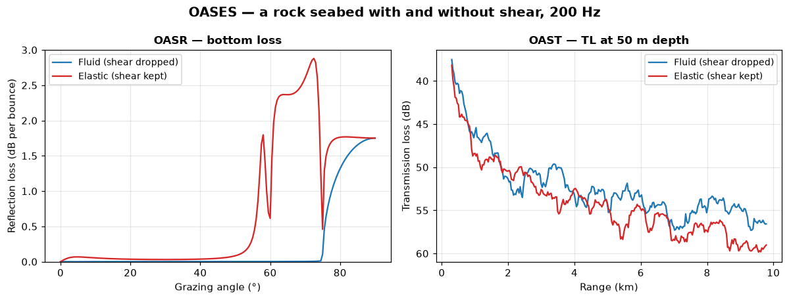
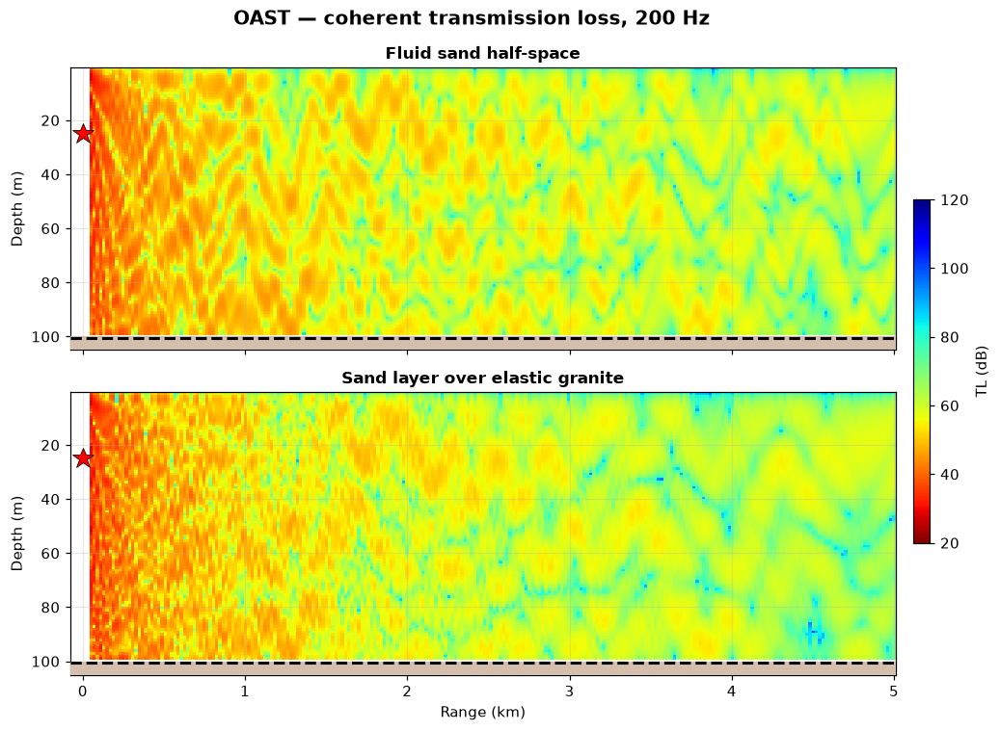
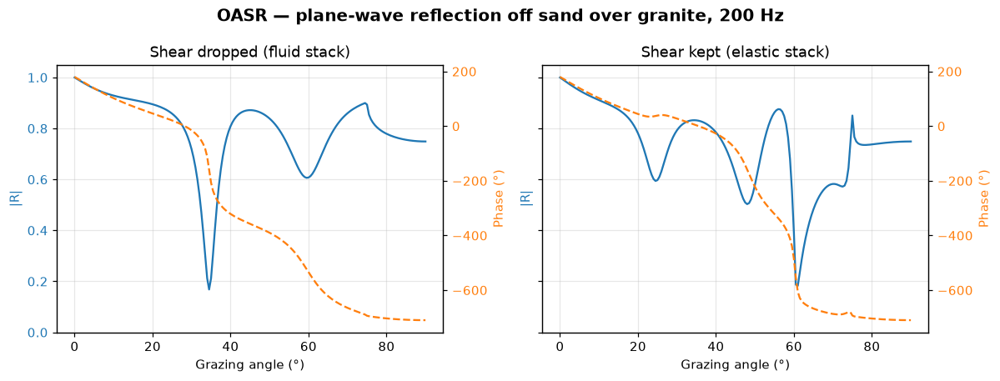
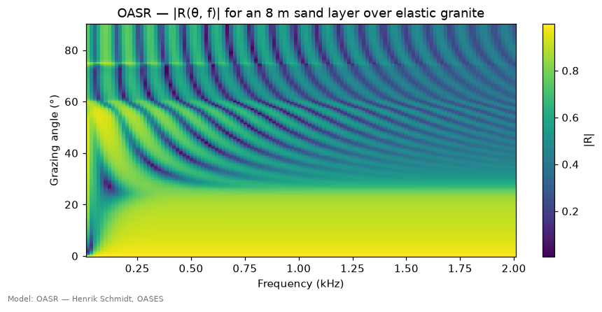
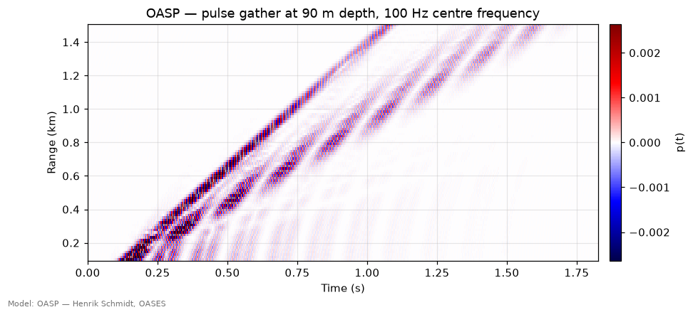
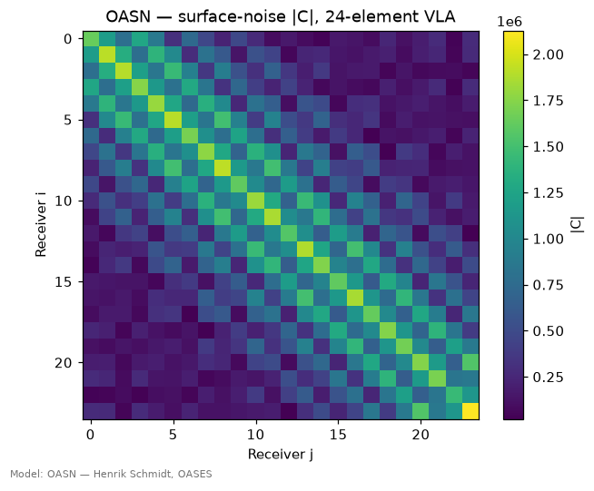
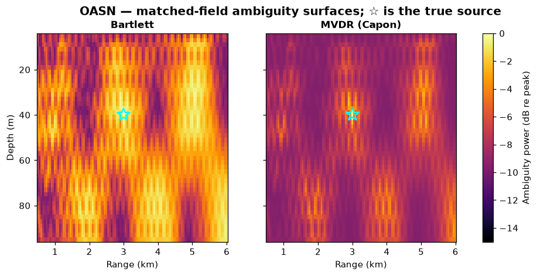

# OASES — seismo-acoustic wavenumber integration

> `uacpy.models.OAST` · `OASP` · `OASR` · `OASN` · wraps Henrik Schmidt's
> OASES (MIT) · **not redistributable — [see §9](#9-licensing-and-installation)**

OASES is the package's most complete seabed physics. It solves the full
**elastic** wave equation in a stratified medium: compressional *and* shear
waves in every layer, converting into each other at every interface, plus the
**Scholte** interface wave that lives on a fluid–solid boundary and nowhere else
(Rayleigh on a free solid surface, Stoneley between two solids). It is evanescent
in both media, so only sources and receivers within a wavelength or so of the
seafloor see it — and because it exists at every frequency, an elastic waveguide
never truly cuts off.
[Scooter](scooter.md) shares the method and also accepts elastic layers; what
only OASES gives you is the rest of the seismo-acoustic toolkit built on that
kernel — reflection coefficients that resolve `P-SV` conversion, per-interface
roughness, and the array covariance and matched-field replicas of `OASN`.

It is not one program but a suite, and uacpy wraps four of its executables —
they share an engine and an environment description, and differ only in what
they ask the engine for: [`OAST`](#5-oast--transmission-loss) for transmission loss,
[`OASP`](#7-oasp--pulses-and-broadband) for pulses,
[`OASR`](#6-oasr--reflection-coefficients) for reflection coefficients,
[`OASN`](#8-oasn--array-covariance-and-mfp-replicas) for array covariance and
matched-field replicas.

---

## 1. What it solves

OASES computes the exact field in a **horizontally stratified**
seismo-acoustic medium by wavenumber integration, the same method
[Scooter](scooter.md) uses.

Each layer's displacement potentials are expanded in horizontal wavenumber.
For a given `k_r`, the depth-separated wave equation has closed-form
solutions in every layer, and the layers are stitched together by imposing
continuity of displacement and stress at each interface. That gives the depth
Green's function `G(k_r, z)`; the field follows from the Hankel transform

```
p(r, z) = ∫ G(k_r, z) · J₀(k_r · r) · k_r dk_r
```

evaluated by FFT. Turning the Hankel transform into a Fourier transform means
replacing `J₀` by its large-argument asymptotic form — the *fast field*
approximation — which is accurate except at ranges shorter than a few
wavelengths and at very steep propagation angles. Subject to that, and to the
wavenumber sampling and the truncation of the `k_r` interval, there is no ray
approximation, no one-way approximation and no mode truncation: **the answer is
the answer**. That is why OASES and Scooter are the two models to reach for when
you need to check something — and why you should not do the checking at 50 m
range.

The physics that makes this worth paying for happens *inside* the solid
layers. A compressional wave hitting a solid interface at anything other than
normal incidence generates a shear wave, and that conversion is a **loss
mechanism** for the water-borne field — energy leaves and does not come back.
Fluid-approximate the seabed and it disappears entirely:



Left: the plane-wave bottom loss of a granite seabed, computed twice — once
with the granite's shear speed dropped (what `from_preset` hands you unless
you ask for `elastic=True`) and once kept. Below its compressional critical
angle, `arccos(1490/5500) = 74°`, the wave is evanescent in the fluid rock and
the granite's small `αp = 0.1 dB/λ` costs only ~0.0015 dB per bounce — near
enough a perfect mirror, though it is the small `α` that makes it so, not the
evanescence. The elastic rock leaks more than twenty times as much, ~0.04 dB,
because the evanescent *shear* field reaches further into the solid and `αs`
acts on all of it. Above ~55° the loss climbs by more than an order of
magnitude, peaking near fifty times the sub-critical level either side of the
shear critical angle `arccos(1490/3000) = 60°`, where a propagating shear wave
can be excited — but dipping at 60° itself, because no shear wave is excited
exactly at its own critical angle.

Right: the transmission loss that follows, averaged in intensity over 500 m so
you read the trend rather than the interference pattern. Hundredths of a dB
per bounce sounds like nothing until you count the bounces: a shallow-water
path reflects tens of times over 10 km, and the elastic answer ends up ~3 dB
darker. No amount of tuning a fluid model's attenuation reproduces the
*shape* of that curve, because the angular dependence is wrong.

**The price is stratification.** OASES is range-independent. Everything about
it — the closed-form layer solutions, the single Hankel transform — assumes
the medium varies only with depth. A sloping bottom or a range-varying SSP is
collapsed to one representative column, with a `UserWarning` naming what was
dropped. If your problem's range dependence matters more than its seabed
physics, use [RAM](ram.md) or [Bellhop](bellhop.md).

---

## 2. The four sub-models

| Class | `RunMode` | Returns | What it is for |
|---|---|---|---|
| `OAST` | `COHERENT_TL` | `Field` (`kind='tl'`) | Transmission loss over a depth × range grid |
| `OASP` | `COHERENT_TL` | `Field` (`kind='pressure'`) | Complex narrowband pressure |
| `OASP` | `BROADBAND` | `Field` (`kind='transfer_function'`) | `H(d, r, f)` across a band |
| `OASP` | `TIME_SERIES` | `Field` (`kind='time_series'`) | `p(d, r, t)` — a synthetic seismogram |
| `OASR` | `REFLECTION` | `ReflectionCoefficient` | `R(θ)` or `R(θ, f)` off the layer stack |
| `OASN` | `COVARIANCE` | `Covariance` | `C(f, i, j)` across array elements |
| `OASN` | `REPLICA` | `Replicas` | Array response per candidate source position |

They subclass a common `OASES` base, so `isinstance(model, OASES)` is true for
any of them, but `OASES` itself is abstract. To pick one by run mode:

```python
from uacpy.models import OASES, RunMode

model = OASES.for_mode(RunMode.REFLECTION)          # -> OASR
model = OASES.for_mode(RunMode.COHERENT_TL)         # -> OAST
model = OASES.for_mode(RunMode.COHERENT_TL, broadband=True)   # -> OASP
```

**OAST or OASP for transmission loss?** OAST writes only real TL in dB to its
`.plt` file — there is no complex pressure on disk, so there is no phase and
no way to interpolate cleanly through a sharp null. OASP writes complex
pressure to a `.trf`. Use OAST when you want a TL picture; use OASP when a
consumer needs phase — coherent array processing, or receiver ranges that do
not land on OAST's native FFT grid.

---

## 3. When to use it — and when not

**Use OASES when:**

- the seabed has **shear** — rock, consolidated sediment, ice — and you cannot
  honestly fluid-approximate it;
- the seabed is a **layer stack** and the layering matters (thin-layer
  resonance, a buried hard reflector);
- you want a **reference answer** with no ray, modal or one-way
  approximation in it;
- you have a **hydrophone array** and need the noise covariance or MFP
  replicas that go with it — OASN is the only model in uacpy that produces
  them.

**Reach for something else when:**

| Situation | Why OASES struggles | Use instead |
|---|---|---|
| Sloping bathymetry, range-varying SSP | Stratified solver; collapses | [RAM](ram.md), [Bellhop](bellhop.md) |
| You want ray paths or arrival stems | No geometry in the output | [Bellhop](bellhop.md) |
| You want the modes themselves | No modal decomposition | [Kraken](kraken.md) |
| Fluid seabed, high frequency (`D/λ ≳ 20`) | Wavenumber sampling grows with frequency; the ray answer is accurate here | [Bellhop](bellhop.md) |
| Only the boundary matters, and it is fluid or simply elastic | Overkill | [Bounce](bounce.md) |
| Commercial work | Licence — [§9](#9-licensing-and-installation) | [Scooter](scooter.md) for the fluid case |

---

## 4. Environment support

All four sub-models consume the same environment, and they all consume the
seabed the same way:

| Feature | Native? | Note |
|---|---|---|
| Layered bottom | ✅ | any number of layers, written verbatim |
| Elastic media (shear) | ✅ | **the reason this model exists** |
| Range-dependent bathymetry | ❌ | collapsed to `max` depth |
| Range-dependent SSP | ❌ | collapsed |
| Range-dependent bottom | ❌ | collapsed to the median column |
| Sea-surface altimetry | ❌ | dropped |
| Multiple source depths | ❌ | one source depth per run |

Collapse defaults, where they differ from the package-wide ones:

| Model | `ssp` | `bottom_range` |
|---|---|---|
| `OAST`, `OASP`, `OASN` | `'mean'` | `'median'` |
| `OASR` | `'r0'` (global default) | `'median'` |

OASR leaves the SSP alone because the water sound speed barely enters a
reflection coefficient; the layer stack is the whole answer. The layer stack
itself is **never** collapsed — `bottom_layers` stays intact for every OASES
sub-model.

### Keeping shear on the environment

`uacpy` drops shear by default when you build a seabed from presets, so that
the same `Environment` works with every model. Pass `elastic=True` to keep it:

```python
env = uacpy.Environment(
    name='Sand over granite (elastic)',
    bathymetry=100.0,
    ssp=[(0.0, 1500.0), (100.0, 1490.0)],
    bottom=uacpy.SeabedColumn.from_presets(
        layers=[('sand', 8.0)], halfspace='granite', elastic=True,
    ),
)
```

Without `elastic=True` the granite is a fast fluid: right compressional
speed, right density, no shear. That is a perfectly good approximation for
many problems, and it is what the shared `layered_elastic` scenario in
[`docs/figure_scripts/_common.py`](../figure_scripts/_common.py) uses. It is
not what you want from a page about OASES.

---

## 5. OAST — transmission loss

Every figure on this page comes from
[`docs/figure_scripts/oases.py`](../figure_scripts/oases.py) — the code below
is that code, so it cannot drift from what you see.

```python
import numpy as np
import uacpy
from uacpy.models import OAST, RunMode
from figure_scripts._common import shallow_water

env, source, receiver = shallow_water()
tl = OAST().run(env, source, receiver, run_mode=RunMode.COHERENT_TL)
tl.plot(env=env, source=source)
```



The top panel is the same 100 m channel at 200 Hz that the
[Bellhop](bellhop.md) and [Kraken](kraken.md) pages draw — flip between them
and you are comparing three methods on the same water, not three setups. The
bottom panel swaps in an 8 m sand layer over an elastic granite basement.
Same source, same receivers, same water column; the interference structure
inside 2 km is visibly finer, because the hard basement supports more trapped
paths, and beyond 3 km the median TL is ~1.5 dB darker as shear conversion
drains them.

`OAST` returns a **real-dB** `Field` (`kind='tl'`). Every other TL mode in
uacpy — including `OASP`'s — hands back complex pressure, so this is the one
result you cannot take a phase from. Use `OASP` when you need one.

---

## 6. OASR — reflection coefficients

`OASR` computes the plane-wave reflection coefficient of the layer stack
alone. No propagation, no source, no range axis — just `R(θ)`, or `R(θ, f)`
when you sweep frequency.

```python
from uacpy.models import OASR, RunMode

angles = np.linspace(0.0, 90.0, 181)
rc = OASR(angles=angles).run(env, source, receiver,
                             run_mode=RunMode.REFLECTION)
rc.plot(show_phase=True)
```



The same 8 m sand layer over granite, computed with shear dropped (left) and
kept (right). Both show the layer's own interference structure — the deep null
at 34.5° in the fluid case is the sand layer resonating, and it slides along
the angle axis if you change the thickness. Keeping shear rearranges the whole
pattern: the deepest null moves to 60.5°, essentially the granite's shear
critical angle (`arccos(1490/3000) = 60.2°`), and it now tracks the *shear
speed* rather than the layer thickness. Across 20°–60°, the angles that carry
energy in a shallow-water waveguide, the elastic seabed reflects markedly
less — `|R|` at 45° falls from 0.88 to 0.62.

Sweep frequency and the layer's resonances become a fan:

```python
rc = OASR(angles=angles).run(
    env, source, receiver, run_mode=RunMode.REFLECTION,
    frequencies=np.linspace(20.0, 2000.0, 120))
rc.plot()
```



`ReflectionCoefficient.plot()` switches from line to heatmap on its own when
the result is broadband. Read the picture as: above about 300 Hz and below the
sand's critical angle, `arccos(1490/1650) = 25.4°`, the stack is a near-perfect
mirror; past the critical angle each fringe is another half-wavelength fitting
into the 8 m layer, so the fringes crowd together as frequency rises. A seabed's
*thickness* is written all over its reflection coefficient, and that is what
geoacoustic inversion keys on.

The dark patch at the left edge is physics, not noise: below ~300 Hz the 8 m of
sand is thin compared with the wavelength, the wave reaches the elastic granite
beneath, and shear conversion there leaks hard even at sub-critical angles —
`|R|` falls to ~0.35 near 100 Hz where its high-frequency limit is ~0.95. A
homogeneous half-space has no length scale and would show none of this.

**OASR versus [Bounce](bounce.md).** Both return a `ReflectionCoefficient`.
Bounce comes from the Acoustics Toolbox and is what [Bellhop](bellhop.md)
calls automatically when it meets a seabed it cannot represent. On a **fluid**
seabed the two are interchangeable: over the shared sand half-space their
`|R(θ)|` differ by at most 0.0012 across the whole angle range, and by 0.005
over the fluid sand-over-granite stack — and there the disagreement is
concentrated on the flank of the null, where the two angle grids differ most.
Shear is where they part company, and where OASR earns its place — it carries
the same full elastic layer machinery as the rest of OASES, which BOUNCE has no
counterpart for: BOUNCE marches acoustic layers, so it takes shear only on the
bottom half-space. If the seabed has shear, do not assume the two agree to the
fluid tolerance; run both.

---

## 7. OASP — pulses and broadband

`OASP` runs the same wavenumber integration across a frequency sweep and
inverse-transforms it, which makes it uacpy's exact transient solver for a
stratified elastic medium.

```python
from uacpy.models import OASP, RunMode

source = uacpy.Source(depths=25.0, frequencies=100.0)
receiver = uacpy.Receiver(depths=90.0,
                          ranges=np.linspace(100.0, 1500.0, 96))

sample_rate = 800.0
t = np.arange(96) / sample_rate
t0 = t[len(t) // 2]
pulse = (np.sin(2 * np.pi * 100.0 * (t - t0))
         * np.exp(-((t - t0) ** 2) / (2 * 0.012 ** 2)))

ts = OASP(n_time_samples=512, freq_max=200.0).run(
    env, source, receiver, run_mode=RunMode.TIME_SERIES,
    source_waveform=pulse, sample_rate=sample_rate, output_duration=1.2)
ts.at(depth=90.0).plot()
```



Slicing the time-series `Field` at one depth leaves a `(range, time)` gather —
a synthetic record section. Each band is one multipath family, and they all
advance at roughly the water sound speed, so the bands run near-parallel; the
later ones are higher-order bounces, and the spread between first and last
arrival grows from about 0.28 s at 200 m to 0.66 s at 1.5 km. Pass
`stacked=True` instead of the default heatmap to draw it as offset traces, the
classic seismic waterfall.

`RunMode.BROADBAND` returns the transfer function `H(d, r, f)` without
synthesising anything. Slice it to a point and
`.plot_transfer_function()` / `.plot_impulse_response()` behave exactly as
they do for [Bellhop](bellhop.md). See
[broadband and time series](../guide/results.md) for how the two modes relate.

**On frequency grids.** OASP expresses its band as `(fmin, fmax, N)`, so it
always runs an *equispaced* sweep. In `TIME_SERIES` mode uacpy derives that
band from the source waveform's own spectrum and tells you what it picked;
pass `frequencies=` to pin it yourself. A non-equispaced `frequencies=` vector
is resampled onto `linspace(fmin, fmax, N)` with a warning, because the file
format cannot express anything else.

---

## 8. OASN — array covariance and MFP replicas

`OASN` is the sub-model with no counterpart anywhere else in uacpy. It models
an **array**, not a field, and it produces the two frequency-domain quantities
array processing runs on.

### Covariance — what the array measures

`RunMode.COVARIANCE` gives `C(f, i, j)`, the element-by-element cross-spectral
matrix, built from a noise field you specify: surface-generated noise, a deep
broad-area sheet, uncorrelated white noise per hydrophone, and any number of
discrete point sources.

```python
from uacpy.models import OASN

array = uacpy.Receiver(depths=np.linspace(20.0, 90.0, 24), ranges=0.0)
cov = OASN(surface_noise_level=60.0,
           white_noise_level=20.0).compute_covariance(env, source, array)
cov.plot()
```



The diagonal is each element's power. Off the diagonal is the vertical spatial
coherence of the noise field, and it does not simply decay — it oscillates with
separation. Normalised as `|C_ij| / √(C_ii C_jj)` and averaged over the element
pairs at each spacing, it runs 1.00, 0.64, 0.42 and 0.77 at 0, 3.0, 6.1 and
9.1 m, on a scale set by the 15 m wavelength, which is the checkerboard you see.
The normalisation matters here: this array's diagonal is not flat, so dividing
the first row by `C₀₀` instead gives a visibly different 1.00, 0.72, 0.48, 0.78. A noise field
with vertical structure looks nothing like the white `σ²I` a naive beamformer
assumes, and that difference is where array gain is won or lost — see
[array processing](../guide/arrays.md) for what to do with it.

### Replicas — what the array *would* measure

`RunMode.REPLICA` sweeps a grid of candidate source positions and, for each,
returns the array response. Those are matched-field templates.

```python
replicas = OASN(xmin=500.0, xmax=6000.0, nx=111,
                zmin=5.0, zmax=95.0, nz=46).compute_replicas(env, source, array)
```

The grid is a **constructor** argument, not a `run()` argument — like every
model knob in uacpy. Sweep it with `model.copy(nx=...)`.

### Matched-field processing

Contract a measured covariance against the replica field and you have located
the source. `Covariance` carries both standard processors:

```python
cov = OASN(
    white_noise_level=40.0,
    discrete_sources=[{'depth': 40.0, 'x': 3000.0, 'y': 0.0, 'level': 100.0}],
).compute_covariance(env, source, array)

bartlett = cov.bartlett(replicas)        # (n_freq, n_z, n_x, n_y)
capon = cov.mvdr(replicas)
```



Both surfaces peak on the true source — 3 km out, 40 m deep — but they are
not equally sharp. Bartlett is the matched filter: robust, and broad, with a
−3 dB main lobe spanning most of the range axis. MVDR (Capon) puts nulls on
everything that is not the replica, tightening the peak to about 2 km of range
at the cost of being far more sensitive to environmental mismatch. That is the
whole trade in MFP.

[`uacpy.sonar`](../guide/sonar.md) owns matched-field processing proper —
replica banks from any model, mismatch, broadband incoherent averaging. OASN
is where the replicas come from when you want them computed by a full elastic
model.

---

## 9. Licensing and installation

**OASES is not redistributable.** It is Henrik Schmidt's code, released under
an academic arrangement with no formal open licence, and uacpy neither bundles
nor ships the binaries. Every other engine in the package is installed by
`./install.sh`; OASES is downloaded from MIT and built locally, and only if
you ask:

```bash
./install.sh --oases yes
```

That fetches `oases.tar.gz` from
[acoustics.mit.edu](https://acoustics.mit.edu/faculty/henrik/oases.html),
verifies it, builds it, and installs the executables to `uacpy/bin/oases/`.

Constructing any OASES sub-model emits a one-time `UserWarning` naming the
licence and the citation. It is deliberate: **verify the terms yourself before
using OASES in commercial work.** For a fluid seabed, [Scooter](scooter.md)
solves the same wavenumber integral under a permissive licence.

If the binaries are absent, the **constructor** raises
`ExecutableNotFoundError` — not `run()`:

```
ExecutableNotFoundError: OAST executable not found: oast_bash

Searched in:
  • .../uacpy/bin/oases/oast_bash
  • .../uacpy/bin/oases/oast
  ...
```

which is the answer to "why does `OAST()` fail on a machine where Bellhop
works". Rerun `install.sh --oases yes`. uacpy prefers the `<name>_bash`
wrapper OASES ships and falls back to the bare binary, searching
`uacpy/bin/oases/`, `uacpy/bin/oalib/`, `uacpy/third_party/oases/bin/` and
finally `PATH`.

---

## 10. Constructor knobs

Everything is configured on the constructor; `run()` has a fixed signature.

**Shared by all four** — `executable`, `options`, `work_dir`, `cleanup`,
`timeout`, `verbose`, `use_tmpfs`, `collapse`.

`options` is the raw OASES option line. On `OAST` and `OASR` it *replaces* the
derived line, so passing it alongside a typed flag that would have contributed
a letter (`complex_contour`, `compute_contour`, `compute_depth_average`,
`reflection_type`) raises `ConfigurationError` rather than silently discarding
one. On `OASN` it is additive: the run mode's own letter (`N` for covariance,
`R`+`N` for replicas) is merged into whatever you pass.

**`OAST`**

| Name | Default | Meaning |
|---|---|---|
| `complex_contour` | `True` | The `'J'` option — complex integration contour. |
| `compute_contour` | `False` | `'C'`, range–depth contour output. |
| `compute_depth_average` | `False` | `'A'`, depth-averaged TL. |
| `integration_offset` | `0.0` | Wavenumber-contour offset (dB/wavelength). |
| `nw_samples` | `-1` | Wavenumber samples; `-1` lets OASES choose. |
| `plot_rmin`, `plot_rmax` | `None` | Range-axis bounds (m). |

**`OASP`**

| Name | Default | Meaning |
|---|---|---|
| `n_time_samples` | `4096` | FFT length; must be a power of two. |
| `freq_min`, `freq_max` | `0.0`, `None` | Sweep edges (Hz); `None` derives `2.5 × fc`. |
| `center_frequency` | `None` | Pulse carrier; defaults to `source.frequencies[0]`. |
| `range_start` | `None` | First receiver range (m). |
| `freq_output_increment` | `None` | Integrand-plot decimation; does **not** thin the `.trf`. |
| `integration_offset`, `nw_samples` | `0.0`, `-1` | As OAST. |

**`OASR`**

| Name | Default | Meaning |
|---|---|---|
| `angles` | `linspace(0, 90, 181)` | Angle grid, degrees. |
| `angle_type` | `'grazing'` | `'grazing'` (native) or `'incidence'`. |
| `reflection_type` | `'P-P'` | `'P-P'`, `'P-SV'`, `'P-Slow'` (Biot), `'transmission'`. |
| `angle_output_increment` | `None` | Decimate the output table. |
| `interface_roughness` | `None` | Per-interface RMS roughness (m), top → bottom. |

`'P-Slow'` selects the Biot slow wave, and **no uacpy carrier can express a
poro-elastic medium** — `SedimentLayer` and `BoundaryProperties` carry no
porosity, permeability, tortuosity, frame moduli or pore-fluid modulus — so the
option returns zeros at every angle rather than raising. `'P-SV'` also returns
zeros whenever the upper medium is a fluid, which is the correct answer: no SV
wave can be reflected back into it.

**`OASN`**

| Name | Default | Meaning |
|---|---|---|
| `surface_noise_level` | `0.0` | Surface-generated noise (dB re 1 µPa²/Hz); `0` disables. |
| `white_noise_level` | `0.0` | Uncorrelated per-hydrophone noise. |
| `deep_noise_level`, `deep_source_depth` | `0.0`, `None` | Deep broad-area sheet. |
| `discrete_sources` | `None` | List of `{'depth', 'x', 'y', 'level', 'phase'}`, metres. |
| `xmin`/`xmax`/`nx` | `None`/`None`/`50` | Replica grid in x (m); `None` → 100 m / 10 km. |
| `ymin`/`ymax`/`ny` | `None`/`None`/`1` | Replica grid in y (m); `None` → 0 / 0. |
| `zmin`/`zmax`/`nz` | `None`/`None`/`20` | Replica grid in depth (m); `None` → 10 m / `depth − 10`. |
| `c_low`, `c_high` | `None` | Phase-speed bounds for the integrations (m/s). |
| `offdb` | `None` | Contour offset; shares OASES' field with `integration_offset`. |

---

## 11. Gotchas

**OAST's native range grid.** OAST evaluates its Hankel transform on an FFT
grid of its own choosing, and writes only real TL in dB. If your
`receiver.ranges` do not land on that grid, uacpy interpolates **in dB** and
warns — which over-fills sharp interference minima, since a true −80 dB null
between −40 dB neighbours reads back around −50 dB. Read
`result.metadata['oast_native_ranges']` to see the grid, align to it, or use
OASP when null depth matters.

**Everything is single-source-depth and (for OAST) single-frequency.** A
multi-frequency `Source` on `OAST.run` raises `ConfigurationError` pointing at
`OASP`; a multi-depth `Source` raises on any OASES sub-model, telling you to
loop over `Source`s yourself.

**OASN ignores `receiver.ranges`.** OASN models a vertical array at
`x = y = 0`; only `receiver.depths` reaches the deck. Horizontal aperture is
expressed through the *replica* grid, not the receiver. Passing a non-zero
range warns, and `plot_rmin` / `plot_rmax` / `vrec` raise outright — OASN's
deck has no range axis and no receiver-velocity field to put them in.

**OASN noise levels are not on a common scale with discrete-source levels.**
They enter through different blocks of the deck, so the numbers are not
comparable: in the case on this page a `surface_noise_level=60.0` field puts
roughly 470× more power on the array than a discrete source at `level=100.0`,
which is enough to move the matched-field peak clean off the true source. When
you want a source-dominated covariance, background it with
`white_noise_level` and leave `surface_noise_level` at zero — then check the
eigenvalue spread of `cov.covariance[0]` before trusting the surface.

**`OASP` option letters that uacpy refuses.** `'V'`, `'H'`, `'R'`, `'U'`,
`'F'` request multi-component output that the `.trf` reader would flatten, and
`'O'` moves the frequency integration onto a complex contour that the
time-series synthesis cannot undo. Both raise rather than return a wrong
answer, as does a custom `options` string without `'J'` under automatic
wavenumber sampling, which enables the same contour by the back door. The
default `'N J'` keeps a **real** frequency axis (`OMEGIM = 0`) — deliberate
and correct, not an oversight.

**Option letters whose deck block uacpy never writes.** A separate class: the
letter is valid OASES, but setting its flag makes the program read a block the
writer does not emit, so the run dies inside Fortran on an `End of file` naming
only a line number. These raise a `ConfigurationError` naming the letter and the
block instead.

| Program | Letters | What the deck then demands |
|---|---|---|
| `OAST` | `E` | Patch-scattering parameters (`unoast31.f:299`) |
| `OASP` | `d` | The Doppler frequency line's `ISTYP VSOU VREC` (`unoasp22.f:127`) |
| `OASP` | `G` | Dispersion curves — `NMODES` plus two axis rows (`unoasp22.f:387-390`) |
| `OASP` | `Z` | Two velocity-profile plot-axis rows (`unoasp22.f:466-467`) |
| `OASP` | `E` | Patch-scattering parameters (`unoasp22.f:479`) |
| `OASN` | `Z`, `z` | Two velocity-profile plot-axis rows (`unoasn21.f:297-298`) |

`OAST` *does* write the velocity-profile block, so `'Z'` is supported there, and
its `'d'` (Doppler) frequency line carries `vrec`. `OASR` needs nothing uacpy
omits. Note the case distinction: on `OAST`, `'D'` is TL-vs-depth while `'d'` is
Doppler; on `OASN`, `GETOPT` accepts either case for the same flag.

**The layer stack survives, the range axis does not.** `bottom_layers` is
never collapsed for OASES, but a range-dependent bottom is reduced to its
median column. If both matter, you need [RAM](ram.md) with an `rams` backend
and you give up exact elasticity.

**Shear is opt-in on the environment.** `from_presets(...)` and
`from_preset(...)` drop shear unless you pass `elastic=True`. A "granite"
seabed that behaves like a fast fluid is usually this.

---

## 12. References

- Schmidt, H., *OASES Version 3.1 User Guide and Reference Manual*, Dept. of
  Ocean Engineering, MIT. LaTeX sources land in
  `uacpy/third_party/oases/doc/` when you install OASES — `oast.tex`,
  `oasp.tex`, `oasr.tex`, `oasn.tex` and `mfp.tex` document the input decks
  block by block.
- Schmidt, H. & Jensen, F. B., "A full wave solution for propagation in
  multilayered viscoelastic media with application to Gaussian beam reflection
  at fluid–solid interfaces", *JASA* 77, 813–825, 1985 — the SAFARI kernel
  OASES grew from.
- Schmidt, H. & Tango, G., "Efficient global matrix approach to the
  computation of synthetic seismograms", *Geophys. J. R. Astr. Soc.* 84,
  331–359, 1986 — the global-matrix layer solver.
- Schmidt, H. & Kuperman, W. A., "Estimation of surface noise source level
  from low-frequency seismoacoustic ambient noise measurements", *JASA* 84,
  2153–2162, 1988 — the noise field OASN builds.
- Baggeroer, A. B., Kuperman, W. A. & Schmidt, H., "Matched field processing:
  source localization in correlated noise as an optimum parameter estimation
  problem", *JASA* 83, 571–587, 1988 — the Bartlett and MVDR processors.
- Jensen, Kuperman, Porter & Schmidt, *Computational Ocean Acoustics*, 2nd
  ed., Springer, 2011 — chapter 4 for wavenumber integration, chapter 10 for
  matched-field processing.

---

**See also:** [Scooter](scooter.md) · [Bounce](bounce.md) ·
[Kraken](kraken.md) · [RAM](ram.md) · [SPARC](sparc.md) ·
[array processing](../guide/arrays.md) · [sonar and MFP](../guide/sonar.md) ·
[model index](README.md)
