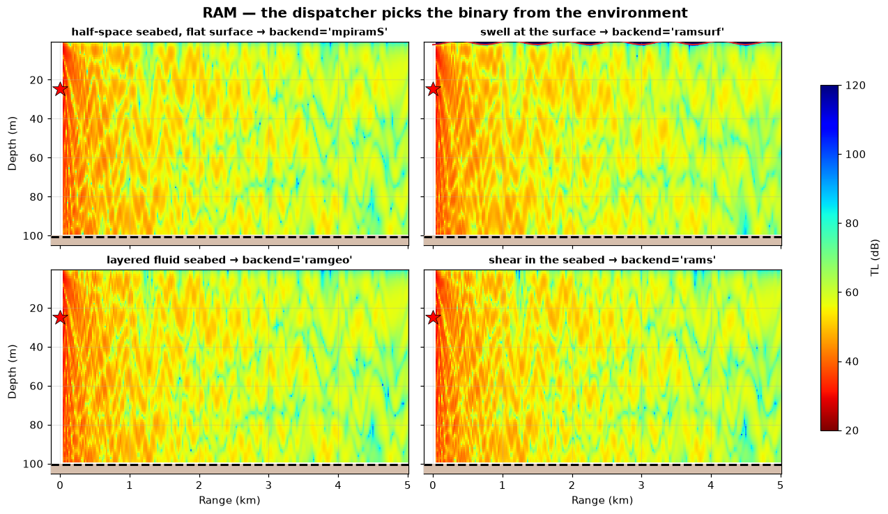
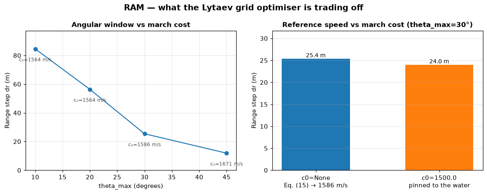
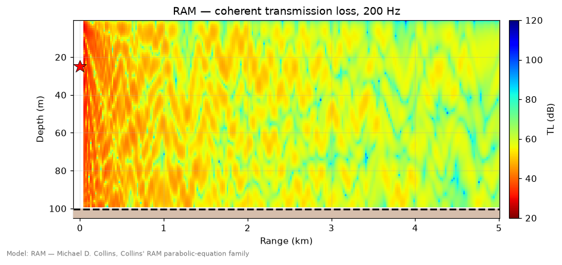
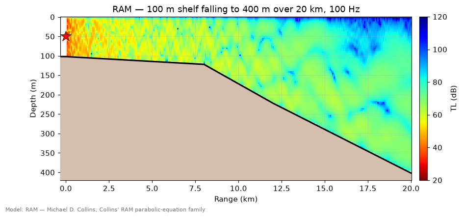
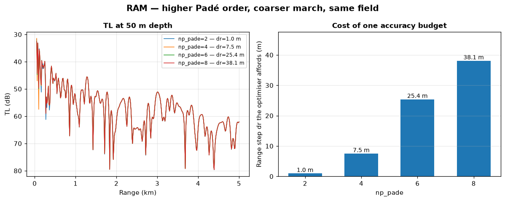
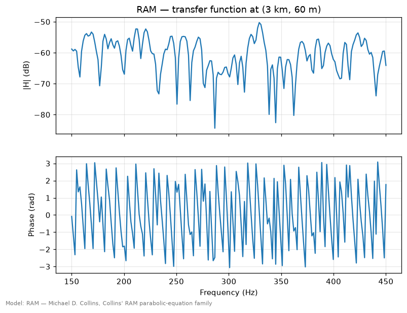

# RAM — the parabolic equation

> `uacpy.models.RAM` · wraps Michael D. Collins' RAM family of
> parabolic-equation codes
> · backends: `mpiramS`, `ramgeo`, `rams`, `ramsurf`

RAM is the model to reach for when the environment *changes with range* — a
shelf break, a front, a sediment wedge — and when the range is long enough
that a full-field solver would be prohibitive. It marches the field outward
one range step at a time, which makes range dependence free and back-scatter
impossible.

It is also the most intricate model in the package: one Python class fronts
four different Fortran binaries, and which one runs is decided by your
`Environment`.

---

## 1. What it solves

Strip cylindrical spreading out of the pressure and the far-field wave
equation factors into an outgoing operator and an incoming one. The
**parabolic approximation** is the decision to keep only the outgoing factor:

```
∂p/∂r = i k₀ √(1 + X) · p        X = k₀⁻² [ ρ ∂/∂z (ρ⁻¹ ∂/∂z) + k² − k₀² ]
```

where `k₀ = ω/c₀` is a reference wavenumber and `k = ω/c(r, z)` the local one.

That factorisation is exact only where the medium is range-independent. There
`∂/∂r` and `√(1 + X)` commute and the product of the two factors reproduces the
wave equation. Where the environment changes with range they do not commute,
and the product leaves behind an extra term in the commutator
`[∂/∂r, √(1 + X)]` that the PE simply drops. So three approximations sit under
the equation above — the far field, a negligible commutator, and negligible
back-scatter — and the last two together are what "weak range dependence"
means (Jensen et al., *Computational Ocean Acoustics*, §6.2.2).

This is a one-way, forward-scattering wave equation. Three consequences follow,
and they are the whole character of the model:

- **It is first order in range, so you march it.** Step from `r` to `r + dr`
  using the environment *at that range*. Nothing is solved globally, there is
  no eigenvalue problem, and a bathymetry that changes every step costs
  nothing extra. Cost scales as (Padé terms) × (range steps) × (depth points)
  — Lytaev's `O(p/(Δr·Δz))`.
- **Energy that travels backwards is discarded.** There is no back-scatter
  off a steep slope, a seamount face or a buried scatterer, and no
  reverberation. If the answer depends on returning energy, RAM is the wrong
  model — see [Scooter](scooter.md) or [OASES](oases.md).
- **Slopes cost amplitude, not just back-scatter.** A naive one-way march has
  amplitude errors of order decibels on slopes of only a few degrees, and that
  error is *not* the missing back-scattered field. RAM marches Collins'
  energy-conserving variable `p̃ = p/α` with `α = (ρ/k)^½`, which conserves
  energy flux across the vertical interfaces between range-independent
  regions. It is structural rather than a flag, and it is what makes the shelf
  figure in §8 work.

### Padé approximants and wide angles

The formal solution of that equation over one range step is an exponential of
the square-root operator, which you cannot apply directly. Collins' **split-step
Padé** solution replaces the whole exponential with a rational function of `X`:

```
p(r + Δr, z) = exp(i k₀ Δr) · Πⱼ (1 + αⱼ X) / (1 + βⱼ X) · p(r, z)     j = 1 … p
```

`p` is `np_pade` (2–10, default 6), and the complex coefficients `αⱼ, βⱼ` come
from accuracy and stability constraints on the rational function. The family is
wide-angle from its very first term: at one term the split-step Padé reduces to
the Crank–Nicolson solution of the rational-linear PE, which is Claerbout's
equation — what Jensen et al. call the standard 40° PE, good to about ±35° at a
phase-error tolerance of 0.002. Each extra term widens the angular window over
which the rational function tracks the true propagator: the Padé series for the
square root reaches ±55° at two terms and ±75° at five on that same tolerance,
and nearly the full ±90° of forward propagation beyond it (Jensen et al.,
*Computational Ocean Acoustics*, Fig. 6.1). The default of six is Collins' own
working order — it reproduces a mode set reaching 74° off the horizontal to
plotting accuracy, where four terms visibly drift (Collins & Siegmann, *Parabolic
Wave Equations with Applications*, Fig. 2.6).

The classical **narrow-angle** PE — the one accurate only within roughly ±10–15°
of horizontal — is the Taylor approximation `√(1 + X) ≈ 1 + X/2`, and is not a
member of this family at all.

Because the approximation is applied to the *step* rather than to the square
root, the same coefficients also absorb the range-integration error, which is
what lets you take a **much larger range step** for a given accuracy. The
angular figures above are not free of it: at a fixed order the aperture the
march actually delivers shrinks as the step grows, so order, step size and
angle are a single trade rather than three independent ones.

That trade is the single most important thing to understand about RAM's
numerics, and it is what `theta_max` controls: you declare how wide an angular
window the answer needs, and the grid optimiser prices it.

**The validity condition is the one-way assumption**, not `D/λ`. There is no
frequency below which RAM stops being valid the way the ray approximation
does — only a grid that gets finer, and a march that gets more expensive, as
frequency rises. What RAM will not tolerate is a feature that reflects energy
back toward the source, or physics that lives outside the angular window you
asked for.

---

## 2. When to use it — and when not to

**Use RAM when:**

- the environment is **range-dependent** — bathymetry, sound speed, seabed, or
  all three — and you want that dependence solved rather than segmented;
- the range is **long**: a march is linear in range where a modal or spectral
  solver is not;
- the seabed is **layered**, or carries **shear**, or the surface has
  structure — RAM has a backend for each;
- you are at **low frequency in shallow water**, where the ray approximation
  has failed but you still need range dependence — [Bellhop](bellhop.md) is
  out, [Scooter](scooter.md) is stratified, and [Kraken](kraken.md) can only
  segment the track and approximate the coupling between segments.

**Reach for something else when:**

| Situation | Why RAM struggles | Use instead |
|---|---|---|
| Back-scatter, reverberation | The PE is one-way by construction | [Scooter](scooter.md), [OASES](oases.md) |
| You need ray paths or arrivals | RAM produces a field, not geometry | [Bellhop](bellhop.md) |
| You need the modes | No modal decomposition | [Kraken](kraken.md) |
| Reference-grade accuracy check | The PE is an approximation; a wavenumber integral is not | [Scooter](scooter.md), [OASES](oases.md) |
| Fast shear seabed (rock) | `rams` needs a hand-pinned `dz` — see [Gotchas](#9-gotchas) | [OASES](oases.md), [Scooter](scooter.md) |
| Water-column volume absorption | No RAM backend consumes it | [Bellhop](bellhop.md), [Kraken](kraken.md) |
| Several source depths at once | One `(zs, f)` per march | loop over `Source`s |

---

## 3. Environment support

| Feature | Native? | Note |
|---|---|---|
| Range-dependent bathymetry | ✅ | every backend; this is the point of the model |
| Range-dependent SSP | ✅ | one profile section per range break |
| Range-dependent bottom | ✅ | including a range-dependent layer stack |
| Layered bottom | ✅ | `ramgeo` and `ramsurf` both track the layers *parallel to the bathymetry* |
| Sea-surface altimetry | ✅ | `ramsurf` only |
| Elastic media (shear) | ✅ | `rams` only; the **top** sediment layer must itself carry `shear_speed > 0` — a fluid layer over an elastic half-space is refused (see [§4](#forcing-a-backend)) |
| Multiple source depths | ❌ | raises; loop over `Source` |
| Source beam pattern | ❌ | raises; the march starts from Collins' self-starter, which is omnidirectional — use [Bellhop](bellhop.md) or [Kraken](kraken.md) |
| Water-column volume attenuation | ❌ | `env.absorption` is ignored, with a `UserWarning` |
| Non-vacuum surface (rigid, fluid or elastic ice) | ❌ | collapsed to vacuum with a `UserWarning` naming the kind; every backend hard-codes a pressure-release surface and no deck carries a surface record |
| Rigid / vacuum / tabulated-reflection seabed | ❌ | raises `UnsupportedFeatureError` — the RAM decks express the seabed only as fluid geoacoustic layers, and the domain floor at `zmax` is an **absorbing layer**, not a Neumann wall |

See [collapse policy](../guide/environment.md) for what "collapsed" means and
how to control it.

---

## 4. The backend dispatcher

`RAM` is a façade. At `run()` time it inspects the environment and picks one
of four vendored binaries:

| Environment | Backend | What it is |
|---|---|---|
| fluid seabed, flat surface, half-space or broadband | `mpiramS` | Dushaw's Fortran 90/95 rewrite of RAM, with a native broadband Q/T loop; seabeds slower than the surface water (soft mud) are supported |
| fluid seabed, flat surface, **layered**, narrowband | `ramgeo` | Collins' RAMGeo — sediment layers parallel to the bathymetry |
| **any** `shear_speed > 0` in the seabed | `rams` | Collins' RAMS elastic PE (rotated Padé) |
| `env.altimetry is not None` | `ramsurf` | Collins' rough-surface / beach-geometry PE |
| elastic seabed **and** altimetry | — | `UnsupportedFeatureError` |

The order matters: elasticity is tested before roughness, and the layered-vs-
half-space split only applies once fluid and flat has been established. The
last row is a genuine gap — no published Collins PE handles shear and a
variable surface together, and uacpy says so rather than quietly dropping one
of them.

You can inspect the choice without running anything:

```python
>>> RAM().select_backend(env)
'mpiramS'
```

### Forcing a backend

`RAM(backend='rams')` and friends override the dispatch — but the choice is
still validated against the environment, and **an unsupported combination
raises instead of silently degrading**:

```
RAM(backend='mpiramS') is a fluid PE and cannot model the elastic bottom
(shear>0) in this environment. Use backend='rams', or backend=None for
automatic dispatch.
```

The five rules, all `ConfigurationError`:

| Forced | Environment | Why it is refused |
|---|---|---|
| `mpiramS` / `ramgeo` / `ramsurf` | elastic seabed | fluid PEs; shear would be dropped |
| `mpiramS` / `ramgeo` / `rams` | `env.altimetry` set | they model a flat pressure-release surface |
| `ramsurf` | flat surface | its defining feature is absent |
| `rams` | fluid seabed | its shear machinery degenerates and it returns a **null field** — no energy anywhere — rather than failing |
| `rams` (forced **or** auto-dispatched) | top sediment layer with `shear_speed=0` over an elastic stack | `rams0.5.f:593-600` divides by the shear modulus of the first sediment node below the seafloor, so a fluid top layer makes every sample NaN — no `dz`, `np_pade` or `theta` choice changes it |

The fourth is the reason the rule exists in both directions: a backend
whose defining feature is missing does not fall back gracefully. The fifth
is the one you will meet by accident: `SedimentLayer` defaults to
`shear_speed=0`, so "sediment over rock" written as a fluid layer over a
sheared half-space is an elastic environment (it dispatches to `rams`) that
`rams` cannot march. The two ways out are named in the error: give the top
layer a shear speed, or zero every shear so the layered fluid PE (`ramgeo`)
runs. A zero-shear layer *deeper* in the stack is fine — the solid-layer
rows only difference the modulus and never divide by it.

### Seeing the dispatch



Four environments over the same water, the same source and the same receiver
grid. The bottom two differ only by `elastic=`: identical geoacoustics, but
declaring shear moves the run from the layered fluid PE onto the elastic one.
The two fields agree to 0.2 dB in median level but differ by 1.3 dB sample by
sample (mean `|Δ|`; median 0.8 dB) — a shifted interference pattern, not a
level offset.

---

## 5. Run modes

```python
from uacpy.models import RAM, RunMode
```

| `RunMode` | Returns | What you get |
|---|---|---|
| `COHERENT_TL` | `Field` | complex pressure on a (depth, range) grid |
| `BROADBAND` | `Field` | `H(d, r, f)` transfer function |
| `TIME_SERIES` | `Field` | `p(d, r, t)` |

Default is `COHERENT_TL` — always. Unlike Bellhop and Kraken, RAM does **not**
switch to `BROADBAND` when you hand it a frequency vector: a multi-frequency
`Source` with `COHERENT_TL` raises, telling you which mode you wanted, and a
`run(frequencies=…)` argument on `COHERENT_TL` is **ignored with a warning**
(it only means something on `BROADBAND` / `TIME_SERIES`, where it overrides
`source.frequencies` for that call).

There is no `INCOHERENT_TL`: the PE marches a complex field, and there is no
independent set of paths to sum intensities over.

Every mode works on every backend. `mpiramS` sweeps frequency inside the
Fortran; the Collins binaries are single-frequency codes driven by a
Python-side loop over uacpy's patched complex-envelope output (see
[`MODIFICATIONS.md`](../../uacpy/third_party/MODIFICATIONS.md)). Auto-dispatch
sends broadband work to `mpiramS` when it can, because the in-process sweep
shares its setup across the band.

### The `(fc, Q, T)` band

Neither `mpiramS` nor the Collins codes accept an arbitrary frequency list.
Their sweep is parameterised as

```
band = fc · [1 − 1/Q,  1 + 1/Q]          Δf = 1/T
```

so uacpy derives `(fc, Q, T)` from a **uniformly spaced** `frequencies` array —
`fc` is anchored on an actual array bin (the upper-middle one),
`Q = fc / half-width`, `T = 1/Δf` — and warns that it did. The sweep the
binary marches can overshoot the request by a bin, but the returned `H(f)` is
trimmed to carry **exactly the frequencies you asked for**, bin for bin. Pin
both `Q=` and `T=` on the constructor — and pass a single `fc` — to take
control and silence the warning (with both pinned, the sweep *is* the spec:
a frequency array then contributes only its centre bin, and uacpy warns of
that too); non-uniform spacing raises. Left unset, the defaults are `Q=1e6,
T=1.0` for `COHERENT_TL` (which collapses the band to one bin, so a narrowband
call does not sweep hundreds of frequencies); on the broadband paths they are
resolved from the source — see the `Q` and `T` rows of [§7](#7-constructor-knobs).

---

## 6. The grid: what `dr=None` actually does

Leaving `dr` and `dz` unset hands the grid to the **Lytaev (2023) mesh
optimiser**, which picks the coarsest `(dr, dz)` whose accumulated single-step
Padé error stays under `accuracy` over the whole marched range. The error is
scored on the **accuracy band** of the spectral variable `ξ = (k_r/k₀)² − 1`:
the water column, widened to contain `c0`, out to the wider of `theta_max` and
the seabed's *critical angle* — every component that carries energy to the far
field. A 2400 m/s rock traps modes out to 51° whatever aperture you named, and
scored on the 30° aperture alone it read *better* than sand while measuring
3 dB rms worse at 1–5 km. The rest of the medium's `inf c … sup c` hull is a
**stability band** on which the operator is only held non-amplifying; scored
for accuracy too, a granite basement put the branch point `ξ = −1` inside the
interval and every grid was refused. It needs three things from you, and all
three have defaults:

| Knob | Default | What it means |
|---|---|---|
| `accuracy` | `None` | budget on the single-step Padé error accumulated over the march; unset → `1e-3`. Naming it explicitly also promotes "budget not met" from a log line to a `UserWarning` |
| `theta_max` | `30.0` | the widest propagation angle the spectrum must represent |
| `c0` | `None` | the PE reference speed; `None` → Lytaev **Eq. (15)** on the accuracy band |

`c0` deserves a note: it is the *algorithmic* expansion point — the speed
factored out as `exp(i k₀ r)` — not a physical input. Eq. (15) chooses the `c0`
that centres the accuracy band around zero: 1591 m/s on 1500 m/s water over
sand, 2047 m/s over granite, where the trapped-mode end of the band binds.



Both panels come from the same 100 m channel (1490–1500 m/s water over
1650 m/s sand) at 200 Hz over 5 km. Widening `theta_max` from 10° to 45° costs
a factor of seven in range step, because the rational approximation has to
stay accurate over a wider angular window — and `c0` moves with it, since
Eq. (15) centres the band for the angle you asked for; below about 19° the
trapped modes set the band's steep end instead, so 10° and 15° get the same
grid. On this slow seabed the `c0` rule is nearly moot — 25.4 m against 24.0 m
pinned to the water speed; it earns its keep on the fast ones.

**What the score is, and what it is not.** The logged *predicted error* is
`τ·n_steps`: a bound on the accumulated error of the *steepest* scored
component. Measured against Kraken on a 9 × 19 receiver grid to 5 km (sand,
silt and rock half-spaces at 100–200 Hz) the field error is 3–10× below it,
because the steepest trapped modes carry the least energy. It does not cover
the **near field** — components steeper than the band are damped or garbled at
the chosen `dr` rather than propagated, which on the sand channel at 200 Hz
(mpiramS, which marches onto every receiver range) leaves the field wrong out
to about **15 range steps** and exact to three digits beyond; widening the band
to `c0` is what keeps `dr` at 25 m there rather than the 57 m the water column
alone would license — nor the **seafloor interface**, whose position to a
fraction of a cell sets the trapped modes on a fast seabed (granite at 200 Hz,
`dz = λ/250`: 3.3 dB rms from Kraken with the seafloor on a node, 1.8 a
quarter cell below it, 1.3 mid-cell), which is why the grid places it
(constraint 2 below, and [§9](#9-gotchas)). The grid line
also reports the stability band's growth (`max |P/Q| − 1` per step outside the
accuracy band), 1e-15 to 1e-10 on every case tried.

### What the optimiser is not allowed to do

Five constraints are applied *after* the optimiser has spoken, because its
error model does not know about them:

1. a **`dz` floor** of `λ_p/16`, the depth-grid cost floor — where the depth
   search *starts*, not where it stops. When the seabed traps modes the
   floored grid cannot carry (trapped-mode score at or above 1, see below),
   `dz` is refined from the floor to the coarsest value that scores under 1,
   within the 10 000-point depth budget (`MAX_DEPTH_POINTS`); sand, silt and
   a sloping sand wedge pass on the floored grid and keep it. On `rams` a
   **`dz` cap** of `λ_s/14` also applies, so the shear wavelength stays
   resolved;
2. **seafloor placement in its cell** (`SEAFLOOR_CELL_OFFSET`): the
   *shallowest* seafloor depth is put a quarter of a cell below its last
   water node, `h/dz = n + 0.25`, on mpiramS, ramgeo and ramsurf (`rams`
   keeps it on the node, where its fluid–solid interface rows sit). Those
   codes take nodes `1..iz` as water and split the properties between `iz`
   and `iz + 1`, so an on-node seafloor has its Galerkin interface half a
   cell too deep; the quarter cell is measured, not derived — on every grid
   the automatic path marches, the node is never the best placement (sand
   at 200 Hz on the λ/16 grid: 1.0 dB rms far-field error on the node, 0.3
   a quarter cell down, 0.7 mid-cell; rock at 200 Hz on its λ/64 grid: 2.5 /
   1.1 / 2.8). The shallowest column has the fewest water points, so its
   placement costs most (`env.depth` is the deepest, and only coincides on
   flat bathymetry);
3. a **`dr` tightening on `rams`** — `rams_dr_safety_factor` (default 5×) and
   an independent `dr ≤ c_min/(5f)` cap, whichever is tighter. With the
   default `rams_irot=1`, `rams0.5` does not march the split-step Padé
   exponential the optimiser scores: its `rpade` builds Crank-Nicolson
   coefficients and the march is a Crank-Nicolson step in range of the
   rotated square root — second-order in `dr`, with real amplification
   (`|G| = 1.028` on the propagating band at the Lytaev `dr` of 2.46 λ on a
   1500/1800 case, where the march diverges; 0.41 / 2.45 / 14.1 dB rms
   against `krakenc` at 0.2 / 0.6 / 1.8 λ). The λ/5 cap is that operator's
   truncation requirement, and the "predicted error" logged for a `rams`
   grid is labelled as the split-step score it is, not this march's error;
4. a **10 000-point cap** on the depth grid, purely to keep runtimes sane;
5. on the **Collins backends, an output-stride cap**: those binaries write the
   field only every `ndr·dr` and the receiver modulus is interpolated between
   writes, so both the automatic `dr` and `ndr` are held so that stride
   samples the modal beat `2π/Δk` (`Δk = 2πf (1/c_min − 1/c_max)` over the
   medium) six times per period — 20 m on sand at 200 Hz, 1.7 m on granite; a
   pinned `dr` is yours. Measured on ramgeo at 200 Hz over 5 km of the sand
   channel (beat 120 m, receivers beyond 1 km, against the same backend at
   `dr = 1 m`): 3.7 / 1.9 / 0.6 / 1.0 / 0.5 / 0.2 % relative field error at
   `stride/beat` = 0.33 / 0.25 / 0.22 / 0.17 / 0.12 / 0.08, and 0.0 % on
   mpiramS, which marches onto every receiver range.

One thing that is *not* on that list, and used to be: a cap on `dr` at the
output-range spacing. mpiramS marches onto each requested range rather than
writing on a fixed stride, and a bug in its step-shrink test used to send a
step longer than the gap past the range it was aiming at, then walk it back
onto it with a forward propagator. That is fixed in `ram.f90` itself (see
`third_party/MODIFICATIONS.md`), so **on mpiramS `dr` is the longest step the
march takes, not the step it takes everywhere**: a leg shorter than `dr` is
marched in one step of that leg's length, and the effective step is
`min(dr, leg)`. Nothing overshoots at any `dr` on any output grid, so nothing
needs to cap `dr` against the receivers — which is just as well, since the
shortest gap has no lower bound, and a legal 2 mm receiver pair sized a
5 000 000-step march to 10 km.

Any of these can push the delivered grid above the accuracy you asked for. If
you pinned `accuracy` yourself you get a `UserWarning`; if you left it at the
default it is logged at `verbose='info'` instead, because the stability floor
binds on essentially every ordinary run and a warning there would be noise.

If no grid is feasible at all, uacpy triples `ε` while the next rung stays at
or below 0.5 (from the default `1e-3` the last rung tried is 0.243) and then
steps `theta_max` down 30° → 20° → 15°, restarting the `ε` ladder each time,
before giving up with a `ConfigurationError`. An `ε`-only relaxation is
routine at and above ~500 Hz — the ladder's own 0.01 m end forces it over a
few km, and the marched `dz` is then the floor anyway — so it follows the
floor's policy: a log line at the default `accuracy`, a `UserWarning` when you
pinned one. Narrowing `theta_max` changes the physics you asked for and always
warns, naming the step. Either message quotes the returned grid's own
predicted error; a value at or above 1 is labelled *not resolved by the
model*, because the score saturates there and ranks nothing. The refusal
itself tells you how to converge a pinned grid by hand — see
[§9](#9-gotchas), *a very fast basement*.

**A fast seabed gets its `dz` refined, and a warning only where the budget
stops it.** When the accuracy band reaches the critical angle (a seabed faster
than the water and steeper than `theta_max`), the steepest scored component is
a trapped mode that carries the far field, and the λ/16 floor cannot resolve
it: rock (51°) scores 8 at 100 Hz and 16 at 200 Hz on the floored grid,
measured 2.8 and 6.3 dB rms from Kraken at 1–5 km, where sand's steepest
trapped mode (20°) scores 0.44. A score at or above 1 (`TRAPPED_MODE_SCORE_LIMIT`)
means the mode's phase is lost over the march — the answer is wrong, not
"about a decibel" — so the automatic `dz` is refined from the floor to the
coarsest value that scores under 1 at the chosen `dr`, and the seafloor is
placed a quarter cell below its node (constraints 1–2 above). Measured on the
100 m channel, 9 × 19 receivers to 5 km, mpiramS, rms dB from Kraken over all
columns / beyond 1 km:

| seabed | f | floored grid (λ/16, on-node) | refined grid | wall |
|---|---|---|---|---|
| rock 2400 m/s | 100 Hz | 2.8 / 3.0 | **0.8 / 0.8** (λ/45) | 0.3 → 0.7 s |
| rock | 200 Hz | 6.3 / 6.8 | **1.4 / 1.1** (λ/64) | 0.3 → 0.9 s |
| granite 5500 m/s | 100 Hz | 5.0 / 5.4 | **0.8 / 0.8** (λ/108) | 0.6 → 1.7 s |
| granite | 200 Hz | 7.4 / 7.6 | **1.5 / 1.6** (λ/162) | 0.7 → 3.0 s |
| sand 1600 m/s | 200 Hz | 1.2 / 1.0 | 0.8 / 0.3 (λ/16 kept, placed) | 0.3 s |

The refinement stops at the `MAX_DEPTH_POINTS` budget (10 000 points over the
shallowest water column): past it the grid marched still cannot carry the mode,
and that — like a pinned grid that cannot — raises a `UserWarning` at the
default `accuracy` naming the `dz` the mode needs, its point count and the
budget. Granite at 200 Hz needs `dz ≈ λ/162`, which 400 m of water holds and
600 m does not.

**How far from converged does the default actually land?** Far enough to matter
in shallow water, and the `dz` floor is most of what is left. On a 200 m / 25 Hz
pressure-release waveguide, measured against a closed-form Dirichlet modal sum
that Kraken reproduces to 0.014 dB:

| grid | `dr` | `dz` | median &#124;ΔTL&#124; | wall |
|---|---|---|---|---|
| default | 305.8 m | 3.77 m (`λ/16` floor) | 2.13 dB | 0.8 s |
| `dr=25, dz=0.25` | 25 m | 0.25 m | 0.011 dB | 11 s |

The engine is capable of 0.011 dB on that problem; the default grid is nearly
200× coarser in accuracy and 14× cheaper, and **nothing warns** — the floor
binds on essentially every ordinary run, so warning on it would be noise. Most
of the gap is the 305.8 m step itself: pinning `dr=150` on the default `dz`
gives 1.70 dB, so the optimiser's `dr` is worth about 0.4 dB here on its own.

The shortfall is not a low-frequency corner: under a geometry scaled by water
depth the error tracks `f·H`, so 100 Hz in 200 m of water behaves like 25 Hz in
800 m. In deep refracting water (3000 m, 25 Hz, 60 km) the default sits 0.78 dB
from a converged grid.

**Where the default really is safe is narrower than a mode count suggests**, and
it is set by `kH/π = 2fH/c`, the number of trapped modes:

| `kH/π` | `f·H` (at 1500 m/s) | source at `H/2` | source at `0.3H` |
|---|---|---|---|
| 1.87 | 1400 | — | 0.06 dB |
| 2.13 | 1600 | — | 10.96 dB |
| 2.67 | 2000 | 0.04 dB | 3.19 dB |

**The safe corner is `kH/π < 2`, i.e. `f·H < c` (1500 Hz·m), for an ordinary
source depth** — below it a single mode propagates and there is no interference
to get wrong. A mid-depth source looks good far past that only because it
excites the odd modes alone: its own step is at `kH/π = 3` (`f·H = 3c/2 = 2250`
Hz·m), where the second odd mode appears. Do not read a mid-depth-source result
as the general case — at `f·H = 2000` the same waveguide is 0.04 dB with the
source at `H/2` and 3.19 dB with it at `0.3H`.

**If you need better than half a decibel in shallow water, pin `dz`** — the
floor is where the depth search starts, and only the trapped-mode check
refines it. The `accuracy` budget will not do it for you: it is advisory, and
the floor is applied after it. When you pin `dz`, keep `h/dz = n + 0.25` on the
fluid backends (`n + 0` on `rams`): a pinned value places the seafloor wherever
it falls, and the placement is worth up to 3 dB on a fast seabed (constraint 2).

**The optimiser never looks at range dependence, and this one can bite.** Its
error model is stratified: frequency, the slowest and fastest speed anywhere,
the maximum range, the angle and the accuracy budget — and nothing about how
fast the environment changes along the track. Collins is explicit that the size
of the smallest range-independent region is an upper bound on `dr`. On the
Collins backends the deck writer enforces it — an automatic `dr` is bounded by
the closest pair of profile-section, bathymetry or altimetry markers, and a
pinned `dr` coarser than that spacing is reduced to it with a warning —
because those binaries consume
at most one marker per step: over a bathymetry broken every 10 m at 25 Hz the
optimiser alone returned `dr = 318.8 m` and the field landed 8.9 dB from the
converged answer at its worst point, where `dr = 10 m` recovers it to 0.06 dB.
mpiramS interpolates its environment instead of consuming it, so nothing
bounds `dr` there. **If your bathymetry or profile breaks are spaced more
finely than the `dr` you get back on mpiramS, pin `dr` yourself.**

The grid that actually ran is on the result:

```python
tl.metadata['dr'], tl.metadata['dz'], tl.metadata['pe_reference_speed'], tl.metadata['zmax']
```

---

## 7. Constructor knobs

Everything is configured on the constructor; `run()` has a fixed signature.
Knobs tagged with a backend are ignored elsewhere — and uacpy warns when you
override one the selected backend cannot read.

**Grid and accuracy**

| Name | Default | Meaning |
|---|---|---|
| `dr` | `None` | Range step (m). `None` → Lytaev optimiser. |
| `dz` | `None` | Depth step (m). `None` → optimiser, floored at `λ/16`, refined for the trapped modes, placed in its cell. |
| `zmax` | `None` | PE domain depth (m). `None` → seafloor + absorbing layer. |
| `c0` | `None` | PE reference speed (m/s). `None` → Lytaev Eq. (15). |
| `accuracy` | `None` | Optimiser error budget; unset means `1e-3`. |
| `theta_max` | `30.0` | Widest propagation angle, degrees. |
| `np_pade` | `6` | Number of Padé terms, 2–10. |

**Stability**

| Name | Default | Meaning |
|---|---|---|
| `ns_stability` | `1` | How many stability constraints. They annihilate the evanescent spectrum (`Re X < −1`) and are what keep the self-starter and the energy-conservation correction well-behaved. Collins recommends 1 or 2. **[mpiramS, ramgeo, ramsurf]** |
| `rs_stability` | `None` | Range (m) beyond which those constraints are switched off. They inject a little artificial attenuation — negligible on ordinary problems, but Collins notes it can matter in deep water at very long range, which is the case this knob exists for. **[mpiramS, ramgeo, ramsurf]** |
| `rams_theta` | `45.0` | Padé rotation angle, degrees. A callable `f → θ` varies it across a band. **[rams]** |
| `rams_irot` | `1` | Rotation flag. **[rams]** |
| `rams_dr_safety_factor` | `5.0` | Tightening of the optimised `dr`; `1.0` disables. **[rams]** |

**Environment handling**

| Name | Default | Meaning |
|---|---|---|
| `absorbing_layer_width` | `20.0` | Absorbing layer below the seafloor, in wavelengths of `c0`. Sizes `zmax` on every backend. |
| `absorbing_layer_attn` | `10.0` | Attenuation at the domain floor, dB/wavelength. Drives the attenuation ramp on every backend. |
| `n_sed_points` | `1000` | Sediment-profile sample points. **[mpiramS]** |
| `flat_earth` | `True` | Earth-curvature correction of the water column (depths and speeds), bathymetry, altimetry and source depth (`peramx.f90:268-281`). mpiramS applies it inside the binary; the Collins decks get the same formulas from uacpy and their output depth axis is mapped back. **[all backends]** |
| `collapse` | `None` | Per-feature collapse policy. |

**Broadband**

| Name | Default | Meaning |
|---|---|---|
| `Q` | `None` | `fc / half-bandwidth` (the band spans `2·fc/Q`). Unset it is resolved from what the source carries: a single frequency with `T` also unset → `1e6` (the band collapses to one bin); a single frequency with `T` pinned → `2.0`; a multi-frequency source → the array's own half-width, `fc / ((n//2 + ½)·Δf)`. |
| `T` | `None` | Time-window width (s), `Δf = 1/T`. Unset, resolved alongside `Q`: a single frequency with `Q` also unset → `1.0` (the single-bin band); a single frequency with `Q` pinned → `10.0`; a multi-frequency source → `1/Δf` from the array's spacing. |

**Execution**

| Name | Default | Meaning |
|---|---|---|
| `backend` | `None` | Force `'mpiramS'`, `'ramgeo'`, `'rams'` or `'ramsurf'`. |
| `depth_decimation` | `1` | Output depth decimation. |
| `executable` | `None` | Path to the `s_mpiram` binary; auto-detected. |
| `work_dir` | `None` | Pin the scratch dir to keep the input decks and outputs. |
| `cleanup` | `None` | Defaults to *keep* when `work_dir` is pinned. |
| `timeout` | `600.0` | Subprocess timeout (s). |
| `use_tmpfs` | `False` | Stage I/O on a RAM filesystem. |
| `verbose` | `False` | `True` / `'info'` / `'debug'`. `'info'` logs the resolved grid. |

---

## 8. Worked example

Every figure on this page comes from
[`docs/figure_scripts/ram.py`](../figure_scripts/ram.py) — the code below is
that code, so it cannot drift from what you see.

```python
import numpy as np
import uacpy
from uacpy.models import RAM, RunMode

env = uacpy.Environment(
    name='Shallow-water channel',
    bathymetry=100.0,
    ssp=[(0.0, 1500.0), (30.0, 1495.0), (100.0, 1490.0)],
    bottom=uacpy.BoundaryProperties(
        acoustic_type='half-space',
        sound_speed=1650.0, density=1.8, attenuation=0.6,
    ),
)
source = uacpy.Source(depths=25.0, frequencies=200.0)
receiver = uacpy.Receiver(
    depths=np.linspace(1.0, 99.0, 100),
    ranges=np.linspace(50.0, 5000.0, 250),
)

tl = RAM().run(env, source, receiver, run_mode=RunMode.COHERENT_TL)
fig, ax = tl.plot(env=env, source=source, figsize=WIDE,
                  title='RAM — coherent transmission loss, 200 Hz')
```



The same channel [Bellhop](bellhop.md) and [Kraken](kraken.md) draw on their
pages, so the three are directly comparable. Pass `env=` to draw the seabed and
span the full water column; a result carries **no** environment of its own.

### Range dependence — the case RAM owns

```python
# sloping_shelf() is the shared scenario from docs/figure_scripts/_common.py:
# 100 m of water falling to 400 m over 20 km, source at 50 m, 100 Hz.
env, source, receiver = sloping_shelf()
tl = RAM().run(env, source, receiver, run_mode=RunMode.COHERENT_TL)
fig, ax = tl.plot(env=env, source=source, figsize=WIDE,
                  title='RAM — 100 m shelf falling to 400 m over 20 km, '
                        '100 Hz')
```



Nothing special was configured. The march reads the local bathymetry at each
step and applies the energy-conservation correction at every range update, so
the mode stripping down the slope, and the beams that peel off into the deeper
water past the shelf break, come out of the march itself — you never declare a
segment. A stratified solver would need the environment collapsed to one
profile before it could touch this.

### What `np_pade` buys

```python
line = uacpy.Receiver(depths=50.0, ranges=np.linspace(50.0, 5000.0, 400))
orders = (2, 4, 6, 8)
dr = []
for order, colour in zip(orders, ('C0', 'C1', 'C2', 'C3')):
    tl = RAM(np_pade=order).run(env, source, line)
    dr.append(tl.metadata['dr'])
```



All four orders resolve this waveguide, so the TL curves lie on top of one
another — that is the point. What changes is the price: two Padé terms need a
1.6 m range step to hit the accuracy budget, eight need almost 60 m. Each Padé
term is one more tridiagonal solve per step, so eight terms cost 4× two terms
*per step* — but they buy a 38× longer step. Over this 5 km track that is about
6400 tridiagonal solves at `np_pade=2` against about 670 at 8, which is why the
default of 6 is a deliberate bias toward fewer, bigger steps.

### Broadband

```python
source = uacpy.Source(depths=25.0,
                      frequencies=np.linspace(150.0, 450.0, 192))
point = uacpy.Receiver(depths=60.0, ranges=3000.0)
H = RAM().run(env, source, point, run_mode=RunMode.BROADBAND)
fig, _ = H.plot_transfer_function(
    title='RAM — transfer function at (3 km, 60 m)')
```



The same point and band as [Bellhop's transfer function](bellhop.md#6-worked-example),
computed a completely different way: mpiramS marches the whole band in one
call instead of phasing a set of arrivals. `H` comes back on exactly the 192
frequencies requested — the internal `(fc, Q, T)` sweep is trimmed onto the
request. Feed it to
`Field.synthesize_time_series()`, or ask for `RunMode.TIME_SERIES` directly, to
get `p(t)`.

---

## 9. Gotchas

**There is no back-scatter, and there never will be.** This is not a tuning
parameter. Anything that depends on energy returning toward the source —
reverberation, a reflecting seamount face, a target echo — is absent from the
answer, silently and by construction.

**A very fast basement gets a refined grid, and the seafloor's place in its
cell is half the answer.** Put granite (`c_p = 5500 m/s`) under the 100 m
channel at 200 Hz over 5 km and the accuracy band reaches the 74° critical
angle: the chooser finds `dr = 2.9 m` (`ε` relaxed to 0.243), the λ/16 floor
would set `dz = 0.47 m` where the steepest trapped mode scores 87 (7.4 dB rms
from Kraken on a 9 × 19 grid to 5 km; 5.0 dB at 100 Hz), so `dz` is refined to
λ/162 (λ/108 at 100 Hz) and the seafloor placed a quarter cell below its node:
1.5 dB at 200 Hz and 0.8 dB at 100 Hz, in 3.0 / 1.7 s. The placement is the
other half: at a fixed `dz = λ/250` the same march reads 3.3 / 1.8 / 1.3 /
3.2 dB rms with the seafloor 0 / ¼ / ½ / ¾ of a cell below its node (granite,
200 Hz), and 2.2 / 0.6 / 0.8 / 2.1 at 100 Hz — no per-step score sees the
interface, which is why the grid chooser places it rather than scores it. A
pinned grid is **unscored on every backend beyond the trapped-mode check** (a
pinned pair that still cannot carry the trapped modes warns; one that can is
silent, which is not the same as converged) and a pinned `dz` places the
seafloor wherever `h/dz` falls, so the first pinned pair you try is not an
answer — keep `h/dz = n + 0.25` and check against Kraken or OASES. Leave `c0`
alone: pinning it near the water speed helped only on the coarsest grid.

**`rams` diverges when the grid is too coarse for the elastic waves.** Sand over
granite (`c_s = 3000 m/s`) at 200 Hz is the case above with shear, so it too is
refused automatically; on a pinned grid coarser than the elastic march can carry
(`dz = 5 m` here) 94% of the samples come back marked no-data. The same case is
clean from `dz = 1 m` down, and `ramgeo` on the identical seabed is stable at
every `dz` tried, so the fragility belongs to the elastic solver rather than to
the environment. Stability is not convergence, though: successive halvings from
1 m still move the median field by 10.0, 4.1 and 1.4 dB, so budget about a
thirtieth of the water-column wavelength — 0.25 m in this case — for an answer
you mean to trust. uacpy does
catch the blow-up — a divergent sample is NaN, infinite, or at a TL below what
its range allows (past the 1 m reference radius nothing below 0 dB is
physical; inside it free-field spreading sets the bound) — and returns those
samples as **NaN** with a `UserWarning` counting them and naming the
instability. uacpy never writes a level of its own over the march's: what
lands in the `Field` is either the number the model produced or no data.

**`ramsurf` only models surfaces at or below mean sea level.** The Fortran
takes a surface depression, so wave *crests* (`altimetry` height > 0) are
clamped to zero with a `UserWarning`. Ice keels and troughs are fine; a
two-sided wave field is not — use [Bellhop](bellhop.md).

**The Collins binaries have fixed Fortran array bounds.** 505 range slots for
the bathymetry and altimetry profiles (504 usable — one is the list
terminator), and a per-backend depth-slot budget. uacpy checks both *before*
launching and raises a `ConfigurationError` naming the fix, because the binary
itself would stop without writing output and the failure would reach you as a
truncated-file read. `mpiramS` has no such limit.

**Every backend returns complex pressure.** `COHERENT_TL` gives
`Field.kind == 'pressure'` with `phase_reference='travelling_wave'` no matter
which binary ran — deliberately harmonised, so downstream code never has to
branch on dispatch. Under the hood the conventions genuinely differ:
`mpiramS` and `rams` bake the carrier into what they write, `ramsurf` returns
the bare envelope, and the wrapper reconciles them. What reaches you is already
normalised to a unit source at 1 m, cylindrical spreading included, so the
relation is simply `TL = −20·log10|tl.data|` — exactly, on every backend. Do
**not** reapply a `10·log10(r)` spreading term or the `4π` point-source factor:
the wrapper has already undone RAM's internal `ψ` scaling for you, and putting
either back costs you about 22 dB plus the spreading.

**Resampling a PE envelope is not ordinary interpolation.** The binary's output
grid is spaced for march accuracy, with nothing tying it to the envelope's
range Nyquist. uacpy therefore interpolates **modulus and unit phasor
separately** onto your receiver grid. Interpolating the raw complex field
instead averages across opposite-phase lobes and biases the level upward — 1.5
to 2.3 dB in median TL on the Pekeris reference case. If you post-process
`tl.data` onto a different grid yourself, do the same.

**Water-column absorption is ignored.** No RAM backend consumes
`env.absorption`; uacpy warns rather than quietly giving you a lossless water
column. At long range that matters — use [Bellhop](bellhop.md) or
[Kraken](kraken.md) when volume attenuation is part of the answer.

**The domain floor absorbs.** `zmax` sits below the seafloor with an absorbing
layer (20 wavelengths of `c0` by default, ramping to 10 dB/wavelength) so
nothing reflects off the bottom of the computational box. RAM's attenuation is
per local wavelength, so the ramp absorbs 100 dB one way on sand and 37 dB on
granite; on a fast seabed nothing reaches the floor anyway and the width is
inert (granite moved 0.000 dB and rock ≤ 0.3 dB between 20 and 40 wavelengths,
whether counted in `c0` or basement wavelengths — the basement count was
measured and not adopted: ×2.3 depth nodes over granite at 25 Hz for no
decibel). On a slow **lossless** seabed the width is not inert, and the mechanism is the ramp's
gradient rather than the floor: the near-cutoff modes' evanescent tails run
into the ramp, and at a converged `dz` on lossless sand at 200 Hz the field is
1.38 / 1.23 / 1.04 dB rms from Kraken at 20 / 40 / 80 wavelengths — a 1/W
convergence. With the seabed's own attenuation (0.5 dB/λ sand) the same ladder
reads 0.74 dB throughout, so raise `absorbing_layer_width` only when you model
a lossless seabed. A truly rigid seabed cannot
be expressed — a bottom with `acoustic_type='rigid'` (or `'vacuum'`, or a
tabulated-reflection `'file'`/`'precalc'`) raises `UnsupportedFeatureError`
rather than silently modelling placeholder geoacoustics. Dropping
`absorbing_layer_attn` below 1 dB/wavelength lets
reflections leak back in, and uacpy warns if you do.

**Receivers below `zmax` come back `NaN`.** So do samples below the local
seafloor, on every backend. `np.nanmedian`, not `np.median`.


**RAM refuses grids the binaries cannot solve.** The Collins codes have no
bounds checks of their own, so uacpy raises rather than returning the plausible
wrong answer:

| refused | measured cost if allowed |
|---|---|
| source shallower than one `dz` | ~46 dB too loud (vs Kraken), all four backends |
| `rams` where the track shoals below `2·dz` | out-of-bounds reads; a plausible finite field |
| `rams` with `zmax` too shallow for the seafloor | whole field `NaN`, exit 0 |

A pinned `zmax` close above the seafloor warns instead (27 dB at the seabed,
16 dB two metres below it), and bathymetry or SSP sampled finer than `dr`
silently loses its range dependence — so uacpy reduces `dr`, warning if you
pinned it. Both bite on the default path: auto `dz` at 10 Hz is 5.7 m, auto
`dr` at 25 Hz is 216 m.

---

## 10. References

- Collins, M. D., *User's Guide for RAM Versions 1.0 and 1.0p*, Naval Research
  Laboratory, Washington DC — vendored at
  [`docs/other/RAM.pdf`](../other/RAM.pdf).
- Collins, M. D., "A split-step Padé solution for the parabolic equation
  method", *JASA* 93(4), 1993.
- Collins, M. D. & Siegmann, W. L., *Parabolic Wave Equations with
  Applications*, Springer, 2019 — Fig. 2.6 for what the Padé order buys.
- Milinazzo, F. A., Zala, C. A. & Brooke, G. H., "Rational square-root
  approximations for parabolic equation algorithms", *JASA* 101(2), 760–766,
  1997 — the rotated Padé used by `rams`.
- Porter, M. B., Jensen, F. B. & Ferla, C. M., "The problem of energy
  conservation in one-way models", *JASA* 89, 1058–1067, 1991; and Collins,
  M. D. & Westwood, E. K., "A higher-order energy-conserving parabolic equation
  for range-dependent ocean depth, sound speed, and density", *JASA* 89,
  1068–1075, 1991 — the energy-conservation correction that carries RAM across
  sloping interfaces.
- Lytaev, M., "Mesh Optimization for the Acoustic Parabolic Equation",
  *Journal of Marine Science and Engineering* 11(3), 496, 2023 — vendored at
  [`docs/other/RAM_optimal_mesh.pdf`](../other/RAM_optimal_mesh.pdf). The
  source of `c0`, `accuracy` and `theta_max`.
- Jensen, Kuperman, Porter & Schmidt, *Computational Ocean Acoustics*, 2nd ed.,
  Springer, 2011 — chapter 6 for the parabolic equation.
- Local modifications to the vendored source, including the complex-envelope
  patch that gives the Collins binaries broadband output:
  [`uacpy/third_party/MODIFICATIONS.md`](../../uacpy/third_party/MODIFICATIONS.md).

---

**See also:** [Bellhop](bellhop.md) · [Kraken](kraken.md) ·
[Scooter](scooter.md) · [OASES](oases.md) · [model index](README.md)
