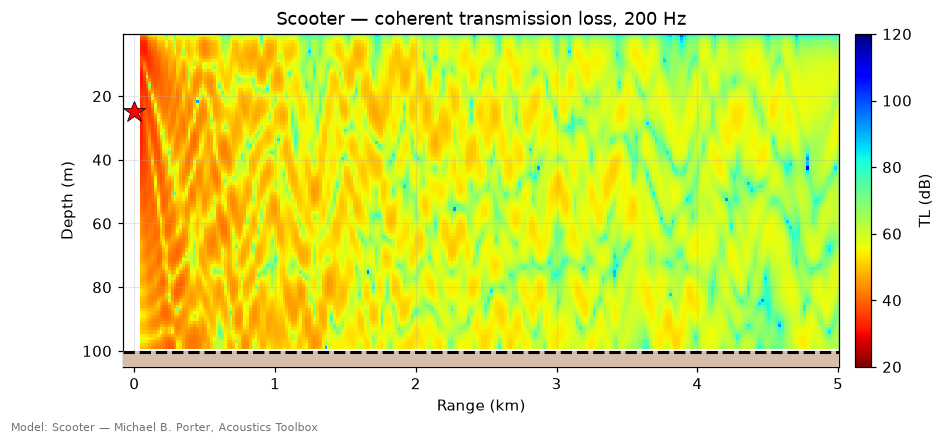
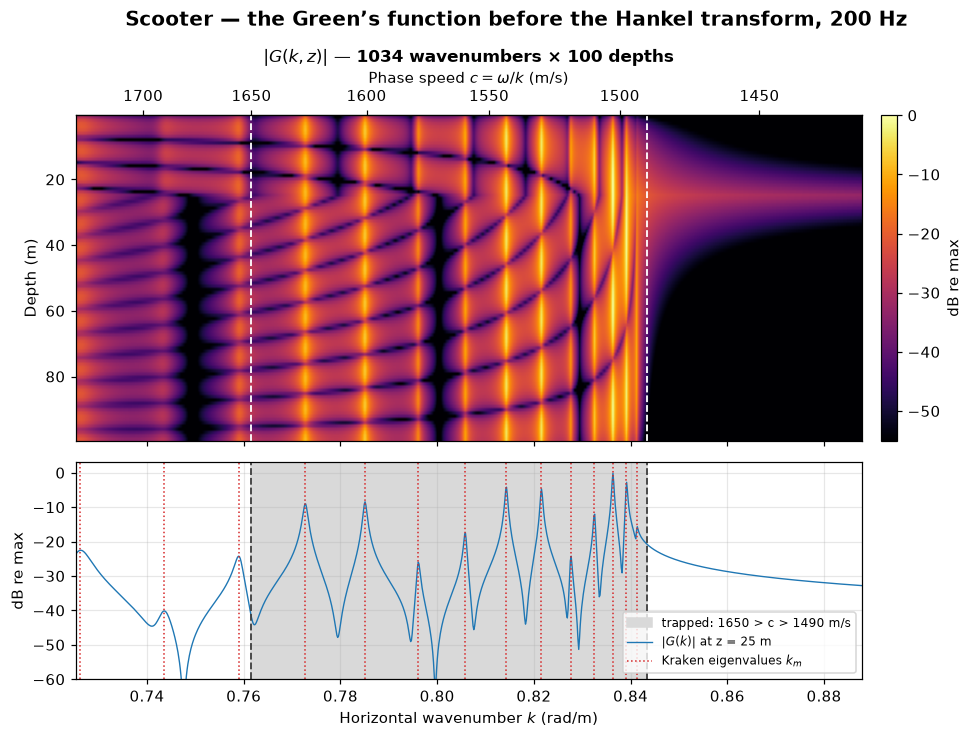
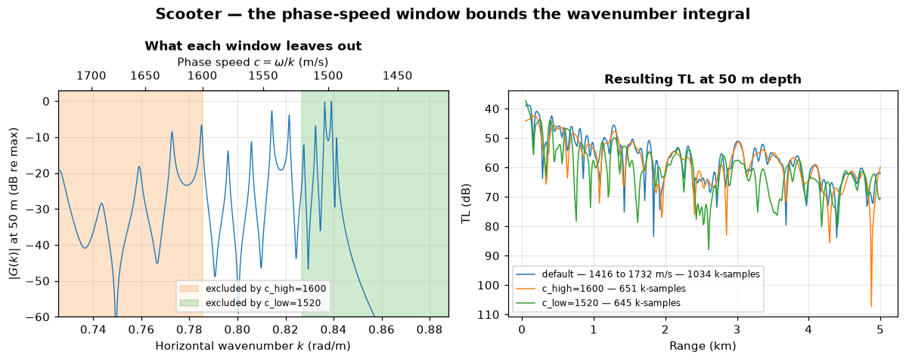
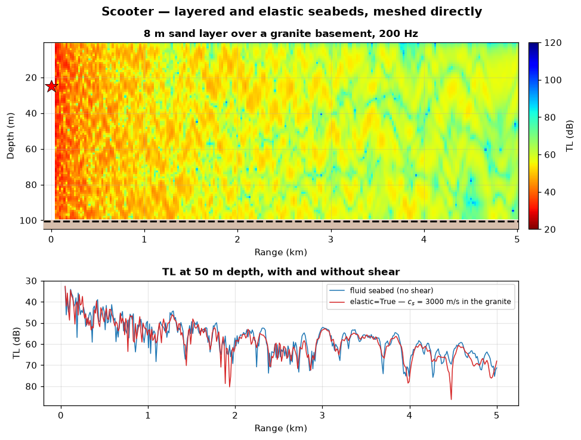
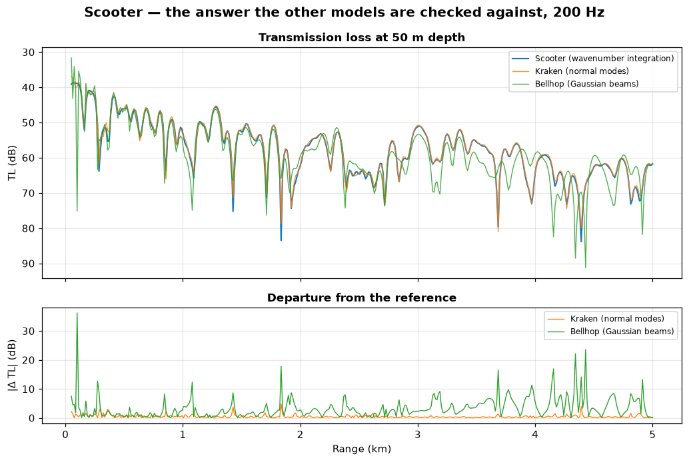
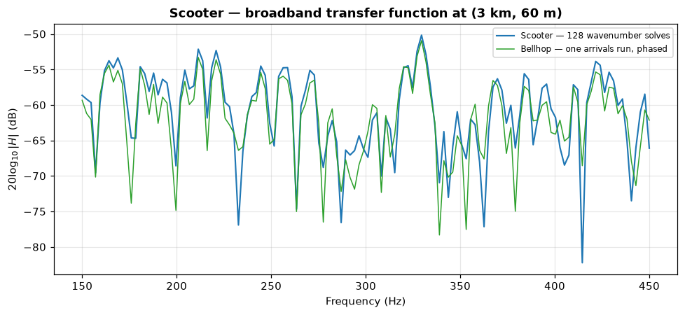
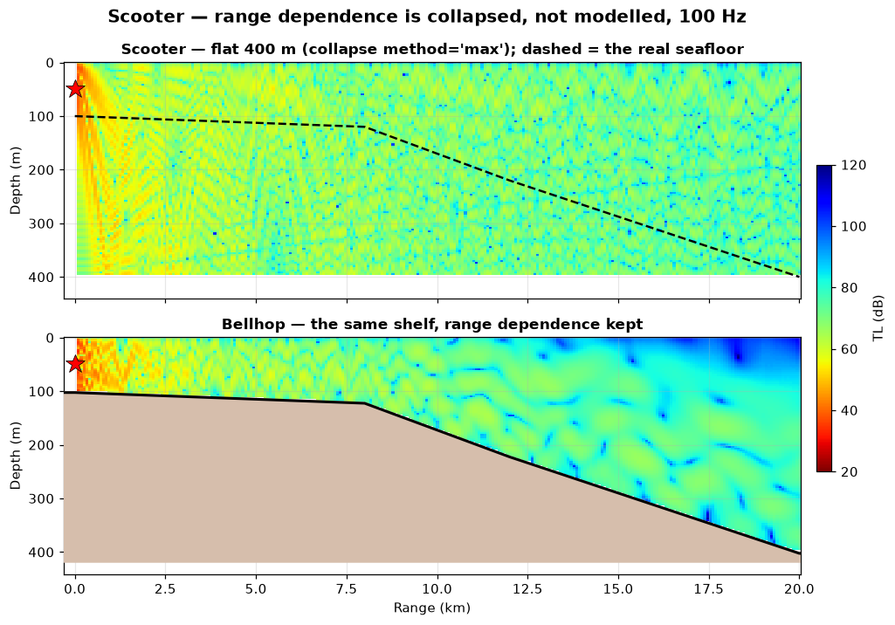

# Scooter — wavenumber integration (FFP)

> `uacpy.models.Scooter` · wraps Michael B. Porter's SCOOTER (Acoustics Toolbox)
> · finite-element fast field program

Scooter is the model you check the others against. It makes no ray
approximation, no modal truncation and no one-way approximation: it solves the
depth-separated wave equation exactly at each horizontal wavenumber and then
transforms back to range. The price is that it only exists in a **stratified**
ocean — range dependence is not an option it lacks, it is a thing the method
structurally cannot represent.

---

## 1. What it solves

Write the Helmholtz equation for a point source at depth `z_s` in a medium
whose properties depend on depth alone, and Hankel-transform it in range. The
transform separates the variables: the 2-D PDE becomes a **1-D two-point
boundary-value problem in depth**, one per horizontal wavenumber `k`.

```
d²G/dz² + [ ω²/c²(z) − k² ] G(k, z) = −δ(z − z_s) / 2π      (depth-separated)

p(r, z) = ∫₀^∞ G(k, z) J₀(k r) k dk                          (back to range)
```

`G(k, z)` is the **depth-separated Green's function**. Scooter discretises the
depth axis with linear finite elements — the water column and every sediment
layer become media of their own — and solves that ODE at each `k`. uacpy then
evaluates the integral in-tree, as a direct sum over the wavenumber grid at
each requested receiver range ([`uacpy.io.grn_reader`](../guide/io.md)).

That chain contains exactly one physical approximation, and it is in the last
step. What is summed is not the Bessel integral above but its **fast-field**
form (COA Eq. 4.96): the incoming-wave Hankel term is dropped and the outgoing
one is replaced by its large-argument asymptote, so the kernel `J₀(k r)·k`
becomes `√(k / 2πr) · e^{i(k r − π/4)}`. That is the standard FFP step — every
wavenumber-integration code in ocean acoustics takes it — and it is accurate
everywhere except within a few wavelengths of the source and at very steep
propagation angles. Every other error is a **discretisation** error, and each
one has a knob that converges it:

| Error | Knob |
|---|---|
| Depth mesh too coarse | `n_mesh` |
| Wavenumber axis truncated | `c_low`, `c_high` |
| Wavenumber axis undersampled | `rmax_multiplier` |
| Far-field (fast-field) kernel | none — structural; stay a few `λ` off the source |

That is what "reference-grade" means here. It is not that Scooter is
magically right; it is that outside the near field its errors are ones you can
drive to zero by refining a grid, rather than structural assumptions about how
sound propagates.

**Why it is range-independent.** The Hankel transform separates `r` from `z`
only because the coefficients of the PDE depend on `z` alone. Let `c = c(r, z)`
and there is no single `k` per depth profile to integrate over — the horizontal
wavenumbers couple, and the whole construction collapses. Scooter's range
independence is therefore not a limitation of the implementation. Range
dependence needs [RAM](ram.md) (marching), [Bellhop](bellhop.md) (rays that
follow the bathymetry) or [Kraken](kraken.md) (segmented, adiabatic or
coupled).

---

## 2. When to use it — and when not to

**Use Scooter when:**

- you want a **reference answer** — to validate a faster model, to sanity-check
  a surprising result, or to publish a benchmark;
- the frequency is too low for rays and you do not trust a truncated mode sum:
  Scooter integrates the **continuous spectrum** as well as the poles;
- the seabed is a **layered stack**, with or without shear — each layer is
  meshed, not collapsed;
- you want the **wavenumber-domain field itself**: `G(k, z)` at a frequency,
  the CW Green's function whose poles are the modes. [SPARC](sparc.md) writes a
  `.grn` through the same reader, but it holds the marched field per output
  time rather than a Green's function at a frequency.

**Reach for something else when:**

| Situation | Why Scooter struggles | Use instead |
|---|---|---|
| Sloping bathymetry, fronts, eddies | Range dependence is collapsed | [RAM](ram.md), [Bellhop](bellhop.md) |
| You need rays, eigenrays, arrivals | No geometry, only a field | [Bellhop](bellhop.md) |
| You need the modes themselves | Poles are never extracted | [Kraken](kraken.md) |
| A transient pulse, watched in time | Frequency-domain solver | [SPARC](sparc.md) |
| Sensor arrays, MFP, seismic detail | Not in scope | [OASES](oases.md) |
| High frequency over long ranges | Cost grows as `f × range` | [Bellhop](bellhop.md) |

[OASES](oases.md) is the other exact wavenumber-integration code in uacpy, with
a fuller seismo-acoustic treatment and array/noise modes. [SPARC](sparc.md) is
Scooter's time-domain sibling: the same finite-element spectral machinery,
marched in time instead of solved per frequency. Choose Scooter for CW and
band-limited transfer functions, SPARC to watch a pulse propagate.

---

## 3. Environment support

| Feature | Native? | Note |
|---|---|---|
| Layered bottom | ✅ | each layer is its own finite-element medium |
| Elastic media (shear) | ✅ | `c_s`, shear attenuation carried through |
| Rough surface / bottom (`sigma`) | ✅ | sea surface only; seabed interfacial roughness is dropped with a warning |
| Source type (`point`/`line`/`scaled`) | ✅ | `Source(source_type=…)` |
| Range-dependent bathymetry | ❌ | collapsed — default `'max'` |
| Range-dependent SSP | ❌ | collapsed — default `'mean'` |
| Range-dependent bottom | ❌ | collapsed — default `'median'` |
| Sea-surface altimetry | ❌ | dropped |
| Multiple source depths | ❌ | one at a time |
| Source beam pattern | ❌ | |

The collapse defaults differ from the package-wide ones: Scooter takes the
**mean** SSP and the **median** bottom column rather than the profile at
`r = 0`, because a single spectral solve should represent the whole track
rather than its near field. Bathymetry keeps the package default, `'max'`.
Override any of them per run:

```python
Scooter(collapse={'bathymetry': 'mean', 'ssp': 'r0'})
```

Full mechanism and the list of methods: [collapse
policy](../guide/environment.md).

Because Scooter consumes layered and elastic seabeds natively, the
`bottom_layers` and `elastic` collapse keys never fire — the layer stack
reaches the solver intact.

---

## 4. Run modes

```python
from uacpy.models import Scooter, RunMode
```

| `RunMode` | Returns | What you get |
|---|---|---|
| `COHERENT_TL` | `Field` | complex pressure `p(z, r)` at one frequency |
| `BROADBAND` | `Field` | `H(z, r, f)` — one full wavenumber solve per bin |
| `TIME_SERIES` | `Field` | `p(z, r, t)`, from `source_waveform=` + `sample_rate=` |

There is no `INCOHERENT_TL`: incoherent summation needs a decomposition into
paths or modes, and Scooter has neither — it produces the complex field
directly.

The default is `COHERENT_TL`, **always**. Unlike Bellhop and Kraken, Scooter
does not promote a multi-frequency source to `BROADBAND` for you; handing one
to the default mode raises a `ConfigurationError` naming the two modes that do
take a band.

---

## 5. Constructor knobs

Everything is configured on the constructor; `run()` has a fixed signature.

**The wavenumber integral**

| Name | Default | Meaning |
|---|---|---|
| `c_low` | `None` | Lower phase-speed bound. `None` ⇒ `0.95 × min(SSP)`. Sets `k_max = ω/c_low`. |
| `c_high` | `None` | Upper phase-speed bound. `None` ⇒ `1.05 × max(SSP, bottom)`. Sets `k_min = ω/c_high`. A vacuum or rigid bottom has no speed to cap on, so this resolves to the toolbox's unbounded value (`1e9`) instead. |
| `rmax_multiplier` | `None` | Spectral `RMax = receiver.ranges.max() × this`. `None` ⇒ `2.0` for `COHERENT_TL`, `3.0` for `BROADBAND`/`TIME_SERIES`. |
| `spectrum` | `'positive'` | Which wavenumber branch the transform integrates: `'positive'`, `'negative'`, `'both'`. |
| `stabilizing_attenuation_off` | `False` | Zero Scooter's contour offset. Leave it alone unless you know why. |

**The depth mesh**

| Name | Default | Meaning |
|---|---|---|
| `n_mesh` | `0` | Finite-element points **per medium** (a total count, not a density). `0` ⇒ Scooter picks from frequency. |
| `interp_ssp` | `None` | SSP connection scheme; `'isovelocity'` shape forces `'C'` regardless. |

**Execution**

| Name | Default | Meaning |
|---|---|---|
| `executable` | `None` | Path to `scooter.exe`; auto-detected. |
| `work_dir` | `None` | Pin the scratch dir to keep `.env` / `.grn` / `.prt`. |
| `cleanup` | `None` | Defaults to *keep* when `work_dir` is pinned. |
| `use_tmpfs` | `False` | Run in RAM. |
| `timeout` | `600.0` | Subprocess timeout (s). |
| `collapse` | `None` | Per-feature collapse overrides. |
| `verbose` | `False` | `True` / `'info'` / `'debug'`; `'info'` logs the resolved `c_low`/`c_high`. |

---

## 6. Worked example

Every figure on this page comes from
[`docs/figure_scripts/scooter.py`](../figure_scripts/scooter.py) — the code
below is that code, so it cannot drift from what you see.

```python
import numpy as np
import uacpy
from uacpy.models import Scooter, RunMode

env = uacpy.Environment(
    name='Shallow-water channel',
    bathymetry=100.0,
    ssp=[(0.0, 1500.0), (30.0, 1495.0), (100.0, 1490.0)],
    bottom=uacpy.BoundaryProperties(
        acoustic_type='half-space',
        sound_speed=1650.0, density=1.8, attenuation=0.6,
    ),
)
source = uacpy.Source(depths=25.0, frequencies=200.0)
receiver = uacpy.Receiver(
    depths=np.linspace(1.0, 99.0, 100),
    ranges=np.linspace(50.0, 5000.0, 250),
)

tl = Scooter().run(env, source, receiver, run_mode=RunMode.COHERENT_TL)
tl.plot(env=env, source=source, title='Scooter — coherent TL, 200 Hz')
```



This is the same 100 m channel that [Bellhop](bellhop.md) and
[Kraken](kraken.md) draw on their pages, so the three images are directly
comparable.

### The Green's function, before the transform

Pinning `work_dir` switches cleanup off, so the `.grn` survives the run and its
path lands in `field.metadata['grn_file']`:

```python
import tempfile
from pathlib import Path
from uacpy.io import read_grn_file

def run_with_greens_function(env, source, receiver, **knobs):
    with tempfile.TemporaryDirectory() as tmp:
        field = Scooter(work_dir=Path(tmp), **knobs).run(env, source, receiver)
        return field, read_grn_file(field.metadata['grn_file'])

_, grn = run_with_greens_function(env, source, receiver)
k = 2.0 * np.pi * grn['freq'] / grn['cVec']      # horizontal wavenumbers
G = np.abs(grn['G'][0, 0])                       # (n_depth, n_wavenumber)
```



This is the figure only Scooter can give you, and it is worth reading slowly.

The top panel is `|G(k, z)|` — 1034 wavenumbers × 100 depths for this run. Each
bright vertical stripe **marks** a pole of the Green's function, and its
structure down the depth axis is a mode shape: one lobe, two lobes, three. No
pole actually sits on the contour Scooter samples — the seabed is lossy, and
the contour is offset off the real axis besides — so what you see is a sharp
peak whose **width** measures how far off the axis the pole lies, which is how
fast that mode decays with range. Between `c = 1650 m/s` (the seabed) and
`c = 1490 m/s` (the slowest water) the field is trapped in the duct. To the
right of the water line it is evanescent in the water — confined to a bright
smear around the source depth, contributing only to the near field. To the left
of the bottom line it radiates into the seabed: the poles broaden into leaky
resonances and the branch-cut continuum takes over.

The bottom panel overlays [Kraken](kraken.md)'s eigenvalues `k_m`, found by an
entirely different algorithm — a root search for the poles. They land on the
peaks. Normal modes and wavenumber integration are the same physics: Kraken
plucks out the poles and sums their residues, Scooter integrates straight
through them and picks up the branch-cut continuum on the way. That continuum
is the **left-hand** tail, below the seabed line, where energy radiates away
into the bottom and no lossless mode can live; the right-hand tail is the
evanescent spectrum, which is a different thing. And the division is not clean:
three of Kraken's eigenvalues here sit left of the shaded band — leaky modes,
with visibly broader peaks — so the two methods overlap in precisely the region
where they are supposed to part company.

### The phase-speed window

```python
line = uacpy.Receiver(depths=50.0, ranges=np.linspace(50.0, 5000.0, 400))
for knobs in ({}, {'c_high': 1600.0}, {'c_low': 1520.0}):
    tl, grn = run_with_greens_function(env, source, line, **knobs)
```



`c_low` and `c_high` are the **integration interval**, expressed as phase
speeds: `k` runs from `ω/c_high` up to `ω/c_low`, and everything outside is
never computed. The two shaded bands are what each truncation throws away.

Cutting at `c_high = 1600 m/s` removes the near-cutoff poles and the leaky
continuum — energy that is heavily attenuated anyway, so the TL barely moves
past 1 km. Cutting at `c_low = 1520 m/s` removes the best-trapped, lowest-order
poles, which are the ones that survive to long range: that curve is visibly
wrong everywhere. The defaults (`0.95 × min SSP` to `1.05 × max speed`) bracket
both ends with margin **at long range**, and cost accuracy close in: the
default `c_high` starts the integration at `k_min = ω/c_high` rather than at
`0`, dropping the steep-angle continuum, and COA §4.5.6 recommends including it
(`k_min = 0`, i.e. an unbounded `c_high`) whenever you are unsure. In this
channel that costs 0.19 dB median beyond 2 km — and **29.8 dB at 100 m**, one
water depth out. That is a second near-source limit, separate from the
fast-field one in [§1](#1-what-it-solves) and scaled by the water depth rather
than the wavelength: 100 m here is already 13 λ, well clear of "a few
wavelengths", and still wrong. Below a couple of water depths, raise `c_high`
(5.5× the wavenumbers here) and check whether the answer moved. Narrow the
window only to isolate a mechanism, never to save time.

[Kraken's version of this figure](kraken.md) shows the same window bounding a
*mode set* rather than an integration interval — the two views of the same
window are worth seeing side by side.

### Layered and elastic seabeds

```python
env = uacpy.Environment(
    bathymetry=100.0,
    ssp=[(0.0, 1500.0), (100.0, 1490.0)],
    bottom=uacpy.SeabedColumn.from_presets(
        layers=[('sand', 8.0)], halfspace='granite'),
)
tl = Scooter().run(env, source, receiver)

# the same column, this time keeping the presets' shear parameters
elastic = uacpy.Environment(
    bathymetry=env.bathymetry, ssp=env.ssp,
    bottom=uacpy.SeabedColumn.from_presets(
        layers=[('sand', 8.0)], halfspace='granite', elastic=True),
)
```



The 8 m sand layer is meshed as a second medium, so the layer resonance is
solved rather than approximated by a reflection coefficient. `from_presets`
drops shear by default; passing `elastic=True` keeps it — `c_s = 3000 m/s` in
the granite, 110 m/s in the sand — and Scooter carries those into the
finite-element system natively. No auto-BOUNCE, no fluid approximation.

Shear here shifts the interference pattern by a few dB rather than
transforming it: a granite basement under 8 m of sand is far enough from the
water for its shear branch to matter mostly at the steep angles. In a thin
sediment over rock, or with a shear speed close to the water speed, the gap is
much larger — which is the point of being able to model it exactly.

One thing the defaults hide. `c_low` resolves to `0.95 × min(water SSP)` and
never looks at shear, so the seismic interface waves an elastic seabed supports
— which travel *below* the shear speed, 110 m/s in this sand — fall outside the
integration window entirely. For a source and receiver in the water column that
costs nothing measurable: `c_low=90` here multiplies the wavenumber count by 20
and moves TL by 0.01 dB, because a source 75 m above the seabed does not excite
an interface wave. Move the source down to 1 m above the seabed and the same
change is worth up to **4 dB** at a receiver near the interface. If that is the
physics you are after, set `c_low` below the slowest shear speed and expect the
cost. For a seabed whose shear physics is the whole question, [OASES](oases.md)
goes further; [Bounce](bounce.md) gives you the reflection coefficient alone.

### Benchmarking another model against it

```python
from uacpy.models import Bellhop, Kraken

line = uacpy.Receiver(depths=50.0, ranges=np.linspace(50.0, 5000.0, 400))
reference = np.asarray(Scooter().run(env, source, line).tl, dtype=float).ravel()
for model in (Kraken(), Bellhop(n_beams=3000)):
    tl = np.asarray(model.run(env, source, line).tl, dtype=float).ravel()
    ...  # plot tl, and |tl - reference|
```



This is what Scooter is for. Kraken sits within about a dB of it across the
whole track, spiking only where a deep null moves by a few metres — its
truncated mode sum is an excellent approximation in this duct. Bellhop is
consistently several dB out and misplaces nulls outright: 100 m at 200 Hz is
`D/λ ≈ 13`, the low end of where rays are trustworthy, and the plot shows what
that costs.

Run the comparison as images rather than lines with
[`uacpy.compare_models`](../guide/plotting.md).

### Broadband: exact, one solve at a time

```python
source = uacpy.Source(depths=25.0, frequencies=np.linspace(150.0, 450.0, 128))
point = uacpy.Receiver(depths=60.0, ranges=3000.0)
H = Scooter().run(env, source, point, run_mode=RunMode.BROADBAND)
```



`BROADBAND` re-solves the full wavenumber integral at every bin — 128 solves
for 128 frequencies. [Bellhop](bellhop.md) synthesises the same band from a
*single* arrivals run by phasing ray delays, which is why it is so much cheaper
for broadband work. Here the two agree closely, which is itself the useful
result: at 150–450 Hz in this channel, the cheap answer is the right one, and
now you know rather than hope.

### What range dependence costs

```python
env = uacpy.Environment(                     # 100 m shelf → 400 m over 20 km
    bathymetry=[(0.0, 100.0), (8000.0, 120.0), (12000.0, 220.0),
                (20000.0, 400.0)],
    ssp=[(0.0, 1520.0), (50.0, 1505.0), (200.0, 1490.0), (400.0, 1485.0)],
    bottom=uacpy.BoundaryProperties(
        acoustic_type='half-space',
        sound_speed=1700.0, density=1.9, attenuation=0.5,
    ),
)
source = uacpy.Source(depths=50.0, frequencies=100.0)

flat = Scooter().run(env, source, receiver)  # UserWarning: bathymetry collapsed
```



uacpy does not refuse the run. It collapses the bathymetry to a single depth,
warns, and solves that:

```
UserWarning: Scooter does not support range-dependent bathymetry; collapsed
to 400.0 m (method='max', range 100.0–400.0 m). Override via
`collapse={'bathymetry': 'min'|'median'|'mean'|'max'|'initial'}`.
```

The top panel answers a different question than the one asked: a flat 400 m
guide, with energy filling the whole box — including everything under the
dashed line, which is seabed on the real track. The bottom panel is
[Bellhop](bellhop.md) on the same shelf with the slope kept, and there the
field stays in the water and follows the bottom down. Neither panel is a bug.
The top one is what a stratified solver can say about a non-stratified ocean,
and the warning is uacpy saying so.

---

## 7. Gotchas

**`RMax` comes from the receiver grid.** The spectral `RMax` is
`receiver.ranges.max() × rmax_multiplier`, and it sets the wavenumber spacing:
`Δk ≈ π / (2·RMax)` (`scooter.f90:69,77`). Replacing the integral by a discrete
sum over `k` makes the range output **periodic** with period `R = 2π/Δk`, which
works out at **4·RMax** — so the default multiplier of 2 puts the first source
image eight times further out than your furthest receiver, and the broadband
default of 3 puts it twelve. Too small a multiplier and that image folds back
as a wave travelling in from the far range edge. (The periodicity comes from
sampling the integral, not from how the sum is evaluated: uacpy's transform is
a direct summation, not an FFT.) Asking for receivers out to 20 km when you
care about 5 km quadruples the wavenumber count for nothing.

**Cost scales as `frequency × max range`.** The number of wavenumbers is set by
the k-window width (`∝ f`) divided by `Δk` (`∝ 1/RMax`), so doubling either
doubles the work: 200 Hz out to 5 km gives 1034 wavenumbers, 400 Hz or 10 km
give 2068. Scooter is cheap in shallow water at low frequency and expensive in
the deep ocean at high frequency — the opposite of Bellhop.

**Receivers below the deepest interface come back `NaN`.** The finite-element
mesh stops at the bottom of the last modelled medium, and `scooter.exe` would
otherwise silently clamp deeper receivers onto it. uacpy masks them instead and
warns. A receiver *inside* a sediment layer is fine and returns a real field —
the mesh reaches it.

**`n_mesh` is a count per medium, not a density.** It is the Acoustics Toolbox
`NG` column, a total number of finite-element points in each medium. Leaving it
at `0` lets Scooter size the mesh from the frequency, which is usually what you
want; raise it if the result changes when you do.

**`n_mesh` below 100 does nothing, silently.** Scooter floors the count at 100
points per medium (`scooter.f90:110`), and the `.prt` still echoes back the
value you asked for — so there is no signal that it was overridden. A
convergence study over `n_mesh` = 20, 40, 60, 80, 100 returns five *identical*
answers and reads as converged: at 50 Hz in the 100 m channel above, `n_mesh` of
34, 40, 70 and 100 all give bit-identical TL, and only 150 moves it. Step by
factors above 100. Going the other way, setting `n_mesh` below half what Scooter
would have chosen aborts the run — `n_mesh=50` at 200 Hz here raises
`ModelExecutionError`, with *"Mesh is too coarse"* and the count it wanted in
the `.prt` tail. And in a multi-frequency run the mesh scales as `f/f₀`, so
`n_mesh` is a count at the *first* frequency, not at every one.

**Multi-frequency sources need an explicit `run_mode`.** `Scooter().run(env,
source_with_a_band, receiver)` raises rather than guessing. Pass
`RunMode.BROADBAND` or `RunMode.TIME_SERIES`.

**The stabilising attenuation is load-bearing.** Scooter offsets the
integration contour off the real `k` axis by `Δk` (`scooter.f90:129`). That is
not primarily about poles — it is the wrap-around cure of COA §4.5.5: the
offset smooths the kernel, a smoother kernel transforms to a faster-decaying
field, and the periodic images then die away before they reach your window. COA
Eq. (4.115) puts the offset that buys 60 dB of wrap-around suppression at
`ε ≈ 1.1·Δk`, so Scooter's `Δk` is the textbook value, not a guess. It also
means a pole on the real axis — a lossless waveguide, where the images never
decay — cannot blow up. The `.grn` reports the offset in `grn_data['atten']`,
and the transform integrates along that same shifted contour and re-multiplies
by `e^{εr}` to restore the true range decay. Setting
`stabilizing_attenuation_off=True` zeroes it, which is occasionally what a
convergence study wants and otherwise a way to let wrap-around back into a
result that will still look plausible.

---

## 8. References

- Jensen, Kuperman, Porter & Schmidt, *Computational Ocean Acoustics*, 2nd ed.,
  Springer, 2011 — chapter 4 is the wavenumber-integration chapter, and is the
  reference for everything on this page.
- DiNapoli, F. R. & Deavenport, R. L., "Theoretical and numerical Green's
  function field solution in a plane multilayered medium", *JASA* 67(1), 1980 —
  the original fast field program.
- Porter, M. B., *The Acoustics Toolbox*, HLS Research —
  [oalib.hlsresearch.com](http://oalib.hlsresearch.com/AcousticsToolbox/).
- Local modifications to the vendored source:
  [`uacpy/third_party/MODIFICATIONS.md`](../../uacpy/third_party/MODIFICATIONS.md).

---

**See also:** [SPARC](sparc.md) · [OASES](oases.md) · [Kraken](kraken.md) ·
[Bellhop](bellhop.md) · [RAM](ram.md) · [Bounce](bounce.md) ·
[model index](README.md)
