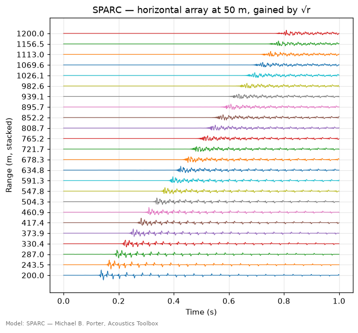
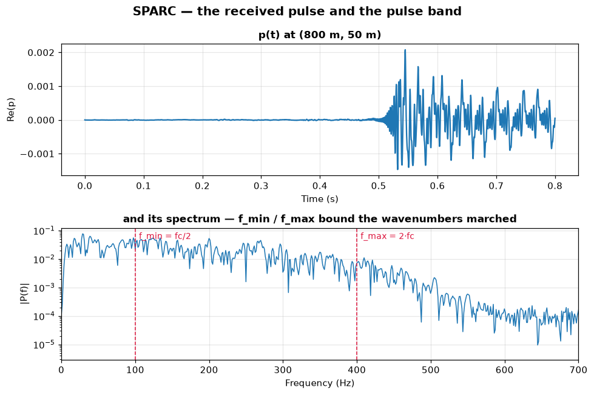
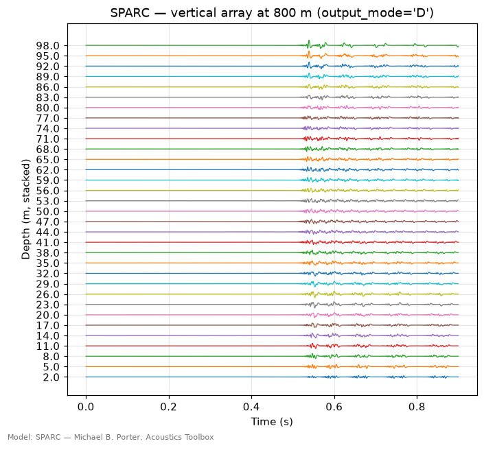
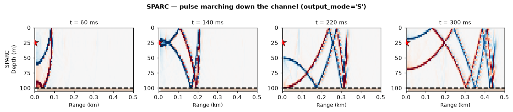
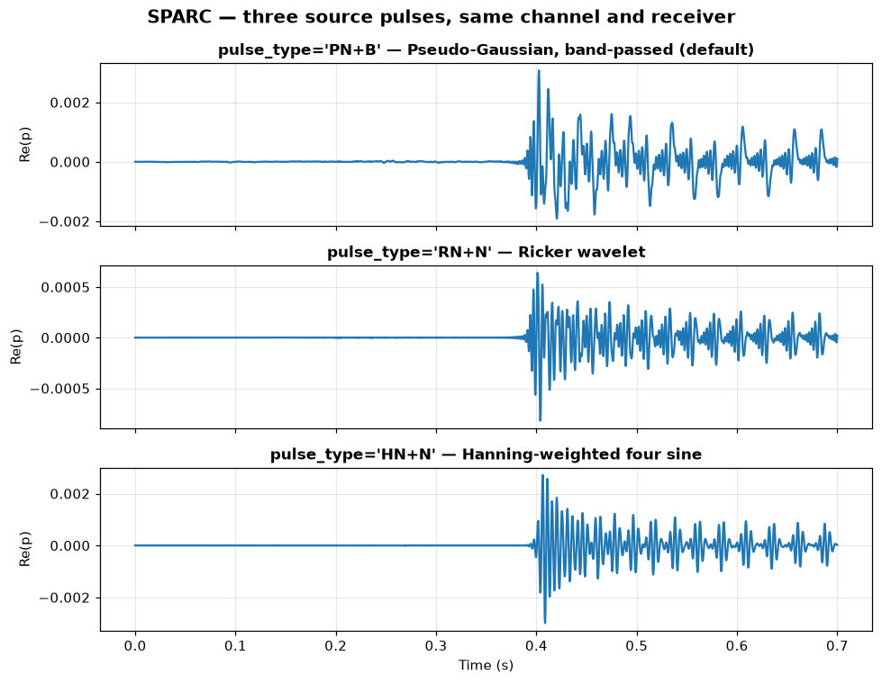
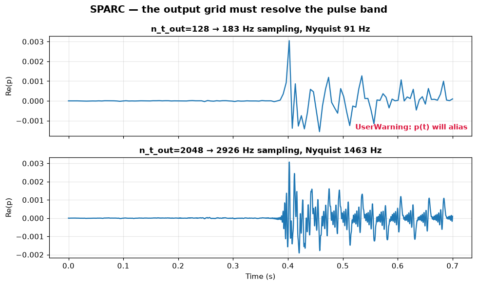

# SPARC — time-marched FFP

> `uacpy.models.SPARC` · wraps Michael B. Porter's SPARC (Acoustics Toolbox)
> · run mode: `TIME_SERIES` only

SPARC does not solve for a continuous-wave field and then synthesise a pulse
out of it. It marches an actual pulse forward in time. That makes it the model
to reach for when the **waveform is the answer** — how a transient spreads,
disperses and arrives — and the only one in uacpy that will draw you the
wavefront itself, mid-flight.

**SPARC has exactly one run mode: `TIME_SERIES`.** `RunMode.COHERENT_TL`
raises `UnsupportedFeatureError`. If you want transmission loss, use
[Scooter](scooter.md) — the same wavenumber-integration lineage, solved at a
frequency instead of marched in time — or [Kraken](kraken.md).

---

## 1. What it solves

SPARC solves the **wave equation**, not the Helmholtz equation. It transforms
range into horizontal wavenumber `k`, and for each `k` in a discrete set it
marches the depth-dependent wave equation forward in time on a
finite-element mesh:

```
(1/c²)·∂²ψ/∂t²  =  ρ·∂/∂z[ (1/ρ)·∂ψ/∂z ]  −  k²·ψ        one k at a time
```

The receiver pressure is then the sum of those marched solutions over `k` — an
inverse Hankel transform, taken in its far-field form.

That is the same decomposition [Scooter](scooter.md) uses. The difference is
what happens to each wavenumber: Scooter solves a boundary-value problem in
depth at **one frequency**; SPARC integrates the same operator **in time**
across a whole pulse band. Hence *time-marched FFP*.

Two consequences follow, and between them they explain most of the knobs on
this page.

**The wavenumber set is the cost.** The pulse band `[f_min, f_max]` bounds it,
`sparc.f90` samples it, and everything scales with how many samples that is:

```
kMin = 2π·f_min / c_high        kMax = 2π·f_max / c_low
Nk   = 1000 · RMax[km] · (kMax − kMin) / 2π
```

Widen the band, lower `c_low`, or push the receivers further out, and `Nk` —
and the runtime — grows in proportion. The upstream manual puts it bluntly:
*"FMax should be no higher than necessary since the runtime is proportional to
the bandwidth."* The `.prt` file prints the `Nk` it chose.

**The time step is a stability condition, not a choice.** Each wavenumber
marches on its own Courant step, `Δt = t_mult / √(1/t_cross² + (½·c_max·k)²)`,
where `t_cross` is the shortest mesh-cell transit time (`sparc.f90:217,271`).
`t_mult = 1.0` means *exactly* the maximum stable step; the default `0.999`
sits just inside it. Because the step shrinks as `k` grows, the highest
wavenumbers cost the most steps, and the runtime rises faster than `Nk` alone
suggests — which is why lowering `c_low` is the expensive knob. (The single
`Δt` printed in the `.prt` is the one for `k = kMax`, used for its flop
estimate.) This step has nothing to do with `n_t_out`, which samples the
**output** — see [§7](#7-gotchas).

**There is almost no propagation approximation to violate.** No ray limit, no
one-way assumption, no modal truncation: the depth march itself is exact up to
numerics. The one approximation is the same one [Scooter](scooter.md) makes —
the wavenumber sum back to range uses the far-field (fast-field) form of the
inverse Hankel transform (`sparc.f90:595,623`), which loses accuracy within a
few wavelengths of the source and at very steep angles. SPARC's other limits
are structural — it is range-independent, it is fluid-only (`sparc.f90`
declares a shear array, hands it to `EvaluateSSP` and never reads it again:
`sparc.f90:193,211`, and only the compressional speed reaches the mass and
stiffness matrices at `:222-224`), and the seabed must terminate in a **rigid
or vacuum** boundary.

---

## 2. When to use it — and when not to

**Use SPARC when:**

- you want the **transient pressure itself** — the received waveform, computed
  in the time domain rather than assembled from `H(f)`;
- you want to **watch the field evolve**: `output_mode='S'` gives you the whole
  depth–range plane at a sequence of instants, out of a single march of the
  wave equation. [Bellhop](bellhop.md) `TIME_SERIES` hands back the same
  `(depth, range, time)` array, but synthesised by phasing the arrivals of one
  ray trace at the band centre — so it inherits the ray approximation, while
  SPARC's snapshot is the marched field itself, diffraction and continuous
  spectrum included;
- you want a **record section** — moveout across a horizontal array, where the
  arrival structure is the physics you are after;
- you are checking another model's broadband synthesis against a solver that
  never went through the frequency domain.

**Reach for something else when:**

| Situation | Why SPARC can't | Use instead |
|---|---|---|
| Transmission loss at a frequency | No CW mode at all | [Scooter](scooter.md), [Kraken](kraken.md) |
| A penetrable seabed | Bottom is rigid/vacuum only | [Scooter](scooter.md), [OASES](oases.md), [Kraken](kraken.md) |
| Shear / elastic seabed | The solver is fluid-only | [OASES](oases.md) |
| Sloping bathymetry, RD SSP | Stratified solver; the env is collapsed | [RAM](ram.md), [Bellhop](bellhop.md) |
| A dense depth × range grid | `'R'` runs one subprocess per depth | [Bellhop](bellhop.md), [Scooter](scooter.md) |
| Your own source waveform | The pulse comes from `pulse_type` | any other model's `TIME_SERIES` with `source_waveform=` |
| Cheap broadband `H(f)` | Marching a band is not cheap | [Bellhop](bellhop.md) `BROADBAND` |

---

## 3. Environment support

| Feature | Native? | Note |
|---|---|---|
| Layered bottom | ✅ | one AT medium per sediment layer |
| Range-dependent bathymetry | ❌ | collapsed to a single depth |
| Range-dependent SSP | ❌ | collapsed — `'mean'` across range |
| Range-dependent bottom | ❌ | collapsed — `'median'` column |
| Sea-surface altimetry | ❌ | collapsed |
| Elastic media (shear) | ❌ | `sparc.f90` is fluid-only; shear is dropped up front |
| Rough surface / bottom (`sigma`) | ❌ | `sparc.f90` refuses a non-zero `sigma` outright |
| Multiple source depths | ❌ | raises `ConfigurationError`; loop over `Source`s |
| Source beam pattern | ❌ | |
| Source geometry (`point`/`line`/`scaled`) | `'S'` only | `'R'` and `'D'` are `point` only |

Anything marked ❌ is collapsed with a `UserWarning` naming what was dropped —
see the [collapse policy](../guide/environment.md).

### The bottom must be rigid or vacuum

This is SPARC's own limit, not a wrapper restriction. `sparc.f90:101-104`
aborts on any boundary that is not vacuum or rigid — top **or** bottom — with
*"SPARC only allows Vacuum or Rigid boundary conditions"*. uacpy therefore
**auto-converts** a half-space bottom to rigid rather than letting the run die,
with a warning:

```
UserWarning: SPARC supports only 'vacuum' / 'rigid' bottom boundaries;
auto-converting the env's halfspace to 'rigid'.
```

Every figure on this page carries that warning, because they all run over the
shared shallow-water channel whose seabed is a sand half-space. A perfectly
rigid seabed reflects everything, so the traces below keep ringing far longer
than a real sand bottom would allow, and absolute levels are not comparable to
a half-space run of the same environment.

What *is* supported natively is a **layer stack**: each sediment layer becomes
its own medium with its own speed, density and attenuation, and only the
boundary underneath the stack is forced rigid. If your seabed physics matters
more than your waveform does, this is the wrong model — go to
[OASES](oases.md) or [Scooter](scooter.md).

---

## 4. Run modes and output geometries

```python
from uacpy.models import SPARC, RunMode
```

| `RunMode` | Returns | What you get |
|---|---|---|
| `TIME_SERIES` | `Field` | real `p(depth, range, time)` — `Field.kind == 'time_series'` |

It is also the default, so `run_mode=` can be left off entirely. Ask for CW
transmission loss and you get told where to go instead:

```python
SPARC().run(env, source, receiver, run_mode=RunMode.COHERENT_TL)
```
```
UnsupportedFeatureError: SPARC does not support: RunMode.COHERENT_TL — SPARC
marches a pulse, and the CW field extracted from it is not quantitative (no
contour offset on the wavenumber sum, a grid sized for the whole pulse band,
and a per-wavenumber band-pass that a scalar source-spectrum deconvolution
cannot undo)

How to fix:
Try one of these models instead:
  • Scooter for wavenumber-integration CW transmission loss
  • Kraken for normal-mode CW transmission loss
  • SPARC with run_mode=TIME_SERIES for its native p(t)
```

### The three geometries

The real choice on this page is not the run mode — it is `output_mode`, which
decides **what one march buys you**:

| `output_mode` | Geometry | Binary runs | Free axis | Costly axis |
|---|---|---|:--:|---|
| `'R'` *(default)* | horizontal array — every range at one depth | one **per receiver depth** | ranges | depths |
| `'D'` | vertical array — every depth at one range | one **per receiver range** | depths | ranges |
| `'S'` | snapshot — the whole depth × range grid | **one**, total | both | — |

Those are the three standard ways of displaying a modelled pulse — stacked
time series against range, against depth, or snapshots at fixed times (COA
§8.5) — and SPARC computes each one the cheap way round. All three hand back
the same `(depth, range, time)` `Field` on one shared time grid; they differ
only in how the work is spent. `'R'` and `'D'` loop the binary in the wrapper
and are capped by `max_depths` (default 20) on the axis they loop; `'S'` runs
once and is uncapped, converting the wavenumber-domain `.grn` in-tree with one
inverse Hankel transform per output time.

**Prefer `'R'` for absolute levels.** The three geometries do not arrive on a
common scale. `'R'` and `'D'` are both range-domain outputs but normalise
differently inside `sparc.f90` — `'D'` finishes with `1/√(π·r)` where `'R'`
carries only `1/√r`, so `'R'` runs `√π` louder for the identical field. `'S'`
normalises nothing at all: it writes the raw wavenumber-domain Green's function
and uacpy transforms it in-tree, and *that* transform sits a further `−√(4π)`
from `'R'`. uacpy scales `'D'` and `'S'` onto the `'R'` convention so that
`Field.tl` means the same thing everywhere. That harmonisation is measured, not
derived, so `'D'` and `'S'` are **experimental**: trust their shapes, arrival
times and relative structure; take decibels from `'R'` — and see
[§7](#7-gotchas) for why even those are pulse-scaled rather than calibrated.

---

## 5. Constructor knobs

Everything is configured on the constructor; `run()` has a fixed signature.

**Pulse and band**

| Name | Default | Meaning |
|---|---|---|
| `pulse_type` | `'PN+B'` | 4-character AT pulse code — shape, post-process, sign, filter. See below. |
| `f_min`, `f_max` | `None` | Pulse band (Hz). `None` ⇒ one octave around the source frequency: `f/2 … 2f`. This is what sets `Nk`. |

`pulse_type` position by position:

| Pos | Values | Meaning |
|---|---|---|
| 1 | `P R A S H N M G F B` | Pseudo-Gaussian, Ricker, approximate Ricker, single sine, Hanning-weighted four sine, N-wave, miracle-wave, Gaussian, from `.STS` file, from `.STS` reversed |
| 2 | `N` `H` `Q` | none / pre-envelope / Hilbert transform |
| 3 | `+` `-` | keep sign / invert |
| 4 | `N` `L` `H` `B` | no filter / low-cut / high-cut / both |

The position-4 filter is applied **per wavenumber** at `k·c_low/2π` and
`k·c_high/2π` — it is not a filter on `[f_min, f_max]`.

**Output grid and geometry**

| Name | Default | Meaning |
|---|---|---|
| `output_mode` | `'R'` | `'R'` horizontal array, `'D'` vertical array, `'S'` snapshot. |
| `n_t_out` | `512` | Output time samples over `[0, t_max]`. Used verbatim; warns when the resulting Nyquist sits below `f_max`. |
| `t_max` | `None` | Output window end (s). `None` ⇒ `2.5 ×` the travel time to `RMax`. |
| `t_start` | `-0.1` | Where the **march** starts (s) — must be before the source rises. Not the output window. |
| `t_mult` | `0.999` | Courant multiplier; `1.0` is the maximum stable step. |
| `max_depths` | `20` | Cap on the looped axis: depths for `'R'`, ranges for `'D'`. `'S'` is uncapped. |

**Numerics and environment**

| Name | Default | Meaning |
|---|---|---|
| `c_low`, `c_high` | `None` | Phase-speed bounds (m/s) — they set `kMin`/`kMax`. `None` ⇒ derived from the SSP and the seabed. |
| `n_mesh` | `0` | Mesh points per medium; `0` lets SPARC choose per wavelength. |
| `interp_ssp` | `None` | SSP interpolation scheme; `None` auto-picks. |
| `rmax_safety_margin` | `None` | `RMax = receiver.ranges.max() × this`. `None` ⇒ `3.0`. |
| `sound_speed` | `None` | Reference speed for the auto `t_max` window; `None` ⇒ 1500 m/s. |

**Execution**

| Name | Default | Meaning |
|---|---|---|
| `executable` | `None` | Path to `sparc.exe`; auto-detected. |
| `timeout` | `180.0` | Subprocess timeout **per run** (s) — and `'R'`/`'D'` make several. |
| `work_dir` | `None` | Pin the scratch dir to keep `.env` / `.rts` / `.grn` / `.prt`. |
| `cleanup` | `None` | Defaults to *keep* when `work_dir` is pinned. |
| `verbose` | `False` | `True` / `'info'` / `'debug'`. |
| `collapse` | `None` | Override the per-feature collapse methods. |

---

## 6. Worked example

Every figure on this page comes from
[`docs/figure_scripts/sparc.py`](../figure_scripts/sparc.py) — the code below
is that code, so it cannot drift from what you see. All of it runs over the
shared shallow-water channel:

```python
import numpy as np
import uacpy
from uacpy.models import SPARC

env = uacpy.Environment(
    name='Shallow-water channel',
    bathymetry=100.0,
    ssp=[(0.0, 1500.0), (30.0, 1495.0), (100.0, 1490.0)],
    bottom=uacpy.BoundaryProperties(
        acoustic_type='half-space',
        sound_speed=1650.0, density=1.8, attenuation=0.6,
    ),
)
source = uacpy.Source(depths=25.0, frequencies=200.0)
```

`t_max` is pinned in every snippet below. The automatic window is `2.5 ×` the
travel time to `RMax`, and `RMax` is itself `3 ×` the furthest receiver — so
the default window is about **7.5 travel times** long, which is far more than
these figures need and (at `n_t_out=512`) aliases besides.

### `output_mode='R'` — a horizontal array

```python
from uacpy.core.results import Field

array = uacpy.Receiver(depths=50.0, ranges=np.linspace(200.0, 1200.0, 24))
p = SPARC(t_max=1.0, n_t_out=1024).run(env, source, array)

section = p.at(depth=50.0).to_dict()
section['data'] = (section['data']
                   * np.sqrt(section['coords']['range'])[:, None])
Field.from_dict(section).plot(stacked=True)
```



Twenty-four ranges at **one** depth is a single SPARC march — this is the shape
`'R'` is cheap for. The traces are scaled by `√r` to undo cylindrical
spreading, the standard record-section gain; without it the near traces swamp
the far ones and the moveout is invisible. Read the slope: the arrival walks
out by roughly 1 s per 1500 m, and behind each first arrival the surface- and
bottom-reflected paths pile up into a coda that lengthens with range.

### One trace, and the band it occupies

```python
point = uacpy.Receiver(depths=50.0, ranges=np.array([800.0]))
p = SPARC(t_max=0.8, n_t_out=2048).run(env, source, point)
trace = p.at(depth=50.0, range=800.0)

freqs, spectrum = trace.get_spectrum()
```



The pulse lands at ~0.53 s, which is 800 m at 1500 m/s, and rings for the rest
of the window off the (rigidified) seabed. The dashed lines are the default
band, `f_min = f/2` and `f_max = 2f`. Note what they do and do not mean: they
set the **wavenumbers** SPARC marches, and above `f_max` the received spectrum
duly collapses by two orders of magnitude — but they are not a band-pass on the
output, and they bound the content on neither side. With the default `'…B'`
filter each wavenumber carries its own pass band, `[k·c_low/2π, k·c_high/2π]`
(`sparc.f90:392,398`); across the marched `k` those span roughly 82–490 Hz
here, not 100–400. Below that the spectrum still does not fall away. Read
levels from inside the band, not from its skirts.

`get_spectrum()` is the quick look. For anything more — spectrogram, envelope,
matched filter, dispersion — hand the trace to
[`uacpy.signal`](../guide/signal.md).

### `output_mode='D'` — a vertical array

```python
vla = uacpy.Receiver(depths=np.linspace(2.0, 98.0, 33),
                     ranges=np.array([800.0]))
p = SPARC(output_mode='D', t_max=0.9, n_t_out=1024).run(env, source, vla)
p.at(range=800.0).plot(stacked=True)
```



The same event as the trace above, now down 33 depths at one range — and still
**one** march, because `'D'` loops per *range*. Under `'R'` the identical
picture would have cost 33 runs and tripped the `max_depths` cap. The arrival
is flat across the array at this range, with the modal interference visible as
depth-to-depth variation in the coda rather than in the onset.

### `output_mode='S'` — the wavefront itself

```python
from uacpy.visualization import plot_time_snapshots

grid = uacpy.Receiver(depths=np.linspace(1.0, 99.0, 40),
                      ranges=np.linspace(10.0, 500.0, 80))
p = SPARC(output_mode='S', t_max=0.36, n_t_out=384).run(env, source, grid)

late = np.asarray(p.data)[..., -1]
plot_time_snapshots(
    {'SPARC': p}, (0.06, 0.14, 0.22, 0.30), env=env,
    p_max=float(np.percentile(np.abs(late[np.isfinite(late)]), 99.0)))
```



This is what SPARC is for. Four instants from one run: at 60 ms the front has
travelled ~90 m and reads as a single curved wavefront, though it has already
touched the surface (25 m up, ~17 ms) and the bottom (75 m down, ~50 ms) — the
reflected arms are still folded onto it rather than clear of it. By 140 ms they
have separated; by 300 ms the surface and bottom images have folded
the field into the criss-cross that a ray tracer would draw as separate paths
and a modal solver would call interference. Red and blue are pressure of
opposite sign, so you are seeing the actual oscillation, not an envelope.

Fix the colour scale from a **late** slice, as above. Left to itself
`plot_time_snapshots` takes a percentile over the whole field, which the loud
near-source instants dominate — and the last panel comes out nearly blank.

`'S'` is the only geometry that takes a dense grid — 40 × 80 receivers here,
in a single march.

### `pulse_type` — the source waveform

```python
point = uacpy.Receiver(depths=50.0, ranges=np.array([600.0]))
for code in ('PN+B', 'RN+N', 'HN+N'):
    p = SPARC(pulse_type=code, t_max=0.7, n_t_out=2048).run(env, source, point)
    p.at(depth=50.0, range=600.0).plot()
```



Same channel, same receiver, three source pulses. The pseudo-Gaussian
(default, band-passed) and the Ricker wavelet are impulsive — a sharp onset
followed by multipath. The Hanning-weighted four-sine is a narrowband tone
burst, and its arrival is visibly more sinusoidal and more even in envelope:
the source rings, so the receiver rings with it. Position 1 of the code picks
the shape; positions 2–4 post-process, flip and filter it.

### `n_t_out` — the output grid must resolve the band

```python
for n_t_out in (128, 2048):
    p = SPARC(t_max=0.7, n_t_out=n_t_out).run(env, source, point)
    p.at(depth=50.0, range=600.0).plot()
```



The output window is `[0, t_max]`, so the sample rate is `n_t_out / t_max` —
183 Hz on the top panel, against a pulse band reaching 400 Hz. The top trace
is not obviously broken; it is smooth, plausible, and wrong, which is exactly
why uacpy warns:

```
UserWarning: SPARC TIME_SERIES: the output grid samples at 182.9 Hz
(Nyquist 91.4 Hz) over a 0.70 s window, below the 400 Hz source band —
p(t) will alias. Set n_t_out>=1680, lower f_max, or shorten the window via
t_max / receiver.ranges.max().
```

The suggested `n_t_out` is 3× oversampled against the band, not merely
Nyquist. Take it.

---

## 7. Gotchas

**Your half-space seabed becomes a mirror.** Any `acoustic_type='half-space'`
bottom is silently — well, noisily — rigidified. Set the bottom to `'rigid'`
or `'vacuum'` yourself if you meant it and want the warning to stop; use
another model if you did not.

**The default window is long, and the default `n_t_out` will alias in it.**
`t_max = 2.5 × RMax/c` with `RMax = 3 × ranges.max()` gives ~7.5 travel times;
512 samples across that rarely reaches `2·f_max`. Pin `t_max` to the span you
actually want to see.

**A truncated trace makes a window-dependent spectrum.** `n_t_out / t_max` has
to clear `2·f_max` or `p(t)` aliases, and uacpy warns about that one. The other
windowing error is silent: pinning `t_max` cuts the record while the coda is
still ringing, and any spectrum you take from that trace picks up the
truncation. It is not a small effect here — the same receiver read from a 0.8 s
window and from a 2.4 s one differs by a median 5.7 dB across 100–400 Hz. Nor
can you wait it out: the rigidified seabed reflects everything, so the coda at
2.4 s is as strong as at 0.8 s. Take arrival structure and relative shape from
these traces, and treat spectral level as a function of the window you chose.

**`t_start` is not the start of the output.** It is where the time march
begins (`-0.1 s` by default, comfortably before the source rises). The output
grid always spans `[0, t_max]`. Do not "fix" `t_start` to shift the window.

**`'R'` costs one subprocess per receiver depth.** The canonical 100-depth
receiver grid the other model pages use raises immediately:

```
UnsupportedFeatureError: SPARC does not support: 100 receiver depths
(SPARC horizontal-array mode (output_mode='R') runs one simulation per depth;
current limit is max_depths=20)
```

Choose the geometry that makes your dense axis the free one, or use `'S'`.
Note too that `timeout` (180 s) is **per run**, so an `'R'` sweep over 20
depths can legitimately take twenty times that.

**Only `source.frequencies[0]` is used.** It is the pulse's nominal centre
frequency, not a CW frequency, and extra entries are dropped without a
warning — the result records just the first. Set the band explicitly with
`f_min` / `f_max` if you want something other than one octave around it.

**`run()`'s signal keywords are ignored.** `source_waveform`, `sample_rate`,
`frequencies` and `output_duration` are part of the shared `run()` contract,
but SPARC builds its pulse from `pulse_type` on its own grid. Passing them
warns and changes nothing.

**Leave `rmax_safety_margin` alone.** `sparc.f90:116,123` sets `Δk = 2π/RMax`
exactly, and the transform is a discrete sum over `k` (`sparc.f90:593-624` — a
running sum inside the wavenumber loop, not an FFT), so the answer is periodic
in range with period exactly `RMax`. `sparc.f90:153-155` refuses outright any
receiver beyond it. The default 3.0 puts your furthest receiver at `RMax/3`,
comfortably inside the window; tightening towards 1.0 folds the source's own
image back onto your receivers, and the alias arrives looking like a second
wavefront rather than like a bug. Note that SPARC has no contour offset to lean
on the way Scooter does — `Atten` is a hardcoded zero (`sparc.f90:313`) —
because a pulse is limited in space, so its wavenumber kernel is band-limited
and the real-axis sum converges on its own (COA §8.3.2). The margin is what
buys the room instead.

**Receivers below the mesh are `NaN`.** The finite-element mesh stops at the
deepest modelled interface, and `sparc.exe` would clamp a deeper receiver onto
it. uacpy hands those cells back as `NaN` instead, so the depth axis still
means what you asked for: use `np.nanmax` and friends.

**Absolute levels are `'R'` plus a caveat.** The `'B'` band-pass in the
default `'PN+B'` is not modelled by the CW source-spectrum deconvolution and
adds a few dB; `'PN+N'` calibrates tighter (~±1.5 dB against Kraken). And the
Ricker wavelet is defined on `U = ω·T − 5`, so its peak sits at
`5/(2π·F)` after the pulse origin — subtract that before comparing measured
arrivals against predicted travel times.

**Do not route a SPARC field through the frequency domain and back.** Its
`phase_reference` is `time_domain_native`, meaning the time series *is* the
primary product rather than something synthesised from `H(f)`. Taking a
spectrum is fine (`Field.get_spectrum()`); trying to IFFT a
`time_domain_native` transfer function back into a trace raises and tells you
to read the `TIME_SERIES` `Field` instead. See
[results](../guide/results.md).

**The pulse shapes `'F'` and `'B'` will fail.** They read a source-time-series
file, which uacpy does not write. They pass `pulse_type` validation because
they are in `sparc.f90`'s alphabet; the run then dies for want of the file.
Note that `doc/sparc.htm` calls it a `.STS` file, but the Fortran opens a file
named literally `STSFIL` in the working directory
(`tslib/sourceMod.f90:96`) — writing `run.sts` will not satisfy it.

---

## 8. References

- Porter, M. B., "The time-marched FFP for modeling acoustic pulse
  propagation", *JASA* 87, 2013–2023, 1990 — the method.
- Porter, M. B., *SPARC*, Acoustics Toolbox documentation — vendored at
  [`Acoustics-Toolbox/doc/sparc.htm`](../../uacpy/third_party/Acoustics-Toolbox/doc/sparc.htm),
  alongside the source at
  [`Acoustics-Toolbox/Scooter/sparc.f90`](../../uacpy/third_party/Acoustics-Toolbox/Scooter/sparc.f90).
- Jensen, Kuperman, Porter & Schmidt, *Computational Ocean Acoustics*, 2nd ed.,
  Springer, 2011 — chapter 4 (*Wavenumber Integration Techniques*) for the
  spectral method, chapter 8 (*Broadband Modeling*) for pulses, including the
  frequency-synthesis alternative and the three displays of §8.5.
- Local modifications to the vendored source:
  [`uacpy/third_party/MODIFICATIONS.md`](../../uacpy/third_party/MODIFICATIONS.md).

---

**See also:** [Scooter](scooter.md) · [Kraken](kraken.md) ·
[Bellhop](bellhop.md) · [RAM](ram.md) · [signal processing](../guide/signal.md)
· [model index](README.md)
